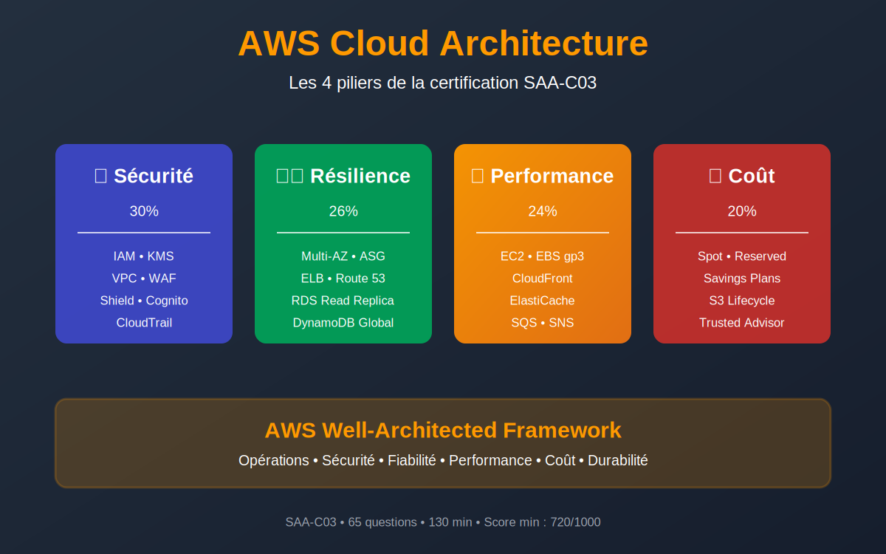
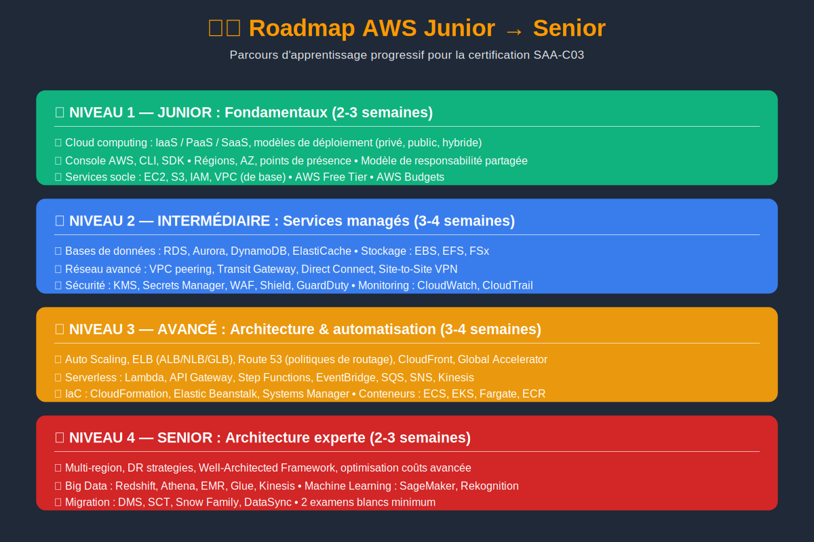
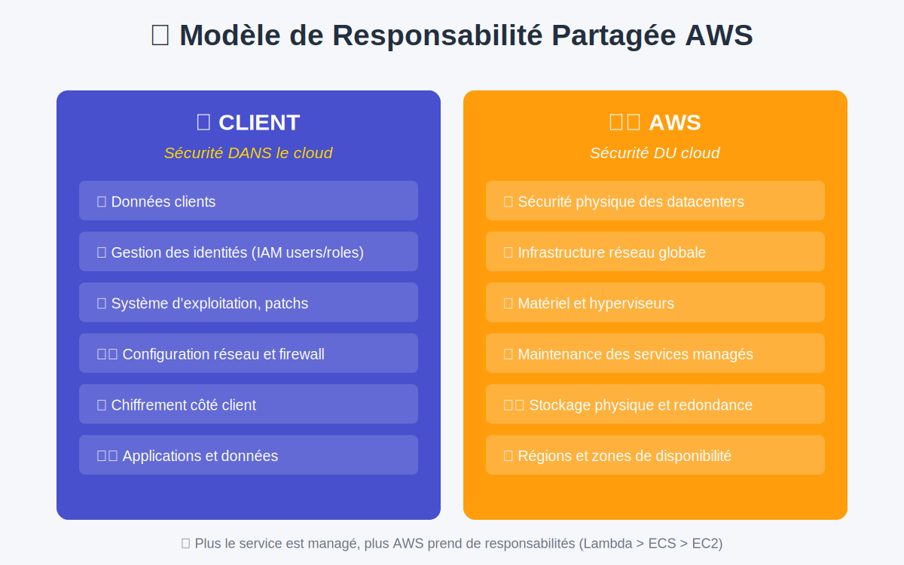
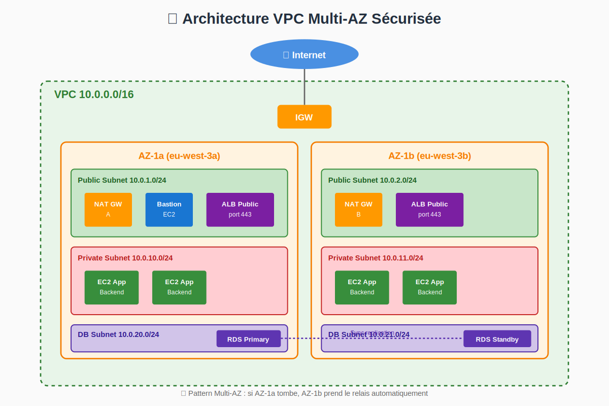
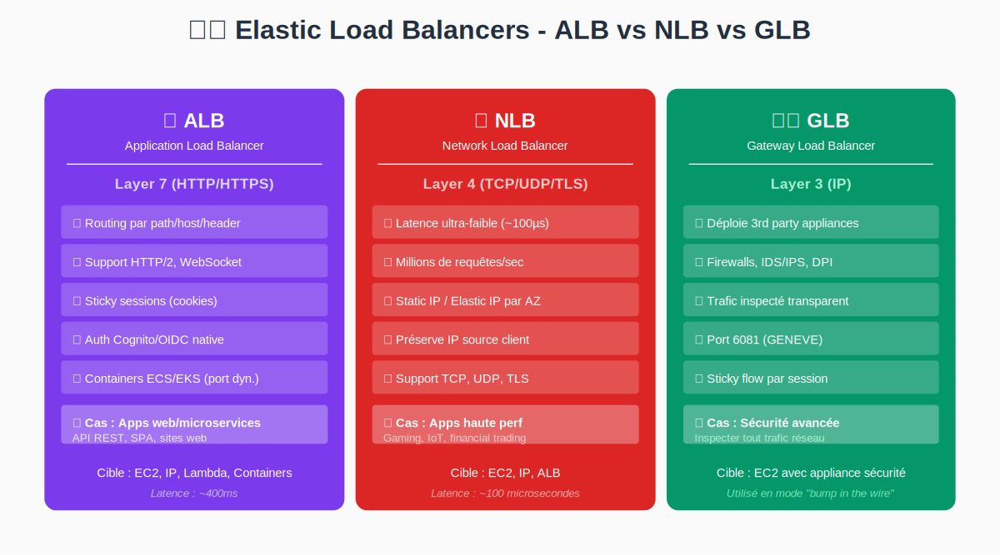
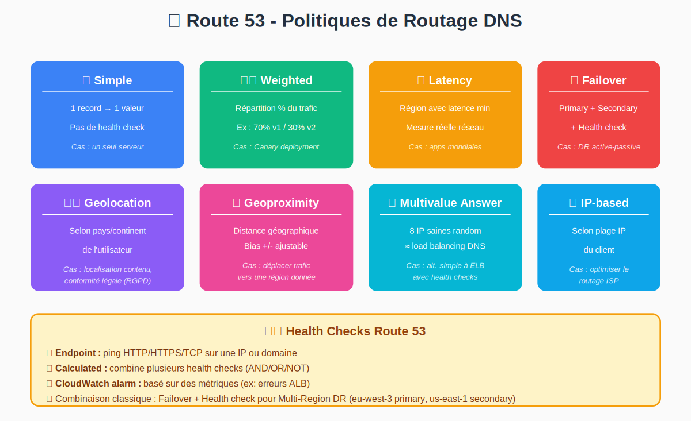
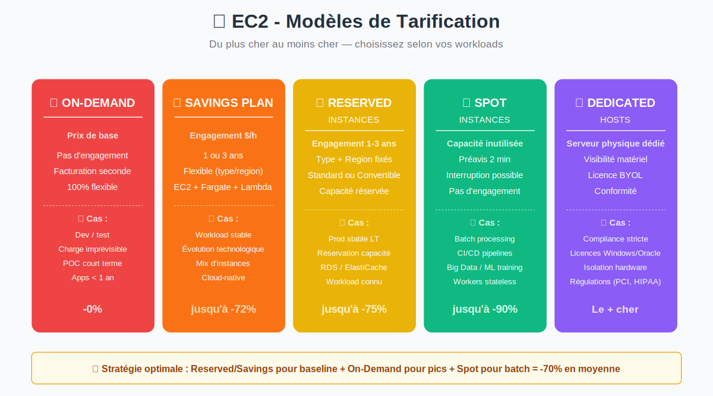
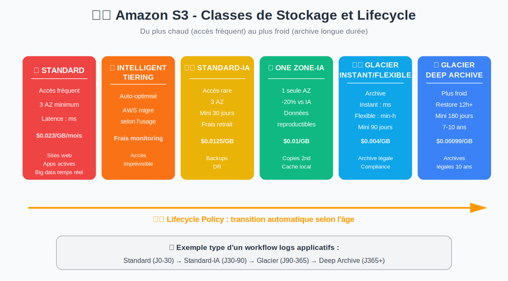
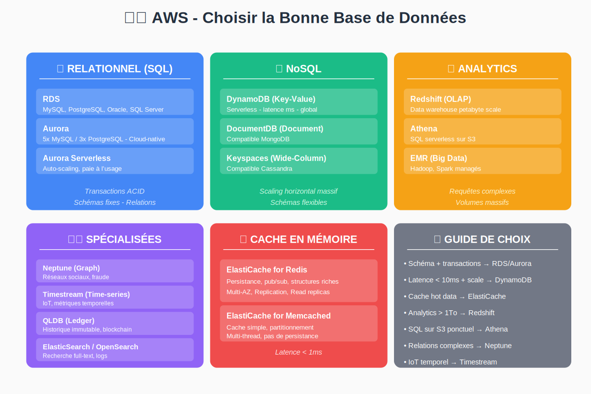
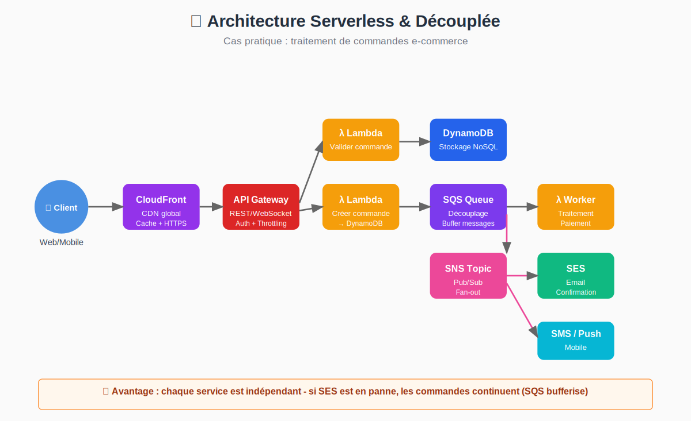

<!-- # 📚 AWS Cloud + Certification SAA-C03 — Documentation complète -->

> **Documentation complète en français** pour maîtriser AWS Cloud et préparer la certification **AWS Solutions Architect Associate (SAA-C03)**.
>
> **Niveau** : Junior → Senior · **Région de référence** : eu-west-3 (Paris) · **Date** : 2026

---

## 📑 Table des matières

### Partie 1 — Fondamentaux du cloud
- [Introduction au cloud computing](#cloud-computing)
- [Architecture AWS : Régions, AZ, Edge](#architecture-aws)
- [Démarrer avec AWS](#demarrer-aws)

### Partie 2 — Les 4 domaines de l'examen SAA-C03
- [Vue d'ensemble de l'examen](#vue-ensemble-saa-c03)
- [Domaine 1 — Sécurité (30%)](#domaine-1-securite)
- [Domaine 2 — Résilience (26%)](#domaine-2-resilience)
- [Domaine 3 — Performance (24%)](#domaine-3-performance)
- [Domaine 4 — Coûts (20%)](#domaine-4-couts)

### Partie 3 — Services AWS par catégorie
- [Calcul (EC2, Lambda, ECS, Fargate)](#services-calcul)
- [Stockage (S3, EBS, EFS, FSx)](#services-stockage)
- [Bases de données (RDS, Aurora, DynamoDB)](#services-bases-de-donnees)
- [Réseau et CDN (VPC, Route 53, CloudFront)](#services-reseau)
- [Sécurité (IAM, KMS, GuardDuty, WAF)](#services-securite)
- [Intégration (SQS, SNS, EventBridge, Kinesis)](#services-integration)
- [Analytics et ML (Athena, Glue, SageMaker, Bedrock)](#services-analytics-ml)
- [Management (CloudFormation, SSM, Organizations)](#services-management)

### Partie 4 — Architectures de référence
- [10 patterns d'architecture](#patterns-architecture)
- [Cas pratique fil rouge : French Bakery](#french-bakery)

### Partie 5 — Préparation à l'examen
- [Cheat sheets de révision](#cheatsheets)
- [50 questions commentées](#questions-reponses)

---


<a id="introduction"></a>

# AWS Cloud & Certification SAA-C03

> *Documentation complète AWS, du niveau junior au niveau avancé, avec préparation à la certification AWS Solutions Architect Associate (SAA-C03).*

## ☁️ AWS Cloud & Certification SAA-C03





### 🎯 À qui s'adresse cette documentation ?

Cette documentation couvre **AWS de A à Z**, du débutant total au candidat senior préparant la certification **AWS Certified Solutions Architect – Associate (SAA-C03)**.


  
**🌱 Débutant**

    Tu veux comprendre **le cloud computing** et les **bases d'AWS** ? Commence par les fondamentaux.
  

  
**🚀 Intermédiaire**

    Tu connais les bases et veux **maîtriser les services managés** (RDS, S3, Lambda...) ? Va aux services.
  

  
**⚡ Avancé**

    Tu construis déjà sur AWS et veux **concevoir des architectures complexes** ? Lis les patterns d'architecture.
  

  
**🏆 Certification**

    Tu vises la certification **SAA-C03** ? Suis le parcours dédié et fais les examens blancs.
  


### 🗺️ Parcours d'apprentissage





### 📚 Plan de la documentation

#### 1️⃣ Fondamentaux du Cloud

- **🌥️ Qu'est-ce que le Cloud Computing ?** — IaaS, PaaS, SaaS, cloud public/privé/hybride : les concepts essentiels avec analogies simples.
- **🏢 Architecture globale AWS** — Régions, zones de disponibilité, points de présence, responsabilité partagée.
- **🛠️ Démarrer avec AWS** — Compte AWS, Console, CLI, SDK, Free Tier, AWS Budgets.

#### 2️⃣ Préparer la certification SAA-C03

- **📜 Vue d'ensemble SAA-C03** — Structure de l'examen, 4 domaines, planning de révision optimisé (Pareto 80/20).
- **🔐 Domaine 1 — Sécurité (30%)** — IAM, KMS, VPC, WAF, Shield, encryption — le domaine avec le plus de poids.
- **♻️ Domaine 2 — Résilience (26%)** — Multi-AZ, Multi-Region, ASG, ELB, Route 53 failover, DynamoDB Global Tables.
- **⚡ Domaine 3 — Performance (24%)** — CloudFront, ElastiCache, choix EC2/EBS, découplage SQS/SNS, Aurora.
- **💰 Domaine 4 — Coûts (20%)** — Spot/Reserved/Savings, S3 lifecycle, Cost Explorer, Trusted Advisor.

#### 3️⃣ Services AWS par catégorie

- **🖥️ Calcul (Compute)** — EC2, Lambda, ECS, EKS, Fargate, Elastic Beanstalk, Batch, Lightsail.
- **🗄️ Stockage** — S3, EBS, EFS, FSx, Storage Gateway, Snow Family, Backup.
- **🗃️ Bases de données** — RDS, Aurora, DynamoDB, ElastiCache, Redshift, DocumentDB, Neptune.
- **🌐 Réseau** — VPC, Route 53, CloudFront, Direct Connect, Transit Gateway, Global Accelerator.
- **🔐 Sécurité & Identité** — IAM, KMS, Secrets Manager, WAF, Shield, GuardDuty, Cognito, CloudTrail.
- **⚙️ Intégration & Messaging** — SQS, SNS, EventBridge, Step Functions, API Gateway, Kinesis, MSK.
- **📊 Analytics & ML** — Athena, Glue, EMR, QuickSight, Kinesis, SageMaker, Rekognition, Comprehend.
- **🔧 Management & Gouvernance** — CloudFormation, CloudWatch, Config, Organizations, Control Tower, Systems Manager.

#### 4️⃣ Patterns d'architecture

- **🏛️ Architectures de référence** — Web 3-tier, serverless, microservices, data lake — les blueprints AWS éprouvés.
- **🎯 Cas pratique : French Bakery** — Modernisation complète d'une PME avec migration progressive vers AWS.

#### 5️⃣ Révision & Examen

- **📝 Cheatsheet examen SAA-C03** — Anti-sèches synthétiques par service pour les dernières révisions.
- **❓ Q/R typiques de l'examen** — Questions/Réponses commentées par domaine avec pièges à éviter.

### ⚙️ L'examen SAA-C03 en bref


> 💡 **Astuce** — Caractéristiques de l'examen
>
> - **Format** : 65 questions à choix multiples / réponses multiples
> - **Durée** : 130 minutes
> - **Score minimum** : 720 / 1000
> - **Coût** : 150 USD
> - **Validité** : 3 ans
> - **Langues** : Anglais, français, allemand, japonais, coréen, espagnol, chinois simplifié


### 🎓 Niveaux de certification AWS

| Niveau | Certification |
|--------|---------------|
| 🎯 **Foundational** | Cloud Practitioner (CLF-C02) |
| 🌟 **Associate** | **Solutions Architect (SAA-C03)** ⬅️ cette doc, Developer, SysOps |
| 🚀 **Professional** | Solutions Architect Professional, DevOps Engineer Professional |
| 🎖️ **Specialty** | Security, Networking, Machine Learning, Database, Data Analytics |

### 💡 Comment utiliser cette documentation ?


1. **Si tu pars de zéro** → lis les fondamentaux dans l'ordre, sans sauter.

2. **Si tu as déjà des bases** → va directement aux 4 domaines SAA-C03.

3. **Pour préparer l'examen** → suis le planning de révision (3 semaines) avec les examens blancs.

4. **En usage quotidien** → utilise la doc comme reference (Ctrl+F est ton ami).


> 📝 **Note**
>
> Cette documentation est inspirée du livre "AWS Architecte Associate" (SAA-C03), avec un cas pratique fil rouge — la modernisation de la PME **French Bakery** — qui illustre comment chaque service s'intègre dans une vraie architecture.


<a id="cloud-computing"></a>

# Qu'est-ce que le Cloud Computing ?

> *Comprendre le cloud avec des analogies simples - IaaS, PaaS, SaaS, modèles de déploiement.*

### 🤔 C'est quoi le cloud, vraiment ?

#### Analogie simple : l'électricité

Tu n'as pas une **centrale électrique chez toi**. Tu branches ton frigo, ta prise, et tu paies **à la consommation** (kWh). EDF gère la production, la distribution, la maintenance.

➡️ **Le cloud, c'est pareil avec l'informatique** : tu loues de la puissance de calcul, du stockage, de la bande passante chez un fournisseur (AWS, Azure, GCP), et tu **paies seulement ce que tu utilises**.

```
🏠 ON-PREMISE (traditionnel)        ☁️ CLOUD
─────────────────────              ─────────────
Tu achètes des serveurs            Tu loues à l'heure / seconde
Tu paies l'électricité             AWS s'en occupe
Tu gères la sécurité physique       AWS s'en occupe
Tu remplaces le matériel cassé     AWS s'en occupe
Tu dimensionnes "au pic"           Tu scales automatiquement
CapEx (investissement)             OpEx (charge)
```

### 🎁 Les 5 caractéristiques essentielles (NIST)


  
**📦 Self-service à la demande**

> Tu provisionnes des ressources **en quelques clics** , sans appeler un commercial.


  
**🌐 Accès réseau étendu**

> Accessible via **Internet**, depuis n'importe quel terminal (PC, mobile, IoT).
  

  
**🏊 Mise en commun des ressources**

> Plusieurs clients partagent l'infrastructure (**mutualisation**, économies d'échelle).
  
  
**⚡ Élasticité rapide**

> Tes ressources s'**ajustent automatiquement** à la demande (scaling).
  

  
**📊 Service mesuré**

> Tu paies **uniquement ce que tu consommes** (par seconde, par requête, par Go).
  
:::note

**NIST** (Institut National des Normes et de la Technologie - National Institute of Standards and Technology) : C'est une agence du gouvernement américain (qui dépend du ministère du Commerce). Bien qu'il soit américain, ses définitions font autorité dans le monde entier, notamment pour le Cloud Computing et la Cybersécurité.

:::

### 🏠 Les 3 modèles de déploiement

#### ☁️ Cloud public

**Exemples** : AWS, Azure, Google Cloud Platform.

L'infrastructure appartient au fournisseur, **mutualisée** entre milliers de clients.

✅ **Avantages** : pas d'investissement initial, scaling illimité, services managés.
❌ **Inconvénients** : dépendance au fournisseur, contraintes réglementaires possibles.

#### 🔒 Cloud privé

Infrastructure **dédiée à une seule organisation**, hébergée chez le client ou chez un prestataire.

✅ **Avantages** : contrôle total, isolation forte, conformité stricte (banque, défense).
❌ **Inconvénients** : coût élevé, élasticité limitée, gestion lourde.

#### 🤝 Cloud hybride

**Combinaison cloud public + privé/on-premise**. Les données sensibles restent en local, le reste dans le cloud public.

✅ **Cas typiques** :
- Application métier sur site + sauvegardes S3
- Site web sur AWS + base SQL dans le datacenter
- Burst : extension cloud pendant les pics de charge


> 💡 **Astuce** — AWS Outposts
>
> Pour faire du cloud hybride "à la AWS", AWS propose **Outposts** : des racks AWS livrés et installés **dans ton datacenter**. Tu utilises les mêmes API qu'AWS, mais en local.


### 🍰 Les 3 modèles de service : IaaS, PaaS, SaaS

L'analogie de la pizza (image culte du cloud) :

```
                On premise   IaaS      PaaS      SaaS
                ──────────  ────      ────      ────
Application       Toi       Toi       Toi       Fournisseur
Données           Toi       Toi       Toi       Fournisseur
Runtime           Toi       Toi       Fournisseur Fournisseur
Middleware        Toi       Toi       Fournisseur Fournisseur
OS                Toi       Toi       Fournisseur Fournisseur
Virtualisation    Toi       Fournisseur Fournisseur Fournisseur
Serveurs          Toi       Fournisseur Fournisseur Fournisseur
Stockage          Toi       Fournisseur Fournisseur Fournisseur
Réseau            Toi       Fournisseur Fournisseur Fournisseur

Analogie pizza :  Tu fais   Tu loues   Tu loues    Tu manges
                  tout      la cuisine la pizzeria au restaurant
```


###### 📑 🧱 IaaS - Infrastructure as a Service

**Tu loues l'infrastructure brute** (serveurs, réseau, stockage). Tu gères l'OS, les middlewares, les apps.

**Exemples AWS** :
- **EC2** (machines virtuelles)
- **EBS** (disques)
- **VPC** (réseau)
- **S3** (stockage objet)

**Quand l'utiliser ?**
- Migration "lift & shift" depuis on-premise
- Besoin d'un contrôle fin de l'OS
- Apps legacy


###### 📑 🏗️ PaaS - Platform as a Service

**Tu loues une plateforme prête à l'emploi** pour déployer ton code. Tu ne gères pas l'OS ni les patchs.

**Exemples AWS** :
- **Elastic Beanstalk** (apps web déployées en quelques clics)
- **RDS** (bases de données managées)
- **ECS Fargate** (containers sans serveur)
- **Lambda** (functions serverless)

**Quand l'utiliser ?**
- Tu veux te concentrer sur le code, pas l'infra
- Start-up qui veut aller vite
- Apps cloud-native


###### 📑 📱 SaaS - Software as a Service

**Tu utilises directement le logiciel**, hébergé par le fournisseur. Tu paies à l'usage ou en abonnement.

**Exemples** :
- Gmail, Office 365, Slack, Salesforce, Notion
- **AWS-side** : Amazon WorkDocs, Amazon WorkMail, Amazon Connect

**Quand l'utiliser ?**
- Outils métier classiques
- Pas besoin de réinventer la roue


### 💪 Avantages et défis du cloud

#### ✅ Avantages

| Avantage | Explication |
|----------|-------------|
| 💰 **CapEx → OpEx** | Pas d'investissement initial. Paiement à l'usage. |
| 📈 **Économies d'échelle** | AWS achète en gros, te répercute des prix bas. |
| ⚡ **Élasticité** | Tu scales en quelques secondes (un script Black Friday). |
| 🌍 **Reach global** | Déploie dans 30+ régions en 1 commande. |
| 🚀 **Time to market** | De l'idée au prototype en heures, pas en mois. |
| 🔐 **Sécurité de niveau bancaire** | Certifications ISO, PCI-DSS, HIPAA, SOC. |
| 🔧 **Services managés** | RDS, Lambda… moins de plomberie, plus de valeur. |

#### ⚠️ Défis

| Défi | Comment l'adresser |
|------|--------------------|
| 🔒 **Conformité (RGPD…)** | Choisir les régions EU, chiffrement KMS, AWS Config |
| 💸 **Surprises de facturation** | AWS Budgets, Cost Explorer, tags obligatoires |
| 🔗 **Vendor lock-in** | Utiliser des services standards (Kubernetes, PostgreSQL) |
| 👨‍💼 **Compétences** | Certifications AWS, formation continue |
| 🚦 **Latence réseau** | CloudFront, Global Accelerator, choix de région |
| 🌐 **Sécurité applicative** | Modèle de responsabilité partagée → c'est à toi |


> ⚠️ **Attention** — Le piège du cloud
>
> "Le cloud est plus cher quand on l'utilise mal."
>
> Un EC2 t3.large allumé 24/7 sans en avoir besoin coûte plus cher qu'un serveur dédié. Le cloud n'est rentable que si tu **arrêtes ce qui ne sert pas** et que tu choisis le **bon service** pour chaque besoin.


### 🎯 Récap pour la certification

- Le cloud = **IaaS, PaaS, SaaS** + **modèles de déploiement** (privé/public/hybride)
- 5 caractéristiques **NIST** : self-service, accès réseau, mutualisation, élasticité, mesuré
- AWS propose IaaS (EC2), PaaS (Beanstalk, RDS, Lambda) et un peu de SaaS (WorkDocs…)
- Le cloud hybride avec AWS = **Outposts**, **Storage Gateway**, **Direct Connect**, **VMware Cloud on AWS**

### ➡️ Étape suivante

Maintenant que tu comprends ce qu'est le cloud, voyons **comment AWS est organisé géographiquement** : régions, AZ, points de présence.


<a id="architecture-aws"></a>

# Architecture globale AWS

> *Régions, zones de disponibilité, points de présence, modèle de responsabilité partagée et Well-Architected Framework.*

### 🌍 La géographie d'AWS

AWS découpe son infrastructure mondiale en **3 couches imbriquées** :

```
🌎 RÉGION (Region)               → grande zone géographique (ex: eu-west-3 = Paris)
   └── 📍 AZ (Availability Zone) → datacenter(s) indépendant(s) dans la région
        └── 🏢 Edge Location     → points de présence pour CloudFront / Route 53
```

#### 🗺️ Régions

Une **région** est une **zone géographique distincte** (ex: Paris, Francfort, Londres, N. Virginia).

- AWS compte actuellement **30+ régions** dans le monde
- Chaque région contient **2 à 6 zones de disponibilité (AZ)**
- Les régions sont **totalement indépendantes** : une panne dans `us-east-1` n'affecte pas `eu-west-3`

**Comment choisir une région ?**

| Critère | Exemple |
|---------|---------|
| **Latence** | Proche de tes utilisateurs (clients en France → `eu-west-3` Paris) |
| **Conformité** | RGPD → rester en Europe (`eu-west-1` Dublin, `eu-west-3` Paris, `eu-central-1` Francfort) |
| **Coût** | `us-east-1` (N. Virginia) est souvent la moins chère |
| **Services disponibles** | Tous les services ne sont pas dans toutes les régions |
| **Souveraineté** | AWS Sovereign Cloud pour l'Europe (en cours) |

#### 📍 Zones de disponibilité (AZ)

Une **AZ** est un ou plusieurs **datacenters indépendants** (alimentation, refroidissement, réseau séparés) dans une région.

- Les AZ d'une même région sont **physiquement séparées** (plusieurs km), mais reliées par un **réseau privé à faible latence** (< 1ms)
- Une AZ peut tomber sans affecter les autres → **base de la haute disponibilité**
- Nommage : `eu-west-3a`, `eu-west-3b`, `eu-west-3c`


> 💡 **Astuce** — Pattern Multi-AZ
>
> Pour qu'une application soit **résiliente**, elle doit être déployée dans **au moins 2 AZ** (minimum 3 pour la plupart des services managés AWS comme RDS, Aurora). Si une AZ tombe (incendie, panne réseau), l'app continue de fonctionner dans l'autre.


#### 🏢 Edge Locations (Points de présence)

Les **edge locations** sont **plus nombreuses que les régions** (400+). Elles servent à mettre en cache du contenu **proche des utilisateurs finaux**.

**Services qui les utilisent** :
- **CloudFront** : CDN (cache de contenu statique)
- **Route 53** : DNS rapide
- **Global Accelerator** : optimisation du routage
- **Lambda@Edge** : exécution de code à la périphérie

```
Utilisateur Paris → Edge Paris (cache hit) → Réponse en 5ms ⚡
Utilisateur Paris → Edge Paris (cache miss) → eu-west-3 → 30ms
```

### 🤝 Le modèle de responsabilité partagée





C'est **LA notion clé** de la sécurité AWS (et un classique de l'examen).

#### Responsabilité d'AWS : sécurité **DU** cloud

AWS gère **tout ce qui est en dessous de l'hyperviseur** :

- 🏢 Sécurité physique des datacenters (gardes, caméras, badges)
- ⚡ Alimentation, refroidissement, redondance
- 🌐 Câblage réseau et fibre
- 🛡️ Patchs des hyperviseurs
- 🗄️ Maintenance du matériel

#### Responsabilité du client : sécurité **DANS** le cloud

Toi (client AWS), tu es responsable de :

- 🔑 **IAM** : créer les utilisateurs, rôles, politiques
- 💻 **OS guest** : patches Windows/Linux sur tes EC2
- 🔥 **Firewall applicatif** : configurer les Security Groups, NACL
- 🔒 **Chiffrement de tes données** : choisir KMS, configurer S3 SSE
- 📦 **Données** : tu es propriétaire, tu en réponds (RGPD…)
- ⚙️ **Configuration des services** : ne pas mettre un bucket S3 public par erreur !

#### 🎚️ Le curseur bouge selon le service

```
Plus le service est managé, plus AWS prend de responsabilités :

  EC2          ECS          Fargate       Lambda
  ─────       ──────        ────────      ──────
  Toi gères   Toi gères     Toi gères     Toi gères
  OS + app    le container  juste l'app   juste le code
                            
  AWS gère    AWS gère      AWS gère      AWS gère TOUT
  infra      infra+orchestr  l'orchestr.   sauf le code
```


> ⚠️ **Attention** — Piège classique
>
> "Avec S3, est-ce qu'AWS chiffre automatiquement mes données ?"
>
> Depuis 2023 → **OUI** (chiffrement SSE-S3 par défaut activé).
>
> Mais **avant**, c'était au client de l'activer. Et le contrôle d'accès (bucket privé / public) reste **TA** responsabilité. Un bucket S3 mal configuré qui fuite, c'est ta faute, pas celle d'AWS.


### 🏛️ AWS Well-Architected Framework

Le **Well-Architected Framework** est un ensemble de bonnes pratiques publié par AWS pour concevoir des architectures solides. Il s'articule autour de **6 piliers** :


  
**🛡️ Sécurité**

    Protéger les informations, systèmes et ressources. Principe : least privilege, défense en profondeur, traçabilité.
  

  
**⏱️ Fiabilité**

    Capacité à récupérer en cas de panne. Tester les sauvegardes, automatiser le recovery, scaling horizontal.
  

  
**🚀 Efficacité opérationnelle**

    Faire fonctionner et surveiller les systèmes. IaC, observabilité, runbooks, post-mortems.
  

  
**⚡ Performance**

    Utiliser efficacement les ressources. Sélection adaptée des services, mesure, expérimentation.
  

  
**💰 Optimisation des coûts**

    Maximiser la valeur business. Modèles de tarification, dimensionnement, analyses Cost Explorer.
  

  
**🌱 Durabilité**

    Minimiser l'impact environnemental. Régions à faible carbone, services managés, optimisation.
  


#### 🛠️ AWS Well-Architected Tool

C'est un **service gratuit** dans la console qui te fait passer un **questionnaire** sur ton architecture, puis te donne :
- Une liste de **risques** détectés
- Des **recommandations** AWS officielles
- Des **améliorations** prioritaires

➡️ À utiliser **avant chaque passage en production**.

### 🎯 Récap pour la certification


1. **Région** = zone géographique. Choisir selon **latence**, **conformité**, **coût**, **services disponibles**.

2. **AZ** = datacenter indépendant. Toujours **minimum 2 AZ** pour la HA.

3. **Edge location** = cache CloudFront et résolution Route 53.

4. **Responsabilité partagée** : AWS = sécurité **DU** cloud, toi = sécurité **DANS** le cloud.

5. **Well-Architected** = 6 piliers à connaître par cœur pour l'examen.


> 📝 **Note** — Question piège fréquente
>
> **"Quelle est la meilleure pratique pour atteindre 99.99% de disponibilité ?"**
>
> ❌ Mauvaise réponse : "Une instance EC2 plus grosse"
> ✅ Bonne réponse : **Déploiement Multi-AZ** (et idéalement Multi-Region pour le DR)


### ➡️ Étape suivante

Tu connais maintenant l'organisation d'AWS. Apprenons à **interagir avec AWS** : console, CLI, SDK.


<a id="demarrer-aws"></a>

# Démarrer avec AWS

> *Création du compte, console, CLI, SDK, Free Tier, AWS Budgets et bonnes pratiques de démarrage.*

### 🚀 Créer son compte AWS


1. **Va sur [aws.amazon.com](https://aws.amazon.com/)** → "Créer un compte AWS".

2. **Renseigne** un email, un mot de passe fort, un nom de compte.

3. **Choisis "Personnel"** (ou "Entreprise" si tu as une SIRET).

4. **Ajoute une carte de crédit** valide. AWS débite **1$ pour vérification**, qui est remboursé.

5. **Vérifie ton numéro de téléphone** (SMS ou appel).

6. **Choisis le plan de support** : `Basic` (gratuit) suffit pour débuter.


> ⚠️ **Attention** — 🛡️ Sécurise immédiatement ton compte root
>
> Une fois le compte créé, **arrête tout** et fais ces 3 actions :
>
> 1. **Active le MFA** sur le compte root (Authy, Google Authenticator)
> 2. **Crée un utilisateur IAM admin** : ne te connecte plus jamais en root au quotidien
> 3. **Configure AWS Budgets** : alerte si tu dépasses 5€/mois (au cas où…)


### 🖥️ AWS Management Console

C'est l'**interface web** : `console.aws.amazon.com`.

```
┌─────────────────────────────────────────────────────────────┐
│  ☰ AWS Console        🔍 [Rechercher service]       👤 ▼   │
├─────────────────────────────────────────────────────────────┤
│  📍 eu-west-3 (Paris) ▼                                     │  ← Bien vérifier ta région !
├─────────────────────────────────────────────────────────────┤
│  🏠 Services    Favoris    Récemment visités                │
│                                                             │
│  Compute        Storage         Database     Networking     │
│  ├ EC2          ├ S3            ├ RDS        ├ VPC          │
│  ├ Lambda       ├ EBS           ├ DynamoDB   ├ Route 53     │
│  └ ECS          └ EFS           └ Aurora     └ CloudFront   │
└─────────────────────────────────────────────────────────────┘
```

**Astuce** : utilise la **barre de recherche** (`Alt+S`) plutôt que de naviguer dans les menus.


> 💡 **Astuce** — Toujours vérifier ta région
>
> Erreur classique : tu lances un EC2 dans `us-east-1` par défaut, alors que tes utilisateurs sont en France. Vérifie le **sélecteur de région** en haut à droite **avant** chaque action.


### 💻 AWS CLI

L'**AWS CLI** est l'outil en ligne de commande pour piloter AWS. **Indispensable** dès qu'on automatise quoi que ce soit.

#### Installation


###### 📑 🐧 Linux / WSL

```bash
curl "https://awscli.amazonaws.com/awscli-exe-linux-x86_64.zip" -o "awscliv2.zip"
unzip awscliv2.zip
sudo ./aws/install
aws --version
```


###### 📑 🍎 macOS

```bash
brew install awscli
aws --version
```


###### 📑 🪟 Windows

Télécharger [AWSCLIV2.msi](https://awscli.amazonaws.com/AWSCLIV2.msi) puis :

```powershell
aws --version
```


#### Configuration

```bash
aws configure
## AWS Access Key ID [None]: AKIA...
## AWS Secret Access Key [None]: ...
## Default region name [None]: eu-west-3
## Default output format [None]: json
```


> ⚠️ **Attention** — Ne jamais commit ses clés !
>
> Les credentials sont stockés dans `~/.aws/credentials`. **JAMAIS** dans ton dépôt Git.
>
> Mieux : utilise `aws configure sso` (SSO) ou des **rôles IAM** sur les EC2 / containers (pas de clé du tout).


#### Commandes essentielles

```bash
## Lister les buckets S3
aws s3 ls

## Lister les instances EC2 en eu-west-3
aws ec2 describe-instances --region eu-west-3 \
  --query 'Reservations[].Instances[].[InstanceId,State.Name,InstanceType]' \
  --output table

## Lancer une instance EC2
aws ec2 run-instances --image-id ami-0abc... --instance-type t3.micro --key-name my-key

## Copier un fichier vers S3
aws s3 cp ./file.txt s3://mon-bucket/

## Lister les fonctions Lambda
aws lambda list-functions

## Vérifier quel utilisateur on est
aws sts get-caller-identity
```

### 🛠️ AWS SDK

Pour intégrer AWS **dans tes applications**, utilise un SDK.

**SDKs officiels** : Python (boto3), JavaScript/TypeScript, Java, .NET, Go, Ruby, PHP, Rust, Kotlin, Swift, C++.

#### Exemple Python (boto3)

```python
import boto3

## S'authentifie automatiquement avec ~/.aws/credentials ou rôle IAM
s3 = boto3.client('s3', region_name='eu-west-3')

## Lister les buckets
response = s3.list_buckets()
for bucket in response['Buckets']:
    print(bucket['Name'])

## Uploader un fichier
s3.upload_file('local.txt', 'mon-bucket', 'dossier/cle.txt')
```

#### Exemple JavaScript (AWS SDK v3)

```javascript

const s3 = new S3Client({ region: "eu-west-3" });

const data = await s3.send(new ListBucketsCommand({}));
console.log(data.Buckets);
```

### 🎁 AWS Free Tier

AWS offre un **niveau gratuit** pour tester les services.

#### 3 types de gratuités

| Type | Exemple |
|------|---------|
| 🆓 **Always free** (toujours gratuit) | Lambda : 1M requêtes/mois, DynamoDB : 25 Go |
| ⏳ **12 mois gratuit** (depuis l'inscription) | EC2 t2.micro : 750h/mois, S3 : 5 Go, RDS db.t3.micro : 750h/mois |
| 🎯 **Trials** (essai limité dans le temps) | SageMaker : 2 mois, Redshift : 2 mois |


> 💡 **Astuce** — Le détail qui sauve
>
> Si tu lances 2 EC2 t2.micro en même temps, tu consommes 2×750h = 1500h dans le mois → **tu dépasses** le Free Tier. Le Free Tier compte sur **l'ensemble des instances**, pas par instance.


### 💸 AWS Budgets

**Crée TOUJOURS un budget** sur ton compte AWS, surtout en formation.


1. Console AWS → recherche "**Budgets**".

2. **Créer un budget** → "Cost budget" (budget de coût).

3. **Budget mensuel** : par exemple `10 USD`.

4. **Alerte** : envoie un email quand tu atteins **50%**, **80%**, et **100%** du budget.

5. **Sauvegarder**.


```yaml
## Exemple de budget via AWS CLI
aws budgets create-budget \
  --account-id 123456789012 \
  --budget '{
    "BudgetName": "MonBudget",
    "BudgetLimit": {"Amount": "10", "Unit": "USD"},
    "TimeUnit": "MONTHLY",
    "BudgetType": "COST"
  }'
```


> ⚠️ **Attention** — Cas vécu - drame du week-end
>
> Un étudiant lance un EC2 `p3.2xlarge` (GPU) pour tester du Machine Learning, **oublie** de l'éteindre le vendredi.
>
> **Lundi matin** : facture de **300€** pour 72h de GPU. AWS rembourse parfois la 1ère fois, jamais la 2ème.
>
> **Leçon** : Budget alerte à 10€ = email après 2h sur du GPU. Tu réagis avant le drame.


### 📊 Cost Explorer et Trusted Advisor

#### 🔍 AWS Cost Explorer

Outil de **visualisation des coûts** historiques et futurs.

- Voir les coûts par service / par tag / par compte
- **Forecast** : prédire la facture du mois en cours
- Filtrer par région, par type d'instance
- Recommandations d'**instances réservées** et **Savings Plans**

#### 💡 AWS Trusted Advisor

**Assistant intelligent** qui analyse ton compte selon **5 piliers** :

| Pilier | Exemple de recommandation |
|--------|---------------------------|
| 💰 **Coût** | "L'instance i-abc123 est inutilisée depuis 14 jours, économise 30€/mois" |
| ⚡ **Performance** | "Ton RDS atteint 95% CPU, augmente la taille" |
| 🛡️ **Sécurité** | "Le bucket S3 'xyz' est public, est-ce voulu ?" |
| ⏱️ **Tolérance aux pannes** | "Ton RDS n'est pas Multi-AZ, ajoute la HA" |
| 📈 **Limites de service** | "Tu approches la limite des 5 VPC par région" |

➡️ Plus tu paies cher en support, plus tu as de checks (le plan Basic en a 7, le plan Business en a 100+).

### 🏷️ Le tagging : la base de l'organisation

Mets des **tags** sur **toutes tes ressources** dès le jour 1.

```yaml
Environment: production    # ou dev, staging
Project: french-bakery
Owner: marie@frenchbakery.fr
CostCenter: marketing
Application: web-frontend
```

**Pourquoi ?**
- Filtrer Cost Explorer par projet/équipe
- **Allocation des coûts** automatique
- Politiques IAM par tag (ABAC)
- Automatisation (Lambda déclenchée sur ressources `Environment=prod`)
- **Cost Allocation Tags** pour la facturation détaillée

### 🎯 Récap


1. **Sécurise ton compte root** : MFA + utilisateur admin IAM + budget alerte.

2. **Choisis bien ta région** au début de chaque session.

3. **Configure ton AWS CLI** (`aws configure`) pour automatiser.

4. **Free Tier** = ton terrain de jeu, mais lis bien les limites.

5. **Tagging dès le jour 1** : sinon tu ne sauras jamais d'où viennent les coûts.


### ➡️ Étape suivante

Tu sais maintenant utiliser AWS. Plongeons dans les **4 domaines de l'examen SAA-C03**.


<a id="vue-ensemble-saa-c03"></a>

# Vue d'ensemble de la certification SAA-C03

> *Structure de l'examen, 4 domaines, planning de révision Pareto 80/20.*


### 📋 L'examen SAA-C03 en chiffres

| Caractéristique | Valeur |
|-----------------|--------|
| 📝 **Nom officiel** | AWS Certified Solutions Architect – Associate |
| 🔖 **Code** | SAA-C03 |
| 🕐 **Durée** | 130 minutes |
| 📊 **Nombre de questions** | 65 (50 notées + 15 non notées) |
| ✅ **Score minimum** | 720 / 1000 |
| 💵 **Prix** | 150 USD (ou 75 USD avec un voucher 50% du Practitioner) |
| 🌍 **Langues** | EN, FR, DE, ES, JA, KO, ZH |
| 🏆 **Validité** | 3 ans |
| 💻 **Format** | Pearson VUE (centre ou en ligne avec surveillance) |
| 🎯 **Niveau** | Associate (intermédiaire) |

### 📚 Les 4 domaines de l'examen

L'examen est structuré en **4 domaines** avec des poids différents :

| Domaine | Titre | Poids | Pages dédiées |
|---------|-------|-------|---------------|
| 1️⃣ | **Concevoir des architectures sécurisées** | **30%** | [→ Lire](#02-domaines-saa-c03-domaine-1-securite) |
| 2️⃣ | **Concevoir des architectures résilientes** | **26%** | [→ Lire](#02-domaines-saa-c03-domaine-2-resilience) |
| 3️⃣ | **Concevoir des architectures performantes** | **24%** | [→ Lire](#02-domaines-saa-c03-domaine-3-performance) |
| 4️⃣ | **Concevoir des architectures optimisées en coût** | **20%** | [→ Lire](#02-domaines-saa-c03-domaine-4-couts) |


> 💡 **Astuce** — Stratégie Pareto 80/20
>
> 80% des questions tombent sur **20% des services**. Concentre-toi sur :
> - **IAM** (omniprésent en sécurité)
> - **VPC** (réseau et sécurité)
> - **EC2 + Auto Scaling + ELB** (compute + résilience)
> - **S3** (stockage + tarification)
> - **RDS / Aurora / DynamoDB** (databases)
> - **Route 53 + CloudFront** (réseau et performance)
> - **Lambda + SQS + SNS** (serverless + découplage)
> - **KMS** (chiffrement)


### 🗺️ Roadmap d'apprentissage


### 📅 Planning de révision optimisé (3 semaines, 1h/jour)

Voici un planning éprouvé inspiré du livre **AWS Architecte Associate** :

#### 🔐 Semaine 1 — Domaines 1 & 2 (Sécurité + Résilience)

| Jour | Focus | Labs |
|------|-------|------|
| Lundi | **IAM** : users, groups, roles, policies, MFA | Créer une IAM policy + MFA obligatoire |
| Mardi | **VPC** : subnets, SG, NACL, NAT, IGW, Bastion | Déployer un VPC privé avec Bastion host |
| Mercredi | **KMS, Secrets Manager** | Chiffrer un bucket S3 avec KMS |
| Jeudi | **WAF, Shield, CloudFront sécurisé** | Activer WAF sur un ALB |
| Vendredi | **Multi-AZ, ASG, ELB** | EC2 + ELB + ASG avec scaling policy |
| Samedi | **Route 53 (failover, latency)** | Failover DNS Route 53 |
| Dimanche | **RDS Multi-AZ, Read Replicas, DynamoDB Global** | Snapshot S3 + restauration |

#### ⚡ Semaine 2 — Domaines 3 & 4 (Performance + Coûts)

| Jour | Focus | Labs |
|------|-------|------|
| Lundi | **EC2 types, EBS gp2/gp3/io1**, Placement Groups | Choisir le bon type EBS pour un workload |
| Mardi | **EFS, FSx, S3** (différences) | Déployer EC2 + EFS partagé |
| Mercredi | **CloudFront, ElastiCache (Redis/Memcached)** | Cache DynamoDB via ElastiCache |
| Jeudi | **SQS, SNS, EventBridge** | Découpler une app avec SQS |
| Vendredi | **Tarification EC2** : On-Demand, Reserved, Spot, Savings | Comparer coûts On-Demand vs Spot |
| Samedi | **S3 lifecycle**, Glacier, Deep Archive | Lifecycle policy → Glacier |
| Dimanche | **Cost Explorer, Budgets, Trusted Advisor** | Créer budget + alarme |

#### 🎓 Semaine 3 — Révisions finales

| Jour | Activité |
|------|----------|
| Lundi | **Examen blanc #1** (65 Q, 130 min) + analyse des erreurs |
| Mardi | Fiches de révision rapide (IAM, VPC, Route 53, S3, RDS) |
| Mercredi | **Examen blanc #2** + correction détaillée |
| Jeudi | Flashcards + pièges fréquents |
| Vendredi | Repos actif (lecture légère, vidéos courtes) |
| Samedi | **Jour J : l'examen !** |

### 🎯 Compétences évaluées

L'examen teste ta capacité à :


  
**🏛️ Concevoir**

    Architectures complètes : web app multi-tier, serverless, batch processing, big data...
  

  
**🔧 Choisir les services**

    Le bon service AWS pour chaque besoin (ex: SQS vs SNS vs EventBridge ?).
  

  
**🛡️ Sécuriser**

    IAM least privilege, chiffrement, segmentation réseau.
  

  
**💰 Optimiser**

    Trouver l'architecture qui répond au besoin **au meilleur coût**.
  

  
**📈 Scaler**

    Architectures qui supportent 10x, 100x, 1000x la charge.
  

  
**🔁 Faire face aux pannes**

    Multi-AZ, Multi-Region, Disaster Recovery (RTO/RPO).
  


### 📋 Format des questions

#### Types de questions

1. **Choix unique** : 1 bonne réponse parmi 4
2. **Choix multiple** : 2 ou 3 bonnes réponses parmi 5-6
3. **Scénarios longs** : un paragraphe de contexte + une question

#### Anatomie d'une question type

```
🎬 SCÉNARIO :
Une PME héberge un site WordPress sur une instance EC2 t3.medium 
en eu-west-3a. Le site est lent en heure de pointe. L'admin veut 
améliorer les performances ET la résilience SANS modifier le code.

❓ QUESTION : Quelle est la meilleure architecture ?

🔘 A. Augmenter la taille en t3.xlarge
🔘 B. Mettre l'EC2 derrière un ALB avec Auto Scaling Group multi-AZ,
       activer CloudFront, déplacer la DB vers RDS Multi-AZ
🔘 C. Migrer vers Lightsail
🔘 D. Ajouter un EFS partagé

✅ Réponse : B
   → Multi-AZ = résilience + ASG = scaling + CloudFront = perf
```

### 🚨 Pièges classiques à connaître

#### ⚠️ Confusion fréquentes

| ❌ Erreur courante | ✅ La bonne distinction |
|--------------------|-----------------------|
| "EC2 Multi-AZ" | EC2 = mono-AZ. Pour HA → ASG sur plusieurs AZ |
| "RDS Read Replica = HA" | Read Replica = perf en lecture. HA = **Multi-AZ** |
| "S3 = 100% durable" | 99.999999999% (11 neufs), disponibilité ≠ durabilité |
| "Security Group stateful, NACL aussi" | SG **stateful**, NACL **stateless** |
| "VPC Peering = transitif" | NON, pas de transitivité. Pour cela → Transit Gateway |
| "Lambda dans VPC = même perf" | NON, cold start réseau plus long en VPC |
| "Aurora Serverless = pas de coût quand idle" | Pas en v1 (capacité mini), v2 = scale to 0 partiel |

#### 🎯 Mots-clés qui orientent la réponse

| Mot-clé dans l'énoncé | Service à privilégier |
|-----------------------|----------------------|
| "**Real-time** streaming" | Kinesis Data Streams, MSK |
| "**Near real-time**" | Kinesis Data Firehose |
| "**Decouple**" / "**asynchronous**" | SQS, SNS |
| "**Distribute** to multiple subscribers" | SNS |
| "**Trigger** on AWS event" | EventBridge |
| "**Orchestrate workflow**" | Step Functions |
| "**Petabyte-scale analytics**" | Redshift |
| "**Ad-hoc SQL on S3**" | Athena |
| "**Highly available** AND **multi-region**" | Aurora Global, DynamoDB Global, Route 53 |
| "**Lowest cost** for archive" | S3 Glacier Deep Archive |
| "**Encryption** + key managed by customer" | KMS Customer Managed Key, ou CloudHSM |
| "**Fault tolerant**" | Multi-AZ minimum |
| "**Static** content" | S3 + CloudFront |
| "**Reduce latency** globally" | CloudFront, Global Accelerator |

### 🎯 Le jour de l'examen

#### Avant
- Bien dormir, manger normalement
- Vérifier ID + caméra si en ligne
- Arriver 30 min en avance si centre
- **Ne pas paniquer** si tu sèches sur les 5 premières questions, le score est sur 65

#### Pendant
- **130 minutes / 65 questions = 2 min/question**
- Si tu hésites > 1 min : flag la question, passe à la suivante
- À la fin, **toujours relire les questions flaggées**
- **Aucune pénalité** pour mauvaise réponse → réponds à TOUT

#### Stratégie pour les questions difficiles
1. **Éliminer** d'abord les 2 réponses clairement fausses
2. Entre les 2 restantes, choisir la plus **AWS-Way** (managée, scalable, sécurisée)
3. Si égalité → **la moins chère** (sauf si l'énoncé dit "le plus performant possible")


> 💡 **Astuce** — Astuce sémantique
>
> Les réponses **trop simples** ("ajouter un serveur plus gros") sont rarement les bonnes. AWS aime les architectures **multi-AZ, managées et automatisées**. Si une réponse contient `Auto Scaling`, `Multi-AZ`, `managed`, c'est souvent un bon signe.


### ➡️ Étape suivante

Plongeons dans le **Domaine 1 — Sécurité (30%)**, celui qui a le plus de poids dans l'examen.


<a id="domaine-1-securite"></a>

# Domaine 1 — Sécurité (30%)

> *IAM, KMS, VPC sécurisé, WAF, Shield, GuardDuty, chiffrement — le domaine avec le plus de poids.*

### 🎯 Objectifs du domaine

Le **Domaine 1 pèse 30%** de l'examen, c'est le plus important.

À l'issue, tu dois savoir :
1. **Concevoir des solutions** sécurisées **dans AWS**
2. Implémenter **IAM** correctement (least privilege)
3. **Protéger les données** au repos et en transit (KMS, encryption)
4. **Sécuriser le réseau** (VPC, SG, NACL, WAF, Shield)
5. **Tracer et auditer** (CloudTrail, Config, GuardDuty)


### 🔑 IAM (Identity and Access Management) — LE service central

IAM contrôle **qui peut faire quoi** sur AWS. Apparaît dans **40% des questions**.

#### 📦 Composants d'IAM

```
🏢 AWS Account
   │
   ├── 👤 Users (IAM Users)         → personnes/applis avec credentials propres
   ├── 👥 Groups                    → regroupement d'users (mêmes permissions)
   ├── 🎭 Roles                     → identité TEMPORAIRE pour services ou comptes
   └── 📜 Policies                  → DOCUMENTS JSON qui définissent les permissions
```

#### 👤 Users vs 🎭 Roles : différence clé

| | Users | Roles |
|---|-------|-------|
| **Credentials** | Clé access permanente | Tokens temporaires (1h par défaut) |
| **Usage** | Humains, scripts permanents | Services AWS (EC2, Lambda…), apps, cross-account |
| **Sécurité** | ⚠️ Risque si fuite | ✅ Plus sûr (auto-rotation) |
| **Bonne pratique** | Le moins possible | À privilégier partout |


> ⚠️ **Attention** — Règle d'or
>
> **JAMAIS** de credentials AWS hard-codés dans une app ou un EC2.
>
> ✅ Bonne pratique : créer un **rôle IAM** → l'attacher à l'EC2 → l'app récupère des **tokens temporaires** via le **metadata service**.


#### 📜 Anatomie d'une policy IAM

Les policies sont du **JSON** :

```json
{
  "Version": "2012-10-17",
  "Statement": [
    {
      "Sid": "AutoriserLectureBucketProd",
      "Effect": "Allow",
      "Action": ["s3:GetObject", "s3:ListBucket"],
      "Resource": [
        "arn:aws:s3:::bucket-prod",
        "arn:aws:s3:::bucket-prod/*"
      ],
      "Condition": {
        "IpAddress": {"aws:SourceIp": "203.0.113.0/24"},
        "Bool": {"aws:MultiFactorAuthPresent": "true"}
      }
    }
  ]
}
```

Les **6 éléments clés** :

| Élément | Rôle |
|---------|------|
| `Version` | Toujours `2012-10-17` (la dernière) |
| `Effect` | `Allow` ou `Deny` (Deny gagne toujours) |
| `Action` | Ce qui est autorisé : `s3:GetObject`, `ec2:RunInstances`... |
| `Resource` | Sur quelle ressource : ARN précis ou `*` |
| `Principal` | Qui (uniquement dans les **resource-based policies**) |
| `Condition` | Conditions supplémentaires : IP, MFA, heure... |

#### 🔧 Types de policies

| Type | Attachée à | Exemple |
|------|------------|---------|
| **Identity-based** | User, Group, Role | "Cet utilisateur peut lister S3" |
| **Resource-based** | S3 bucket, SQS queue, Lambda | "Ce bucket autorise le compte X à lire" |
| **Permission boundary** | User, Role | "Limite max" : ne peut pas avoir plus de permissions que ça |
| **SCP (Service Control Policy)** | OU AWS Organizations | "Aucun compte de l'org ne peut utiliser us-east-2" |
| **Session policy** | STS AssumeRole | Réduit les perms pour une session temporaire |
| **ACL** | S3, VPC | Hérité, à éviter sauf legacy |

#### ⚖️ Comment AWS évalue les permissions

```
1. Par défaut : TOUT EST INTERDIT (deny implicite)
2. Y a-t-il un Deny EXPLICITE ? → BLOQUE TOUT (priorité absolue)
3. Y a-t-il un Allow EXPLICITE ? → AUTORISE
4. Sinon → INTERDIT
```


> 💡 **Astuce** — Permission Boundaries vs SCP
>
> - **SCP** : limite ce que les **comptes membres** d'une AWS Organization peuvent faire (gouvernance globale)
> - **Permission Boundary** : limite ce qu'un **user ou rôle spécifique** peut faire (même s'il a une policy admin attachée)


#### 🛡️ Bonnes pratiques IAM

1. **Activer le MFA** sur le root + tous les utilisateurs sensibles
2. **Ne JAMAIS utiliser le root** au quotidien
3. **Least privilege** : ne donner que les permissions strictement nécessaires
4. **Roles** > Users pour les services
5. **Rotation des clés** d'access tous les 90 jours
6. **AWS IAM Access Analyzer** pour détecter les policies trop permissives
7. **CloudTrail** pour auditer toutes les actions IAM

#### 🔄 RBAC vs ABAC


###### 📑 🏷️ RBAC (Role-Based Access Control)

Permissions basées sur le **rôle** (job).

```
Marie est Développeur → Groupe "Devs" → Policy "DeveloperAccess"
Marie change de poste → On la déplace en "Architects"
```

**Avantage** : simple à comprendre.
**Inconvénient** : explosion des rôles quand l'org grandit (devs-team-A, devs-team-B...).


###### 📑 🏷️ ABAC (Attribute-Based Access Control)

Permissions basées sur des **attributs** (tags).

```json
{
  "Effect": "Allow",
  "Action": "ec2:StartInstances",
  "Resource": "*",
  "Condition": {
    "StringEquals": {
      "aws:ResourceTag/Project": "${aws:PrincipalTag/Project}"
    }
  }
}
```

Traduction : "tu peux démarrer les EC2 dont le tag `Project` correspond à ton propre tag `Project`".

**Avantage** : 1 seule policy au lieu de N. Scale parfaitement.
**Inconvénient** : plus complexe à mettre en place.


### 🌐 VPC sécurisé — Architecture réseau





#### Les composants clés

```
🌐 VPC (Virtual Private Cloud)              : ton réseau privé dans AWS
   │
   ├── 📦 Subnets (public / private / DB)   : segmentation par AZ
   ├── 🚪 Internet Gateway (IGW)            : sortie/entrée Internet
   ├── 🔀 NAT Gateway / NAT Instance        : sortie internet pour subnets privés
   ├── 🛣️ Route Tables                       : routage entre subnets
   ├── 🛡️ Security Groups (SG)              : firewall STATEFUL au niveau instance
   ├── 🚧 Network ACL (NACL)                : firewall STATELESS au niveau subnet
   ├── 🔌 VPC Endpoints                     : accès privé aux services AWS
   ├── 🤝 VPC Peering / Transit Gateway     : interconnexion entre VPC
   └── 🔍 VPC Flow Logs                     : capture du trafic
```

#### 🛡️ Security Groups vs Network ACL — LA distinction de l'examen

| Critère | Security Group | NACL |
|---------|----------------|------|
| **Niveau** | Instance / ENI | Subnet |
| **Stateful ?** | ✅ Stateful (retour autorisé auto) | ❌ Stateless (règle in ET out à définir) |
| **Règles** | Allow seulement | Allow ET Deny |
| **Évaluation** | Toutes les règles | Numérotées (la 1ère qui match gagne) |
| **Cas usage** | Sécurité fine instance | Block d'IP malicieuse à l'entrée du subnet |

**Stateful (SG)** : si tu autorises une connexion entrante sur le port 443, la réponse sortante est **automatiquement** autorisée.

**Stateless (NACL)** : tu dois explicitement autoriser le retour (généralement sur les ports éphémères 1024-65535).


> 💡 **Astuce** — Quand utiliser NACL ?
>
> 99% du temps, tu utilises **uniquement les SG**. Les NACL servent à :
> - **Bloquer une IP attaquante** (vu que SG fait que de l'Allow)
> - Ajouter une **couche de défense en profondeur**
> - **Conformité** réglementaire qui exige de la "défense en profondeur"


#### 🏰 Patterns d'architecture VPC

##### Pattern 1 : 3-tier classique

```
                   Internet
                       │
                       ▼
              ┌────────────────┐
              │ Internet GW    │
              └────────┬───────┘
                       │
   ┌───────────────────┼───────────────────┐
   │     Public Subnet (10.0.1.0/24)        │
   │   ┌──────────┐  ┌──────────┐          │
   │   │   ALB    │  │ Bastion  │          │
   │   └──────────┘  └──────────┘          │
   │   ┌──────────┐                        │
   │   │ NAT GW   │                        │
   │   └──────────┘                        │
   └───────────────────┬───────────────────┘
                       │
   ┌───────────────────┼───────────────────┐
   │     Private Subnet (10.0.2.0/24)       │
   │   ┌──────────┐  ┌──────────┐          │
   │   │   EC2    │  │   EC2    │   (apps) │
   │   └──────────┘  └──────────┘          │
   └───────────────────┬───────────────────┘
                       │
   ┌───────────────────┼───────────────────┐
   │     DB Subnet (10.0.3.0/24)            │
   │   ┌──────────────────────┐            │
   │   │   RDS Multi-AZ       │            │
   │   └──────────────────────┘            │
   └────────────────────────────────────────┘
```

##### Pattern 2 : Bastion Host

Pour se connecter à des EC2 dans un subnet **privé** sans les exposer :

1. Bastion EC2 dans subnet **public** avec SG qui n'accepte SSH que depuis ton IP
2. Les EC2 privés acceptent SSH **uniquement depuis le SG du Bastion**
3. Tu te connectes : `ssh -J bastion-user@bastion-ip ec2-user@private-ip`


> 💡 **Astuce** — Alternative au Bastion
>
> **AWS Systems Manager Session Manager** permet de se connecter aux EC2 **sans bastion, sans clé SSH, sans port ouvert**. Plus sécurisé.


#### 🔌 VPC Endpoints — Accès privé aux services AWS

Par défaut, quand un EC2 dans un subnet privé veut parler à S3, le trafic passe par **Internet via NAT Gateway**. C'est **payant** et moins sécurisé.

**Solution** : **VPC Endpoints** = chemin privé direct vers les services AWS.

| Type | Usage | Services supportés |
|------|-------|-------------------|
| **Gateway Endpoint** | Route ajoutée dans la route table | **S3 et DynamoDB uniquement** (gratuit !) |
| **Interface Endpoint (PrivateLink)** | ENI dans le subnet, IP privée | **Tous les autres services** (payant) |

```
EC2 privé ─── (Gateway Endpoint) ───► S3
       gratuit, pas via Internet
```

### 🔐 Chiffrement & KMS

#### 📡 Chiffrement en transit (in flight)

Les données qui **voyagent sur le réseau**.

**Comment ?** TLS/SSL (HTTPS).

**Sur AWS** :
- ALB / NLB / CloudFront : certificat **AWS Certificate Manager (ACM)** gratuit
- API Gateway : TLS natif
- RDS : SSL en option

#### 💾 Chiffrement au repos (at rest)

Les données **stockées sur disque**.

**Sur AWS** :
- **S3** : SSE-S3 (clé AWS), SSE-KMS (clé KMS), SSE-C (clé client fournie)
- **EBS** : chiffrement par volume avec KMS
- **RDS** : chiffrement à la création (impossible après)
- **DynamoDB** : chiffré par défaut

#### 🗝️ AWS KMS (Key Management Service)

KMS = service de **gestion des clés de chiffrement**.

```
            ┌────────────────────┐
            │   KMS Key (CMK)    │
            │  (Customer Master  │
            │      Key)          │
            └─────────┬──────────┘
                      │
        ┌─────────────┼─────────────┐
        │             │             │
    ┌───▼───┐    ┌────▼────┐    ┌──▼────┐
    │  S3   │    │   EBS   │    │  RDS  │
    │  (DEK)│    │  (DEK)  │    │ (DEK) │
    └───────┘    └─────────┘    └───────┘
```

Le service AWS génère une **Data Encryption Key (DEK)** chiffrée par la CMK → c'est l'**enveloppe encryption**.

##### Types de clés KMS

| Type | Qui crée la clé ? | Rotation | Coût |
|------|-------------------|----------|------|
| **AWS Owned Key** | AWS | AWS | Gratuit (transparent) |
| **AWS Managed Key** (`aws/s3`, `aws/ebs`) | AWS, par service | Annuelle auto | Gratuit |
| **Customer Managed Key (CMK)** | Toi | Annuelle (optionnelle) | 1$/mois + API calls |
| **Imported Key** | Toi (import depuis HSM externe) | Manuelle | 1$/mois |
| **CloudHSM Key** | Dans ton CloudHSM | Manuelle | Coût HSM |

##### Multi-Region Keys

Les **clés KMS sont régionales** par défaut. Pour répliquer entre régions → **multi-region keys** (utile pour les réplications cross-region S3/DynamoDB chiffrées).

#### 🔒 AWS CloudHSM

Pour des besoins de **conformité extrême** (banque, défense), AWS propose **CloudHSM** : un **HSM matériel dédié** dans ton VPC.

| KMS | CloudHSM |
|-----|----------|
| Multi-tenant | Single-tenant (HSM dédié) |
| FIPS 140-2 Level 2 | FIPS 140-2 Level 3 |
| API simple | PKCS#11, JCE, CNG |
| AWS gère | Toi tu gères |
| Moins cher | Plus cher (1.5$/h par HSM) |

#### 🤐 AWS Secrets Manager vs Parameter Store

| | Secrets Manager | SSM Parameter Store |
|---|-----------------|----------------------|
| **Usage** | Secrets (DB, API keys) | Config + secrets simples |
| **Rotation automatique** | ✅ Oui (Lambda) | ❌ Non |
| **Versions** | ✅ | ✅ |
| **Coût** | 0.40 $/secret/mois | Standard tier gratuit |
| **Intégration RDS/Aurora** | ✅ Native (auto-rotation) | ❌ |
| **Recommandé pour** | Mots de passe DB | Variables d'env, feature flags |

### 🛡️ Protection web et DDoS

#### 🛑 AWS WAF (Web Application Firewall)

Filtre le trafic HTTP/HTTPS au niveau **applicatif** (Layer 7).

**Protège contre** :
- SQL Injection
- Cross-Site Scripting (XSS)
- Bots malveillants
- IP malicieuses (rate-limiting)

**S'attache à** : CloudFront, ALB, API Gateway, AppSync.

**Règles** :
- **Managed Rules** AWS et Marketplace (OWASP top 10, anti-bot…)
- **Custom Rules** (basées sur IP, geo, headers, body, rate)

#### 🛡️ AWS Shield

Protège contre les **DDoS**.

| | Shield Standard | Shield Advanced |
|---|----------------|-----------------|
| **Coût** | Gratuit (auto) | 3000$ / mois |
| **Protection** | Layer 3/4 (SYN, UDP flood) | + Layer 7 |
| **Détection** | Auto pour tous | + dashboard temps réel |
| **DRT (Response Team)** | ❌ | ✅ 24/7 |
| **Coûts liés à DDoS** | À ta charge | **Remboursés** |

#### 🌐 AWS Firewall Manager

Permet de **gérer centralement** WAF, Shield, Network Firewall sur **plusieurs comptes AWS** (via AWS Organizations).

### 👀 Audit, Monitoring & Détection des menaces

#### 📝 AWS CloudTrail — Logs d'API

**Enregistre tous les appels API AWS** : qui a fait quoi, quand, depuis où ?

```
2026-05-13 14:32:11Z
User: marie@frenchbakery.fr (IAM user)
Action: ec2:TerminateInstances
Resource: i-0abc123def456
Source IP: 203.0.113.5
Result: SUCCESS
```

**À activer dès le jour 1** sur tous les comptes.

#### ⚙️ AWS Config — Conformité

Enregistre la **configuration de tes ressources** dans le temps et vérifie qu'elles respectent des **règles de conformité**.

**Exemples de règles** :
- `s3-bucket-public-read-prohibited` : aucun bucket public
- `encrypted-volumes` : tous les EBS chiffrés
- `restricted-ssh` : SSH pas ouvert au monde
- `iam-password-policy` : politique mot de passe respectée

#### 🔍 CloudWatch, CloudTrail, Config — Comparaison

| Service | Réponse à... |
|---------|--------------|
| **CloudWatch** | "Quelle est la **performance** de mes ressources ?" (métriques, logs apps) |
| **CloudTrail** | "**Qui** a fait **quoi** ?" (logs API) |
| **AWS Config** | "**Comment** sont configurées mes ressources ? Sont-elles **conformes** ?" |

#### 🛡️ AWS GuardDuty — Détection des menaces

Service de **détection d'intrusion** basé sur le **machine learning**.

Analyse en continu :
- **CloudTrail logs** (activité IAM anormale)
- **VPC Flow Logs** (communications suspectes)
- **DNS logs** (résolution vers C&C servers)
- **EKS audit logs**
- **S3 data events**

➡️ Génère des **findings** (alertes) classés par gravité.

**Exemples** :
- "Un utilisateur IAM se connecte depuis la Corée du Nord"
- "Une EC2 communique avec un C&C de botnet connu"
- "Du crypto-mining détecté sur une instance"

#### 🔬 Amazon Inspector — Scan de vulnérabilités

Scan automatique :
- **EC2 instances** : CVE de l'OS et apps installées
- **ECR images** : vulnérabilités dans les images Docker
- **Lambda functions** : vulnérabilités dans le code

#### 🕵️ Amazon Macie — Détection de PII

Utilise le **ML** pour scanner les **buckets S3** et **détecter** :
- Numéros de carte bancaire
- Numéros de sécurité sociale
- Documents d'identité

**Cas typique** : conformité RGPD, identifier où sont les données personnelles.

#### 🏥 AWS Security Hub — Vue centralisée

**Agrège les findings** de tous les services de sécurité :
- GuardDuty
- Inspector
- Macie
- IAM Access Analyzer
- Solutions tierces (Splunk, Palo Alto…)

➡️ Tableau de bord unique pour ton **SecOps**.

### 🧑‍🤝‍🧑 Cognito — Authentification des utilisateurs

Pour gérer les **utilisateurs finaux** d'une app (pas les admins AWS).

| Composant | Rôle |
|-----------|------|
| **User Pool** | Annuaire d'utilisateurs (sign-up/sign-in, MFA, mots de passe) |
| **Identity Pool** | Donne des **credentials AWS temporaires** aux utilisateurs (S3 upload depuis mobile) |
| **Federation** | Login avec Google, Facebook, Apple, SAML, OIDC |

### 🏢 AWS Organizations

Pour les entreprises avec **plusieurs comptes AWS**.

```
🏢 Management Account (racine)
   │
   ├── 📁 OU Production
   │   ├── 💼 Compte Prod-Web
   │   └── 💼 Compte Prod-DB
   │
   ├── 📁 OU Dev
   │   ├── 💼 Compte Dev-Marie
   │   └── 💼 Compte Dev-Jean
   │
   └── 📁 OU Security
       └── 💼 Compte Security-Audit
```

**Bénéfices** :
- **Facturation consolidée** (volume discounts)
- **SCP (Service Control Policies)** : "interdire d'utiliser us-east-2 sur tous les comptes"
- **Création automatique** de comptes via API
- **IAM Identity Center** (ex-SSO) : login unique

#### 🎯 AWS Control Tower

**Setup automatisé** d'AWS Organizations avec **bonnes pratiques pré-configurées** :
- Landing Zone (multi-comptes prêt à l'emploi)
- Guardrails (règles de conformité automatiques)
- Account Factory (vending machine de comptes)

### 🎯 Récap pour la certification

#### ✅ Les points qui tombent à tous les coups


1. **Différence User vs Role** : Role = identité temporaire pour services AWS, pas de clé permanente.

2. **Évaluation des permissions** : Deny explicite gagne toujours. Sinon, default = deny.

3. **SG stateful** vs **NACL stateless** : la règle classique du domaine.

4. **VPC Endpoints** : S3 et DynamoDB = Gateway (gratuit), reste = Interface (payant).

5. **Chiffrement S3** : 4 options (SSE-S3, SSE-KMS, SSE-C, client-side). Activé par défaut maintenant.

6. **Secrets Manager** : pour les secrets avec rotation auto. **Parameter Store** : pour la config.

7. **WAF** : Layer 7, **Shield** : DDoS (Standard gratuit), **Firewall Manager** : centralise.

8. **GuardDuty** : détection ML. **Inspector** : scan vulnérabilités. **Macie** : PII dans S3.

9. **CloudTrail** = qui ? **Config** = comment ? **CloudWatch** = performance ?

10. **SCP** = limite tous les comptes d'une OU. **Permission Boundary** = limite max d'un user.


### ➡️ Étape suivante

Direction le **Domaine 2 — Résilience (26%)** : Multi-AZ, ASG, Route 53, Disaster Recovery.


<a id="domaine-2-resilience"></a>

# Domaine 2 — Architectures résilientes

> *Concevoir des architectures haute disponibilité, tolérantes aux pannes et capables de récupérer rapidement (26% de l'examen SAA-C03).*

### ♻️ Pourquoi la résilience ?

> "Tout finit par tomber en panne. La question n'est pas *si*, mais *quand*." — Werner Vogels (CTO Amazon)

La résilience, c'est la capacité d'une architecture à :

- **Résister** aux pannes (haute disponibilité)
- **Récupérer** rapidement (disaster recovery)
- **S'adapter** aux pics de charge (scalabilité)

C'est le 2ᵉ domaine de l'examen (**26%**) et le plus dense en services à connaître.

---

### 📏 Les métriques clés : RTO et RPO

Deux acronymes à connaître **par cœur** :

| Métrique | Signification | Question |
|----------|--------------|----------|
| **RTO** | Recovery Time Objective | "Combien de temps pour redémarrer ?" |
| **RPO** | Recovery Point Objective | "Combien de données peut-on perdre ?" |

#### Exemple concret

Votre boulangerie en ligne crashe à 14h00.

- **RTO = 2h** → vous devez être de retour avant 16h
- **RPO = 15min** → vous acceptez de perdre les commandes des 15 dernières minutes


> 💡 **Astuce**
>
> Plus le RTO/RPO est court, plus c'est cher. À l'examen, ces métriques orientent toujours le choix de stratégie DR.


---

### 🌍 Régions, AZ et stratégies multi-zones

#### Single-AZ (à éviter en prod)

Tout dans une seule Availability Zone. **Une panne AZ = downtime total**. Acceptable uniquement pour dev/test.

#### Multi-AZ (standard pour HA)

Ressources réparties sur **au moins 2 AZ** dans la même région.

- **Latence faible** (< 10 ms entre AZ)
- **Coût modéré** (transfert inter-AZ payant)
- **Protège contre** : panne d'un datacenter

#### Multi-Region

Réplication sur plusieurs régions AWS (ex : eu-west-3 Paris + eu-west-1 Irlande).

- **Latence élevée** entre régions
- **Coût élevé** (réplication, gestion)
- **Protège contre** : catastrophe régionale entière


> ⚠️ **Attention**
>
> Pour 90% des cas, **Multi-AZ suffit**. Multi-Region n'est nécessaire que pour des SLA > 99,99% ou des exigences réglementaires (résidence des données).


---

### ⚖️ Elastic Load Balancing (ELB)

Distribue le trafic entre plusieurs cibles. **Composant essentiel** de toute architecture résiliente.





#### Les 3 types de load balancers


###### 📑 ALB (couche 7)

**Application Load Balancer** — HTTP/HTTPS

    - Route selon **path, host, header, query string**
    - **WebSockets** et **HTTP/2** supportés
    - **Cibles** : EC2, IP, Lambda, conteneurs ECS
    - **Cas d'usage** : web apps, microservices, API REST

    ```text
    /api/*    → groupe API (EC2)
    /admin/*  → groupe admin (Lambda)
    /*        → groupe web (ECS)
    ```


###### 📑 NLB (couche 4)

**Network Load Balancer** — TCP/UDP/TLS

    - **Ultra-rapide** (millions de req/s, latence < 100µs)
    - **IP statique** par AZ (utile pour whitelisting)
    - **Préserve l'IP source** du client
    - **Cas d'usage** : jeux online, IoT, MQTT, brokers, charges extrêmes


###### 📑 GLB (couche 3)

**Gateway Load Balancer** — IP packets

    - Distribue le trafic vers des **appliances tierces** (firewall, IDS/IPS, DPI)
    - Protocole **GENEVE** sur port 6081
    - **Cas d'usage** : insérer un firewall (Palo Alto, Fortinet) en mode transparent


#### Health checks

L'ELB envoie périodiquement des requêtes (HTTP `/health`, TCP ping...) aux cibles. **Si un check échoue, la cible est retirée du pool** automatiquement.


> 💡 **Astuce**
>
> Mots-clés examen : « path-based routing » → ALB. « TCP/UDP, IP statique, faible latence » → NLB. « Inspection trafic, firewall » → GLB.


---

### 🔄 Auto Scaling Group (ASG)

L'ASG ajoute/supprime automatiquement des instances EC2 selon la charge.

#### Composants


1. **Launch Template** : la "recette" d'une instance (AMI, type, SG, user-data...)
2. **ASG** : référence le template, définit min/max/desired
3. **Scaling policies** : règles de déclenchement
4. **CloudWatch alarms** : déclenchent les politiques


#### Types de scaling

| Type | Comportement | Exemple |
|------|--------------|---------|
| **Manual** | Vous changez `desired` à la main | Test ponctuel |
| **Dynamic - Target Tracking** | Maintient une métrique (ex : CPU à 50%) | **Le plus utilisé** |
| **Dynamic - Step Scaling** | Ajoute N instances par paliers | Pics prédictibles |
| **Dynamic - Simple Scaling** | Une seule règle (legacy) | À éviter |
| **Scheduled** | Cron : "+5 instances chaque lundi 8h" | Soldes, batch |
| **Predictive** | ML prédit la charge (Auto Scaling) | Trafic cyclique |


> 📝 **Note**
>
> L'ASG fonctionne avec un **ELB en amont** : nouvelles instances enregistrées auto, instances unhealthy retirées.


#### Cooldown et lifecycle hooks

- **Cooldown** : période d'attente après un scaling event (par défaut 300s)
- **Lifecycle hooks** : exécuter du code avant qu'une instance soit terminée (drain de connexions, sauvegarde de logs...)

---

### 🌐 Route 53 : DNS et politiques de routage





Route 53 ne fait pas que de la résolution DNS — il **orchestre** la résilience globale.

#### Les 7 politiques de routage


  
**🎯 Simple**

    Un nom → une ou plusieurs IP. Pas de health check.
  

  
**⚖️ Weighted**

    Répartit le trafic selon des poids (ex : 90% v1, 10% v2 pour canary).
  

  
**🌍 Latency**

    Route vers la région avec la **latence la plus faible**.
  

  
**🚨 Failover**

    Primary + secondary. Bascule auto si health check échoue.
  

  
**📍 Geolocation**

    Route selon le **pays** du client (ex : .fr → site français).
  

  
**🗺️ Geoproximity**

    Route selon la **distance** + biais ajustable.
  

  
**🎲 Multivalue**

    Renvoie jusqu'à 8 enregistrements sains (load balancing DNS).
  


#### Health checks Route 53

- Surveillent endpoints (HTTP/HTTPS/TCP)
- Peuvent monitorer d'autres health checks (calculs combinés)
- Peuvent surveiller des **alarmes CloudWatch**
- Déclenchent failover automatique


> 💡 **Astuce**
>
> **Question piège examen** : « Comment basculer du primary vers le DR site en cas de panne ? » → Route 53 Failover policy + health check.


#### Alias vs CNAME

| | Alias | CNAME |
|---|-------|-------|
| **Cible** | Ressource AWS (ELB, CloudFront, S3...) | Tout nom DNS |
| **Apex de zone** (ex: `bakery.fr`) | ✅ Oui | ❌ Non |
| **Coût** | Gratuit | Payant |
| **TTL** | Géré par AWS | Configurable |

→ **Toujours préférer Alias pour les ressources AWS.**

---

### 🗄️ Bases de données résilientes

#### RDS Multi-AZ vs Read Replica

| | Multi-AZ | Read Replica |
|---|----------|-------------|
| **Objectif** | Haute dispo (failover auto) | Scalabilité lecture |
| **Réplication** | Synchrone | Asynchrone |
| **Endpoint** | Même endpoint, bascule transparente | Endpoint séparé |
| **Cross-region** | Non (sauf Aurora) | Oui |
| **Coût** | Standby invisible, payé | Chaque replica est payé |


> ⚠️ **Attention**
>
> Multi-AZ ≠ Read Replica. **Multi-AZ = HA**, **Read Replica = performance lecture**. On peut combiner les deux !


#### Aurora : la Rolls des BDD AWS

- **Réplication storage** sur 6 copies dans 3 AZ
- **Auto-healing** des secteurs corrompus
- Jusqu'à **15 read replicas** (vs 5 pour RDS)
- **Failover < 30s**
- **Aurora Global Database** : multi-region avec RPO < 1s et RTO < 1min
- **Aurora Serverless v2** : capacité ajustée à la seconde

#### DynamoDB : résilience native

- **Réplication auto sur 3 AZ** (built-in, transparent)
- **Global Tables** : multi-region active-active en quelques clics
- **Point-in-Time Recovery (PITR)** : restauration à n'importe quelle seconde sur 35 jours
- **On-demand backups** : sauvegardes complètes à la demande

---

### 📦 S3 : durabilité légendaire

- **Durabilité 99,999999999%** (11 neufs) : statistiquement 1 fichier perdu sur 10 millions tous les 10 000 ans
- **Disponibilité variable** : 99,99% (Standard) à 99,5% (One Zone-IA)

#### Versioning

Conserve toutes les versions d'un objet. Indispensable pour :

- Récupérer après suppression accidentelle
- Auditer les changements
- Implémenter MFA Delete

#### Replication

| Type | Acronyme | Usage |
|------|----------|-------|
| **Cross-Region Replication** | CRR | Conformité, DR, latence utilisateur |
| **Same-Region Replication** | SRR | Conformité log entre comptes, agrégation |

- **Asynchrone**, basée sur le versioning
- Peut filtrer par préfixe ou tag
- Peut changer la classe de stockage à la cible

#### Object Lock

Mode WORM (Write Once Read Many). Modes :

- **Compliance** : aucune dérogation possible (même par root)
- **Governance** : dérogation par utilisateurs avec permission spéciale
- **Legal hold** : verrouillage indéfini

Utilisé pour conformité **SEC 17a-4**, FINRA, CFTC.

---

### 💾 AWS Backup

Service centralisé pour orchestrer les sauvegardes sur **15+ services** : EC2, EBS, RDS, DynamoDB, EFS, FSx, Storage Gateway, S3, Aurora, Neptune, DocumentDB...

#### Concepts

- **Backup vault** : conteneur de sauvegardes (peut être chiffré, lock)
- **Backup plan** : règles (fréquence, rétention, transitions)
- **Backup selection** : ressources à sauvegarder (par tag, ARN...)

#### Vault Lock

Mode WORM pour les vaults de backup. **Une fois activé, même les admins root ne peuvent plus supprimer les sauvegardes** avant la fin de rétention. Indispensable pour conformité ou protection contre ransomware.


> 💡 **Astuce**
>
> Mot-clé examen : « centraliser les backups » → AWS Backup. « Protection ransomware » → Vault Lock.


---

### 🚨 Disaster Recovery : les 4 stratégies

AWS définit 4 stratégies DR, du moins cher au plus cher :


  
**1. Backup & Restore**

    **Coût** : 💰<br/>
    **RTO** : heures à jours<br/>
    **RPO** : heures<br/>
    Sauvegardes périodiques (snapshots). Restauration manuelle en cas de DR.
  

  
**2. Pilot Light**

    **Coût** : 💰💰<br/>
    **RTO** : 10min - 1h<br/>
    **RPO** : minutes<br/>
    Composants critiques toujours actifs (BDD répliquée), reste à démarrer.
  

  
**3. Warm Standby**

    **Coût** : 💰💰💰<br/>
    **RTO** : minutes<br/>
    **RPO** : secondes<br/>
    Environnement complet mais sous-dimensionné. Scale-up au moment du DR.
  

  
**4. Multi-Site Active/Active**

    **Coût** : 💰💰💰💰<br/>
    **RTO** : ~0<br/>
    **RPO** : ~0<br/>
    Deux régions actives en parallèle. Trafic réparti via Route 53.
  


> ⚠️ **Attention**
>
> À l'examen, **lisez bien les RTO/RPO demandés** : ils dictent la stratégie. Un RTO de 24h → Backup & Restore suffit. Un RTO de 0 → Active/Active.


---

### 🔄 Découplage : SQS, SNS, EventBridge

Le **découplage** est un pilier de la résilience : un composant qui tombe ne doit pas faire chuter toute l'architecture.

#### SQS (Simple Queue Service)

File de messages **point-à-point** (1 producteur → 1 consommateur par message).

- **Standard** : ordre best-effort, livraison at-least-once
- **FIFO** : ordre strict, exactly-once, débit limité
- **DLQ** (Dead Letter Queue) : messages échoués → file d'erreur pour analyse
- **Visibility timeout** : durée pendant laquelle un message est "invisible" après lecture

#### SNS (Simple Notification Service)

**Pub/sub** : 1 publication → N abonnés (fan-out).

- Cibles : email, SMS, HTTP/S, Lambda, SQS, Kinesis, mobile push
- **FIFO topics** pour ordre strict
- Filtrage par attribut de message

#### Pattern fan-out classique

```text
Application → SNS Topic ──┬──> SQS Queue 1 → Lambda traitement A
                          ├──> SQS Queue 2 → Lambda traitement B
                          └──> SQS Queue 3 → archivage S3
```

#### EventBridge

Bus d'événements évolué de SNS, avec **schema registry** et règles de routage avancées. Connecteurs SaaS natifs (Zendesk, Datadog, Shopify...).

---

### 🎯 Patterns d'architecture résiliente

#### Pattern 1 : Web app HA classique

```text
              Route 53 (failover)
                    │
                    ▼
          CloudFront (CDN global)
                    │
                    ▼
              ALB (multi-AZ)
              │         │
           ┌──┴──┐   ┌──┴──┐
           │ASG 1│   │ASG 2│       ← Auto Scaling sur 2+ AZ
           │AZ-a │   │AZ-b │
           └──┬──┘   └──┬──┘
              │         │
              └────┬────┘
                   ▼
            RDS Multi-AZ
            (Primary AZ-a + Standby AZ-b)
```

#### Pattern 2 : Application découplée

```text
Frontend → API Gateway → SQS → Workers (ASG ou Lambda)
                          │
                          └─ DLQ pour erreurs
                          
Si workers tombent → messages stockés dans SQS (jusqu'à 14 jours)
Récupération auto sans perte
```

#### Pattern 3 : Multi-region active-passive (Pilot Light)

```text
Région 1 (active)              Région 2 (pilot light)
─────────────────              ──────────────────────
ALB + ASG + RDS         ────►  RDS Read Replica (toujours running)
                                AMI + templates prêts (rien à scaler)
                                
Failover Route 53 → bascule DNS + scale-up Région 2
```

---

### 🔥 Récap pour la certification


1. **Toujours Multi-AZ pour la prod** (sauf justification budgétaire stricte)
2. **RTO/RPO** dictent la stratégie DR : lisez l'énoncé attentivement
3. **ELB type selon couche** : ALB (HTTP), NLB (TCP/UDP), GLB (firewall)
4. **ASG + ELB** = combo HA de base pour EC2
5. **Route 53 Failover** = bascule DNS automatique
6. **RDS Multi-AZ** = HA, **Read Replica** = scale lecture (non confondre)
7. **Aurora Global** ou **DynamoDB Global Tables** pour multi-region BDD
8. **S3 versioning + replication** = base de toute stratégie DR data
9. **AWS Backup + Vault Lock** = sauvegardes centralisées + anti-ransomware
10. **Découpler avec SQS/SNS/EventBridge** pour tolérance aux pannes


---

### 🎓 Étape suivante

→ Passons au [Domaine 3 — Architectures performantes](#02-domaines-saa-c03-domaine-3-performance)


<a id="domaine-3-performance"></a>

# Domaine 3 — Architectures performantes

> *Choisir les bons services pour optimiser performance, latence et débit (24% de l'examen SAA-C03).*

### ⚡ Performance : faire les bons choix

Performance = **bon service, bonne taille, bon emplacement**. À l'examen, on vous donne souvent un besoin précis (latence, IOPS, débit, géographie) et vous devez choisir.

---

### 💻 Choisir le bon type d'EC2

EC2 propose des **familles d'instances** optimisées pour différents usages.

#### Convention de nommage

```text
   m5.xlarge
   │ │   │
   │ │   └─ Taille (nano, micro, small, medium, large, xlarge, 2xlarge...)
   │ └───── Génération (5 = 5ème, plus c'est haut, plus c'est récent)
   └─────── Famille (M = général, C = compute, R = RAM...)
```

#### Les familles principales


  
**🎯 General Purpose (T, M, A)**

    Équilibre CPU/RAM/réseau.
    - **T3/T4g** : burstable, idéal dev/test ou trafic irrégulier
    - **M5/M6** : production équilibrée
    - **A1/A1g (Graviton)** : ARM, jusqu'à 40% moins cher
  

  
**🚀 Compute Optimized (C)**

    Beaucoup de CPU rapide.
    - Web servers à forte charge, gaming, encodage vidéo, HPC
    - C5/C6 : Intel/AMD ; C6g/C7g : Graviton
  

  
**🧠 Memory Optimized (R, X, Z)**

    Énormément de RAM.
    - **R5/R6** : bases de données, analytics in-memory
    - **X1/X2** : SAP HANA, énormes BDD (jusqu'à 4 To RAM !)
    - **Z1d** : haute fréquence CPU + RAM (EDA, finance)
  

  
**💾 Storage Optimized (I, D, H)**

    Disques locaux ultra-rapides.
    - **I3/I4i** : NVMe SSD, NoSQL haute perf, data warehouses
    - **D3** : HDD massif, distributed file systems
  

  
**🎮 Accelerated Computing (P, G, F, Inf, Trn)**

    GPU, FPGA, ASIC.
    - **P4/P5** : entraînement ML (GPU Nvidia H100)
    - **G5/G6** : inférence ML, graphisme, gaming
    - **Inf1/Trn1** : puces AWS dédiées ML
  


#### Astuce examen

| Indice dans l'énoncé | Famille |
|----------------------|---------|
| « pic de CPU occasionnel » | **T** (burstable) |
| « calcul intensif, HPC » | **C** |
| « base de données en mémoire » | **R** ou **X** |
| « stockage NVMe local » | **I** ou **D** |
| « entraînement ML, GPU » | **P** ou **G** |
| « réduire les coûts ARM » | **Graviton (g)** |

---

### 💽 EBS : choisir le bon volume

Elastic Block Store fournit des disques attachables aux EC2.

| Type | Famille | IOPS | Débit | Cas d'usage | Prix |
|------|---------|------|-------|-------------|------|
| **gp3** | SSD | 3 000 - 16 000 | 125-1000 Mo/s | **Polyvalent moderne** | $$ |
| **gp2** | SSD | 3 IOPS/Go (jusqu'à 16 000) | jusqu'à 250 Mo/s | Polyvalent (legacy) | $$ |
| **io2 Block Express** | SSD | jusqu'à 256 000 | jusqu'à 4 000 Mo/s | BDD ultra-critiques | $$$$ |
| **io1/io2** | SSD | jusqu'à 64 000 | jusqu'à 1 000 Mo/s | BDD haute perf | $$$ |
| **st1** | HDD | — | jusqu'à 500 Mo/s | Big data, logs séquentiels | $ |
| **sc1** | HDD | — | jusqu'à 250 Mo/s | Archives accédées rarement | $ |


> 💡 **Astuce**
>
> **gp3 est presque toujours le bon choix par défaut** : 20% moins cher que gp2, IOPS et débit configurables séparément. Migrez vos gp2 → gp3 dès que possible.


#### Points clés

- **Volume EBS = AZ-locked** : ne peut s'attacher qu'à une EC2 de la même AZ
- **Snapshots** stockés sur S3 (cross-AZ, cross-region possible)
- **Multi-Attach** : seulement io1/io2, max 16 EC2, **Linux only**
- **Encryption** : à la création ou via snapshot → restauration chiffrée

#### Quand passer à Instance Store ?

Instance Store = disque **physiquement attaché** à l'hôte. Latence < 100µs, **mais éphémère** : tout est perdu si l'instance s'arrête.

**Cas d'usage** : cache, buffer, données temporaires reproductibles (Cassandra, Kafka brokers).

---

### 📂 Stockage partagé : EFS vs FSx vs S3

| | EFS | FSx | S3 |
|---|-----|-----|-----|
| **Protocole** | NFSv4 | SMB, Lustre, ONTAP, OpenZFS | HTTPS (API) |
| **OS** | Linux | Windows ou Linux | Tous |
| **Scale** | Élastique | Provisionné | Illimité |
| **Latence** | Quelques ms | ms à µs (Lustre) | dizaines de ms |
| **Cas typique** | Partage Linux multi-EC2 | AD Windows, HPC ML | Objets, backups, sites web |
| **Tarif** | $$$ (cher) | $$$ | $ |

#### FSx : 4 saveurs


###### 📑 FSx for Windows

SMB natif, intégration Active Directory, DFS. Remplace un serveur de fichiers Windows.


###### 📑 FSx for Lustre

Système ultra-rapide pour HPC et ML. Peut être lié à un bucket S3 (lazy loading).


###### 📑 FSx for NetApp ONTAP

Toutes les fonctionnalités NetApp (snapshots, FlexClone, dédup, multi-protocole NFS/SMB/iSCSI).


###### 📑 FSx for OpenZFS

OpenZFS natif (snapshots, clones, compression).


#### EFS : modes et classes

- **Performance mode** : *General Purpose* (défaut) ou *Max I/O* (gros throughput, latence un peu plus élevée)
- **Throughput mode** : *Bursting* (gratuit, scale avec la taille) ou *Provisioned* (payant, fixe)
- **Storage classes** : Standard, Infrequent Access (IA), Archive — avec **lifecycle policy** automatique

---

### 🚄 Caching avec ElastiCache

ElastiCache = caches managés en mémoire pour booster les performances.

#### Redis vs Memcached

| | Redis | Memcached |
|---|-------|-----------|
| **Structures** | Strings, lists, sets, hashes, sorted sets, streams... | Strings, objets simples |
| **Persistance** | Oui (snapshots, AOF) | Non |
| **Réplication** | Oui (Multi-AZ) | Non |
| **Failover** | Auto | Non |
| **Pub/Sub** | Oui | Non |
| **Transactions** | Oui (MULTI/EXEC) | Non |
| **Multi-threading** | Non (single-thread) | Oui |
| **Cas d'usage** | Sessions, leaderboards, pub/sub, queues | Cache simple multi-thread |


> 💡 **Astuce**
>
> **Redis = 90% des cas**. Memcached n'a de sens que pour du cache pur sans HA, avec besoin de scale horizontal massivement.


#### Patterns de cache

- **Lazy loading** (cache-aside) : on lit le cache, miss → on lit la BDD, on stocke
- **Write-through** : on écrit cache + BDD en même temps
- **TTL** (time-to-live) : expiration automatique des clés

---

### 🌐 CloudFront : CDN global

CloudFront cache vos contenus sur **600+ Points of Presence (PoP)** dans le monde.

#### Bénéfices

- **Latence faible** pour utilisateurs distants (TLS terminé au PoP)
- **Délestage** de l'origine (cache hits)
- **Protection DDoS** (intégration Shield Standard gratuite)
- **HTTPS** géré + certificats ACM gratuits

#### Origines supportées

- S3 bucket (avec **OAI/OAC** pour bloquer l'accès direct)
- ALB, EC2, sites custom
- MediaStore, MediaPackage (streaming vidéo)

#### Behaviors et cache key

Vous pouvez définir plusieurs **behaviors** par path :

```text
/api/*       → pas de cache, forward tous headers
/images/*    → cache 1 jour, ignorer query string
/*           → cache 1h, compression activée
```

#### Signed URLs / Signed Cookies

Contenus payants ou privés :
- **Signed URL** : 1 utilisateur, 1 fichier
- **Signed Cookie** : 1 utilisateur, plusieurs fichiers

#### Lambda@Edge et CloudFront Functions

Exécutez du code au PoP, à la milliseconde près :

- **CloudFront Functions** : ultra-rapide, JavaScript, viewer request/response (header manipulation, redirects)
- **Lambda@Edge** : plus de puissance, 4 hooks (viewer/origin request/response), accès réseau

---

### 🌍 Global Accelerator

CloudFront cache du contenu. **Global Accelerator accélère le trafic dynamique** (pas du cache).

#### Comment ça marche

1. **2 IP anycast statiques** dans le réseau AWS Edge
2. Le trafic utilisateur entre au PoP le plus proche
3. Il traverse **le backbone AWS** (au lieu d'Internet) jusqu'à votre application

#### Quand l'utiliser ?

- **Trafic non-HTTP** (jeux, IoT, VoIP, TCP/UDP)
- **Failover régional rapide** (< 1 minute)
- Besoin d'**IP statiques** pour whitelist firewall
- **APIs critiques** mondiales (latence stable)


> 📝 **Note**
>
> **Différence à retenir** : CloudFront = contenu cachable (web, vidéo, images). Global Accelerator = trafic dynamique + failover multi-region.


---

### 🗄️ Performance bases de données

#### RDS Performance

- **Read Replicas** : jusqu'à 5 (15 pour Aurora), peuvent être cross-region
- **Storage Auto Scaling** : ajustement auto du disque (modern RDS)
- **Performance Insights** : monitoring des requêtes lentes
- **RDS Proxy** : pool de connexions managé, réduit la charge BDD, supporte le failover

#### Aurora Performance

- **Storage auto-scaling** : 10 Go → 128 To sans intervention
- **Aurora Serverless v2** : scale à la seconde, idéal charges variables
- **Parallel Query** : exécution distribuée sur la couche storage
- **Backtrack** (MySQL) : rembobiner la BDD jusqu'à 72h en arrière (sans restauration)

#### DynamoDB Performance

- **DAX (DynamoDB Accelerator)** : cache in-memory, latence en **microsecondes**
- **Adaptive Capacity** : redistribue automatiquement entre partitions chaudes
- **On-Demand vs Provisioned** :
  - **On-Demand** : facture à l'usage, idéal trafic imprévisible
  - **Provisioned** : RCU/WCU fixés, plus économique si charge stable
- **Global Secondary Index (GSI)** : index alternatifs pour requêtes différentes

---

### 📡 Messagerie asynchrone : choisir le bon service

| Service | Modèle | Latence | Débit | Cas d'usage |
|---------|--------|---------|-------|-------------|
| **SQS** | Queue (1→1) | ms | Élevé | Découplage workers |
| **SNS** | Pub/Sub (1→N) | ms | Élevé | Notifications fan-out |
| **EventBridge** | Bus événementiel | ms-s | Modéré | Intégration SaaS, règles complexes |
| **Kinesis Data Streams** | Stream temps réel | ms | Très élevé (Mo/s) | Logs, IoT, clickstream |
| **Kinesis Firehose** | Stream → stockage | secondes | Élevé | Ingestion S3/Redshift |
| **MSK** | Kafka managé | ms | Très élevé | Kafka existant, écosystème Confluent |
| **Amazon MQ** | ActiveMQ/RabbitMQ | ms | Modéré | Migration applis legacy |


> 💡 **Astuce**
>
> **Question piège** : « ingestion temps réel de millions d'événements IoT » → Kinesis Data Streams (pas SQS). SQS = queue, Kinesis = stream.


---

### 🎯 Placement Groups (EC2)

Contrôle comment les EC2 sont placées physiquement.


###### 📑 Cluster

Toutes les instances dans **un seul rack**, même AZ. **Latence < 1ms**, débit jusqu'à 10 Gbps.

    **Usage** : HPC, calcul scientifique, BDD distribuées (Cassandra cluster).

    **Risque** : panne du rack = tout tombe.


###### 📑 Spread

Chaque instance sur **un rack différent** (max 7 par AZ).

    **Usage** : applications critiques peu nombreuses (ex : 3 NameNodes Hadoop).

    **Risque** : limitation à 7 instances/AZ.


###### 📑 Partition

Groupes de racks isolés ("partitions"). Jusqu'à 7 partitions par AZ, des centaines d'EC2.

    **Usage** : applications Big Data partitionnées (HDFS, Kafka, Cassandra, Elasticsearch).

    Une panne de partition n'affecte pas les autres.


---

### 🪟 Storage Gateway

Pont entre on-premise et S3. 4 modes :

- **File Gateway (S3 File / FSx File)** : présente S3/FSx comme NFS ou SMB on-prem
- **Volume Gateway** : volumes iSCSI sauvegardés sur S3 (stored ou cached)
- **Tape Gateway** : remplace les bandes magnétiques physiques (compatible NetBackup, Veeam...)

Cas typique : migration progressive ou hybride sans changer les apps existantes.

---

### 📈 Optimisations transverses

#### Compute Optimizer

Analyse vos workloads (EC2, ASG, EBS, Lambda) et **recommande des changements** de type/taille basés sur ML. Souvent : « cette m5.4xlarge est sur-dimensionnée, passez à m5.2xlarge ».

#### AWS X-Ray

Tracing distribué pour visualiser les **chemins de requêtes** dans une architecture microservices. Identifie les goulots d'étranglement et latences anormales.

#### CloudWatch Application Insights

Détecte automatiquement des **anomalies de performance** sur les apps .NET et SQL Server. Intégration avec Systems Manager.

---

### 🔥 Récap pour la certification


1. **EC2 family selon usage** : T (burstable), C (CPU), R/X (RAM), I/D (storage), P/G (GPU), Graviton (ARM, économies)
2. **EBS gp3 par défaut**, io2 pour BDD critiques, st1/sc1 pour HDD massif
3. **EFS = Linux NFS**, **FSx = Windows SMB ou Lustre HPC**, **S3 = objets**
4. **Redis quasi systématiquement** vs Memcached (HA, structures riches)
5. **CloudFront = cache statique**, **Global Accelerator = trafic dynamique**
6. **DAX** pour cacher DynamoDB en microsecondes
7. **RDS Proxy** pour gérer le pool de connexions (économies + failover)
8. **Kinesis** pour streams temps réel (pas SQS)
9. **Placement Groups** : Cluster (HPC), Spread (critiques peu), Partition (Big Data)
10. **Compute Optimizer** pour right-sizer automatiquement


---

### 🎓 Étape suivante

→ Passons au [Domaine 4 — Architectures économiques](#02-domaines-saa-c03-domaine-4-couts)


<a id="domaine-4-couts"></a>

# Domaine 4 — Architectures économiques

> *Concevoir des architectures rentables tout en restant performantes et fiables (20% de l'examen SAA-C03).*

### 💰 La FinOps avant l'heure

Le cloud peut être moins cher **OU** beaucoup plus cher que l'on-premise. Tout dépend des choix. Ce domaine (20% de l'examen) teste votre capacité à choisir le **modèle économique** adapté.

> "On loue par la seconde, mais on peut gaspiller par millions" — proverbe DevOps moderne

---

### 💲 EC2 : les 5 modèles tarifaires





  
**🟢 On-Demand**

    **Paye à la seconde** (minimum 60s pour Linux/Windows). Aucun engagement. Le plus cher, le plus flexible.

    **Cas** : dev/test, charges imprévisibles, courtes durées (< 1 mois).
  

  
**🟦 Reserved Instances (RI)**

    **Engagement 1 ou 3 ans**. Économie 30-72%.

    - **Standard RI** : maximum d'économies, peu de modifications
    - **Convertible RI** : changer de famille/OS/tenancy, ~50% d'économies
    - **Scheduled RI** : créneaux récurrents (deprecated, à éviter)

    Paiement : *No upfront*, *Partial upfront*, *All upfront* (plus on paye d'avance, plus on économise).
  

  
**🔷 Savings Plans**

    **Engagement $/heure** sur 1 ou 3 ans. Plus flexible que les RI.

    - **Compute Savings Plan** : s'applique à EC2, Fargate, Lambda — toutes régions, toutes familles. **Recommandé** : 66% d'économies, flexibilité max.
    - **EC2 Instance Savings Plan** : 72% d'économies, mais lié à une famille + région.
    - **SageMaker Savings Plan** : pour ML.
  

  
**🟠 Spot Instances**

    **Capacité non utilisée** à -90%. AWS peut récupérer l'instance avec 2 minutes de préavis.

    **Cas** : batch, CI/CD, traitement vidéo, ML training, big data, environnements stateless.

    **Spot Fleet** : panier d'instances Spot+On-Demand selon stratégie.
  

  
**🔴 Dedicated Hosts / Instances**

    **Serveur physique dédié**. Pour licences "Bring Your Own License" (BYOL) ou exigences réglementaires fortes.

    Le plus cher.
  


#### Quel modèle choisir ?

```text
Charge stable 24/7 sur 1+ an   → Savings Plans / Reserved Instances
Charge ponctuelle (heures)     → On-Demand
Workload tolérant interruption → Spot
Licence Windows perpetual      → Dedicated Hosts (BYOL)
Test, expérimentation court    → On-Demand
```


> 💡 **Astuce**
>
> À l'examen, mots-clés :
> - « charge prédictible 24/7 » → **Reserved/Savings Plans**
> - « tolère interruption » → **Spot**
> - « licence Oracle BYOL » → **Dedicated Host**


---

### 📦 S3 : optimiser le stockage





#### Les 6 classes de stockage

| Classe | Latence | Coût stockage | Coût récupération | Cas d'usage |
|--------|---------|---------------|-------------------|-------------|
| **S3 Standard** | ms | $$$$ | gratuit | Données chaudes, sites web |
| **S3 Intelligent-Tiering** | ms | variable | gratuit | Accès imprévisible |
| **S3 Standard-IA** | ms | $$$ | par Go récupéré | Backup, secondaires (>30j) |
| **S3 One Zone-IA** | ms | $$ | par Go récupéré | Backup secondaire, reproductible |
| **S3 Glacier Instant Retrieval** | ms | $$ | par Go récupéré | Archive accédée trimestriellement |
| **S3 Glacier Flexible Retrieval** | min - heures | $ | par Go + requête | Archive long terme |
| **S3 Glacier Deep Archive** | 12h | $ (-95%) | par Go + requête | Compliance 7+ ans |

#### Lifecycle policies

Migration **automatique** des objets entre classes :

```text
Jour 0   → Standard
Jour 30  → Standard-IA
Jour 90  → Glacier Instant
Jour 180 → Glacier Flexible
Jour 365 → Glacier Deep Archive
Jour 2555 (7 ans) → Suppression
```

#### Intelligent-Tiering : "fire and forget"

S3 surveille les accès et **bascule automatiquement** vos objets entre tiers (Frequent, Infrequent, Archive Instant, Archive, Deep Archive). Petite redevance de monitoring (~$0.0025/1000 objets) mais zéro effort.


> 💡 **Astuce**
>
> **Mot-clé examen** : « accès imprévisible, je ne sais pas quand les données seront chaudes » → Intelligent-Tiering.


#### Pièges à connaître

- **Standard-IA et One Zone-IA** : durée minimum facturée **30 jours**, taille minimum **128 Ko**
- **Glacier classes** : durée minimum **90 jours**, frais de récupération
- **Deep Archive** : durée minimum **180 jours**
- One Zone-IA = **moins durable** (1 AZ) → ne pas utiliser pour données uniques

---

### 🧠 Compute Optimizer

Service gratuit qui analyse vos ressources et **recommande du right-sizing** basé sur le ML.

#### Ressources couvertes

- EC2 instances et Auto Scaling Groups
- Volumes EBS
- Fonctions Lambda
- Conteneurs ECS sur Fargate

#### Exemple de recommandation

```text
Instance i-0abcd1234 (m5.4xlarge)
↓ Compute Optimizer
Recommandation : m5.2xlarge
Économie estimée : $150/mois
CPU moyen observé : 18%, mémoire : 35%
```

---

### 💸 Outils de gouvernance des coûts

#### Cost Explorer

Interface graphique pour analyser les coûts dans le temps :

- Groupage par service, tag, compte, région...
- **Prévisions** sur 12 mois
- **Détection d'anomalies** (Cost Anomaly Detection) basée sur ML
- API pour automatisation

#### AWS Budgets

Définir des **budgets et alertes** :

- Budget en $ ou en heures de RI/SP
- Notifications (email, SNS) à 50%, 80%, 100%, prévisionnel
- Actions automatiques (Budget Actions) : appliquer une SCP, stopper EC2, désactiver utilisateurs IAM lorsque seuil dépassé

#### Cost and Usage Report (CUR)

Export détaillé en CSV/Parquet vers S3, **ligne par ligne** (poste de coût × heure × tag). À analyser avec Athena, QuickSight ou Redshift Spectrum.

#### Trusted Advisor

Audit automatique de votre compte sur 5 piliers (coût, perf, sécurité, fault tolerance, service limits). Côté coûts :

- EC2 sous-utilisées
- EBS non attachés (volumes orphelins payés !)
- ELB inactifs
- RI/SP recommandés
- IP Elastic non associées (payantes hors usage)


> ⚠️ **Attention**
>
> **Niveau Business ou Enterprise Support** requis pour accéder à toutes les checks Trusted Advisor. Le niveau Basic n'offre que 7 checks.


---

### 🏷️ Tagging et allocation des coûts

#### Importance du tagging

Les **tags** sont la base de toute gouvernance financière. Sans tags, impossible de savoir qui consomme quoi.

#### Tags recommandés (minimum)

```text
Environment    : prod | dev | staging | test
Project        : bakery-website | analytics-platform
Owner          : team-frontend@bakery.fr
CostCenter     : CC-1234
Compliance     : pci | hipaa | gdpr
```

#### Cost Allocation Tags

Activez les tags dans le Billing Console pour qu'ils apparaissent dans Cost Explorer et CUR.

#### Tag Policies (via Organizations)

Imposer des conventions de tagging :

- Casse (`Project` vs `project`)
- Valeurs autorisées (`prod|dev|staging`)
- Tags obligatoires sur certains services

---

### 🌐 Optimiser le trafic réseau

Le **trafic sortant** d'AWS est payant et souvent sous-estimé.

#### Tarification générale

| Trafic | Coût |
|--------|------|
| **Entrant Internet** | Gratuit |
| **Sortant vers Internet** | $$$ (~0.09 $/Go) |
| **Inter-AZ** | $ (~0.01 $/Go dans les deux sens) |
| **Inter-region** | $$ (~0.02 $/Go) |
| **Intra-AZ via IP privée** | Gratuit (sauf certains services) |
| **Via VPC Endpoint Gateway** (S3, DynamoDB) | Gratuit |
| **Via VPC Endpoint Interface (PrivateLink)** | Payant (heures + Go) |

#### Astuces

- **Garder le trafic dans la même AZ** quand possible
- **VPC Endpoints Gateway** pour S3/DynamoDB (gratuits)
- **CloudFront** réduit la bande passante origine
- **Direct Connect** moins cher que VPN pour gros volumes
- **AWS Local Zones / Wavelength** pour proximité utilisateur

---

### ⚡ Économies par architecture serverless

L'architecture serverless **transfert le coût d'infrastructure inactive vers AWS**.

#### Comparaison de coût pour un site web

| Architecture | EC2 24/7 (m5.large) | Lambda + DynamoDB |
|--------------|---------------------|-------------------|
| Coût fixe mensuel | ~70 $ | 0 $ |
| 1M requêtes/mois | ~70 $ | ~5 $ |
| 10M requêtes/mois | scale up = 280 $ | ~50 $ |
| 100M requêtes/mois | 4 × m5.xlarge = 1100 $ | ~500 $ |
| Maintenance OS | 10h/mois | 0 |
| Patching | À votre charge | AWS gère |

**Gagnant** : serverless pour trafic variable ou < 50% de saturation 24/7.

#### Quand serverless n'est PAS rentable

- Charge **constante > 50%** d'une grosse instance
- **Long-running** tasks (Lambda max 15 min)
- Besoin de RAM > 10 Go ou disque local persistant
- Latence ultra-critique (cold starts Lambda)

---

### 🔄 Data Lifecycle Manager (DLM)

Service gratuit qui **automatise les snapshots EBS** et la création d'AMI selon des règles :

- Fréquence (1h, 2h, 4h, 8h, 12h, 24h, hebdo, mensuel)
- Rétention (X snapshots OU N jours)
- Cross-region copy
- Cross-account sharing

Permet d'éviter les snapshots manuels oubliés (qui s'accumulent et coûtent cher).

---

### 🎫 License Manager

Gère les licences logicielles (Microsoft, Oracle, SAP, IBM...) sur AWS et on-premise :

- **Rules** : limites de cœurs/sockets/instances par licence
- **Détection** d'utilisation hors conformité
- Intégration avec **Dedicated Hosts** pour licences BYOL

---

### 📊 Spot Fleet : optimiser le mix

Spot Fleet vous laisse définir une **cible de capacité** (ex : 100 vCPU) et il provisionne le mix optimal :

```text
Cible : 100 vCPU, budget max $5/h
Stratégie : lowest-price

Spot Fleet déploie :
  20 × c5.large (40 vCPU) - Spot
  10 × m5.large (20 vCPU) - Spot
  5  × c5.xlarge (20 vCPU) - On-Demand (fallback)
  5  × m5.xlarge (20 vCPU) - On-Demand
```

#### Stratégies d'allocation

- **lowest-price** : moins cher possible (risque interruption)
- **diversified** : répartit sur plusieurs pools (résilience)
- **capacity-optimized** : pools avec le plus de capacité (moins d'interruptions)
- **price-capacity-optimized** : compromis prix + dispo (**recommandé** par AWS)

---

### 🛒 RDS et BDD : économies

#### Quick wins

- **Reserved Instances RDS** : engagement 1-3 ans, -75%
- **Aurora Serverless** pour charges variables (paye à l'usage)
- **DynamoDB On-Demand** vs Provisioned :
  - On-Demand si trafic imprévisible
  - Provisioned + Auto Scaling pour gros volumes prédictibles
- **Read Replicas en Spot** : impossible — RDS n'utilise pas Spot
- **Stopper RDS** : possible jusqu'à 7 jours (single-AZ uniquement)

#### Aurora I/O-Optimized

Mode tarifaire alternatif : pas de coût par I/O, instances 30% plus chères. **Rentable** dès que les I/O dépassent ~25% du total facture.

---

### 🎯 Pattern : architecture éco-responsable

Un exemple de bonnes pratiques cumulées :

```text
┌──────────────────────────────────────────────────────────┐
│ Frontend statique → S3 + CloudFront                      │
│   • S3 Standard pour assets actifs                       │
│   • Lifecycle vers IA après 30j                          │
│   • CloudFront cache → réduit Go sortants                │
├──────────────────────────────────────────────────────────┤
│ API backend → Lambda + DynamoDB                          │
│   • Lambda : compute Savings Plan                         │
│   • DynamoDB : On-Demand (trafic variable)               │
│   • DAX seulement si latence < 1ms requise               │
├──────────────────────────────────────────────────────────┤
│ Workers asynchrones → Spot + SQS                          │
│   • Spot Fleet (capacity-optimized)                      │
│   • SQS bufferise pendant interruptions                  │
├──────────────────────────────────────────────────────────┤
│ Archives → S3 Glacier Deep Archive                       │
│   • Lifecycle auto à 180j                                │
│   • -95% vs Standard                                     │
└──────────────────────────────────────────────────────────┘

Tags partout : Environment, Project, Owner, CostCenter
Budget mensuel + alertes 50/80/100%
Compute Optimizer hebdo
Trusted Advisor scan mensuel
```

---

### 🔥 Récap pour la certification


1. **Savings Plans (Compute)** = le meilleur compromis flexibilité/économies
2. **Spot Instances** pour tout workload tolérant aux interruptions (savings -90%)
3. **S3 Intelligent-Tiering** si accès imprévisibles, sinon **lifecycle policies**
4. **Glacier Deep Archive** pour conformité longue durée (-95% vs Standard)
5. **VPC Endpoints Gateway** (S3, DynamoDB) gratuits → utiliser systématiquement
6. **Tagging + Cost Explorer + Budgets** = trinité FinOps de base
7. **Compute Optimizer** pour right-sizing automatique
8. **Serverless** rentable pour charge variable < 50% saturation
9. **Trusted Advisor** (Business/Enterprise) audit gratuit récurrent
10. **Stopper/supprimer** ressources inutilisées : EBS orphelins, EIP non associés, ELB inactifs


---

### 🎓 Étape suivante

Vous avez maintenant survolé les 4 domaines de l'examen. Approfondissez maintenant les services par catégorie :

→ [Services AWS : calcul](#03-services-calcul)


<a id="services-calcul"></a>

# Services de calcul

> *EC2, Lambda, ECS/EKS, Fargate, Elastic Beanstalk, Batch, Lightsail — tous les services pour exécuter votre code sur AWS.*

### 🚀 Choisir son service de calcul

AWS propose un spectre de services de calcul, du plus "manuel" (EC2) au plus "abstrait" (Lambda).

```text
+ Contrôle                                     + Abstraction
   │                                                  │
   ▼                                                  ▼
[EC2] → [ECS/EKS sur EC2] → [Fargate] → [Beanstalk] → [Lambda]
```

| Service | Vous gérez | AWS gère |
|---------|------------|----------|
| **EC2** | OS, patches, scaling, sécurité | Hyperviseur, hardware |
| **ECS/EKS sur EC2** | OS des nodes, scaling cluster | Orchestration |
| **Fargate** | Conteneurs | Tout le reste |
| **Beanstalk** | Code | OS, EC2, ELB, ASG, déploiements |
| **Lambda** | Code (15min max) | Tout |

---

### 🖥️ Amazon EC2

EC2 = serveurs virtuels à la demande, la **brique fondamentale** d'AWS.

#### Composants


1. **AMI (Amazon Machine Image)** : modèle de système (OS + logiciels pré-installés)
2. **Instance type** : taille (m5.large, c6g.xlarge...) — voir [Domaine 3](#choisir-le-bon-type-dec2)
3. **Key pair** : clé SSH (Linux) ou décryptage password (Windows)
4. **Security Groups** : firewall stateful niveau instance
5. **User Data** : script bash/PowerShell exécuté au premier boot
6. **IAM Role** : permissions AWS données à l'instance
7. **EBS volume(s)** : disques persistants


#### États d'une instance

```text
pending → running → stopping → stopped → starting → running
                 ↓                                  ↓
              terminating → terminated         (recycle)
```

- **Stop** : conserve l'EBS, perd Instance Store, change l'IP publique
- **Hibernate** : sauvegarde la RAM sur EBS, redémarrage en l'état (compatible familles spécifiques uniquement)
- **Terminate** : supprime l'instance, et par défaut l'EBS root

#### Instance Metadata Service (IMDS)

Endpoint interne `http://169.254.169.254/latest/meta-data/` accessible depuis l'EC2 pour récupérer des infos (instance ID, IAM credentials, user-data...).


> ⚠️ **Attention**
>
> **IMDSv2 obligatoire** depuis 2024 sur les nouvelles AMI. IMDSv1 était vulnérable au SSRF (Server-Side Request Forgery) → token requis pour IMDSv2.


#### EC2 Image Builder

Pipeline managé pour **construire et tester des AMI personnalisées** régulièrement (patches sécurité, packages métier). S'intègre avec Inspector pour scan vulnérabilités.

#### Spot, Reserved, On-Demand

Détails dans [Domaine 4](#ec2--les-5-modèles-tarifaires).

---

### ⚡ AWS Lambda

Fonction serverless : vous fournissez du code, AWS l'exécute en réponse à un événement.

#### Caractéristiques

- **Runtime** : Node.js, Python, Java, .NET, Go, Ruby, custom (via Docker image ou Layer)
- **Mémoire** : 128 Mo → 10 240 Mo (CPU proportionnel)
- **Timeout max** : 15 minutes
- **Stockage `/tmp`** : 512 Mo (extensible à 10 Go)
- **Concurrence** : 1000 exécutions simultanées par compte (extensible)
- **Pricing** : requêtes + GB-seconde

#### Triggers

| Trigger | Pattern |
|---------|---------|
| **API Gateway** | API REST/HTTP |
| **S3** | Upload, suppression d'objet |
| **DynamoDB Streams** | Modification de table |
| **SQS / SNS / EventBridge** | Messages, événements |
| **Kinesis** | Traitement de stream |
| **CloudWatch Events / Scheduled** | Cron |
| **ALB** | Backend HTTP |
| **Cognito** | Triggers d'authentification |

#### Destinations

Au lieu de chaîner les Lambda manuellement, configurez une **destination en cas de succès ou d'échec** :

- SQS, SNS, EventBridge, autre Lambda

#### Lambda Layers

Code partagé entre fonctions (dépendances, runtimes custom, librairies). Évite de dupliquer 50 Mo dans 20 fonctions.

#### SnapStart (Java)

Démarrage froid réduit à ~100 ms (vs 5+ secondes) en pré-initialisant la JVM.

#### Lambda@Edge vs CloudFront Functions

| | Lambda@Edge | CloudFront Functions |
|---|------------|---------------------|
| **Langages** | Node.js, Python | JavaScript (subset) |
| **Latence** | ms | sub-ms |
| **Mémoire** | jusqu'à 10 Go | 2 Mo |
| **Timeout** | 5s (viewer) / 30s (origin) | 1 ms |
| **Réseau** | Oui | Non |
| **Coût** | Plus cher | Très peu cher |


> 💡 **Astuce**
>
> **Cold start** = temps de démarrage d'un container Lambda inactif. Solutions :
> - **Provisioned Concurrency** : containers pré-démarrés
> - **SnapStart** (Java)
> - Choisir un runtime rapide (Python, Node.js)


---

### 🐳 Conteneurs : ECS, EKS, Fargate

#### Amazon ECS (Elastic Container Service)

Orchestrateur natif AWS, propriétaire.

- **Tasks** : 1+ conteneurs liés
- **Services** : maintient N tasks en exécution, scaling, intégration ELB
- **Task Definition** : "blueprint" (image, ports, env vars, IAM role...)
- **Cluster** : regroupement logique de capacité (EC2 ou Fargate)

#### Amazon EKS (Elastic Kubernetes Service)

Kubernetes managé. Compatible 100% avec l'écosystème k8s standard (Helm, kubectl, opérateurs...).

- **Control plane managé** : ~70 $/mois par cluster
- **Worker nodes** : EC2, Fargate, ou Karpenter (auto-scaling moderne)
- **Add-ons** : VPC CNI, CoreDNS, kube-proxy, EBS CSI, etc.

#### Fargate : "serverless containers"

Vous fournissez l'image et la spec ressources (CPU/RAM). AWS exécute. Pas de nodes à gérer.

- Compatible **ECS** et **EKS**
- Pricing à la seconde (vCPU + Go RAM)
- Idéal pour charges variables, microservices

#### ECS sur EC2 vs Fargate

| Critère | ECS sur EC2 | Fargate |
|---------|-------------|---------|
| **Gestion infra** | Vous gérez les nodes | Aucune |
| **Coût** | Moins cher si haute densité | Plus cher mais sans waste |
| **Custom kernel/AMI** | Possible | Impossible |
| **GPU, Inferentia** | Oui | Limité (Fargate sans GPU) |
| **Démarrage** | Rapide (image cachée) | Plus lent (pull à chaque task) |


> 📝 **Note**
>
> **ECR** (Elastic Container Registry) = équivalent AWS de Docker Hub. Privé, intégré IAM, scan vulnérabilités automatique.


---

### 🌱 Elastic Beanstalk

PaaS d'AWS : vous uploadez votre code, Beanstalk déploie EC2 + ALB + ASG + RDS automatiquement.

#### Plateformes supportées

Java (Tomcat, Corretto), .NET, PHP, Node.js, Python, Ruby, Go, Docker.

#### Stratégies de déploiement

| Stratégie | Downtime | Coût | Rollback |
|-----------|----------|------|----------|
| **All at once** | Oui | $ | Lent (redeploy) |
| **Rolling** | Non | $ | Lent |
| **Rolling with additional batch** | Non | $$ | Lent |
| **Immutable** | Non | $$$ (double infra le temps du déploiement) | Instantané |
| **Blue/Green** | Non (swap DNS) | $$$$ | Instantané (re-swap) |


> 💡 **Astuce**
>
> Mots-clés examen : « zero downtime + rollback instantané » → **Immutable** ou **Blue/Green**.


---

### 📊 AWS Batch

Service de **batch processing** pour traiter des milliers de jobs (vidéo, analyse génomique, simulations).

- **Jobs** soumis dans des **Job Queues**
- **Compute Environment** : EC2 (Spot ou On-Demand), Fargate
- **Job Definition** : conteneur Docker à exécuter
- **Array jobs** : 10 000+ jobs en parallèle
- **Multi-node jobs** : MPI sur plusieurs EC2

Différence avec Lambda : pas de timeout 15min, support GPU, gros volumes.

---

### 🏔️ AWS Lightsail

VPS simplifié : prix fixe mensuel (~3.5 $ à 160 $), tout inclus (instance, IP statique, transfert).

**Cible** : utilisateurs débutants, sites WordPress simples, projets personnels.

À éviter pour la production scalable.

---

### 🌐 AWS Outposts

Hardware AWS installé **dans votre datacenter** (rack ou serveur 1U). Vous utilisez les mêmes APIs AWS qu'en cloud.

**Cas d'usage** : faible latence on-prem, exigences de résidence des données, applications legacy non migrables.

Coût : à partir de quelques milliers de $/mois.

---

### 📡 AWS Wavelength

Compute AWS **intégré aux datacenters 5G** des opérateurs télécom (Verizon, Vodafone, KDDI...). Latence ultra-faible (< 10 ms) pour applications mobile-first :

- AR/VR
- Gaming cloud
- Véhicules autonomes
- Live streaming temps réel

---

### 🌍 AWS Local Zones

Extensions d'AWS dans des **villes spécifiques** (Los Angeles, Boston, Miami, Hambourg...) pour rapprocher le compute des utilisateurs urbains.

Différent de Wavelength : pas de partenariat télécom, accessible via Internet.

---

### 🎯 Patterns courants

#### Pattern 1 : Site web statique + API

```text
S3 + CloudFront (frontend statique)
        ↓
API Gateway + Lambda (backend serverless)
        ↓
DynamoDB
```

Coût : quelques $/mois pour 1 M de requêtes.

#### Pattern 2 : Microservices conteneurisés

```text
ALB → ECS Fargate (10 services) → RDS Aurora
            ↓
        ECR pour images
            ↓
        CodePipeline pour CI/CD
```

#### Pattern 3 : Traitement de fichiers async

```text
Upload S3 → Event Notification → SQS → Worker EC2 (ASG Spot) → Résultat S3
```

---

### 🔥 Récap


1. **EC2** : contrôle total, idéal legacy ou besoins spécifiques OS
2. **Lambda** : event-driven, jusqu'à 15min, paiement à l'usage
3. **ECS** : conteneurs sans complexité k8s
4. **EKS** : conteneurs avec écosystème k8s standard
5. **Fargate** : serverless containers (ECS ou EKS)
6. **Beanstalk** : PaaS, déploiements managés en quelques clics
7. **Batch** : milliers de jobs parallèles, GPU possible
8. **Lightsail** : simple, prix fixe, débutants
9. **Outposts / Local Zones / Wavelength** : compute en dehors des régions standard


---

→ Suite : [Services de stockage](#03-services-stockage)


<a id="services-stockage"></a>

# Services de stockage

> *S3, EBS, EFS, FSx, Storage Gateway, Snow Family, Backup — tous les services de stockage AWS expliqués.*

### 📦 Les 3 grandes familles de stockage

| Type | Service | Métaphore |
|------|---------|-----------|
| **Objet** | S3, Glacier | Casier nommé (clé → blob) |
| **Bloc** | EBS, Instance Store | Disque dur classique |
| **Fichier** | EFS, FSx | Dossier partagé réseau |

---

### 🪣 Amazon S3

Stockage objet **illimité**, durabilité 99,999999999%.

#### Concepts

- **Bucket** : conteneur global (nom unique mondialement)
- **Object** : fichier + métadonnées + clé
- **Clé** : chemin logique (ex : `images/2026/photo.jpg`)
- **Région** : un bucket appartient à une région
- **Taille** : 0 octet à 5 To par objet (multipart upload pour > 100 Mo)

#### Classes de stockage


Voir détails dans [Domaine 4](#s3--optimiser-le-stockage).

#### Sécurité


  
**🔒 Block Public Access**

    Activé par défaut depuis 2023. Bloque toute publication publique accidentelle.
  

  
**🪪 Bucket Policy**

    JSON IAM-like attaché au bucket. Permet permissions cross-account.
  

  
**🎯 Access Points**

    Endpoints multiples avec policies différentes pour un même bucket (utile multi-tenancy).
  

  
**🔐 Encryption**

    SSE-S3 (par défaut), SSE-KMS (clés gérées), SSE-C (clés client), DSSE-KMS (double).
  

  
**🚫 MFA Delete**

    Suppression d'objets ou versions impossible sans authentification MFA.
  

  
**🔏 Object Lock**

    Mode WORM (Compliance/Governance) pour conformité.
  


#### Versioning

- Activé au niveau bucket
- Une fois activé, ne peut être que **suspendu** (jamais supprimé)
- Suppression = ajout d'un **delete marker** (objet non visible mais récupérable)
- Indispensable pour : protection erreurs humaines, replication, Object Lock

#### Replication (CRR / SRR)

- **Asynchrone**
- Requiert **versioning activé** sur source et destination
- Peut filtrer par préfixe / tag
- Peut changer la classe de stockage à destination
- **CRR (Cross-Region)** : conformité, DR, latence utilisateur
- **SRR (Same-Region)** : agrégation logs entre comptes, conformité

#### Lifecycle Policies

Règles automatiques :
- Transition entre classes (Standard → IA → Glacier)
- Suppression après N jours
- Suppression de versions précédentes
- Suppression d'uploads multipart incomplets (nettoyage économies)

#### Performance & features avancées

| Feature | Usage |
|---------|-------|
| **Transfer Acceleration** | Upload accéléré via CloudFront edge (utile internationaux) |
| **Multipart Upload** | Découpe les fichiers > 100 Mo en morceaux parallèles |
| **S3 Select** | Requête SQL sur CSV/JSON/Parquet **dans** un objet |
| **Event Notifications** | Vers SQS, SNS, Lambda, EventBridge |
| **Inventory** | Rapport quotidien/hebdo de tous les objets (CSV/ORC/Parquet) |
| **Storage Lens** | Dashboard analytics multi-comptes |
| **Batch Operations** | Opérations massives sur millions d'objets (copy, restore, lambda...) |

#### Pre-signed URLs

Génère une URL temporaire (1s à 7j) qui permet à un utilisateur non authentifié d'**uploader ou télécharger** un objet précis. Cas courant : upload depuis le navigateur sans passer par votre serveur.

#### Patterns courants

- **Site web statique** : bucket en mode website + CloudFront
- **Data lake** : Parquet/ORC + Athena + Glue Catalog
- **Backup** : versioning + lifecycle → Glacier
- **Distribution logicielle** : objets + pre-signed URLs

---

### 💽 Amazon EBS

Disques en mode bloc attachables aux EC2.

#### Types de volumes

| Type | Famille | Cas |
|------|---------|-----|
| **gp3** | SSD | **Default moderne** : IOPS et débit configurables séparément |
| **gp2** | SSD | Legacy, IOPS liés à la taille |
| **io2 Block Express** | SSD | Jusqu'à 256K IOPS, BDD critiques |
| **io1 / io2** | SSD | Jusqu'à 64K IOPS provisionnées |
| **st1** | HDD | Big data, logs séquentiels |
| **sc1** | HDD | Archives froides |

#### Caractéristiques

- **AZ-locked** : un volume ne peut s'attacher qu'à une EC2 de la même AZ
- **Snapshots** : sauvegardes incrémentielles sur S3
- **Cross-region copy** : copier un snapshot vers une autre région
- **Encryption at rest** : KMS, activable au démarrage ou via snapshot
- **Multi-Attach** : io1/io2 uniquement, max 16 EC2, applications cluster-aware

#### Snapshots EBS

- **Incrémentiels** : seuls les blocs modifiés sont sauvegardés
- **Fast Snapshot Restore (FSR)** : pré-warm-up (sinon premiers I/O lents)
- **EBS Snapshot Archive** : 75% moins cher mais restauration 24-72h
- **Recycle Bin** : snapshots supprimés récupérables N jours

#### Instance Store

- Stockage **physiquement attaché** au serveur hôte
- Latence < 100 µs, débit massif (millions IOPS sur i4i.32xlarge)
- **Éphémère** : tout est perdu si l'instance s'arrête (mais survit aux reboots)
- Cas : cache, buffer, données reproductibles (Cassandra, Kafka)

---

### 📁 Amazon EFS

Système de fichiers **NFS managé**, partagé entre EC2.

#### Caractéristiques

- **Protocole** : NFSv4
- **Scaling automatique** : pétaoctets sans provisioning
- **Multi-AZ** par défaut
- **Performance modes** : General Purpose (défaut), Max I/O (large échelle, latence légèrement plus élevée)
- **Throughput modes** :
  - Bursting (défaut, lié à la taille)
  - Provisioned (fixe, payant)
  - Elastic (auto-scale, **recommandé** pour charges imprévisibles)

#### Storage Classes

| Classe | Cas |
|--------|-----|
| **Standard** | Données chaudes |
| **Standard-IA** | Accès peu fréquent (-92%) |
| **One Zone** | Données reproductibles, single-AZ |
| **One Zone-IA** | Le moins cher |

**Lifecycle policy** : migre les fichiers inactifs vers IA automatiquement.

#### Accès on-prem

EFS peut être monté depuis **on-premise** via VPN ou Direct Connect.

---

### 🪟 Amazon FSx

Systèmes de fichiers managés pour cas d'usage spécifiques.


###### 📑 FSx for Windows

Serveur de fichiers Windows complet.
    - SMB natif, NTFS
    - Intégration **Active Directory**
    - **DFS** (Distributed File System)
    - **VSS** (snapshots Windows)
    - **Multi-AZ** possible
    - Cas : remplacer un file server Windows on-prem


###### 📑 FSx for Lustre

Système de fichiers HPC ultra-rapide.
    - **Sub-millisecond** latency
    - **Hundreds of Gb/s** throughput
    - Intégration native avec **S3** (lazy loading + write-back)
    - Cas : ML training, financial modeling, media processing, simulations


###### 📑 FSx for NetApp ONTAP

Toutes les fonctionnalités NetApp dans le cloud.
    - **Multi-protocole** : NFS, SMB, iSCSI
    - **FlexClone** : clones instantanés sans coût stockage
    - **SnapMirror** : réplication
    - **Dédup, compression**
    - Cas : migration NetApp on-prem, environnements hybrides


###### 📑 FSx for OpenZFS

OpenZFS managé.
    - Snapshots, clones, compression
    - NFS v3/v4
    - Cas : migration ZFS, environnements Linux/Unix


---

### 🌉 AWS Storage Gateway

Pont hybride entre on-premise et stockage AWS.

| Type | Présenté on-prem | Backed by | Cas |
|------|------------------|-----------|-----|
| **S3 File Gateway** | NFS/SMB | S3 | Partage de fichiers cloud |
| **FSx File Gateway** | SMB | FSx Windows | Cache local de FSx |
| **Volume Gateway - Cached** | iSCSI | S3 (snapshots) | Volume "infini" avec cache local |
| **Volume Gateway - Stored** | iSCSI | Données on-prem, snapshots S3 | Backups EBS hybrides |
| **Tape Gateway** | iSCSI VTL | S3 + Glacier | Remplace bandes physiques |

Cas typique : migration progressive ou simple sauvegarde cloud sans modifier l'app.

---

### 💼 AWS Backup

Service centralisé de sauvegarde multi-services (15+ services).

#### Services supportés

EC2, EBS, RDS, DynamoDB, EFS, FSx, Storage Gateway, S3, Aurora, Neptune, DocumentDB, Redshift, Timestream, VMware Cloud on AWS.

#### Concepts

- **Backup vault** : conteneur de sauvegardes (chiffré KMS, locké)
- **Backup plan** : règles (fréquence, fenêtre, rétention, lifecycle)
- **Backup selection** : ressources cibles (ARN, tags)

#### Cross-account / Cross-region

- Sauvegarde dans un **autre compte AWS** (isolation forte)
- Copie cross-region automatique

#### Vault Lock

Mode WORM : impossible de supprimer les sauvegardes avant fin de rétention. Protection ransomware et conformité.

#### AWS Backup Audit Manager

Vérifie que vos sauvegardes respectent vos **frameworks** (HIPAA, PCI, custom...). Reporting automatique.

---

### 🚚 Snow Family

Transfert de données massives par **device physique** envoyé en colis.

| Device | Capacité | Cas |
|--------|----------|-----|
| **Snowcone** | 8 To (HDD) / 14 To (SSD) | Petites quantités, edge compute IoT, environnements harsh |
| **Snowball Edge Storage Optimized** | 80 To utilisables | Migration moyenne |
| **Snowball Edge Compute Optimized** | 28 To + 52 vCPU + GPU | Compute déconnecté, ML inférence sur le terrain |
| **Snowmobile** | 100 Po (camion 12 m !) | Exa-échelle, datacenter entier |

Tous chiffrés KMS, robustes (testés chute, eau, choc), trackés GPS, retournés à AWS qui ingère vers S3.


> 💡 **Astuce**
>
> **Calcul rapide** : à 1 Gbps, 100 To = ~10 jours. Snowball arrive en 5 jours. Au-delà de 50 To, Snow Family est souvent plus rapide qu'Internet.


---

### 🔄 AWS DataSync

Service de **transfert et synchronisation** entre stockages :

- **Source** : on-prem (NFS, SMB, HDFS, object storage)
- **Source / destination** : S3, EFS, FSx (Windows, Lustre, ONTAP, OpenZFS)
- **Chiffré** TLS in-transit
- **Compression, validation d'intégrité, throttling**
- Bien plus rapide qu'un `aws s3 sync` classique

Cas : migrations one-shot **ou** réplication continue (toutes les heures, par exemple).

---

### 🚀 AWS Transfer Family

Endpoints managés SFTP, FTPS, FTP, AS2 vers S3 ou EFS.

Cas : partenaires métier (EDI, supply chain) qui envoient des fichiers en SFTP — vous n'avez plus à gérer un serveur SFTP, AWS fournit l'endpoint.

---

### 🎯 Patterns courants

#### Pattern 1 : Site web + uploads utilisateurs

```text
Frontend statique : S3 + CloudFront
Uploads (avatars, docs) : pre-signed URLs S3
Lifecycle : Standard → IA après 30j → Glacier après 1 an
```

#### Pattern 2 : Migration on-prem → cloud

```text
Phase 1 : DataSync nightly  → S3
Phase 2 : Storage Gateway   → Apps voient toujours du NFS/SMB
Phase 3 : Refactor apps     → S3 SDK natif
```

#### Pattern 3 : Data lake

```text
Ingestion : Kinesis Firehose → S3 (Parquet, partitionné)
Catalog : AWS Glue Crawlers
Queries : Athena / Redshift Spectrum
Visualisation : QuickSight
```

#### Pattern 4 : Backup multi-compte

```text
Compte Prod  → AWS Backup vault
       ↓ cross-account copy
Compte Backup (isolé) → Vault Lock (WORM)
       ↓ cross-region copy
Région DR → Glacier Deep Archive
```

---

### 🔥 Récap


1. **S3 = objet, EBS = bloc, EFS/FSx = fichier**
2. **S3 lifecycle** + Intelligent-Tiering = économies automatiques
3. **EBS gp3** par défaut, **io2** pour BDD critiques
4. **EFS = Linux NFS**, **FSx Windows = Windows SMB**, **FSx Lustre = HPC**
5. **Storage Gateway** = hybride on-prem ↔ S3
6. **AWS Backup + Vault Lock** = centralisation + anti-ransomware
7. **Snow Family** au-delà de ~50 To
8. **DataSync** pour migrations rapides et sync continu
9. **Transfer Family** pour endpoints SFTP managés
10. **Versioning + replication + Object Lock** = trio de protection S3


---

→ Suite : [Bases de données](#03-services-bases-de-donnees)


<a id="services-bases-de-donnees"></a>

# Bases de données

> *RDS, Aurora, DynamoDB, ElastiCache, Redshift, DocumentDB, Neptune, Keyspaces, Timestream, QLDB, DMS — tout sur les BDD AWS.*

### 🗄️ Choisir la bonne base de données





AWS propose **15+ bases de données managées**, chacune optimisée pour un cas. La règle d'or : choisir selon le **pattern d'accès**, pas selon ce qu'on connaît.

| Besoin | Service |
|--------|---------|
| Relationnel classique (Postgres, MySQL...) | **RDS** ou **Aurora** |
| Relationnel cloud-natif perf | **Aurora** |
| Clé-valeur, document, latence ms | **DynamoDB** |
| Cache in-memory | **ElastiCache** |
| Data warehouse, analytics | **Redshift** |
| Documents MongoDB | **DocumentDB** |
| Graph (réseaux sociaux, fraude) | **Neptune** |
| Cassandra (CQL) | **Keyspaces** |
| Time series (IoT, métriques) | **Timestream** |
| Ledger immuable (audit, blockchain-light) | **QLDB** |

---

### 🐘 Amazon RDS

Bases de données relationnelles **managées** : AWS gère l'OS, patches, backups, replication.

#### Moteurs supportés

- **MySQL**, **MariaDB**, **PostgreSQL**
- **Oracle**, **SQL Server** (licences AWS ou BYOL)
- **Db2**
- **Aurora** (MySQL/PostgreSQL compatibles, voir section dédiée)

#### Caractéristiques

- **Instance** RDS = EC2 sous le capot (vous choisissez la famille db.m5/db.r5/db.t3...)
- **Storage** : gp2, gp3, io1 — auto-scaling possible
- **Backups** : automatiques (1-35 jours), snapshots manuels (illimités)
- **Maintenance window** : patches et upgrades hebdomadaires

#### Multi-AZ Deployment

- **Synchrone** vers une standby dans une autre AZ
- **Failover automatique** en cas de panne (~60-120s)
- **DNS endpoint inchangé** : le client bascule transparently
- Standby **non lisible** (sauf en mode Aurora Multi-AZ Cluster)

#### Read Replicas

- **Asynchrone** (lag de quelques ms)
- Jusqu'à **5 replicas** (15 Aurora)
- **Lecture seule** ; pour les rendre primary, il faut promouvoir
- **Cross-region** possible (BDD globale)
- Cas : scaler les lectures (reporting, analytics)

#### RDS Proxy

Pool de connexions managé entre l'app et RDS :

- Économise les connexions (utile pour Lambda)
- Failover rapide (< 1 s)
- Sécurité via IAM ou Secrets Manager

#### RDS Custom

Pour **Oracle** et **SQL Server** : vous avez **accès SSH** à l'instance (impossible en RDS classique). Permet : patches custom, agents tiers (Oracle Enterprise Manager).

#### Performance Insights

Dashboard intégré : queries lentes, sessions actives, attentes I/O.

---

### 🌟 Amazon Aurora

BDD cloud-native compatible **MySQL** ou **PostgreSQL**, 3-5× plus rapide que les originales.

#### Architecture

```text
        ┌─ Writer Endpoint
        │
   Apps │                   ┌─────────────────────┐
        │   Aurora Cluster ─┤  Couche storage     │
        │                   │  6 copies / 3 AZ    │
        └─ Reader Endpoint  │  Auto-healing       │
                            └─────────────────────┘
```

#### Avantages

- **Storage auto-scaling** : 10 Go → 128 To
- **6 copies sur 3 AZ** : durabilité maximale
- **Auto-healing** des secteurs corrompus
- **15 read replicas** vs 5 pour RDS
- **Failover < 30s**
- **Cloning** : duplique un cluster en quelques secondes (copy-on-write)
- **Backtrack** (MySQL) : rembobiner sans restauration

#### Aurora Global Database

- 1 primary region + jusqu'à **5 secondary regions**
- **Réplication < 1 s**
- **Promotion d'une région secondaire en < 1 min** (DR)

#### Aurora Serverless v2

- Scale **à la seconde** (ACU : Aurora Capacity Units)
- Capacité min/max configurable
- Idéal charges variables, dev/test, SaaS multi-tenant
- Compatible MySQL et PostgreSQL

#### Aurora I/O-Optimized

Mode alternatif : pas de coût par I/O, instances +30%. Rentable dès que I/O > 25% de la facture.

---

### ⚡ Amazon DynamoDB

Base de données **NoSQL clé-valeur et document** entièrement managée.

#### Caractéristiques

- **Latence < 10 ms** (et **< 1 ms avec DAX**)
- **Réplication automatique** sur 3 AZ
- **Scale horizontalement** sans limite
- **Pricing à l'usage** (capacité ou requêtes)
- **Serverless** : zéro provisioning d'infrastructure

#### Concepts de modélisation

| Concept | Description |
|---------|-------------|
| **Table** | Conteneur (équivalent table SQL, mais sans schema fixe) |
| **Item** | Ligne |
| **Attribute** | Colonne (peut être nested) |
| **Partition Key (PK)** | Hash clé, dispatch sur partitions |
| **Sort Key (SK)** | Clé secondaire, tri/range queries dans une partition |
| **GSI** | Global Secondary Index : autre PK/SK, eventually consistent |
| **LSI** | Local Secondary Index : autre SK, strongly consistent |

#### Modes de capacité

| Mode | Description |
|------|-------------|
| **On-Demand** | Paye à la requête, scale infini, idéal imprévisible |
| **Provisioned** | RCU/WCU fixés + Auto Scaling, moins cher si stable |

#### Features avancées

- **DynamoDB Streams** : capture les changements (insert/update/delete) en temps réel → Lambda, Kinesis
- **Global Tables** : multi-region active-active en quelques clics
- **TTL** : suppression auto d'items après timestamp
- **Point-in-Time Recovery (PITR)** : restauration à n'importe quelle seconde des 35 derniers jours
- **On-demand Backup** : sauvegardes manuelles
- **DAX** : cache in-memory write-through, latence en **microsecondes**
- **Transactions** : ACID, jusqu'à 100 items
- **PartiQL** : requêtes SQL-like (subset)

#### Modélisation : best practices


> 💡 **Astuce**
>
> DynamoDB **n'aime pas** les designs relationnels avec multiples tables et joins. Préférez le **single-table design** : 1 table + 1 GSI couvrent souvent tous les access patterns.


---

### 🚄 Amazon ElastiCache

Cache in-memory managé (Redis ou Memcached). Voir détails dans [Domaine 3](#caching-avec-elasticache).

#### Quick recap

| | Redis | Memcached |
|---|-------|-----------|
| HA Multi-AZ | ✅ | ❌ |
| Persistance | ✅ | ❌ |
| Pub/Sub | ✅ | ❌ |
| Structures avancées | ✅ | ❌ |
| Multi-thread | ❌ | ✅ |

→ **90% des cas : Redis.**

#### ElastiCache Serverless

Lancé en 2023, alternative serverless qui scale instantanément.

---

### 📊 Amazon Redshift

Data warehouse cloud, optimisé pour **OLAP** (Online Analytical Processing) sur **pétaoctets**.

#### Architecture

- **Leader node** : reçoit requêtes, optimise, dispatche
- **Compute nodes** : exécutent en parallèle, stockent colonnes compressées

#### Features

- **Columnar storage** : compression et lectures analytiques rapides
- **MPP** : Massively Parallel Processing
- **Redshift Spectrum** : query S3 directement (data lake)
- **Concurrency Scaling** : scale-out auto pour pics de queries
- **Redshift Serverless** : zéro infra à gérer
- **Materialized Views** : pré-calculs persistés

#### Quand utiliser Redshift vs Athena vs RDS ?

| | Redshift | Athena | RDS |
|---|----------|--------|-----|
| **Workload** | OLAP gros volumes | OLAP ad-hoc S3 | OLTP transactionnel |
| **Données** | Structurées loaded | S3 (Parquet, JSON, CSV) | Tables relationnelles |
| **Coût** | Cluster ou Serverless | Pay-per-query | Instance horaire |
| **Cas** | BI quotidien, agrégations | Logs, exploration | Apps métier |

---

### 📄 Amazon DocumentDB

**MongoDB-compatible** (API 3.6, 4.0, 5.0). Pour migrer ou démarrer des apps MongoDB sans gérer un cluster.

- **Stockage séparé du compute** (architecture Aurora-like)
- Jusqu'à **15 read replicas**
- Pas 100% compatible MongoDB (certaines features manquent)

---

### 🕸️ Amazon Neptune

Base de données **graphe** managée. Supporte :

- **Gremlin** (TinkerPop)
- **SPARQL** (RDF)
- **openCypher**

Cas d'usage :
- Réseaux sociaux ("amis d'amis")
- Détection de fraude
- Knowledge graphs
- Recommandations
- Réseau d'identités

#### Neptune ML

ML intégré pour predictions sur graphes (link prediction, classification, regression).

---

### 🔑 Amazon Keyspaces

**Apache Cassandra-compatible** managé. Compatible CQL.

- Serverless, scale auto
- Single-region ou multi-region
- Idéal pour migrations Cassandra ou nouveaux projets CQL

---

### ⏱️ Amazon Timestream

BDD **time series** managée :

- Optimisée pour IoT, métriques, logs séquentiels
- **Tiering automatique** : in-memory (récent) → magnetic storage (historique)
- SQL natif
- Intégration Grafana, QuickSight

---

### 📜 Amazon QLDB

**Quantum Ledger Database** : registre **immuable** avec historique vérifiable cryptographiquement.

- Type "blockchain léger" mais centralisé (pas P2P)
- PartiQL pour requêtes
- Cas : audit, supply chain, comptabilité, transactions financières


> ⚠️ **Attention**
>
> **AWS a annoncé la deprecation de QLDB** (fin de service 2025). Les nouveaux projets doivent utiliser PostgreSQL avec audit history ou des solutions blockchain réelles (Amazon Managed Blockchain).


---

### 🔗 Amazon MemoryDB for Redis

Comme ElastiCache Redis, **mais avec persistance multi-AZ durable**. Peut servir de **BDD primaire** (pas seulement cache).

Cas : applications nécessitant Redis comme source de vérité (ex : leaderboards persistants).

---

### 🔄 AWS DMS — Database Migration Service

Service de **migration de BDD** :

- **Sources** : Oracle, SQL Server, MySQL, PostgreSQL, MongoDB, MariaDB, Db2, SAP, S3
- **Cibles** : RDS, Aurora, Redshift, DynamoDB, DocumentDB, S3, Kinesis...
- **Modes** :
  - **Full load** : migration one-shot
  - **CDC (Change Data Capture)** : sync continue
  - **Full + CDC** : migration sans downtime

#### SCT — Schema Conversion Tool

Outil gratuit pour **convertir le schéma** (et le code) d'une BDD vers une autre (ex : Oracle → PostgreSQL). À utiliser **avant** DMS.

---

### 🎯 Patterns courants

#### Pattern 1 : App web e-commerce

```text
Front : DynamoDB (catalogue, sessions, panier)
       + Aurora (commandes, paiements, comptes)
       + ElastiCache Redis (sessions, top-100 produits)
       + Athena sur logs S3 (analytics)
```

#### Pattern 2 : Application SaaS multi-tenant

```text
Aurora Serverless v2 (un cluster, schema par tenant)
DynamoDB (configs tenants, métadonnées)
ElastiCache (cache partagé)
```

#### Pattern 3 : Pipeline data

```text
Sources métier → DMS CDC → S3 (Parquet)
                                 │
                          ┌──────┴──────┐
                          ▼             ▼
                       Redshift       Athena
                       (BI dashboard) (exploration)
```

#### Pattern 4 : Migration Oracle → PostgreSQL

```text
Étape 1 : SCT pour convertir schémas/PL-SQL
Étape 2 : DMS Full Load (one-shot)
Étape 3 : DMS CDC pendant validation
Étape 4 : Cutover applicatif
```

---

### 🔥 Récap


1. **RDS / Aurora** pour relationnel ; **Aurora** = la version premium (perf, HA, storage)
2. **Multi-AZ** = HA, **Read Replica** = scale lectures (et ils se combinent)
3. **DynamoDB** pour clé-valeur/document à scale infini avec latence < 10 ms
4. **DAX** = cache pour DynamoDB en microsecondes
5. **ElastiCache Redis** quasi par défaut, Memcached cas marginaux
6. **Redshift** pour data warehouse multi-To, **Athena** pour ad-hoc sur S3
7. **DocumentDB** = MongoDB managé, **Neptune** = graphe, **Keyspaces** = Cassandra
8. **Timestream** pour IoT/métriques, **MemoryDB** = Redis persistant
9. **DMS + SCT** = pipeline standard de migration
10. **Aurora Serverless v2** pour charges variables ou multi-tenant SaaS


---

→ Suite : [Réseaux et CDN](#03-services-reseau)


<a id="services-reseau"></a>

# Réseau et CDN

> *VPC, subnets, IGW, NAT, Route 53, CloudFront, Direct Connect, Transit Gateway — tout sur les réseaux AWS.*

### 🌐 VPC : votre datacenter virtuel


Un **VPC (Virtual Private Cloud)** est un réseau isolé que vous définissez dans AWS. C'est l'équivalent d'un datacenter virtuel.

#### Composants fondamentaux


  
**🌍 VPC**

    Conteneur global d'une région. CIDR /16 à /28 (ex : 10.0.0.0/16).
  

  
**🏘️ Subnet**

    Subdivision dans une AZ. Public ou privé selon la route table.
  

  
**🚪 Internet Gateway (IGW)**

    Permet aux subnets d'accéder à Internet (sortie + entrée).
  

  
**🚧 NAT Gateway**

    Permet aux subnets privés de sortir vers Internet (sans être joignables).
  

  
**📋 Route Table**

    Détermine où va le trafic d'un subnet.
  

  
**🛡️ Security Group**

    Firewall stateful au niveau ENI/instance.
  

  
**🚦 Network ACL**

    Firewall stateless au niveau subnet.
  

  
**🔗 ENI**

    Interface réseau virtuelle. Une par instance, attachable/détachable.
  


#### CIDR et plages d'IP

- **CIDR** = Classless Inter-Domain Routing (ex : 10.0.0.0/16 = 65 536 adresses)
- AWS réserve **5 IP** par subnet (.0 .1 .2 .3 et .255)
- **Plages privées RFC 1918** : 10.0.0.0/8, 172.16.0.0/12, 192.168.0.0/16

#### Subnet public vs privé

| | Public | Privé |
|---|--------|-------|
| **Route vers IGW** | ✅ | ❌ |
| **IP publique auto-attribuée** | Optionnel | Non |
| **Joignable depuis Internet** | ✅ (si SG ouvert) | ❌ |
| **Sortie Internet** | Direct via IGW | Via NAT Gateway |
| **Usage typique** | ALB, NAT GW, Bastion | EC2 app, RDS, ElastiCache |

#### NAT Gateway vs NAT Instance

| | NAT Gateway | NAT Instance |
|---|------------|--------------|
| **Managed** | ✅ | ❌ (EC2 que vous gérez) |
| **Bande passante** | jusqu'à 100 Gbps | selon instance |
| **HA** | Auto dans AZ | Vous devez bricoler |
| **Coût** | $$ ($0.045/h + Go) | $ |
| **Recommandé** | ✅ | Legacy uniquement |


> 💡 **Astuce**
>
> Pour HA cross-AZ : **un NAT Gateway par AZ**. Sinon, si l'AZ tombe, vos subnets privés perdent l'accès Internet.


---

### 🛡️ Security Groups vs NACL

Différence **fondamentale** à connaître absolument à l'examen.

| Critère | Security Group (SG) | Network ACL (NACL) |
|---------|---------------------|---------------------|
| **Niveau** | Instance / ENI | Subnet entier |
| **Stateful** | ✅ (retour auto autorisé) | ❌ (règles entrée ET sortie) |
| **Allow / Deny** | Allow uniquement | Allow ET Deny |
| **Évaluation** | Toutes les règles | Par ordre numérique (premier match) |
| **Par défaut** | Deny in / Allow out | Allow in / Allow out (par défaut), Deny si custom |

#### Exemple stateful (SG)

Vous autorisez entrée TCP/443 d'une IP. Le **retour** (réponse) part **sans règle explicite**. C'est ça, le stateful.

Pour NACL, vous devez écrire **2 règles** (entrée 443 + sortie ports éphémères 1024-65535).


> ⚠️ **Attention**
>
> Les SG **autorisent** mais ne refusent pas. Pour **bloquer** une IP spécifique, il faut une NACL ou un WAF (au niveau ALB).


---

### 🔌 VPC Endpoints

Permettent d'accéder à des services AWS **sans passer par Internet**.

#### Deux types

| Type | Services | Coût | Mécanisme |
|------|----------|------|-----------|
| **Gateway Endpoint** | S3, DynamoDB | **Gratuit** | Route table |
| **Interface Endpoint (PrivateLink)** | 100+ services AWS | $$ (ENI horaire + GB) | ENI dans subnets |

#### Pourquoi utiliser des endpoints

1. **Sécurité** : pas de trafic Internet pour accéder à S3/DynamoDB
2. **Coût** : évite les NAT Gateway (data transfer)
3. **Performance** : route directe AWS
4. **Compliance** : pas de risque exfiltration

#### Endpoint policies

Restrictions IAM-like sur le endpoint (ex : "ce endpoint S3 ne peut atteindre que le bucket X").

---

### 🌉 Connexions inter-VPC et hybrides


###### 📑 VPC Peering

Connexion **1-to-1** entre 2 VPC (même région, autre région, autre compte).

    - **Pas transitif** : A↔B, B↔C ne donne PAS A↔C
    - Pas de chevauchement de CIDR
    - Tarification : transfert inter-region payant
    - Bon pour : 2-5 VPC connectés


###### 📑 Transit Gateway

Hub réseau central reliant **des centaines** de VPC, on-prem, VPN.

    - **Transitif** : A↔TGW↔B, A peut parler à C
    - Multi-account via Resource Access Manager
    - Multi-region (peering inter-TGW)
    - Cas : grandes entreprises avec dizaines de VPC


###### 📑 VPN Site-to-Site

Tunnel **IPsec chiffré** entre on-prem et VPC.

    - 2 tunnels (HA) par connexion
    - Bande passante : ~1.25 Gbps par tunnel
    - **Customer Gateway** : votre routeur on-prem
    - **Virtual Private Gateway** : côté AWS
    - Setup en quelques minutes


###### 📑 Direct Connect (DX)

**Liaison physique dédiée** entre vos locaux/colo et AWS.

    - Bandes passantes : 50 Mbps à 100 Gbps
    - **Dedicated** : 1/10/100 Gbps port pour vous seul
    - **Hosted** : partagé via partenaire DX
    - **Setup** : plusieurs semaines (commande + installation)
    - **DX Gateway** : multi-region depuis 1 DX
    - **MACsec** : chiffrement L2 (sur ports 10G+)


###### 📑 Client VPN

VPN pour utilisateurs **finaux** (laptops d'employés).

    - Basé sur OpenVPN
    - Authentification : AD, SAML, mutual cert
    - **Scale** : milliers d'utilisateurs


#### Quand utiliser quoi ?

```text
2-5 VPC entre eux                       → VPC Peering
Beaucoup de VPC + on-prem               → Transit Gateway
Petite/moyenne entreprise → on-prem     → VPN Site-to-Site
Gros volumes, latence stable → on-prem  → Direct Connect
Backup de DX                            → VPN
Laptops/télétravail                     → Client VPN
```

---

### 🔗 AWS PrivateLink

Permet d'exposer **votre service** (derrière un NLB) à d'autres VPC AWS de façon privée.

```text
Producer VPC (vous)        Consumer VPC (client/partenaire)
   NLB → Endpoint Service ←──── Interface Endpoint
                              (apparaît comme ENI dans subnet client)
```

Cas : SaaS B2B, partage de services entre business units, marketplace AWS.

---

### 🌍 Route 53

DNS managé d'AWS, mais aussi orchestrateur de résilience globale.


#### Concepts

- **Hosted Zone** : conteneur d'enregistrements pour un domaine
  - **Public** : résolution sur Internet
  - **Private** : résolution interne à un VPC
- **Records** : A, AAAA, CNAME, MX, TXT, SRV, ALIAS, NS...
- **TTL** : durée de cache côté client (low pour failover rapide)

#### Alias records

Spécifique AWS : pointe vers des ressources AWS (ELB, CloudFront, S3, API GW) **gratuitement**, fonctionne au niveau apex de zone.

→ **Toujours préférer Alias** à CNAME quand cible AWS.

#### Politiques de routage

Détaillé dans [Domaine 2](#les-7-politiques-de-routage).

#### Health checks

- Endpoint HTTP/HTTPS/TCP, intervalle 10 ou 30s
- Surveille **CloudWatch alarms** (interne, ressources non publiques)
- Surveille d'autres health checks (combinés calculés)
- Échec → bascule failover OU exclusion du pool

#### Resolver

- **Resolver DNS dans le VPC** : 10.0.0.2 (ou .2 du CIDR)
- **Resolver Endpoints** : DNS hybride (on-prem ↔ AWS)
- **Resolver Rules** : forward DNS d'un domaine vers un autre resolver

---

### 🚀 CloudFront

CDN global : 600+ Points of Presence (PoP) dans 100+ villes.

#### Origines

- **S3** (avec OAI/OAC pour bloquer accès direct)
- **ALB** ou EC2 custom
- **API Gateway**
- **MediaStore** / MediaPackage (vidéo)
- **Origin custom** (n'importe quel HTTPS)

#### Cache behaviors

Multiples règles par path :

```text
/api/*       → TTL 0s, forward tous headers (dynamic)
/static/*    → TTL 24h, compress, ignore query string
/*           → TTL 1h, gzip, brotli
```

#### Sécurité

- **HTTPS gratuit** (ACM certificate)
- **Field-level encryption** : chiffrer des champs spécifiques côté client
- **Geo restriction** : whitelist/blacklist par pays
- **Signed URLs / Signed Cookies** : contenus privés
- **OAC** (Origin Access Control) : remplace OAI, supporte tous origins S3 + KMS

#### Edge functions

- **CloudFront Functions** : JavaScript ultra-rapide (header manipulation, redirects)
- **Lambda@Edge** : plus puissant, 4 hooks (viewer/origin request/response)

#### Cas d'usage typiques

1. **Site web statique** : S3 + CloudFront
2. **API publique** : CloudFront devant API Gateway (cache + DDoS protection)
3. **Streaming vidéo** : MediaPackage + CloudFront
4. **Téléchargements logiciels** : S3 + Signed URLs
5. **SaaS multi-region** : CloudFront unique → ALB régionaux

---

### ⚡ Global Accelerator

CDN cache du contenu. Global Accelerator **accélère le trafic dynamique** (et stateful, non-HTTP).

#### Comment ça marche

1. **2 IP anycast statiques** dans le réseau AWS
2. Trafic utilisateur → PoP le plus proche
3. Traverse le **backbone AWS** (au lieu d'Internet) → backend

#### Bénéfices

- **Latence stable**, jusqu'à 60% plus rapide qu'Internet
- **Failover régional < 1 min**
- **IP statique** pour whitelist firewall
- Supporte **TCP, UDP**, pas seulement HTTP

#### Quand utiliser GA vs CloudFront ?

| Critère | CloudFront | Global Accelerator |
|---------|-----------|---------------------|
| **Contenu cachable** | ✅ | ❌ |
| **Protocole** | HTTP/HTTPS | TCP/UDP/HTTP |
| **IP statique** | ❌ | ✅ |
| **Cas typique** | Web, vidéo, API publique | Gaming, IoT, APIs critiques |

---

### ⚖️ Elastic Load Balancing

Détaillé dans [Domaine 2](#elastic-load-balancing-elb).

#### Quick recap

| Type | Couche OSI | Cible typique |
|------|------------|---------------|
| **ALB** | 7 (HTTP) | Web apps, microservices |
| **NLB** | 4 (TCP/UDP) | Latence faible, IP statique |
| **GLB** | 3 (IP) | Firewall/IDS d'appliances tierces |

#### Fonctionnalités importantes

- **Sticky sessions** (ALB, NLB) : cookie pour rester sur la même cible
- **Cross-zone load balancing** : équilibre entre AZ (gratuit ALB/GLB, payant NLB)
- **Target Groups** : groupes de cibles avec health checks
- **WebSockets** : ALB et NLB supportés

---

### 🌍 AWS Network Firewall

Firewall managé **stateful** au niveau VPC, alternative à un firewall tiers.

- Règles Suricata (signatures IDS/IPS)
- Inspection L3-L7
- Intégration avec Firewall Manager (centralisation multi-comptes)

---

### 📡 AWS Site-to-Site VPN avec Transit Gateway

Pattern entreprise standard :

```text
On-prem (Customer GW) ─── VPN ─── Transit Gateway ─── VPC 1
                                       │
                                       ├── VPC 2
                                       ├── VPC 3
                                       └── Direct Connect (en double)
```

---

### 📦 AWS Resource Access Manager (RAM)

Partage de ressources AWS entre comptes **sans recopie** :

- Subnets, Transit Gateway, Route 53 Resolver Rules, License Manager configs
- Indispensable pour architectures multi-comptes avec un **VPC central**

---

### 🎯 Patterns courants

#### Pattern 1 : VPC 3-tier classique

```text
Public subnets  : ALB, Bastion, NAT GW
Private subnets : EC2 app servers (ASG)
DB subnets      : RDS (private, only accessible from app SG)
```

#### Pattern 2 : Hub & spoke (entreprise)

```text
Account "Network" : Transit Gateway + Direct Connect
Account "Prod"    : VPC prod ──┐
Account "Dev"     : VPC dev ───┼── via TGW
Account "Sec"     : VPC firewall (inspection)
On-prem datacenter : DX + VPN backup
```

#### Pattern 3 : Public-facing API à l'échelle mondiale

```text
Route 53 latency-based
    │
    ├── eu-west-3 : CloudFront → ALB → ECS Fargate → DynamoDB Global Tables
    ├── us-east-1 : idem
    └── ap-southeast-1 : idem
```

---

### 🔥 Récap


1. **VPC = datacenter virtuel** ; CIDR /16 minimum, multi-AZ obligatoire
2. **Public subnet** = route vers IGW ; **privé** = via NAT GW
3. **SG stateful** (instance), **NACL stateless** (subnet, allow + deny)
4. **VPC Endpoints Gateway** (S3, DynamoDB) = gratuits → utiliser systématiquement
5. **Peering** pour quelques VPC, **Transit Gateway** pour beaucoup
6. **VPN** rapide à mettre en place, **Direct Connect** pour gros volumes (latence stable)
7. **Route 53 Alias** > CNAME pour ressources AWS
8. **CloudFront** = cache statique, **Global Accelerator** = trafic dynamique
9. **ALB** (HTTP) / **NLB** (TCP, IP statique) / **GLB** (firewall)
10. **RAM** pour partager subnets/TGW entre comptes (architectures multi-account)


---

→ Suite : [Sécurité](#03-services-securite)


<a id="services-securite"></a>

# Sécurité, identité, conformité

> *IAM, Cognito, Organizations, KMS, Secrets Manager, GuardDuty, Inspector, WAF, Shield — tous les services de sécurité.*

### 🛡️ Vue d'ensemble


AWS fournit une vingtaine de services de sécurité organisés en 5 axes :

| Axe | Services principaux |
|-----|---------------------|
| **Identités** | IAM, Cognito, Directory Service, IAM Identity Center |
| **Chiffrement** | KMS, CloudHSM, ACM, Secrets Manager, Parameter Store |
| **Détection** | GuardDuty, Inspector, Macie, Security Hub, Detective |
| **Protection** | WAF, Shield, Firewall Manager, Network Firewall |
| **Audit & gouvernance** | CloudTrail, Config, Audit Manager, Artifact |

Pour le détail de IAM, voir [Domaine 1 — Sécurité](#02-domaines-saa-c03-domaine-1-securite).

---

### 👤 IAM (rappel)

- **Users** : identités humaines avec credentials longue durée (à éviter pour services)
- **Groups** : conteneurs d'utilisateurs
- **Roles** : identités temporaires assumables (EC2, Lambda, cross-account)
- **Policies** : JSON (Effect, Action, Resource, Condition)
- **SCP** (Service Control Policy) : limite max au niveau Organizations
- **Permission Boundary** : limite max sur un user/role
- **Access Analyzer** : détecte les ressources partagées publiquement

#### IAM Identity Center (ex-AWS SSO)

Successeur recommandé pour SSO multi-comptes :

- Intégration **AD**, **Okta**, **Azure AD**
- **Permission Sets** : templates de permissions multi-comptes
- Console **AWS Access Portal** : utilisateur voit tous ses comptes
- Recommandation AWS : utiliser Identity Center plutôt qu'IAM Users pour humains

---

### 🔐 Amazon Cognito

Authentification pour vos applications web/mobile.

#### User Pools

- Service d'identification pour applis (sign-up, sign-in)
- Authentification : email, téléphone, federated (Google, Facebook, SAML, OIDC)
- MFA TOTP, SMS
- Hooks Lambda (pre/post auth, custom messages)
- Tokens **JWT** (ID, Access, Refresh)

#### Identity Pools (Federated Identities)

- Permet à des utilisateurs **authentifiés OU anonymes** d'obtenir des **credentials AWS temporaires**
- S'utilise pour appeler S3, DynamoDB, API Gateway directement depuis le client

```text
User → User Pool (login) → JWT → Identity Pool → STS → AWS credentials
                                                         ↓
                                                   S3, DynamoDB, ...
```

---

### 🏢 AWS Directory Service

Microsoft Active Directory managé.

| Saveur | Description |
|--------|-------------|
| **AWS Managed Microsoft AD** | AD authentique géré par AWS (Multi-AZ) |
| **AD Connector** | Proxy vers votre AD on-prem (pas une AD dans AWS) |
| **Simple AD** | LDAP basique (Samba 4), pas vraiment AD MS |

Utilisé pour : EC2 Windows, FSx Windows, RDS SQL Server, WorkSpaces, WorkDocs.

---

### 🔑 AWS KMS (Key Management Service)

Service de gestion de clés cryptographiques.

#### Types de clés

| Type | Description |
|------|-------------|
| **AWS managed keys** | Créées par AWS pour services (`aws/s3`, `aws/ebs`...) - gratuites |
| **Customer managed keys (CMK)** | Vous créez/contrôlez - **$1/mois** + appels API |
| **Imported key material** | Vous fournissez la clé maître |
| **Custom Key Store (CloudHSM)** | Stockage dans votre HSM dédié |

#### Key policies

JSON spécifique aux clés. Contrôle qui peut **utiliser** ou **administrer** la clé.

#### Rotation

- **Automatique** annuelle pour CMK symétriques (gratuite)
- **Manuelle** pour clés asymétriques ou importées

#### Multi-Region keys

Une clé répliquée dans plusieurs régions (même key ID, même material). Idéal pour déchiffrer une donnée chiffrée dans une région A depuis la région B.

#### Algorithmes

- Symétrique : AES-256 (défaut)
- Asymétrique : RSA, ECC (pour signature ou chiffrement)

---

### 🔐 AWS CloudHSM

HSM (Hardware Security Module) dédié, niveau **FIPS 140-2 Level 3**.

- Vous avez la **garde exclusive** des clés (AWS ne peut pas les lire)
- Conforme exigences réglementaires strictes (banques, gov)
- Plus cher et plus complexe que KMS
- Standard : PKCS#11, JCE, CNG

#### KMS vs CloudHSM

| | KMS | CloudHSM |
|---|-----|----------|
| **Multi-tenant / dédié** | Multi-tenant | Dédié |
| **Custody clés** | Partagée (AWS + vous) | Exclusive (vous) |
| **Niveau FIPS** | 140-2 Level 2 | 140-2 Level 3 |
| **Coût** | Faible | Élevé |
| **Cas** | 95% des besoins | Compliance strict, BYOK |

---

### 🤐 AWS Secrets Manager

Stockage et **rotation automatique** de secrets.

- Rotation native pour RDS, DocumentDB, Redshift (Lambda fournie par AWS)
- Rotation custom via Lambda
- Intégration RDS, ECS, Lambda (env vars)
- Chiffrement KMS
- Audit via CloudTrail

#### Secrets Manager vs Parameter Store

| | Secrets Manager | Parameter Store (SSM) |
|---|-----------------|----------------------|
| **Rotation auto** | ✅ | ❌ |
| **Prix** | $0.40/secret/mois | Gratuit (Standard) |
| **Taille max** | 64 Ko | 4 Ko (Standard), 8 Ko (Advanced) |
| **Versions** | ✅ | ✅ |
| **Cross-account** | ✅ | ✅ |
| **Cas** | Mots de passe BDD, API keys critiques | Configs, paramètres non rotatifs |


> 💡 **Astuce**
>
> **Pattern hybride** : Secrets Manager pour BDD/API keys (rotation), Parameter Store pour configs applicatives (gratuit).


---

### 📜 AWS Certificate Manager (ACM)

Provision **gratuite** de certificats X.509 publics. Intégration directe avec :

- ALB, NLB, CloudFront
- API Gateway
- App Mesh
- Nitro Enclaves

#### Caractéristiques

- **Renouvellement auto** (60 jours avant expiration)
- Validation DNS (recommandée) ou email
- **Pas de certificats privés EC2** directement (utilisez ACM Private CA)

#### ACM Private CA

PKI privée managée pour certificats internes (microservices mTLS, IoT). Payant ($400/mois par CA + certs).

---

### 📊 CloudWatch

Service principal de **monitoring** AWS.

#### Composants

| Service | Rôle |
|---------|------|
| **Metrics** | Métriques numériques (CPU, latence, custom...) |
| **Logs** | Logs structurés ou non, indexés |
| **Alarms** | Déclenchent SNS/Auto Scaling/Lambda sur seuils |
| **Events / EventBridge** | Bus d'événements |
| **Dashboards** | Visualisation custom |
| **Synthetics** | Tests automatisés (canaries) |
| **RUM** (Real User Monitoring) | Tracking comportement réel |
| **Application Insights** | Détection d'anomalies .NET/SQL |

#### Logs Insights

Requêtes SQL-like sur les logs CloudWatch :

```text
fields @timestamp, @message
| filter @message like /ERROR/
| sort @timestamp desc
| limit 50
```

#### Métriques standard vs custom

- **Standard** : CPU, NetworkIn, DiskRead... (1 min)
- **Detailed monitoring EC2** : 1 minute granularité (payant)
- **Custom Metrics** via API ou CloudWatch Agent (ex : RAM, disk usage)

---

### 📝 AWS CloudTrail

Journal d'**audit** de toutes les actions API faites sur votre compte.

#### Concepts

- **Trail** : configuration de logging (S3 destination, multi-region...)
- **Management events** : API de management (create, delete, modify) - activé par défaut, gratuit pour 90 jours
- **Data events** : actions sur objets (S3 GetObject, Lambda Invoke) - payant
- **Insights events** : détection d'anomalies API

#### Cas d'usage

- **Audit** : qui a fait quoi quand ?
- **Compliance** : preuves d'actions
- **Troubleshooting** : "qui a supprimé la table ?"
- **Sécurité** : alertes sur actions sensibles


> ⚠️ **Attention**
>
> **Activer un Trail multi-region** dès le jour 1. CloudTrail par défaut ne capture que 90 jours et pas tout.


---

### ⚙️ AWS Config

**Inventory + history + conformité** de vos ressources.

#### Concepts

- **Configuration items** : snapshot d'une ressource à un instant
- **Configuration history** : évolution dans le temps
- **Rules** : règles de conformité (managées AWS ou custom Lambda)
  - Ex : "tous les buckets S3 doivent être encrypted"
- **Remediation** : Lambda auto qui corrige les violations
- **Conformance Packs** : ensembles de règles (HIPAA, PCI, GDPR...)
- **Aggregator** : vue multi-comptes/multi-régions

#### Différence Config / CloudTrail

| | Config | CloudTrail |
|---|--------|-----------|
| **Question** | "À quoi ressemble ma ressource ?" | "Qui a fait quoi ?" |
| **Granularité** | État ressource | Appels API |
| **Conformité** | ✅ Règles | ❌ |

---

### 🕵️ GuardDuty

Détection de **menaces** automatique basée sur ML et threat intelligence.

#### Sources analysées

- **CloudTrail logs** (API anormales)
- **VPC Flow Logs** (trafic réseau suspect)
- **DNS logs** (queries vers domaines malveillants)
- **EKS audit logs**
- **S3 data events**
- **Malware Protection** : scan EBS pour malware sur EC2 et conteneurs

#### Findings classés par gravité (Low/Medium/High)

Exemples :
- EC2 communique avec une IP de threat intel
- Compromission probable de credentials (utilisé depuis Tor)
- Crypto-mining détecté
- DNS exfiltration

#### Activation

**1 clic, pas d'agent à installer**. Recommandation AWS : activer partout, tout le temps.

---

### 🔍 Amazon Inspector

Scanner de **vulnérabilités** automatique :

- **EC2** : CVEs des OS et packages
- **ECR** (images conteneurs) : CVEs lors du push
- **Lambda** : CVEs des dépendances + code

Score CVSS, recommandations de patch. Intégration Security Hub.

---

### 🔒 Amazon Macie

Découverte de **données sensibles** (PII, PHI, secrets) dans S3 :

- ML pré-entraîné (cartes bancaires, SSN, IBAN, passeports...)
- Custom data identifiers (regex)
- Findings dans Security Hub
- Évalue le **niveau de risque** des buckets (public, encryption...)

---

### 🛡️ AWS WAF (Web Application Firewall)

Pare-feu **applicatif** (L7) devant ALB, CloudFront, API Gateway, AppSync.

#### Règles

- **Managed rule groups** (AWS, Marketplace) : OWASP Top 10, bots connus...
- **Custom rules** : IP, geo, headers, body, regex
- **Rate-based rules** : limiter requêtes par IP
- **CAPTCHA & Challenge** : vérification automatique

#### WAF vs Shield

| | WAF | Shield |
|---|-----|--------|
| **Protège contre** | Attaques L7 (SQLi, XSS, bots) | Attaques DDoS (L3/L4) |
| **Couche** | 7 | 3, 4 (et 7 avec Advanced) |
| **Prix** | $5/mois par WebACL + $1/règle | Standard gratuit, Advanced $3000/mois |

#### Shield

- **Standard** (gratuit) : protection DDoS de base sur tous les services AWS
- **Advanced** ($3000/mois minimum) : SLA financier, équipe DDoS Response Team (DRT), WAF inclus, GA, Route 53, CloudFront, ELB, EIP

---

### 🚪 AWS Firewall Manager

Centralisation des règles **WAF, Shield, Network Firewall** sur **tous vos comptes** (via Organizations).

Cas : grande entreprise → règles WAF appliquées partout en un clic.

---

### 🔬 AWS Network Firewall

Firewall **stateful** au niveau VPC (vs SG/NACL qui sont stateless ou par instance).

- Règles Suricata (IDS/IPS open-source)
- Inspection L3-L7
- Cas : conformité, segmentation forte

---

### 🧠 AWS Detective

**Analyse post-incident** : agrège GuardDuty, VPC Flow Logs, CloudTrail pour fournir graphes d'investigation.

Cas : "GuardDuty m'alerte sur l'EC2 X. Qu'a-t-elle fait dans la dernière heure ?"

---

### 🏆 AWS Security Hub

**Tableau de bord central** de la sécurité multi-comptes.

- Agrège : GuardDuty, Inspector, Macie, Firewall Manager, Config, IAM Access Analyzer
- Frameworks : **CIS Benchmark, PCI-DSS, AWS Foundational Security Best Practices, NIST**
- Score de conformité
- Workflow d'investigation et de remediation

---

### 📋 AWS Audit Manager

Automatise la collecte de **preuves de conformité** pour audits (SOC, PCI, HIPAA, GDPR, ISO 27001).

- Frameworks pré-construits
- Évaluations continues
- Rapports prêts pour auditeurs

---

### 📦 AWS Artifact

**Portail de documents de conformité AWS** : SOC reports, ISO certifications, PCI attestations, GDPR DPA.

Vous **téléchargez** les preuves AWS pour vos propres audits.

---

### 🔭 AWS Trusted Advisor

Audit automatique sur 5 piliers :

1. **Cost optimization** (EBS orphelins, EIP non utilisés, RI à acheter...)
2. **Performance**
3. **Security** (SG ouverts, MFA root, IAM use...)
4. **Fault tolerance**
5. **Service limits**

Niveau Basic : 7 checks seulement. **Business/Enterprise Support** : toutes les checks.

---

### 🎯 Patterns courants

#### Pattern 1 : Stack sécurité de base

```text
Tous les comptes :
  - CloudTrail multi-region → S3 chiffré + Vault Lock
  - Config + Conformance Pack PCI/CIS
  - GuardDuty activé
  - Security Hub (vue agrégée)
  
Compte Sécurité dédié :
  - Aggregation Config + GuardDuty + Security Hub
  - SOC team y a accès
```

#### Pattern 2 : Apps web sécurisée

```text
Internet
   │
   ├── Route 53
   ├── CloudFront + WAF (managed rules OWASP)
   ├── Shield Advanced (si critique)
   └── ALB (TLS via ACM)
         │
         └── ECS Fargate (private subnet)
                │
                └── Secrets Manager → RDS (encrypted)
```

#### Pattern 3 : Conformité PCI/HIPAA

```text
- KMS pour tout chiffrement (CMK avec rotation)
- VPC Endpoints (pas d'Internet pour S3/DynamoDB)
- CloudHSM pour clés sensibles
- Macie sur S3 (détection PII)
- AWS Backup + Vault Lock (anti-ransomware)
- Audit Manager → preuves PCI
- Security Hub avec framework PCI-DSS
```

---

### 🔥 Récap


1. **IAM** : roles > users, MFA root, principle of least privilege
2. **Cognito User Pools** pour auth d'utilisateurs finaux ; **Identity Pools** pour credentials AWS depuis le client
3. **KMS** par défaut, **CloudHSM** seulement si garde exclusive ou FIPS L3
4. **Secrets Manager** = rotation auto ; **Parameter Store** = configs gratuites
5. **ACM** = certificats SSL gratuits pour ALB/CloudFront/API GW
6. **CloudTrail** (audit API) + **Config** (état/conformité) = duo indispensable
7. **GuardDuty + Inspector + Macie + Security Hub** = stack détection
8. **WAF** (L7) + **Shield Advanced** (DDoS) = protection edge
9. **Firewall Manager** pour règles WAF multi-comptes
10. **Artifact** pour télécharger preuves AWS, **Audit Manager** pour vos audits


---

→ Suite : [Intégration et messaging](#03-services-integration)


<a id="services-integration"></a>

# Intégration et messaging

> *SQS, SNS, EventBridge, Step Functions, API Gateway, Kinesis, MSK, AppFlow — découpler et orchestrer vos applications.*

### 🔌 Pourquoi découpler ?





Une application **monolithique** synchrone (A appelle B qui appelle C) est fragile : si C tombe, A tombe.

Une application **découplée** asynchrone (A → file → B → file → C) résiste :
- B tombe → messages restent dans la file
- B redémarre → messages retraités
- A reste fonctionnel

C'est un pattern fondamental des architectures cloud, testé à l'examen.

---

### 📨 Amazon SQS

File de messages **point-à-point** (un producteur → un consommateur par message).

#### Types de queues

| Type | Ordre | Débit | Cas |
|------|-------|-------|-----|
| **Standard** | Best-effort | Illimité | Découplage général |
| **FIFO** | Strict | 300 msg/s (3000 avec batch) | Ordres, transactions |

#### Concepts

- **Message size** : 256 Ko max (jusqu'à 2 Go via SQS Extended avec S3)
- **Retention** : 1 min à 14 jours (4 jours par défaut)
- **Visibility timeout** : durée pendant laquelle un message est "invisible" après lecture (par défaut 30s, max 12h)
- **Long polling** : attendre jusqu'à 20s qu'un message arrive (réduit coût + latence)
- **Delay queue** : retard global avant qu'un message ne soit visible
- **Dead Letter Queue (DLQ)** : queue pour messages ayant échoué N fois

#### Patterns

```text
Producer ─→ SQS ─→ Consumer (Lambda, EC2, ECS)
                     │
                     ↓ après N échecs
                  DLQ (analyse)
```

#### Pattern fan-out (SQS + SNS)

```text
                    ┌─ SQS A → Worker A
SNS Topic ─ publish ┼─ SQS B → Worker B
                    └─ SQS C → Worker C
```

→ 1 message SNS publié, 3 workers traitent en parallèle.


> 💡 **Astuce**
>
> **Mot-clé examen** : « décorréler producteur et consommateur, garantir traitement même si consumer down » → SQS.


---

### 📢 Amazon SNS

**Pub/Sub** : 1 publication → N abonnés.

#### Cibles d'abonnement

- **Email** (humain)
- **SMS** (humain, payant)
- **HTTP/S endpoint** (webhook)
- **Lambda**
- **SQS**
- **Kinesis Data Firehose**
- **Mobile push** (APN, FCM, ADM)

#### Types de topics

- **Standard** : best-effort delivery, ordre non garanti
- **FIFO** : ordre strict, déduplication, jusqu'à 300 msg/s

#### Message Filtering

Chaque souscription peut **filtrer** par attributs JSON :

```json
{
  "event_type": ["order_placed", "order_shipped"],
  "country": ["FR", "DE"]
}
```

#### DLQ

SNS peut envoyer les messages échoués dans une SQS DLQ.

---

### 🚀 Amazon EventBridge

Bus d'événements évolué (successeur de CloudWatch Events).

#### Concepts

- **Event Bus** : conteneur (default, custom, partner)
- **Rules** : pattern matching JSON → routage vers cibles
- **Targets** : Lambda, SQS, SNS, Step Functions, ECS task, API destination...

#### Sources d'événements

- **AWS services** (CloudWatch Events, état EC2, push ECR, etc.)
- **Custom events** (votre code)
- **SaaS partners** (Zendesk, Auth0, Datadog, Shopify, Salesforce, MongoDB...)

#### Features avancées

- **Schema Registry** : catalogue automatique des schémas d'événements
- **Pipes** : connecte 1 source à 1 target avec enrichissement optionnel (SQS → Pipe → Step Functions)
- **Scheduler** : crons multi-cible et multi-compte

#### EventBridge vs SNS

| | EventBridge | SNS |
|---|------------|-----|
| **Filtrage** | Patterns JSON complexes | Attributs simples |
| **Schémas** | Schema Registry | ❌ |
| **Sources tierces** | ✅ (40+ SaaS) | ❌ |
| **Latence** | Quelques s | Quelques ms |
| **Débit** | Modéré | Très élevé |
| **Coût** | $1/M événements | $0.50/M publications |


> 💡 **Astuce**
>
> **SNS pour fan-out simple**, **EventBridge pour intégration SaaS et règles complexes**.


---

### 🎼 AWS Step Functions

Orchestration de workflows (state machines).

#### Saveurs

| | Standard | Express |
|---|---------|---------|
| **Durée max** | 1 an | 5 min |
| **Exécutions** | Plus lent (audit complet) | Très rapide |
| **Pricing** | Par transition | Par exécution |
| **At-least / Exactly-once** | Exactly-once | At-least-once (async) ou Exactly-once (sync) |
| **Cas** | Workflows longs, ETL | High-throughput, microservices |

#### États (states)

- **Task** : appel d'un service (Lambda, ECS, SNS, SQS, DynamoDB, EMR...)
- **Choice** : branching conditionnel
- **Parallel** : exécutions parallèles
- **Map** : itérer sur une liste
- **Wait** : pause
- **Pass** : passage de données
- **Succeed / Fail** : fin

#### Exemple

```text
Start
  ↓
LambdaValidateOrder
  ↓
Choice ─ Order valid? ─ No → Fail
  ↓ Yes
Parallel
  ├── LambdaProcessPayment
  └── LambdaReserveInventory
  ↓
LambdaSendConfirmation
  ↓
Succeed
```

#### Visualisation

Console AWS affiche le workflow en **diagramme animé** avec replay des exécutions. Très puissant pour debug.

---

### 🚪 Amazon API Gateway

API managée pour exposer vos endpoints (REST, HTTP, WebSocket).

#### Types

| Type | Cas | Pricing |
|------|-----|---------|
| **REST API** | Features riches (caching, throttling complexe, request validation) | $$$ |
| **HTTP API** | Plus simple, plus rapide, 70% moins cher | $ |
| **WebSocket API** | Bidirectionnel temps réel (chat, gaming) | $$ |
| **Private API** | Interne au VPC seulement | $$$ |

#### Intégrations backend

- **Lambda** (le plus courant)
- **AWS service** direct (DynamoDB, SNS, SQS...)
- **HTTP backend** (ALB, EC2, on-prem)
- **VPC Link** (NLB, ALB internes)
- **Mock** (pour tests)

#### Features

- **Stages** : dev, staging, prod (chacun = endpoint)
- **Deployment** : versionne et push vers stages
- **Throttling** : limite globale et par clé API
- **Usage Plans** + **API Keys** : monétisation, quotas
- **Custom Authorizer** : Lambda pour auth complexe
- **Cognito Authorizer** : auth native
- **Request validation** : check schémas JSON avant Lambda
- **Caching** (REST API) : cache réponses TTL configurable
- **Canary deployments** : envoie X% du trafic vers nouvelle version
- **Mutual TLS** : auth client par certificat

#### CORS

API Gateway peut gérer **CORS** (cross-origin) sans toucher au backend.

---

### 🐰 Amazon MQ

ActiveMQ ou RabbitMQ managé.

#### Quand utiliser ?

- Migration d'une application existante qui utilise AMQP, MQTT, STOMP, OpenWire
- Besoins de protocoles brokers traditionnels
- **Sinon, préférer SQS/SNS/EventBridge** (cloud-native, scale infini)

---

### 🌊 Amazon Kinesis

Plateforme de streaming temps réel.


###### 📑 Data Streams

Stream durable et **rewindable** (rétention 24h → 365j).

    - **Shards** : unité de débit (1 Mo/s in, 2 Mo/s out par shard)
    - **Producers** : KPL, agents, SDK
    - **Consumers** : KCL, Lambda, Firehose, Analytics
    - **Enhanced Fan-Out** : multi-consumer sans contention
    - **On-Demand mode** : pas de shards à gérer

    Cas : clickstream, logs IoT, real-time analytics, ML inference.


###### 📑 Firehose

Ingestion managée vers S3, Redshift, OpenSearch, Splunk, partenaires tiers.

    - **Pas de gestion de shards**
    - **Batch + compression + transformation Lambda**
    - Latence : 60s minimum
    - Cas : ingestion data lake, archivage logs


###### 📑 Data Analytics

Maintenant **Amazon Managed Service for Apache Flink**.

    - SQL ou Apache Flink en temps réel sur streams
    - Cas : agrégations live, détection patterns, fraud detection


###### 📑 Video Streams

Ingestion vidéo (caméras, drones, smartphones).

    - WebRTC support
    - HLS playback
    - Intégration Rekognition Video


#### SQS vs Kinesis Data Streams

| | SQS | Kinesis Data Streams |
|---|-----|---------------------|
| **Modèle** | Queue (consume = delete) | Stream (rewind possible) |
| **Plusieurs consumers** | ❌ (1 par message) | ✅ (replay) |
| **Ordre** | FIFO ou non | Par shard |
| **Rétention** | 14 jours max | 365 jours |
| **Latence** | ms | ~200 ms |
| **Use case** | Découplage | Real-time analytics, multi-app |

---

### 🪂 Amazon MSK

**Apache Kafka managé**.

- 2.x, 3.x supportés
- **MSK Serverless** : pas de cluster à dimensionner
- MSK Connect : connecteurs Kafka managés

Cas : migration Kafka existant, écosystème Confluent, vous avez **déjà** un savoir-faire Kafka.

---

### 🔗 AWS AppFlow

Intégration SaaS no-code : Salesforce, ServiceNow, Slack, Zendesk, SAP... vers S3, Redshift, Snowflake, Salesforce.

Cas : "sync nightly de Salesforce contacts vers S3" sans coder un script ETL.

---

### 🧬 AWS AppSync

**GraphQL managé** :

- Connecte à DynamoDB, Aurora, OpenSearch, Lambda, HTTP, NoneDataSource (mock)
- Subscriptions temps réel (WebSocket)
- Resolvers VTL (Velocity) ou JavaScript
- Caching server-side
- Hors-ligne / sync (mobile)

Cas : applis mobiles modernes, dashboards live, jeux avec sync state.

---

### 🤖 AWS IoT Core

Hub MQTT pour milliards de devices.

- **Device shadows** : état "désiré" et "actuel"
- **Rules Engine** : SQL pour router vers SNS, SQS, Lambda, Kinesis, S3, IoT Analytics...
- **Device Defender** : audit sécu des devices

Pour SAA-C03, savoir que **IoT Core ingère les events** → souvent **Rules Engine → Kinesis Firehose → S3**.

---

### 🎯 Patterns courants

#### Pattern 1 : E-commerce backend

```text
API Gateway → Lambda (POST /orders)
                ↓
            SQS Orders (FIFO)
                ↓
        Step Functions ─┬─ Payment Lambda
                        ├─ Inventory Lambda  
                        └─ Notification SNS → Email/SMS/Push
```

#### Pattern 2 : Ingestion logs temps réel

```text
App (millions logs/s)
   ↓
Kinesis Data Streams
   ↓
Lambda Transform + Firehose
   ↓
S3 (Parquet partitionné)
   ↓
Athena (query) + QuickSight (dashboard)
```

#### Pattern 3 : Mobile app avec sync

```text
Mobile (iOS/Android)
   ↓ GraphQL
AppSync
   ↓
DynamoDB (Global Tables) + Cognito (auth)
   ↓ Streams
Lambda (notifications, indexing)
   ↓
OpenSearch (search) + SNS (push)
```

#### Pattern 4 : Fan-out de notifications

```text
Order placed event
   ↓
SNS Topic (FIFO)
   ├─ SQS Email service
   ├─ SQS SMS service  
   ├─ SQS Slack webhook
   └─ Lambda update analytics
```

---

### 🔥 Récap


1. **SQS** = queue point-à-point pour découpler worker
2. **SNS** = pub/sub fan-out, intégré bien à SQS
3. **EventBridge** = SNS+ avec sources SaaS et règles complexes
4. **Step Functions** = orchestration de workflows visuels
5. **API Gateway** : REST (riche), HTTP (rapide + moins cher), WebSocket (temps réel)
6. **Kinesis Data Streams** pour streaming temps réel, **Firehose** pour ingestion managée
7. **SQS vs Kinesis** : queue (consume = supprime) vs stream (replay possible)
8. **MSK** = Kafka managé (migration ou écosystème Confluent)
9. **AppSync** = GraphQL managé, sync mobile
10. **AppFlow** = ETL no-code SaaS


---

→ Suite : [Analytics et ML](#03-services-analytics-ml)


<a id="services-analytics-ml"></a>

# Analytics et Machine Learning

> *Athena, Glue, EMR, QuickSight, OpenSearch, Lake Formation, SageMaker et services ML — exploiter vos données.*

### 📊 Analytics : la stack data AWS

AWS propose une **suite complète** pour data engineering, analytics et ML.

```text
        Ingestion     Storage      Processing    Visualization
        ─────────     ────────     ──────────    ─────────────
Sources → Kinesis  → S3 (lake) → Glue/EMR    → QuickSight
          DMS/Glue   Redshift     Athena         OpenSearch
          AppFlow                 EMR
                                  SageMaker (ML)
```

Cette section couvre tous les services analytics et ML utiles à l'examen.

---

### ⚡ Amazon Athena

Service de **requêtes SQL serverless** directement sur S3.

#### Caractéristiques

- **Aucune infrastructure** à provisionner
- **Pricing à la donnée scannée** ($5/To)
- **Presto/Trino** sous le capot
- **Schémas** stockés dans Glue Data Catalog
- **Formats** : CSV, JSON, ORC, Parquet (recommandé), Avro

#### Optimisations

- **Partitioner** les données sur S3 (`s3://bucket/year=2026/month=05/day=13/`)
- **Format colonnar** (Parquet, ORC) → -90% de scan
- **Compresser** (Snappy, gzip) → -50% de scan
- **CTAS** (Create Table As Select) pour pré-agrégations

#### Athena vs Redshift Spectrum

| | Athena | Redshift Spectrum |
|---|--------|---------------------|
| **Infrastructure** | Serverless | Nécessite cluster Redshift |
| **Cas** | Ad-hoc, exploration | Join avec tables Redshift |
| **Coût** | Par scan | Par scan + cluster |

#### Federated Queries

Athena peut interroger d'autres sources (RDS, DynamoDB, Redshift, ElastiCache, CloudWatch Logs...) via **Data Source Connectors** (Lambda-based).

---

### 🧹 AWS Glue

Plateforme **ETL serverless**.

#### Composants


  
**📚 Data Catalog**

    Métastore central (équivalent Hive Metastore). Tables et schémas accessibles par Athena, EMR, Redshift Spectrum.
  

  
**🕷️ Crawlers**

    Scannent S3/JDBC, détectent schémas automatiquement, créent/maintiennent les tables.
  

  
**🛠️ Jobs**

    ETL en Python/Scala/Spark, serverless (DPU = Data Processing Units).
  

  
**🖌️ Glue Studio**

    Interface visuelle drag-and-drop pour construire les jobs.
  

  
**🧪 DataBrew**

    Visual data prep : nettoyage et transformation no-code, 250+ recettes.
  

  
**🎯 Workflows**

    Orchestration de crawlers + jobs + triggers (intra-Glue).
  


#### Modes d'exécution Job

- **Standard** : Spark complet
- **Streaming** : pour Kinesis/Kafka
- **Python Shell** : petits jobs (pas Spark)
- **Ray** : pour ML distribué

#### Glue Bookmarks

Mémorise quels fichiers/lignes ont déjà été traités → ne retraite pas (incremental).

---

### 🐘 Amazon EMR

**Big data managé** : Spark, Hadoop, Hive, Presto, HBase, Flink, Trino sur EC2 / Kubernetes.

#### EMR vs Glue ETL

| | EMR | Glue |
|---|-----|------|
| **Contrôle** | Total (cluster) | Serverless |
| **Frameworks** | 19+ | Spark, Ray, Python |
| **Pricing** | EC2 + EMR fee | DPU-heure |
| **Cas** | Workloads massifs, customisation | ETL simple, jobs courts |

#### Modes de cluster

- **Long-running** : cluster permanent (legacy, à éviter)
- **Transient** : créer, traiter, terminer (recommandé)
- **Step execution** : enchaîner traitements

#### EMR Serverless

Nouveau (2022) : pas de cluster à dimensionner, scaling auto. Compatible Spark et Hive.

#### EMR on EKS

Exécuter Spark/Hive dans des **pods Kubernetes** sur EKS. Permet de mutualiser des ressources avec d'autres workloads.

---

### 🏛️ AWS Lake Formation

**Construction de data lakes** sécurisés en jours, pas mois.

- S'appuie sur **Glue Data Catalog**
- **Lake Formation permissions** : couche d'autorisation au niveau table/colonne/ligne (au-delà des IAM policies S3)
- **Tag-based access control** : LF-Tags
- **Cross-account sharing** simplifié

Cas : data lake d'entreprise avec gouvernance fine.

---

### 🔍 Amazon OpenSearch Service

Anciennement Amazon Elasticsearch. Moteur de **search + analytics + observability**.

#### Cas d'usage

- **Recherche full-text** (produits, contenu)
- **Logs et observability** (équivalent ELK)
- **Time series** (métriques)
- **Security analytics** (SIEM)

#### Saveurs

- **OpenSearch Service** : cluster managé (vous choisissez les nodes)
- **OpenSearch Serverless** : scale auto, pricing à la conso

#### Composants ELK-like

- **OpenSearch Dashboards** (ex-Kibana)
- **Logstash** (ingestion logs)
- **Anomaly Detection** (ML built-in)

---

### 📈 Amazon QuickSight

**BI tool** managé, alternative à Tableau/Power BI.

#### Features

- **SPICE** (Super-fast Parallel In-memory Calculation Engine) : moteur cache analytique
- **Sources** : S3, Athena, RDS, Redshift, Salesforce, fichiers Excel...
- **ML Insights** : détection d'anomalies, prévisions auto
- **Q (Natural Language)** : questions en langage naturel
- **Embedding** : intégrer dashboards dans vos apps
- **Pricing** : par utilisateur (Standard) ou capacité

#### Quand l'utiliser ?

- Dashboards d'entreprise multi-utilisateurs
- BI sur data lake AWS (intégration native Athena/Redshift)
- Reporting récurrent

---

### 🔀 AWS Data Exchange

**Marketplace** de datasets tiers (financial data, weather, demographics, healthcare...).

- Abonnement → datasets dans S3 directement
- Auto-update
- Cas : enrichir vos analyses avec données externes

---

### 🤖 Services Machine Learning AWS

AWS organise ses services ML en **3 couches** :

```text
┌──────────────────────────────────────────────────┐
│ Services AI (haut niveau, prêts à l'emploi)      │
│ Comprehend, Translate, Polly, Rekognition...     │
├──────────────────────────────────────────────────┤
│ SageMaker (build/train/deploy ML)                │
├──────────────────────────────────────────────────┤
│ Frameworks ML (low level)                        │
│ EC2 + TensorFlow/PyTorch                         │
└──────────────────────────────────────────────────┘
```

#### Services AI prêts à l'emploi


  
**🗣️ Comprehend**

    NLP : analyse sentiment, entités, sujets, langues. **Comprehend Medical** pour santé.
  

  
**🌍 Translate**

    Traduction neuronale 75+ langues.
  

  
**🎤 Polly**

    Text-to-Speech, 60+ voix naturelles.
  

  
**📝 Transcribe**

    Speech-to-Text. Speaker identification, vocabulary custom. **Transcribe Medical** disponible.
  

  
**👁️ Rekognition**

    Vision : labels, modération, faces, célébrités, texte. Vidéo : objets/scènes.
  

  
**📑 Textract**

    OCR + extraction tableaux/forms depuis PDF/images.
  

  
**🛡️ Fraud Detector**

    Détection fraude en ligne (paiements, fake accounts).
  

  
**🔮 Forecast**

    Prévisions time series (ventes, stocks, demande).
  

  
**🔎 Kendra**

    Enterprise search avec NLP, comprend les questions.
  

  
**💬 Lex**

    Chatbots (texte + voix). Moteur derrière Alexa.
  

  
**🎯 Personalize**

    Recommandations (produits, contenu).
  

  
**🔉 Voice ID**

    Reconnaissance vocale d'un utilisateur (auth).
  


#### Amazon Bedrock

Plateforme **GenAI** managée (lancée 2023) :

- Foundation models : Claude (Anthropic), Llama (Meta), Titan (Amazon), Cohere, Stability AI, Mistral
- **Knowledge Bases** : RAG natif sur vos données
- **Agents** : workflows orchestrés
- **Guardrails** : filtrage contenu sensible
- **Model Evaluation** : comparer modèles

→ **Service GenAI principal d'AWS** désormais.

---

### 🧠 Amazon SageMaker

Plateforme **end-to-end** ML : préparation, training, déploiement, monitoring.

#### Composants principaux


  
**🏗️ SageMaker Studio**

    IDE web pour data scientists. JupyterLab managé.
  

  
**🗃️ Feature Store**

    Repository de features ML, sync online/offline.
  

  
**🧪 Training Jobs**

    Entraînement distribué sur EC2 (GPU possibles), Spot supporté.
  

  
**⚙️ Automatic Model Tuning**

    Hyperparameter optimization (Bayesian).
  

  
**🚀 Endpoints**

    Déploiement modèle (real-time, async, serverless, batch transform).
  

  
**🛡️ Model Monitor**

    Détecte drift de données, concept drift.
  

  
**🎯 Clarify**

    Détection bias, explicabilité (SHAP).
  

  
**🪈 Pipelines**

    Orchestration MLOps (CI/CD ML).
  

  
**🚦 JumpStart**

    Modèles pré-entraînés (HuggingFace, etc.) déployables en 1 clic.
  

  
**🧮 Ground Truth**

    Labellisation managée (humans-in-the-loop).
  

  
**🎨 Canvas**

    AutoML no-code pour analystes business.
  

  
**⚡ Neo**

    Compile modèles pour edge devices (-10× latence).
  


#### Types d'inférence

| Type | Latence | Pricing | Cas |
|------|---------|---------|-----|
| **Real-time endpoint** | ms | Instance 24/7 | API live |
| **Serverless** | Variable (cold start) | Par requête | Trafic irrégulier |
| **Async** | Seconde à minutes | Instance + queue | Gros payloads (jusqu'à 1 Go), longs |
| **Batch Transform** | Job complet | Par job | Inférence en masse offline |

---

### 🧬 SageMaker Edge Manager

Gère modèles **déployés sur devices** edge (IoT, mobile). Synchronisation, monitoring, A/B.

---

### 🎯 Patterns courants

#### Pattern 1 : Data lake analytique

```text
Sources (RDS, Salesforce, APIs)
   ↓ DMS / AppFlow / Kinesis
S3 (raw, parquet, partitionné)
   ↓ Glue Crawlers + Catalog
Athena (ad-hoc) + Redshift Spectrum (BI joins)
   ↓
QuickSight (dashboards)
```

#### Pattern 2 : ML pipeline avec SageMaker

```text
S3 (training data)
   ↓
SageMaker Training Job (distributed, Spot)
   ↓
Model Registry
   ↓
Endpoint (real-time) + Model Monitor (drift)
   ↓ alarms
SNS → équipe data
```

#### Pattern 3 : Chatbot intelligent

```text
User → Lex → Lambda → DynamoDB (state)
                ↓
            Bedrock Claude (réponse contextuelle)
                ↓
            Comprehend (analyse sentiment)
                ↓
            Polly (réponse vocale TTS)
```

#### Pattern 4 : Recherche produits intelligente

```text
Catalogue → OpenSearch (indexation)
                ↓
Recherche utilisateur → Kendra (NLP) → OpenSearch
                ↓
Personalize (re-rank selon historique user)
                ↓
Résultats personnalisés
```

---

### 🔥 Récap


1. **Athena** = SQL serverless sur S3 (pricing au scan)
2. **Glue** = ETL serverless + Data Catalog (métastore central)
3. **EMR** = Spark/Hadoop managé pour gros volumes
4. **Lake Formation** = gouvernance fine sur data lake
5. **OpenSearch** = search, logs, observability
6. **QuickSight** = BI native AWS (Athena/Redshift)
7. **Services AI** (Comprehend, Rekognition, Polly...) : prêts à l'emploi, pas besoin de ML
8. **SageMaker** = plateforme ML end-to-end (Studio, training, endpoints)
9. **Bedrock** = GenAI managé (Claude, Llama, etc.)
10. **Personalize, Forecast, Fraud Detector** : ML "vertical" sans data science


---

→ Suite : [Management et gouvernance](#03-services-management)


<a id="services-management"></a>

# Management et gouvernance

> *CloudFormation, Systems Manager, Organizations, Control Tower, Service Catalog, X-Ray — gouverner et automatiser AWS à grande échelle.*

### 🛠️ Pourquoi gouverner ?

Quand on passe de **1 compte AWS** à **100 comptes**, les enjeux changent :

- Comment **provisionner** des ressources de façon répétable ?
- Comment **standardiser** les déploiements entre équipes ?
- Comment **monitorer** les coûts et la sécurité globalement ?
- Comment **patcher** des milliers d'EC2 sans SSH ?

C'est tout le rôle de cette catégorie de services.

---

### 📜 AWS CloudFormation

**Infrastructure as Code (IaC)** native AWS. Décrit l'infra en YAML/JSON.

#### Concepts


  
**📄 Template**

    Fichier YAML/JSON décrivant les ressources (EC2, RDS, S3...).
  

  
**📦 Stack**

    Instance déployée d'un template. Versionnée.
  

  
**🔀 Change Set**

    Prévisualisation des changements avant déploiement.
  

  
**🪆 Nested Stacks**

    Stack qui contient d'autres stacks (réutilisabilité).
  

  
**🌐 StackSets**

    Déployer le même stack sur N comptes / N régions.
  

  
**🚨 Drift Detection**

    Détecte les modifications manuelles (out-of-band) des ressources.
  


#### Anatomie d'un template

```yaml
AWSTemplateFormatVersion: '2010-09-09'
Description: 'Stack VPC simple'

Parameters:
  EnvName:
    Type: String
    Default: dev

Resources:
  MyVPC:
    Type: AWS::EC2::VPC
    Properties:
      CidrBlock: 10.0.0.0/16
      Tags:
        - Key: Name
          Value: !Sub '${EnvName}-vpc'

Outputs:
  VpcId:
    Value: !Ref MyVPC
    Export:
      Name: !Sub '${EnvName}-vpc-id'
```

#### Cycle de vie

```text
Create → Create Complete
       → Create Failed → Rollback → Rollback Complete
Update → Update Complete  
       → Update Failed → Rollback → Update Rollback Complete
Delete → Delete Complete
```

#### Capabilities

Certaines actions sensibles (création IAM, transformations SAM) requièrent une **capability explicite** :

- `CAPABILITY_IAM`
- `CAPABILITY_NAMED_IAM`
- `CAPABILITY_AUTO_EXPAND`

#### Outils complémentaires

- **AWS SAM** (Serverless Application Model) : surcouche CloudFormation pour Lambda/API GW
- **AWS CDK** (Cloud Development Kit) : décrire l'infra en TypeScript/Python/Java, généré → CloudFormation
- **AWS Application Composer** : éditeur visuel drag-and-drop générant du CFN/SAM
- **Former2** (community) : génère un template à partir d'une infra existante

#### CloudFormation vs Terraform

| | CloudFormation | Terraform |
|---|----------------|-----------|
| **AWS-only** | ✅ | Multi-cloud |
| **State** | Géré AWS | À gérer (S3 backend) |
| **Modules** | Nested stacks | Modules HCL |
| **Drift detection** | ✅ | ✅ |
| **Adoption AWS** | Recommandé AWS | De facto multi-cloud |

À l'examen : on parle exclusivement de CloudFormation.

---

### 🌱 Elastic Beanstalk (rappel)

PaaS pour applications web. Voir [Services de calcul](#-elastic-beanstalk).

À l'examen, retenir :
- **Stratégies de déploiement** (All at once, Rolling, Immutable, Blue/Green)
- Beanstalk **crée du CloudFormation** sous le capot

---

### 🛠️ AWS Systems Manager (SSM)

Boîte à outils pour gérer **vos EC2 et instances on-prem** sans SSH.

#### Composants principaux


  
**🚪 Session Manager**

    Connexion à une EC2 **sans SSH** (port 22 fermé), via console ou CLI. Logs audités. **Remplace les bastions**.
  

  
**📡 Run Command**

    Exécute des commandes (shell, PowerShell) sur des centaines d'instances en parallèle.
  

  
**🩹 Patch Manager**

    Patche OS automatiquement selon des **patch baselines** et fenêtres de maintenance.
  

  
**📋 State Manager**

    Maintient une **configuration souhaitée** (agents installés, fichiers présents).
  

  
**🗃️ Parameter Store**

    Stockage configs hiérarchique. Versions, types (String, SecureString, StringList).
  

  
**📚 Documents (SSM)**

    Scripts JSON/YAML pour automatiser des tâches (Run Command, automation workflows).
  

  
**🔄 Automation**

    Workflows (runbooks) pour réparer, patcher, créer AMI.
  

  
**📦 Inventory**

    Inventaire détaillé : applications installées, versions, files, custom data.
  

  
**🚪 Maintenance Windows**

    Crons pour exécuter des tâches dans des fenêtres définies.
  

  
**🏥 OpsCenter**

    Tickets ITSM-like agrégés avec contexte AWS.
  


#### SSM Agent

Installé sur les EC2 (présent dans les AMI récentes Amazon Linux 2/2023, Windows Server, Ubuntu). **Requis** pour Session Manager, Run Command, etc.

L'instance doit avoir un **IAM role** avec policy `AmazonSSMManagedInstanceCore`.


> 💡 **Astuce**
>
> **Patron examen** : « accès EC2 sans SSH ni bastion, audit complet » → **Session Manager**.


---

### 👷 AWS OpsWorks

Configuration management managé : **Chef Automate** et **Puppet Enterprise**.

Cas : vous avez déjà des cookbooks Chef/manifestes Puppet → OpsWorks vous évite de monter votre propre serveur Chef/Puppet.

**À l'examen** : moins testé qu'avant, Systems Manager est privilégié.

---

### 🏢 AWS Organizations

Gestion **multi-comptes** AWS.

#### Concepts

- **Management account** : compte parent (ex-master account)
- **Member accounts** : comptes enfants
- **Organizational Units (OU)** : groupes de comptes (hiérarchiques)
- **Service Control Policies (SCP)** : restrictions au niveau OU/compte
- **Consolidated billing** : 1 facture pour tous les comptes
- **Volume pricing** : RI/SP partagés, volumes S3 mutualisés (économies)

#### Best practice multi-comptes (Landing Zone)

```text
Root Organization
├── OU Security
│   ├── compte log-archive (CloudTrail S3, Config)
│   └── compte audit (Security Hub aggregator)
├── OU Workloads
│   ├── OU Prod
│   │   ├── compte prod-web
│   │   └── compte prod-data
│   └── OU Non-Prod
│       ├── compte dev
│       └── compte staging
└── OU Infrastructure
    ├── compte network (VPC central, TGW)
    └── compte shared-services
```

---

### 🚁 AWS Control Tower

**Landing zone automatisée** sur Organizations + Config + IAM Identity Center + CloudTrail + AWS Budgets.

#### Ce que ça déploie

- Structure OU (Security, Sandbox, ...)
- Compte log-archive et audit
- Guardrails (préventifs SCP, détectifs Config)
- IAM Identity Center pour SSO
- Account Factory (provisionnement nouveaux comptes en quelques clics)

**Cas** : entreprises qui démarrent avec AWS multi-comptes et veulent une fondation solide en quelques heures.

---

### 📚 AWS Service Catalog

Catalogue interne de **produits AWS approuvés** par votre équipe IT.

#### Cas d'usage

L'équipe IT pré-approuve :
- "Mon VPC standard"
- "RDS MySQL avec backup + Multi-AZ"
- "S3 bucket chiffré + politiques compliance"

Les utilisateurs finaux les déploient via Service Catalog **sans avoir besoin de droits CloudFormation/IAM élevés**.

#### Lifecycle

```text
Admin → crée produits (CloudFormation templates)
     → les regroupe en portfolios
     → assigne IAM users/groups

User → choisit un produit dans Service Catalog
     → renseigne quelques paramètres
     → déploiement automatique (CFN)
```

---

### 🔗 AWS Resource Access Manager (RAM)

Partage de ressources **sans recopie** entre comptes :

- Subnets VPC
- Transit Gateway
- Route 53 Resolver Rules
- License Manager configurations
- AWS Backup vaults
- ACM Private CA

Cas typique : **VPC partagé** d'un compte central « network » utilisé par compte « workload ».

---

### 🪪 AWS License Manager

Gère les licences logicielles (Microsoft, Oracle, SAP, IBM) sur AWS **et** on-prem.

- **Rules** : limites de cœurs/sockets/instances par licence
- **Détection** d'utilisation hors conformité
- Intégration **Dedicated Hosts** pour licences BYOL (Bring Your Own License)

---

### 🧠 AWS Compute Optimizer

Recommandations de **right-sizing** basées sur ML :

- EC2 instances et Auto Scaling Groups
- Volumes EBS
- Fonctions Lambda
- Conteneurs ECS sur Fargate

Service **gratuit**. Active une fois → recommandations sous 12-24h.

---

### 🩺 AWS Trusted Advisor

Audit automatique sur **5 piliers** :

1. **Cost optimization** (EBS orphelins, EIP non utilisés, RI à acheter...)
2. **Performance** (instances sur-utilisées, etc.)
3. **Security** (SG ouverts au monde, MFA root, IAM use...)
4. **Fault tolerance** (Multi-AZ, ASG, backups...)
5. **Service limits** (proche du cap ?)

Niveau **Basic** : 7 checks seulement. **Business/Enterprise Support** : toutes les checks + API.

---

### 🔬 AWS X-Ray

**Tracing distribué** pour visualiser les chemins de requêtes dans des architectures microservices.

#### Concepts

- **Segments** : unité de travail (1 service)
- **Subsegments** : appels internes (BDD, HTTP externe...)
- **Traces** : ensemble de segments d'une requête
- **Service Map** : visualisation graphique des dépendances
- **Annotations / Metadata** : tags pour filtrage

#### SDK et auto-instrumentation

- SDKs : Java, Node.js, Python, Go, .NET, Ruby
- Auto-instrumentation Lambda, ECS, EKS

#### Cas d'usage

- Identifier les **goulots d'étranglement**
- Trouver la cause d'une **latence anormale**
- Debug des **erreurs** dans une chaîne de microservices

---

### 📊 AWS CloudWatch (rappel)

Voir détails dans [Sécurité](#-cloudwatch).

À retenir :
- **Metrics, Logs, Alarms, Events, Dashboards**
- **CloudWatch Agent** pour métriques EC2 custom (RAM, disk)
- **Logs Insights** pour requêtes SQL-like
- **Container Insights** (EKS, ECS)
- **Lambda Insights**
- **Application Insights** (anomalies .NET/SQL)

---

### 💰 Cost Explorer et Budgets (rappel)

Voir [Domaine 4](#02-domaines-saa-c03-domaine-4-couts).

À retenir :
- **Cost Explorer** : analyse historique + forecast
- **Cost Anomaly Detection** : ML pour détecter dépassements
- **Budgets** : alertes seuils, Budget Actions (stopper EC2 si budget dépassé)
- **Cost and Usage Report (CUR)** : export détaillé S3

---

### 🎯 Patterns courants

#### Pattern 1 : Landing Zone multi-comptes

```text
Control Tower
  ├── Account Factory pour nouveaux comptes
  ├── Guardrails (SCP + Config rules)
  ├── IAM Identity Center (SSO)
  └── CloudTrail + Config aggregator vers compte audit

Service Catalog dans chaque compte :
  → portfolio "Standard VPC", "Standard RDS", "Standard EKS"
```

#### Pattern 2 : Gestion EC2 à l'échelle

```text
EC2 fleet (1000+ instances)
  ↓
SSM Agent installé partout
  ↓
Session Manager (zéro SSH)
Patch Manager (windows hebdo)
State Manager (config drift)
Inventory (audit logiciels)
```

#### Pattern 3 : Observabilité full-stack

```text
Logs   → CloudWatch Logs + Insights
Metrics → CloudWatch Metrics + alarms
Traces → X-Ray (microservices)
Events → EventBridge + Lambda remediation
Sécu   → Security Hub + GuardDuty
Coût   → Cost Explorer + Budgets + Anomaly Detection
```

#### Pattern 4 : IaC pipeline

```text
Developer → CDK Python
         ↓ cdk synth
CloudFormation template
         ↓ via CodePipeline
CodeBuild + tests cfn-lint, cfn-nag
         ↓ Change Set
Manual approval
         ↓
CloudFormation deploy → AWS resources
```

---

### 🔥 Récap


1. **CloudFormation** = IaC native (templates YAML/JSON), drift detection, StackSets multi-comptes
2. **CDK** pour décrire l'infra en TypeScript/Python (génère CFN)
3. **Systems Manager Session Manager** = SSH-less, audit complet
4. **SSM Patch Manager** = patches automatisés via baselines
5. **Organizations + SCP** = restrictions multi-comptes, consolidated billing
6. **Control Tower** = landing zone managée (Organizations + Config + IAM IC)
7. **Service Catalog** = portfolio interne de templates approuvés
8. **RAM** = partage subnets/TGW entre comptes sans recopie
9. **X-Ray** = tracing distribué pour microservices
10. **Trusted Advisor** + **Compute Optimizer** = audits gratuits récurrents


---

→ Suite : [Patterns d'architecture](#04-architectures-patterns)


<a id="patterns-architecture"></a>

# Patterns d'architecture

> *10 architectures de référence : web 3-tier, serverless, microservices, event-driven, data lake, hybrid, multi-region, batch, IoT, ML.*

### 🏛️ Patterns à connaître

L'examen SAA-C03 propose des **scénarios concrets** et demande la meilleure architecture. Voici les 10 patterns à maîtriser.

---

### 1. 🌐 Web 3-tier classique

**Pattern le plus testé.** Architecture standard pour app web stateful.

```text
Internet
    │
    ▼
Route 53 (DNS)
    │
    ▼
CloudFront (CDN cache statique)
    │
    ▼
WAF + ALB (HTTP/S, multi-AZ)
    │
    ├── ASG EC2 / ECS Fargate (private subnet AZ-a)
    ├── ASG EC2 / ECS Fargate (private subnet AZ-b)
    │
    ▼
RDS Multi-AZ (private subnet) + ElastiCache Redis
    │
    └── Backups vers AWS Backup
```

#### Caractéristiques

- **HA** : multi-AZ partout
- **Scalable** : ASG horizontal sur le tier app
- **Sécurisé** : tiers privés, SG entre tiers
- **Performant** : CloudFront pour assets, Redis pour cache, RDS Read Replicas si besoin

#### Quand utiliser

Sites e-commerce, SaaS B2B classiques, applications métier internes.

#### Évolutions

- Ajouter **Read Replicas** RDS pour scaler les lectures
- Passer en **Aurora** pour de la perf supérieure
- Ajouter **Cognito** pour l'auth
- Migrer EC2 → Fargate pour réduire l'ops

---

### 2. ⚡ Serverless full-stack


Architecture **sans serveur à gérer**, paiement à l'usage.

```text
Internet
    │
    ▼
CloudFront → S3 (frontend statique : React, Vue, Angular)
    │
    ▼ /api/*
API Gateway (HTTP API)
    │
    ▼
Lambda functions
    │
    ├─► DynamoDB (data)
    ├─► S3 (uploads)
    ├─► Cognito (auth)
    └─► SES (emails)
```

#### Avantages

- **Zero infrastructure** : pas d'OS, pas de patches
- **Auto-scale** infini
- **Pay-per-use** : 0 € en idle
- **Time-to-market** rapide

#### Limitations

- Lambda **15 min max**
- Cold starts (atténués par SnapStart, Provisioned Concurrency)
- DynamoDB nécessite refonte modélisation si vous venez du SQL

#### Cas typiques

- MVPs, side projects
- APIs publiques modestes-moyennes
- Backends mobile (avec Cognito + API GW + Lambda + DynamoDB)
- Sites JAMstack

---

### 3. 🔬 Microservices conteneurisés

```text
ALB
 │
 ├── /users    → ECS Fargate service "users"
 ├── /orders   → ECS Fargate service "orders"
 ├── /products → ECS Fargate service "products"
 ├── /payments → ECS Fargate service "payments"
 └── /search   → ECS Fargate service "search"
        │           │           │           │
        ▼           ▼           ▼           ▼
     Aurora      Aurora     DynamoDB    OpenSearch
                 ↘                       ↗
                  SQS  ──► Lambda "fanout" ──► SNS
                  
Service-to-service : via Service Discovery (Cloud Map)
Tracing : X-Ray sur tous les services
```

#### Caractéristiques

- 1 service = 1 conteneur = 1 base de données (idéal)
- Découplage via **SQS, SNS, EventBridge**
- **API Gateway** ou **ALB** comme point d'entrée
- Observabilité : **X-Ray** + **CloudWatch Logs** + Container Insights

#### Cas d'usage

- Grandes applications, équipes multiples
- Domains métier complexes
- Besoin de **deploy independent**

---

### 4. 🎬 Event-driven

Architecture **réactive** où les composants émettent et consomment des événements.

```text
Producer            EventBridge bus           Consumers
────────            ─────────────────         ─────────
S3 upload    ─────► event "image.uploaded" ─► Lambda resize
                                            ─► Lambda OCR  (Textract)
                                            ─► Lambda virus scan
                                            
DynamoDB     ─────► event "order.created" ──► Lambda email
Streams                                     ─► Lambda update Redshift
                                            ─► Step Function payment workflow
                                            
SaaS         ─────► event "github.pr.merged" ► Lambda deploy
(GitHub)
```

#### Avantages

- **Couplage faible** : producers ne connaissent pas les consumers
- **Extensible** : ajouter un consumer ne change pas le code des autres
- **Audit naturel** : tout transite par EventBridge

#### Cas typiques

- Plateformes SaaS
- Workflows métier complexes
- Intégrations multi-systèmes

---

### 5. 🌊 Data lake & analytics

```text
Sources                        Storage              Compute             Visualisation
───────                        ───────              ───────             ─────────────
- App DB (RDS)  ──► DMS CDC ──► S3 raw (parquet)
- Events live   ──► Kinesis ──► S3 staging
- SaaS          ──► AppFlow ──► S3
- Files SFTP    ──► Transfer Family ──► S3
                                  │
                                  ▼
                            Glue Crawlers
                                  ↓
                            Glue Data Catalog
                                  │
                  ┌───────────────┼─────────────────┐
                  ▼               ▼                 ▼
              Athena         Redshift Spectrum   EMR/Spark
              (ad-hoc)       (BI, joins)         (ETL gros vol.)
                  │                                  │
                  ▼                                  ▼
              QuickSight                         S3 curated
              (dashboards)                          │
                                                    ▼
                                              SageMaker (ML)
```

#### Bronze / Silver / Gold

Convention courante :
- **Bronze (raw)** : données brutes
- **Silver (cleaned)** : données nettoyées et conformes
- **Gold (business)** : tables agrégées prêtes pour le métier

#### Gouvernance

- **Lake Formation** : permissions fines par table/colonne/ligne
- **Tagging** sur S3, Glue tables
- **CloudTrail data events** sur S3 pour audit

---

### 6. 🌉 Hybrid cloud

Connexion **on-premise ↔ AWS** durable.

```text
On-Premise Data Center                 AWS Cloud
──────────────────────                 ──────────
[Customer routers] ────── Direct Connect ─────────► [DX Gateway]
                                                       │
                                                       ▼
                            Transit Gateway
                                  │
       ┌──────────────────────────┼──────────────────────────┐
       ▼                          ▼                          ▼
  VPC Production             VPC Shared Services       VPC Dev/Test
       │                          │
   [Apps]                  [AD Connector, DNS Resolver]
   
Active Directory ◄────────────── AD Connector
   on-prem                  (resolver rules Route 53)
   
File shares  ◄────────────────── Storage Gateway (S3 File)
   on-prem                       lecture/écriture transparente
```

#### Composants clés

- **Direct Connect** : liaison physique (10 Gbps+) dédiée
- **VPN backup** : tunnel IPsec si DX tombe
- **Transit Gateway** : hub réseau pour multi-VPC
- **AD Connector** ou **AWS Managed Microsoft AD** pour identités unifiées
- **Storage Gateway** : présenter S3 comme NFS/SMB on-prem
- **DataSync** : migration ou réplication continue de fichiers

#### Cas d'usage

- Entreprises avec dette existante on-prem (datacenters, legacy apps)
- Exigences réglementaires (résidence des données critiques)
- Migration progressive (lift & shift puis modernisation)

---

### 7. 🌎 Multi-region active-active

Haute dispo extrême : 2+ régions servent du trafic simultanément.

```text
                     Route 53 (latency-based)
                            │
            ┌───────────────┼───────────────┐
            ▼               ▼               ▼
        Région A         Région B        Région C
        (eu-west-3)      (us-east-1)     (ap-southeast-1)
            │               │               │
        CloudFront      CloudFront      CloudFront
            │               │               │
        ALB + ASG        ALB + ASG       ALB + ASG
            │               │               │
        DynamoDB ◄───── Global Tables ─────► DynamoDB
        (writes auto-répliqués)
        
        Aurora Global Database :
        - Region A : Writer
        - Region B, C : Readers (replication < 1s)
        - Promotion d'un reader < 1 min en cas de DR
```

#### Quand utiliser

- SLA 99,99% ou plus
- Audience mondiale (latence faible partout)
- Exigences réglementaires multi-juridictions
- Critique métier (banque, paiement, telcos)

#### Pièges

- **Coût élevé** (réplication + duplication infra)
- Complexité opérationnelle (déploiements coordonnés, schémas synchronisés)
- Latence d'écriture si une seule région primary

---

### 8. ⚙️ Batch processing à grande échelle

Traitement massif d'éléments en parallèle (vidéo, génomique, simulations).

```text
Trigger (S3 upload / SQS / cron EventBridge)
    │
    ▼
AWS Batch
    ├── Job Queue (priority)
    │       │
    │       └── Job Definition (Docker image)
    │
    └── Compute Environment
            ├── Spot Instances (90% des nodes, économie -70%)
            └── On-Demand (10% fallback)

   Output → S3 → notification SNS
```

#### Variantes

- **Lambda** pour jobs courts (< 15 min, mémoire < 10 Go)
- **Step Functions Map** : itérer en parallèle sur des listes
- **EMR Serverless** : jobs Spark gros volumes
- **SageMaker Batch Transform** : inférence ML offline

#### Pattern « scatter-gather »

```text
SNS event → 1000 messages SQS → 1000 workers Spot → résultats DynamoDB
                                                          │
                                                          ▼
                            Lambda aggregator (Step Function)
                                                          │
                                                          ▼
                                                    Résultat final
```

---

### 9. 📡 Pipeline IoT

```text
Devices (capteurs, caméras, machines)
    │ MQTT
    ▼
IoT Core
    │
    ├── Rules Engine SQL
    │       │
    │       ├──► Kinesis Data Streams (real-time analytics)
    │       │         │
    │       │         ├── Lambda alerts
    │       │         └── Kinesis Firehose ──► S3 (data lake)
    │       │                                       │
    │       │                                       └── Athena, QuickSight
    │       │
    │       ├──► DynamoDB (état devices)
    │       ├──► SNS (notifications)
    │       └──► Timestream (séries temporelles)
    │
    └── Device Shadows (état désiré ↔ actuel)
    
Sécurité : IoT Device Defender (audit), certificats X.509 par device
Edge   : IoT Greengrass pour compute déconnecté
```

#### Cas typiques

- Smart buildings (températures, lumières)
- Fleet management (trackers GPS)
- Industrial IoT (machines connectées, alertes panne)
- Smart agriculture

---

### 10. 🤖 ML pipeline

Pipeline ML production-grade end-to-end.

```text
1. Ingestion data ──► S3 (data lake)
                          │
2. Préparation ──► Glue ETL (clean, normalize)
                   ou DataBrew
                          │
3. Feature store ──► SageMaker Feature Store
                          │
4. Training ─────► SageMaker Training Job (Spot, distributed)
                          │
5. Tuning ───────► Automatic Model Tuning (HPO)
                          │
6. Validation ────► SageMaker Model Monitor + Clarify
                          │
7. Registry ─────► Model Registry (versioning)
                          │
8. Déploiement ──► SageMaker Endpoint (real-time)
                   ou Batch Transform
                          │
9. Monitoring ────► CloudWatch + Model Monitor
                    (drift detection)
                          │
10. Pipelines ───► SageMaker Pipelines (CI/CD ML)
```

#### Variantes

- **GenAI** : remplacer SageMaker training par **Bedrock fine-tuning**
- **Edge ML** : SageMaker Neo + Edge Manager pour devices
- **AutoML** : SageMaker Canvas pour analystes business

---

### 🎯 Méthode pour l'examen

Face à un scénario :


1. **Identifiez le type d'app** : web, API, batch, streaming, ML, hybrid...
2. **Lisez les contraintes** : RTO/RPO, latence, budget, conformité
3. **Choisissez le pattern de base** ci-dessus
4. **Adaptez** avec les services spécifiques (familles EC2, classes S3, etc.)
5. **Vérifiez les piliers Well-Architected** : sécurité, perf, résilience, coûts


#### Indicateurs courants → pattern

| Mot-clé dans l'énoncé | Pattern suggéré |
|------------------------|-----------------|
| « API publique petite échelle » | Serverless (API GW + Lambda + DynamoDB) |
| « legacy + base on-prem » | Hybrid (DX + Storage Gateway + DMS) |
| « événements de multiples sources » | Event-driven (EventBridge) |
| « millions de messages/s » | Kinesis Data Streams |
| « SLA 99.99% mondial » | Multi-region active-active |
| « ETL nightly gros volumes » | Glue + S3 + Athena/Redshift |
| « ML temps réel pour recommandation » | Personalize ou SageMaker Endpoint |
| « workloads tolérants interruption » | Spot Fleet + SQS |
| « patches OS sans SSH » | Systems Manager |

---

### 🔥 Récap


1. **Web 3-tier** : le pattern le plus testé
2. **Serverless** : zéro infra, pay-per-use, idéal MVPs
3. **Microservices Fargate** : services indépendants, ECS/EKS
4. **Event-driven** : EventBridge + Lambda + SQS/SNS
5. **Data lake** : S3 (Parquet) + Glue + Athena + QuickSight
6. **Hybrid** : Direct Connect + Transit Gateway + Storage Gateway
7. **Multi-region** : Aurora Global + DynamoDB Global Tables + Route 53
8. **Batch** : AWS Batch + Spot, ou Step Functions Map
9. **IoT** : IoT Core + Rules → Kinesis → S3/Timestream
10. **ML** : SageMaker (Pipelines, Endpoints) + Bedrock pour GenAI


---

→ Suite : [Cas pratique : la French Bakery](#04-architectures-french-bakery)


<a id="french-bakery"></a>

# Cas pratique — French Bakery

> *Suivez la transformation cloud d'une PME française qui passe de 1 site WordPress à une plateforme nationale. Tous les services AWS dans un contexte réel.*

### 🥐 L'histoire de la French Bakery

> *Marc et Léa ont ouvert leur première boulangerie artisanale à Paris en 2020. Aujourd'hui ils ont 12 boutiques en France, vendent en ligne et veulent ouvrir 50 nouvelles boutiques en 3 ans.*
>
> *Leur CTO, Sophie, doit moderniser toute l'infrastructure. Le DSI précédent avait monté un site WordPress sur un VPS OVH. Ça ne tient plus la charge.*

Suivons les 6 phases de leur migration pour voir **tous les services AWS dans un contexte réel**.

---

### Phase 0 — État initial (avant AWS)

```text
[Site WordPress sur VPS OVH]
       │
       └── Base MySQL locale
       └── Photos sur disque local
       └── Backup manuel ftp/sftp 1 fois/semaine
       └── 1 panne par mois en moyenne
       
[Caisses dans les 12 boutiques]
       └── Pas connectées entre elles
       └── Excel partagé Dropbox pour la compta
       
[Marc et Léa]
       └── Gestion stocks par téléphone
       └── Pas de visibilité ventes temps réel
```

**Problèmes** :
- Site web tombe pendant les soldes Black Friday
- Stocks incohérents entre boutiques
- Pas de fidélisation client (pas de CRM)
- Compta consolidée chaque mois en 3 jours de travail

**Objectif Sophie** : tout migrer sur AWS en 18 mois, sans interruption métier.

---

### Phase 1 — Migration du site web (mois 1-3)

#### Architecture cible

```text
Internet
    │
    ▼
Route 53 (frenchbakery.fr)
    │
    ▼
CloudFront (CDN, certificat ACM)
    │
    ▼
WAF (managed rules OWASP)
    │
    ▼
ALB (multi-AZ, eu-west-3 Paris)
    │
    ├── ASG EC2 t3.medium (Spot Fleet 70% + On-Demand 30%)
    │   WordPress + Nginx + PHP-FPM
    │   (Auto Scaling sur CPU > 60%)
    │
    ▼
RDS Aurora MySQL Serverless v2
   (2 AZ, backup auto 14j, encryption KMS)
    │
ElastiCache Redis (sessions + cache pages)

S3 (uploads photos produits, Intelligent-Tiering)
    │
    └── CloudFront origin secondaire pour assets statiques
```

#### Services AWS utilisés


  
**Route 53**

    DNS principal, **Alias** vers CloudFront. TTL 60s pour failover rapide.
  

  
**CloudFront + WAF**

    CDN mondial, **ACM** pour HTTPS gratuit. WAF avec règles managées OWASP.
  

  
**ALB + ASG EC2**

    Auto Scaling 2 à 10 instances **Spot + On-Demand** mixées (économies -60%).
  

  
**Aurora Serverless v2**

    Démarrage à 0,5 ACU la nuit, scale à 8 ACU pendant la journée.
  

  
**ElastiCache Redis**

    Cluster Multi-AZ pour sessions et page cache (objet cache plugin WP).
  

  
**S3 + Intelligent-Tiering**

    Photos uploadées par les boulangers, tiering auto pour économies.
  


#### Migration concrète


1. **Audit de l'existant** : exports MySQL, photos WordPress
2. **Setup VPC** : 3 AZ (eu-west-3a/b/c), subnets public/private/db, NAT GW × 2 pour HA
3. **CloudFormation** : tout l'infra-code dans un repo Git
4. **Migration data** : `mysqldump` → import dans Aurora Serverless
5. **Photos** : sync `aws s3 sync` du dossier `wp-content/uploads/` vers bucket
6. **Plugin WP S3 Offload Media** : nouvelles photos vont directement sur S3
7. **DNS cutover** : changement Route 53 vers ALB après tests
8. **Monitoring** : CloudWatch alarms (CPU, latency, 5xx ALB)


#### Premiers résultats

- **Disponibilité** : 99,9% (au lieu de 98,5%)
- **Latence p95** : 200 ms (au lieu de 800 ms)
- **Coût mensuel** : 150 € (au lieu de 80 € VPS mais avec downtime régulier)

---

### Phase 2 — Caisses connectées (mois 4-6)

Marc veut savoir **en temps réel** combien de baguettes ont été vendues dans chaque boutique.

#### Architecture

```text
[12 boutiques]
       │
       └── Caisses tactiles (PoS) → IoT Core (MQTT)
                                       │
                                       ▼
                                 Rules Engine
                                       │
                  ┌────────────────────┼────────────────────┐
                  ▼                    ▼                    ▼
        Kinesis Data Streams      DynamoDB              SNS
        (analytics live)        (état caisses)    (alerts ruptures)
                  │                                       │
                  ▼                                       ▼
        Kinesis Firehose                            Email/SMS Sophie
                  │
                  ▼
        S3 (data lake, Parquet)
                  │
                  └─► Athena queries
                  └─► QuickSight dashboards live
```

#### Services AWS utilisés

- **IoT Core** : 12 boutiques × 3 caisses = 36 devices. Certificats X.509 par device.
- **Kinesis Data Streams** : ingestion temps réel des ventes (1 shard, on-demand mode)
- **Kinesis Firehose** : batch et compression vers S3 Parquet
- **DynamoDB** : état temps réel (stock disponible par boutique, top produits)
- **SNS** : notifications (rupture pain au levain → SMS Sophie + email manager)
- **Athena + QuickSight** : Marc et Léa ont un dashboard live sur leur tablette

#### Sécurité IoT

- **IoT Device Defender** : audit régulier (rotation certs, comportements anormaux)
- **IAM policies par device** : une caisse ne peut publier que sur son topic
- **Firmware update OTA** via IoT Jobs

---

### Phase 3 — App mobile et fidélisation (mois 7-10)

Léa lance un **programme de fidélité** : "1 baguette offerte tous les 10 achats". Besoin d'une app mobile iOS/Android.

#### Architecture serverless

```text
[App mobile iOS / Android]
       │
       ├─ Auth → Cognito User Pool
       │           ├─ Email/SMS verification
       │           ├─ Social login (Google, Apple)
       │           └─ MFA optionnel
       │
       ├─ API → API Gateway HTTP API
       │           │
       │           └─► Lambda functions (Node.js)
       │                   ├─► DynamoDB Global Tables
       │                   │   (profil, points, historique)
       │                   ├─► DynamoDB Streams
       │                   │       │
       │                   │       └─► Lambda promo trigger
       │                   │             (si 10 achats → SNS push)
       │                   ▼
       │              S3 + CloudFront (photos profil)
       │
       └─ Notifications push → SNS Mobile Push (FCM + APN)
       
[Analytics utilisateurs]
       └── Pinpoint (segmentation, A/B testing, campagnes email/SMS)
```

#### Services AWS utilisés


  
**Cognito User Pools**

    Auth complète avec social login. Pricing à l'utilisateur actif mensuel.
  

  
**API Gateway HTTP API**

    70% moins cher que REST API, suffisant pour ce besoin.
  

  
**Lambda + DynamoDB**

    Backend serverless. DynamoDB Global Tables pour future expansion EU.
  

  
**DynamoDB Streams**

    Trigger automatique des règles métier (récompenses fidélité).
  

  
**SNS Mobile Push**

    Notifications iOS (APN) et Android (FCM) à 50 000 utilisateurs.
  

  
**Pinpoint**

    Campagnes marketing (email/SMS), segmentation par comportement.
  


#### Coût pour 50 000 utilisateurs actifs

- Cognito : 50K × 0,0055 € = **275 €/mois**
- API Gateway HTTP API : 5M requêtes × 1 € = **5 €/mois**
- Lambda : 5M invocations × 100 ms × 256 Mo = **8 €/mois**
- DynamoDB On-Demand : ~**30 €/mois**
- SNS push : **gratuit** jusqu'à 1M par mois

**Total mobile backend : ~320 €/mois** — incroyable rapport coût/valeur.

---

### Phase 4 — Analyse prédictive (mois 11-13)

Sophie veut **prédire les ventes** par boutique pour optimiser la production des boulangers la veille.

#### Architecture ML

```text
S3 data lake (depuis Phase 2)
     │ 18 mois de données ventes par produit/boutique/heure
     │
     ▼
Glue ETL
     │ Nettoyage, features engineering
     │ Météo via API publique enrichie (température, pluie)
     │ Calendrier vacances scolaires
     ▼
SageMaker Feature Store
     │
     ▼
SageMaker Training Job
     │ Algorithm: DeepAR (time series forecasting)
     │ Training sur 4 instances ml.m5.2xlarge Spot
     │ Hyperparameter tuning automatique
     ▼
Model Registry
     │
     ▼
SageMaker Batch Transform (chaque soir 22h)
     │
     ▼
DynamoDB (prévisions du lendemain par boutique)
     │
     ▼
Email automatique aux boulangers (SES)
"Demain prévoir 320 baguettes (+15% vs semaine dernière, météo ensoleillée)"
```

#### Alternative envisagée : Amazon Forecast

Amazon Forecast est un **service ML clé en main** spécialisé time series. Sophie a hésité :

| | SageMaker custom | Amazon Forecast |
|---|------------------|----------------|
| **Expertise requise** | Data scientist | Aucune |
| **Customisation** | Totale | Limitée |
| **Coût mensuel** | ~200 € | ~50 € |
| **Time-to-market** | 2 mois | 2 semaines |
| **Précision** | 92% (custom features) | 87% |

Sophie choisit **Forecast** pour démarrer, migrera vers SageMaker custom si nécessaire.

---

### Phase 5 — Expansion internationale (mois 14-18)

French Bakery ouvre **Belgique, Luxembourg, Suisse**. Léa veut un site multilingue avec contenu localisé.

#### Architecture multi-region

```text
                Route 53 (latency-based routing)
                          │
        ┌─────────────────┼─────────────────┐
        ▼                 ▼                 ▼
   eu-west-3 Paris   eu-central-1 FR  eu-west-2 London
   (FR, LUX)         (DE, AT, CH)     (UK)
        │                 │                 │
   CloudFront unique  ────┴─────────────────┘
   (PoP global)
        │
   Origin Group :
        ├── Primary : ALB Paris
        └── Failover : ALB Frankfurt
        
   DynamoDB Global Tables :
        Paris ◄──► Frankfurt ◄──► London (replication < 1s)
        
   Aurora Global Database :
        Paris (Writer) ──► Frankfurt (Reader < 1s)
                       ──► London (Reader < 1s)
        
   Translation auto : Amazon Translate dans pipeline contenu
        FR → NL, DE, EN automatique pour produits
```

#### Conformité GDPR


> ⚠️ **Attention**
>
> La French Bakery doit prouver le respect du RGPD. Sophie active :
> - **Macie** sur S3 (détection PII)
> - **Audit Manager** avec framework GDPR
> - **Config rules** pour vérifier encryption partout
> - **KMS** avec CMK par environnement, rotation auto
> - Procédure **droit à l'oubli** : Lambda qui supprime un user de DynamoDB + S3 sur demande


#### Coût d'expansion

- DynamoDB Global Tables : +20% par région ajoutée
- Aurora Global : +instance Reader + cross-region traffic
- CloudFront : pricing unique (PoP local au client)

**Avantage** : un seul code, déploiement CloudFormation StackSet en 3 régions.

---

### Phase 6 — Gouvernance multi-comptes (mois 16-18)

Avec 5 produits (site web, mobile, IoT, ML, analytics) et 4 environnements (dev/staging/preprod/prod), Sophie déploie une **landing zone**.

#### Architecture organisationnelle

```text
AWS Organizations Root
├── OU Security
│   ├── compte log-archive (CloudTrail + Config aggregator)
│   └── compte audit (Security Hub central, GuardDuty master)
├── OU Workloads
│   ├── OU Prod
│   │   ├── account web-prod
│   │   ├── account mobile-prod
│   │   ├── account iot-prod
│   │   └── account ml-prod
│   └── OU Non-Prod
│       ├── account web-dev/staging
│       ├── account mobile-dev/staging
│       └── account sandbox (libre pour expérimentations)
├── OU Infrastructure
│   ├── account network (VPC central, TGW, Direct Connect)
│   └── account shared-services (AD, monitoring)
└── OU Sandboxes (par développeur, budget capped)
```

#### Outils utilisés

- **Control Tower** : déploiement landing zone en quelques heures
- **IAM Identity Center** : SSO unique, intégré Google Workspace
- **Service Catalog** : portfolios "VPC standard", "RDS standard", "EKS standard" approuvés par Sophie
- **AWS Organizations SCP** :
  - Interdire l'usage hors régions UE
  - Interdire la suppression de logs CloudTrail
  - Forcer le tagging `CostCenter` sur toutes les ressources
- **AWS Budgets** : 5K€/mois par compte prod, alerte 80%
- **Cost Explorer + Tags** : visibilité granulaire par projet
- **Trusted Advisor** : audit hebdo (Business Support)

#### Pipeline CI/CD

```text
GitHub (code, CFN, CDK)
     │
     ▼
CodePipeline (orchestration)
     │
     ├── CodeBuild (tests, scan SAST, cfn-nag)
     │
     ├── Manual approval (changement prod)
     │
     ▼
CloudFormation StackSets
     │
     └── Déploie dans : web-dev → web-staging → web-prod
```

---

### 📊 Bilan final après 18 mois

#### Avant / Après

| Critère | Avant (VPS) | Après (AWS) |
|---------|-------------|-------------|
| **Disponibilité** | 98% | 99,95% |
| **Latence p95** | 800 ms | 150 ms |
| **Temps déploiement** | 3 jours manuels | 15 min auto |
| **Temps clôture compta** | 3 jours | 30 min (Athena + QuickSight) |
| **Pertes liées aux pannes** | 50K€/an | 0 € |
| **Coût infra mensuel** | 80 € (mais lent et fragile) | 850 € (rapide et fiable) |
| **Capacité geo** | France seule | 5 pays |
| **Boutiques opérables** | 12 max | 100+ |
| **App mobile** | Inexistante | 50K utilisateurs actifs |
| **Prédictions ventes** | Intuition | 87% précision |

#### ROI

- **Économie en pertes évitées** : 50K€/an
- **Augmentation CA** (app fidélité + nouveaux pays) : +1,2M€/an
- **Coût AWS total** : ~10K€/an
- **ROI** : 100×+

---

### 🎓 Quels services par scénario examen ?

Voici comment Sophie aurait répondu aux questions classiques :


###### 📑 Q1 : HA web app

« Une PME veut un site WordPress à haute disponibilité dans la même région avec failover automatique. Quelle architecture ? »
    
    → **ALB multi-AZ + ASG EC2 + Aurora Multi-AZ + ElastiCache + S3 + CloudFront**.


###### 📑 Q2 : IoT temps réel

« 36 devices envoient des événements de ventes. On veut analytics live et dashboards. »
    
    → **IoT Core + Rules Engine + Kinesis Data Streams + Firehose + S3 (Parquet) + Athena + QuickSight**.


###### 📑 Q3 : App mobile

« Backend pour app mobile 50K utilisateurs, sign-up, fidélité, notifications push. »
    
    → **Cognito User Pools + API Gateway HTTP API + Lambda + DynamoDB Global Tables + SNS Mobile Push**.


###### 📑 Q4 : ML forecasting

« Prédire les ventes journalières sans data scientist en interne. »
    
    → **Amazon Forecast** (clé en main) ou **SageMaker Canvas** (no-code).


###### 📑 Q5 : Multi-region

« Étendre à 3 pays avec latence faible et failover régional. »
    
    → **CloudFront + Route 53 latency** + **Aurora Global** + **DynamoDB Global Tables** + **CloudFormation StackSets**.


###### 📑 Q6 : Gouvernance

« Multi-comptes, SSO, restrictions de régions, budgets. »
    
    → **Organizations + Control Tower + IAM Identity Center + SCP + Budgets + Service Catalog**.


---

### 🔥 Récap


1. **Migrer progressivement** : commencer par lift-and-shift (Phase 1), moderniser ensuite
2. **Capturer la donnée tôt** (Phase 2) : sans data lake, pas de ML, pas d'analytics
3. **Découpler les nouveaux modules** (Phase 3 serverless) : ne pas alourdir le monolithe
4. **Le ML arrive après la data** (Phase 4) : 18 mois de données = bon dataset
5. **Architecture multi-region** vient **avec l'expansion** (Phase 5), pas avant
6. **La gouvernance multi-comptes** se met en place **en parallèle** (Phase 6), pas après
7. **Coût AWS** ≠ **TCO** : penser en pertes évitées + nouvelles opportunités
8. **CloudFormation/CDK** dès le jour 1 : zéro click console en production
9. **Pas tout en custom ML** : Forecast / Personalize / Comprehend sauvent du temps
10. **Tagging et budgets** dès le départ : sinon impossible de comprendre la facture à 10 comptes


---

→ Suite : [Cheat sheets](#05-revision-cheatsheet)


<a id="cheatsheets"></a>

# Cheat sheets

> *Anti-sèches synthétiques par service AWS, à imprimer pour les derniers jours avant l'examen SAA-C03.*

### 📋 Comment utiliser

Ces fiches sont conçues pour la **révision finale** (1 semaine avant l'examen). Imprimez-les ou affichez-les sur écran et relisez-les jusqu'à les connaître par cœur.

**Format** : 1 ligne par fait clé. Si vous comprenez la ligne sans réfléchir → next. Sinon → relire le chapitre détaillé.

---

### 🖥️ EC2

- Familles : **T** burstable, **M** général, **C** compute, **R/X** RAM, **I/D** storage, **P/G** GPU, **Graviton (g)** ARM économique
- AMI = template OS + soft. Key pair = SSH. User data = script first boot. IAM Role = permissions
- États : pending → running → stopping → stopped (EBS persistant) → terminated
- **Hibernate** : RAM sauvée sur EBS (familles spécifiques)
- **IMDSv2 obligatoire** (token required, protège du SSRF)
- **5 modèles tarifaires** : On-Demand, Reserved (1-3 ans, -75%), Savings Plans (flexible), Spot (-90%, interruption 2min), Dedicated
- Spot Fleet stratégies : lowest-price, diversified, capacity-optimized, **price-capacity-optimized** (reco AWS)

---

### ⚡ Lambda

- Max 15 min, 10 Go RAM, /tmp 10 Go
- Pricing : requêtes + GB-seconde
- Triggers : API GW, S3, DynamoDB Streams, SQS, SNS, EventBridge, Kinesis, ALB, Cognito
- **Destinations** : success/failure → SQS/SNS/EventBridge/Lambda
- **Layers** : code partagé (libs, runtimes)
- **SnapStart** (Java) : cold start ~100ms
- **Provisioned Concurrency** : pré-warm pour éviter cold starts
- Lambda@Edge (Node/Python, 4 hooks) vs CloudFront Functions (JS, sub-ms)

---

### 🐳 Conteneurs

- **ECS** : orchestrateur AWS natif. Task Definition, Service, Cluster
- **EKS** : Kubernetes managé (~70$/mois control plane)
- **Fargate** : serverless containers (ECS ou EKS), pricing à la seconde
- **ECR** : registry Docker privé AWS, scan vuln intégré
- ECS sur EC2 vs Fargate : EC2 pour densité élevée et GPU, Fargate pour zéro infra

---

### 🌱 Elastic Beanstalk

- PaaS : code → EC2 + ALB + ASG + RDS auto
- Stratégies déploiement : **All at once** (downtime), **Rolling**, **Rolling with batch**, **Immutable** (no downtime, instant rollback), **Blue/Green** (DNS swap)
- Beanstalk = CloudFormation sous le capot

---

### 📦 S3

- Durabilité **11 neufs** (99.999999999%). Bucket name **globalement unique**
- **6 classes** : Standard, Intelligent-Tiering, Standard-IA, One Zone-IA, Glacier Instant, Glacier Flexible, Glacier Deep Archive
- IA = min 30 jours + 128 Ko. Glacier = min 90 jours. Deep Archive = min 180 jours
- **Lifecycle** : transitions auto entre classes + suppression
- **Versioning** : protège contre delete accidentel, requis pour replication
- **CRR** (cross-region) vs **SRR** (same-region), asynchrone, versioning requis
- **Object Lock** : WORM (Compliance / Governance / Legal Hold)
- **Pre-signed URLs** : upload/download temporaire sans IAM
- **Access Points** : endpoints multiples avec policies différentes (multi-tenant)
- **VPC Endpoint Gateway gratuit** pour S3 (et DynamoDB)
- **Multipart Upload** dès 100 Mo, obligatoire au-delà de 5 Go
- **Transfer Acceleration** : upload via PoP CloudFront

---

### 💽 EBS

- **gp3** par défaut (IOPS et débit séparés)
- **io2 Block Express** : jusqu'à 256K IOPS, BDD critiques
- **st1** : HDD séquentiel (big data), **sc1** : HDD archives
- **AZ-locked** : un volume = une AZ
- Snapshots → S3 (cross-region copy possible)
- **Multi-Attach** : io1/io2 only, max 16 EC2, Linux
- **EBS Snapshot Archive** : -75%, restauration 24-72h
- **FSR** (Fast Snapshot Restore) : évite latence premier I/O après restore

---

### 📁 EFS / FSx

- **EFS** : NFS managé, Linux only, multi-AZ, scaling auto
- **FSx Windows** : SMB, AD, NTFS, DFS
- **FSx Lustre** : HPC, sub-ms, intégration S3 (lazy)
- **FSx NetApp ONTAP** : multi-protocole, snapshots, clones
- **FSx OpenZFS** : ZFS managé
- **EFS storage classes** : Standard, IA, One Zone, One Zone-IA + lifecycle auto

---

### 🌉 Storage Gateway

- **S3 File Gateway** : NFS/SMB on-prem → S3
- **FSx File Gateway** : SMB cache local de FSx Windows
- **Volume Gateway Cached** : iSCSI, données dans S3, cache local
- **Volume Gateway Stored** : iSCSI, données on-prem, snapshots → S3
- **Tape Gateway** : remplace bandes physiques (NetBackup, Veeam)

---

### 🚚 Snow Family

- **Snowcone** : 8-14 To, edge compute
- **Snowball Edge Storage** : 80 To
- **Snowball Edge Compute** : 28 To + 52 vCPU + GPU
- **Snowmobile** : 100 Po (camion)
- Au-delà de ~50 To, Snow est plus rapide qu'Internet

---

### 🗄️ RDS

- Engines : MySQL, MariaDB, PostgreSQL, Oracle, SQL Server, Db2, Aurora
- **Multi-AZ** : sync standby, failover 60-120s, **standby non-readable**
- **Read Replicas** : async, 5 max (15 Aurora), promoteables, cross-region OK
- **RDS Proxy** : pool connexions, économies, failover < 1s
- **RDS Custom** : SSH possible pour Oracle/SQL Server
- **Performance Insights** : monitor queries lentes
- Backup auto 1-35 jours, snapshots manuels illimités

---

### 🌟 Aurora

- 3-5× plus rapide que MySQL/Postgres natif
- **Storage** : 6 copies / 3 AZ, auto-healing
- **15 read replicas** max
- **Failover < 30s**
- **Aurora Global** : 1 primary + 5 secondary regions, RPO < 1s, RTO < 1min
- **Aurora Serverless v2** : scale à la seconde (ACU)
- **Aurora I/O-Optimized** : pas de coût I/O, instances +30% (rentable si I/O > 25% facture)
- **Backtrack** (MySQL) : rembobiner sans restore (jusqu'à 72h)
- **Cloning** : duplique cluster en secondes (copy-on-write)

---

### ⚡ DynamoDB

- Latence < 10 ms, **< 1 ms avec DAX**
- Réplication auto **3 AZ**
- **PK** + **SK** optionnel ; **GSI** (autre PK/SK, eventually consistent) vs **LSI** (autre SK, strong consistent)
- **On-Demand** vs **Provisioned** (+ Auto Scaling)
- **Streams** : changements 24h → Lambda, Kinesis
- **Global Tables** : multi-region active-active
- **PITR** : restore à toute seconde des 35 derniers jours
- **TTL** : suppression auto items
- **Transactions** : ACID, 100 items max
- **PartiQL** : SQL-like
- **DAX** : cache in-memory write-through

---

### 🚄 ElastiCache

- **Redis** : structures riches, Multi-AZ, persistance, pub/sub → **default**
- **Memcached** : multi-thread, pas de HA, cache simple
- **ElastiCache Serverless** : scale instantané
- Patterns : lazy loading (cache-aside) ou write-through

---

### 📊 Redshift / Athena / Glue

- **Redshift** : DW colonnar MPP, pétaoctets
- **Redshift Spectrum** : query S3 depuis Redshift
- **Redshift Serverless** : zéro infra
- **Athena** : SQL serverless sur S3, $5/To scanné, Parquet recommandé
- **Glue** : ETL serverless, Catalog (métastore), Crawlers, Jobs Spark
- **DataBrew** : prep visuelle no-code
- **EMR** : Spark/Hadoop managé (cluster ou Serverless)
- **Lake Formation** : permissions fines sur data lake (par table/colonne/ligne)

---

### 🌐 VPC

- CIDR /16 à /28. AWS réserve 5 IP par subnet
- Subnet public = route vers IGW ; privé = via NAT GW
- **NAT GW** : managed, 1 par AZ pour HA, $$ ; NAT Instance = legacy
- **Security Group** : stateful, instance/ENI, allow only
- **NACL** : stateless, subnet, allow + deny, ordre numérique
- **VPC Endpoints** :
  - Gateway (S3, DynamoDB) = **GRATUIT**
  - Interface (PrivateLink) = payant
- **VPC Peering** : 1-to-1, **non transitif**, CIDR non chevauchés
- **Transit Gateway** : hub multi-VPC, transitif, multi-account
- **VPN Site-to-Site** : 2 tunnels IPsec, ~1.25 Gbps/tunnel
- **Direct Connect** : ligne physique 50 Mbps - 100 Gbps, setup en semaines
- **Client VPN** : laptops, OpenVPN
- **PrivateLink** : exposer son service via NLB à d'autres VPC

---

### 🌍 Route 53

- Hosted Zones : public ou private
- **Alias** (vers AWS) > CNAME (gratuit, niveau apex OK)
- 7 routing policies : **Simple, Weighted, Latency, Failover, Geolocation, Geoproximity, Multivalue**
- Health checks : HTTP/TCP, CloudWatch alarms, calculés
- TTL bas pour failover rapide
- Resolver Endpoints pour DNS hybride

---

### 🚀 CloudFront

- 600+ PoP globaux
- Origines : S3 (OAC > OAI), ALB, EC2 custom, MediaStore, API GW
- **HTTPS gratuit** via ACM
- **Cache behaviors** par path (TTL, headers forwarded)
- **Signed URLs** (1 user, 1 file) vs **Signed Cookies** (1 user, plusieurs files)
- **Geo restriction** : whitelist/blacklist
- **Field-level encryption** : chiffrer champs spécifiques
- **CloudFront Functions** (JS, sub-ms, header manip) vs **Lambda@Edge** (Node/Python, 4 hooks)

---

### ⚡ Global Accelerator

- 2 IP anycast statiques
- Traverse backbone AWS (au lieu d'Internet)
- TCP/UDP/HTTP, latence stable
- Failover régional < 1 min
- CloudFront = cache statique, GA = trafic dynamique

---

### ⚖️ ELB

- **ALB** : couche 7 HTTP, path-based, host-based, WebSocket, HTTP/2, cibles EC2/IP/Lambda/ECS
- **NLB** : couche 4 TCP/UDP, IP statique par AZ, latence < 100µs, millions req/s
- **GLB** : couche 3, appliances firewall/IDS (Suricata), protocole GENEVE
- **Sticky sessions** : ALB/NLB, cookie
- **Cross-zone load balancing** : gratuit ALB/GLB, payant NLB

---

### 🔄 Auto Scaling

- Launch Template > Launch Config (deprecated)
- Min / Desired / Max
- Scaling : Manual, Dynamic (Target Tracking ✓, Step, Simple), Scheduled, Predictive
- **Cooldown** par défaut 300s
- **Lifecycle hooks** : pause avant terminate (drain logs, etc.)
- Combine avec ELB : registration/deregistration auto

---

### 🔐 IAM

- **Users**, **Groups**, **Roles**, **Policies** JSON
- **MFA root** obligatoire, accès root rarement
- **Roles assumés** par EC2, Lambda, cross-account
- **Permission Boundary** : limite max d'un user/role
- **SCP** (Organizations) : limite max OU/comptes (allow/deny)
- **Access Analyzer** : détecte partages publics
- **IAM Identity Center** (ex-SSO) > IAM Users pour humains
- Évaluation : SCP → Permission Boundary → Identity-based → Resource-based → Session

---

### 👤 Cognito

- **User Pool** : auth d'utilisateurs (email, SMS, social, JWT)
- **Identity Pool** : credentials AWS pour client mobile/web
- Federated : Google, Facebook, SAML, OIDC
- MFA TOTP / SMS, hooks Lambda

---

### 🔑 KMS / CloudHSM

- **KMS** : multi-tenant, FIPS L2, $1/mois par CMK + appels API
- **Customer Managed Keys** rotatables annuellement (auto)
- **Multi-Region Keys** : même key ID multi-régions
- **CloudHSM** : dédié, FIPS L3, garde exclusive

---

### 🤐 Secrets / Parameter

- **Secrets Manager** : rotation auto (Lambda fournies pour RDS), $0.40/secret, 64 Ko
- **Parameter Store** : gratuit Standard, 4 Ko, pas de rotation auto
- Pattern : Secrets Manager pour creds BDD, Parameter Store pour configs

---

### 📜 CloudTrail / Config

- **CloudTrail** : audit API "qui a fait quoi"
  - Management events (default), Data events (payant), Insights (anomalies)
  - **Multi-region trail** dès jour 1
- **Config** : état + history + conformité "à quoi ressemble ma ressource"
  - Rules (managed ou Lambda)
  - Remediation auto possible
  - **Conformance Packs** : HIPAA, PCI, custom

---

### 🛡️ GuardDuty / Inspector / Macie

- **GuardDuty** : threat detection ML (CloudTrail, VPC Flow, DNS, EKS, S3 events, malware)
- **Inspector** : CVE scan EC2, ECR images, Lambda
- **Macie** : PII detection in S3 (cartes bancaires, SSN, IBAN...)
- **Security Hub** : dashboard central CIS, PCI, NIST, AWS Foundational
- **Detective** : investigation graphique post-incident
- **Audit Manager** : preuves compliance (SOC, PCI, HIPAA, GDPR)
- **Artifact** : documents AWS (SOC, ISO, PCI)

---

### 🛡️ WAF / Shield

- **WAF** : L7 (SQLi, XSS, bots), devant ALB/CloudFront/API GW/AppSync
  - Managed rules OWASP, custom, rate-based, CAPTCHA
- **Shield Standard** : gratuit, DDoS L3/L4 sur tout AWS
- **Shield Advanced** : $3000/mois, SLA financier, DRT team, GA/R53/CF/ELB/EIP
- **Firewall Manager** : règles WAF/Shield multi-comptes via Organizations
- **Network Firewall** : firewall stateful VPC (Suricata rules)

---

### 📊 CloudWatch

- **Metrics, Logs, Alarms, Events** (→ EventBridge)
- **Logs Insights** : SQL-like sur logs
- **CloudWatch Agent** : RAM, disk, custom metrics
- **Synthetics** : canaries (tests automatisés)
- **RUM** : real user monitoring
- **Container/Lambda Insights** : detailed monitoring
- **Application Insights** : anomalies .NET/SQL

---

### 📨 SQS / SNS / EventBridge

- **SQS Standard** : illimité, best-effort order ; **FIFO** : 300 msg/s (3000 batch), exactly-once
- Message 256 Ko (jusqu'à 2 Go via SQS Extended + S3)
- Retention 1 min - 14 jours
- **Visibility timeout** : 30s default, 12h max
- **Long polling** jusqu'à 20s
- **DLQ** après N échecs
- **SNS** : pub/sub fan-out (email, SMS, HTTP, Lambda, SQS, Firehose, push mobile)
- **EventBridge** : bus événements, schema registry, sources SaaS (40+)
- Pattern fan-out : SNS → multi SQS

---

### 🎼 Step Functions

- **Standard** : 1 an max, exactly-once, audit complet
- **Express** : 5 min max, high throughput, at-least-once async
- États : Task, Choice, Parallel, Map, Wait, Pass, Succeed, Fail
- Visualisation graphique animée

---

### 🚪 API Gateway

- **REST** : riche (cache, throttling, validation, API keys) $$$
- **HTTP API** : simple, rapide, 70% moins cher $
- **WebSocket** : bidirectionnel temps réel
- **Private** : interne VPC seulement
- Intégrations : Lambda, AWS service direct, HTTP, VPC Link (NLB/ALB privés), Mock
- Features : Stages, Deployment, Throttling, Usage Plans+API Keys, Authorizer (Lambda ou Cognito), Request Validation, **Caching (REST)**, Canary, mTLS, CORS

---

### 🌊 Kinesis

- **Data Streams** : durable rewindable, shards (1 Mo/s in, 2 Mo/s out), rétention 24h-365j, On-Demand mode
- **Firehose** : ingestion managée → S3/Redshift/OpenSearch/Splunk, batch+compress, latence 60s+
- **Data Analytics** = **Managed Service for Apache Flink** (SQL ou Flink)
- **Video Streams** : ingestion vidéo
- **SQS vs Kinesis** : queue (consume=delete) vs stream (replay possible)

---

### 🪂 MSK / MQ / AppSync

- **MSK** : Kafka managé (Serverless dispo)
- **Amazon MQ** : ActiveMQ ou RabbitMQ (migration)
- **AppSync** : GraphQL managé, subscriptions WS, resolvers VTL/JS
- **AppFlow** : ETL no-code SaaS ↔ AWS

---

### 🤖 ML Services

- **Comprehend** : NLP (sentiment, entités, topics)
- **Translate** : 75+ langues
- **Polly** : TTS (60+ voix)
- **Transcribe** : STT
- **Rekognition** : vision (labels, faces, OCR)
- **Textract** : OCR + forms/tables PDF
- **Forecast** : prévisions time series
- **Personalize** : recommandations
- **Kendra** : enterprise search NLP
- **Lex** : chatbots (texte+voix)
- **Fraud Detector** : fraude online
- **Bedrock** : GenAI managé (Claude, Llama, Titan, Mistral...)
- **SageMaker** : ML end-to-end (Studio, Training, Endpoints, Feature Store, Pipelines, JumpStart, Canvas, Clarify, Neo, Ground Truth)

---

### 📜 CloudFormation / CDK

- Templates YAML/JSON, Stacks, Change Sets, Nested Stacks, **StackSets** (multi-comptes/régions)
- **Drift Detection**
- **Capabilities** : CAPABILITY_IAM, NAMED_IAM, AUTO_EXPAND
- **CDK** : code TS/Python/Java/Go → CFN
- **SAM** : surcouche pour Lambda/API GW
- **Application Composer** : éditeur visuel

---

### 🛠️ Systems Manager (SSM)

- **Session Manager** : SSH-less, audit, remplace bastion
- **Run Command** : exec sur N instances
- **Patch Manager** : baselines + maintenance windows
- **State Manager** : config drift
- **Parameter Store** : configs, secrets (basic)
- **Inventory** : audit logiciels installés
- **Automation** : runbooks
- Requis : SSM Agent + IAM role `AmazonSSMManagedInstanceCore`

---

### 🏢 Organizations / Control Tower

- **Management account** + member accounts, OUs hiérarchiques
- **SCP** : restrictions max au niveau OU/compte
- **Consolidated billing** + volume pricing
- **Control Tower** : landing zone managée (Organizations + Config + IAM IC + CloudTrail + Budgets)
- **Account Factory** : nouveaux comptes en quelques clics
- **Service Catalog** : portfolios approuvés (CFN templates) déployables sans permissions élevées
- **RAM** : partage subnets, TGW, R53 resolver rules sans recopie

---

### 💰 Cost / Performance

- **Cost Explorer** : analyse + forecast + anomaly detection
- **Budgets** : alertes + Budget Actions (stopper EC2 etc.)
- **CUR** (Cost and Usage Report) : détail S3, Athena
- **Trusted Advisor** : 5 piliers (Business/Enterprise = all checks)
- **Compute Optimizer** : right-sizing ML (gratuit)
- **DLM** (Data Lifecycle Manager) : automatise snapshots EBS/AMI

---

### 🚨 Disaster Recovery (4 stratégies)

| Stratégie | RTO | RPO | Coût |
|-----------|-----|-----|------|
| Backup & Restore | h-jours | h | $ |
| Pilot Light | 10min-1h | min | $$ |
| Warm Standby | min | s | $$$ |
| Multi-Site Active/Active | ~0 | ~0 | $$$$ |

---

### 🔍 Différences pièges

| Confusion fréquente | Distinction |
|--------------------|-------------|
| **SG vs NACL** | SG stateful instance ; NACL stateless subnet, allow+deny |
| **Multi-AZ vs Read Replica** | HA failover vs scale lectures (combinables) |
| **CRR vs SRR** | Cross-region vs Same-region replication |
| **SQS vs Kinesis** | Queue (delete) vs Stream (replay) |
| **SNS vs EventBridge** | Pub/sub simple vs bus avec SaaS et schema registry |
| **CloudFront vs Global Accelerator** | Cache statique vs accélération dynamique |
| **CloudTrail vs Config** | Qui a fait quoi vs à quoi ressemble la ressource |
| **KMS vs CloudHSM** | Multi-tenant FIPS L2 vs dédié FIPS L3 |
| **Secrets Manager vs Parameter Store** | Rotation auto $ vs configs gratuites |
| **Reserved vs Savings Plans** | RI = instance spécifique ; SP = $/heure flexible |
| **Aurora vs RDS** | Cloud-native 6 copies/3AZ vs classique |
| **EFS vs FSx** | Linux NFS vs Windows SMB ou Lustre HPC |
| **ALB vs NLB** | HTTP L7 vs TCP/UDP L4 IP statique |
| **WAF vs Shield** | L7 SQLi/XSS vs DDoS L3/L4 |
| **Lambda@Edge vs CloudFront Functions** | Plus puissant Node/Python vs ultra-rapide JS |

---

### 🎯 Mots-clés → services

| Indice énoncé | Service réponse |
|---------------|-----------------|
| « path-based routing HTTP » | ALB |
| « IP statique, TCP/UDP, latence faible » | NLB |
| « accélérer trafic non-HTTP global » | Global Accelerator |
| « cache de site web global » | CloudFront |
| « fichiers Linux partagés multi-EC2 » | EFS |
| « SMB Windows, AD » | FSx for Windows |
| « HPC, sub-millisecond, ML training » | FSx for Lustre |
| « accès EC2 sans SSH ni bastion » | SSM Session Manager |
| « patches OS automatisés multi-EC2 » | SSM Patch Manager |
| « rotation auto mots de passe BDD » | Secrets Manager |
| « config plain text gratuit » | Parameter Store |
| « certificat SSL gratuit » | ACM |
| « SQL serverless sur S3 » | Athena |
| « data warehouse pétaoctets » | Redshift |
| « ETL serverless avec catalogue » | Glue |
| « streaming temps réel millions msg/s » | Kinesis Data Streams |
| « ingestion logs vers S3 sans gestion » | Kinesis Firehose |
| « pub/sub fan-out simple » | SNS |
| « bus événements avec SaaS » | EventBridge |
| « workflow orchestration visuel » | Step Functions |
| « tolère interruption, économique » | Spot Instances |
| « charge prédictible 24/7 année » | Savings Plans (Compute) |
| « licence Oracle BYOL » | Dedicated Hosts |
| « archive 7 ans compliance » | Glacier Deep Archive |
| « accès imprévisible à des fichiers » | S3 Intelligent-Tiering |
| « 50+ To à transférer rapidement » | Snowball Edge |
| « migration BDD avec sync continue » | DMS + SCT |
| « auth utilisateurs finaux + social » | Cognito User Pool |
| « credentials AWS depuis mobile » | Cognito Identity Pool |
| « DDoS L7 + WAF managé » | Shield Advanced |
| « tracing microservices » | X-Ray |
| « anti-ransomware backup » | AWS Backup Vault Lock |
| « stocker l'état d'IoT devices » | IoT Core + DynamoDB (Shadows) |
| « prévisions ventes sans data scientist » | Amazon Forecast |
| « recommandations produits ML » | Amazon Personalize |
| « chatbot conversationnel » | Lex (+ Bedrock pour IA générative) |
| « OCR PDF/factures » | Textract |
| « modération images user-generated » | Rekognition |
| « GenAI dans mon app » | Bedrock |
| « partage VPC entre comptes » | RAM (Resource Access Manager) |

---

### 🔥 Stratégie le jour J


1. **Lecture rapide globale** : repérer le type de question (1 min)
2. **Identifier les mots-clés** : SLA, RTO/RPO, latence, budget, conformité, single/multi-AZ, region
3. **Éliminer les options** : 2 sont souvent évidemment fausses
4. **Préférer le service le plus AWS-natif et le plus récent** entre 2 valables
5. **Préférer le moins cher** si les 2 répondent au besoin et que le coût est évoqué
6. **Préférer le serverless / managé** sauf raison spécifique (legacy, custom OS)
7. **Pour HA** : Multi-AZ par défaut, Multi-Region seulement si demandé explicitement
8. **Marquer les questions douteuses** et y revenir
9. **Bien gérer le temps** : 130 min / 65 questions = 2 min par question
10. **Score de passage** : 720/1000 (72%)


---

→ Suite : [Questions & réponses commentées](#05-revision-questions-reponses)


<a id="questions-reponses"></a>

# Questions et réponses commentées

> *50+ questions style examen SAA-C03 avec réponses détaillées, pièges et stratégies par domaine.*

### 🎯 Comment utiliser cette section

Chaque question reproduit le **style officiel** de l'examen SAA-C03 :

- Scénario métier en quelques phrases
- 4 réponses plausibles, 1 seule correcte (ou 2 sur certaines questions)
- Réponse commentée avec **pourquoi** et **pourquoi pas les autres**


> 💡 **Astuce**
>
> **Méthode** : lisez la question, **cachez les réponses**, formulez votre réponse, puis comparez. Si vous tombez juste sans hésiter, vous êtes prêt sur ce thème.


---

### 🔐 Domaine 1 — Sécurité

#### Q1 — Bastion EC2 ou autre solution ?

> Une entreprise héberge ses applications sur des EC2 dans des subnets privés. Les administrateurs doivent pouvoir s'y connecter pour faire de la maintenance. La sécurité demande de **supprimer tous les bastions** et de **journaliser** toutes les sessions. Quelle solution ?

A. Activer SSH agent forwarding via un Bastion Host hardenisé
B. Utiliser **AWS Systems Manager Session Manager** avec logging CloudWatch/S3
C. Installer un VPN client EC2 et journaliser au niveau VPC Flow Logs
D. Utiliser EC2 Instance Connect via IAM

<details>
<summary><strong>Réponse</strong></summary>

**B. AWS Systems Manager Session Manager.**

- ✅ Pas de bastion, port 22 fermé
- ✅ Logging natif vers CloudWatch Logs et/ou S3 (sessions complètes)
- ✅ Auth IAM (pas de clés SSH)
- ❌ A : un bastion reste un bastion à patcher et sécuriser
- ❌ C : VPN ne supprime pas le besoin de bastion + VPC Flow Logs n'enregistrent pas le contenu
- ❌ D : EC2 Instance Connect utilise SSH (port 22) et ne logge pas le contenu de session

**Mot-clé déclencheur : « sans SSH ni bastion, journaliser les sessions ».**
</details>

---

#### Q2 — Restreindre des actions au niveau Organisation

> Une entreprise utilise AWS Organizations avec 50 comptes. La direction veut **interdire à tous les comptes** la création de ressources hors région `eu-west-3`, sauf le compte "global-services". Quelle approche ?

A. Créer une policy IAM dans chaque compte qui restreint les régions
B. Utiliser une **Service Control Policy (SCP)** au niveau d'une OU couvrant les comptes concernés
C. Configurer Config Rules dans chaque compte pour détecter les violations
D. Mettre une Permission Boundary sur tous les utilisateurs

<details>
<summary><strong>Réponse</strong></summary>

**B. Service Control Policy.**

- ✅ Une SCP appliquée sur une OU s'applique à tous les comptes enfants
- ✅ Les SCP sont des **garde-fous** maximaux (impossibles à contourner même par root)
- ✅ Le compte « global-services » sera dans une OU différente sans cette SCP
- ❌ A : impossible à maintenir sur 50 comptes
- ❌ C : Config détecte mais n'empêche pas la création
- ❌ D : Permission Boundary s'applique par user/role, pas globalement
</details>

---

#### Q3 — Rotation auto de mots de passe BDD

> Une application Lambda accède à une RDS PostgreSQL. La sécurité demande la **rotation automatique** du mot de passe **toutes les 30 jours**, sans modifier le code. Quelle solution ?

A. Stocker le mot de passe dans Parameter Store, le rotater manuellement
B. Utiliser **Secrets Manager** avec rotation auto + intégration Lambda native pour RDS
C. Hard-coder le mot de passe et le mettre à jour mensuellement
D. Utiliser KMS pour chiffrer et déchiffrer le mot de passe à la volée

<details>
<summary><strong>Réponse</strong></summary>

**B. Secrets Manager.**

- ✅ Rotation auto native pour RDS (Lambda fournie par AWS)
- ✅ Le secret évolue, l'app récupère toujours la dernière version (cache local SDK)
- ✅ Modifie le mot de passe **dans la BDD ET le secret** simultanément
- ❌ A : Parameter Store n'a **pas** de rotation auto
- ❌ C : pire pratique imaginable
- ❌ D : KMS chiffre mais ne fait pas de rotation de credentials applicatifs
</details>

---

#### Q4 — Détecter buckets S3 publics

> Une équipe sécurité veut **détecter rapidement** tout bucket S3 rendu public **ou partagé avec des comptes externes**, sur 30 comptes AWS. Quelle solution ?

A. Activer S3 Block Public Access dans chaque bucket
B. Configurer **IAM Access Analyzer** au niveau de l'organisation
C. Scanner périodiquement avec un script Lambda
D. Utiliser CloudTrail Insights

<details>
<summary><strong>Réponse</strong></summary>

**B. IAM Access Analyzer.**

- ✅ Détecte ressources (S3, IAM roles, Lambda, KMS, SQS, Secrets...) partagées avec des comptes externes ou publiquement
- ✅ Au niveau Organization : couvre tous les comptes
- ✅ Findings centralisés et actionables
- ❌ A : Block Public Access prévient mais ne **détecte pas** les sharing entre comptes
- ❌ C : réinventer la roue, fragile
- ❌ D : Insights détecte des anomalies de volume API, pas les permissions
</details>

---

#### Q5 — Conformité PCI : chiffrement BDD

> Une application en production traite des données de cartes bancaires. La conformité PCI-DSS impose le **chiffrement de la base de données** et la **rotation des clés**. Quelle solution est la plus simple ?

A. Activer **encryption at rest** sur RDS avec une CMK KMS, rotation auto annuelle
B. Utiliser des Customer Managed Keys importées dans KMS avec rotation manuelle
C. Chiffrer l'application en amont avant insertion en base
D. Activer SSL/TLS uniquement entre Lambda et RDS

<details>
<summary><strong>Réponse</strong></summary>

**A. RDS encryption at rest + CMK avec rotation auto.**

- ✅ Le plus simple, natif, conforme PCI
- ✅ Rotation auto annuelle gérée par KMS (gratuite)
- ❌ B : importées = rotation manuelle, plus de risque opérationnel
- ❌ C : encryption applicative = beaucoup plus complexe (key management côté app)
- ❌ D : SSL/TLS = encryption in transit, pas at rest

Note : pour le **maximum** de compliance, on combinerait at rest + in transit.
</details>

---

### ♻️ Domaine 2 — Résilience

#### Q6 — Web app haute dispo dans la même région

> Une PME héberge une application web sur une **seule EC2** avec une RDS MySQL Single-AZ. Lors d'une panne d'AZ, l'app a été indisponible 6 heures. Quelle solution minimaliste apporte la **haute disponibilité** ?

A. Migrer vers Lambda + DynamoDB
B. Ajouter un **Application Load Balancer** + Auto Scaling Group multi-AZ + **RDS Multi-AZ**
C. Migrer vers Aurora Global Database avec failover sur région secondaire
D. Activer CloudFront devant l'EC2 actuelle

<details>
<summary><strong>Réponse</strong></summary>

**B. ALB + ASG multi-AZ + RDS Multi-AZ.**

- ✅ Standard HA intra-region, minimaliste
- ✅ Failover RDS auto en 60-120s
- ✅ Pas de refonte de l'app (vs Lambda/DynamoDB)
- ❌ A : refonte massive, overkill
- ❌ C : Multi-region overkill et complexe pour ce besoin
- ❌ D : CloudFront ne résout pas la panne d'EC2/RDS

**Mot-clé : « minimaliste » → Multi-AZ suffit, pas Multi-Region.**
</details>

---

#### Q7 — Bascule DNS automatique

> Une application primaire est en `eu-west-3`. Une réplique passive est en `us-east-1`. Comment configurer le DNS pour basculer **automatiquement** lors d'une panne ?

A. Route 53 Weighted routing 99/1
B. Route 53 **Failover routing** avec health checks sur le primary
C. Route 53 Geolocation routing
D. CloudFront avec origin failover

<details>
<summary><strong>Réponse</strong></summary>

**B. Route 53 Failover routing + health checks.**

- ✅ Conçu exactement pour ce pattern primary/secondary
- ✅ Health check échoue → DNS bascule auto vers secondary
- ❌ A : Weighted ne bascule pas, distribue
- ❌ C : Geolocation route selon le pays, pas selon la santé
- ❌ D : CloudFront origin failover existe mais pour HTTP, pas pour bascule régionale globale

**Mot-clé : « bascule auto primary/secondary ».**
</details>

---

#### Q8 — Découplage pour résilience

> Une application web envoie des emails de confirmation après chaque inscription. Quand le service email tombe, l'app entière échoue. Comment **découpler** ?

A. Mettre une file **SQS** entre l'app et le service email, avec workers consommateurs
B. Migrer l'app sur Lambda directement
C. Mettre en place CloudFront devant le service email
D. Doubler les EC2 du service email avec un ALB

<details>
<summary><strong>Réponse</strong></summary>

**A. SQS entre l'app et le service email.**

- ✅ Producteur/consommateur découplés
- ✅ Si le service email tombe, messages s'accumulent dans SQS (jusqu'à 14j)
- ✅ Reprise automatique sans perte
- ❌ B : Lambda résout le scaling, pas le couplage
- ❌ C : CloudFront ne résout pas le couplage d'envoi async
- ❌ D : redondance ≠ découplage, l'app reste dépendante de la dispo du service email

**Pattern classique de découplage.**
</details>

---

#### Q9 — Backup multi-services

> Une entreprise utilise EC2, EBS, RDS, DynamoDB, EFS et FSx. Elle veut **centraliser** les sauvegardes avec **un seul outil** et appliquer une **politique unique** (rétention 30j, copy cross-region). Quelle solution ?

A. Écrire un script Lambda pour chaque type de ressource
B. Utiliser **AWS Backup** avec des Backup Plans
C. Utiliser CloudFormation pour orchestrer
D. Utiliser EBS Lifecycle Manager partout

<details>
<summary><strong>Réponse</strong></summary>

**B. AWS Backup avec Backup Plans.**

- ✅ Service centralisé, 15+ services supportés
- ✅ Plans avec fréquence, rétention, cross-region copy, cross-account
- ✅ Backup Vault Lock = anti-ransomware
- ❌ A : ne pas réinventer
- ❌ C : CloudFormation déploie l'infra, ne fait pas de backups
- ❌ D : EBS DLM ne gère que EBS et AMI

**Mot-clé : « centraliser sauvegardes multi-services ».**
</details>

---

#### Q10 — DR avec RTO 5 minutes

> Une application critique a un **RTO de 5 minutes** et un **RPO de 1 minute**. Quelle stratégie DR multi-region ?

A. Backup & Restore
B. Pilot Light
C. **Warm Standby**
D. Active/Active multi-site

<details>
<summary><strong>Réponse</strong></summary>

**C. Warm Standby** (ou D selon interprétation).

- ✅ Environnement complet dans la région secondaire, sous-dimensionné
- ✅ Scale-up rapide lors du DR
- ✅ RTO minutes, RPO secondes (compatible avec 1 min)
- ❌ A : RTO heures à jours
- ❌ B : RTO 10min-1h, **trop lent** pour 5 min
- ❌ D : Active/Active correct techniquement mais plus cher que nécessaire

**Lecture stricte des RTO/RPO → choix de stratégie.**
</details>

---

#### Q11 — Scaling automatique sur métrique

> Comment configurer un Auto Scaling Group pour **maintenir le CPU à 50%** sur l'ensemble du parc ?

A. Step Scaling avec multiples alarms CloudWatch
B. **Target Tracking** sur la métrique CPUUtilization à 50%
C. Predictive Scaling
D. Simple Scaling avec 2 alarmes (high/low)

<details>
<summary><strong>Réponse</strong></summary>

**B. Target Tracking.**

- ✅ Le plus simple et recommandé
- ✅ ASG ajuste automatiquement pour maintenir la métrique
- ❌ A : valable mais plus complexe
- ❌ C : Predictive nécessite des données historiques, pas pour démarrer
- ❌ D : Simple Scaling est legacy
</details>

---

### ⚡ Domaine 3 — Performance

#### Q12 — Lectures massives sur RDS

> Une application reporting fait des requêtes en lecture seule lourdes sur une RDS, ralentissant les writes. Comment scaler **les lectures** sans toucher au primary ?

A. Augmenter la taille de l'instance RDS primary
B. Créer des **Read Replicas** RDS
C. Activer Multi-AZ deployment
D. Migrer vers DynamoDB

<details>
<summary><strong>Réponse</strong></summary>

**B. Read Replicas RDS.**

- ✅ Replicas async lisibles, soulagent le primary
- ✅ Jusqu'à 5 replicas (15 Aurora)
- ✅ App reporting pointe vers replica endpoint
- ❌ A : scale vertical, plus cher et limité
- ❌ C : Multi-AZ = HA, **standby non lisible**
- ❌ D : refonte majeure pour un problème de scaling lecture
</details>

---

#### Q13 — Cache pour DynamoDB

> Une application gaming fait 10 000 lectures/seconde sur DynamoDB. La latence est de 5 ms mais on veut **moins de 1 ms** pour le leaderboard. Solution ?

A. Augmenter les RCU provisionnées
B. Ajouter **DAX** (DynamoDB Accelerator) devant la table
C. Migrer vers ElastiCache Redis
D. Activer Multi-Region

<details>
<summary><strong>Réponse</strong></summary>

**B. DAX.**

- ✅ Cache in-memory write-through dédié DynamoDB
- ✅ Latence en **microsecondes** (sub-ms)
- ✅ API DynamoDB compatible (juste changer endpoint SDK)
- ❌ A : RCU réduit le throttling, pas la latence
- ❌ C : possible mais nécessite logique cache-aside dans l'app
- ❌ D : Multi-Region augmente la dispo pas la latence intra-région

**Mot-clé : « microseconde sur DynamoDB » → DAX.**
</details>

---

#### Q14 — Latence globale pour app temps réel

> Une application de gaming en temps réel a des utilisateurs en Asie, Europe et Amérique. La latence est trop variable. Quelle solution ?

A. CloudFront avec custom origin
B. **AWS Global Accelerator** + déploiements multi-region
C. Mettre des EC2 dans toutes les régions et faire du routing DNS simple
D. Augmenter la taille des instances

<details>
<summary><strong>Réponse</strong></summary>

**B. Global Accelerator + multi-region.**

- ✅ Trafic dynamique gaming (TCP/UDP) = pas du contenu cachable
- ✅ Backbone AWS = latence stable
- ✅ IP anycast statiques pour clients
- ✅ Failover régional auto
- ❌ A : CloudFront cache du contenu statique, pas du gaming live
- ❌ C : DNS simple = latence variable selon résolveurs
- ❌ D : pas un problème de CPU

**CloudFront = cache statique, Global Accelerator = dynamique.**
</details>

---

#### Q15 — Stockage partagé pour pool de Windows EC2

> Une application sur 10 EC2 Windows nécessite un **partage de fichiers SMB** intégré à Active Directory. Quelle solution ?

A. EFS
B. **FSx for Windows File Server**
C. S3 + AWS CLI sync
D. EBS Multi-Attach

<details>
<summary><strong>Réponse</strong></summary>

**B. FSx for Windows File Server.**

- ✅ SMB natif, NTFS, intégration AD
- ✅ Multi-AZ possible
- ❌ A : EFS = NFS Linux only
- ❌ C : pas un système de fichiers, latence élevée
- ❌ D : EBS Multi-Attach = Linux only, pas SMB

**Mot-clé : « Windows + SMB + AD » → FSx Windows.**
</details>

---

#### Q16 — Cache base de données pour cookies session

> Une application stocke les **sessions utilisateurs** dans une base. Les lectures massives surchargent la base. Quel cache utiliser ?

A. ElastiCache Memcached (multi-thread)
B. **ElastiCache Redis** Multi-AZ
C. CloudFront
D. DynamoDB DAX

<details>
<summary><strong>Réponse</strong></summary>

**B. ElastiCache Redis Multi-AZ.**

- ✅ Persistence (sessions survivent à un reboot)
- ✅ Multi-AZ pour HA (vous ne voulez pas que les sessions disparaissent)
- ✅ Structures de données pour métadonnées session
- ❌ A : Memcached pas de HA → perte de toutes les sessions en cas de panne
- ❌ C : CloudFront cache HTTP statique
- ❌ D : DAX = cache DynamoDB specifically

**Redis quasi systématiquement pour sessions.**
</details>

---

#### Q17 — Stream temps réel d'événements

> Une application doit ingérer **2 millions d'événements/seconde** de clickstream avec rétention de 7 jours pour replay. Solution ?

A. SQS Standard
B. **Kinesis Data Streams**
C. SNS FIFO
D. DynamoDB Streams

<details>
<summary><strong>Réponse</strong></summary>

**B. Kinesis Data Streams.**

- ✅ Volume massif (shards à 1 Mo/s in chaque)
- ✅ Rétention 24h-365j → 7j possible
- ✅ Replay possible (consumers gardent leur position)
- ❌ A : SQS consume=delete, pas de replay
- ❌ C : SNS push, pas de rétention
- ❌ D : DynamoDB Streams = changements de table, pas streaming général

**Mot-clé : « millions/s + replay » → Kinesis.**
</details>

---

### 💰 Domaine 4 — Coûts

#### Q18 — Workload tolérant aux interruptions

> Une équipe traite des vidéos en batch la nuit. Les jobs peuvent être interrompus et reprendre. Comment **réduire le coût compute** au maximum ?

A. Reserved Instances 3 ans
B. **Spot Instances** via Spot Fleet
C. On-Demand
D. Dedicated Hosts

<details>
<summary><strong>Réponse</strong></summary>

**B. Spot Instances.**

- ✅ -90% vs On-Demand
- ✅ Tolère interruption (2 min de préavis)
- ✅ Spot Fleet pour diversification
- ❌ A : RI = engagement, pas adapté
- ❌ C : plein tarif
- ❌ D : très cher, pour BYOL

**Mot-clé : « tolérant interruption » → Spot.**
</details>

---

#### Q19 — Engagement long terme flexible

> Une entreprise a une charge stable EC2 sur 1 an, mais veut pouvoir changer de famille d'instance si besoin. Quelle option ?

A. EC2 Reserved Instances Standard
B. EC2 Reserved Instances Convertible
C. **Compute Savings Plans**
D. Spot Instances

<details>
<summary><strong>Réponse</strong></summary>

**C. Compute Savings Plans.**

- ✅ -66% économies (similaire RI Standard)
- ✅ Flexibilité **maximale** : applicable à EC2, Fargate, Lambda, **toutes régions, toutes familles**
- ❌ A : RI Standard liés à une famille spécifique
- ❌ B : Convertible RI moins économique (-50%) et seulement EC2
- ❌ D : Spot interrompable

**Mot-clé : « flexibilité + économies » → Savings Plans Compute.**
</details>

---

#### Q20 — Stockage économique archives rarement accédées

> Une entreprise a 10 To de logs **rarement accédés** (1-2 fois/an, restauration sous 12h acceptable). Quelle classe S3 ?

A. S3 Standard
B. S3 Standard-IA
C. S3 Glacier Flexible Retrieval
D. **S3 Glacier Deep Archive**

<details>
<summary><strong>Réponse</strong></summary>

**D. S3 Glacier Deep Archive.**

- ✅ Le moins cher (jusqu'à -95% vs Standard)
- ✅ Restauration en 12h = compatible avec besoin
- ✅ Idéal pour compliance long terme
- ❌ A : très cher pour accès très rares
- ❌ B : encore cher pour 1-2 accès/an
- ❌ C : restauration en minutes, pas nécessaire ici

**Mot-clé : « rarement, restauration sous 12h » → Deep Archive.**
</details>

---

#### Q21 — Réduire les coûts NAT Gateway

> Une application Lambda dans un subnet privé fait beaucoup d'appels à **S3** via NAT Gateway, ce qui coûte cher en data transfer. Solution ?

A. Mettre les Lambda dans le subnet public
B. Utiliser un **VPC Endpoint Gateway pour S3**
C. Augmenter la taille du NAT Gateway
D. Désactiver le SDK S3

<details>
<summary><strong>Réponse</strong></summary>

**B. VPC Endpoint Gateway pour S3.**

- ✅ **Gratuit** (S3 et DynamoDB)
- ✅ Le trafic ne passe plus par le NAT GW
- ✅ Reste privé (pas d'Internet)
- ❌ A : insécurisé
- ❌ C : aggrave la facture
- ❌ D : absurde

**Mot-clé : « réduire coût accès S3 depuis VPC privé ».**
</details>

---

#### Q22 — Optimiser le coût d'une charge variable

> Une application web a des pics importants en journée et est quasi-inactive la nuit (5% de trafic). Sur quelle architecture l'**économie** est maximale ?

A. EC2 m5.4xlarge fixe 24/7
B. **Lambda + DynamoDB On-Demand**
C. ECS Fargate avec ASG sur des Reserved Instances
D. RDS avec scaling vertical

<details>
<summary><strong>Réponse</strong></summary>

**B. Lambda + DynamoDB On-Demand.**

- ✅ Paye uniquement à la requête
- ✅ Zéro coût en idle nocturne
- ❌ A : payez 24h à plein
- ❌ C : RI = engagement, perd de l'argent la nuit
- ❌ D : RDS reste up 24/7

**Mot-clé : « charge variable + économies max » → serverless.**

Note : pour des charges fortes ET continues, EC2 + RI peut redevenir moins cher que Lambda.
</details>

---

#### Q23 — Right-sizing des instances

> Une équipe DevOps suspecte que **30% des EC2** sont sur-dimensionnées. Quel outil **gratuit** identifier les économies ?

A. Cost Explorer
B. **AWS Compute Optimizer**
C. CloudWatch metrics manuels
D. Trusted Advisor (niveau Basic)

<details>
<summary><strong>Réponse</strong></summary>

**B. AWS Compute Optimizer.**

- ✅ Recommandations ML right-sizing : EC2, ASG, EBS, Lambda, Fargate
- ✅ **Gratuit**
- ❌ A : Cost Explorer voit la facture mais ne recommande pas finement
- ❌ C : manuel et chronophage
- ❌ D : Trusted Advisor Basic n'a que 7 checks limités

**Mot-clé : « right-sizing automatique gratuit » → Compute Optimizer.**
</details>

---

#### Q24 — Lifecycle automatique S3

> Une application uploade des fichiers dans S3 Standard. Après 30j ils sont rarement accédés, après 1 an ils ne sont plus accédés. Comment optimiser **automatiquement** ?

A. Script Lambda nightly qui copie et supprime
B. **S3 Lifecycle Policy** : Standard → IA à 30j → Glacier à 365j
C. S3 Intelligent-Tiering manuel
D. Reorganiser manuellement chaque mois

<details>
<summary><strong>Réponse</strong></summary>

**B. S3 Lifecycle Policy.**

- ✅ Transitions auto basées sur l'âge
- ✅ Zéro maintenance, intégré S3
- ❌ A : réinvente la roue
- ❌ C : Intelligent-Tiering peut convenir mais inclut frais de monitoring ; Lifecycle est plus prévisible
- ❌ D : pas scalable
</details>

---

### 🌐 Domaine global / Architectures

#### Q25 — Architecture web app HA + sécurisée

> Concevez une architecture pour un site web HA avec : HTTPS, protection DDoS, multi-AZ, base relationnelle, et cache.

A. Route 53 → CloudFront + WAF → ALB → EC2 ASG → RDS Multi-AZ + ElastiCache Redis
B. Route 53 → EC2 → RDS
C. CloudFront → API Gateway → Lambda → DynamoDB
D. ALB → Lambda → S3

<details>
<summary><strong>Réponse</strong></summary>

**A.**

- ✅ Combo classique. Vérifiez chaque case :
  - HTTPS : CloudFront/ACM ✓
  - DDoS : Shield Standard via CloudFront ✓
  - WAF : protection L7 ✓
  - Multi-AZ : ALB + ASG + RDS Multi-AZ ✓
  - Cache : ElastiCache ✓
</details>

---

#### Q26 — Microservices avec service discovery

> Une équipe déploie 20 microservices conteneurisés sur ECS Fargate. Ils doivent se découvrir entre eux. Solution ?

A. Hardcoder les IP dans les configs
B. **AWS Cloud Map** (Service Discovery)
C. Route 53 public hosted zone
D. Eureka serveur sur EC2

<details>
<summary><strong>Réponse</strong></summary>

**B. AWS Cloud Map (Service Discovery).**

- ✅ Intégration native ECS
- ✅ Enregistrement/désenregistrement auto à la création/suppression des tasks
- ✅ DNS interne (Route 53 private hosted zone)
- ❌ A : impraticable
- ❌ C : public hosted zone = inadapté pour services internes
- ❌ D : Eureka = Netflix OSS, vous gérez le serveur (anti-pattern AWS)
</details>

---

#### Q27 — Authentification mobile + accès AWS direct

> Une app mobile authentifie ses users (email + social login) et doit **uploader des fichiers directement sur S3** depuis le device. Quelle architecture ?

A. Cognito **User Pool** + **Identity Pool** → STS → SDK S3 sur mobile
B. IAM User par utilisateur final
C. API Gateway + Lambda qui upload pour le compte du user
D. Pre-signed URL générée par l'app mobile

<details>
<summary><strong>Réponse</strong></summary>

**A. Cognito User Pool + Identity Pool.**

- ✅ User Pool gère l'auth (email + social)
- ✅ Identity Pool échange le JWT contre des **credentials AWS temporaires** (STS)
- ✅ Mobile peut appeler S3 directement avec ces credentials
- ❌ B : IAM Users = users humains AWS, jamais pour des end-users
- ❌ C : possible mais charge votre backend inutilement
- ❌ D : pre-signed URL doit être générée **côté serveur** (sinon vos credentials sont compromises)
</details>

---

#### Q28 — Hybrid : partage de fichiers transparent

> Une PME utilise SAMBA on-prem pour partager des fichiers. Elle veut **migrer vers S3** sans changer les applications utilisateurs (qui voient toujours un disque réseau). Solution ?

A. **Storage Gateway en mode S3 File Gateway**
B. DataSync vers S3
C. Snowball
D. EFS

<details>
<summary><strong>Réponse</strong></summary>

**A. Storage Gateway File Gateway.**

- ✅ Présente S3 comme NFS/SMB on-prem
- ✅ Apps ne voient pas la différence
- ✅ Cache local pour perf
- ❌ B : DataSync = migration one-shot, pas montage permanent
- ❌ C : Snowball = transfert physique, pas accès continu
- ❌ D : EFS = NFS dans AWS, pas exposé on-prem
</details>

---

#### Q29 — Migration BDD Oracle → PostgreSQL

> Une entreprise migre Oracle on-prem vers Aurora PostgreSQL. Solution AWS pour **schéma + données + minimal downtime** ?

A. mysqldump + import
B. **AWS Schema Conversion Tool (SCT) + AWS DMS** (Full Load + CDC)
C. CloudFormation
D. Manuel avec scripts SQL

<details>
<summary><strong>Réponse</strong></summary>

**B. SCT + DMS.**

- ✅ SCT convertit schéma Oracle → PostgreSQL (et PL/SQL → PL/pgSQL)
- ✅ DMS Full Load (one-shot) + CDC (sync continue) = minimal downtime
- ❌ A : mysqldump = MySQL only, pas Oracle
- ❌ C : CloudFormation déploie l'infra, pas la data
- ❌ D : non scalable, erreur-prone

**Couple SCT + DMS = pattern standard de migration heterogène.**
</details>

---

#### Q30 — Analyse logs sur S3 sans cluster

> Une équipe Data veut **interroger en SQL** des logs CloudFront stockés en S3 (Parquet). Pas de cluster à gérer. Solution ?

A. EMR avec Spark SQL
B. Redshift
C. **Athena**
D. RDS avec import

<details>
<summary><strong>Réponse</strong></summary>

**C. Athena.**

- ✅ Serverless, SQL standard
- ✅ Pricing au scan ($5/To)
- ✅ Idéal Parquet (optimisé)
- ❌ A : EMR = cluster à gérer
- ❌ B : Redshift = warehouse à provisionner
- ❌ D : import inutile, données déjà sur S3
</details>

---

#### Q31 — Dashboards BI à partager

> L'équipe finance veut un **dashboard partagé** avec données issues d'Aurora et S3. Mise à jour journalière. Solution simple ?

A. Power BI on-prem connecté via VPN
B. **QuickSight** avec SPICE
C. Construire une web app custom
D. Excel partagé

<details>
<summary><strong>Réponse</strong></summary>

**B. QuickSight.**

- ✅ BI native AWS
- ✅ Sources : Aurora, S3 (via Athena), Redshift...
- ✅ SPICE pour perfs
- ✅ Embed possible
- ❌ A : complexité réseau + licences
- ❌ C : effort démesuré
- ❌ D : pas un BI scalable
</details>

---

#### Q32 — Pipeline ETL serverless

> Une équipe doit transformer 50 To de CSV en Parquet partitionné chaque nuit, sans gérer de cluster. Solution ?

A. EC2 avec script Python custom
B. **AWS Glue Jobs** + Glue Crawlers + S3
C. RDS avec import/export
D. DataSync

<details>
<summary><strong>Réponse</strong></summary>

**B. AWS Glue.**

- ✅ ETL serverless (Spark sous le capot)
- ✅ Crawlers détectent schémas
- ✅ Output Parquet partitionné natif
- ❌ A : gestion infra à votre charge
- ❌ C : RDS = transactionnel pas ETL big data
- ❌ D : DataSync = copie pas transformation
</details>

---

#### Q33 — Notification temps réel mobile

> Une app mobile a besoin de **push notifications** vers iOS et Android pour 500K users. Solution managée ?

A. SES
B. **SNS Mobile Push** (APN/FCM)
C. SQS
D. EventBridge

<details>
<summary><strong>Réponse</strong></summary>

**B. SNS Mobile Push.**

- ✅ Intégration native APN (Apple) et FCM (Google)
- ✅ Topics avec multi-millions abonnés
- ❌ A : SES = email
- ❌ C : SQS = queue, pas notification
- ❌ D : EventBridge = bus interne, pas push mobile
</details>

---

#### Q34 — Workflow d'approbation long

> Un processus métier prend **plusieurs jours** (commande → approbation manager → finance → livraison). Comment orchestrer ?

A. Lambda chain (timeout 15 min !)
B. **Step Functions Standard**
C. SQS workers
D. EC2 long-running

<details>
<summary><strong>Réponse</strong></summary>

**B. Step Functions Standard.**

- ✅ Durée jusqu'à 1 an
- ✅ États Wait, Choice, intégration humaine (callbacks)
- ✅ Audit visuel complet
- ❌ A : Lambda timeout 15 min
- ❌ C : SQS gère pas l'orchestration logique
- ❌ D : custom code à maintenir

**Mot-clé : « workflow long avec étapes » → Step Functions.**
</details>

---

#### Q35 — API publique avec rate limiting

> Une startup expose une API publique. Elle veut **monétiser** : free tier (100 req/jour), premium (10K req/jour). Solution ?

A. **API Gateway + Usage Plans + API Keys**
B. ALB avec règles WAF rate-based
C. CloudFront avec restrictions
D. Manuellement dans le code Lambda

<details>
<summary><strong>Réponse</strong></summary>

**A. API Gateway + Usage Plans + API Keys.**

- ✅ API Keys par client
- ✅ Usage Plans avec quotas et throttling par tier
- ✅ Métriques par client
- ❌ B : WAF limite par IP, pas par client identifié
- ❌ C : CloudFront pas conçu pour ça
- ❌ D : réinvente la roue
</details>

---

#### Q36 — Container registry privé

> Une équipe DevOps stocke ses images Docker. Solution privée AWS avec scan vulnérabilités ?

A. Docker Hub privé
B. **Amazon ECR**
C. S3 avec gzip
D. CodeArtifact

<details>
<summary><strong>Réponse</strong></summary>

**B. Amazon ECR.**

- ✅ Registry Docker privé natif AWS
- ✅ Intégration IAM
- ✅ Scan vulnérabilités intégré (Inspector)
- ❌ A : hors AWS
- ❌ C : S3 ne sait pas servir d'images Docker
- ❌ D : CodeArtifact = packages npm/Maven/PyPI, pas conteneurs
</details>

---

#### Q37 — Auth WordPress utilisateurs avec MFA

> Vous voulez authentifier des utilisateurs **avec MFA TOTP** sur une app web custom. Solution AWS native ?

A. **Cognito User Pool** avec MFA TOTP activé
B. IAM Users
C. Active Directory on-prem
D. SAML federation

<details>
<summary><strong>Réponse</strong></summary>

**A. Cognito User Pool.**

- ✅ Auth end-users custom
- ✅ MFA TOTP (et SMS)
- ❌ B : IAM = pour humains AWS, pas users d'app
- ❌ C : possible mais lourd, infrastructure on-prem
- ❌ D : federation = pour brancher existant, pas créer nouveau
</details>

---

#### Q38 — Réduire les cold starts Lambda

> Une Lambda Java a des cold starts de 5 secondes pénalisants. Solutions ?

A. Augmenter la mémoire (donc CPU proportionnel)
B. **Provisioned Concurrency**
C. **Lambda SnapStart**
D. Toutes les ci-dessus

<details>
<summary><strong>Réponse</strong></summary>

**D. Toutes.**

- ✅ Augmenter RAM → plus de CPU → init plus rapide
- ✅ Provisioned Concurrency → instances pré-démarrées (paye 24/7)
- ✅ SnapStart (Java) → snapshot de la JVM (cold start ~100ms, gratuit)

**SnapStart est la solution la plus moderne et rentable pour Java.**
</details>

---

#### Q39 — Centralized logging multi-comptes

> Une entreprise avec 20 comptes AWS veut **centraliser** tous les CloudTrail logs dans un compte sécurité. Solution ?

A. **CloudTrail multi-account multi-region trail** avec S3 dans compte sécurité
B. Lambda qui copie les logs
C. Aurora avec import
D. CloudWatch cross-account aggregation

<details>
<summary><strong>Réponse</strong></summary>

**A. CloudTrail multi-account trail (via Organizations).**

- ✅ 1 seul trail au niveau Org, capture tous comptes
- ✅ S3 destination dans compte sécurité dédié
- ✅ Bucket policy + Vault Lock pour immutabilité
- ❌ B : à éviter (réinvente)
- ❌ C : Aurora pas adapté à des logs
- ❌ D : CloudWatch ≠ CloudTrail

**Combo : Organizations + CloudTrail Org Trail + S3 compte audit + Athena queries.**
</details>

---

#### Q40 — Stockage WORM compliance

> Réglementation SEC 17a-4 : conserver les emails 7 ans sans possibilité de modification ou suppression précoce. Solution S3 ?

A. S3 Standard avec versioning
B. **S3 Object Lock mode Compliance** avec retention 7 ans
C. Glacier Deep Archive avec retention
D. S3 + MFA Delete

<details>
<summary><strong>Réponse</strong></summary>

**B. S3 Object Lock Compliance.**

- ✅ Mode **Compliance** : aucune dérogation possible, même root
- ✅ Retention 7 ans
- ✅ Reconnu pour SEC 17a-4
- ❌ A : versioning seul ne bloque pas la suppression
- ❌ C : Glacier vault lock possible mais Compliance Object Lock est le standard moderne
- ❌ D : MFA Delete protège mais peut être contournée par root

**Mot-clé : « WORM + compliance SEC ».**
</details>

---

### 🎓 Stratégies générales (Q41-50)

#### Q41 — Sélectionner la « bonne » réponse parmi 2 valables

> Quand 2 réponses techniquement correctes apparaissent, comment trancher ?

**Stratégie** :

1. La plus **AWS-native** (managed) > self-managed
2. La plus **récente** (Aurora > RDS classique, HTTP API > REST API si non requis)
3. La plus **simple** (moins de pièces mobiles)
4. La moins **chère** si le contexte évoque le coût
5. La plus **scalable** si volumes mentionnés
6. La plus **conforme aux bonnes pratiques Well-Architected**

---

#### Q42 — Pièges courants à éviter


> ⚠️ **Attention**
>
> Pièges fréquents à l'examen :
>
> - **Multi-AZ ≠ Multi-Region** : ne pas confondre
> - **NACL stateless** : penser aux 2 sens des règles
> - **SG allow only** : pour bloquer une IP → NACL ou WAF
> - **S3 IA min 30j** : pas adapté pour données < 1 mois
> - **Glacier min 90j**, Deep Archive min 180j
> - **EBS = AZ-locked** : impossible cross-AZ
> - **EFS = Linux only**, FSx Windows pour Windows
> - **Lambda 15min max** : pas pour traitement long
> - **CloudFront ≠ Global Accelerator**
> - **CloudTrail ≠ Config** : audit vs état
> - **Read Replica ≠ Multi-AZ** : lecture vs HA
> - **SCP ne donne PAS de permissions** : seulement des restrictions


---

#### Q43 — Quand préférer serverless ?

→ Charge **variable**, **MVP**, équipe **sans Ops**, **time-to-market** prioritaire.

#### Q44 — Quand NE PAS préférer serverless ?

→ Charge **stable haute saturation** (EC2 + RI moins cher), traitements **> 15 min**, **GPU**, latence **ultra-critique** sans cold start.

#### Q45 — Pattern "événement S3 déclenche traitement"

```text
S3 PutObject → S3 Event Notification → SQS / SNS / Lambda / EventBridge
```

Si traitement long → **SQS + Lambda/ECS worker**.  
Si fan-out → **SNS multi-souscripteurs**.

#### Q46 — Pattern "trafic public sécurisé"

```text
Route 53 → CloudFront + WAF + Shield → ALB → ASG (private)
```

#### Q47 — Pattern "données chiffrées partout"

```text
At rest : KMS (S3 SSE-KMS, EBS, RDS, DynamoDB)
In transit : TLS (ACM certificates, VPN, Direct Connect MACsec)
End-to-end : envelope encryption client-side
```

#### Q48 — Pattern "DR multi-region"

```text
S3 CRR + Aurora Global + DynamoDB Global Tables + Route 53 Failover
+ CloudFormation StackSets pour déployer la stack dans les 2 régions
```

#### Q49 — Pattern "monitoring complet"

```text
Metrics : CloudWatch Metrics + alarms
Logs : CloudWatch Logs + Logs Insights
Traces : X-Ray
Events : EventBridge
Anomalies : Cost Anomaly Detection + GuardDuty + Inspector + Macie
Dashboard : CloudWatch Dashboards / QuickSight / Security Hub
```

#### Q50 — Le jour J : timing


1. **65 questions / 130 minutes = 2 min/question** en moyenne
2. **Premier passage rapide** : répondre aux faciles, marquer les difficiles
3. **Deuxième passage** : revenir sur les marquées
4. **Ne jamais laisser une question sans réponse** (pas de pénalité pour mauvaise réponse)
5. **Lire les options avant de relire l'énoncé** (révèle souvent les distractions)
6. **Méfiez-vous des absolus** (« always », « never », « only ») → souvent faux
7. **Préférez les réponses qui mentionnent plusieurs services AWS coopérant** (réalisme)
8. **Si 2 options semblent équivalentes, regardez le mot-clé final** (coût, simplicité, etc.)


---

### 🔥 Récap final


1. **Le 1er domaine (sécurité) pèse 30%** : maîtrise IAM, encryption, WAF/Shield, GuardDuty
2. **Le 2ème (résilience) pèse 26%** : Multi-AZ, ELB, ASG, R53, DR strategies, SQS/SNS
3. **Le 3ème (performance) pèse 24%** : EC2 families, EBS, caches, CloudFront, DAX, Kinesis
4. **Le 4ème (coûts) pèse 20%** : Spot, SP, S3 lifecycle, Compute Optimizer
5. **Pratiquez les questions chronométrées** : la pression du temps change la stratégie
6. **Utilisez les whitepapers** Well-Architected si vous bloquez sur un thème
7. **Les pièges récurrents** méritent une fiche dédiée : SG/NACL, CRR/SRR, Multi-AZ/RR...
8. **Faites au moins 200 questions blancs** avant l'examen
9. **Score de passage : 720/1000** (~72%) — relâchez la pression
10. **Le jour J : dormez bien, hydratez-vous, faites confiance à votre préparation** 💪


---

### 🎓 Bonne chance pour votre examen !

> *"L'expert n'est pas celui qui n'a jamais douté, c'est celui qui a connu tous les doutes et appris à les surmonter."*

Vous avez parcouru :
- **Les fondamentaux** du cloud computing
- **Les 4 domaines** de l'examen SAA-C03
- **Les services AWS** en profondeur (calcul, stockage, BDD, réseau, sécurité, intégration, analytics/ML, management)
- **Les patterns d'architecture** de référence
- **Un cas pratique** complet (French Bakery)
- **Des cheat sheets** synthétiques
- **50 questions** commentées

→ Retour à l'[accueil](/guides/cloud/)


---

## 🎓 Bonne chance pour votre certification !

> *"L'expert n'est pas celui qui n'a jamais douté, c'est celui qui a connu tous les doutes et appris à les surmonter."*

<!-- **Document généré pour la préparation à la certification AWS Solutions Architect Associate (SAA-C03).**

**Statistiques** :
- 18 chapitres organisés en 5 parties
- 10 images SVG colorées intégrées (dossier `images/`)
- Niveau Junior → Senior
- 100% en français
- Couvre les 4 domaines officiels de l'examen -->
