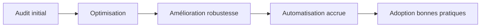
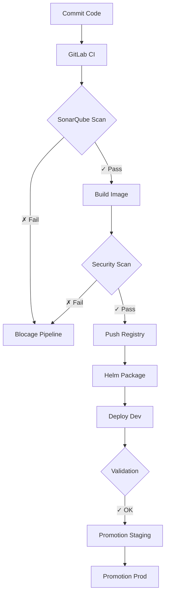
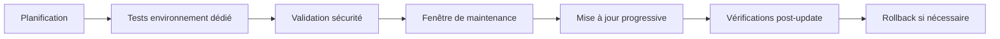

# 📋 Analyse Technique du Poste DevOps
## Document de clarification et points de validation

---

## 🎯 Vue d'ensemble du besoin

L'analyse de la fiche de poste révèle un **rôle DevOps/Infrastructure stratégique** au sein d'un système d'information sensible, avec un périmètre technique large et structurant.

### Périmètre fonctionnel

Le poste couvre l'ensemble de la chaîne technique, bien au-delà d'un simple rôle CI/CD :

- **Industrialisation** des mises en production
- **Automatisation** de l'infrastructure
- **Accompagnement** des équipes applicatives
- **Supervision** et fiabilité des plateformes
- **Maintien en condition opérationnelle** (MCO)
- **Modernisation progressive** du SI

> 💡 **Point clé** : Il s'agit d'un rôle structurant couvrant infrastructure, orchestration, sécurité, exploitation et gouvernance.

---

## 🔍 Analyse fonctionnelle approfondie

### 1. Plateforme de données

**Contexte** : Mise en production de logiciels de captation, entreposage et valorisation de données.

#### Implications techniques

| Dimension | Exigences |
|-----------|-----------|
| **Flux de données** | Ingestion importante, stockage distribué |
| **Traitement** | Batch et/ou temps réel |
| **Disponibilité** | Contraintes fortes (HA) |
| **Sécurité** | Traçabilité élevée, conformité |

#### Prérequis architecturaux

- ✅ Scalabilité horizontale
- ✅ Haute disponibilité (multi-AZ/multi-master)
- ✅ Supervision avancée (métriques métier + infra)
- ✅ Processus de validation stricts (gates qualité)

---

### 2. Clusters existants

**Contexte** : Présence de clusters déjà en production avec historique technique.

#### Approche attendue


**Mission principale** : Évolution progressive plutôt que reconstruction totale.

#### Activités clés

1. **Audit de l'existant**
   - Cartographie des ressources
   - Identification des points de fragilité
   - Analyse de la dette technique

2. **Amélioration continue**
   - Renforcement de la robustesse
   - Optimisation des performances
   - Réduction des risques opérationnels

3. **Accompagnement**
   - Transfert de compétences
   - Documentation des processus
   - Formation aux bonnes pratiques

---

### 3. Infrastructure as Code (IaC)

**Stack technologique** : Ansible + Terraform

#### Architecture IaC
```yaml
Infrastructure as Code:
  Provisionnement:
    - Outil: Terraform
    - Scope: Infrastructure (VM, réseau, stockage)
    - Backend: État distant (S3, Consul, ou équivalent)
    - Modules: Versionnés et réutilisables
  
  Configuration:
    - Outil: Ansible
    - Scope: Configuration système et applicative
    - Rôles: Idempotents et testés
    - Inventory: Dynamique (OpenStack/K8s)
```

#### Bonnes pratiques impliquées

- 📦 Modules Terraform standardisés et versionnés
- 🔒 Backend distant sécurisé pour le state
- 🔄 Rôles Ansible idempotents et réutilisables
- 🚀 Gestion automatisée du lifecycle des environnements
- 📝 Infrastructure entièrement versionnée (GitOps)

---

### 4. Chaîne CI/CD DevSecOps

**Stack technologique** : GitLab CI + Helm + SonarQube

#### Pipeline DevSecOps


#### Composants clés

| Composant | Rôle | Configuration attendue |
|-----------|------|------------------------|
| **GitLab** | SCM + CI/CD | Auto-hébergé, branches protégées |
| **SonarQube** | Qualité code | Gates qualité bloquants |
| **Registry** | Stockage images | Privé, scan obligatoire |
| **Helm** | Packaging K8s | Charts versionnés, values par env |

#### Sécurité intégrée

- 🛡️ Protection des branches (main/master)
- 🚨 Pipelines bloquants en cas de vulnérabilité
- 🔐 Registry privé avec authentification
- 📊 Scan de sécurité automatique (SAST/DAST)
- ✍️ Signature d'images
- 🎯 Promotion contrôlée entre environnements

---

### 5. Observabilité et supervision

**Objectif** : Visibilité complète sur la santé du système.

#### Stack d'observabilité
```yaml
Métriques:
  - Prometheus (collecte)
  - Grafana (visualisation)
  - Alertmanager (notifications)

Logs:
  - ELK Stack / Graylog
  - Centralisation multi-cluster
  - Rétention définie

Traces:
  - Jaeger / Tempo (optionnel)
  - Distributed tracing
```

#### Pratiques attendues

1. **Définition de métriques pertinentes**
   - SLI/SLO/SLA applicatifs
   - Métriques infrastructure (Golden Signals)
   - Métriques métier (KPI data platform)

2. **Corrélation d'incidents**
   - Agrégation multi-sources
   - Analyse de cause racine
   - Détection d'anomalies

3. **Gestion intelligente des alertes**
   - Seuils dynamiques
   - Réduction du bruit
   - Escalade structurée

4. **Post-mortem et amélioration**
   - Documentation des incidents
   - Actions correctives
   - Partage des apprentissages

---

### 6. Maintien en Condition Opérationnelle (MCO)

**Approche** : Stabilité et fiabilité avant tout.

#### Activités MCO

| Activité | Fréquence | Criticité |
|----------|-----------|-----------|
| **Patch management** | Mensuel | 🔴 Haute |
| **Mise à jour cluster** | Trimestriel | 🔴 Haute |
| **Sauvegarde etcd** | Quotidien | 🔴 Critique |
| **Capacity planning** | Mensuel | 🟡 Moyenne |
| **Tests pré-prod** | Continu | 🔴 Haute |
| **Documentation incidents** | Systématique | 🟡 Moyenne |

#### Processus de mise à jour


---

### 7. Modernisation du SI

**Contexte** : Système d'information en mutation technologique.

#### Axes de transformation
```yaml
Modernisation:
  Containerisation:
    - Migration progressive vers containers
    - Adoption de Kubernetes
    - Lift and shift puis refactoring
  
  Sécurité:
    - Renforcement DevSecOps
    - Zero Trust Network
    - Segmentation accrue
  
  Dette technique:
    - Refactoring progressif
    - Standardisation des pratiques
    - Outillage moderne
  
  Automatisation:
    - GitOps généralisé
    - Self-service pour les équipes
    - Réduction interventions manuelles
```

---

## 🏗️ Hypothèses d'architecture

### Option A : OpenShift (plateforme PaaS)

#### Stack complète
```
┌─────────────────────────────────────────┐
│         Applications (Pods)             │
├─────────────────────────────────────────┤
│      OpenShift Container Platform       │
│  - Routes, DeploymentConfig, ImageStream│
├─────────────────────────────────────────┤
│     Infrastructure (VM/Bare-metal)      │
│     - Provisionné via Terraform         │
│     - Configuré via Ansible             │
└─────────────────────────────────────────┘
```

#### Composants

| Couche | Technologies |
|--------|-------------|
| **Orchestration** | OpenShift (K8s + features entreprise) |
| **IaC** | Terraform + Ansible |
| **CI/CD** | GitLab CI auto-hébergé |
| **Registry** | Intégré OpenShift ou Harbor |
| **Sécurité** | Scan images (Trivy/Clair), RBAC strict |
| **Monitoring** | Prometheus + Grafana intégrés |
| **Logs** | ELK Stack / Graylog |
| **SIEM** | Wazuh / Suricata |
| **ITSM** | ServiceNow |
| **Documentation** | Confluence |

#### Avantages

- ✅ Gouvernance forte intégrée
- ✅ Sécurité renforcée par défaut
- ✅ Support Red Hat (si pertinent)
- ✅ Processus DevSecOps avancés natifs

---

### Option B : OpenStack + Kubernetes (full control)

#### Architecture en couches
```
┌─────────────────────────────────────────┐
│         Applications (Pods)             │
├─────────────────────────────────────────┤
│      Kubernetes (vanilla/kubeadm)       │
│  - Multi-master HA                      │
│  - CNI (Calico/Cilium)                  │
│  - CSI (Ceph/Cinder)                    │
│  - Ingress Controller                   │
├─────────────────────────────────────────┤
│          OpenStack (IaaS)               │
│  - Nova (Compute)                       │
│  - Neutron (Network)                    │
│  - Cinder/Ceph (Storage)                │
│  - Octavia (Load Balancing)             │
├─────────────────────────────────────────┤
│      Infrastructure Physique            │
└─────────────────────────────────────────┘
```

#### Détails techniques

**Couche IaaS (OpenStack)**
- VM provisionnées via Terraform (provider OpenStack)
- Réseau isolé avec segmentation VLAN
- Stockage Cinder ou Ceph distribué
- Load balancer interne (Octavia)

**Couche orchestration (Kubernetes)**
- Installation : kubeadm / Kubespray / RKE
- Multi-master en haute disponibilité (3 ou 5 masters)
- CNI : Calico (network policy) ou Cilium (eBPF)
- CSI : intégration stockage OpenStack
- Ingress : Nginx / HAProxy / Traefik

**DevSecOps**
- GitLab auto-hébergé
- Registry Harbor (CNCF, scan intégré)
- Scan image : Trivy (bloquant)
- Déploiement : Helm 3 ou Kustomize
- Promotion multi-environnements

**Observabilité & Sécurité**
- Prometheus / Grafana (métriques)
- Centreon (supervision legacy)
- ELK / Graylog (logs centralisés)
- Wazuh (HIDS) + Suricata (NIDS)
- ServiceNow (ticketing)

#### Implications

- 🎯 Maîtrise complète de la stack
- 🔧 Responsabilité du lifecycle cluster
- 🔍 Surveillance stricte etcd (backup quotidien)
- ⚙️ Automatisation forte requise
- 📚 Documentation technique approfondie nécessaire

---

## ❓ Questions de clarification stratégiques

### 🟢 Infrastructure globale

- [ ] La plateforme repose-t-elle sur **OpenShift** ou **Kubernetes standard** ?
- [ ] L'infrastructure est-elle basée sur **OpenStack**, **VMware** ou **bare-metal** ?
- [ ] Comment sont gérées les **mises à jour de cluster** ? (rolling update, blue/green)
- [ ] Existe-t-il une **stratégie documentée de sauvegarde etcd** ? (fréquence, rétention)
- [ ] Quel est le **niveau de disponibilité** attendu ? (SLA, RTO, RPO)

### 🟡 Infrastructure as Code

- [ ] Terraform couvre-t-il **l'ensemble du provisionnement** ou seulement certaines briques ?
- [ ] Les **modules Terraform** sont-ils standardisés et versionnés dans un registry interne ?
- [ ] Comment est géré le **state Terraform** ? (backend S3, Consul, Terraform Cloud)
- [ ] Ansible est-il **centralisé** (AWX/Tower) ou **distribué** par équipe ?
- [ ] Existe-t-il un **processus de validation** des changements IaC ? (plan + approval)

### 🟠 DevSecOps & CI/CD

- [ ] GitLab est-il **isolé du réseau externe** ? (air-gapped)
- [ ] Les pipelines incluent-ils un **scan sécurité obligatoire** (SAST/DAST) ?
- [ ] Les **images sont-elles signées** numériquement ?
- [ ] Existe-t-il une **séparation stricte build/production** ?
- [ ] Quel est le **processus de promotion** entre environnements ? (manuel, automatique)

### 🔵 Registry & Gestion d'images

- [ ] **Harbor** est-il utilisé comme registry interne ?
- [ ] Le **scan d'images** est-il bloquant en cas de vulnérabilité critique ?
- [ ] Existe-t-il une **politique de rétention** des images ? (combien de versions conservées)
- [ ] Les images de base sont-elles **standardisées et maintenues** par une équipe centrale ?

### 🟣 Observabilité

- [ ] La supervision est-elle **centralisée** (single pane of glass) ?
- [ ] Les alertes sont-elles **corrélées** automatiquement ?
- [ ] Des **SLO/SLI** sont-ils définis et mesurés ?
- [ ] Existe-t-il un **dashboard exécutif** pour la direction ?
- [ ] Quel est le **délai moyen de détection** (MTTD) et **résolution** (MTTR) d'incidents ?

### 🔴 Sécurité & SIEM

- [ ] Existe-t-il un **SOC** (Security Operations Center) dédié ?
- [ ] Les **flux réseau inter-namespace** sont-ils restreints par NetworkPolicies ?
- [ ] Des **agents Wazuh** sont-ils déployés sur tous les nœuds ?
- [ ] Existe-t-il une **matrice de conformité** (ISO27001, RGPD, etc.) ?
- [ ] Les **secrets** sont-ils gérés via Vault ou équivalent ?

### 🟤 ITSM & Documentation

- [ ] **ServiceNow** est-il utilisé pour les incidents et changements ?
- [ ] Les **post-mortems** sont-ils formalisés et systématiques ?
- [ ] La **documentation** est-elle centralisée (Confluence, Wiki) ?
- [ ] Existe-t-il un **référentiel de runbooks** à jour ?
- [ ] Y a-t-il un **processus d'onboarding** documenté pour les nouvelles équipes ?

---

## 🎯 Objectifs de cette clarification

Cette analyse technique vise à :

1. ✅ **Valider l'architecture actuelle** et son niveau de maturité
2. ✅ **Comprendre la maturité DevSecOps** et les axes d'amélioration prioritaires
3. ✅ **Identifier les priorités techniques** court/moyen terme
4. ✅ **Vérifier l'alignement** entre les compétences requises et mon expertise
5. ✅ **Préparer un plan d'action** réaliste pour les 3-6 premiers mois

---

## 📌 Synthèse finale

### Caractéristiques de l'environnement

Au regard de la fiche de poste, l'environnement cible présente les caractéristiques suivantes :

| Dimension | Niveau de maturité attendu |
|-----------|----------------------------|
| 🏗️ **Structure** | Forte, gouvernance établie |
| 🔒 **Sécurité** | Élevée, approche DevSecOps |
| 🤖 **Automatisation** | Avancée, IaC généralisé |
| 📈 **Criticité** | Haute disponibilité requise |
| 🔄 **Modernisation** | En cours, progressive |

### Profil technique recherché
```yaml
Compétences_clés:
  Infrastructure:
    - Kubernetes / OpenShift (production-grade)
    - OpenStack ou VMware (si applicable)
    - Réseaux et sécurité (CNI, NetworkPolicies)
  
  Automatisation:
    - Terraform (modules, state management)
    - Ansible (rôles, collections)
    - GitOps (ArgoCD/Flux)
  
  CI/CD:
    - GitLab CI (pipelines complexes)
    - Helm / Kustomize
    - Container registry management
  
  Observabilité:
    - Prometheus / Grafana
    - ELK Stack
    - Gestion d'incidents
  
  Sécurité:
    - DevSecOps (SAST/DAST)
    - Hardening système
    - Conformité (ISO27001, RGPD)
  
  Soft_skills:
    - Accompagnement équipes
    - Documentation technique
    - Communication transverse
```

### Prochaines étapes

1. **Clarification architecturale** : validation de l'hypothèse A ou B
2. **Cartographie détaillée** : outils, processus, équipes
3. **Identification des quick wins** : actions à impact rapide
4. **Plan de montée en compétence** : si nécessaire sur certains outils spécifiques

---

> 💬 **Note** : Ce document constitue une base de discussion technique. Les éléments marqués par des cases à cocher (☐) représentent des points à clarifier lors des prochains échanges.


