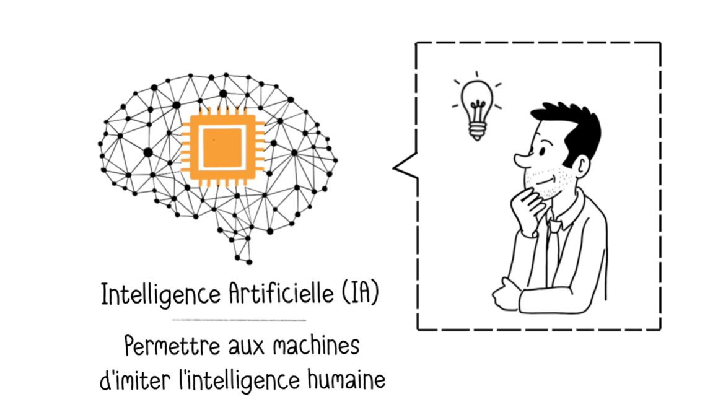
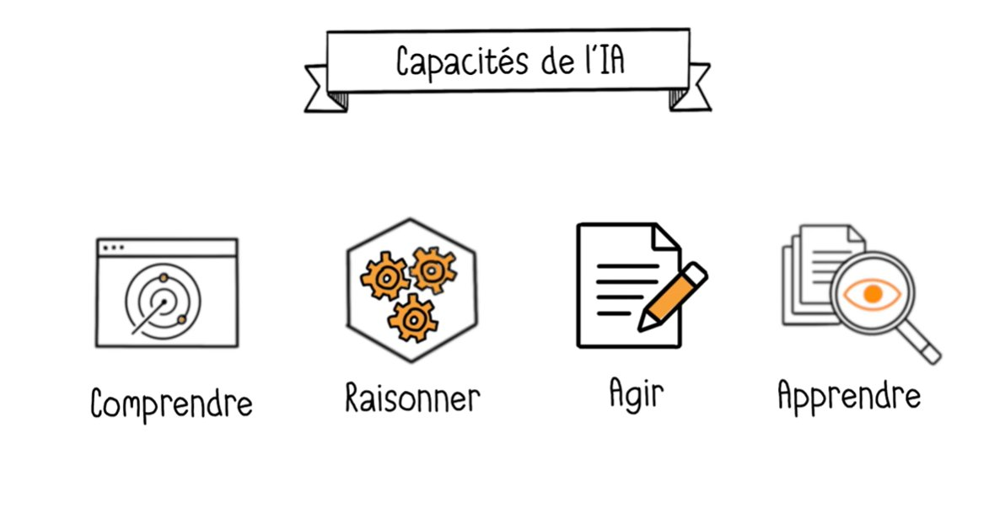
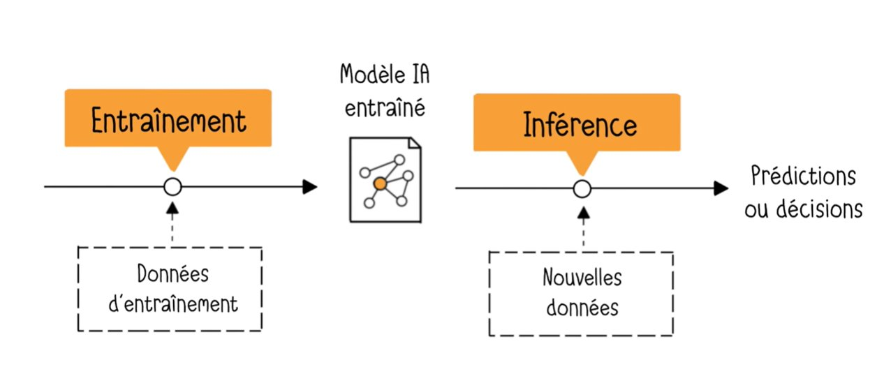
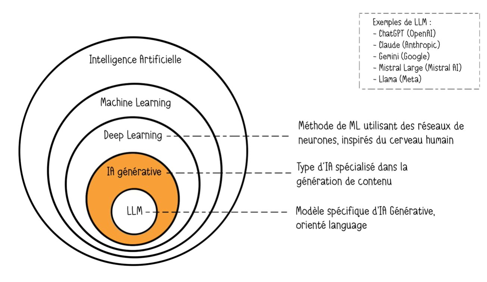
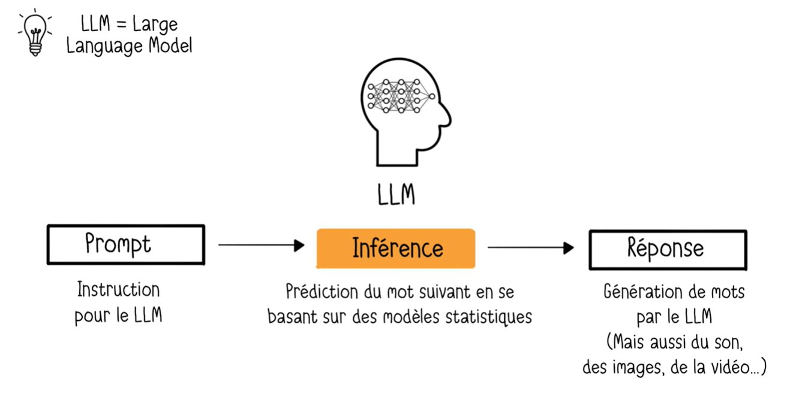
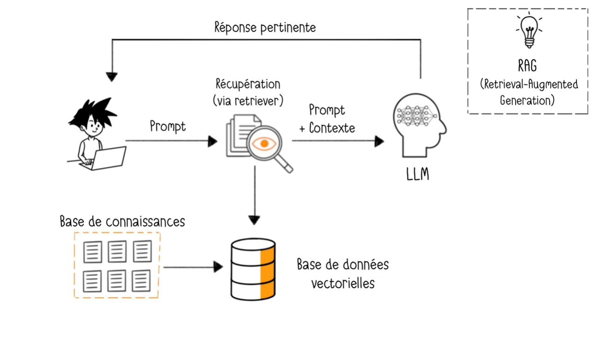
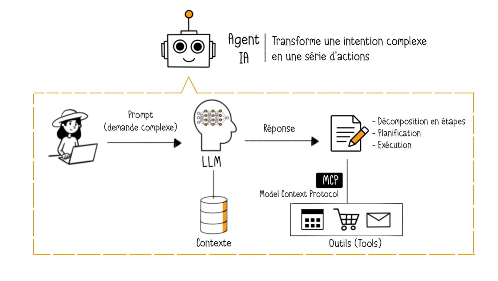
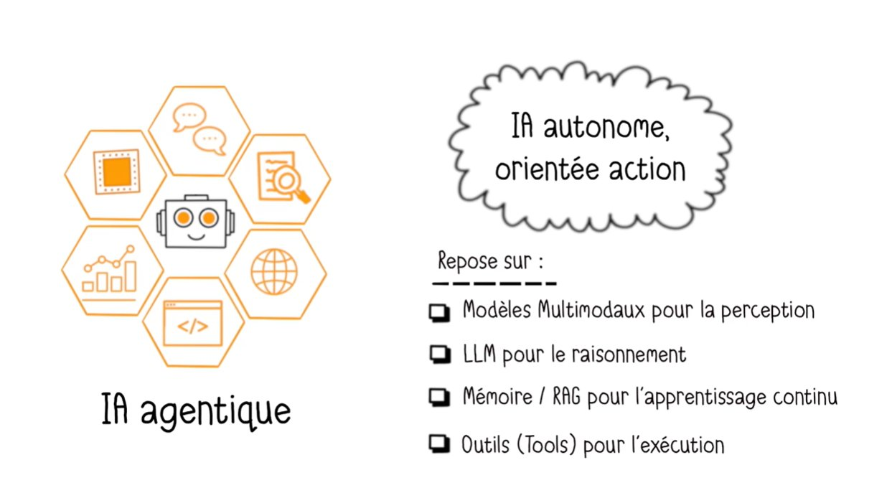
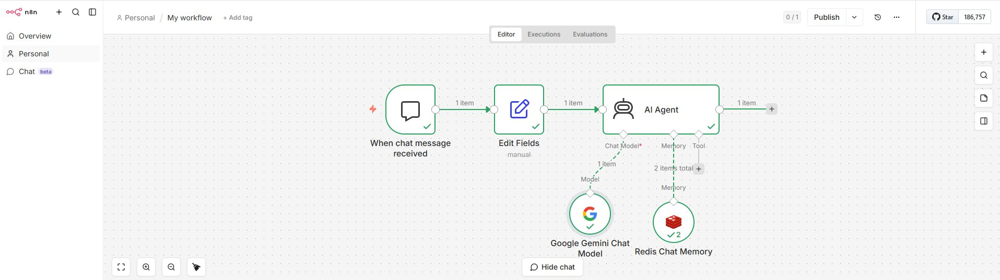

> **Pour qui ?** Ce guide est pensé pour tous les publics — curieux, professionnels, étudiants — sans prérequis technique. Des analogies simples rendent chaque concept accessible.

---

## Sommaire

1. [Qu'est-ce que l'Intelligence Artificielle ?](#1-quest-ce-que-lintelligence-artificielle-)
2. [Les capacités fondamentales de l'IA](#2-les-capacités-fondamentales-de-lia)
3. [Comment une IA apprend : Entraînement et Inférence](#3-comment-une-ia-apprend--entraînement-et-inférence)
4. [De l'IA au LLM : La carte des sous-catégories](#4-de-lia-au-llm--la-carte-des-sous-catégories)
5. [Comment fonctionne un LLM ?](#5-comment-fonctionne-un-llm-)
6. [Les limites du LLM et la solution RAG](#6-les-limites-du-llm-et-la-solution-rag)
7. [L'Agent IA : Passer des étapes aux objectifs](#7-lagent-ia--passer-des-étapes-aux-objectifs)
8. [L'IA Agentique : L'autonomie au sommet](#8-lia-agentique--lautonomie-au-sommet)
9. [L'évolution de l'IA : Du prompt à l'agent](#9-lévolution-de-lia--du-prompt-à-lagent)
10. [En pratique : Créer votre premier agent](#10-en-pratique--créer-votre-premier-agent)
11. [Conseils et bonnes pratiques](#11-conseils-et-bonnes-pratiques)
12. [Récapitulatif](#récapitulatif--les-concepts-clés-en-un-coup-dœil)

---

## 1. Qu'est-ce que l'Intelligence Artificielle ?



**L'Intelligence Artificielle (IA)**, c'est l'ensemble des techniques qui permettent à une machine d'**imiter certaines capacités humaines** : comprendre un texte, reconnaître un visage, traduire une langue, ou encore prendre des décisions.

### 🧠 L'analogie du cerveau mécanique

Imaginez un apprenti très studieux. Il lit des millions de livres, de conversations, d'articles. Petit à petit, il apprend à reconnaître des schémas dans ce qu'il lit — il comprend que "chat" est souvent associé à "animal", "ronronne" ou "pelage". Lorsqu'on lui pose une question, il ne cherche pas la réponse dans un livre : il la **reconstruit** à partir de tout ce qu'il a appris.

C'est exactement ce que fait une IA.

---

## 2. Les capacités fondamentales de l'IA



Une IA repose sur **quatre capacités clés**, comme les quatre piliers d'un bon employé :

| Capacité | Ce que ça signifie | Analogie |
|---|---|---|
| **Comprendre** | Interpréter des données (texte, image, son) en reconnaissant des patterns | Lire et saisir le sens d'un document |
| **Raisonner** | Analyser les informations pour résoudre un problème | Réfléchir à la meilleure solution |
| **Agir** | Exécuter l'action décidée par le raisonnement | Rédiger la réponse ou effectuer la tâche |
| **Apprendre** | S'améliorer par l'analyse de nouvelles données | Tirer des leçons de chaque expérience |

> 💡 **À retenir** : Une IA n'est pas magique. Elle **imite** ces capacités humaines grâce à des millions de données et des calculs statistiques très sophistiqués.

---

## 3. Comment une IA apprend : Entraînement et Inférence



Le processus de création d'une IA se déroule en **deux grandes phases** :

### Phase 1 — L'Entraînement 🏋️

C'est la phase d'apprentissage. On donne à l'IA une quantité **astronomique** de données (textes, images, conversations...) et des algorithmes ajustent le modèle après des milliers de cycles.

**Analogie** : C'est comme former un cuisinier. Pendant des années, il goûte des milliers de plats, lit des recettes, s'entraîne. À la fin, il a développé son propre instinct culinaire.

### Phase 2 — L'Inférence 🎯

C'est la phase d'utilisation. Le modèle entraîné reçoit de **nouvelles données** (votre question, une photo, un texte) et produit une **prédiction ou une décision**.

**Analogie** : Le cuisinier formé est maintenant en cuisine. Un client commande un plat qu'il n'a jamais préparé exactement, mais grâce à sa formation, il sait comment le réaliser.

> 💡 **L'inférence est l'étape la plus importante en IA aujourd'hui.** C'est à ce moment que le modèle "travaille" réellement pour vous.

#### Exemple concret : Netflix 🎬

- **Entraînement** : Netflix donne à son IA votre historique de visionnage et celui de millions d'autres utilisateurs aux goûts similaires.
- **Inférence** : Quand vous vous connectez, l'IA prédit quel film vous allez aimer — c'est sa recommandation personnalisée.

---

## 4. De l'IA au LLM : La carte des sous-catégories



L'IA est un grand territoire avec plusieurs régions. Voici comment s'emboîtent les concepts :

```
Intelligence Artificielle (IA)
  └── Machine Learning (ML)
        └── Deep Learning
              └── IA Générative
                    └── LLM (Large Language Model)
```

### Le Machine Learning (ML) 🔢

Sous-catégorie de l'IA qui permet aux machines d'apprendre **directement à partir des données**, sans règles explicitement programmées.

**Analogie** : Au lieu d'enseigner à un enfant que "le chien aboie et a quatre pattes", on lui montre 10 000 photos de chiens. Il finit par reconnaître un chien par lui-même.

### Le Deep Learning 🧬

Méthode de Machine Learning qui utilise des **réseaux de neurones artificiels** (inspirés du cerveau humain). Particulièrement efficace pour les patterns complexes : reconnaissance d'images, de la voix, traduction automatique.

### L'IA Générative ✨

Sous-catégorie du Deep Learning spécialisée dans la **création de contenu** : texte, images, code, vidéo, musique.

### Le LLM (Large Language Model) 💬

Modèle spécifique d'IA générative, focalisé sur le **langage**. Exemples : ChatGPT (OpenAI), Claude (Anthropic), Gemini (Google), Mistral Large, Llama (Meta).

---

## 5. Comment fonctionne un LLM ?



### Le LLM : Un champion de la prédiction de mots

Quand vous envoyez un message à ChatGPT ou Claude, voici ce qui se passe :

1. **Votre prompt** (instruction) est reçu par le LLM.
2. **L'inférence** démarre : le LLM prédit quel est le **mot le plus probable** qui suit, puis le mot d'après, et ainsi de suite.
3. **La réponse** est générée mot par mot, jusqu'à former des phrases et paragraphes complets.

> ⚠️ **Important** : Un LLM ne "réfléchit" pas comme un humain. C'est un **système statistique de prédiction** très avancé. Il ne sait pas ce qu'il dit — il sait ce qui est *statistiquement probable* de dire.

**Analogie** : C'est comme la fonction d'auto-complétion de votre téléphone, mais entraînée sur toute la littérature mondiale et capable de prédire des paragraphes entiers avec une cohérence remarquable.

### Les LLM deviennent multimodaux 🖼️🎵

Les modèles récents ne se limitent plus au texte. Ils peuvent traiter et générer **images, son, vidéo** — on les appelle des **modèles multimodaux**.

---

## 6. Les limites du LLM et la solution RAG

### Les 3 grandes limites d'un LLM

| Limite | Explication | Analogie |
|---|---|---|
| **Connaissance figée** | Le LLM ne connaît rien après sa date d'entraînement | Un dictionnaire imprimé en 2022 ne contient pas les mots apparus en 2024 |
| **Hallucinations** | Il peut inventer des faits qui semblent plausibles mais sont faux | Un étudiant qui comble un trou dans ses connaissances par une réponse inventée mais convaincante |
| **Aucune donnée privée** | Il ne connaît pas vos fichiers, votre entreprise, vos process internes | Il n'a pas lu votre contrat ou votre base de données clients |

### La solution : le RAG (Retrieval-Augmented Generation) 📚



Le RAG est une technique qui **enrichit le LLM avec des sources externes** au moment où vous posez une question.

**Comment ça fonctionne :**

1. Vous posez une question (prompt).
2. Un outil appelé **retriever** analyse votre question et cherche les documents les plus pertinents dans une **base de connaissances** (vos fichiers, votre doc interne...).
3. Ces documents sont convertis en **base de données vectorielle** (une façon de stocker le sens des textes).
4. Le retriever transmet votre prompt **+ le contexte trouvé** au LLM.
5. Le LLM génère une réponse **ancrée dans vos données réelles**.

**Analogie** : C'est comme si, avant de répondre à votre question, le LLM avait accès à un assistant qui va chercher les bons documents dans votre bibliothèque et les lui lit à voix haute. La réponse est alors basée sur des sources fiables et à jour.

---

## 7. L'Agent IA : Passer des étapes aux objectifs



### L'ère des agents IA : un changement de paradigme

L'automatisation traditionnelle (type Make ou Zapier) repose sur des scénarios **rigides** : "si ceci, alors cela". Aujourd'hui, on passe au niveau supérieur avec les **agents IA**.

Contrairement aux automatisations classiques, un agent est **autonome** : on lui donne un objectif et des outils, et il décide **lui-même** du chemin à prendre pour accomplir sa mission.

### Définition d'un agent IA

Un **agent IA** est un outil intelligent et autonome capable de :

- **Percevoir son environnement** (lire des messages, consulter une base de données…)
- **Prendre des décisions** sans supervision humaine constante
- **Agir** en utilisant des outils
- **Gérer des contextes non déterministes** (situations imprévues)

### Les 3 niveaux de sophistication

| Niveau | Description | Exemple |
|---|---|---|
| **1. Automatisations** | Logique simple "Si A alors B" | Envoyer un mail de bienvenue après une inscription |
| **2. Workflows IA** | Chaînes pilotées par un LLM | Répondre automatiquement à un email via ChatGPT |
| **3. Agents IA** | Entités autonomes avec mémoire, objectifs et outils | Un assistant qui gère votre agenda, vos mails et votre veille en parallèle |

### Les 4 attributs clés d'un agent

| Attribut | Description |
|---|---|
| 🎯 **Autonomie** | Agit seul après configuration, sans supervision pas-à-pas |
| 🧭 **Objectif clair** | Poursuit une mission métier définie |
| 🧠 **Mémoire et Outils** | Se connecte à des bases de données, des API, des logiciels |
| 🔗 **Multi-étapes** | Enchaîne plusieurs actions logiques pour atteindre son but |

### Comment un agent fonctionne-t-il ?

L'agent utilise le **LLM comme moteur de raisonnement** et dispose d'une **boîte à outils** pour agir sur le monde réel :

- **Décomposition** : Il découpe l'objectif en sous-tâches.
- **Planification** : Il décide de l'ordre et des outils à utiliser.
- **Exécution** : Il appelle les outils nécessaires (APIs, logiciels, bases de données).

### Le MCP : Le langage universel des outils 🔌

Le **MCP (Model Context Protocol)** est un standard qui agit comme une **interface universelle** entre l'agent et les logiciels externes. C'est comme une prise électrique universelle : peu importe le pays (Notion, Webflow, Gmail, Slack...), la prise s'adapte.

**Analogie** : Les MCP sont des "tuyaux" qui connectent l'agent directement aux logiciels que vous utilisez déjà. L'agent peut ainsi lire vos emails, créer des tâches dans Notion, publier sur votre CMS — sans que vous ayez à copier-coller quoi que ce soit.

### L'agent comme manager d'équipe 👔

Un agent peut aussi orchestrer des **sous-agents spécialisés**, comme un chef de projet qui délègue :

- Un sous-agent pour la **recherche**
- Un sous-agent pour la **rédaction**
- Un sous-agent pour la **validation**
- Un sous-agent pour la **correction**

---

## 8. L'IA Agentique : L'autonomie au sommet



### Au-delà de l'agent : l'IA Agentique

L'**IA agentique** est une forme avancée d'IA capable d'agir de manière **autonome**, de s'adapter en temps réel et de résoudre des problèmes complexes en plusieurs étapes — sans nécessiter d'intervention humaine constante.

Elle repose sur quatre piliers :

| Pilier | Rôle |
|---|---|
| **Modèles multimodaux** | La perception (voir, entendre, lire) |
| **LLM** | Le raisonnement et la planification |
| **Mémoire / RAG** | Le contexte et l'apprentissage continu |
| **Outils (Tools)** | L'action sur le monde réel |

### Exemple concret : La voiture autonome 🚗

La voiture autonome est une parfaite illustration de l'IA agentique en action :

1. **Perception** 👁️ : Les caméras et capteurs analysent l'environnement (piétons, feux rouges, obstacles).
2. **Raisonnement** 🧠 : Le LLM interprète la perception et planifie une action de haut niveau (ex: changer de voie, ralentir).
3. **Action** ⚙️ : Les commandes physiques s'exécutent (volant, freins, accélérateur).

> Tout cela se passe en temps réel, sans conducteur humain. C'est l'autonomie agentique.

---

## 9. L'évolution de l'IA : Du prompt à l'agent

L'IA a progressé par vagues successives, chacune donnant plus d'autonomie à la machine :

```
Niveau 1 — Prompt simple
  └── Vous posez une question à ChatGPT, il répond.
      (Exemple : "Rédige un email de relance")

Niveau 2 — Assistant personnalisé (GPT custom)
  └── On lui donne des instructions fixes et une base de connaissances.
      (Exemple : Un assistant RH configuré avec vos process internes)

Niveau 3 — Chaînage d'assistants
  └── On orchestre plusieurs assistants en séquence, étape par étape.
      (Exemple : Rédaction → Relecture → Traduction)

Niveau 4 — Agent IA  ← Nous y sommes
  └── On fixe un objectif. L'agent choisit ses outils et son process.
      (Exemple : "Lance notre campagne marketing" → l'agent planifie et exécute)
```

> 🚀 **La vraie révolution** : On ne pense plus en "étapes à programmer", mais en **objectifs à atteindre**. L'agent se charge du reste.

---

## 10. En pratique : Créer votre premier agent

### 🧩 Méthodologie : 80% préparation, 20% technique

La réussite d'un agent IA tient bien plus à la **préparation en amont** qu'à l'aspect technique. Voici les 4 étapes à suivre dans l'ordre :

1. **Définir le rôle et les objectifs** : Quelle est la mission métier précise ? (Ex: "Répondre aux questions SAV en s'appuyant sur nos CGV")
2. **Structurer la mémoire** : Quelles données doit-il connaître ? (PDF, sites web, base Notion, fichiers internes…)
3. **Choisir l'outil adapté** : En fonction de l'objectif (Chatbase pour le SAV, Zapier pour les tâches perso, n8n pour des workflows complexes…)
4. **Définir la logique** : Réactif (répond quand on lui parle) ou proactif (déclenche des actions tout seul) ? Règles fixes ou adaptables ?

---

### 🎯 Trois exemples concrets d'agents

#### Exemple 1 — Service Client (Chatbase)

Un agent pour un **Wedding Planner** qui répond aux questions des clients sur les conditions de vente, les prestations, les délais. Il s'appuie sur des **documents sources spécifiques** (CGV, brochures, FAQ).

#### Exemple 2 — Prise de rendez-vous (Jotform)

Un agent pour un **cabinet médical** qui interagit avec les patients pour fixer des rendez-vous, vérifier les disponibilités du planning, et envoyer des confirmations.

#### Exemple 3 — Assistant personnel (Zapier Central)

Un agent sur **Slack** qui, chaque matin, envoie automatiquement :
- Un résumé des **emails non lus**
- Les **rendez-vous Google Calendar** du jour
- Les **actualités internationales** importantes

---

### 🛠️ Cas pratique : Construire un agent IA avec n8n



>
:::note
**n8n** est aujourd'hui l'un des outils les plus puissants pour construire des agents IA visuellement. L'image ci-dessus montre un workflow type : un message arrive dans le chat → il est préparé (Edit Fields) → l'**AI Agent** prend le relais avec un **modèle Gemini** comme cerveau et une **mémoire Redis** pour se souvenir des échanges.
:::

#### Cas d'usage typiques

- **Gérer ses contacts et emails** : l'agent peut chercher un contact, rédiger un mail de relance et l'envoyer.
- **Gérer son agenda** : lister les rendez-vous du lendemain ou décaler une réunion de 30 minutes sur simple commande vocale.

#### Pourquoi choisir n8n ?

| Atout | Explication |
|---|---|
| **Module "Agent" natif** | L'un des seuls outils à proposer une intégration permettant à un LLM d'utiliser des outils nativement |
| **Open Source** | Installable gratuitement sur votre ordinateur ou un serveur (auto-hébergement) |
| **Souveraineté des données** | L'installation locale est plus sécurisée pour les données sensibles |

#### Les 5 ingrédients indispensables d'un agent sur n8n

| # | Ingrédient | Rôle |
|---|---|---|
| 1 | **Le moyen de communication** | Comment l'utilisateur parle à l'agent : Chat, WhatsApp, Telegram, Slack, Email |
| 2 | **Le modèle de langage (LLM)** | Le "cerveau" qui raisonne : GPT-4, Claude, Gemini, Mistral via API |
| 3 | **Les outils (Tools)** | Les capacités données à l'agent : Google Drive, Gmail, API bancaire, etc. |
| 4 | **La mémoire** | Pour que l'agent se souvienne du contexte des messages précédents (Redis, Postgres…) |
| 5 | **Le Prompt (Instructions)** | La définition du rôle, du ton et des limites de l'agent |

#### 🧠 Concepts avancés : Sous-agents et API personnalisées

- **Sous-agents spécialisés** : Pour éviter qu'un agent ne s'embrouille avec trop d'outils, on crée des **sous-agents dédiés** (ex: un sous-agent "Calendrier", un sous-agent "Mails"). L'**agent principal (Master Agent)** délègue alors les tâches spécifiques.
- **Outils sur mesure via API** : Si un outil n'existe pas nativement dans n8n, n'importe quelle **API peut être transformée en outil** via une simple requête HTTP.

#### ⚠️ Limites à connaître

- **Complexité** de mise en œuvre (plus technique qu'un Zapier).
- **Coût en tokens** qui peut grimper rapidement avec un usage intensif du LLM.
- **Comportement moins prévisible** qu'un script fixe — l'agent peut "improviser".

#### 💡 Possibilités offertes

- Support client intelligent
- Gestion dynamique de planning
- Recherche de contenu automatisée
- "Inbox Zero" : tri automatique des mails entrants

---

### 🚨 Les 5 pièges à éviter avec n8n (et au-delà)

| # | Piège | Comment l'éviter |
|---|---|---|
| 1 | **Mauvais nommage des outils** | Utilisez des noms clairs et normalisés. L'IA a besoin de comprendre quel outil appeler à partir de son nom |
| 2 | **Absence d'instructions anti-hallucination** | Dites explicitement à l'agent de **ne pas inventer** d'informations s'il ne sait pas |
| 3 | **Négliger l'audio** | La transcription vocale rend l'interaction beaucoup plus fluide et rapide pour l'utilisateur |
| 4 | **Ignorer la documentation** | n8n est technique : la doc officielle contient la majorité des réponses aux bugs courants |
| 5 | **Manque de tests** | Testez l'agent **longuement en conditions réelles** pour affiner son prompt avant la mise en production |

---

## 11. Conseils et bonnes pratiques

### 🛡️ Sécurité : les 3 réflexes essentiels

| Bonne pratique | Pourquoi c'est crucial |
|---|---|
| **Anonymisation** | Ne donnez jamais d'accès direct à des données sensibles ou confidentielles. Anonymisez ce qui peut l'être |
| **Prompt restrictif** | Définissez clairement ce que l'agent **a le droit de faire** ou **non**. Un agent sans limites = un risque |
| **Tests intensifs** | Testez l'agent dans un environnement sécurisé pour vérifier ses réactions aux questions sensibles ou pièges |

### 🛡️ Mettre des garde-fous

Plus un agent est autonome, plus il faut définir des **règles claires** et des **points de validation** :

- Demandez une **confirmation** avant toute action irréversible (suppression, publication, envoi).
- Définissez précisément ce que l'agent **peut et ne peut pas faire**.
- Commencez par des tâches à **faible risque** avant d'élargir l'autonomie.

### 🔗 Préférer l'intégration native

Utilisez des agents **déjà intégrés dans vos outils existants** (Notion AI, Make, n8n, Zapier AI...) plutôt que de reconstruire toute votre infrastructure. L'adoption est plus rapide et la maintenance plus simple.

### 🎯 Penser "objectifs", pas "étapes"

| Ancienne façon de penser | Nouvelle façon de penser |
|---|---|
| "L'IA doit d'abord faire X, puis Y, puis Z" | "L'IA doit atteindre l'objectif O avec les outils disponibles" |
| Vous programmez le process | L'agent définit son propre process |
| Rigide, difficile à adapter | Flexible, s'adapte aux imprévus |

### 👥 Voir l'agent comme un manager

Pensez votre agent comme un **chef de projet** qui orchestre une équipe virtuelle :
- Il **délègue** à des sous-agents spécialisés.
- Il **vérifie la qualité** à chaque étape.
- Il **s'adapte** si une étape échoue.

---

## Récapitulatif : Les concepts clés en un coup d'œil

| Concept | Définition simple |
|---|---|
| **IA** | Technique permettant aux machines d'imiter l'intelligence humaine |
| **Machine Learning** | L'IA apprend à partir de données, sans règles explicites |
| **Deep Learning** | ML utilisant des réseaux de neurones inspirés du cerveau |
| **IA Générative** | Crée du contenu (texte, image, son, vidéo) |
| **LLM** | Modèle génératif focalisé sur le langage (ChatGPT, Claude…) |
| **Inférence** | Phase où le modèle utilise son apprentissage pour répondre |
| **RAG** | Enrichit le LLM avec vos données externes en temps réel |
| **Automatisation** | Logique rigide "si A alors B" (ex: Zapier, Make) |
| **Workflow IA** | Chaîne d'actions pilotée par un LLM |
| **Agent IA** | IA autonome qui fixe son propre process pour atteindre un objectif |
| **Master Agent** | Agent principal qui délègue à des sous-agents spécialisés |
| **MCP** | Standard de connexion universel entre l'agent et les logiciels |
| **Tools** | Capacités externes données à l'agent (API, bases de données, logiciels) |
| **Mémoire** | Système permettant à l'agent de se souvenir du contexte |
| **IA Agentique** | IA autonome, capable d'agir et de s'adapter sans intervention humaine |


