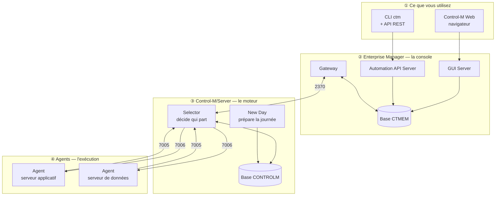
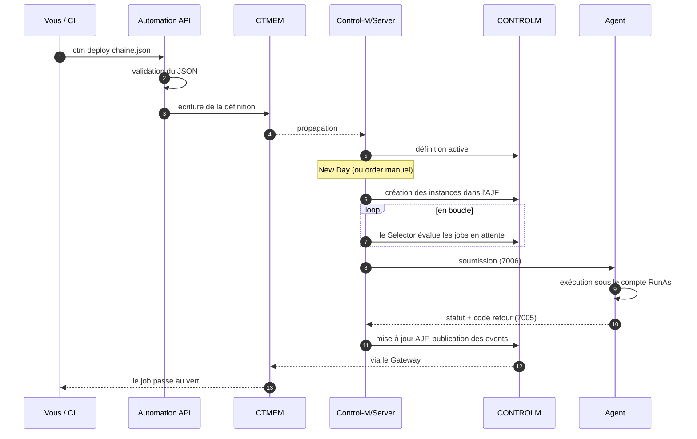
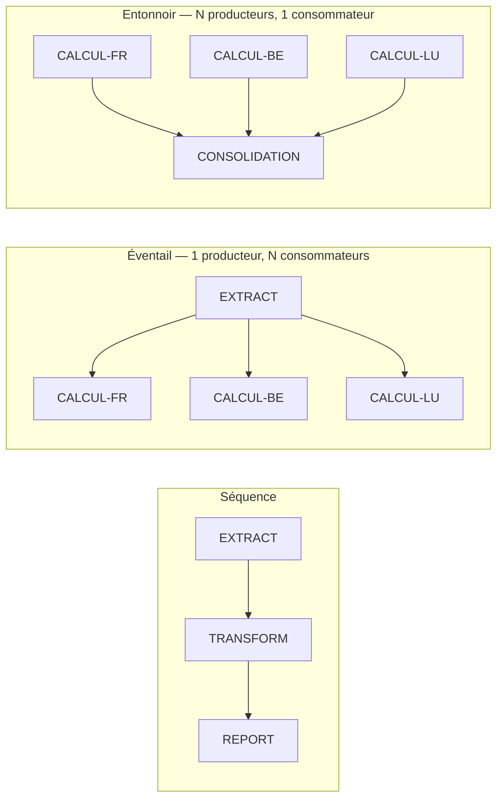
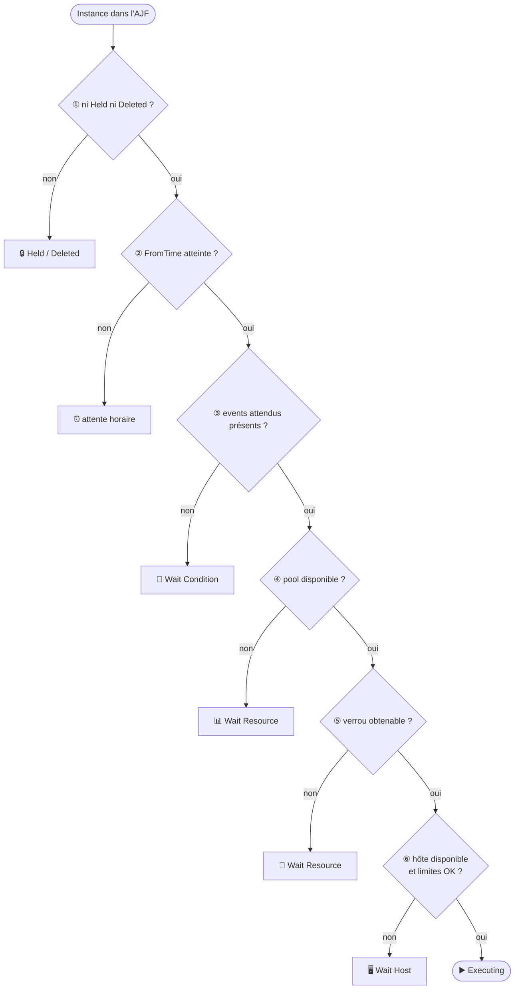
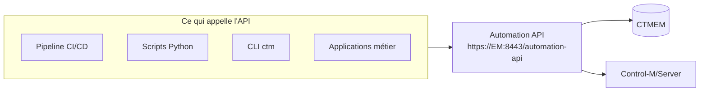
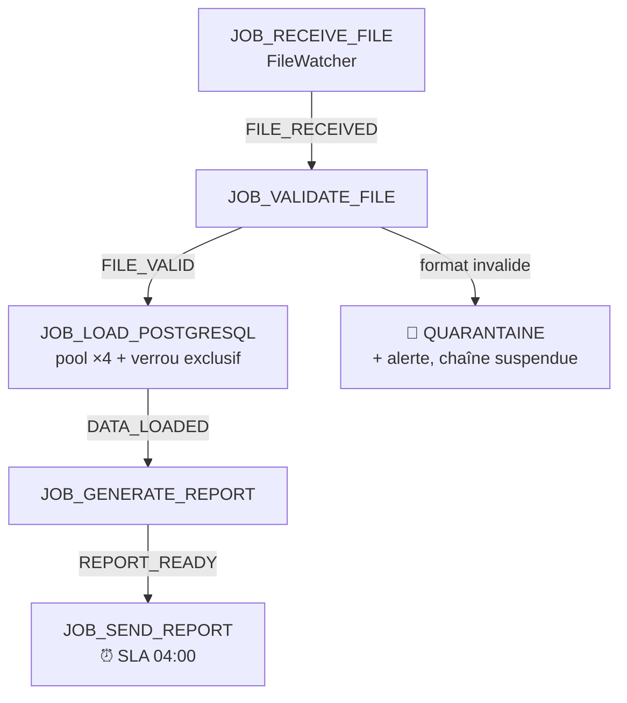

:::note
Guide **progressif** : on part de zéro (à quoi sert Control-M), on monte jusqu'à une boîte à
outils Python complète qui automatise le quotidien d'un administrateur.

Chaque notion suit le même chemin :

```text
Définition → Pourquoi → Comment ça marche → Exemple simple →
Exemple réel → Commande → API REST → Python → Diagnostic → Bonnes pratiques
```
:::

## Niveaux de lecture

| Marqueur | Niveau | Ce qu'il faut déjà savoir |
|---|---|---|
| 🟢 | **Découverte** | Rien. Tout est expliqué |
| 🟡 | **Praticien** | Vous avez vu Control-M tourner, vous lisez du JSON |
| 🔴 | **Expert** | Vous administrez, vous scriptez, vous êtes d'astreinte |

:::tip[Trois parcours]
- **Je débute** → Parties 1, 2, 3.1‑3.3, 4. Vous saurez lire une chaîne et appeler l'API.
- **J'exploite** → Parties 2.6, 6, 7, 9. Vous saurez diagnostiquer et débloquer.
- **J'automatise** → Parties 3, 5, 6, 7, 10. Vous aurez une bibliothèque de production.
:::

## Étiquetage des commandes

Chaque bloc dit **où** l'exécuter. Pas d'ambiguïté.

| Étiquette | Où | Avec quoi |
|---|---|---|
| `[CLI ctm]` | N'importe quel poste | CLI Automation API + jeton |
| `[REST]` | N'importe où | `curl` + jeton |
| `[Python]` | N'importe où | `requests` + jeton |
| `[Control-M/Server]` | Machine du Server | Compte propriétaire |
| `[Control-M/EM]` | Machine de l'EM | Compte propriétaire |
| `[PostgreSQL]` | Machine de la base | `postgres` ou propriétaire |

## Prérequis techniques

```bash
# [Python] une seule dépendance pour tout ce guide
pip install requests
```

```bash
# [CLI ctm] déclarer l'environnement, une fois
ctm environment add prod "https://ctm-em.exemple.fr:8443/automation-api" "$CTM_API_TOKEN"
ctm environment set prod
ctm environment show          # ⚠️ « show », pas « list » — « list » n'existe pas
```

```bash
# [Python] variables d'environnement utilisées par TOUS les scripts de ce guide
export CTM_ENDPOINT="https://ctm-em.exemple.fr:8443/automation-api"
export CTM_API_TOKEN="<votre jeton d'API>"
export CTM_CA_BUNDLE="/etc/pki/ca-trust/ctm-ca.pem"    # bundle CA interne
```

:::danger[Jamais de secret dans le code]
Un jeton écrit dans un script finit dans Git, dans un ticket, dans un canal Slack. Tous les
exemples de ce guide lisent le jeton depuis l'environnement. **Aucun exemple ne désactive la
vérification TLS** : `verify=False` transforme votre script en cible d'interception.
:::

---

## Sommaire

- [1. Architecture — qui fait quoi](#1-architecture--qui-fait-quoi)
- [2. Les concepts à connaître avant d'automatiser](#2-les-concepts-à-connaître-avant-dautomatiser)
- [3. L'Automation API — comprendre avant de coder](#3-lautomation-api--comprendre-avant-de-coder)
- [4. Premier script Python, ligne par ligne](#4-premier-script-python-ligne-par-ligne)
- [5. `ControlMClient` — le client réutilisable](#5-controlmclient--le-client-réutilisable)
- [6. Vingt scripts d'administration](#6-vingt-scripts-dadministration)
- [7. Automatiser les tâches récurrentes](#7-automatiser-les-tâches-récurrentes)
- [8. Cas pratique de bout en bout](#8-cas-pratique-de-bout-en-bout)
- [9. Diagnostic rapide et runbooks](#9-diagnostic-rapide-et-runbooks)
- [10. Mise en production](#10-mise-en-production)
- [11. Cheat sheet](#11-cheat-sheet)

---

## 1. Architecture — qui fait quoi

### 1.1 Le problème 🟢

Une entreprise a des centaines de traitements nocturnes qui doivent s'exécuter **dans un ordre
précis** : extraire les données, les contrôler, calculer, éditer, transmettre. Chacun dépend du
précédent. Si l'un échoue à 2 h 15, il faut le savoir, décider, relancer.

Avec `cron`, ça tient jusqu'à vingt traitements. À deux mille, plus personne ne sait ce qui
dépend de quoi.

:::note[Définition — ordonnanceur]
Un ordonnanceur sait **quoi** lancer, **quand**, **où**, **sous quelles conditions**, **avec
quelles ressources**, et **quoi faire** si ça échoue. Control-M (éditeur **BMC**) est l'un des
trois grands du marché.
:::

| Besoin | `cron` | Control-M |
|---|---|---|
| Ordre entre traitements | `sleep 300` et prière | Dépendance explicite |
| Jours ouvrés, fériés | Non | Calendriers métier |
| Limiter la charge | Non | Ressources partagées |
| Reprise sur échec | Un humain lit les logs | Relance, escalade, SLA |
| Qui a relancé quoi | Rien | Audit complet |

### 1.2 Les quatre couches 🟢



| Couche | Rôle | Si elle tombe |
|---|---|---|
| ① Interfaces | Voir et piloter | Vous ne voyez plus rien |
| ② Enterprise Manager | Consolider, sécuriser, historiser | Console et API HS — **la production continue** |
| ③ Control-M/Server | **Décider** | **Production arrêtée** |
| ④ Agents | Exécuter | Les jobs de ces machines ne partent plus |

:::caution[Le réflexe qui évite une astreinte inutile]
Écran figé ≠ production arrêtée. Le Control-M/Server est **autonome** : coupez l'EM, les jobs
continuent, vous ne les **voyez** simplement plus.

Signature d'un problème de supervision : **tous** les jobs figés au même instant, y compris
ceux sans lien entre eux. Un vrai blocage est presque toujours **sélectif** (une chaîne, une
ressource, un agent).
:::

### 1.3 Les deux bases 🟡

| Base | Propriétaire | Contient | Instances |
|---|---|---|---|
| **CTMEM** | Enterprise Manager | Définitions, sécurité EM, miroir de supervision, alertes, audit, historique | **1** |
| **CONTROLM** | Control-M/Server | AJF, events, ressources, calendriers, agents, journal | **1 par Server** |

**La règle à retenir** :

> Les **définitions** sont vraies côté CTMEM. L'**exécution** est vraie côté CONTROLM.

Ce que montre l'écran est une **copie** transmise par le Gateway. C'est pourquoi un Gateway
arrêté fige l'affichage sans rien casser.

### 1.4 Le trajet complet d'un ordre 🟡



**Deux verbes à ne jamais confondre** :

| Verbe | Ce qu'il fait | Conséquence si oublié |
|---|---|---|
| `deploy` | **Enregistre** la définition | Rien ne s'exécute |
| `order` | **Crée l'instance** du jour | La chaîne ne tourne jamais |

:::caution[Erreur n°1 des débutants avec l'API]
« J'ai déployé mais rien ne se passe. » Normal : `deploy` enregistre, il n'exécute pas.
C'est la New Day qui ordonnance automatiquement, ou `ctm run order` à la demande.
:::

### 1.5 Les ports à connaître 🟡

| De | Vers | Port | Usage |
|---|---|---|---|
| Navigateur / CLI | Enterprise Manager | **8443** | HTTPS, interface et API |
| Gateway (EM) | Control-M/Server | **2370** | Remontée d'état |
| CMS (EM) | Control-M/Server | **2369** | Configuration |
| Control-M/Server | Agent | **7006** | Soumission des jobs |
| Agent | Control-M/Server | **7005** | Retour de statut |
| Control-M | Base | **5432** (PostgreSQL) | Valeur éditeur, pas constante Control-M |

:::tip[Test de flux en une ligne]
```bash
# [Control-M/Server] l'agent écoute-t-il ?
nc -zv <agent> 7006
# [Agent] le serveur écoute-t-il ?
nc -zv <controlm-server> 7005
```
Les deux sens doivent passer. Un agent qui « ne répond pas » est neuf fois sur dix un flux
retour 7005 bloqué par un pare-feu — pas un agent en panne.
:::

---

## 2. Les concepts à connaître avant d'automatiser

:::note[Pourquoi cette partie avant le code]
Automatiser sans comprendre le modèle produit des scripts qui « marchent » et cassent la
production. Ces six concepts suffisent pour 90 % de l'administration.
:::

### 2.1 Job, Folder, SMART Folder 🟢

| Objet | Définition | Analogie |
|---|---|---|
| **Job** | Une unité de travail : commande, script, transfert | Une tâche |
| **Folder** | Un conteneur de jobs | Un dossier |
| **SMART Folder** | Un folder qui porte **lui-même** planification, conditions et actions, héritées par ses jobs | Un classeur avec les consignes en couverture |

**Pourquoi le SMART Folder change tout** : dans un folder simple, chaque job répète sa
planification et ses alertes. À 40 jobs, un changement de calendrier = 40 modifications et
39 occasions d'oublier. Dans un SMART Folder, la règle est écrite **une fois**.

```json
{
  "PRD-FIN-CLOTURE": {
    "Type": "Folder",
    "ControlmServer": "ctmsrv-prod",
    "Application": "FINANCE",
    "SubApplication": "CLOTURE",
    "RunAs": "svc_finance",

    "When": {
      "WeekDays": ["MON", "TUE", "WED", "THU", "FRI"],
      "RuleBasedCalendars": {"Excluded": ["FERIES-FR"], "Relationship": "AND"},
      "FromTime": "0200",
      "ToTime": "0600"
    },

    "SiEchecFolder": {
      "Type": "If",
      "CompletionStatus": "NOTOK",
      "Alerte": {
        "Type": "Mail",
        "To": "exploitation@exemple.fr",
        "Subject": "[PROD] Echec %%JOBNAME du %%ODATE",
        "Message": "Job %%JOBNAME (order %%ORDERID) en echec sur %%NODEID."
      }
    }
  }
}
```

:::tip[`Application` et `SubApplication` ne sont pas décoratifs]
Ce sont les axes de filtrage du monitoring, des rapports, des SLA **et** des habilitations.
Un patrimoine où tout est `Application: "DIVERS"` ne peut ni se superviser par métier, ni se
déléguer. Vos scripts Python filtreront dessus : `ctm.get_jobs(application="FINANCE")`.
:::

### 2.2 Event — la dépendance entre jobs 🟢🟡

:::note[Définition]
Un **Event** (anciennement *condition IN/OUT*) est un drapeau à deux composantes :

```text
      NOM_DE_L_EVENT   +   DATE
      └──────┬──────┘      └─┬─┘
      ce qui s'est passé   pour quelle journée de traitement
```
:::

**Pourquoi la date ?** Parce qu'une chaîne tourne **tous les jours**. Sans date, l'event
`EXTRACT_OK` posé lundi ferait démarrer le job de mardi sans que l'extraction de mardi ait
tourné.

**Exemple minimal** — trois jobs, deux events :

```text
JOB_EXTRACT
     |
     | produit EXTRACT_OK
     v
JOB_TRANSFORM
     |
     | produit TRANSFORM_OK
     v
JOB_REPORT
```

| Question | Réponse |
|---|---|
| **Où sont définis les events ?** | Dans la définition de chaque job : `AddEvents` pour publier, `WaitForEvents` pour attendre |
| **Quand sont-ils créés ?** | À la **fin d'exécution réussie** du job producteur — pas à son démarrage |
| **Quelle date porte l'event ?** | L'**ODATE** de l'instance qui l'a produit (§2.4) |
| **Comment Control-M décide que `JOB_TRANSFORM` peut partir ?** | Le Selector vérifie que `EXTRACT_OK` + ODATE du jour existe dans le pool de conditions |
| **Si `JOB_EXTRACT` échoue ?** | Il ne publie pas `EXTRACT_OK`. `JOB_TRANSFORM` reste en `Wait Condition` **indéfiniment**. Toute la suite est bloquée |
| **Comment l'admin intervient ?** | Soit corriger et `rerun` le producteur (voie normale), soit publier l'event à la main (déblocage assumé, à tracer) |

**En Jobs as Code** :

```json
{
  "PRD-DEMO-CHAINE": {
    "Type": "Folder",
    "ControlmServer": "ctmsrv-prod",
    "Application": "DEMO",
    "SubApplication": "ETL",
    "RunAs": "svc_demo",
    "When": {"Schedule": "Everyday", "FromTime": "0200"},

    "JOB_EXTRACT": {
      "Type": "Job:Command",
      "Command": "/opt/demo/extract.sh %%ODATE",
      "Host": "srvapp01",
      "Description": "Extraction des donnees du jour",
      "Publier": {
        "Type": "AddEvents",
        "Events": [{"Event": "EXTRACT_OK"}]
      }
    },

    "JOB_TRANSFORM": {
      "Type": "Job:Command",
      "Command": "/opt/demo/transform.sh %%ODATE",
      "Host": "srvapp01",
      "Attendre": {
        "Type": "WaitForEvents",
        "Events": [{"Event": "EXTRACT_OK"}]
      },
      "Publier": {
        "Type": "AddEvents",
        "Events": [{"Event": "TRANSFORM_OK"}]
      },
      "Consommer": {
        "Type": "DeleteEvents",
        "Events": [{"Event": "EXTRACT_OK"}]
      }
    },

    "JOB_REPORT": {
      "Type": "Job:Command",
      "Command": "/opt/demo/report.sh %%ODATE",
      "Host": "srvapp01",
      "Attendre": {
        "Type": "WaitForEvents",
        "Events": [{"Event": "TRANSFORM_OK"}]
      },
      "Consommer": {
        "Type": "DeleteEvents",
        "Events": [{"Event": "TRANSFORM_OK"}]
      }
    }
  }
}
```

| Rôle | Terme historique | Objet JSON |
|---|---|---|
| Attendre | IN condition | `WaitForEvents` |
| Publier | OUT condition, signe `+` | `AddEvents` |
| Consommer | OUT condition, signe `-` | `DeleteEvents` |

:::caution[Pourquoi `DeleteEvents` compte]
Sans consommation, les events s'accumulent dans le pool. La New Day en nettoie une partie, mais
un event `NoDate` ou `AnyDate` **n'est jamais nettoyé**. Au bout de six mois : des milliers
d'events orphelins, et — le pire — des jobs qui démarrent **à tort** parce qu'un vieux drapeau
traîne.

Règle : **qui attend, consomme** — sauf en éventail (§2.3).
:::

**Gestion en ligne de commande** :

```bash
# [CLI ctm] lister les events présents
ctm run events::get

# [CLI ctm] publier un event pour la date de traitement courante
ctm run event::add ctmsrv-prod EXTRACT_OK ODAT

# [CLI ctm] publier pour une date précise (rattrapage)
ctm run event::add ctmsrv-prod EXTRACT_OK 20260903

# [CLI ctm] supprimer
ctm run event::delete ctmsrv-prod EXTRACT_OK ODAT
```

```bash
# [REST] équivalents
curl -s -X POST -H "x-api-key: $CTM_API_TOKEN" -H "Content-Type: application/json" \
     -d '{"server":"ctmsrv-prod","name":"EXTRACT_OK","date":"ODAT"}' \
     "$CTM_ENDPOINT/run/event"

curl -s -X DELETE -H "x-api-key: $CTM_API_TOKEN" \
     "$CTM_ENDPOINT/run/event/ctmsrv-prod/EXTRACT_OK/ODAT"

curl -s -H "x-api-key: $CTM_API_TOKEN" "$CTM_ENDPOINT/run/events"
```

L'équivalent Python arrive en [§5](#5-controlmclient--le-client-réutilisable) — méthodes
`add_event()`, `delete_event()`, `get_events()`.

:::danger[Publier un event à la main court-circuite une dépendance métier]
`event::add` fait croire à la chaîne qu'un traitement a eu lieu. C'est l'outil de déblocage
n°1, et c'est aussi un geste à **tracer dans un ticket** et à **limiter par le RBAC**.

Un `event::add` répété chaque semaine sur la même chaîne n'est pas un déblocage : c'est un
défaut de conception jamais corrigé.
:::

### 2.3 Les motifs de dépendance 🟡



:::caution[Le piège de l'éventail]
Si **chacun** des trois consommateurs fait `DeleteEvents` sur `EXTRACT_OK`, le premier qui
termine supprime le drapeau et les deux autres attendent indéfiniment.

**Dans un éventail : seul le dernier consommateur supprime** — ou personne, et la New Day
nettoie.
:::

### 2.4 ODATE — la date de traitement 🔴

:::note[Définition]
L'**ODATE** est la date **logique** du travail, fixée à l'ordering. Elle ne change pas quand on
rejoue le job trois jours plus tard.
:::

| | ODATE (`%%ODATE`) | Date système (`date`) |
|---|---|---|
| Fixée par | Control-M, à l'ordering | L'horloge |
| Change à | La New Day | Minuit |
| Rejeu 3 jours après | **Conserve la date d'origine** | Donne la date du jour |
| À utiliser pour | **Toute logique métier** | Journalisation technique |

```bash
#!/bin/bash
# [Control-M/Agent] script appelé par un job

ODATE="$1"                                    # ✅ reçu de Control-M via %%ODATE
FICHIER="/data/extract_${ODATE}.csv"

# ❌ FAUX : rejouer le 6 septembre le traitement du 3 produirait extract_20260906.csv
# FICHIER="/data/extract_$(date +%Y%m%d).csv"
```

```json
"Arguments": ["%%ODATE", "%%JOBNAME", "%%ORDERID"]
```

:::danger[Le scénario qui coûte cher]
Clôture du 31 janvier en échec, rejouée le 2 février. Les scripts utilisent `date +%Y%m%d` :
ils extraient les données du **2 février** et écrivent dans le **fichier du 2 février**.
La clôture de janvier est perdue — et personne ne le voit, puisque le job est **vert**.

Un job Control-M ne doit **jamais** déduire sa date de l'horloge. Elle lui est **donnée**.
:::

### 2.5 Ressources — brider la charge 🟡

| Type | JSON | Question posée | Analogie |
|---|---|---|---|
| **Pool** (quantitative) | `Resource:Pool` + `Quantity` | « Combien en même temps ? » | Places de parking |
| **Lock** (contrôle) | `Resource:Lock` + `LockType` | « Qui a le droit d'y toucher ? » | Clé de salle |

```json
"SessionsPostgres": {"Type": "Resource:Pool", "Quantity": "4"},
"VerrouReferentiel": {"Type": "Resource:Lock", "LockType": "Exclusive"}
```

```bash
# [CLI ctm] gérer les pools
ctm run resource::add    ctmsrv-prod PRD-PG-SESSIONS 20
ctm run resource::update ctmsrv-prod PRD-PG-SESSIONS 25
ctm run resources::get   -s "server=ctmsrv-prod"
ctm run resource::delete ctmsrv-prod PRD-PG-SESSIONS
```

:::caution[Erreur de syntaxe fréquente]
La clé est **`LockType`**, pas `Type`. `"Type": "Exclusive"` est **faux**.
:::

**Dimensionner un pool** :

```text
Capacité = capacité technique réelle − réserve interactive − marge de sécurité
```

Exemple PostgreSQL : `max_connections` = 300, applications web = 180, admin/sauvegarde = 20,
marge 20 % = 20 → **pool batch = 80**. Un job ETL qui ouvre 4 connexions déclare
`"Quantity": "4"` → 20 jobs simultanés maximum.

### 2.6 Les six verrous — pourquoi un job ne part pas 🟡🔴

**Le modèle mental le plus utile de tout le guide.** Le Selector évalue **dans cet ordre** et
s'arrête au premier échec.



| # | Verrou | Statut typique | Où regarder |
|---|---|---|---|
| ① | Statut de l'instance | `Held`, `Deleted`, `Wait User` | Action manuelle, confirmation |
| ② | Fenêtre horaire | attente | `FromTime` / `ToTime` |
| ③ | Events | `Wait Condition` | Pool d'events |
| ④ | Pool | `Wait Resource` | Capacité épuisée |
| ⑤ | Verrou | `Wait Resource` | Détenteur en cours |
| ⑥ | Hôte / charge | `Wait Host`, `Wait Workload` | Agent, workload policy |

:::tip[Le réflexe qui fait gagner une heure]
Ne cherchez pas « pourquoi ça ne part pas » en général. **Lisez le statut** : il nomme le
verrou. Puis :

```bash
# [CLI ctm] Control-M explique lui-même l'attente
ctm run job::waitingInfo <jobId>
```

C'est exactement ce que votre script Python appellera en §6.8.
:::

:::caution[`Wait Resource` couvre DEUX verrous très différents]
④ se règle en **augmentant une capacité**. ⑤ se règle en **identifiant un détenteur**.
Les confondre fait perdre un temps considérable.
:::

---
## 3. L'Automation API — comprendre avant de coder

### 3.1 Ce que c'est 🟢

L'**Automation API** est l'interface REST de Control-M. Tout ce que fait l'interface web, ou
presque, se fait par API — donc par script, donc de façon **reproductible et auditable**.



### 3.2 Les sept familles de services 🟢

```text
/session      authentification
/run          le quotidien : statuts, hold, rerun, events, ressources, ordering
/deploy       le patrimoine : folders, jobs, calendriers, profils de connexion
/config       la plateforme : serveurs, agents, host groups, rôles, secrets
/provision    installation de composants (agents, serveurs), montées de version
/reporting    rapports
/usage        consommation
```

| Service | Verbe mental | Exemples |
|---|---|---|
| `session` | « Qui suis-je ? » | `login`, `logout` |
| `run` | « Lance / regarde / agis » | `jobs::status`, `job::hold`, `event::add`, `order` |
| `deploy` | « Mets ça en production » | `deploy <fichier>`, `folders::get`, `folder::delete` |
| `config` | « Configure l'infrastructure » | `servers::get`, `server:agent::ping` |
| `provision` | « Installe » | `agent::install`, `upgrade::install` |
| `reporting` / `usage` | « Rends compte » | rapports, consommation |

:::note[Le service `environment` n'est PAS une API]
`ctm environment add/set/show` configure le **CLI local** (`~/.ctm/env.json`). Aucune
contrepartie REST. Vos scripts Python n'en ont pas besoin : ils lisent l'URL et le jeton dans
l'environnement.
:::

### 3.3 CLI et REST : la règle de correspondance 🟡

Le CLI `ctm` **est** un client REST. Comprendre la règle permet de passer de l'un à l'autre
sans documentation.

```text
ctm  <service>  <objet>::<action>  <arguments>
      │            │       │
      │            │       └──► verbe HTTP + segment de chemin
      │            └──────────► segment de chemin
      └───────────────────────► préfixe de chemin

ctm run job::hold 00008      ⟷  POST   /automation-api/run/job/00008/hold
ctm run events::get          ⟷  GET    /automation-api/run/events
ctm run resources::get       ⟷  GET    /automation-api/run/resources
ctm config servers::get      ⟷  GET    /automation-api/config/servers
```

| Règle | Détail |
|---|---|
| Préfixe | **Toujours** `/automation-api` |
| `::` | Sépare objet et action — **jamais** un simple `:` sur les actions de job |
| **Pluriel** | `jobs`, `events`, `resources` = **lecture** de collection (GET) |
| **Singulier** | `job`, `event`, `resource` = **action** sur un élément |
| `-s "clé=valeur&clé2=..."` | Devient la *query string* |
| `-f fichier.json` | Devient le corps de la requête |

**Erreurs de syntaxe les plus fréquentes** :

| Écriture fausse | Réalité |
|---|---|
| `ctm run job:hold` | `ctm run job::hold` — double deux-points |
| `ctm run folder:order` | `ctm run order <ctm> <folder>` |
| `ctm run restart` | `ctm run job::rerun` |
| `ctm environment list` | `ctm environment show` |
| `ctm run jobs:get` | `ctm run jobs:status::get` |

:::tip[Deux sources font foi — sur VOTRE plateforme]
```bash
# [CLI ctm] la référence de votre build
ctm run -h
ctm run job -h
```
et le **Swagger local** : `https://<EM>:8443/automation-api/swagger-ui.html`.

L'Automation API suit un cycle de publication **« Monthly » distinct de la version du produit** :
une plateforme 9.0.22 peut avoir un build d'API plus récent que la documentation générale.
:::

### 3.4 Authentification 🟡🔴

Deux mécanismes, deux usages. Les confondre est un problème de sécurité.

| Type | En-tête HTTP | Durée | Usage |
|---|---|---|---|
| **Jeton d'API** | `x-api-key: <token>` | Longue, expiration fixée à la création | **Automatisation, CI/CD, scripts** |
| **Jeton de session** | `Authorization: Bearer <token>` | ~30 min (configurable) | Interactif, développement |

```bash
# [REST] obtenir un jeton de session
curl -s -X POST -H "Content-Type: application/json" \
     -d '{"username":"<user>","password":"<mdp>"}' \
     "$CTM_ENDPOINT/session/login"
```

```json
{
  "username": "emuser",
  "token": "E14A4F8E45406977B31A1B091E5E04237D81C91B47AA1CE0F3FFAE252AEFE63A",
  "version": "9.0.22"
}
```

```bash
# [REST] fermer la session
curl -s -X POST -H "Authorization: Bearer $TOKEN" "$CTM_ENDPOINT/session/logout"
```

:::caution[`ctm session login` ne prend PAS `-u` / `-p`]
Il demande les identifiants **interactivement**. Pour de l'automatisation, c'est un **jeton
d'API** qu'il faut — pas un `expect` autour du login, pas un mot de passe dans un script.
:::

**Les cinq règles de gestion des jetons** :

| Règle | Pourquoi |
|---|---|
| Jamais dans le code | Un jeton commité est compromis, y compris après suppression du commit |
| Un jeton **par usage** | Révoquer le pipeline A sans casser le pipeline B |
| Droits minimaux | Un jeton de supervision ne doit pas pouvoir supprimer un folder |
| Expiration + rotation planifiée | Limite la fenêtre d'exposition |
| Un jeton = une identité | Jamais partagé entre équipes, sinon plus d'audit |

**Jetons recommandés** :

| Jeton | Droits | Pour |
|---|---|---|
| `MONITORING-RO` | Lecture seule | Supervision, rapports, exporteurs |
| `OPS-EXPLOITATION` | Actions sur jobs et events | Astreinte, déblocage |
| `CI-DEPLOY-<APP>` | `Update` sur **un** périmètre | Pipeline d'une application |
| `ADM-INFRA` | Agents, serveurs | Provisioning |
| `ADM-PATRIMOINE` | **`Delete`** | Suppression — usage exceptionnel, tracé |

### 3.5 TLS 🔴

```python
# [Python] ✅ CORRECT — vérification du certificat avec le bundle CA interne
session.verify = os.environ["CTM_CA_BUNDLE"]     # chemin vers le PEM de votre CA

# ✅ ACCEPTABLE — CA publique déjà dans le magasin système
session.verify = True

# ❌ JAMAIS en production — accepte n'importe quel certificat, y compris un intercepteur
# session.verify = False
```

:::danger[Pourquoi `verify=False` est inacceptable]
Votre script envoie un **jeton d'administration** à chaque requête. Sans vérification du
certificat, n'importe quelle machine du réseau peut se faire passer pour l'Enterprise Manager,
capturer ce jeton, et disposer ensuite de vos droits sur toute la production.

Si votre certificat est auto-signé, la solution est d'**ajouter la CA au bundle**, pas de
désactiver le contrôle.
:::

### 3.6 Codes HTTP et gestion d'erreur 🟡🔴

| Code | Signification | Réaction du script |
|---|---|---|
| `200` / `201` | Succès | Continuer |
| `202` | **Accepté, traitement asynchrone** | Récupérer le `pollId` et poller |
| `400` | Requête ou définitions invalides | **Ne pas réessayer** : corriger. `ctm build` d'abord |
| `401` | Jeton absent, expiré, invalide | Renouveler **une fois**, puis échouer |
| `403` | Authentifié mais **pas autorisé** | **Ne jamais réessayer** : c'est du RBAC |
| `404` | Objet inexistant | Vérifier nom / serveur. Souvent normal (déjà supprimé) |
| `409` | Conflit | Décider : ignorer ou échouer |
| `5xx` | Erreur serveur ou passerelle | **Réessayer** avec backoff exponentiel |

:::danger[Le piège du 403 pris pour un 401]
Un script qui « renouvelle le jeton » en boucle sur un `403` ne s'arrêtera jamais et fera
verrouiller le compte.

`401` = *qui es-tu ?* · `403` = *je sais qui tu es, et tu n'as pas le droit*.
:::

### 3.7 Idempotence — ce qui est rejouable 🔴

**Point décisif pour écrire des scripts fiables.**

| Opération | Idempotente ? | Conséquence d'un rejeu |
|---|---|---|
| `deploy <fichier>` | **Oui** (*upsert*) | Réécrit la même définition, sans effet de bord |
| `run order` | **NON** | Crée une **nouvelle instance** → double exécution |
| `event::add` | Oui en pratique | L'event existe déjà |
| `job::hold` / `job::free` | Oui | Déjà dans l'état voulu |
| `resource::update` | Oui | Même valeur |
| `folder::delete` | Oui | `404` la seconde fois — à traiter comme un succès |
| `job::rerun` | **NON** | Relance réellement |

:::danger[Le piège du retry générique]
Un client HTTP configuré pour réessayer **toutes** les requêtes en échec transformera un
`run order` en timeout… en **deux ordonnancements**. Sur une chaîne de paiements, c'est un
double envoi.

Règle appliquée par le client de la partie 5 : **retry automatique sur les lectures et les
opérations idempotentes uniquement**. Les autres échouent proprement et se rejouent
explicitement, après vérification de l'état réel.
:::

---

## 4. Premier script Python, ligne par ligne

### 4.1 Le script minimal 🟢

```python
# [Python] premier appel : lister les jobs en échec
import os                # lire les variables d'environnement
import requests          # client HTTP (pip install requests)

# 1. Où est l'API. Jamais en dur : l'URL change entre DEV, TEST et PROD.
url = os.environ["CTM_ENDPOINT"] + "/run/jobs/status"

# 2. Le jeton d'API voyage dans un en-tête dédié. Jamais dans l'URL :
#    les URL finissent dans les logs des proxys et des serveurs web.
headers = {"x-api-key": os.environ["CTM_API_TOKEN"]}

# 3. Les filtres deviennent la query string. Ici : uniquement les échecs.
params = {"status": "Ended Not OK"}

# 4. timeout OBLIGATOIRE : (connexion, lecture).
#    Sans lui, un réseau qui ne répond pas fige le script pour toujours —
#    et fige le job Control-M qui l'a lancé.
# 5. verify : chemin du bundle CA. JAMAIS False.
reponse = requests.get(
    url,
    headers=headers,
    params=params,
    timeout=(5, 30),
    verify=os.environ.get("CTM_CA_BUNDLE", True),
)

# 6. Lève une exception si le code HTTP est >= 400.
#    Sans cette ligne, un 403 passe inaperçu et le script affiche « 0 job en échec ».
reponse.raise_for_status()

# 7. La réponse JSON. Les jobs sont dans la clé "statuses".
donnees = reponse.json()

print(f"{len(donnees.get('statuses', []))} job(s) en echec\n")
for job in donnees.get("statuses", []):
    print(f"  {job['folder']:<35} {job['name']:<32} {job['jobId']}")
```

**Ce que renvoie l'API** :

```json
{
  "statuses": [
    {
      "jobId": "ctmsrv-prod:00008",
      "folderId": "ctmsrv-prod:00007",
      "name": "JOB_TRANSFORM",
      "folder": "PRD-DEMO-CHAINE",
      "type": "Command",
      "status": "Ended Not OK",
      "held": false,
      "deleted": false,
      "startTime": "20260903020412",
      "endTime": "20260903021530",
      "orderDate": "260903",
      "ctm": "ctmsrv-prod",
      "application": "DEMO",
      "outputURI": "https://.../run/job/ctmsrv-prod:00008/output"
    }
  ],
  "returned": 1,
  "total": 1
}
```

### 4.2 Les six erreurs du débutant 🟡

| # | Erreur | Conséquence | Correction |
|---|---|---|---|
| 1 | Pas de `timeout` | Script figé indéfiniment, job Control-M bloqué | `timeout=(5, 30)` |
| 2 | Pas de `raise_for_status()` | Un 403 devient « 0 résultat » | Toujours l'appeler |
| 3 | `verify=False` | Jeton d'admin exposé | Bundle CA |
| 4 | Jeton en dur | Fuite garantie | `os.environ` |
| 5 | `requests.get()` à chaque appel | Poignée TLS refaite 100 fois | `requests.Session()` |
| 6 | Retry sur tout | `order` doublé | Retry sur idempotent seulement |

:::tip[Vérifier avant de committer]
Un *pre-commit hook* qui refuse tout fichier contenant une chaîne hexadécimale de plus de
40 caractères coûte cinq minutes et évite une rotation de jeton un dimanche soir.
:::

### 4.3 Pagination 🟡

Sur un patrimoine de 50 000 jobs, tout charger d'un coup gonfle le script et fait souffrir
l'API.

```python
# [Python] parcours page par page
def parcourir(url, headers, taille=500, **filtres):
    """Générateur : produit les jobs un par un, en chargeant par pages de 500."""
    debut = 0
    while True:
        params = {**filtres, "startIndex": debut, "limit": taille}
        r = requests.get(url, headers=headers, params=params,
                         timeout=(5, 60), verify=True)
        r.raise_for_status()
        lot = r.json().get("statuses", [])
        if not lot:
            return                     # plus rien : on s'arrête
        yield from lot
        if len(lot) < taille:
            return                     # dernière page incomplète : terminé
        debut += taille
```

---

## 5. `ControlMClient` — le client réutilisable

🔴 Les exemples précédents réécrivent l'authentification, les timeouts et la gestion d'erreur à
chaque fois. En production, on factorise **une fois**.

### 5.1 Ce que le client apporte

| Fonction | Pourquoi c'est indispensable |
|---|---|
| **Timeouts systématiques** | Un script d'exploitation ne doit jamais pouvoir se figer |
| **Retry ciblé** | Rejouer un `order` en timeout = doubler une chaîne de paiement |
| **Erreurs typées** | Un `403` et un `503` appellent des réactions opposées |
| **Session HTTP réutilisée** | Connexion TLS gardée : 3 à 5× plus rapide sur 100 appels |
| **Deux modes d'auth** | Jeton d'API (scripts) **ou** login/logout (interactif) |
| **Mode `dry_run`** | Faire valider une opération de masse **avant** de l'exécuter |
| **Journalisation** | Ce qui rend un incident analysable *a posteriori* |
| **TLS vérifié** | Jamais `verify=False` |

### 5.2 Le code complet

```python
#!/usr/bin/env python3
"""
ctm_client.py — client Python pour Control-M Automation API (9.0.22).

Installation :
    pip install requests

Configuration — aucun secret dans le code :
    export CTM_ENDPOINT="https://ctm-em.exemple.fr:8443/automation-api"
    export CTM_API_TOKEN="<jeton d'API>"
    export CTM_CA_BUNDLE="/etc/pki/ca-trust/ctm-ca.pem"

Usage :
    from ctm_client import ControlMClient

    with ControlMClient.depuis_environnement() as ctm:
        for job in ctm.get_jobs(status="Ended Not OK"):
            print(job["name"], job["jobId"])
"""
from __future__ import annotations

import logging
import os
import random
import time
from dataclasses import dataclass, field
from typing import Any, Iterator

import requests

LOG = logging.getLogger("ctm_client")


# =========================================================================== #
# Erreurs typées — chaque code HTTP appelle une réaction différente
# =========================================================================== #
class ControlMError(Exception):
    """Erreur de base. Tout ce que lève ce client en hérite."""


class ControlMAuthError(ControlMError):
    """401 — jeton absent, expiré ou invalide. Renouveler UNE fois, puis abandonner."""


class ControlMForbidden(ControlMError):
    """403 — authentifié mais pas autorisé. NE JAMAIS réessayer : problème de RBAC."""


class ControlMNotFound(ControlMError):
    """404 — objet inexistant. Souvent normal (suppression déjà effectuée)."""


class ControlMValidationError(ControlMError):
    """400 — requête ou définitions invalides. Corriger, ne pas réessayer."""


class ControlMServerError(ControlMError):
    """5xx — erreur serveur. Réessayable avec backoff."""


# =========================================================================== #
# Configuration
# =========================================================================== #
@dataclass
class Config:
    """Tous les réglages du client, en un seul objet immuable en pratique."""

    endpoint: str
    api_token: str | None = None
    # (connexion, lecture). La lecture est longue car certains GET de patrimoine
    # balayent un serveur entier.
    timeout: tuple[int, int] = (5, 60)
    verify: bool | str = True
    max_retries: int = 3
    backoff_base: float = 1.5
    dry_run: bool = False

    @classmethod
    def depuis_environnement(cls, **surcharges: Any) -> "Config":
        """Construit la config depuis l'environnement.

        On échoue TÔT avec un message clair si l'essentiel manque : mieux vaut une
        erreur au démarrage qu'un 401 obscur au 40e appel.
        """
        endpoint = os.environ.get("CTM_ENDPOINT")
        if not endpoint:
            raise ControlMError("CTM_ENDPOINT n'est pas défini")

        # Bundle CA : un chemin de fichier, ou True pour le magasin système.
        bundle = os.environ.get("CTM_CA_BUNDLE")
        verify: bool | str = bundle if bundle else True

        return cls(
            endpoint=endpoint.rstrip("/"),
            api_token=os.environ.get("CTM_API_TOKEN"),
            verify=verify,
            **surcharges,
        )


# =========================================================================== #
# Client
# =========================================================================== #
class ControlMClient:
    """Client HTTP pour l'Automation API.

    À utiliser comme gestionnaire de contexte, ce qui garantit la fermeture de la
    session HTTP (et le logout si une session a été ouverte) :

        with ControlMClient.depuis_environnement() as ctm:
            ...
    """

    #: Chemins NON idempotents : jamais rejoués automatiquement (§3.7).
    #: C'est la règle la plus importante de ce client.
    NON_IDEMPOTENTS = ("/run/order", "/run/ondemand", "/rerun", "/runNow")

    # ------------------------------------------------------------------ #
    # Construction
    # ------------------------------------------------------------------ #
    def __init__(self, config: Config) -> None:
        self.config = config
        self.session = requests.Session()
        self.session.verify = config.verify          # ✅ jamais False
        self.session.headers.update({"Accept": "application/json"})
        self._session_token: str | None = None

        if config.api_token:
            # Jeton d'API : en-tête dédié, durée longue, adapté à l'automatisation.
            self.session.headers["x-api-key"] = config.api_token

    @classmethod
    def depuis_environnement(cls, **surcharges: Any) -> "ControlMClient":
        return cls(Config.depuis_environnement(**surcharges))

    def __enter__(self) -> "ControlMClient":
        return self

    def __exit__(self, *_exc: Any) -> None:
        # Si on a ouvert une session par login(), on la referme proprement :
        # une session laissée ouverte consomme une place côté serveur.
        if self._session_token:
            try:
                self.logout()
            except ControlMError:
                LOG.debug("logout impossible (session déjà expirée)")
        self.session.close()

    # ------------------------------------------------------------------ #
    # Session : login / logout
    # ------------------------------------------------------------------ #
    def login(self, username: str, password: str) -> str:
        """Ouvre une session et retourne le jeton (valide ~30 min).

        À réserver à l'usage interactif. Pour un script planifié, préférez le
        jeton d'API : il ne demande pas de stocker un mot de passe.

        POST /session/login
        """
        LOG.info("Ouverture de session pour %s", username)
        reponse = self._appeler(
            "POST", "/session/login",
            json={"username": username, "password": password},
            authentifie=False,          # c'est justement l'appel qui authentifie
        )
        jeton = reponse.get("token")
        if not jeton:
            raise ControlMAuthError("Réponse de login sans jeton")

        self._session_token = jeton
        # Le jeton de session voyage en Bearer, pas en x-api-key.
        self.session.headers["Authorization"] = f"Bearer {jeton}"
        LOG.info("Session ouverte (Control-M %s)", reponse.get("version", "?"))
        return jeton

    def logout(self) -> None:
        """Ferme la session ouverte par login().

        POST /session/logout
        """
        if not self._session_token:
            return
        self._appeler("POST", "/session/logout")
        self.session.headers.pop("Authorization", None)
        self._session_token = None
        LOG.info("Session fermée")

    # ------------------------------------------------------------------ #
    # Cœur : l'appel HTTP
    # ------------------------------------------------------------------ #
    def _appeler(self, methode: str, chemin: str, *,
                 authentifie: bool = True, **kwargs: Any) -> Any:
        """Exécute une requête, avec retry ciblé et erreurs typées.

        `authentifie=False` sert uniquement au login, qui ne peut pas encore
        présenter de jeton.
        """
        url = f"{self.config.endpoint}{chemin}"

        # Une requête est rejouable si c'est une lecture, OU si le chemin n'est
        # pas dans la liste noire des opérations à effet de bord.
        idempotente = (methode.upper() == "GET"
                       or not any(m in chemin for m in self.NON_IDEMPOTENTS))

        # Mode simulation : on montre ce qu'on ferait, on ne le fait pas.
        if self.config.dry_run and methode.upper() != "GET":
            LOG.info("[DRY-RUN] %s %s %s", methode, chemin,
                     kwargs.get("json") or kwargs.get("params") or "")
            return {"dry_run": True, "methode": methode, "chemin": chemin}

        tentatives = self.config.max_retries if idempotente else 1
        derniere: Exception | None = None

        for essai in range(1, tentatives + 1):
            try:
                reponse = self.session.request(
                    methode, url, timeout=self.config.timeout, **kwargs)
            except (requests.ConnectionError, requests.Timeout) as exc:
                # Panne réseau : rejouable si l'opération l'est.
                derniere = exc
                if essai < tentatives:
                    self._attendre(essai, f"réseau : {exc}")
                    continue
                raise ControlMServerError(
                    f"{methode} {chemin} : injoignable après {essai} tentative(s)"
                ) from exc

            code = reponse.status_code

            if code in (200, 201, 202, 204):
                LOG.debug("%s %s -> %s", methode, chemin, code)
                # 204 et corps vide : on retourne un dict vide plutôt que de planter.
                if not reponse.content:
                    return {}
                try:
                    return reponse.json()
                except ValueError:
                    # Certains endpoints (output, log) renvoient du texte brut.
                    return reponse.text

            if code == 400:
                raise ControlMValidationError(
                    f"{methode} {chemin} : requête invalide — {reponse.text[:400]}")
            if code == 401:
                raise ControlMAuthError(
                    f"{methode} {chemin} : jeton invalide ou expiré")
            if code == 403:
                # Aucune répétition : réessayer un 403 verrouille le compte
                # et masque le vrai problème, qui est une habilitation.
                raise ControlMForbidden(
                    f"{methode} {chemin} : droits insuffisants — vérifier le RBAC du jeton")
            if code == 404:
                raise ControlMNotFound(f"{methode} {chemin} : objet introuvable")

            if code >= 500:
                derniere = ControlMServerError(
                    f"{methode} {chemin} : HTTP {code} — {reponse.text[:200]}")
                if essai < tentatives:
                    self._attendre(essai, f"HTTP {code}")
                    continue
                raise derniere

            raise ControlMError(
                f"{methode} {chemin} : HTTP {code} — {reponse.text[:400]}")

        raise ControlMError(str(derniere))     # sécurité : ne devrait pas arriver

    def _attendre(self, essai: int, motif: str) -> None:
        """Backoff exponentiel avec jitter.

        Le jitter (part aléatoire) évite que dix scripts lancés par la même
        New Day réessaient tous au même instant et rejouent la surcharge qu'ils
        viennent de subir.
        """
        delai = (self.config.backoff_base ** essai) + random.uniform(0, 0.5)
        LOG.warning("Tentative %d échouée (%s) — nouvel essai dans %.1f s",
                    essai, motif, delai)
        time.sleep(delai)

    # -- raccourcis ---------------------------------------------------- #
    def _get(self, chemin: str, **params: Any) -> Any:
        propres = {k: v for k, v in params.items() if v is not None}
        return self._appeler("GET", chemin, params=propres)

    def _post(self, chemin: str, corps: dict | None = None, **kw: Any) -> Any:
        return self._appeler("POST", chemin, json=corps, **kw)

    def _delete(self, chemin: str) -> Any:
        return self._appeler("DELETE", chemin)

    # ================================================================== #
    # JOBS — lecture
    # ================================================================== #
    def get_jobs(self, **filtres: Any) -> list[dict]:
        """Liste les jobs de l'AJF correspondant aux filtres.

        GET /run/jobs/status

        Filtres usuels (tous optionnels, combinables) :
            jobname      "JOB_TRANSFORM" ou "PAIE-*"
            folder       "PRD-FIN-*"
            status       "Ended Not OK", "Executing", "Wait Condition"…
            application  "FINANCE"
            server       "ctmsrv-prod"
            odate        "20260903"

        Exemples :
            ctm.get_jobs(status="Ended Not OK")
            ctm.get_jobs(folder="PRD-FIN-*", status="Wait Condition")
        """
        donnees = self._get("/run/jobs/status", **filtres)
        return donnees.get("statuses", []) if isinstance(donnees, dict) else []

    def iter_jobs(self, taille_page: int = 500, **filtres: Any) -> Iterator[dict]:
        """Comme get_jobs(), mais en générateur paginé.

        À utiliser dès que le patrimoine dépasse quelques milliers de jobs :
        la mémoire reste plate et l'API n'est pas sollicitée d'un bloc.
        """
        debut = 0
        while True:
            page = self._get("/run/jobs/status", **filtres,
                             startIndex=debut, limit=taille_page)
            lot = page.get("statuses", []) if isinstance(page, dict) else []
            if not lot:
                return
            yield from lot
            if len(lot) < taille_page:
                return
            debut += taille_page

    def get_job_status(self, job_id: str) -> dict:
        """Statut détaillé d'un job précis.

        GET /run/job/{jobId}/status
        """
        return self._get(f"/run/job/{job_id}/status")

    def get_output(self, job_id: str, run_no: int | None = None) -> str:
        """Sortie du job — ce que le traitement a ÉCRIT (stdout/stderr).

        GET /run/job/{jobId}/output

        `run_no` cible une exécution précise quand le job a été relancé
        plusieurs fois. Sans lui, on obtient la dernière.

        À ne pas confondre avec get_log() : voir la note de la partie 6.
        """
        chemin = f"/run/job/{job_id}/output"
        if run_no is not None:
            chemin += f"/{run_no}"
        resultat = self._get(chemin)
        # L'API peut renvoyer du texte brut ou un JSON encapsulant le texte.
        return resultat if isinstance(resultat, str) else str(resultat)

    def get_log(self, job_id: str) -> str:
        """Journal Control-M du job — ce que l'ORDONNANCEUR a fait.

        GET /run/job/{jobId}/log

        Contient les décisions de l'ordonnanceur : mise en attente, soumission,
        changements de statut, actions On/Do déclenchées.
        """
        resultat = self._get(f"/run/job/{job_id}/log")
        return resultat if isinstance(resultat, str) else str(resultat)

    def get_waiting_info(self, job_id: str) -> dict:
        """POURQUOI ce job n'a pas démarré — la réponse directe.

        GET /run/job/{jobId}/waitingInfo

        C'est l'équivalent API de la fonction « Why » de l'interface. À appeler
        systématiquement avant de spéculer sur un job en attente (§2.6).
        """
        return self._get(f"/run/job/{job_id}/waitingInfo")

    def get_statistics(self, job_id: str) -> dict:
        """Historique de durée du job — sert à détecter les dérives.

        GET /run/job/{jobId}/statistics
        """
        return self._get(f"/run/job/{job_id}/statistics")

    # ================================================================== #
    # JOBS — actions
    # ================================================================== #
    def hold_job(self, job_id: str) -> dict:
        """Suspend un job : il ne démarrera pas, mais reste dans l'AJF.

        POST /run/job/{jobId}/hold

        ⚠️ hold n'ARRÊTE PAS un job déjà en cours d'exécution : il empêche les
        démarrages. Pour arrêter une exécution en cours, voir kill_job().
        """
        LOG.info("HOLD %s", job_id)
        return self._post(f"/run/job/{job_id}/hold")

    def free_job(self, job_id: str) -> dict:
        """Libère un job suspendu.

        POST /run/job/{jobId}/free

        Le job ne part pas forcément pour autant : il repasse par les six
        verrous (§2.6). S'il reste bloqué, c'est un AUTRE verrou.
        """
        LOG.info("FREE %s", job_id)
        return self._post(f"/run/job/{job_id}/free")

    def rerun_job(self, job_id: str) -> dict:
        """Relance un job déjà exécuté.

        POST /run/job/{jobId}/rerun

        ⚠️ NON idempotent : deux appels = deux exécutions. Ne relancez un job à
        effet externe (paiement, envoi partenaire) que s'il est idempotent
        côté applicatif — c'est-à-dire s'il détecte qu'il a déjà tourné.
        """
        LOG.info("RERUN %s", job_id)
        return self._post(f"/run/job/{job_id}/rerun")

    def kill_job(self, job_id: str) -> dict:
        """Termine un job EN COURS d'exécution.

        POST /run/job/{jobId}/kill

        ⚠️ Le traitement s'arrête au milieu. S'il écrivait dans une base ou un
        fichier, l'état peut être partiel. Vérifiez toujours ce que le job
        faisait avant de le tuer.
        """
        LOG.warning("KILL %s", job_id)
        return self._post(f"/run/job/{job_id}/kill")

    def delete_job(self, job_id: str) -> dict:
        """Retire l'instance de l'AJF du jour.

        POST /run/job/{jobId}/delete

        ⚠️ Les successeurs attendront un event qui ne viendra JAMAIS.
        Réversible le jour même avec undelete_job().
        """
        LOG.warning("DELETE instance %s", job_id)
        return self._post(f"/run/job/{job_id}/delete")

    def undelete_job(self, job_id: str) -> dict:
        """Annule un delete_job(), le jour même.

        POST /run/job/{jobId}/undelete
        """
        return self._post(f"/run/job/{job_id}/undelete")

    def confirm_job(self, job_id: str) -> dict:
        """Confirme un job en attente de validation manuelle (Wait User).

        POST /run/job/{jobId}/confirm
        """
        LOG.info("CONFIRM %s", job_id)
        return self._post(f"/run/job/{job_id}/confirm")

    def set_to_ok(self, job_id: str, motif: str) -> dict:
        """Force artificiellement le statut OK.

        POST /run/job/{jobId}/setToOk

        ⚠️ LA COMMANDE LA PLUS DANGEREUSE DE CONTROL-M : elle fait croire à toute
        la chaîne aval qu'un traitement a eu lieu. Les successeurs partent sur des
        données qui n'existent pas.

        `motif` est OBLIGATOIRE dans cette implémentation : il force l'appelant à
        écrire pourquoi, et la trace part dans le journal.
        """
        if not motif or len(motif) < 10:
            raise ControlMError(
                "set_to_ok exige un motif explicite (>= 10 caractères) : "
                "cette action sera auditée")
        LOG.warning("SET-TO-OK %s — motif : %s", job_id, motif)
        return self._post(f"/run/job/{job_id}/setToOk")

    # ================================================================== #
    # ORDONNANCEMENT
    # ================================================================== #
    def order_folder(self, server: str, folder: str, *,
                     jobs: str | None = None,
                     odate: str | None = None,
                     hold: bool = False,
                     variables: dict[str, str] | None = None,
                     verifier_doublons: bool = True) -> dict:
        """Crée les instances d'un folder dans l'AJF — c'est l'ordering.

        POST /run/order

        Paramètres :
            server   nom du Control-M/Server
            folder   nom du folder déjà DÉPLOYÉ
            jobs     "JOB_A,JOB_B" pour n'ordonnancer qu'une partie
            odate    "AAAAMMJJ" — INDISPENSABLE pour un rattrapage (§2.4)
            hold     True = instances créées SUSPENDUES (recommandé en prod)
            variables valeurs injectées à l'ordering

        ⚠️ NON idempotent : deux appels = deux exécutions de la chaîne.
        Le contrôle de doublon est actif par défaut et refuse d'ordonnancer
        si des instances existent déjà.
        """
        if verifier_doublons:
            filtres = {"folder": folder}
            if odate:
                filtres["odate"] = odate
            existantes = self.get_jobs(**filtres)
            if existantes:
                raise ControlMError(
                    f"{len(existantes)} instance(s) existent déjà pour {folder} "
                    f"(ODATE {odate or 'courante'}). Ordonnancer à nouveau créerait "
                    f"des DOUBLONS d'exécution. "
                    f"Passer verifier_doublons=False si c'est voulu.")

        corps: dict[str, Any] = {"ctm": server, "folder": folder, "hold": hold}
        if jobs:
            corps["jobs"] = jobs
        if odate:
            corps["orderDate"] = odate
        if variables:
            corps["variables"] = [{k: v} for k, v in variables.items()]

        LOG.info("ORDER %s sur %s (hold=%s, odate=%s)",
                 folder, server, hold, odate or "courante")
        return self._post("/run/order", corps)

    # ================================================================== #
    # EVENTS
    # ================================================================== #
    def get_events(self) -> list[dict]:
        """Liste les events présents dans le pool de conditions.

        GET /run/events
        """
        resultat = self._get("/run/events")
        if isinstance(resultat, list):
            return resultat
        return resultat.get("events", []) if isinstance(resultat, dict) else []

    def add_event(self, server: str, name: str, date: str = "ODAT") -> dict:
        """Publie un event.

        POST /run/event

        `date` : "ODAT" (date de traitement courante) ou "AAAAMMJJ".

        ⚠️ Court-circuite une dépendance métier : à tracer dans un ticket.
        """
        LOG.info("EVENT ADD %s (%s) sur %s", name, date, server)
        return self._post("/run/event",
                          {"server": server, "name": name, "date": date})

    def delete_event(self, server: str, name: str, date: str = "ODAT") -> None:
        """Supprime un event.

        DELETE /run/event/{server}/{name}/{date}

        Un 404 signifie que l'event n'existait pas : c'est l'état voulu, donc
        pas une erreur. On ne fait pas échouer un script pour ça.
        """
        try:
            self._delete(f"/run/event/{server}/{name}/{date}")
            LOG.info("EVENT DELETE %s", name)
        except ControlMNotFound:
            LOG.info("Event %s déjà absent", name)

    # ================================================================== #
    # RESSOURCES
    # ================================================================== #
    def get_resources(self, **filtres: Any) -> list[dict]:
        """Liste les ressources (pools et verrous).

        GET /run/resources
        """
        resultat = self._get("/run/resources", **filtres)
        if isinstance(resultat, list):
            return resultat
        return resultat.get("resources", []) if isinstance(resultat, dict) else []

    def update_resource(self, server: str, name: str, maximum: int) -> dict:
        """Modifie la capacité d'un pool.

        POST /run/resource/{server}/{name}

        ⚠️ Une capacité augmentée « juste pour ce soir » n'est jamais remise.
        Tracez la valeur nominale et prévoyez un job de remise à niveau.
        """
        LOG.info("RESOURCE %s -> %d unités", name, maximum)
        return self._post(f"/run/resource/{server}/{name}", {"max": maximum})

    # ================================================================== #
    # AGENTS ET SERVEURS
    # ================================================================== #
    def get_servers(self) -> list[dict]:
        """Liste les Control-M/Servers déclarés.

        GET /config/servers
        """
        resultat = self._get("/config/servers")
        return resultat if isinstance(resultat, list) else resultat.get("servers", [])

    def get_agents(self, server: str) -> list[dict]:
        """Liste les agents rattachés à un Control-M/Server.

        GET /config/server/{server}/agents
        """
        resultat = self._get(f"/config/server/{server}/agents")
        return resultat if isinstance(resultat, list) else resultat.get("agents", [])

    def ping_agent(self, server: str, agent: str) -> bool:
        """Teste la communication avec un agent.

        GET /config/server/{server}/agent/{agent}/ping

        Retourne True/False plutôt que de lever : un ping est un TEST, pas une
        opération critique. Un agent injoignable est une information, pas un
        plantage de script.
        """
        try:
            self._get(f"/config/server/{server}/agent/{agent}/ping")
            return True
        except ControlMError as exc:
            LOG.debug("Ping %s/%s KO : %s", server, agent, exc)
            return False

    # ================================================================== #
    # PATRIMOINE
    # ================================================================== #
    def get_folders(self, **filtres: Any) -> Any:
        """Exporte les définitions de folders.

        GET /deploy/folders
        """
        return self._get("/deploy/folders", **filtres)

    def get_jobs_definitions(self, **filtres: Any) -> Any:
        """Exporte les définitions de jobs.

        GET /deploy/jobs
        """
        return self._get("/deploy/jobs", **filtres)

    def deploy(self, fichier: str) -> Any:
        """Déploie un fichier de définitions.

        POST /deploy  (envoi multipart)

        ⚠️ UPSERT IRRÉVERSIBLE : écrase la définition existante du même nom, sans
        annulation possible. Exportez AVANT (voir sauvegarder_patrimoine, §6.18).
        """
        if self.config.dry_run:
            LOG.info("[DRY-RUN] deploy %s", fichier)
            return {"dry_run": True}
        LOG.info("DEPLOY %s", fichier)
        with open(fichier, "rb") as fh:
            return self._appeler("POST", "/deploy",
                                 files={"definitionsFile": fh})

    # ================================================================== #
    # ASYNCHRONE
    # ================================================================== #
    def attendre_operation(self, poll_id: str, service: str = "deploy",
                           timeout_s: int = 900, intervalle_s: int = 5) -> dict:
        """Attend la fin d'une opération asynchrone (réponse HTTP 202).

        GET /{service}/poll/{pollId}

        Le timeout global est non négociable : un script d'automatisation ne doit
        jamais pouvoir attendre indéfiniment, sinon il bloque le pipeline qui l'a
        lancé.
        """
        debut = time.monotonic()
        while time.monotonic() - debut < timeout_s:
            etat = self._get(f"/{service}/poll/{poll_id}")
            statut = str(etat.get("status", etat.get("state", ""))).lower()
            if statut in {"ended", "completed", "success", "failed", "error"}:
                return etat
            time.sleep(intervalle_s)
        raise ControlMError(f"Opération {poll_id} non terminée après {timeout_s} s")


# =========================================================================== #
# Démonstration
# =========================================================================== #
if __name__ == "__main__":
    logging.basicConfig(
        level=logging.INFO,
        format="%(asctime)s %(levelname)-7s %(name)s : %(message)s")

    with ControlMClient.depuis_environnement() as ctm:
        echecs = ctm.get_jobs(status="Ended Not OK")
        print(f"\n{len(echecs)} job(s) en échec\n")
        for job in echecs[:20]:
            print(f"  {job.get('folder','?'):<35} "
                  f"{job.get('name','?'):<32} {job.get('jobId','?')}")
```

### 5.3 Correspondance méthode ↔ endpoint ↔ CLI 🟡

| Méthode Python | REST | CLI |
|---|---|---|
| `login()` | `POST /session/login` | `ctm session login` |
| `logout()` | `POST /session/logout` | `ctm session logout` |
| `get_jobs()` | `GET /run/jobs/status` | `ctm run jobs::status -s "..."` |
| `get_job_status()` | `GET /run/job/{id}/status` | `ctm run job:status::get <id>` |
| `get_output()` | `GET /run/job/{id}/output` | `ctm run job:output::get <id>` |
| `get_log()` | `GET /run/job/{id}/log` | `ctm run job:log::get <id>` |
| `get_waiting_info()` | `GET /run/job/{id}/waitingInfo` | `ctm run job::waitingInfo <id>` |
| `get_statistics()` | `GET /run/job/{id}/statistics` | `ctm run job:statistics::get <id>` |
| `hold_job()` | `POST /run/job/{id}/hold` | `ctm run job::hold <id>` |
| `free_job()` | `POST /run/job/{id}/free` | `ctm run job::free <id>` |
| `rerun_job()` | `POST /run/job/{id}/rerun` | `ctm run job::rerun <id>` |
| `kill_job()` | `POST /run/job/{id}/kill` | `ctm run job::kill <id>` |
| `delete_job()` | `POST /run/job/{id}/delete` | `ctm run job::delete <id>` |
| `undelete_job()` | `POST /run/job/{id}/undelete` | `ctm run job::undelete <id>` |
| `confirm_job()` | `POST /run/job/{id}/confirm` | `ctm run job::confirm <id>` |
| `set_to_ok()` | `POST /run/job/{id}/setToOk` | `ctm run job::setToOk <id>` |
| `order_folder()` | `POST /run/order` | `ctm run order <ctm> <folder>` |
| `get_events()` | `GET /run/events` | `ctm run events::get` |
| `add_event()` | `POST /run/event` | `ctm run event::add <srv> <nom> <date>` |
| `delete_event()` | `DELETE /run/event/{s}/{n}/{d}` | `ctm run event::delete <srv> <nom> <date>` |
| `get_resources()` | `GET /run/resources` | `ctm run resources::get` |
| `update_resource()` | `POST /run/resource/{s}/{n}` | `ctm run resource::update <srv> <nom> <max>` |
| `get_servers()` | `GET /config/servers` | `ctm config servers::get` |
| `get_agents()` | `GET /config/server/{s}/agents` | `ctm config server:agents::get <srv>` |
| `ping_agent()` | `GET /config/server/{s}/agent/{a}/ping` | `ctm config server:agent::ping <srv> <ag>` |
| `get_folders()` | `GET /deploy/folders` | `ctm deploy folders::get -s "..."` |
| `deploy()` | `POST /deploy` | `ctm deploy <fichier.json>` |

:::note[Vérifier sur votre build]
Les chemins REST sont stables dans la 9.0.22, mais l'API suit un cycle *Monthly*. En cas de
`404` inattendu, confirmez avec `ctm <service> -h` et le Swagger local — c'est plus rapide que
de chercher dans une documentation générique.
:::

---
## 6. Vingt scripts d'administration

🟡🔴 Tous s'appuient sur `ctm_client.py` (partie 5). Chacun donne : **objectif → code commenté →
CLI équivalent → risques**.

:::tip[Les rassembler en une seule boîte à outils]
Plutôt que 20 fichiers dispersés, regroupez-les dans un `ctm_admin.py` avec un dispatcher :

```bash
# [Python]
python ctm_admin.py jobs-en-echec
python ctm_admin.py jobs-bloques --seuil 60
python ctm_admin.py rapport-quotidien --sortie rapport.md
```

Le squelette du dispatcher est donné en §6.20.
:::

### 6.1 Lister tous les jobs actifs

```python
# [Python] tous les jobs de l'AJF, groupés par statut
from collections import Counter
from ctm_client import ControlMClient

with ControlMClient.depuis_environnement() as ctm:
    # iter_jobs pagine : indispensable au-delà de quelques milliers de jobs
    jobs = list(ctm.iter_jobs())

    print(f"{len(jobs)} job(s) dans l'AJF\n")
    for statut, nombre in Counter(j.get("status", "?") for j in jobs).most_common():
        print(f"  {statut:<22} {nombre:>6}")
```

```bash
# [CLI ctm] équivalent
ctm run jobs::status -s "folder=*"
```

### 6.2 Rechercher un job

```python
# [Python] recherche par motif, sur le nom OU le folder
import sys
from ctm_client import ControlMClient

motif = sys.argv[1] if len(sys.argv) > 1 else "*"

with ControlMClient.depuis_environnement() as ctm:
    # Le filtre jobname accepte les jokers côté API : on laisse l'API filtrer
    # plutôt que de tout rapatrier pour trier en Python.
    for job in ctm.get_jobs(jobname=motif):
        print(f"{job['jobId']:<24} {job['status']:<20} "
              f"{job['folder']:<32} {job['name']}")
```

```bash
# [CLI ctm]
ctm run jobs::status -s "jobname=PAIE-*"
```

### 6.3 Consulter le statut d'un job

```python
# [Python] fiche complète d'un job
import json, sys
from ctm_client import ControlMClient

job_id = sys.argv[1]

with ControlMClient.depuis_environnement() as ctm:
    statut = ctm.get_job_status(job_id)
    print(json.dumps(statut, indent=2, ensure_ascii=False))
```

### 6.4 Récupérer l'output d'un job

```python
# [Python] la SORTIE : ce que le traitement a écrit
import sys
from ctm_client import ControlMClient, ControlMNotFound

job_id = sys.argv[1]

with ControlMClient.depuis_environnement() as ctm:
    try:
        print(ctm.get_output(job_id))
    except ControlMNotFound:
        # Cas normal : un job qui n'a jamais démarré n'a pas d'output.
        print("Aucun output — le job n'a probablement jamais demarre.")
```

### 6.5 Récupérer le log d'un job

```python
# [Python] le JOURNAL : ce que l'ordonnanceur a fait
import sys
from ctm_client import ControlMClient

with ControlMClient.depuis_environnement() as ctm:
    print(ctm.get_log(sys.argv[1]))
```

:::caution[Output et Log ne disent pas la même chose]
| | Contenu | Répond à |
|---|---|---|
| **Output** | stdout/stderr du traitement | « Qu'a fait mon script ? » |
| **Log** | décisions de l'ordonnanceur : attente, soumission, changements de statut, actions On/Do | « Qu'a fait Control-M ? » |

Un job qui n'a **jamais démarré** a un **log** (il explique l'attente) mais **pas d'output**.
Chercher l'erreur dans l'output d'un job jamais démarré est une perte de temps classique.
:::

### 6.6 Identifier les jobs en échec, avec leur cause

```python
#!/usr/bin/env python3
"""
[Python] jobs_en_echec.py — liste les échecs, récupère l'output, classe l'incident.

Sortie : un rapport lisible qui répond à « qu'est-ce qui a cassé cette nuit
et pourquoi », sans ouvrir 30 onglets dans l'interface.
"""
import logging
import re
import sys
from ctm_client import ControlMClient, ControlMError

LOG = logging.getLogger("echecs")

# Classification par motif dans l'output. Chaque entrée dit AUSSI si c'est
# rejouable : c'est l'information dont l'astreinte a besoin à 3 h du matin.
SIGNATURES = [
    (re.compile(r"(?i)no space left|disk full|espace insuffisant"),
     "DISQUE PLEIN",        "Libérer l'espace, puis rerun"),
    (re.compile(r"(?i)connection refused|could not connect|timeout expired"),
     "CONNEXION",           "Transitoire — rerun après vérification du service"),
    (re.compile(r"(?i)permission denied|access denied|not authorized"),
     "DROITS",              "Vérifier le compte RunAs — rerun inutile en l'état"),
    (re.compile(r"(?i)file not found|no such file|fichier introuvable"),
     "FICHIER ABSENT",      "Vérifier la source — rerun inutile tant qu'il manque"),
    (re.compile(r"(?i)invalid|malformed|parse error|integrite"),
     "DONNÉES INVALIDES",   "Fonctionnel — corriger la source, NE PAS rejouer en boucle"),
    (re.compile(r"(?i)out of memory|killed"),
     "MÉMOIRE",             "Dimensionnement — voir avec l'équipe applicative"),
]


def classer(output: str) -> tuple[str, str]:
    """Retourne (catégorie, conduite à tenir) à partir de l'output."""
    for motif, categorie, conduite in SIGNATURES:
        if motif.search(output):
            return categorie, conduite
    return "NON CLASSÉ", "Analyse manuelle requise"


def main() -> int:
    logging.basicConfig(level=logging.INFO, format="%(levelname)-7s %(message)s")

    with ControlMClient.depuis_environnement() as ctm:
        echecs = ctm.get_jobs(status="Ended Not OK")
        if not echecs:
            print("Aucun job en echec.")
            return 0

        print(f"{len(echecs)} job(s) en echec\n" + "=" * 78)

        for job in echecs:
            job_id = job.get("jobId", "?")
            print(f"\n▸ {job.get('folder','?')} / {job.get('name','?')}")
            print(f"  jobId   : {job_id}")
            print(f"  ODATE   : {job.get('orderDate','?')}   "
                  f"fin : {job.get('endTime','?')}")

            try:
                # On tronque : un output de 50 000 lignes n'aide personne dans
                # un rapport. L'essentiel est presque toujours à la fin.
                output = ctm.get_output(job_id)
            except ControlMError as exc:
                print(f"  output  : indisponible ({exc})")
                continue

            categorie, conduite = classer(output)
            print(f"  cause   : {categorie}")
            print(f"  action  : {conduite}")

            dernieres = [l for l in output.splitlines() if l.strip()][-5:]
            print("  extrait :")
            for ligne in dernieres:
                print(f"      {ligne[:110]}")

    # Code retour non nul : le job Control-M qui lance ce script devient rouge.
    return 1


if __name__ == "__main__":
    sys.exit(main())
```

### 6.7 Identifier les jobs bloqués

```python
#!/usr/bin/env python3
"""
[Python] jobs_bloques.py — détecte tout ce qui n'avance pas, et dit pourquoi.

Couvre : Wait Condition, Wait Resource, Wait Host, Wait User, Held,
jobs anormalement longs, jobs jamais démarrés.

Ne corrige RIEN automatiquement : il diagnostique et propose. La correction
automatique d'un blocage est un excellent moyen de transformer un incident en
double exécution (voir l'encadré en fin de section).
"""
import argparse
import logging
import sys
from collections import defaultdict
from datetime import datetime

from ctm_client import ControlMClient, ControlMError

LOG = logging.getLogger("bloques")

# statut -> (cause probable, première vérification, commande)
DIAGNOSTIC = {
    "wait condition": (
        "Event attendu absent",
        "Le job amont a-t-il tourné ? A-t-il publié son event ?",
        "ctm run events::get | grep <EVENT>"),
    "wait resource": (
        "Pool épuisé OU verrou détenu",
        "Capacité du pool, et qui détient le verrou",
        "ctm run resources::get -s \"server=<srv>\""),
    "wait host": (
        "Agent indisponible",
        "Ping de l'agent, puis flux 7005/7006",
        "ctm config server:agent::ping <srv> <agent>"),
    "wait user": (
        "Confirmation manuelle attendue",
        "Qui doit confirmer, et pourquoi ce contrôle existe",
        "ctm run job::confirm <jobId>"),
    "wait workload": (
        "Bridé par une workload policy",
        "Quelle policy est active, et sur quel critère",
        "ctm run workloadpolicies::get Active"),
}


def horodatage_vers_datetime(valeur: str | None) -> datetime | None:
    """Convertit un horodatage Control-M 'AAAAMMJJhhmmss' en datetime."""
    if not valeur or len(valeur) < 14:
        return None
    try:
        return datetime.strptime(valeur[:14], "%Y%m%d%H%M%S")
    except ValueError:
        return None


def main() -> int:
    p = argparse.ArgumentParser(description="Détection des jobs bloqués")
    p.add_argument("--seuil-minutes", type=int, default=60,
                   help="durée au-delà de laquelle un Executing est suspect")
    p.add_argument("--folder", default=None, help="restreindre à un folder")
    args = p.parse_args()

    logging.basicConfig(level=logging.INFO, format="%(levelname)-7s %(message)s")
    filtres = {"folder": args.folder} if args.folder else {}
    anomalies = 0

    with ControlMClient.depuis_environnement() as ctm:
        jobs = list(ctm.iter_jobs(**filtres))
        par_categorie = defaultdict(list)

        for job in jobs:
            statut = (job.get("status") or "").lower()

            # 1. Jobs suspendus — held est un booléen, pas un statut
            if job.get("held"):
                par_categorie["HELD"].append(job)
                continue

            # 2. Jobs en attente d'un des verrous connus
            if statut in DIAGNOSTIC:
                par_categorie[statut.upper()].append(job)
                continue

            # 3. Jobs anormalement longs
            if statut == "executing":
                debut = horodatage_vers_datetime(job.get("startTime"))
                if debut:
                    minutes = (datetime.now() - debut).total_seconds() / 60
                    if minutes > args.seuil_minutes:
                        job["_minutes"] = int(minutes)
                        par_categorie["TROP LONG"].append(job)

        # --- restitution ------------------------------------------------
        for categorie, lot in sorted(par_categorie.items()):
            anomalies += len(lot)
            print(f"\n{'=' * 78}\n{categorie} — {len(lot)} job(s)\n{'=' * 78}")

            info = DIAGNOSTIC.get(categorie.lower())
            if info:
                cause, verif, commande = info
                print(f"  Cause probable : {cause}")
                print(f"  À vérifier     : {verif}")
                print(f"  Commande       : {commande}\n")
            elif categorie == "HELD":
                print("  Cause probable : suspension manuelle ou par script")
                print("  À vérifier     : QUI a suspendu et pourquoi "
                      "(audit EM / fichier d'état)\n")
            elif categorie == "TROP LONG":
                print(f"  Cause probable : traitement bloqué, verrou applicatif, "
                      f"ou volumétrie inhabituelle")
                print("  À vérifier     : output du job, puis processus sur l'agent\n")

            for job in lot[:15]:
                suffixe = (f"  ({job['_minutes']} min)"
                           if "_minutes" in job else "")
                print(f"    {job.get('jobId','?'):<22} "
                      f"{job.get('folder','?'):<30} "
                      f"{job.get('name','?')}{suffixe}")

                # waitingInfo : Control-M explique lui-même l'attente.
                # C'est plus fiable que toute déduction faite en Python.
                if categorie.lower() in DIAGNOSTIC:
                    try:
                        info_attente = ctm.get_waiting_info(job["jobId"])
                        if info_attente:
                            print(f"        → {str(info_attente)[:150]}")
                    except ControlMError:
                        pass

            if len(lot) > 15:
                print(f"    ... et {len(lot) - 15} autre(s)")

    print(f"\n{anomalies} anomalie(s) au total")
    return 1 if anomalies else 0


if __name__ == "__main__":
    sys.exit(main())
```

:::danger[Pourquoi ce script ne corrige rien tout seul]
La tentation est grande d'ajouter « si `Wait Condition` depuis 2 h → publier l'event ».
Ne le faites pas.

| Correction automatique | Ce qu'elle provoque réellement |
|---|---|
| Publier l'event manquant | La chaîne repart **sur des données qui n'existent pas** |
| `rerun` automatique d'un échec | Double paiement si le job n'est pas idempotent |
| `free` de tous les jobs en hold | Libère aussi ceux que quelqu'un avait **délibérément** bloqués |
| `kill` d'un job trop long | Coupe une transaction au milieu, état partiel en base |

L'automatisation sûre s'arrête au **diagnostic** et à l'**alerte**. La décision reste humaine —
sauf cas nominatif, documenté, et validé par le métier.
:::

### 6.8 Relancer un job

```python
# [Python] rerun avec contrôle préalable
import sys
from ctm_client import ControlMClient

job_id = sys.argv[1]

with ControlMClient.depuis_environnement() as ctm:
    statut = ctm.get_job_status(job_id)
    etat = statut.get("status", "?")
    print(f"{statut.get('name','?')} — statut actuel : {etat}")

    # Relancer un job EN COURS crée une seconde exécution en parallèle.
    if etat.lower() == "executing":
        print("REFUS : le job tourne encore. Utiliser kill_job() d'abord si nécessaire.")
        sys.exit(2)

    ctm.rerun_job(job_id)
    print("Relance demandée.")
```

```bash
# [CLI ctm]
ctm run job::rerun "ctmsrv-prod:00008"
```

### 6.9 / 6.10 Hold et Free de masse, avec fichier d'état

```python
#!/usr/bin/env python3
"""
[Python] hold_masse.py — suspend puis libère un ensemble de jobs, sans dégâts.

Le vrai problème n'est pas le hold : c'est le FREE. Libérer « tous les jobs en
hold du folder » libère aussi ceux que quelqu'un avait bloqués pour une raison
qu'on ignore.

Parade : mémoriser dans un fichier d'état la liste EXACTE des jobs que CE script
a suspendus, et ne libérer que ceux-là.

    python hold_masse.py hold --filtre folder=PRD-FIN-* --etat maintenance.json
    python hold_masse.py free --etat maintenance.json
"""
import argparse
import json
import logging
import os
import sys
from datetime import datetime

from ctm_client import ControlMClient, ControlMError

LOG = logging.getLogger("hold_masse")


def commande_hold(ctm, filtres: dict, fichier_etat: str) -> int:
    jobs = ctm.get_jobs(**filtres)
    LOG.info("%d job(s) correspondent au filtre", len(jobs))

    suspendus, ignores = [], []
    for job in jobs:
        job_id, statut = job.get("jobId"), (job.get("status") or "").lower()

        # Déjà suspendu : ce n'est pas notre fait, donc pas à nous de le libérer.
        if job.get("held"):
            ignores.append(job_id)
            continue
        # En cours : hold n'arrête pas une exécution. Autant être explicite.
        if statut == "executing":
            LOG.info("  ⏵ %s en cours d'exécution : non suspendu", job_id)
            ignores.append(job_id)
            continue

        try:
            ctm.hold_job(job_id)
            suspendus.append(job_id)
            LOG.info("  ⏸ %s (%s)", job_id, job.get("name"))
        except ControlMError as exc:
            LOG.warning("  ✗ hold %s : %s", job_id, exc)

    etat = {
        "horodatage": datetime.now().isoformat(timespec="seconds"),
        "filtre": filtres,
        "operateur": os.environ.get("USER", os.environ.get("USERNAME", "inconnu")),
        "suspendus": suspendus,
        "ignores": ignores,
    }
    with open(fichier_etat, "w", encoding="utf-8") as f:
        json.dump(etat, f, ensure_ascii=False, indent=2)

    LOG.info("✓ %d suspendu(s), %d ignoré(s) — état : %s",
             len(suspendus), len(ignores), fichier_etat)
    return 0


def commande_free(ctm, fichier_etat: str) -> int:
    with open(fichier_etat, encoding="utf-8") as f:
        etat = json.load(f)

    suspendus = etat["suspendus"]
    LOG.info("Libération de %d job(s) suspendus le %s par %s",
             len(suspendus), etat["horodatage"], etat["operateur"])

    liberes = 0
    for job_id in suspendus:
        try:
            ctm.free_job(job_id)
            liberes += 1
            LOG.info("  ▶ %s", job_id)
        except ControlMError as exc:
            LOG.error("  ✗ free %s : %s", job_id, exc)

    if liberes < len(suspendus):
        # Un job non libéré bloque une chaîne : cela doit remonter en erreur.
        LOG.error("%d job(s) NON libéré(s) — vérification manuelle requise",
                  len(suspendus) - liberes)
        return 1
    LOG.info("✓ %d/%d libérés", liberes, len(suspendus))
    return 0


def main() -> int:
    p = argparse.ArgumentParser()
    p.add_argument("commande", choices=["hold", "free"])
    p.add_argument("--filtre", action="append", default=[],
                   help="cle=valeur, répétable (obligatoire pour hold)")
    p.add_argument("--etat", default="etat-hold.json")
    p.add_argument("--dry-run", action="store_true")
    args = p.parse_args()

    logging.basicConfig(level=logging.INFO, format="%(levelname)-7s %(message)s")

    with ControlMClient.depuis_environnement(dry_run=args.dry_run) as ctm:
        if args.commande == "hold":
            if not args.filtre:
                LOG.error("--filtre obligatoire pour hold")
                return 2
            filtres = dict(f.split("=", 1) for f in args.filtre)
            return commande_hold(ctm, filtres, args.etat)
        return commande_free(ctm, args.etat)


if __name__ == "__main__":
    sys.exit(main())
```

:::tip[Le fichier d'état est le vrai livrable]
Il documente **qui** a suspendu **quoi**, **quand**, et avec quel filtre. Joignez-le au ticket
de changement. Le jour où quelqu'un demande « pourquoi la chaîne n'a pas tourné mardi », la
réponse tient dans dix lignes de JSON.
:::

### 6.11 Supprimer une instance de l'AJF

```python
# [Python] delete d'instance — réversible le jour même
import sys
from ctm_client import ControlMClient

job_id = sys.argv[1]

with ControlMClient.depuis_environnement() as ctm:
    job = ctm.get_job_status(job_id)
    print(f"Suppression de l'instance : {job.get('folder')} / {job.get('name')}")
    print("⚠️  Les successeurs attendront un event qui ne viendra jamais.")
    if input("Confirmer (taper OUI) : ").strip() != "OUI":
        sys.exit(0)
    ctm.delete_job(job_id)
    print(f"Fait. Annulation possible aujourd'hui : undelete_job('{job_id}')")
```

### 6.12 Stopper un job en cours

```python
# [Python] kill — avec vérification préalable de ce que le job fait
import sys
from ctm_client import ControlMClient

job_id = sys.argv[1]

with ControlMClient.depuis_environnement() as ctm:
    job = ctm.get_job_status(job_id)
    if (job.get("status") or "").lower() != "executing":
        print(f"Le job n'est pas en cours ({job.get('status')}) — kill inutile.")
        sys.exit(0)

    # Lire l'output AVANT de tuer : c'est la seule occasion de savoir où
    # le traitement en était, donc de mesurer l'état partiel laissé derrière.
    print("Dernières lignes d'output avant arrêt :")
    for ligne in ctm.get_output(job_id).splitlines()[-10:]:
        print("   ", ligne[:110])

    if input("\nTuer ce job (taper OUI) : ").strip() != "OUI":
        sys.exit(0)
    ctm.kill_job(job_id)
```

### 6.13 Ordonnancer un folder (rattrapage)

```python
#!/usr/bin/env python3
"""
[Python] ordonnancer.py — ordering d'une chaîne, avec les garde-fous.

Cas principal : le RATTRAPAGE. La chaîne du 2 septembre n'a pas tourné. Il faut
la rejouer avec l'ODATE du 2, pas celle d'aujourd'hui — sinon fichiers,
partitions et écritures porteront la mauvaise date (§2.4).
"""
import argparse
import logging
import sys

from ctm_client import ControlMClient, ControlMError

LOG = logging.getLogger("ordonnancer")


def main() -> int:
    p = argparse.ArgumentParser()
    p.add_argument("--serveur", required=True)
    p.add_argument("--folder", required=True)
    p.add_argument("--jobs", help="JOB_A,JOB_B pour n'ordonnancer qu'une partie")
    p.add_argument("--odate", help="AAAAMMJJ — rattrapage")
    p.add_argument("--hold", action="store_true",
                   help="crée les instances SUSPENDUES (recommandé en production)")
    p.add_argument("--var", action="append", default=[], help="CLE=VALEUR")
    p.add_argument("--forcer", action="store_true",
                   help="ordonnance même si des instances existent déjà")
    args = p.parse_args()

    logging.basicConfig(level=logging.INFO, format="%(levelname)-7s %(message)s")
    variables = dict(v.split("=", 1) for v in args.var)

    with ControlMClient.depuis_environnement() as ctm:
        try:
            resultat = ctm.order_folder(
                args.serveur, args.folder,
                jobs=args.jobs, odate=args.odate, hold=args.hold,
                variables=variables,
                verifier_doublons=not args.forcer,
            )
        except ControlMError as exc:
            LOG.error("%s", exc)
            return 2

        LOG.info("✓ Ordonnancement effectué : %s", resultat)

        if args.hold:
            LOG.info("Les jobs sont en HOLD. Contrôlez puis libérez :")
            LOG.info("   ctm run jobs::status -s \"folder=%s\"", args.folder)
            LOG.info("   ctm run job::free <jobId>")
    return 0


if __name__ == "__main__":
    sys.exit(main())
```

:::tip[Le motif « ordonnancer en hold »]
`--hold` crée les instances **suspendues**. On vérifie la chaîne, les variables, l'ODATE —
**puis** on libère le premier job. C'est **la** bonne pratique pour un rattrapage sensible :
on ne découvre pas une erreur de paramètre après le départ du premier job.
:::

### 6.14 / 6.15 Ajouter et supprimer un event

```python
# [Python] gestion d'events — le déblocage n°1
import sys
from ctm_client import ControlMClient

action, serveur, nom = sys.argv[1], sys.argv[2], sys.argv[3]
date = sys.argv[4] if len(sys.argv) > 4 else "ODAT"

with ControlMClient.depuis_environnement() as ctm:
    if action == "add":
        # Trace explicite : cet appel court-circuite une dépendance métier.
        print(f"⚠️  Publication manuelle de {nom} ({date}) — à tracer dans un ticket")
        ctm.add_event(serveur, nom, date)
    elif action == "del":
        ctm.delete_event(serveur, nom, date)
    else:
        for ev in ctm.get_events():
            print(f"{ev.get('date','?'):<12} {ev.get('name','?')}")
```

### 6.16 Contrôler les ressources

```python
#!/usr/bin/env python3
"""
[Python] ressources.py — occupation des pools et détection des saturations.

Répond à « faut-il redimensionner ? » avec un chiffre, pas une impression.
"""
import logging
import sys
from ctm_client import ControlMClient

LOG = logging.getLogger("ressources")
SEUIL_ALERTE = 90        # % d'occupation


def lire(res: dict, cles: tuple[str, ...]) -> int | None:
    """Les noms de champs varient selon le build de l'API : on essaie les usuels."""
    for cle in cles:
        if cle in res:
            try:
                return int(res[cle])
            except (TypeError, ValueError):
                pass
    return None


def main() -> int:
    logging.basicConfig(level=logging.INFO, format="%(levelname)-7s %(message)s")
    satures = 0

    with ControlMClient.depuis_environnement() as ctm:
        ressources = ctm.get_resources()
        print(f"{'RESSOURCE':<38} {'UTILISÉ':>8} {'MAX':>8} {'%':>6}")
        print("-" * 64)

        for res in sorted(ressources, key=lambda r: r.get("name", "")):
            nom = res.get("name", "?")
            maxi = lire(res, ("max", "maxQuantity", "total", "quantity"))
            util = lire(res, ("used", "usedQuantity", "inUse"))

            if maxi is None:
                # Un verrou (Resource:Lock) n'a pas de capacité : on l'affiche
                # tel quel plutôt que de le faire disparaître du rapport.
                print(f"{nom:<38} {'(verrou)':>8} {res.get('lockType','?'):>8}")
                continue

            util = util or 0
            pct = round(100 * util / maxi) if maxi else 0
            marque = "  ⚠️" if pct >= SEUIL_ALERTE else ""
            print(f"{nom:<38} {util:>8} {maxi:>8} {pct:>5}%{marque}")
            if pct >= SEUIL_ALERTE:
                satures += 1

    if satures:
        LOG.warning("%d pool(s) au-delà de %d%% — envisager un redimensionnement",
                    satures, SEUIL_ALERTE)
        return 1
    return 0


if __name__ == "__main__":
    sys.exit(main())
```

### 6.17 Vérifier les agents

```python
#!/usr/bin/env python3
"""
[Python] sante_agents.py — inventaire du parc et test de communication.

À exécuter chaque matin comme job Control-M. Détecte l'agent tombé il y a
trois jours que personne n'a vu parce qu'aucun job n'y tournait.
"""
import logging
import sys
from ctm_client import ControlMClient, ControlMError

LOG = logging.getLogger("agents")


def main() -> int:
    logging.basicConfig(level=logging.INFO, format="%(levelname)-7s %(message)s")
    indisponibles = []

    with ControlMClient.depuis_environnement() as ctm:
        for serveur in ctm.get_servers():
            nom_srv = serveur.get("name") or serveur.get("ctm") or "?"
            try:
                agents = ctm.get_agents(nom_srv)
            except ControlMError as exc:
                LOG.error("%s : inventaire impossible — %s", nom_srv, exc)
                return 2

            LOG.info("%s : %d agent(s)", nom_srv, len(agents))

            for agent in agents:
                nom = agent.get("nodeid") or agent.get("name") or "?"
                statut = (agent.get("status") or "").lower()

                # Le statut déclaré peut être périmé : on teste réellement.
                repond = ctm.ping_agent(nom_srv, nom)

                if not repond or (statut and statut not in
                                  {"available", "disponible"}):
                    LOG.warning("  ✗ %-26s statut=%s ping=%s",
                                nom, agent.get("status", "?"),
                                "OK" if repond else "KO")
                    indisponibles.append(f"{nom_srv}/{nom}")

    if indisponibles:
        LOG.error("%d agent(s) indisponible(s) : %s",
                  len(indisponibles), ", ".join(indisponibles))
        LOG.error("Vérifier dans l'ordre : processus agent, flux 7005 ET 7006, TLS")
        return 1

    LOG.info("✓ Tous les agents répondent")
    return 0


if __name__ == "__main__":
    sys.exit(main())
```

### 6.18 Vérifier l'expiration des certificats TLS

```python
#!/usr/bin/env python3
"""
[Python] certificats.py — alerte AVANT expiration des certificats TLS.

Un certificat Control-M expiré arrête la communication EM ↔ Server ↔ Agent.
La panne survient à une date connue à l'avance : il n'y a aucune excuse à la
subir. Ce script tourne chaque semaine et alerte à J-30.

N'utilise QUE la bibliothèque standard : aucune dépendance à installer sur les
serveurs de production.
"""
import argparse
import datetime
import socket
import ssl
import sys

# (libellé, hôte, port) — à adapter à votre plateforme
CIBLES = [
    ("Enterprise Manager", "ctm-em.exemple.fr", 8443),
    ("Control-M/Server",   "ctmsrv-prod.exemple.fr", 2370),
    ("Agent srvapp01",     "srvapp01.exemple.fr", 7006),
]


def expiration(hote: str, port: int, timeout: int = 5) -> datetime.datetime:
    """Retourne la date d'expiration du certificat présenté par l'hôte.

    On ouvre une connexion TLS et on lit le certificat SANS le valider
    (check_hostname=False) : le but est de LIRE la date, pas d'authentifier.
    C'est le seul endroit du guide où la validation est désactivée, et elle
    l'est pour une lecture, jamais pour transporter un secret.
    """
    contexte = ssl.create_default_context()
    contexte.check_hostname = False
    contexte.verify_mode = ssl.CERT_NONE

    with socket.create_connection((hote, port), timeout=timeout) as brut:
        with contexte.wrap_socket(brut, server_hostname=hote) as tls:
            cert = tls.getpeercert()

    # Format : 'Sep  3 12:00:00 2027 GMT'
    return datetime.datetime.strptime(cert["notAfter"], "%b %d %H:%M:%S %Y %Z")


def main() -> int:
    p = argparse.ArgumentParser()
    p.add_argument("--seuil-jours", type=int, default=30)
    args = p.parse_args()

    maintenant = datetime.datetime.utcnow()
    code = 0

    print(f"{'COMPOSANT':<24} {'HÔTE:PORT':<36} {'EXPIRE':<12} {'JOURS':>6}")
    print("-" * 82)

    for libelle, hote, port in CIBLES:
        cible = f"{hote}:{port}"
        try:
            fin = expiration(hote, port)
        except (socket.timeout, socket.gaierror, ConnectionRefusedError, ssl.SSLError) as exc:
            print(f"{libelle:<24} {cible:<36} INJOIGNABLE  ({exc})")
            code = max(code, 2)
            continue

        jours = (fin - maintenant).days
        alerte = ""
        if jours < 0:
            alerte = "  ❌ EXPIRÉ"
            code = 3
        elif jours <= args.seuil_jours:
            alerte = "  ⚠️  À RENOUVELER"
            code = max(code, 1)

        print(f"{libelle:<24} {cible:<36} {fin:%Y-%m-%d}   {jours:>6}{alerte}")

    return code


if __name__ == "__main__":
    sys.exit(main())
```

| Code retour | Signification |
|---|---|
| `0` | Tous les certificats valides au-delà du seuil |
| `1` | Au moins un certificat expire bientôt |
| `2` | Un hôte est injoignable |
| `3` | **Au moins un certificat est expiré** |

### 6.19 Exporter les définitions et les sauvegarder dans Git

```python
#!/usr/bin/env python3
"""
[Python] sauvegarder_patrimoine.py — export quotidien du patrimoine dans Git.

C'est le filet de sécurité INDÉPENDANT de la sauvegarde de la base : il permet
de restaurer UNE définition sans restaurer UNE base entière.

Bénéfice secondaire, souvent le plus utile : le `git diff` quotidien répond
automatiquement à « qu'est-ce qui a changé hier ? » — y compris pour les
modifications faites à la souris par quelqu'un qui ne passe pas par le pipeline.
"""
import json
import logging
import os
import subprocess
import sys
from datetime import date

from ctm_client import ControlMClient, ControlMError

LOG = logging.getLogger("patrimoine")
DEPOT = os.environ.get("CTM_BACKUP_REPO", "/srv/controlm-backup")


def ecrire(chemin: str, contenu) -> None:
    """Écrit du JSON trié par clés.

    sort_keys est ESSENTIEL : sans lui, l'ordre des clés varie d'un export à
    l'autre et le diff quotidien devient illisible. Un diff illisible n'est
    jamais relu, et la sauvegarde ne sert plus à rien.
    """
    os.makedirs(os.path.dirname(chemin), exist_ok=True)
    with open(chemin, "w", encoding="utf-8") as f:
        json.dump(contenu, f, ensure_ascii=False, indent=2, sort_keys=True)


def git(*args: str) -> subprocess.CompletedProcess:
    return subprocess.run(["git", "-C", DEPOT, *args],
                          capture_output=True, text=True, check=False)


def main() -> int:
    logging.basicConfig(level=logging.INFO, format="%(levelname)-7s %(message)s")

    with ControlMClient.depuis_environnement() as ctm:
        try:
            exports = {
                "folders/all-folders.json": ctm.get_folders(server="*", folder="*"),
                "folders/all-jobs.json":    ctm.get_jobs_definitions(server="*",
                                                                     folder="*"),
                "config/servers.json":      ctm.get_servers(),
            }
        except ControlMError as exc:
            LOG.error("Export impossible : %s", exc)
            return 2

    for chemin, contenu in exports.items():
        complet = os.path.join(DEPOT, chemin)
        ecrire(complet, contenu)
        LOG.info("écrit : %s", chemin)

    # Rien n'a changé : pas de commit vide, sinon l'historique devient du bruit
    # et le signal « quelque chose a bougé » se perd.
    if not git("status", "--porcelain").stdout.strip():
        LOG.info("Aucun changement de patrimoine aujourd'hui")
        return 0

    git("add", "-A")
    resultat = git("commit", "-m", f"patrimoine Control-M {date.today().isoformat()}")
    if resultat.returncode != 0:
        LOG.error("commit échoué : %s", resultat.stderr.strip())
        return 1

    pousse = git("push")
    if pousse.returncode != 0:
        # Commit local réussi : la sauvegarde existe, seul le push a échoué.
        LOG.warning("push échoué (commit local conservé) : %s",
                    pousse.stderr.strip())
        return 1

    LOG.info("✓ Patrimoine sauvegardé et poussé")
    return 0


if __name__ == "__main__":
    sys.exit(main())
```

```bash
# [CLI ctm] équivalent en shell, si vous préférez
ctm deploy folders::get -s "server=*&folder=*" | jq --sort-keys . > folders/all-folders.json
ctm deploy jobs::get    -s "server=*&folder=*" | jq --sort-keys . > folders/all-jobs.json
```

### 6.20 Comparer DEV / PREPROD / PROD

```python
#!/usr/bin/env python3
"""
[Python] comparer_environnements.py — écarts de patrimoine entre environnements.

Répond à la question qui précède toute mise en production :
« qu'est-ce qui existe en PREPROD et pas en PROD ? »

On compare les NOMS de folders, pas leur contenu détaillé : le contenu diffère
légitimement (serveur, RunAs, chemins), c'est le rôle du deploy descriptor.
Ce qui doit alerter, c'est un folder PRÉSENT d'un côté et ABSENT de l'autre.
"""
import argparse
import os
import sys

from ctm_client import ControlMClient, Config, ControlMError


def folders_de(endpoint: str, token: str, ca: str | None) -> set[str]:
    """Retourne l'ensemble des noms de folders d'un environnement."""
    config = Config(endpoint=endpoint.rstrip("/"), api_token=token,
                    verify=ca or True)
    with ControlMClient(config) as ctm:
        donnees = ctm.get_folders(server="*", folder="*")
    if isinstance(donnees, dict):
        return set(donnees.keys())
    return {f.get("name", "") for f in (donnees or [])}


def main() -> int:
    p = argparse.ArgumentParser()
    p.add_argument("--source", default="PREPROD")
    p.add_argument("--cible", default="PROD")
    args = p.parse_args()

    ca = os.environ.get("CTM_CA_BUNDLE")
    try:
        # Convention : CTM_ENDPOINT_PREPROD / CTM_API_TOKEN_PREPROD, etc.
        src = folders_de(os.environ[f"CTM_ENDPOINT_{args.source}"],
                         os.environ[f"CTM_API_TOKEN_{args.source}"], ca)
        cib = folders_de(os.environ[f"CTM_ENDPOINT_{args.cible}"],
                         os.environ[f"CTM_API_TOKEN_{args.cible}"], ca)
    except KeyError as exc:
        print(f"Variable d'environnement manquante : {exc}")
        return 2
    except ControlMError as exc:
        print(f"Erreur API : {exc}")
        return 2

    manquants = sorted(src - cib)
    en_trop = sorted(cib - src)
    communs = src & cib

    print(f"{args.source} : {len(src)} folders   |   "
          f"{args.cible} : {len(cib)} folders   |   communs : {len(communs)}\n")

    print(f"▸ Présents en {args.source}, ABSENTS en {args.cible} "
          f"({len(manquants)}) — candidats à la promotion")
    for nom in manquants:
        print(f"    + {nom}")

    print(f"\n▸ Présents en {args.cible}, absents en {args.source} "
          f"({len(en_trop)}) — à examiner : patrimoine orphelin ?")
    for nom in en_trop:
        print(f"    - {nom}")

    return 1 if (manquants or en_trop) else 0


if __name__ == "__main__":
    sys.exit(main())
```

:::caution[Un folder présent en PROD et absent en PREPROD est un signal]
Deux causes possibles, toutes deux à traiter :
1. Une modification faite **directement en production**, hors pipeline — donc non versionnée,
   non revue, et qui sera **écrasée** au prochain déploiement.
2. Un patrimoine **orphelin** : une chaîne que plus personne ne maintient.
:::

---
## 7. Automatiser les tâches récurrentes

### 7.1 Le rapport quotidien d'exploitation 🔴

**Le script qui remplace la réunion de 9 h.** Il tourne à 7 h comme job Control-M, produit un
Markdown, et l'envoie.

```python
#!/usr/bin/env python3
"""
[Python] rapport_quotidien.py — état complet de la plateforme, en un fichier.

Sections produites :
    1. Chiffres clés de la nuit
    2. Jobs en échec, avec cause classée
    3. Jobs bloqués, par verrou
    4. Jobs anormalement longs
    5. Ressources saturées
    6. Agents indisponibles
    7. Volumétrie du pool d'events

Sortie : Markdown (lisible tel quel, publiable dans un wiki, convertible en mail).
Code retour gradué pour que les actions On/Do du job Control-M réagissent
différemment selon la gravité.
"""
import argparse
import logging
import sys
from collections import Counter, defaultdict
from datetime import datetime

from ctm_client import ControlMClient, ControlMError

LOG = logging.getLogger("rapport")

VERROUS = {
    "wait condition": "Events manquants",
    "wait resource":  "Ressources indisponibles",
    "wait host":      "Hôtes indisponibles",
    "wait user":      "Confirmations attendues",
    "wait workload":  "Bridés par workload policy",
}


def duree_minutes(debut: str | None) -> int | None:
    """Minutes écoulées depuis un horodatage Control-M 'AAAAMMJJhhmmss'."""
    if not debut or len(debut) < 14:
        return None
    try:
        t0 = datetime.strptime(debut[:14], "%Y%m%d%H%M%S")
    except ValueError:
        return None
    return int((datetime.now() - t0).total_seconds() // 60)


def construire(ctm: ControlMClient, seuil_long: int) -> tuple[str, int]:
    """Construit le rapport Markdown. Retourne (texte, gravité 0-3)."""
    lignes: list[str] = []
    gravite = 0
    ajoute = lignes.append

    ajoute(f"# Rapport d'exploitation Control-M — {datetime.now():%Y-%m-%d %H:%M}\n")

    # --- 1. Chiffres clés ------------------------------------------------
    jobs = list(ctm.iter_jobs())
    par_statut = Counter(j.get("status", "?") for j in jobs)
    echecs = [j for j in jobs if j.get("status") == "Ended Not OK"]
    en_cours = [j for j in jobs if (j.get("status") or "").lower() == "executing"]

    ajoute("## 1. Chiffres clés\n")
    ajoute("| Indicateur | Valeur |")
    ajoute("|---|---|")
    ajoute(f"| Jobs dans l'AJF | {len(jobs)} |")
    ajoute(f"| Terminés OK | {par_statut.get('Ended OK', 0)} |")
    ajoute(f"| **En échec** | **{len(echecs)}** |")
    ajoute(f"| En cours | {len(en_cours)} |")
    ajoute(f"| Suspendus (Held) | {sum(1 for j in jobs if j.get('held'))} |")
    ajoute("")

    # --- 2. Échecs -------------------------------------------------------
    ajoute("## 2. Jobs en échec\n")
    if not echecs:
        ajoute("Aucun. ✅\n")
    else:
        gravite = max(gravite, 2)
        ajoute("| Folder | Job | jobId | Fin |")
        ajoute("|---|---|---|---|")
        for j in echecs[:40]:
            ajoute(f"| {j.get('folder','?')} | {j.get('name','?')} "
                   f"| `{j.get('jobId','?')}` | {j.get('endTime','?')} |")
        if len(echecs) > 40:
            ajoute(f"\n*… et {len(echecs) - 40} autre(s).*")
        ajoute("")

    # --- 3. Blocages -----------------------------------------------------
    bloques = defaultdict(list)
    for j in jobs:
        cle = (j.get("status") or "").lower()
        if cle in VERROUS:
            bloques[cle].append(j)

    ajoute("## 3. Jobs bloqués, par verrou\n")
    if not bloques:
        ajoute("Aucun. ✅\n")
    else:
        gravite = max(gravite, 1)
        ajoute("| Verrou | Nombre | Première vérification |")
        ajoute("|---|---|---|")
        verifs = {
            "wait condition": "L'amont a-t-il tourné et publié son event ?",
            "wait resource":  "Capacité du pool, ou détenteur du verrou",
            "wait host":      "Ping de l'agent, puis flux 7005/7006",
            "wait user":      "Qui doit confirmer ?",
            "wait workload":  "Quelle policy est active ?",
        }
        for cle, lot in sorted(bloques.items()):
            ajoute(f"| {VERROUS[cle]} | {len(lot)} | {verifs[cle]} |")
        ajoute("")
        for cle, lot in sorted(bloques.items()):
            ajoute(f"**{VERROUS[cle]}** — {len(lot)} job(s)\n")
            for j in lot[:10]:
                ajoute(f"- `{j.get('jobId','?')}` {j.get('folder','?')} / "
                       f"{j.get('name','?')}")
            ajoute("")

    # --- 4. Jobs trop longs ----------------------------------------------
    longs = []
    for j in en_cours:
        m = duree_minutes(j.get("startTime"))
        if m and m > seuil_long:
            longs.append((m, j))
    longs.sort(reverse=True, key=lambda x: x[0])

    ajoute(f"## 4. Jobs en cours depuis plus de {seuil_long} min\n")
    if not longs:
        ajoute("Aucun. ✅\n")
    else:
        gravite = max(gravite, 1)
        ajoute("| Durée | Folder | Job | jobId |")
        ajoute("|---|---|---|---|")
        for m, j in longs[:20]:
            ajoute(f"| {m} min | {j.get('folder','?')} | {j.get('name','?')} "
                   f"| `{j.get('jobId','?')}` |")
        ajoute("")

    # --- 5. Ressources ---------------------------------------------------
    ajoute("## 5. Ressources saturées\n")
    satures = []
    try:
        for r in ctm.get_resources():
            maxi = r.get("max") or r.get("maxQuantity") or r.get("total")
            util = r.get("used") or r.get("usedQuantity") or r.get("inUse") or 0
            if maxi:
                pct = round(100 * int(util) / int(maxi))
                if pct >= 90:
                    satures.append((r.get("name", "?"), util, maxi, pct))
    except ControlMError as exc:
        ajoute(f"*Lecture impossible : {exc}*\n")

    if satures:
        gravite = max(gravite, 1)
        ajoute("| Pool | Utilisé | Max | % |")
        ajoute("|---|---|---|---|")
        for nom, util, maxi, pct in satures:
            ajoute(f"| {nom} | {util} | {maxi} | **{pct}%** |")
    else:
        ajoute("Aucune au-delà de 90 %. ✅")
    ajoute("")

    # --- 6. Agents -------------------------------------------------------
    ajoute("## 6. Agents indisponibles\n")
    ko = []
    try:
        for srv in ctm.get_servers():
            nom_srv = srv.get("name") or srv.get("ctm") or "?"
            for ag in ctm.get_agents(nom_srv):
                nom_ag = ag.get("nodeid") or ag.get("name") or "?"
                statut = (ag.get("status") or "").lower()
                if statut and statut not in {"available", "disponible"}:
                    ko.append((nom_srv, nom_ag, ag.get("status")))
    except ControlMError as exc:
        ajoute(f"*Inventaire impossible : {exc}*\n")

    if ko:
        gravite = 3          # un agent HS peut arrêter une chaîne entière
        ajoute("| Serveur | Agent | Statut |")
        ajoute("|---|---|---|")
        for s, a, st in ko:
            ajoute(f"| {s} | {a} | **{st}** |")
    else:
        ajoute("Tous les agents répondent. ✅")
    ajoute("")

    # --- 7. Pool d'events ------------------------------------------------
    ajoute("## 7. Pool d'events\n")
    try:
        events = ctm.get_events()
        sans_date = sum(1 for e in events
                        if str(e.get("date", "")).upper()
                        in {"NODATE", "ANYDATE", "STAT", "****", ""})
        ajoute(f"- Total : **{len(events)}**")
        ajoute(f"- Sans date (jamais purgés automatiquement) : **{sans_date}**")
        if sans_date > 500:
            gravite = max(gravite, 1)
            ajoute("\n> ⚠️ Volume élevé d'events sans date : risque de "
                   "déclenchements intempestifs. Audit recommandé.")
    except ControlMError as exc:
        ajoute(f"*Lecture impossible : {exc}*")

    return "\n".join(lignes), gravite


def main() -> int:
    p = argparse.ArgumentParser()
    p.add_argument("--sortie", default="rapport-exploitation.md")
    p.add_argument("--seuil-long", type=int, default=60)
    args = p.parse_args()

    logging.basicConfig(level=logging.INFO, format="%(levelname)-7s %(message)s")

    try:
        with ControlMClient.depuis_environnement() as ctm:
            texte, gravite = construire(ctm, args.seuil_long)
    except ControlMError as exc:
        # La supervision elle-même est en panne : c'est une information
        # DIFFÉRENTE d'une production dégradée. Code retour distinct.
        LOG.error("Rapport impossible : %s", exc)
        return 9

    with open(args.sortie, "w", encoding="utf-8") as f:
        f.write(texte + "\n")

    LOG.info("Rapport écrit : %s (gravité %d)", args.sortie, gravite)
    print(texte)
    return gravite


if __name__ == "__main__":
    sys.exit(main())
```

| Code retour | Signification | Action `On`/`Do` du job Control-M |
|---|---|---|
| `0` | RAS | Aucune |
| `1` | Anomalies mineures | Mail à l'équipe |
| `2` | Jobs en échec | Mail + ticket |
| `3` | **Agent indisponible** | Alerte astreinte |
| `9` | **La supervision est en panne** | Alerte astreinte — angle mort |

:::tip[Le code retour 9 est le plus important]
Une supervision qui tombe **en silence** est pire qu'une absence de supervision : elle donne
l'illusion que tout va bien. Distinguez toujours « la production va mal » de « je ne sais pas
comment va la production ».
:::

### 7.2 Le dispatcher — une seule boîte à outils 🟡

```python
#!/usr/bin/env python3
"""
[Python] ctm_admin.py — point d'entrée unique de la boîte à outils.

    python ctm_admin.py jobs-en-echec
    python ctm_admin.py jobs-bloques --seuil-minutes 90
    python ctm_admin.py agents
    python ctm_admin.py rapport --sortie rapport.md
"""
import argparse
import logging
import sys

# Chaque module expose une fonction main() qui retourne un code de sortie :
# le dispatcher n'a donc aucune logique métier à dupliquer.
import jobs_en_echec
import jobs_bloques
import sante_agents
import rapport_quotidien

COMMANDES = {
    "jobs-en-echec": jobs_en_echec.main,
    "jobs-bloques":  jobs_bloques.main,
    "agents":        sante_agents.main,
    "rapport":       rapport_quotidien.main,
}


def main() -> int:
    p = argparse.ArgumentParser(description="Boîte à outils Control-M")
    p.add_argument("commande", choices=sorted(COMMANDES))
    p.add_argument("reste", nargs=argparse.REMAINDER)
    args = p.parse_args()

    logging.basicConfig(level=logging.INFO, format="%(levelname)-7s %(message)s")

    # On repasse les arguments restants au sous-programme via sys.argv :
    # chaque module garde ainsi son propre argparse, testable isolément.
    sys.argv = [args.commande] + args.reste
    return COMMANDES[args.commande]()


if __name__ == "__main__":
    sys.exit(main())
```

### 7.3 Exécuter ces scripts DANS Control-M 🔴

Control-M supervise très bien Control-M.

```json
{
  "ADM-CONTROLM-HOUSEKEEPING": {
    "Type": "Folder",
    "ControlmServer": "ctmsrv-prod",
    "Application": "ADMINISTRATION",
    "SubApplication": "SUPERVISION",
    "RunAs": "svc_ctmadmin",
    "When": {"Schedule": "Everyday"},

    "RAPPORT-QUOTIDIEN": {
      "Type": "Job:Command",
      "Command": "/opt/ctmadmin/bin/python ctm_admin.py rapport --sortie /var/rapports/%%ODATE.md",
      "Host": "srvadmin01",
      "Description": "Rapport d'exploitation — code retour gradue 0/1/2/3/9",
      "When": {"Schedule": "Everyday", "FromTime": "0700"},

      "SiAnomalieMineure": {
        "Type": "If",
        "CompletionCode": "= 1",
        "Prevenir": {
          "Type": "Mail", "To": "exploitation@exemple.fr",
          "Subject": "[CTM] Anomalies mineures du %%ODATE",
          "Message": "Voir /var/rapports/%%ODATE.md"
        }
      },
      "SiAgentHS": {
        "Type": "If",
        "CompletionCode": "= 3",
        "Astreinte": {
          "Type": "Mail", "To": "astreinte@exemple.fr",
          "Subject": "[CTM][CRITIQUE] Agent indisponible le %%ODATE",
          "Message": "Un ou plusieurs agents ne repondent pas. Runbook Agent Unavailable."
        }
      },
      "SiSupervisionHS": {
        "Type": "If",
        "CompletionCode": "= 9",
        "AstreinteAngleMort": {
          "Type": "Mail", "To": "astreinte@exemple.fr",
          "Subject": "[CTM][CRITIQUE] Supervision hors service le %%ODATE",
          "Message": "L'API ne repond pas. Etat de la production INCONNU."
        }
      }
    },

    "CERTIFICATS": {
      "Type": "Job:Command",
      "Command": "/opt/ctmadmin/bin/python certificats.py --seuil-jours 30",
      "Host": "srvadmin01",
      "When": {"WeekDays": ["MON"], "FromTime": "0800"},
      "SiExpiration": {
        "Type": "If", "CompletionCode": "> 0",
        "Alerte": {
          "Type": "Mail", "To": "securite@exemple.fr",
          "Subject": "[CTM] Certificat TLS a renouveler"
        }
      }
    },

    "SAUVEGARDE-PATRIMOINE": {
      "Type": "Job:Command",
      "Command": "/opt/ctmadmin/bin/python sauvegarder_patrimoine.py",
      "Host": "srvadmin01",
      "When": {"Schedule": "Everyday", "FromTime": "0630"}
    }
  }
}
```

---

## 8. Cas pratique de bout en bout

🔴 Une chaîne réaliste, puis huit incidents et leur diagnostic.

### 8.1 La chaîne

```text
02:00  JOB_RECEIVE_FILE     FileWatcher — attend le fichier partenaire
         │  produit FILE_RECEIVED
         v
02:10  JOB_VALIDATE_FILE    contrôle format et intégrité
         │  produit FILE_VALID
         v
02:20  JOB_LOAD_POSTGRESQL  chargement — pool 4 sessions + verrou table
         │  produit DATA_LOADED
         v
02:40  JOB_GENERATE_REPORT  génération du rapport
         │  produit REPORT_READY
         v
03:00  JOB_SEND_REPORT      envoi — SLA 04:00
```



### 8.2 La définition complète

```json
{
  "PRD-DEMO-PIPELINE": {
    "Type": "Folder",
    "ControlmServer": "ctmsrv-prod",
    "Application": "DEMO",
    "SubApplication": "PIPELINE-QUOTIDIEN",
    "RunAs": "svc_demo",
    "Description": "Reception, validation, chargement PostgreSQL, rapport - SLA 04:00",

    "When": {
      "WeekDays": ["MON", "TUE", "WED", "THU", "FRI"],
      "RuleBasedCalendars": {"Excluded": ["FERIES-FR"], "Relationship": "AND"},
      "FromTime": "0200",
      "ToTime": "0500"
    },

    "Variables": [
      {"REP_ENTREE": "/data/demo/entrant"},
      {"REP_TRAVAIL": "/data/demo/travail"},
      {"SEUIL_LIGNES": "1000"}
    ],

    "SLA": {
      "Type": "Job:SLAManagement",
      "ServiceName": "Pipeline quotidien DEMO",
      "ServicePriority": "2",
      "CompleteBy": {"Time": "0400", "Days": "0"},
      "CreatedBy": "svc_demo"
    },

    "SiEchecFolder": {
      "Type": "If",
      "CompletionStatus": "NOTOK",
      "Alerte": {
        "Type": "Mail",
        "To": "exploitation@exemple.fr",
        "Subject": "[PROD][DEMO] Echec %%JOBNAME du %%ODATE",
        "Message": "Job %%JOBNAME (order %%ORDERID) en echec sur %%NODEID."
      }
    },

    "JOB_RECEIVE_FILE": {
      "Type": "Job:FileWatcher",
      "Host": "srvapp01",
      "Path": "%%REP_ENTREE/donnees_%%ODATE.csv",
      "SearchInterval": "60",
      "Description": "Attend le fichier partenaire du jour",
      "Publier": {"Type": "AddEvents", "Events": [{"Event": "FILE_RECEIVED"}]}
    },

    "JOB_VALIDATE_FILE": {
      "Type": "Job:Command",
      "Command": "/opt/demo/valider.sh %%ODATE %%SEUIL_LIGNES",
      "Host": "srvapp01",
      "Attendre": {"Type": "WaitForEvents", "Events": [{"Event": "FILE_RECEIVED"}]},
      "Publier": {"Type": "AddEvents", "Events": [{"Event": "FILE_VALID"}]},
      "Consommer": {"Type": "DeleteEvents", "Events": [{"Event": "FILE_RECEIVED"}]},
      "SiFormatInvalide": {
        "Type": "If",
        "CompletionCode": "= 2",
        "Quarantaine": {"Type": "Event:Add",
                        "Events": [{"Event": "FILE_QUARANTINE"}]},
        "PrevenirMetier": {
          "Type": "Mail",
          "To": "donnees@exemple.fr",
          "Subject": "[DEMO] Fichier invalide le %%ODATE",
          "Message": "Fichier mis en quarantaine. Rejeu inutile tant que la source n'est pas corrigee."
        }
      }
    },

    "JOB_LOAD_POSTGRESQL": {
      "Type": "Job:Command",
      "Command": "/opt/demo/charger.sh %%ODATE",
      "Host": "srvdata01",
      "Description": "Chargement PostgreSQL - 4 sessions, table verrouillee",
      "Attendre": {"Type": "WaitForEvents", "Events": [{"Event": "FILE_VALID"}]},
      "SessionsPostgres": {"Type": "Resource:Pool", "Quantity": "4"},
      "VerrouTable": {"Type": "Resource:Lock", "LockType": "Exclusive"},
      "Publier": {"Type": "AddEvents", "Events": [{"Event": "DATA_LOADED"}]},
      "Consommer": {"Type": "DeleteEvents", "Events": [{"Event": "FILE_VALID"}]},
      "SiConnexionRefusee": {
        "Type": "If",
        "Output": "could not connect",
        "Rejouer": {"Type": "Action:Rerun", "MaxRerun": 3, "RerunInterval": "5"}
      }
    },

    "JOB_GENERATE_REPORT": {
      "Type": "Job:Command",
      "Command": "/opt/demo/rapport.sh %%ODATE",
      "Host": "srvapp01",
      "Attendre": {"Type": "WaitForEvents", "Events": [{"Event": "DATA_LOADED"}]},
      "Publier": {"Type": "AddEvents", "Events": [{"Event": "REPORT_READY"}]},
      "Consommer": {"Type": "DeleteEvents", "Events": [{"Event": "DATA_LOADED"}]}
    },

    "JOB_SEND_REPORT": {
      "Type": "Job:Command",
      "Command": "/opt/demo/envoyer.sh %%ODATE",
      "Host": "srvapp01",
      "Description": "Envoi du rapport - SLA 04:00 - job NON idempotent",
      "Attendre": {"Type": "WaitForEvents", "Events": [{"Event": "REPORT_READY"}]},
      "Consommer": {"Type": "DeleteEvents", "Events": [{"Event": "REPORT_READY"}]}
    }
  }
}
```

### 8.3 Rendre `JOB_SEND_REPORT` rejouable

```bash
#!/bin/bash
# [Control-M/Agent] envoyer.sh — modèle de job idempotent
set -euo pipefail

ODATE="$1"                                          # ⚠️ jamais date +%Y%m%d
RAPPORT="/data/demo/travail/rapport_${ODATE}.pdf"
TEMOIN="/data/demo/temoins/envoi_${ODATE}.done"

# Le travail a-t-il déjà été fait pour CETTE date de traitement ?
if [[ -f "$TEMOIN" ]]; then
    echo "INFO : rapport du $ODATE deja envoye le $(cat "$TEMOIN")."
    echo "INFO : rejeu sans effet - sortie en succes."
    exit 0                                          # ✅ succès, sans rien refaire
fi

[[ -s "$RAPPORT" ]] || { echo "ERREUR : rapport absent ou vide" >&2; exit 1; }

/opt/demo/bin/envoi --fichier "$RAPPORT" --date "$ODATE"
date -Iseconds > "$TEMOIN"
echo "OK : rapport du $ODATE envoye"
```

:::tip[Ce que l'idempotence change concrètement]
Avec ce motif, on peut relancer **toute** la chaîne après un incident : seuls les traitements
réellement manquants s'exécutent. Sans lui, chaque reprise est une opération manuelle à haut
risque, et un rejeu de masse est impossible.
:::

### 8.4 Huit incidents et leur diagnostic

| Incident | Symptôme | Diagnostic | Résolution |
|---|---|---|---|
| **Fichier absent** | `JOB_RECEIVE_FILE` tourne toujours | FileWatcher cyclique : normal jusqu'à `ToTime` | Vérifier chez le partenaire. Si le fichier arrive tard, envisager `AnyDate` côté consommateur |
| **Agent indisponible** | `Wait Host` | `ctm.ping_agent()` | Runbook §9.3 |
| **Event manquant** | `Wait Condition` alors que l'amont est `Ended OK` | `ctm.get_events()` — l'event existe-t-il avec la bonne ODATE ? | Mauvais qualificatif de date, ou suppression concurrente en éventail |
| **Ressource indisponible** | `Wait Resource` | `ctm.get_resources()` : pool à 100 % ? verrou détenu ? | Attendre, ou identifier le détenteur |
| **PostgreSQL inaccessible** | `JOB_LOAD_POSTGRESQL` en échec, output `could not connect` | `pg_isready` puis `pg_hba.conf` | Le `If`/`Rerun` absorbe le transitoire ; au-delà, runbook base |
| **Job en échec** | `Ended Not OK` | Output → classification (§6.6) | Selon la cause : rerun ou correction |
| **Job trop long** | `Executing` depuis 3 h | Output + processus sur l'agent | Ne pas tuer sans savoir ce qu'il écrivait |
| **API Control-M indisponible** | Les scripts renvoient 9 | Le job témoin tourne-t-il ? Les fichiers sortent-ils ? | La production continue probablement. Vérifier Gateway et base CTMEM |

---

## 9. Diagnostic rapide et runbooks

### 9.1 Table de diagnostic rapide 🟢🟡

À imprimer et coller à côté de l'écran.

| Symptôme | Cause probable | Première vérification | Commande |
|---|---|---|---|
| **Job absent de l'AJF** | Non ordonnancé | Critères `When`, ODATE, `OrderMethod` | `ctm.get_jobs(folder=...)` |
| **Wait Condition** | Event absent | L'amont a-t-il tourné et publié ? | `ctm.get_events()` |
| **Wait Resource** | Pool épuisé **ou** verrou détenu | Occupation du pool, détenteur | `ctm.get_resources()` |
| **Wait Host** | Agent indisponible | Ping puis flux 7005/7006 | `ctm.ping_agent()` |
| **Wait User** | Confirmation attendue | Qui doit confirmer | `ctm.confirm_job()` |
| **Wait Workload** | Bridé par une policy | Quelle policy est active | `ctm run workloadpolicies::get Active` |
| **Held** | Suspension manuelle | **Qui** a suspendu et pourquoi | Audit EM / fichier d'état |
| **Executing trop long** | Traitement bloqué | Output, puis processus OS sur l'agent | `ctm.get_output()` |
| **Ended Not OK** | Erreur applicative | Output + log + code retour | `ctm.get_output()`, `ctm.get_log()` |
| **Agent Unavailable** | Réseau / agent / TLS | Les deux sens de flux | `nc -zv` 7005 **et** 7006 |
| **Tout figé d'un coup** | Gateway ou base CTMEM | Les fichiers sortent-ils encore ? | `ctm config servers::get` |
| **API HTTP 401** | Jeton invalide ou expiré | Validité du jeton | Renouveler **une** fois |
| **API HTTP 403** | RBAC | Droits du jeton | **Ne pas réessayer** |
| **API HTTP 404** | Mauvais endpoint ou objet | URL, jobId, nom de serveur | `ctm <service> -h` |
| **API HTTP 500** | Service API ou EM | Logs de l'Enterprise Manager | — |

### 9.2 Runbook — job bloqué en `Wait Condition`

| # | Action | Commande | Décision |
|---|---|---|---|
| 1 | Demander à Control-M **pourquoi** | `ctm.get_waiting_info(job_id)` | Il nomme l'event manquant |
| 2 | L'event existe-t-il ? | `ctm.get_events()` | Présent → problème d'ODATE (étape 4) |
| 3 | L'amont a-t-il été ordonnancé ? | `ctm.get_jobs(jobname="JOB_AMONT")` | Absent → problème de **calendrier**, pas d'event |
| 4 | L'amont a-t-il réussi ? | statut de l'amont | `Ended Not OK` → corriger et `rerun_job()` |
| 5 | Event présent, mais mauvaise date ? | comparer les ODATE | Corriger la définition (`AnyDate` ou décalage) |
| 6 | Éventail : quelqu'un a-t-il consommé l'event ? | définitions des consommateurs | **Un seul** doit supprimer |
| 7 | Déblocage assumé | `ctm.add_event(srv, "EVENT", "ODAT")` | **Tracer dans un ticket** |
| 8 | Cause racine | — | Un `add_event` hebdomadaire = défaut de conception |

### 9.3 Runbook — Agent Unavailable

| # | Action | Où | Commande |
|---|---|---|---|
| 1 | Confirmer le statut | `[Python]` | `ctm.ping_agent(srv, agent)` |
| 2 | Test réseau **aller** | `[Control-M/Server]` | `nc -zv <agent> 7006` |
| 3 | Test réseau **retour** | `[Agent]` | `nc -zv <controlm-server> 7005` |
| 4 | Le processus agent tourne-t-il ? | `[Agent]` | `ps -ef \| grep -i ctmag` |
| 5 | Journaux de l'agent | `[Agent]` | répertoire `proclog` / `log` de l'agent |
| 6 | Certificat expiré ? | `[Python]` | `certificats.py` (§6.18) |
| 7 | Diagnostic Control-M | `[CLI ctm]` | `ctm config server:agent::test <srv> <ag>` |
| 8 | Analyse approfondie | `[CLI ctm]` | `ctm config server:agent::analysis <srv> <ag>` |
| 9 | Redémarrage propre | `[Agent]` | Utilitaires d'arrêt/démarrage de l'agent |
| 10 | Revalider | `[Python]` | `ctm.ping_agent()` |
| 11 | Jobs en attente | `[Python]` | `ctm.get_jobs(status="Wait Host")` |
| 12 | Reprise | `[Python]` | Les jobs repartent seuls, ou `free_job()` si suspendus |

:::caution[Le flux retour est la cause n°1]
Un agent « injoignable » est neuf fois sur dix un flux **7005 (agent → serveur)** bloqué par un
pare-feu, pas un agent en panne. Testez **les deux sens** avant toute autre hypothèse.
:::

### 9.4 Runbook — API Control-M indisponible

| # | Action | Ce que ça dit |
|---|---|---|
| 1 | `curl -sk -o /dev/null -w "%{http_code}" "$CTM_ENDPOINT/config/servers"` | Le service répond-il ? |
| 2 | Le job témoin quotidien a-t-il tourné ? | Si oui, **la production va bien** |
| 3 | Les fichiers de sortie continuent-ils d'être produits ? | Confirmation indépendante |
| 4 | État des Gateways (CCM) | Fige la supervision sans rien casser |
| 5 | Base CTMEM accessible ? | `pg_isready` sur la base EM |
| 6 | Journaux de l'Enterprise Manager | Cause réelle |
| 7 | Communiquer | « Supervision HS, production nominale » ≠ « production arrêtée » |

:::tip[Le job témoin]
Créez un job trivial ordonnancé **tous les jours sans exception** (`Schedule: "Everyday"`,
aucun calendrier, un simple `echo`). S'il tourne, la New Day et le moteur fonctionnent. S'il est
absent, le problème est **l'ordonnancement**, pas votre chaîne. Trois lignes qui font gagner des
heures.
:::

---

## 10. Mise en production

### 10.1 Sécurité 🔴

| Règle | Mise en œuvre |
|---|---|
| Jeton hors du code | `os.environ`, coffre (Vault, CyberArk), secret CI |
| Un jeton par usage | `MONITORING-RO`, `OPS-EXPLOITATION`, `CI-DEPLOY-<APP>`, `ADM-PATRIMOINE` |
| Moindre privilège | Un jeton de supervision ne supprime pas de folder |
| TLS toujours vérifié | Bundle CA, **jamais** `verify=False` |
| Rotation planifiée | Job Control-M trimestriel + `certificats.py` hebdomadaire |
| Audit | Un jeton = une identité, jamais partagé |

```bash
# [Python] pre-commit : refuser tout secret qui ressemble à un jeton
grep -rEn "[A-Fa-f0-9]{40,}" --include="*.py" --include="*.json" . && {
    echo "ERREUR : chaine hexadecimale longue detectee - jeton en dur ?" >&2
    exit 1
}
exit 0
```

### 10.2 Pipeline CI/CD 🔴

```text
Git → lint JSON → ctm build → tests → déploiement DEV → exécution de test
    → validation → promotion PREPROD → approbation → déploiement PROD
```

```yaml
# .gitlab-ci.yml
stages: [valider, dev, preprod, prod]

variables:
  CTM_CA_BUNDLE: /etc/pki/ca-trust/ctm-ca.pem

lint:
  stage: valider
  script:
    - for f in definitions/*.json; do jq empty "$f"; done   # forme
    - ctm environment set dev
    - ctm build definitions/*.json                          # fond
  # Aucune tolérance : une erreur de syntaxe détectée en production
  # coûte une nuit d'astreinte.

deployer_dev:
  stage: dev
  script:
    - ctm environment set dev
    - ctm deploy definitions/chaine.json descriptors/dev.json
    - python tests/verifier_deploiement.py

deployer_prod:
  stage: prod
  when: manual                                   # ⚠️ approbation humaine
  environment: production
  script:
    - ctm environment set prod
    # 1. Sauvegarder AVANT : deploy est un upsert IRRÉVERSIBLE
    - ctm deploy folders::get -s "server=*&folder=PRD-*" > backup-avant.json
    # 2. Voir exactement ce qui sera écrit, valeurs substituées
    - ctm deploy transform definitions/chaine.json descriptors/prod.json
    # 3. Déployer
    - ctm deploy definitions/chaine.json descriptors/prod.json
  artifacts:
    paths: [backup-avant.json]
    expire_in: 90 days
```

:::caution[L'artefact de sauvegarde est la partie la plus importante]
`deploy` étant un upsert sans annulation, sans cet artefact chaque déploiement en production
est un pari. Avec lui, le retour arrière est un `ctm deploy backup-avant.json`.
:::

### 10.3 Un seul JSON, N environnements

```json
{
  "ControlmServer": "ctmsrv-prod",
  "RunAs": "svc_demo_prod",
  "Host": "srvapp-prod01",
  "Variables": [
    {"REP_ENTREE": "/data/demo/prod/entrant"},
    {"SEUIL_LIGNES": "10000"}
  ]
}
```

```bash
# [CLI ctm]
ctm deploy transform definitions/chaine.json descriptors/prod.json   # visualiser
ctm deploy           definitions/chaine.json descriptors/prod.json   # déployer
```

Un fichier de définitions **par environnement** produit trois vérités qui divergent en six mois.
Un fichier + un *deploy descriptor* par environnement en produit **une seule**.

### 10.4 Checklist avant mise en production

- [ ] `ctm build` passe sans avertissement
- [ ] Les scripts appelés reçoivent `%%ODATE`, jamais `date`
- [ ] Les jobs à effet externe sont **idempotents** (témoin par ODATE)
- [ ] `RunAs` testé : `ctm config server:runasuser::test`
- [ ] Calendriers référencés **déployés** sur le serveur cible
- [ ] `DaysRelation` et `RuleBasedCalendars.Relationship` écrits **explicitement**
- [ ] Alertes d'échec définies au niveau **folder**
- [ ] `Application` / `SubApplication` renseignés
- [ ] Sauvegarde du patrimoine effectuée **avant** le déploiement
- [ ] Dates de la première exécution validées **par le métier**

---

## 11. Cheat sheet

### 11.1 CLI

```bash
# [CLI ctm] CONTEXTE
ctm environment show                       # où je pointe (PAS « list »)
ctm environment set <env>                  # ⚠️ persistant entre sessions

# PATRIMOINE
ctm build   <fichier.json>                 # valider — TOUJOURS avant deploy
ctm deploy  <fichier.json> [descriptor]    # déployer — upsert irréversible
ctm deploy  transform <def.json> <desc.json>
ctm deploy  folders::get -s "server=*&folder=PRD-*"
ctm deploy  folder::delete <server> <folder>          # ⚠️ irréversible

# EXÉCUTION
ctm run order <server> <folder> [-f config.json]      # ⚠️ NON idempotent
ctm run jobs::status -s "folder=PRD-*"
ctm run job::hold   <jobId>
ctm run job::free   <jobId>
ctm run job::rerun  <jobId>
ctm run job::kill   <jobId>
ctm run job::waitingInfo <jobId>           # POURQUOI il attend
ctm run job:output::get  <jobId>
ctm run job:log::get     <jobId>

# EVENTS ET RESSOURCES
ctm run events::get
ctm run event::add    <server> <nom> ODAT
ctm run event::delete <server> <nom> ODAT
ctm run resources::get   -s "server=<srv>"
ctm run resource::update <server> <nom> <max>

# PLATEFORME
ctm config servers::get
ctm config server:agents::get   <server>
ctm config server:agent::ping   <server> <agent>
ctm config server:agent::test   <server> <agent>
```

### 11.2 Python

```python
from ctm_client import ControlMClient

with ControlMClient.depuis_environnement() as ctm:
    ctm.get_jobs(status="Ended Not OK")        # échecs
    ctm.get_jobs(folder="PRD-FIN-*")           # par folder
    ctm.get_waiting_info(job_id)               # pourquoi il attend
    ctm.get_output(job_id)                     # ce que le script a écrit
    ctm.get_log(job_id)                        # ce que Control-M a fait

    ctm.hold_job(job_id); ctm.free_job(job_id)
    ctm.rerun_job(job_id); ctm.kill_job(job_id)

    ctm.order_folder("ctmsrv-prod", "PRD-DEMO-PIPELINE",
                     odate="20260902", hold=True)

    ctm.add_event("ctmsrv-prod", "FILE_VALID", "ODAT")
    ctm.get_resources(); ctm.update_resource("ctmsrv-prod", "POOL", 25)
    ctm.get_agents("ctmsrv-prod"); ctm.ping_agent("ctmsrv-prod", "srvapp01")
```

### 11.3 Les dix pièges

| # | Piège | Conséquence |
|---|---|---|
| 1 | `date` au lieu de `%%ODATE` | Rejeu produit la mauvaise date, job **vert** |
| 2 | Rejouer `order` | Chaîne exécutée deux fois |
| 3 | `verify=False` | Jeton d'admin exposé |
| 4 | Pas de `timeout` | Script figé, job Control-M bloqué |
| 5 | Retry sur tout | `order` doublé |
| 6 | Réessayer un `403` | Compte verrouillé |
| 7 | `setToOk` « pour passer la nuit » | La chaîne part sur des données inexistantes |
| 8 | `free` par filtre au lieu de liste | Libère ce que quelqu'un avait bloqué exprès |
| 9 | Tous les consommateurs suppriment l'event | Éventail : les autres attendent à jamais |
| 10 | `deploy` sans export préalable | Aucun retour arrière possible |

### 11.4 Où vérifier

| Besoin | Source |
|---|---|
| Syntaxe CLI de **votre** build | `ctm <service> -h` |
| Contrat REST de **votre** build | `https://<EM>:8443/automation-api/swagger-ui.html` |
| Statut réel d'un job | `ctm.get_waiting_info(job_id)` |
| Compatibilité 9.0.22 | Page *Control-M Compatibility* de votre version |

---

:::note[Trois idées à retenir]
1. **`deploy` enregistre, `order` exécute.** Les confondre est l'erreur n°1 avec l'API.
2. **Un job bloqué l'est sur UN verrou précis.** Lisez le statut, puis `waitingInfo` : il
   nomme la cause. Ne spéculez pas.
3. **L'automatisation sûre s'arrête au diagnostic.** Corriger automatiquement un blocage
   transforme un incident en double exécution. La décision reste humaine.
:::
