> Documentation technique de référence et d'apprentissage
> Ordonnancement, exploitation, administration, Automation API, Jobs as Code, CI/CD

---

## À propos de ce document

Ce guide couvre **Control-M** de bout en bout : des concepts fondamentaux de l'ordonnancement
jusqu'à l'industrialisation complète des déploiements via l'**Automation API** et une chaîne
**CI/CD**.

Il est conçu pour être lu de trois manières :

| Profil | Parcours conseillé |
|---|---|
| **Découverte / reconversion** | Parties I → IV, puis les TP 1 à 5 |
| **Exploitant / ingénieur de production** | Parties I, V (supervision), IX (troubleshooting), TP 12 et 15, aide-mémoire |
| **DevOps / automatisation** | Parties VI (API), VII (Jobs as Code), VIII (CI/CD), TP 7 à 14 |
| **Administrateur système** | Parties II, III, X (sécurité), XI (architectures) |
| **Préparation d'entretien technique** | Glossaire, cheat sheet, parties I et IV, TP 2, 4, 5, 13 |

### Versions couvertes

| Cible | Ce que couvre ce guide |
|---|---|
| **Control-M self-hosted** | 9.0.21.x et 9.0.22.x (les deux branches supportées au moment de la rédaction) |
| **Control-M SaaS** (anciennement *Helix Control-M*) | Différences signalées par un encadré dédié |
| **Control-M Automation API** | Build « Monthly » 9.0.21.x / 9.0.22.x |
| **z/OS** | Mentionné pour les différences notables, mais ce guide cible les plateformes **distribuées** (Linux/UNIX/Windows) |

> **⚠️ Dépendance à la version**
> Control-M évolue par *fix packs* mensuels. Les noms d'objets JSON, les sous-commandes `ctm`
> et certains paramètres système **changent entre versions**. Chaque fois qu'un élément est
> version-dépendant, ce guide l'indique par un encadré `Version`. La règle absolue :
> **vérifiez toujours contre la documentation de VOTRE version** — l'aide en ligne de votre
> instance est accessible via `https://<votre-EM>:8443/automation-api` (Swagger local) et
> `ctm <service> -h` pour le CLI.

### Conventions typographiques

| Convention | Signification |
|---|---|
| `code inline` | Commande, nom de fichier, nom de paramètre, valeur littérale |
| ```` ```bash ```` | Commande shell à exécuter |
| ```` ```json ```` | Définition Jobs-as-Code ou charge utile REST |
| `<placeholder>` | À remplacer par une valeur de votre environnement |
| > **Note** | Information complémentaire utile |
| > **⚠️ Attention** | Piège classique, erreur fréquente, risque de production |
| > **✅ Bonne pratique** | Recommandation à appliquer en environnement professionnel |
| > **Version** | Comportement dépendant de la version de Control-M |
| > **SaaS** | Différence de comportement en Control-M SaaS |

### Nomenclature : ancienne et nouvelle terminologie

BMC a modernisé son vocabulaire à partir de la version 9.0.20. Vous rencontrerez **les deux**
selon l'âge de votre plateforme et de votre documentation interne. Ce tableau est indispensable
pour ne pas se perdre.

| Terme historique | Terme actuel | Objet JSON correspondant |
|---|---|---|
| Condition (IN/OUT) | **Event** (événement) | `WaitForEvents` / `AddEvents` / `DeleteEvents` |
| Quantitative Resource (QR) | **Resource Pool** | `Resource:Pool` |
| Control Resource | **Resource Lock** | `Resource:Lock` |
| Table / Scheduling Table | **Folder** | `Folder` / `SimpleFolder` |
| SMART Table | **SMART Folder** | `Folder` (avec propriétés au niveau dossier) |
| BIM (Batch Impact Manager) | **SLA Management** | `Job:SLAManagement` |
| Service | **Service SLA** | `ServiceName` |
| AutoEdit Variable | **Variable** | `Variables` + syntaxe `%%` |
| AFT (Advanced File Transfer) | **MFT** (Managed File Transfer) | `Job:FileTransfer` |
| Job Owner | **Run as User** | `RunAs` |
| Node ID / Node Group | **Host** / **Host Group** | `Host` |
| MAXWAIT | **Days Keep Active** | `DaysKeepActive` |
| Sysout | **Output** | `ctm run job:output::get` |

> **⚠️ Attention**
> Le vocabulaire diffère aussi **entre l'interface web et l'API** dans la même version.
> Exemple : l'interface Control-M Web affiche le statut **« Wait Event »** là où l'Automation API
> renvoie `"status": "Wait Condition"`. Ce n'est pas un bug, c'est un héritage.

---

## Table des matières

  - [À propos de ce document](#à-propos-de-ce-document)
    - [Versions couvertes](#versions-couvertes)
    - [Conventions typographiques](#conventions-typographiques)
    - [Nomenclature : ancienne et nouvelle terminologie](#nomenclature-ancienne-et-nouvelle-terminologie)
- [Partie I — Fondamentaux](#partie-i-fondamentaux)
  - [1. Présentation générale de Control-M](#1-présentation-générale-de-control-m)
    - [1.1 Le rôle de l'outil](#11-le-rôle-de-loutil)
    - [1.2 Concepts fondamentaux](#12-concepts-fondamentaux)
    - [1.3 Architecture générale](#13-architecture-générale)
    - [1.4 Les composants en détail](#14-les-composants-en-détail)
    - [1.5 Le cycle de vie complet d'un job](#15-le-cycle-de-vie-complet-dun-job)
    - [1.6 Self-hosted vs Control-M SaaS](#16-self-hosted-vs-control-m-saas)
    - [1.7 Versions, compatibilité et pièges](#17-versions-compatibilité-et-pièges)
- [Partie II — Installation et configuration](#partie-ii-installation-et-configuration)
  - [2. Installation et configuration](#2-installation-et-configuration)
    - [2.1 Prérequis](#21-prérequis)
    - [2.2 Architectures recommandées](#22-architectures-recommandées)
    - [2.3 Ordre d'installation](#23-ordre-dinstallation)
    - [2.4 Communication Server ↔ Agent](#24-communication-server-agent)
    - [2.5 Ports réseau — référence complète](#25-ports-réseau-référence-complète)
    - [2.6 Certificats TLS](#26-certificats-tls)
    - [2.7 Gestion des environnements DEV / TEST / PREPROD / PROD](#27-gestion-des-environnements-dev-test-preprod-prod)
    - [2.8 Bonnes pratiques de configuration](#28-bonnes-pratiques-de-configuration)
- [Partie III — Administration](#partie-iii-administration)
  - [3. Administration de Control-M](#3-administration-de-control-m)
    - [3.1 Le modèle de sécurité en deux couches](#31-le-modèle-de-sécurité-en-deux-couches)
    - [3.2 Utilisateurs, rôles et RBAC (couche EM)](#32-utilisateurs-rôles-et-rbac-couche-em)
    - [3.3 Authentification](#33-authentification)
    - [3.4 Sécurité Control-M/Server : `ctmsec`](#34-sécurité-control-mserver-ctmsec)
    - [3.5 Gestion des Agents](#35-gestion-des-agents)
    - [3.6 Gestion des Control-M/Servers](#36-gestion-des-control-mservers)
    - [3.7 Run as Users et Connection Profiles](#37-run-as-users-et-connection-profiles)
    - [3.8 Ressources](#38-ressources)
    - [3.9 Variables](#39-variables)
    - [3.10 Calendriers (administration)](#310-calendriers-administration)
    - [3.11 Gestion des secrets](#311-gestion-des-secrets)
    - [3.12 New Day Procedure et rétention](#312-new-day-procedure-et-rétention)
    - [3.13 Workload Policies](#313-workload-policies)
    - [3.14 Suivi de consommation](#314-suivi-de-consommation)
- [Partie IV — Concepts d'ordonnancement](#partie-iv-concepts-dordonnancement)
  - [4. Les objets d'ordonnancement](#4-les-objets-dordonnancement)
    - [4.1 Le job](#41-le-job)
    - [4.2 Folders, SMART Folders, SubFolders](#42-folders-smart-folders-subfolders)
    - [4.3 Workflows et objet `Flow`](#43-workflows-et-objet-flow)
    - [4.4 Dépendances : les événements](#44-dépendances-les-événements)
    - [4.5 Ressources](#45-ressources)
    - [4.6 Calendriers — vue d'ensemble](#46-calendriers-vue-densemble)
    - [4.7 Cyclic, rerun, retry](#47-cyclic-rerun-retry)
    - [4.8 Fenêtres de traitement](#48-fenêtres-de-traitement)
    - [4.9 Actions conditionnelles (le modèle On/Do)](#49-actions-conditionnelles-le-modèle-ondo)
    - [4.10 Notifications](#410-notifications)
    - [4.11 SLA — concepts](#411-sla-concepts)
    - [4.12 Ordering et règles d'exécution](#412-ordering-et-règles-dexécution)
- [Partie V — Création et gestion des traitements](#partie-v-création-et-gestion-des-traitements)
  - [5. Créer et gérer des jobs](#5-créer-et-gérer-des-jobs)
    - [5.1 Les trois voies de création](#51-les-trois-voies-de-création)
    - [5.2 Créer un job dans Control-M Web](#52-créer-un-job-dans-control-m-web)
    - [5.3 Job de type commande — `Job:Command`](#53-job-de-type-commande-jobcommand)
    - [5.4 Job de type script — `Job:Script`](#54-job-de-type-script-jobscript)
    - [5.5 Script embarqué — `Job:EmbeddedScript`](#55-script-embarqué-jobembeddedscript)
    - [5.6 Exécuter du Python](#56-exécuter-du-python)
    - [5.7 Traitements batch](#57-traitements-batch)
    - [5.8 Transferts de fichiers — `Job:FileTransfer`](#58-transferts-de-fichiers-jobfiletransfer)
    - [5.9 Surveillance de fichiers — `Job:FileWatcher`](#59-surveillance-de-fichiers-jobfilewatcher)
    - [5.10 Jobs applicatifs](#510-jobs-applicatifs)
    - [5.11 L'objet `Defaults`](#511-lobjet-defaults)
    - [5.12 Exemple complet commenté — une chaîne de production réaliste](#512-exemple-complet-commenté-une-chaîne-de-production-réaliste)
- [Partie VI — Supervision et exploitation](#partie-vi-supervision-et-exploitation)
  - [6. Supervision et exploitation](#6-supervision-et-exploitation)
    - [6.1 Le domaine Monitoring](#61-le-domaine-monitoring)
    - [6.2 Les Viewpoints](#62-les-viewpoints)
    - [6.3 Les statuts de job](#63-les-statuts-de-job)
    - [6.4 Actions d'exploitation](#64-actions-dexploitation)
    - [6.5 Log, Output, Statistics : trois choses différentes](#65-log-output-statistics-trois-choses-différentes)
    - [6.6 La fonction « Why »](#66-la-fonction-why)
    - [6.7 Alertes](#67-alertes)
    - [6.8 Suivi opérationnel par API](#68-suivi-opérationnel-par-api)
    - [6.9 Erreurs courantes et leur résolution](#69-erreurs-courantes-et-leur-résolution)
  - [7. Gestion des dépendances — approfondissement](#7-gestion-des-dépendances-approfondissement)
    - [7.1 Les quatre façons d'exprimer une dépendance](#71-les-quatre-façons-dexprimer-une-dépendance)
    - [7.2 Les motifs classiques](#72-les-motifs-classiques)
    - [7.3 Dépendances inter-applications](#73-dépendances-inter-applications)
    - [7.4 Dépendances inter-environnements](#74-dépendances-inter-environnements)
    - [7.5 Événements globaux](#75-événements-globaux)
    - [7.6 Diagnostiquer une dépendance](#76-diagnostiquer-une-dépendance)
  - [8. Gestion des calendriers](#8-gestion-des-calendriers)
    - [8.1 Les trois types de calendriers](#81-les-trois-types-de-calendriers)
    - [8.2 Calendrier standard — `Calendar:Regular`](#82-calendrier-standard-calendarregular)
    - [8.3 Calendrier périodique — `Calendar:Periodic`](#83-calendrier-périodique-calendarperiodic)
    - [8.4 Calendrier à base de règles — `Calendar:RuleBasedCalendar`](#84-calendrier-à-base-de-règles-calendarrulebasedcalendar)
    - [8.5 La grammaire `When` complète](#85-la-grammaire-when-complète)
    - [8.6 Les modificateurs de calendrier](#86-les-modificateurs-de-calendrier)
    - [8.7 Les calendriers de confirmation](#87-les-calendriers-de-confirmation)
    - [8.8 Recettes de planification](#88-recettes-de-planification)
    - [8.9 Tester une planification](#89-tester-une-planification)
  - [9. Gestion des SLA](#9-gestion-des-sla)
    - [9.1 Le principe](#91-le-principe)
    - [9.2 Définir un service SLA](#92-définir-un-service-sla)
    - [9.3 Les attributs](#93-les-attributs)
    - [9.4 `CompleteBy` ou `CompleteIn` ?](#94-completeby-ou-completein)
    - [9.5 Tolérances : écarts-types ou pourcentage ?](#95-tolérances-écarts-types-ou-pourcentage)
    - [9.6 Les notions clés](#96-les-notions-clés)
    - [9.7 Consulter les services par API](#97-consulter-les-services-par-api)
    - [9.8 Tableau de bord SLA — script d'exploitation](#98-tableau-de-bord-sla-script-dexploitation)
    - [9.9 Bonnes pratiques SLA](#99-bonnes-pratiques-sla)
- [Partie VII — Control-M Automation API](#partie-vii-control-m-automation-api)
  - [10. L'Automation API](#10-lautomation-api)
    - [10.1 Rôle et positionnement](#101-rôle-et-positionnement)
    - [10.2 Architecture](#102-architecture)
    - [10.3 Installation du CLI](#103-installation-du-cli)
    - [10.4 La grammaire du CLI](#104-la-grammaire-du-cli)
    - [10.5 Les services](#105-les-services)
    - [10.6 Authentification](#106-authentification)
    - [10.7 Référence des commandes](#107-référence-des-commandes)
    - [10.8 Utiliser l'API directement en `curl`](#108-utiliser-lapi-directement-en-curl)
    - [10.9 Codes HTTP et gestion des erreurs](#109-codes-http-et-gestion-des-erreurs)
    - [10.10 Sécuriser l'Automation API](#1010-sécuriser-lautomation-api)
- [Partie VIII — Jobs as Code](#partie-viii-jobs-as-code)
  - [11. L'approche Jobs as Code](#11-lapproche-jobs-as-code)
    - [11.1 Le principe](#111-le-principe)
    - [11.2 Anatomie d'un fichier — décryptage champ par champ](#112-anatomie-dun-fichier-décryptage-champ-par-champ)
    - [11.3 Structure d'un dépôt Jobs as Code](#113-structure-dun-dépôt-jobs-as-code)
    - [11.4 Le deploy descriptor](#114-le-deploy-descriptor)
    - [11.5 Les site standards](#115-les-site-standards)
    - [11.6 Versionnement et promotion](#116-versionnement-et-promotion)
    - [11.7 Tester ses définitions](#117-tester-ses-définitions)
- [Partie IX — Intégration CI/CD](#partie-ix-intégration-cicd)
  - [12. Control-M dans une chaîne CI/CD](#12-control-m-dans-une-chaîne-cicd)
    - [12.1 Le workflow de référence](#121-le-workflow-de-référence)
    - [12.2 Principes transverses](#122-principes-transverses)
    - [12.3 Git et GitHub](#123-git-et-github)
    - [12.4 GitLab CI/CD](#124-gitlab-cicd)
    - [12.5 Jenkins](#125-jenkins)
    - [12.6 Azure DevOps](#126-azure-devops)
    - [12.7 Gestion des secrets — synthèse](#127-gestion-des-secrets-synthèse)
    - [12.8 La promotion DEV → TEST → PREPROD → PROD](#128-la-promotion-dev-test-preprod-prod)
  - [13. Intégration avec Python](#13-intégration-avec-python)
    - [13.1 Les deux approches](#131-les-deux-approches)
    - [13.2 L'exemple de départ, expliqué](#132-lexemple-de-départ-expliqué)
    - [13.3 Un client réutilisable, prêt pour la production](#133-un-client-réutilisable-prêt-pour-la-production)
    - [13.4 Cas d'usage](#134-cas-dusage)
    - [13.5 Le client officiel `ctm-python-client`](#135-le-client-officiel-ctm-python-client)
- [Partie X — Gestion des fichiers et MFT](#partie-x-gestion-des-fichiers-et-mft)
  - [14. Control-M Managed File Transfer](#14-control-m-managed-file-transfer)
    - [14.1 Pourquoi MFT plutôt qu'un script `scp`](#141-pourquoi-mft-plutôt-quun-script-scp)
    - [14.2 Architecture](#142-architecture)
    - [14.3 MFT Enterprise (B2B)](#143-mft-enterprise-b2b)
    - [14.4 Les connection profiles de transfert](#144-les-connection-profiles-de-transfert)
    - [14.5 Le job de transfert — `Job:FileTransfer`](#145-le-job-de-transfert-jobfiletransfer)
    - [14.6 Exemples complets](#146-exemples-complets)
    - [14.7 Surveillance de fichiers hors MFT — `Job:FileWatcher`](#147-surveillance-de-fichiers-hors-mft-jobfilewatcher)
    - [14.8 Reprise sur erreur](#148-reprise-sur-erreur)
    - [14.9 Bonnes pratiques de transfert](#149-bonnes-pratiques-de-transfert)
- [Partie XI — Sécurité](#partie-xi-sécurité)
  - [15. Sécurité et DevSecOps](#15-sécurité-et-devsecops)
    - [15.1 Le modèle de sécurité complet](#151-le-modèle-de-sécurité-complet)
    - [15.2 Authentification](#152-authentification)
    - [15.3 Autorisation et RBAC](#153-autorisation-et-rbac)
    - [15.4 Gestion des secrets](#154-gestion-des-secrets)
    - [15.5 Certificats TLS](#155-certificats-tls)
    - [15.6 Comptes techniques](#156-comptes-techniques)
    - [15.7 Audit et traçabilité](#157-audit-et-traçabilité)
    - [15.8 Sécuriser l'Automation API](#158-sécuriser-lautomation-api)
    - [15.9 Checklist DevSecOps](#159-checklist-devsecops)
- [Partie XII — Observabilité et troubleshooting](#partie-xii-observabilité-et-troubleshooting)
  - [16. Diagnostiquer et résoudre](#16-diagnostiquer-et-résoudre)
    - [16.1 La méthode](#161-la-méthode)
    - [16.2 Où sont les logs](#162-où-sont-les-logs)
    - [16.3 Runbook — l'Agent est indisponible](#163-runbook-lagent-est-indisponible)
    - [16.4 Runbook — le job n'a jamais été ordonnancé](#164-runbook-le-job-na-jamais-été-ordonnancé)
    - [16.5 Runbook — le job est bloqué en attente](#165-runbook-le-job-est-bloqué-en-attente)
    - [16.6 Runbook — le job est en échec](#166-runbook-le-job-est-en-échec)
    - [16.7 Runbook — le job reste indéfiniment en `Executing`](#167-runbook-le-job-reste-indéfiniment-en-executing)
    - [16.8 Runbook — problème de certificat](#168-runbook-problème-de-certificat)
    - [16.9 Runbook — la chaîne est bloquée le week-end](#169-runbook-la-chaîne-est-bloquée-le-week-end)
    - [16.10 Runbook — erreur d'API](#1610-runbook-erreur-dapi)
    - [16.11 Runbook — échec de `ctm deploy`](#1611-runbook-échec-de-ctm-deploy)
    - [16.12 Runbook — dépendances et conditions](#1612-runbook-dépendances-et-conditions)
    - [16.13 Runbook — problème réseau](#1613-runbook-problème-réseau)
    - [16.14 Runbook — le service SLA est en retard](#1614-runbook-le-service-sla-est-en-retard)
    - [16.15 Tableau de synthèse](#1615-tableau-de-synthèse)
- [Partie XIII — Architectures professionnelles](#partie-xiii-architectures-professionnelles)
  - [17. Choisir et dimensionner son architecture](#17-choisir-et-dimensionner-son-architecture)
    - [17.1 La grille de décision](#171-la-grille-de-décision)
    - [17.2 Petite infrastructure](#172-petite-infrastructure)
    - [17.3 Environnement d'entreprise](#173-environnement-dentreprise)
    - [17.4 Haute disponibilité](#174-haute-disponibilité)
    - [17.5 Architecture multi-environnements](#175-architecture-multi-environnements)
    - [17.6 Intégration Kubernetes](#176-intégration-kubernetes)
    - [17.7 Environnements cloud](#177-environnements-cloud)
    - [17.8 Tableau récapitulatif](#178-tableau-récapitulatif)
  - [18. Bonnes pratiques — synthèse](#18-bonnes-pratiques-synthèse)
    - [18.1 Sécurité](#181-sécurité)
    - [18.2 Disponibilité et résilience](#182-disponibilité-et-résilience)
    - [18.3 Performance](#183-performance)
    - [18.4 Maintenabilité](#184-maintenabilité)
    - [18.5 Industrialisation](#185-industrialisation)
    - [18.6 Supervision et gestion des erreurs](#186-supervision-et-gestion-des-erreurs)
    - [18.7 Les dix erreurs les plus coûteuses](#187-les-dix-erreurs-les-plus-coûteuses)
- [Partie XIV — Cas pratiques](#partie-xiv-cas-pratiques)
  - [19. Quinze travaux pratiques](#19-quinze-travaux-pratiques)
    - [Environnement de référence des TP](#environnement-de-référence-des-tp)
  - [TP 1 — Créer son premier job](#tp-1-créer-son-premier-job)
    - [Objectif](#objectif)
    - [Architecture](#architecture)
    - [Prérequis](#prérequis)
    - [Configuration](#configuration)
    - [Commandes](#commandes)
    - [Explications](#explications)
    - [Résultat attendu](#résultat-attendu)
    - [Tests](#tests)
    - [Troubleshooting](#troubleshooting)
  - [TP 2 — Une chaîne de jobs dépendants](#tp-2-une-chaîne-de-jobs-dépendants)
    - [Objectif](#objectif-1)
    - [Architecture](#architecture-1)
    - [Prérequis](#prérequis-1)
    - [Configuration — version 1, avec `Flow`](#configuration-version-1-avec-flow)
    - [Configuration — version 2, avec événements explicites](#configuration-version-2-avec-événements-explicites)
    - [Commandes](#commandes-1)
    - [Explications](#explications-1)
    - [Résultat attendu](#résultat-attendu-1)
    - [Tests](#tests-1)
    - [Troubleshooting](#troubleshooting-1)
  - [TP 3 — Exécution quotidienne d'un batch](#tp-3-exécution-quotidienne-dun-batch)
    - [Objectif](#objectif-2)
    - [Architecture](#architecture-2)
    - [Prérequis](#prérequis-2)
    - [Configuration](#configuration-1)
    - [Commandes](#commandes-2)
    - [Explications](#explications-2)
    - [Résultat attendu](#résultat-attendu-2)
    - [Tests](#tests-2)
    - [Troubleshooting](#troubleshooting-2)
  - [TP 4 — Déclencher un traitement après réception d'un fichier](#tp-4-déclencher-un-traitement-après-réception-dun-fichier)
    - [Objectif](#objectif-3)
    - [Architecture](#architecture-3)
    - [Prérequis](#prérequis-3)
    - [Configuration](#configuration-2)
    - [Commandes](#commandes-3)
    - [Explications](#explications-3)
    - [Résultat attendu](#résultat-attendu-3)
    - [Tests](#tests-3)
    - [Troubleshooting](#troubleshooting-3)
  - [TP 5 — Gérer un traitement avec SLA](#tp-5-gérer-un-traitement-avec-sla)
    - [Objectif](#objectif-4)
    - [Architecture](#architecture-4)
    - [Prérequis](#prérequis-4)
    - [Configuration](#configuration-3)
    - [Commandes](#commandes-4)
    - [Explications](#explications-4)
    - [Résultat attendu](#résultat-attendu-4)
    - [Tests](#tests-4)
    - [Troubleshooting](#troubleshooting-4)
  - [TP 6 — Un workflow avec plusieurs dépendances](#tp-6-un-workflow-avec-plusieurs-dépendances)
    - [Objectif](#objectif-5)
    - [Architecture](#architecture-5)
    - [Prérequis](#prérequis-5)
    - [Configuration](#configuration-4)
    - [Commandes](#commandes-5)
    - [Explications](#explications-5)
    - [Résultat attendu](#résultat-attendu-5)
    - [Tests](#tests-5)
    - [Troubleshooting](#troubleshooting-5)
  - [TP 7 — Déployer un workflow via l'Automation API](#tp-7-déployer-un-workflow-via-lautomation-api)
    - [Objectif](#objectif-6)
    - [Architecture](#architecture-6)
    - [Prérequis](#prérequis-6)
    - [Configuration](#configuration-5)
    - [Commandes](#commandes-6)
    - [Explications](#explications-6)
    - [Résultat attendu](#résultat-attendu-6)
    - [Tests](#tests-6)
    - [Troubleshooting](#troubleshooting-6)
  - [TP 8 — Versionner les jobs dans Git](#tp-8-versionner-les-jobs-dans-git)
    - [Objectif](#objectif-7)
    - [Architecture](#architecture-7)
    - [Prérequis](#prérequis-7)
    - [Configuration](#configuration-6)
    - [Commandes](#commandes-7)
    - [Explications](#explications-7)
    - [Résultat attendu](#résultat-attendu-7)
    - [Tests](#tests-7)
    - [Troubleshooting](#troubleshooting-7)
  - [TP 9 — Déployer depuis GitLab CI/CD ou Jenkins](#tp-9-déployer-depuis-gitlab-cicd-ou-jenkins)
    - [Objectif](#objectif-8)
    - [Architecture](#architecture-8)
    - [Prérequis](#prérequis-8)
    - [Configuration — GitLab CI](#configuration-gitlab-ci)
    - [Configuration — Jenkins (équivalent)](#configuration-jenkins-équivalent)
    - [Commandes](#commandes-8)
    - [Explications](#explications-8)
    - [Résultat attendu](#résultat-attendu-8)
    - [Tests](#tests-8)
    - [Troubleshooting](#troubleshooting-8)
  - [TP 10 — Appeler Control-M depuis Python](#tp-10-appeler-control-m-depuis-python)
    - [Objectif](#objectif-9)
    - [Architecture](#architecture-9)
    - [Prérequis](#prérequis-9)
    - [Configuration](#configuration-7)
    - [Commandes](#commandes-9)
    - [Explications](#explications-9)
    - [Résultat attendu](#résultat-attendu-9)
    - [Tests](#tests-9)
    - [Troubleshooting](#troubleshooting-9)
  - [TP 11 — Surveiller un workflow via l'API](#tp-11-surveiller-un-workflow-via-lapi)
    - [Objectif](#objectif-10)
    - [Architecture](#architecture-10)
    - [Prérequis](#prérequis-10)
    - [Configuration](#configuration-8)
    - [Commandes](#commandes-10)
    - [Explications](#explications-10)
    - [Résultat attendu](#résultat-attendu-10)
    - [Tests](#tests-10)
    - [Troubleshooting](#troubleshooting-10)
  - [TP 12 — Gérer automatiquement une erreur](#tp-12-gérer-automatiquement-une-erreur)
    - [Objectif](#objectif-11)
    - [Architecture](#architecture-11)
    - [Prérequis](#prérequis-11)
    - [Configuration](#configuration-9)
    - [Commandes](#commandes-11)
    - [Explications](#explications-11)
    - [Résultat attendu](#résultat-attendu-11)
    - [Tests](#tests-11)
    - [Troubleshooting](#troubleshooting-11)
  - [TP 13 — Promouvoir un traitement de DEV vers PROD](#tp-13-promouvoir-un-traitement-de-dev-vers-prod)
    - [Objectif](#objectif-12)
    - [Architecture](#architecture-12)
    - [Prérequis](#prérequis-12)
    - [Configuration](#configuration-10)
    - [Commandes](#commandes-12)
    - [Explications](#explications-12)
    - [Résultat attendu](#résultat-attendu-12)
    - [Tests](#tests-12)
    - [Troubleshooting](#troubleshooting-12)
  - [TP 14 — Sécuriser les accès API](#tp-14-sécuriser-les-accès-api)
    - [Objectif](#objectif-13)
    - [Architecture](#architecture-13)
    - [Prérequis](#prérequis-13)
    - [Configuration](#configuration-11)
    - [Commandes](#commandes-13)
    - [Explications](#explications-13)
    - [Résultat attendu](#résultat-attendu-13)
    - [Tests](#tests-13)
    - [Troubleshooting](#troubleshooting-13)
  - [TP 15 — Diagnostiquer un job en échec](#tp-15-diagnostiquer-un-job-en-échec)
    - [Objectif](#objectif-14)
    - [Architecture](#architecture-14)
    - [Prérequis](#prérequis-14)
    - [Configuration — le script de diagnostic complet](#configuration-le-script-de-diagnostic-complet)
    - [Commandes](#commandes-14)
    - [Explications — la méthode en sept temps](#explications-la-méthode-en-sept-temps)
    - [Résultat attendu](#résultat-attendu-14)
    - [Tests](#tests-14)
    - [Troubleshooting du diagnostic lui-même](#troubleshooting-du-diagnostic-lui-même)
    - [Prévention — la boucle d'amélioration](#prévention-la-boucle-damélioration)
- [Partie XV — Annexes](#partie-xv-annexes)
  - [20. Glossaire Control-M](#20-glossaire-control-m)
  - [21. Aide-mémoire des commandes](#21-aide-mémoire-des-commandes)
    - [21.1 Automation API — CLI `ctm`](#211-automation-api-cli-ctm)
    - [21.2 Utilitaires Control-M/Server](#212-utilitaires-control-mserver)
    - [21.3 Utilitaires Control-M/Agent](#213-utilitaires-control-magent)
    - [21.4 Utilitaires Control-M/EM](#214-utilitaires-control-mem)
  - [22. Endpoints REST principaux](#22-endpoints-rest-principaux)
    - [Session et authentification](#session-et-authentification)
    - [Build et deploy](#build-et-deploy)
    - [Run](#run)
    - [Config](#config)
    - [Provision, reporting, archive, usage](#provision-reporting-archive-usage)
  - [23. Codes HTTP](#23-codes-http)
    - [23.1 Codes documentés par BMC](#231-codes-documentés-par-bmc)
    - [23.2 Format d'erreur](#232-format-derreur)
    - [23.3 Stratégie de traitement](#233-stratégie-de-traitement)
  - [24. Fichiers de configuration importants](#24-fichiers-de-configuration-importants)
    - [Control-M/EM](#control-mem)
    - [Control-M/Server](#control-mserver)
    - [Control-M/Agent](#control-magent)
    - [Poste client / CI](#poste-client-ci)
    - [Paramètres système à connaître](#paramètres-système-à-connaître)
  - [25. Checklists](#25-checklists)
    - [25.1 Checklist d'exploitation quotidienne](#251-checklist-dexploitation-quotidienne)
    - [25.2 Checklist de mise en production](#252-checklist-de-mise-en-production)
    - [25.3 Checklist de sécurité](#253-checklist-de-sécurité)
  - [26. Control-M Cheat Sheet](#26-control-m-cheat-sheet)
    - [Les 20 commandes du quotidien](#les-20-commandes-du-quotidien)
    - [Les distinctions à ne pas confondre](#les-distinctions-à-ne-pas-confondre)
    - [Les pièges à mémoriser](#les-pièges-à-mémoriser)
    - [Squelette de job — à copier](#squelette-de-job-à-copier)
    - [Variables système les plus utilisées](#variables-système-les-plus-utilisées)
    - [Recettes de planification](#recettes-de-planification)
  - [27. Sources](#27-sources)
    - [Architecture et composants](#architecture-et-composants)
    - [Installation et prérequis](#installation-et-prérequis)
    - [Réseau, communication et sécurité](#réseau-communication-et-sécurité)
    - [Haute disponibilité et exploitation](#haute-disponibilité-et-exploitation)
    - [Utilitaires et diagnostic](#utilitaires-et-diagnostic)
    - [Automation API — services](#automation-api-services)
    - [Automation API — référence de code (Jobs as Code)](#automation-api-référence-de-code-jobs-as-code)
    - [MFT et intégrations](#mft-et-intégrations)
    - [Control-M SaaS](#control-m-saas)
    - [Python et dépôts publics](#python-et-dépôts-publics)
  - [Mot de la fin](#mot-de-la-fin)

---

# Partie I — Fondamentaux

## 1. Présentation générale de Control-M

### 1.1 Le rôle de l'outil

**Control-M** est une plateforme d'**orchestration de charges de travail** (*Workload Automation* /
*Workload Orchestration*) éditée par **BMC Software**. Sa fonction : **décider quoi exécuter, où,
quand, dans quel ordre, sous quelles conditions — et prouver que ça s'est bien passé.**

Le problème qu'il résout tient en une phrase : dans une entreprise, les traitements informatiques
ne sont pas indépendants. La paie ne peut se calculer qu'après consolidation des pointages ; le
reporting quotidien ne peut partir qu'une fois les trois extractions terminées ; la facturation
attend un fichier fournisseur qui arrive « quelque part entre 2 h et 5 h du matin ». Multipliez par
plusieurs milliers de traitements, sur des dizaines de serveurs, dans plusieurs technologies, et le
`cron` ne suffit plus.

#### Ce que Control-M apporte par rapport à cron / Task Scheduler

| Besoin | `cron` / Task Scheduler | Control-M |
|---|---|---|
| Déclenchement horaire | Oui | Oui |
| Dépendance entre traitements | Non (à coder soi-même) | Natif (événements) |
| Dépendance inter-serveurs | Non | Natif |
| Dépendance inter-applications | Non | Natif |
| Vue globale de la production | Non | Vue centralisée temps réel |
| Gestion de calendriers métier (jours ouvrés, fériés) | Non | Natif |
| Relance ciblée après échec | Manuelle | Point & click / API |
| Limitation de concurrence (« 3 jobs max sur ce serveur ») | Non | Ressources quantitatives |
| Exclusion mutuelle (« pas deux jobs sur cette base ») | Non | Ressources de verrou |
| Engagement de service (SLA) et prédiction de retard | Non | Module SLA Management |
| Historique, audit, traçabilité | Fichiers de log épars | Base centralisée + rapports |
| Traitements applicatifs (SAP, bases, cloud) | Scripts maison | Plug-ins natifs |
| Déploiement versionné en CI/CD | Non | Jobs as Code + Automation API |

#### Le champ fonctionnel

Control-M orchestre :

- des **scripts et commandes** système (Shell, PowerShell, Python, Perl…) ;
- des **traitements batch** applicatifs (COBOL, Java, ETL…) ;
- des **transferts de fichiers** (SFTP, FTPS, S3, Azure Blob, AS2…) ;
- des **traitements en base de données** (requêtes, scripts SQL, procédures stockées, SSIS) ;
- des **applications d'entreprise** (SAP, Oracle E-Business Suite, PeopleSoft, Informatica) ;
- des **charges cloud et data** (AWS Lambda/Glue/Step Functions, Azure Data Factory/Databricks,
  GCP BigQuery/Dataflow, Snowflake, dbt, Databricks, Airflow…) ;
- des **conteneurs** (Kubernetes) et des **appels de services web** (REST/SOAP).

> **✅ Bonne pratique**
> Control-M n'est pas un moteur d'exécution : il **pilote** des exécutants. Le code métier reste
> dans vos scripts et vos applications. Résistez à la tentation de mettre de la logique métier
> dans les définitions de jobs — c'est le meilleur moyen de rendre votre production
> impossible à tester et à versionner.

---

### 1.2 Concepts fondamentaux

Sept notions suffisent à comprendre 90 % de Control-M. Elles sont expliquées ici en surface ;
la Partie IV les traite en profondeur.

#### 1.2.1 Le Job

Un **job** est **l'unité d'ordonnancement**. Ce n'est pas « un script » : c'est **la définition de
comment, où et quand un traitement doit s'exécuter**, plus tout ce qui doit se passer autour
(pré-requis, post-traitement, notifications, relances).

Un job porte typiquement :

- un **type** (`Job:Command`, `Job:Script`, `Job:FileTransfer`, `Job:Database:SQLScript`…) ;
- un **hôte d'exécution** (`Host`) — l'Agent qui va réellement lancer le traitement ;
- un **utilisateur d'exécution** (`RunAs`) ;
- des **critères de planification** (`When`) ;
- des **événements attendus** et **produits** ;
- des **ressources** consommées ;
- des **actions conditionnelles** (`If` / `Action:*`).

#### 1.2.2 Le Folder

Un **folder** (historiquement *table*) est le **conteneur** des jobs. Il joue trois rôles :

1. **organiser** (regrouper les jobs d'une même chaîne applicative) ;
2. **factoriser** (un SMART Folder porte des propriétés héritées par tous ses jobs) ;
3. **planifier** (le folder porte les critères d'ordonnancement de la chaîne).

#### 1.2.3 L'ordonnancement (*ordering*)

Control-M distingue deux temps qu'il ne faut jamais confondre :

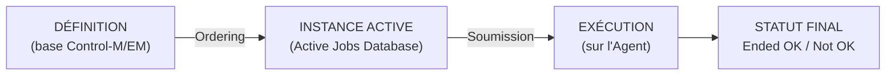

- **La définition** vit dans la base de Control-M/EM. Elle est statique, versionnable, déployable.
- **L'ordering** est l'acte de **créer une instance exécutable** de cette définition pour une
  **date de traitement** donnée. C'est ce que fait la *New Day Procedure* chaque nuit, ou une
  commande `ctm run order` à la demande.
- **L'exécution** n'a lieu que quand tous les pré-requis de l'instance sont satisfaits.

> **⚠️ Attention — l'erreur n°1 des débutants**
> « Mon job n'a pas tourné » a presque toujours l'une de ces deux causes :
> soit il **n'a jamais été ordonnancé** (critères `When` non satisfaits ce jour-là),
> soit il **est ordonnancé mais en attente** (`Wait Condition`, `Wait Resource`, `Wait User`).
> Ce sont deux diagnostics radicalement différents. Voir §16.4.

#### 1.2.4 La date de traitement (ODATE)

Control-M raisonne en **date de traitement** (*Order Date*, `ODATE`), et non en date système.
C'est fondamental : la « journée de production » du 15 janvier peut commencer à 7 h le 15 et se
terminer à 6 h 59 le 16.

- `%%ODATE` → date de traitement au format `AAMMJJ`
- `%%$ODATE` → date de traitement au format `AAAAMMJJ`
- `%%DATE` / `%%$DATE` → date **système** courante

Le basculement d'ODATE est piloté par le paramètre serveur **`DAYTIME`** (défaut `+0700`, soit
07:00). Voir §3.12.

> **✅ Bonne pratique**
> Dans vos scripts, prenez **toujours** la date en paramètre depuis Control-M (`%%ODATE`),
> jamais via `date +%Y%m%d` dans le script lui-même. Sinon une relance à J+1 d'un job du J
> retraitera les données du **mauvais jour**. C'est la cause la plus fréquente d'incidents
> de rejeu en production.

#### 1.2.5 Les événements (ex-conditions)

Un **événement** est un jeton nommé, daté, dans une file globale. C'est le mécanisme de
dépendance de Control-M.

- Un job **produit** un événement en fin de traitement (`AddEvents`) — l'ancienne *OUT condition*.
- Un job **attend** un ou plusieurs événements avant de démarrer (`WaitForEvents`) — l'ancienne
  *IN condition*.
- Un job peut **consommer** (supprimer) un événement (`DeleteEvents`).

Un événement est identifié par un **nom** *et* une **date** (`OrderDate` par défaut).
Deux instances du même job à deux jours différents ne se marchent donc pas dessus.

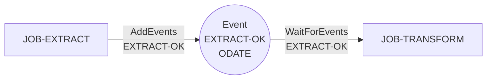

#### 1.2.6 Les ressources

Deux familles, deux usages :

| Type | Objet JSON | Usage | Analogie |
|---|---|---|---|
| **Resource Pool** (ex-Quantitative) | `Resource:Pool` | Limiter la concurrence : « 20 unités disponibles, ce job en consomme 5 » | Sémaphore compteur |
| **Resource Lock** (ex-Control) | `Resource:Lock` | Exclusion mutuelle : `Exclusive` (un seul) ou `Shared` (plusieurs lecteurs) | Verrou lecteur/écrivain |

#### 1.2.7 Le SLA

Un **service SLA** est un objectif de complétude horaire posé sur une chaîne de jobs.
Control-M ne se contente pas de constater le retard : il le **prédit** à partir des statistiques
historiques d'exécution, et peut déclencher des actions **avant** que l'échéance soit dépassée.

---

### 1.3 Architecture générale

#### 1.3.1 Vue d'ensemble

Control-M est une architecture **à trois niveaux** :

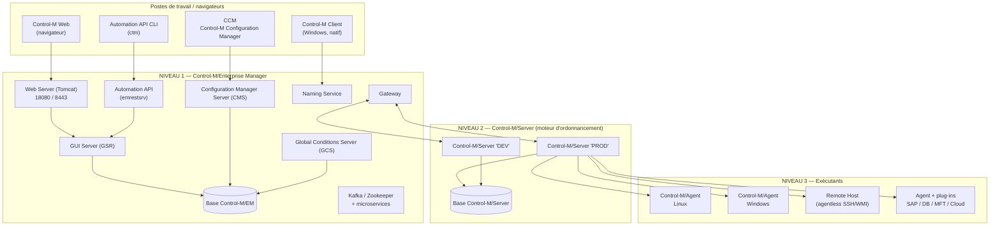

#### 1.3.2 Répartition des responsabilités

| Niveau | Composant | Responsabilité | Détient |
|---|---|---|---|
| **1** | Control-M/EM | Point de contrôle central, IHM, sécurité, API, référentiel des définitions | La base des **définitions** |
| **2** | Control-M/Server | Moteur d'ordonnancement : ordonnancement, résolution des dépendances, soumission, équilibrage de charge | La base de l'**environnement actif** |
| **3** | Control-M/Agent | Exécution réelle des traitements, remontée des statuts et sorties | Rien de persistant (au-delà des logs locaux) |

> **Point clé pour un entretien technique**
> La question « où sont mes jobs ? » a **deux réponses** :
> les **définitions** sont dans la base de Control-M/EM ;
> les **instances du jour** sont dans la base du Control-M/Server.
> Un `ctm deploy` écrit dans la première ; un `ctm run order` crée dans la seconde.

---

### 1.4 Les composants en détail

#### 1.4.1 Control-M/Server

**Rôle** : c'est le **moteur d'ordonnancement**. Il maintient sa propre base de données, décide
quels jobs sont éligibles, résout les dépendances, réserve les ressources et soumet les
traitements aux Agents. Il assure aussi la répartition de charge sur les *host groups*.

Un environnement Control-M comporte **un ou plusieurs** Control-M/Server, tous pilotés depuis
un seul Control-M/EM. C'est le découpage naturel pour séparer les environnements
(un Server DEV, un Server PROD) ou les périmètres géographiques.

**Processus principaux** (visibles avec `shctm`) :

| Processus | Fonction |
|---|---|
| **Supervisor (SU)** | Chef d'orchestre : lance et surveille les autres processus |
| **New Day Procedure (NDP)** | Bascule de journée, nettoyage, ordering du jour |
| **Selector (SL)** | Sélectionne les jobs prêts à être soumis |
| **Tracker (TR)** | Suit l'état des jobs en cours, traite les fins de job |
| **Communication (CD/CS)** | Dialogue avec les Agents |
| **Configuration Agent (CA)** | Watchdog : redémarre les composants tombés |
| **Log (LG)** | Écriture du journal Control-M (IOALOG) |

**Cycle de vie** :

```bash
start_ctm      # démarrage du Control-M/Server
shut_ctm       # arrêt propre
shctm          # liste les processus Control-M/Server actifs
ctm_pause      # suspend la soumission de nouveaux jobs sans arrêter le serveur
start_ca       # démarrage du Configuration Agent
shut_ca        # arrêt du Configuration Agent
show_ca        # état du Configuration Agent
```

> **⚠️ Attention**
> Les commandes historiquement citées `ctmstart` / `ctmstop` **n'existent pas** dans la
> documentation 9.0.21/9.0.22. Les noms exacts sont **`start_ctm`** et **`shut_ctm`**.

> **✅ Bonne pratique**
> Ne coupez jamais un Control-M/Server avec `kill -9`. `shut_ctm` laisse les jobs en cours se
> terminer proprement et ferme la base. Un arrêt brutal laisse des jobs en statut
> `Executing` fantôme qu'il faudra reprendre à la main.

#### 1.4.2 Control-M/Agent

**Rôle** : l'Agent est le **bras armé** du Server. Installé sur chaque machine où doivent
s'exécuter des traitements, il :

- reçoit les ordres de soumission ;
- lance le traitement sous l'utilisateur `RunAs` demandé ;
- capture le code retour et la sortie (*output*) ;
- remonte le statut au Server ;
- héberge les **plug-ins** applicatifs (SAP, bases de données, MFT, cloud…) ;
- fournit les fonctions avancées : *file watching* (`ctmfw`), compteurs, variables locales.

**Dimensionnement d'entrée de gamme** (9.0.21.300) :

| Plateforme | CPU | RAM | Disque | Jobs concurrents |
|---|---|---|---|---|
| Windows | 2 cœurs | 4 Go | 1 000 Mo | jusqu'à **100** |
| UNIX / Linux | 2 cœurs | 4 Go | 1 000 Mo | jusqu'à **500** |

Swap recommandé : **3 × la RAM** (à distinguer du 1,5 × recommandé pour EM et Server).

**Cycle de vie et outillage** :

```bash
start-ag -u <user> -p ALL   # démarrage de l'Agent
shut-ag  -u <user> -p ALL   # arrêt de l'Agent
ctmagcfg                    # configuration interactive (ports, SSL, mode persistant…)
ag_ping                     # le Control-M/Server est-il joignable ?
ag_diag_comm                # diagnostic complet de communication côté Agent
agdbglvl                    # change le niveau de trace de l'Agent
ctmfw                       # utilitaire File Watcher
set_agent_mode              # bascule root / non-root / sudo (Linux)
```

**Fichier de configuration** :

| Plateforme | Emplacement |
|---|---|
| UNIX / Linux | `<Agent Home>/ctm/data/CONFIG.dat` |
| Windows | Registre : `HKEY_LOCAL_MACHINE\SOFTWARE\BMC Software\Control-M/Agent\CONFIG` |
| IBM i | `<Agent Home>/data/CONFIG` |

> **Version**
> Depuis **9.0.21.100**, plusieurs Agents peuvent cohabiter sur un même hôte UNIX,
> chacun sous **un compte système distinct** et avec **un nom unique**.

#### 1.4.3 Les hôtes agentless (*Remote Hosts*)

Quand l'installation d'un Agent est impossible (appliance, politique interne, machine hors
périmètre), Control-M peut piloter la machine **sans agent**, via :

- **SSH** (Linux/UNIX, port 22 par défaut) — clés OpenSSH ou SSH2, RSA/DSA, 256 à 3 072 bits ;
- **WMI** (Windows Management Instrumentation).

Le traitement est alors exécuté **depuis un Agent relais** vers l'hôte distant.

| | Agent | Agentless (Remote Host) |
|---|---|---|
| Installation sur la cible | Requise | Aucune |
| Performance | Optimale | Surcoût de connexion à chaque job |
| File watching natif | Oui | Non |
| Plug-ins applicatifs | Oui | Non |
| Variables locales / compteurs | Oui | Limité |
| Reprise après coupure réseau | Robuste | Fragile |

> **⚠️ Attention**
> Pour WMI, le compte de service de l'Agent doit être **Administrateur** et **utilisateur de
> domaine**, et le compte `RunAs` doit appartenir au groupe Administrateurs de la machine cible.
> C'est une contrainte de sécurité lourde : l'agentless Windows est souvent refusé par les
> équipes sécurité. Privilégiez un Agent.

#### 1.4.4 Control-M/EM (Enterprise Manager)

**Rôle** : le **point de contrôle unique** de tout l'écosystème. C'est lui qui expose l'IHM,
détient la base des définitions, applique le modèle de sécurité et publie l'Automation API.

**Composants serveur de l'EM** :

| Composant | Sigle | Fonction |
|---|---|---|
| **GUI Server** | GSR | Gère la communication entre les clients et les Control-M/Servers |
| **Gateway** | GTW | Assure la communication EM ↔ Control-M/Server (**une Gateway par Server**) |
| **Configuration Manager Server** | CMS | Reçoit les informations serveur, traite les requêtes d'administration |
| **Global Conditions Server** | GCS | Distribue les événements **globaux** entre Control-M/Servers |
| **Naming Service** | NS | Permet aux clients de localiser le GUI Server |
| **Web Server** | — | Tomcat : Control-M Web, Self Service, Automation API |
| **Configuration Agent** | CA | Watchdog : surveille et relance les composants EM |
| **Microservices** | — | Kafka, Zookeeper, Services Health Monitor, Validation Service, Reports Service |

> **Point clé**
> Le **Global Conditions Server** est ce qui rend possibles les **dépendances entre
> Control-M/Servers différents**. Sans lui, un job du Server « PROD-FR » ne peut pas attendre
> un événement produit sur le Server « PROD-US ». Voir §7.5.

**Dimensionnement (9.0.21.300)** :

| Taille | Jobs actifs | Exécutions/jour | Utilisateurs | RAM |
|---|---|---|---|---|
| Small | 0 – 40 000 | 0 – 40 000 | 20 – 40 | 16 Go |
| Medium | 35 000 – 300 000 | 35 000 – 300 000 | 40 – 200 | 32 Go |
| Large | 280 000 – 600 000 | 280 000 – 600 000 | 180 – 400 | 60 Go |

#### 1.4.5 Control-M Web, Client, CCM, Self Service

| Interface | Nature | Usage principal |
|---|---|---|
| **Control-M Web** | Navigateur (Chrome/Edge 115+) | Interface principale actuelle : Planning, Monitoring, Administration, Automation API |
| **Control-M Client** | Application Windows native | Interface historique (« fat client ») — encore utilisée sur certaines plateformes |
| **CCM** (Control-M Configuration Manager) | Application Windows | Administration technique : composants, agents, SSL, haute disponibilité, alertes système |
| **Control-M Self Service** | Application web séparée (`http://<EM>:18080/SelfService`) | Vue métier des services, sans droits d'administration |

**Domaines de Control-M Web** :

| Domaine | Contenu |
|---|---|
| **Planning** | Workspaces, Jobs, Folders, Events, Resources, Calendars, Variables, Site Standards |
| **Monitoring** | Viewpoints, Services, Jobs, Alerts |
| **Administration / Configuration** | Agents, Authentication, Authorizations, System Settings |
| **Automation API** | Documentation Swagger embarquée, jetons d'API |
| **Plug-ins** | Installation et gestion des plug-ins applicatifs |

> **SaaS**
> **Control-M Self Service n'existe pas en Control-M SaaS**, pas plus que le CCM ni le
> Control-M Client natif. Toute l'administration passe par Control-M Web et l'Automation API.

#### 1.4.6 Control-M Automation API

**Rôle** : exposer **tout** Control-M en **REST** et en **CLI**, pour permettre l'approche
*Jobs as Code* et l'intégration dans une chaîne CI/CD.

Deux surfaces, un seul moteur :

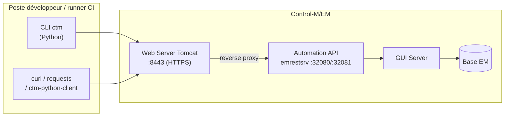

Le CLI `ctm` **n'est pas** un client lourd : c'est un simple habillage des mêmes appels REST.
Tout ce que fait `ctm`, `curl` peut le faire — et réciproquement. Voir Partie VI.

> **Version**
> Le CLI `ctm` est écrit en **Python** dans les versions actuelles (Python 3.8.4+, pip 20.1.1+).
> Les anciennes versions (≤ 9.0.20) utilisaient un CLI **Node.js** installé par
> `npm install -g ctm-cli.tgz`. Lors d'une montée de version, le CLI est migré
> automatiquement de Node.js vers Python.

#### 1.4.7 Control-M Managed File Transfer (MFT)

**Rôle** : industrialiser les transferts de fichiers en les traitant comme des **jobs de plein
droit** — donc avec dépendances, calendriers, SLA, relances et supervision, exactement comme un
traitement batch.

MFT s'installe comme un **plug-in sur un Control-M/Agent**. Il permet de transférer :

- d'un hôte local vers un hôte agentless ;
- d'un hôte agentless vers un hôte local ;
- d'un hôte agentless vers un autre hôte agentless.

Un job de transfert porte **jusqu'à cinq définitions de transfert séquentielles**.

**MFT Enterprise (B2B)** est un module additionnel pour les échanges avec l'**extérieur** :

| Composant | Emplacement | Rôle |
|---|---|---|
| **MFT Enterprise Hub** | Réseau interne (sur les serveurs EM) | Serveur central, authentifie internes **et** externes. ≥ 3 recommandés (HA) |
| **MFT Enterprise Gateway** | **DMZ** | Reverse-proxy SFTP/FTPS/AS2/HTTPS. **Ne stocke aucune donnée**. ≥ 2 recommandés |
| **MFT Enterprise File Exchange** | Web | Portail : les partenaires externes déposent et récupèrent leurs fichiers |

**Règle d'architecture** : les utilisateurs internes se connectent directement au Hub ;
les utilisateurs externes passent **obligatoirement** par la Gateway en DMZ.

Voir Partie VII pour le détail complet.

> **⚠️ Attention — fin de support**
> **Control-M for Advanced File Transfer (AFT)**, la génération précédente (dernière version
> 8.2.00), est en **fin de support depuis le 31 décembre 2023**. BMC recommande la migration
> vers MFT. Vous en verrez encore la trace : les exemples JSON MFT utilisent toujours
> `"Application": "aft"`, et l'interface parle encore de *« Do post AFT Command on Failure »*.

#### 1.4.8 Les add-ons

| Add-on | Fonction |
|---|---|
| **SLA Management** (ex-BIM) | Définition et suivi d'engagements de service, prédiction de retard |
| **Control-M/Forecast** | Simulation : « que va-t-il se passer le 31 décembre ? » |
| **Control-M Workload Change Manager** (WCM) | Circuit de demande/validation de changement, site standards, promotion entre environnements |
| **Control-M Workload Archiving** | Archivage long terme des logs et sorties de jobs |
| **Control-M Self Service** | Portail métier de consultation des services |
| **Control-M Reports** | Génération de rapports (CSV, PDF, Excel) |
| **Control-M Application Integrator** | Atelier de création de plug-ins maison |

> **SaaS**
> Forecast, Workload Archiving et Self Service sont documentés comme add-ons **self-hosted**.
> BMC ne publie pas de comparatif exhaustif « self-hosted vs SaaS » : vérifiez la disponibilité
> d'un add-on donné auprès de votre interlocuteur BMC avant de bâtir une architecture dessus.

#### 1.4.9 Plug-ins et intégrations

Control-M distingue deux familles.

**1. Les plug-ins « classiques »**, installés sur l'Agent, livrés en packages :

| Plug-in | Version 9.0.21 | Contenu |
|---|---|---|
| Control-M for Databases | 9.0.21 | Oracle, MSSQL, DB2, PostgreSQL, Sybase, JDBC — requêtes, scripts SQL, procédures stockées, SSIS |
| Control-M for SAP | 9.0.21 | R/3, BW, Data Archiving |
| Control-M for Hadoop | 9.0.21 | Spark, Hive, Pig, Sqoop, HDFS, Oozie, MapReduce |
| Control-M for Informatica | 9.0.21 | Workflows PowerCenter |
| Control-M for Oracle E-Business Suite | 9.0.21 | — |
| Control-M for PeopleSoft | 9.0.21 | — |
| Control-M Managed File Transfer | — | Transferts SFTP/FTPS/S3/Azure/GCS |
| Control-M for Web Services, Java and Messaging | 9.0.00 | Web services REST/SOAP, classes Java, JMS/MQ |
| Control-M for AWS / for Azure / for Cloud | 9.0.21 / 9.0.00 | Services cloud |
| Control-M for Backup | 9.0.21 | Sauvegardes |
| Control-M for Airflow | 9.0.21 | Orchestration de DAG Airflow |
| Control-M Application Pack | 9.0.21 | Bundle multi-applications |
| Control-M Application Integrator | 9.0.21 | Atelier de création de plug-ins |

**2. Les « Control-M Integrations »** — plug-ins modernes construits avec Application Integrator
et livrés en continu par BMC. Le catalogue actuel (non exhaustif) :

| Domaine | Intégrations |
|---|---|
| **AWS** | Lambda, EC2, ECS, EMR, Glue, Glue DataBrew, Batch, Step Functions, SageMaker, QuickSight, Athena, Redshift, SQS, SNS, DynamoDB, MWAA, AppFlow, Data Pipeline, Backup, CloudFormation, DataSync, App Runner, DMS, Bedrock, RDS, Mainframe Modernization |
| **Azure** | Virtual Machine, Functions, Data Factory, Databricks, HDInsight, Batch Accounts, Synapse, Logic Apps, Machine Learning, Backup, DevOps, Container Instances, Resource Manager, Service Bus, VM Scale Sets, AI Foundry, App Services WebJobs |
| **GCP** | Virtual Machine, Composer, Dataproc, Dataflow, Data Fusion, BigQuery, Dataprep, Functions, Workflows, Deployment Manager, Dataplex, Cloud Run, Vertex AI, Eventarc, Managed Instance Groups |
| **OCI** | VM, Data Integration, Data Flow, Data Science, Functions, Data Transforms |
| **Data / ETL** | Talend, Informatica CS, Boomi AtomSphere, Databricks, Apache Airflow, Astronomer, Apache NiFi, Airbyte, Matillion, Fivetran, dbt, Alteryx Trifacta, Dataiku, IBM DataStage |
| **BI / Analytics** | Tableau, Microsoft Power BI, Qlik Cloud, Snowflake, Snowflake Cortex AI, Microsoft Fabric |
| **ERP** | SAP Integration Suite, SAP IBP, SAP Datasphere, SAP BTP Scheduler, Oracle Fusion Cloud ESS |
| **DevOps / CI-CD** | Jenkins, GitHub Actions, CircleCI, Atlassian Bitbucket, Atlassian Jira, Terraform |
| **Messaging** | Apache Kafka via Confluent, IBM MQ, RabbitMQ, AWS SQS/SNS, Azure Service Bus |
| **Sauvegarde** | Veeam Backup, Veritas NetBackup, Rubrik, AWS Backup, Azure Backup |
| **Supervision** | Datadog, PagerDuty |
| **RPA** | UiPath, Automation Anywhere |
| **IA / agents** | LangGraph, CrewAI, Amazon Bedrock, GCP Vertex AI, Azure AI Foundry |
| **Autres** | VMware by Broadcom, Web Services REST, Web Services SOAP, Micro Focus, Microsoft Power Automate |

> **⚠️ Attention**
> Le catalogue d'intégrations bouge **tous les mois**. Ne considérez jamais une liste comme
> définitive : consultez le catalogue officiel de votre version avant de promettre une
> intégration à un projet.

**Control-M Application Integrator** permet de créer **vos propres types de jobs** quand aucune
intégration n'existe. Trois méthodes de connexion supportées : **REST API**, **ligne de commande**,
**service web**. Le cycle : créer le plug-in → développer les étapes et attributs → valider et
tester → publier sur le Server et déployer sur les Agents. Le type de job créé devient alors
disponible dans le domaine Planning comme n'importe quel type natif — avec critères de
planification, dépendances, verrous, pools et variables.

---

### 1.5 Le cycle de vie complet d'un job

Voici ce qui se passe réellement, de la définition à l'archivage.

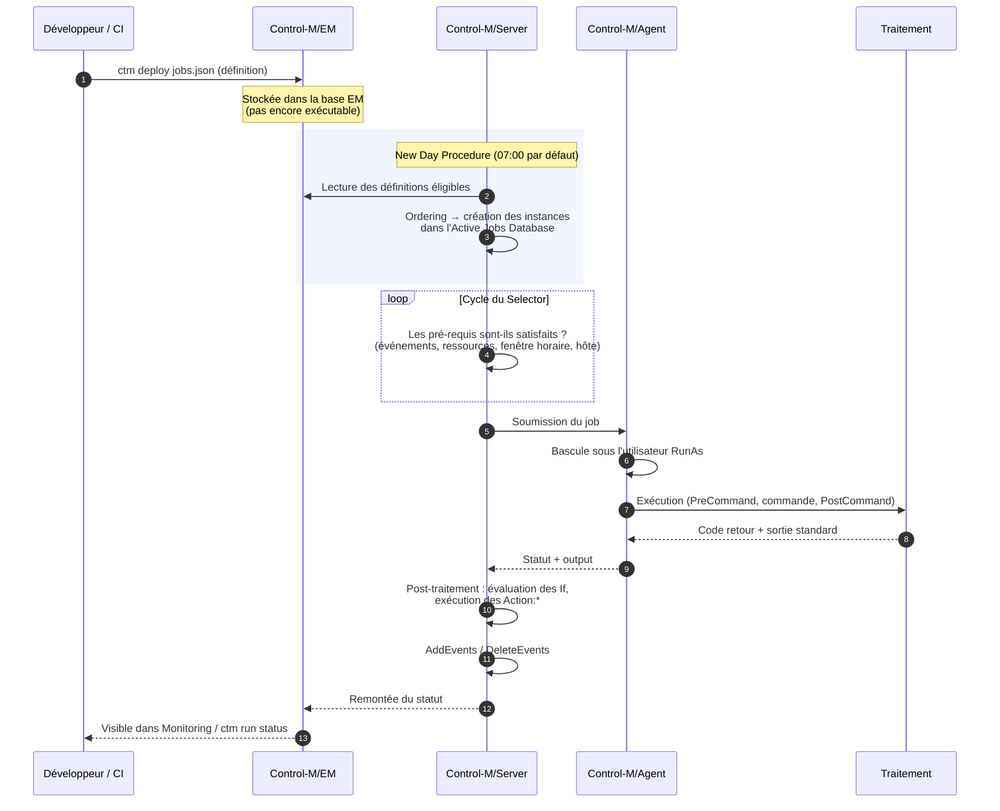

**Étape par étape** :

1. **Définition** — le job est décrit (via l'IHM ou en JSON) et stocké dans la base EM.
2. **Ordering** — à la *New Day* ou à la demande, une **instance** est créée pour l'ODATE du jour.
   Si les critères `When` ne matchent pas, **rien n'est créé** : le job n'existera pas ce jour-là.
3. **Attente** — l'instance patiente tant que : les événements attendus ne sont pas là, les
   ressources ne sont pas libres, la fenêtre `FromTime`/`ToTime` n'est pas ouverte, l'hôte n'est
   pas disponible, ou une confirmation manuelle est requise.
4. **Soumission** — le Server envoie l'ordre à l'Agent désigné.
5. **Exécution** — l'Agent bascule sous `RunAs` et lance `PreCommand`, la commande, puis
   `PostCommand`.
6. **Post-traitement** — le Server évalue les blocs `If` (code retour, contenu de la sortie,
   nombre d'exécutions…) et déclenche les actions associées (mail, relance, mise à OK…).
7. **Événements** — les `AddEvents` sont publiés, les `DeleteEvents` consommés. Les successeurs
   se débloquent.
8. **Rétention** — l'instance reste visible dans l'environnement actif selon `DaysKeepActive`,
   puis est purgée par la New Day suivante. Les logs et sorties sont conservés selon
   `OUTPUTRETN` et `IOALOGLM`.

---

### 1.6 Self-hosted vs Control-M SaaS

BMC propose deux modes de consommation. Le nom **« Helix Control-M »** subsiste dans certaines
pages ; la dénomination actuelle est **« Control-M SaaS »**.

| Aspect | Self-hosted | Control-M SaaS |
|---|---|---|
| Control-M/EM | Vous l'installez et l'exploitez | Hébergé par BMC |
| Control-M/Server | Vous l'installez | Hébergé par BMC (« SaaS Control-M/Servers ») |
| Bases de données | Vous les gérez (PostgreSQL/Oracle/MSSQL) | Gérées par BMC |
| Control-M/Agent | Sur votre infrastructure | **Sur votre infrastructure** (inchangé) |
| Plug-ins | Vous les installez sur les Agents | Vous les installez depuis l'IHM web |
| Montées de version | À votre charge | Assurées par BMC |
| CCM / Control-M Client | Disponibles | Absents |
| Self Service | Disponible | Absent |
| Flux réseau | Bidirectionnel Server ↔ Agent (7005/7006) | **Sortant uniquement**, Agent → SaaS en **HTTPS/443** |
| Authentification API | Session token **ou** API token | **API token uniquement** |
| Endpoint API | `https://<EM>:8443/automation-api` | `https://<tenant>-aapi.<zone>.controlm.com/automation-api` (sans port) |

**Le point d'architecture décisif en SaaS** : la connexion est **sortante uniquement**.
L'Agent initie la connexion vers la plateforme SaaS ; **aucune règle firewall entrante n'est
nécessaire**. Les flux à autoriser en sortie :

```
*.controlm.com:443      (sortant uniquement)
*.amazonaws.com:443     (sortant uniquement)
```

Des URL plus restreintes, propres à votre tenant, sont récupérables par la commande
`ctm config systemsettings:tenanturls::get`.

**Prérequis Agent en SaaS** :

- Agent **9.0.21.100+** (9.0.21.200+ sous Windows pour certains plug-ins) ;
- Java installé séparément (11, 17 ou 21) ;
- nom d'Agent **unique** ;
- pour l'Automation API CLI : Python 3.8.4+ et pip 20.1.1+ ;
- Windows : 4 cœurs, 2–8 Go de RAM, 1 000 Mo de disque. UNIX : 2 cœurs, 6 Go de RAM.

**Enregistrement d'un Agent SaaS** : générer un jeton d'Agent pour le Control-M/Server SaaS cible,
puis lancer sur l'hôte :

```bash
ctm provision saas:agent::setup
```

---

### 1.7 Versions, compatibilité et pièges

#### 1.7.1 Le rythme des versions

Control-M suit deux cadences :

- des **versions majeures** (9.0.20, 9.0.21, 9.0.22) ;
- des **fix packs** trimestriels (9.0.21.100, 9.0.21.200, 9.0.21.300…) et une documentation
  **« Monthly »** pour l'Automation API, qui évolue chaque mois.

#### 1.7.2 Java n'est plus embarqué

> **Version — changement majeur en 9.0.21.000**
> **Java a été découplé de Control-M.** Un JRE/JDK externe est désormais **obligatoire** :
> il n'est plus livré avec le produit.
> - Versions supportées : **Java 11, 17, 21** (64 bits).
> - **L'Automation API exige Java 17 ou supérieur à partir de 9.0.21.325 et ne supporte plus Java 11.**
> - Fournisseurs : IBM Java (AIX) ; Eclipse Temurin, Oracle, Azul, Red Hat (Linux) ;
>   Eclipse Temurin, Oracle, Azul, Microsoft, AWS Corretto (Windows).

C'est la cause n°1 d'échec d'installation ou de mise à jour d'Agent depuis 9.0.21.

#### 1.7.3 Compatibilité des composants

Règle générale : **Control-M/EM doit être à un niveau ≥ celui des Control-M/Servers**, qui
doivent être à un niveau ≥ celui des Agents. On monte donc **de haut en bas** :
EM d'abord, puis les Servers, puis les Agents.

#### 1.7.4 Points d'attention par version

| Sujet | Attention |
|---|---|
| CLI Automation API | Node.js (≤ 9.0.20) → **Python** (9.0.21+) |
| Ressources JSON | `Resource:Semaphore` / `Resource:Mutex` (9.0.19–9.0.20) → **`Resource:Pool` / `Resource:Lock`** (9.0.21+) |
| Calendriers JSON | Noms de types modifiés → `Calendar:Regular`, `Calendar:Periodic`, `Calendar:RuleBasedCalendar` |
| Jobs cloud | Anciens types `Job:AWS:Lambda` **dépréciés** → nouveaux types à espaces `Job:AWS Lambda` |
| Java | Découplé en 9.0.21.000 |
| `Notify:LateCyclicSubmit` | Requiert Control-M/EM **9.0.21+** |
| `ReferencePath` (sous-dossiers modèles) | Requiert Control-M/EM **9.0.21+** |
| Jetons d'API (`x-api-key`) | Disponibles à partir de **9.0.21** |
| Sybase | **Non listé** dans les bases supportées en 9.0.21.300 |
| Solaris | **Non listé** pour EM/Server en 9.0.21.300 (AIX et Linux x86_64 uniquement) |
| AIX 7.1 | **Plus supporté** |

> **✅ Bonne pratique**
> Documentez dans votre référentiel interne **la version exacte** de chaque composant
> (`ctm --version` pour le CLI, la page *About* de Control-M Web pour l'EM,
> `ctm config servers::get` pour les Servers). Un guide générique ne remplace jamais
> la connaissance de votre propre pile.

---

# Partie II — Installation et configuration

## 2. Installation et configuration

> **Portée de ce chapitre**
> L'installation de Control-M est un projet d'infrastructure à part entière, guidée par un
> installeur interactif et par des procédures qui varient selon l'OS, la base de données et la
> topologie. Ce chapitre vous donne **la carte** : ce qu'il faut préparer, dans quel ordre,
> quels ports ouvrir, comment vérifier — pas le clic-à-clic de l'assistant, qui est propre à
> votre version et documenté par BMC.

### 2.1 Prérequis

#### 2.1.1 Dimensionnement — installation complète (9.0.21.300)

| Ressource | UNIX (AIX / Linux x86_64) | Windows |
|---|---|---|
| CPU | 4 vCPU, indice SPEC 100 (SPECint2006_int_rate), 30 rPerf sur AIX | 4 vCPU, indice SPEC 100 |
| Mémoire | Small **20 Go** / Medium **37 Go** / Large **65 Go** (+4 Go si base locale) | Idem |
| Disque | **100 Go** minimum (+4 Go si base locale) ; swap = **1,5 × RAM** | Idem |
| Affichage | — | 16 bits (65 536 couleurs) minimum |
| Logiciels associés | — | Chrome ou Edge ; .NET Framework 4.7.2 |

#### 2.1.2 Dimensionnement par composant

| Composant | RAM | Disque (install / upgrade) | Swap |
|---|---|---|---|
| **Control-M/EM** | 16 / 32 / 60 Go | 60 Go / 12 Go (UNIX), 7 Go (Windows) | 1,5 × RAM |
| **Control-M/Server** | 8 / 12 / 16 Go | 40 Go / 7 Go | 1,5 × RAM |
| **Control-M/Agent** | 4 Go | 1 000 Mo | **3 × RAM** |

#### 2.1.3 Bases de données supportées (9.0.21.300)

| SGBD | Version | Remarques |
|---|---|---|
| **PostgreSQL fourni par BMC** | **15.3** | Installé automatiquement en mode « Default » |
| **PostgreSQL existant/externe** | **11.x – 16.x** | Extensions `plpgsql` et `dblink` requises |
| **Oracle** | **19c** | Enterprise ou Standard Edition |
| **Microsoft SQL Server** | 2022, 2019, 2017, 2016, 2014 SP3 | Requiert **ODBC Driver 17** et **Command Line Utilities 15** |

> **⚠️ Attention**
> **Sybase n'apparaît plus** dans les bases supportées en 9.0.21.300. Si vous exploitez encore
> une base Sybase, la montée de version implique une migration de SGBD.

#### 2.1.4 Java

Depuis 9.0.21.000, **Java est externe et obligatoire** : versions 11, 17 ou 21 en 64 bits.
L'Automation API exige **Java 17+ à partir de 9.0.21.325**.

```bash
# Vérification avant toute installation
java -version
echo $JAVA_HOME
```

#### 2.1.5 Prérequis système

| Plateforme | Prérequis |
|---|---|
| **UNIX / Linux (Server)** | Compte système **dédié** au Control-M/Server ; **shell bash installé** (dépendance Kafka) |
| **UNIX / Linux (EM)** | Idem ; sur AIX, **bash obligatoire** |
| **Windows (Server)** | Compte d'installation **Administrateur** ; droits `Read, List Folder Contents, Write, Read & Execute` sur le dossier d'installation pour le groupe `Users` |
| **Navigateurs** | Chrome ou Edge **115+**, résolution optimale 1920×1080 |

> **⚠️ Attention**
> Les versions exactes de RHEL, Oracle Linux, SUSE ou Windows Server supportées ne sont **pas**
> publiées dans les pages générales : elles vivent dans la **matrice de compatibilité produit
> BMC (EPD)**, accessible après authentification sur le portail support. **Vérifiez-la
> systématiquement** avant de commander des machines — c'est un point de blocage classique en
> projet.

#### 2.1.6 Checklist de préparation

```text
[ ] Machines provisionnées (CPU/RAM/disque conformes au dimensionnement)
[ ] Système d'exploitation à une version listée dans la matrice EPD BMC
[ ] Java 11/17/21 64 bits installé, JAVA_HOME positionné
[ ] bash installé (UNIX/AIX)
[ ] Comptes système dédiés créés (ctmuser, emuser…) avec shell et home corrects
[ ] Swap dimensionné (1,5 × RAM pour EM/Server, 3 × RAM pour Agent)
[ ] Base de données prête (ou choix du PostgreSQL embarqué)
[ ] Résolution DNS opérationnelle dans les DEUX sens (direct et inverse)
[ ] Ports firewall ouverts (voir §2.8)
[ ] Certificats TLS commandés auprès de la PKI interne (voir §2.9)
[ ] Politique de sauvegarde définie pour les bases EM et Server
[ ] Synchronisation NTP active sur TOUTES les machines
```

> **✅ Bonne pratique — la synchronisation horaire**
> Control-M raisonne en dates et fenêtres horaires. Une dérive d'horloge entre le Server et
> un Agent provoque des symptômes incompréhensibles : jobs soumis hors fenêtre, `FromTime`
> ignoré, statistiques faussées. **NTP est un prérequis, pas un confort.**

---

### 2.2 Architectures recommandées

Trois topologies couvrent la majorité des cas. Le chapitre 17 les détaille davantage.

#### 2.2.1 Petite infrastructure (« tout-en-un »)

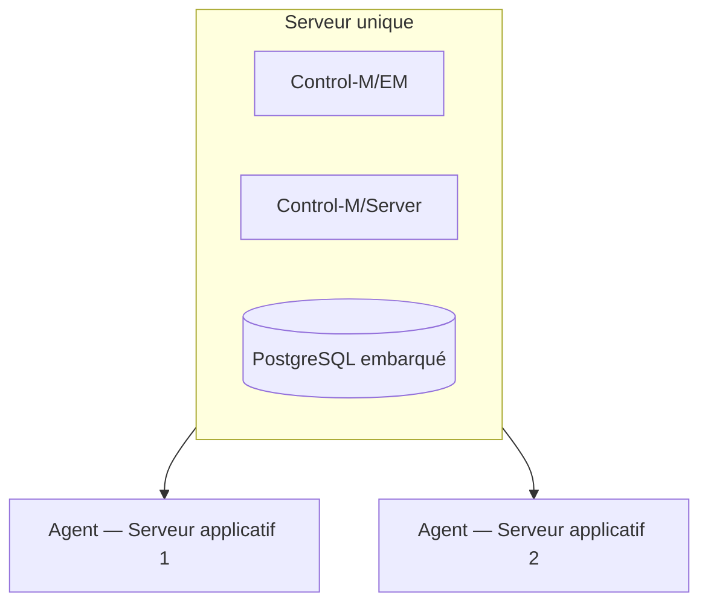

Convient pour : maquette, formation, PME, environnement de développement.
**Ne convient pas** pour une production ayant un engagement de disponibilité.

#### 2.2.2 Environnement d'entreprise

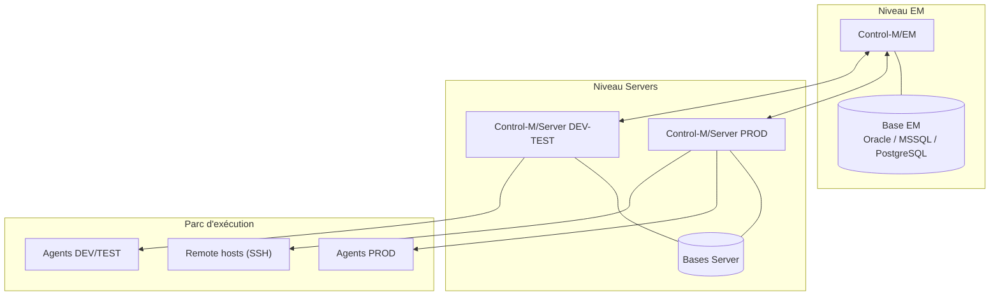

Principes :

- **EM séparé** des Control-M/Servers ;
- **base externalisée** sur un cluster SGBD géré par l'équipe DBA ;
- **un Control-M/Server par environnement logique** — c'est le découpage naturel pour isoler
  PROD de DEV/TEST tout en gardant **une seule console** ;
- Agents sur chaque machine d'exécution.

#### 2.2.3 Haute disponibilité

Voir §17.3. Deux configurations HA sont supportées :

1. **Oracle / MSSQL / PostgreSQL externe** — hôte secondaire pour l'EM ou le Control-M/Server ;
2. **PostgreSQL dédié BMC** — Control-M/Server secondaire **et** serveur PostgreSQL secondaire,
   avec **bascule manuelle**.

---

### 2.3 Ordre d'installation

L'ordre est **impératif** :

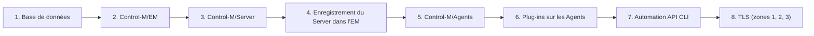

#### 2.3.1 Installation de Control-M/EM

Points de vigilance :

- choisir entre **PostgreSQL fourni** (simple, autonome) et **base existante** (gouvernance DBA,
  sauvegarde intégrée au SI) ;
- l'installeur crée le compte de service, la base, le schéma, les composants (GSR, Gateway, CMS,
  GCS, Naming Service, Web Server) et le **Configuration Agent** ;
- vérifier après installation :

```bash
emweb_status                        # état du serveur web Tomcat
em -no_wrap cha -get_kafka_inf      # disponibilité de Kafka
```

Accès aux interfaces :

```text
Control-M Web     : https://<EM_HOST>:8443
Self Service      : http://<EM_HOST>:18080/SelfService
Automation API    : https://<EM_HOST>:8443/automation-api
Swagger local     : https://<EM_HOST>:8443/automation-api
Spec YAML         : https://<EM_HOST>:8443/automation-api/yaml
```

#### 2.3.2 Installation de Control-M/Server

Après installation, le Server doit être **déclaré dans l'EM** — sinon il tourne mais n'est
piloté par personne. Deux voies :

```bash
# Via l'Automation API
ctm config server::add -f server-definition.json

# Vérification
ctm config servers::get
```

Ou via le CCM : *Configuration → Control-M/Servers → Add*.

Répertoires clés :

| Chemin | Contenu |
|---|---|
| `<Control-M/Server home>/ctm_server/data/` | Configuration mail, données diverses |
| `<Control-M/Server home>/ctm_server/scripts/` | Utilitaires, dont `ctmkeytool` |
| `<CTM Home>/data/SSL/cert/ess_key.txt` | Clé de chiffrement des mots de passe |
| `<Control-M/Server home>/health_check/` | Collecteur de diagnostic |
| `<ctmserver_InstallFolder>/BMCINSTALL/uninstall/` | Désinstalleur |

#### 2.3.3 Installation des Agents

Trois méthodes, du plus manuel au plus industriel.

**(a) Installeur interactif** — package fourni, exécuté sur la machine cible.

**(b) Provisioning à distance via l'Automation API** — la méthode recommandée en volume :

```bash
# 1. Lister les images disponibles pour l'OS cible
ctm provision images Linux

# 2. Déposer une image dans un dépôt (si nécessaire)
ctm provision repository::add MonDepot /partage/controlm/images "Images Agents"
ctm provision repository::set MonDepot

# 3. Installer l'Agent à distance
ctm provision agent::install <image> <server> <agentName> <port> -f agent-config.json

# 4. Vérifier
ctm config server:agents::get <server> "agent=<agentName>"
ctm config server:agent::ping <server> <agentName>
```

**(c) En Control-M SaaS** :

```bash
ctm provision saas:agent::setup
```

**Montées de version des Agents** (industrialisable) :

```bash
ctm provision upgrades:versions::get                       # versions disponibles
ctm provision upgrades:agents::get -s "type=Agent&version=9.0.21.200"
ctm provision upgrade::install <server> <agent> Agent 9.0.21.300 "MAJ-Agents-Q1"
ctm provision upgrade::get <upgradeID>                     # suivi
ctm provision upgrade:output::get <upgradeID>              # log détaillé
ctm provision upgrade::retry <upgradeID>                   # relance après échec
```

> **✅ Bonne pratique**
> Le provisioning par API rend le parc d'Agents **reproductible et auditable**. Combinez-le
> avec Ansible/Terraform : Terraform crée la VM, Ansible installe Java et les prérequis,
> `ctm provision agent::install` pose l'Agent, `ctm config server:agent::ping` valide.
> Toute l'opération tient dans un pipeline.

---

### 2.4 Communication Server ↔ Agent

C'est le point le plus souvent mal compris — et la source de la moitié des incidents réseau.

#### 2.4.1 Le sens des ports

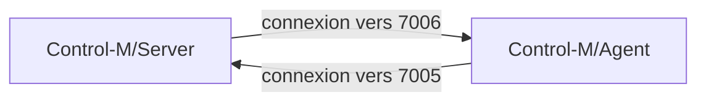

| Sens | Port par défaut | Paramètre serveur | Paramètre agent |
|---|---|---|---|
| **Server → Agent** | **7006** | `PORTNUM` | port d'écoute de l'Agent |
| **Agent → Server** | **7005** | `CTMS_PORT_NUM` | `ATCMNDATA` (`7005/30` = port/timeout en secondes) |

> **⚠️ L'erreur classique**
> On croit qu'un seul port suffit. **Non** : la communication est **bidirectionnelle** et
> **chaque sens initie sa propre connexion TCP**. Un firewall qui n'ouvre que 7006 laissera
> le Server soumettre les jobs — mais l'Agent ne pourra **jamais** remonter le statut.
> Symptôme : les jobs restent éternellement en `Executing`.

#### 2.4.2 Mode de connexion : transitoire ou persistant

| Mode | Comportement | Quand l'utiliser |
|---|---|---|
| **Transitoire** (défaut) | La connexion s'ouvre au besoin puis se ferme | Réseau local, pas de firewall entre les deux |
| **Persistant** | La connexion reste ouverte en permanence | **Firewall entre Server et Agent**, NAT, DMZ |

**Activation côté Server** : `ctm_menu` → *Parameter Customization* → sélectionner l'Agent →
option **8** (persistent connection).

**Activation côté Agent** :

```bash
ctmagcfg
# → option 7  : Advanced Parameters
# → option 6  : Persistent Connection = Y
# → option 7  : Allow Comm Init       = Y
# → touche s  : sauvegarder
```

#### 2.4.3 Paramètres Agent essentiels

| Paramètre | Défaut | Rôle |
|---|---|---|
| `ATCMNDATA` | `7005/30` | Port du Control-M/Server recevant les données de l'Agent, et timeout (s). Plage 1024–65533 |
| `CTMSHOST` | — | **Liste des Control-M/Servers**, primaire et secours, séparés par `\|` — c'est le mécanisme de bascule côté Agent |
| `ALLOW_COMM_INIT` | `Y` | `Y` / `N` / `A` (auto) — l'Agent peut-il ouvrir une connexion vers le Server (mode persistant) |
| `AUTHORIZED_CTM_IP` | — | Adresse IP du Control-M/Server autorisé |
| `PROTOCOL_VERSION` | `13` | Plage 12–14 |
| `COMMOPT` | — | `SSL=Y` / `SSL=N` |
| `AGENT_DIR` | — | Répertoire racine de l'Agent (non modifiable) |

Exemple de `CTMSHOST` avec bascule :

```text
CTMSHOST=192.138.28.121|aristo.isr.bmc.com|mybksys1|192.138.28.123
```

#### 2.4.4 Diagnostic de communication

**Depuis le Control-M/Server** :

```bash
ctm_diag_comm                    # mode interactif
ctm_diag_comm <agentName>        # diagnostic d'un agent précis
```

Le rapport contient : utilisateur et répertoire CTMS, architecture et version de plateforme, nom
de l'interface IP, **numéros de ports Server→Agent et Agent→Server**, protocole et version de
communication, mode de connexion, plateforme et statut de l'Agent, résultat du ping,
disponibilité de l'hôte distant.

```bash
ctmping -HOSTID <agent> -FULLDETAILS
ctmping -HOSTID <remoteHost> -HOSTTYPE REMOTE -FULLDETAILS
```

Sorties typiques :

```text
Agent: Jacklin is alive
Agent: Diana, Msg: Agent not available. Add it to the database? y/n:
```

```bash
# Consultation / modification du statut d'un Agent
ctm_agstat -LIST   <agentName>
ctm_agstat -UPDATE <agentName> AVAILABLE
ctm_agstat -UPDATE <agentName> DISABLED
```

> **⚠️ Attention**
> Seules **deux valeurs** sont positionnables par `-UPDATE` : `AVAILABLE` et `DISABLED`.
> Le statut **`Unavailable`** que vous voyez dans le CCM est un **état constaté**, pas une
> valeur que vous fixez : il signifie « le Server n'arrive pas à joindre cet Agent ».
> `DISABLED` signifie « je lui interdis d'essayer ».

**Depuis l'Agent** :

```bash
ag_ping            # le Control-M/Server est-il actif et connecté ?
ag_diag_comm       # diagnostic complet côté Agent
agdbglvl           # niveau de trace
```

**Via l'Automation API** :

```bash
ctm config server:agent::ping     <server> <agent>
ctm config server:agent::test     <server> <agent>
ctm config server:agent::analysis <server> <agent>
ctm config server:agents::get     <server> "agent=*"
```

---

### 2.5 Ports réseau — référence complète

C'est **la** page à fournir à votre équipe réseau. Les valeurs sont **identiques entre 9.0.21 et
9.0.22**.

#### 2.5.1 Ports par défaut (table BMC de référence)

| Connexion | Port |
|---|---|
| Connecteur **HTTP** du serveur web | **18080** |
| Connecteur **HTTPS** du serveur web | **8443** |
| Écoute sur le Control-M/Server pour la connexion **Gateway** | **2370** |
| Écoute sur le Control-M/Server pour la connexion **CMS** | **2369** |
| Écoute sur le Control-M/Server pour la connexion **Agent** | **7005** |
| Écoute sur l'**Agent** pour la connexion Control-M/Server | **7006** |
| **Kafka** | **19092** |
| **Zookeeper** | **12181** |

#### 2.5.2 Ports complémentaires (page firewall)

| Usage | Port |
|---|---|
| **Haute disponibilité** (paramètre *High Availability Port Number*, plage 1025–32767) | **2368** |
| **API Gateway** | **8393** |
| Control-M for z/OS | plage **1024 – 65534** |
| **Thrift** (EM distribué) | **9090 – 9150** (configurable dans `communication.xml`) |

**Plages de ports EM** — configurées via le paramètre système **`HostPort`** :

| Catégorie | Plage minimale |
|---|---|
| Composants EM généraux | **20 ports** |
| Gateways | **10 ports** (ou 2 × le nombre de Control-M/Servers si plus de cinq) |
| Workload Archiving Server | 1 port (ajouté à `communication.xml`, scope **ARC**) |

#### 2.5.3 Automation API — la subtilité

| Élément | Port |
|---|---|
| Port **client** (ce que vous appelez) | **8443** (HTTPS) |
| Ports **internes** du service `emrestsrv` | **32080** et **32081** |

Le serveur web Tomcat fait **reverse-proxy de 8443 vers localhost:32080**. Vous n'exposez donc
jamais 32080/32081 : ils restent en écoute locale.

> **Version**
> Avant **9.0.21.100**, les ports internes de l'Automation API étaient **48080** et **48081**.
> Ils sont **migrés automatiquement** vers 32080/32081 lors d'une montée de version. Si vous
> reprenez une documentation interne ancienne, corrigez cette valeur.

```bash
# Changer le port interne
automation_api_config --change_port 32081
automation_api_config --change_to_free_port 32081
```

Plage autorisée pour un port entrant : **1025 – 65535**.

#### 2.5.4 Paramètres système correspondants (Control-M/Server)

| Libellé IHM | Paramètre | Défaut | Plage | Prise en compte |
|---|---|---|---|---|
| Agent-to-Server Port Number | `CTMS_PORT_NUM` | 7005 (à l'install) | 1024 – 65534 | Redémarrage |
| Server-to-Agent Port Number | `PORTNUM` | 7006 | 1024 – 65534 | Automatique |
| Configuration Agent Port | `CTM_CONFIG_AGENT_PORT_NUMBER` | **2369** | 1025 – 32767 | Redémarrage |
| Control-M/EM TCP/IP Port | `GATEWAY_TO_SERVER_PORT` | 2370 | 1025 – 32767 | Redémarrage |
| IPC Port Number | `CTM_RT_PORT_NUMBER` | — | 1025 – 32767 | Redémarrage |

#### 2.5.5 Agentless

| Protocole | Port |
|---|---|
| **SSH** | 22 (valeur standard, visible dans la sortie `ctmping -FULLDETAILS`) |
| **WMI** | Ports RPC/DCOM Windows dynamiques |

> **⚠️ Attention**
> BMC documente **WMI**, pas WinRM, pour les hôtes agentless Windows. Ne promettez pas WinRM.

#### 2.5.6 MFT Enterprise (B2B)

| Usage | Port |
|---|---|
| Accès utilisateur Hub — HTTPS | **7443** |
| Accès utilisateur Hub — SFTP | **1222** |
| Accès utilisateur Hub — FTPS | **1221** |
| Load balancer — HTTPS | **9443** |
| Load balancer — SFTP | **1224** |
| Load balancer — FTP | **1223** |
| Hub → Gateway | **9443** |
| Gateway → Hub | **7443** |
| Gateway → Hub (transfert de fichiers) | **1222** |
| Cluster Hub-to-Hub | **3180 – 3183** |
| AS2 sur HTTPS | **9443** |

> **Note**
> Les ports « standards » SFTP 22, FTP 21, FTPS 990 sont des **valeurs par défaut de protocole**
> utilisées dans les *connection profiles* MFT — ce ne sont **pas** des ports attribués par
> Control-M. MFT Enterprise, lui, utilise les ports non standards ci-dessus.

#### 2.5.7 Ports base de données

> **⚠️ Attention**
> PostgreSQL 5432, Oracle 1521, MSSQL 1433 **n'apparaissent pas** dans la table de ports BMC :
> ce sont les valeurs par défaut des éditeurs. Le port du PostgreSQL fourni par BMC est
> **choisi à l'installation**. Présentez-les comme « valeurs standard à confirmer sur votre
> installation », jamais comme des constantes Control-M.

#### 2.5.8 Matrice de flux à fournir au réseau

| Source | Destination | Port | Protocole | Sens |
|---|---|---|---|---|
| Postes utilisateurs | Control-M/EM | 8443 | TCP/HTTPS | → |
| Postes utilisateurs | Control-M/EM | 18080 | TCP/HTTP | → *(à désactiver en prod)* |
| Control-M/EM (Gateway) | Control-M/Server | 2370 | TCP | → |
| Control-M/EM (CMS) | Control-M/Server | 2369 | TCP | → |
| Control-M/Server | Control-M/Agent | 7006 | TCP | → |
| Control-M/Agent | Control-M/Server | 7005 | TCP | → |
| Control-M/EM | Base EM | 1521/1433/5432 | TCP | → |
| Control-M/Server | Base Server | 1521/1433/5432 | TCP | → |
| Control-M/Server | Remote host | 22 | TCP/SSH | → |
| CA primaire | CA secondaire (HA) | 2368 | TCP | ↔ |
| Control-M/Agent (SaaS) | `*.controlm.com` | 443 | TCP/HTTPS | → **sortant seul** |
| Control-M/Agent (SaaS) | `*.amazonaws.com` | 443 | TCP/HTTPS | → **sortant seul** |

---

### 2.6 Certificats TLS

#### 2.6.1 Le modèle en trois zones

Control-M découpe le chiffrement en **trois zones** indépendantes. On peut n'en activer qu'une.

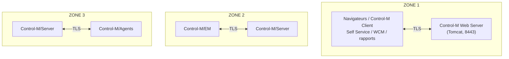

**Règles absolues** :

- Control-M ne supporte **que le format PEM** (X.509 encodé ASCII) ;
- protocole : **TLS 1.2** ;
- **tous les composants doivent être signés par la même autorité racine (root CA)**.

#### 2.6.2 Zones 2 et 3 — procédure complète

**Étape 1 — générer la CSR.** Éditer d'abord `csr_params.cfg` :

| OS | Emplacement |
|---|---|
| UNIX | `<Product Home>/data/SSL/config` |
| Windows | `<Product Home>\Data\SSL\config` |

```bash
# Control-M/EM
<EM Home>/bin/ctmkeytool -create_csr -password <MotDePasseCléPrivée>

# Control-M/Server
<Server Home>/scripts/ctmkeytool -create_csr -password <MotDePasseCléPrivée>

# Control-M/Agent
<Agent Home>/exe/ctmkeytool -create_csr -password <MotDePasseCléPrivée>
```

Fichiers produits :

```text
CSR       : <Product Home>/data/SSL/certificate_requests/<hostname>_YYYYMMDD_HHMMSS.csr
Clé privée: <Product Home>/data/SSL/private_keys/<hostname>_YYYYMMDD_HHMMSS.pem
```

**Étape 2 — construire le keystore PKCS#12** une fois le certificat signé reçu :

```bash
<OpenSSL du composant>/openssl pkcs12 \
  -in       <certificat.pem> \
  -inkey    <cle_privee.pem> \
  -export \
  -passout  pass:<MotDePasseKeystore> \
  -passin   pass:<MotDePasseClePrivee> \
  -CAfile   <chaine_de_certification.pem> \
  -chain \
  -out      <keystore.p12>
```

Emplacements des binaires OpenSSL :

| Composant | Chemin |
|---|---|
| Control-M/EM | `<Control-M_EM_Home>/bin/openssl` |
| Control-M/Server | `<Control-M/Server_Home>/exe_Linux-x86_64/openssl` |
| Control-M/Agent | `<Agent_Home>/exe/openssl` |

**Étape 3 — déployer le keystore** :

```bash
<composant>/ctmkeytool \
  -keystore <keystore.p12> \
  -password <MotDePasseKeystore> \
  -passwkey <fichier_cle_de_chiffrement>
```

Fichiers de clé de chiffrement par défaut :

| Composant | Chemin |
|---|---|
| Control-M/EM | `<EM_HOME>/etc/site/resource/ssl/cert/ess_key.txt` |
| Control-M/Server | `<CTM Home>/data/SSL/cert/ess_key.txt` |

**Étape 4 — activer SSL sur le Control-M/Server** :

```bash
ctmsys
# → System Parameters → page 2 (touche n)
# → Secure Sockets Layer : ENABLED
# → touche s pour sauvegarder
# puis redémarrer le Configuration Agent et le Control-M/Server
```

Valeurs possibles : `INACTIVE`, `DISABLED`, `ENABLED`.
**Par défaut, tous les Agents connectés héritent de la configuration SSL du Server.**

**Étape 5 — activer par Agent** : CCM → clic droit sur l'Agent → *Properties* → onglet
*Communication* → **Secure Socket Layer = Default** → *Test* → *OK* → redémarrer l'Agent.

**Étape 6 — protocoles et suites de chiffrement** :

```bash
<EM Home>/bin/openssl ciphers -V TLSv1.2      # lister les suites disponibles
```

Puis, dans le fichier de politique `.plc` (UNIX) ou le registre (Windows) :

```text
provider_options=SSLProtocol=TLS1_2,TLSCipherSuite=DHE-RSA-AES256-SHA AES256-SHA DHE-RSA-AES128-SHA
```

**Étape 7 — tester** :

```bash
<chemin>/ctmkeytool -status \
  -host <Server_Name> \
  -keystore_pass <MotDePasseKeystore> \
  -key_pass <MotDePasseClePrivee>

ag_diag_comm         # sur l'Agent
ctm_diag_comm        # sur le Server
```

Dans le CCM, le statut de la Gateway doit afficher **« Connected (SSL) »**.

**Étape 8 — CMS et Gateway** : positionner `CmsCommMode`, puis recycler le CMS de l'EM primaire,
les Gateways vers les Servers en SSL, le service *EM-CTM Request* et le service *EM-MFT Updates*.

| `CmsCommMode` | Comportement |
|---|---|
| `TCP` | TCP uniquement, aucun chiffrement |
| `AUTO` | Tente SSL, bascule en TCP si échec |
| `SSL` | **Chiffré exclusivement** — refuse le clair |

> **✅ Bonne pratique**
> Migrez en deux temps : passez d'abord en `AUTO` (aucune coupure possible), vérifiez que
> **toutes** les Gateways affichent « Connected (SSL) », **puis seulement** basculez en `SSL`.
> Passer directement en `SSL` avec un Agent mal configuré coupe la production.

**Désactivation** :

```bash
# Server
ctmsys   # → Secure Sockets Layer = DISABLED → redémarrage

# Agent : dans <Agent Home>/ctm/data/CONFIG.dat
COMMOPT=SSL=N
# → redémarrage de l'Agent

# EM : CmsCommMode = TCP, puis recycler CMS et Gateways
```

#### 2.6.3 Zone 1 — serveur web

| Élément | Chemin |
|---|---|
| Keystore | `<EM Home>/ini/ssl/tomcat.p12` |
| Configuration | `<EM Home>/ini/ssl/tomcat.ini` |
| Connecteur (UNIX) | `<EM Home>/etc/emweb/tomcat/conf/server.xml` |
| Connecteur (Windows) | `<EM Home>\emweb\tomcat\conf\server.xml` |
| Suites de chiffrement | `<EM Home>/ini/ssl_tomcat_ciphers.xml` |

```bash
# Construire le keystore Tomcat
<EM Home>/bin/openssl pkcs12 \
  -in <certificat.pem> -inkey <cle_privee.pem> -export \
  -passout pass:<pw> -passin pass:<key_pw> \
  -CAfile <chaine.pem> -chain \
  -out tomcat.p12 -name <nom_convivial>

# Enregistrer le mot de passe du keystore (chiffré)
emcryptocli <MotDePasseTomcatP12> <EM_Home>/ini/ssl/tomcat.ini

# Appliquer
manage_webserver

# Extraire le certificat public (pour distribution aux clients)
<Control-M/EM_Home>/bin/openssl pkcs12 \
  -in <EM home>/ini/ssl/tomcat.p12 -cacerts -nokeys \
  -password pass:<pw> > cacert.crt
```

**L'Automation API partage ce connecteur** : le certificat est déclaré dans
`<EM_HOME>\etc\emweb\tomcat\conf\server.xml` (remplacer
`keystoreFile="conf\emweb_unsigned.keystore"` par votre keystore).

> **✅ Bonne pratique**
> Le certificat livré par défaut est **auto-signé**. Il fonctionne, mais il oblige tous vos
> clients (`curl -k`, `ctm`, pipelines CI) à désactiver la vérification TLS — ce qui vous
> expose à une attaque de l'intercepteur. **Remplacez-le par un certificat signé par votre PKI
> interne dès la recette.**

#### 2.6.4 Gestion du cycle de vie des certificats

L'Automation API expose la gestion des certificats d'Agents :

```bash
ctm config server:agent:crt:expiration::get <server> <agent>   # date d'expiration
ctm config server:agent:csr::create         <server> <agent>   # générer une CSR
ctm config server:agent:crt::deploy         <server> <agent>   # déployer le certificat signé
```

> **✅ Bonne pratique**
> Automatisez la **surveillance des expirations** : un job Control-M hebdomadaire qui boucle
> sur `ctm config server:agent:crt:expiration::get` pour tous les Agents et alerte à J-30.
> Un certificat d'Agent expiré coupe la production **sans préavis**, généralement un dimanche.

---

### 2.7 Gestion des environnements DEV / TEST / PREPROD / PROD

#### 2.7.1 Les trois niveaux de séparation

Il existe trois degrés d'isolation, du plus léger au plus strict :

| Niveau | Mise en œuvre | Isolation | Coût |
|---|---|---|---|
| **1 — Logique** | Un seul Server, folders préfixés (`DEV_`, `PRD_`), RBAC par expression régulière | Faible : une erreur de manipulation touche la PROD | Nul |
| **2 — Par Control-M/Server** | Un Control-M/Server par environnement, un seul EM | Bonne : bases actives distinctes, Agents distincts | Modéré |
| **3 — Par instance complète** | Un EM + un Server par environnement | Totale | Élevé |

> **✅ Bonne pratique — le choix recommandé**
> Le **niveau 2** est le meilleur compromis pour la grande majorité des organisations :
> une seule console d'exploitation, une seule base de définitions à sauvegarder, mais des
> environnements actifs et des parcs d'Agents réellement séparés. Le niveau 3 se justifie
> quand la PROD doit être testable indépendamment lors des montées de version de Control-M
> lui-même.

#### 2.7.2 Modéliser les environnements côté Automation API

Le CLI `ctm` matérialise les environnements comme des profils nommés :

```bash
ctm environment add dev     https://ctm-dev.exemple.fr:8443/automation-api     <token-dev>
ctm environment add test    https://ctm-test.exemple.fr:8443/automation-api    <token-test>
ctm environment add preprod https://ctm-preprod.exemple.fr:8443/automation-api <token-preprod>
ctm environment add prod    https://ctm-prod.exemple.fr:8443/automation-api    <token-prod>

ctm environment show          # lister
ctm environment set dev       # basculer
```

Stockage : **`~/.ctm/env.json`** (dossier `.ctm` du répertoire personnel de l'utilisateur).

> **⚠️ Attention — sécurité**
> `env.json` contient **les jetons en clair**. Ne le versionnez **jamais**, ne le laissez pas
> sur un runner CI partagé, et positionnez `chmod 600 ~/.ctm/env.json`.
> En CI/CD, privilégiez `ctm environment add` en début de pipeline à partir d'un secret injecté,
> ou l'option `-t <token>` par commande.

#### 2.7.3 Le deploy descriptor : un seul code, N environnements

Le **deploy descriptor** est le mécanisme de transformation qui permet de déployer **le même
fichier JSON** dans plusieurs environnements en réécrivant les valeurs spécifiques
(nom de serveur, hôte d'exécution, compte, chemins).

```bash
ctm deploy transform jobs.json descriptor-prod.json   # visualiser SANS déployer
ctm deploy jobs.json descriptor-prod.json             # déployer transformé
```

Voir §11.4 pour la syntaxe complète.

#### 2.7.4 Site standards et promotion (Workload Change Manager)

**Control-M Workload Change Manager (WCM)** est l'outil BMC pour la gouvernance multi-environnements.
Il est accessible depuis le domaine **Planning** de Control-M Web.

| Rôle | Ce qu'il fait |
|---|---|
| **Web Users** | Construisent des flux métier et les soumettent comme *requêtes*, ou les *check-in* dans la base Control-M |
| **Control-M Schedulers** | Examinent les requêtes sur la page *Planning-Home*, échangent via des *Notes*, valident (*check-in*) |
| **Administrateurs** | Créent les **site standards** et les affectent aux folders pour imposer les conventions de l'organisation |

WCM permet également à un ordonnanceur de **transférer automatiquement folders et jobs entre
environnements** : c'est le mécanisme de **promotion** officiel BMC.

```bash
ctm deploy promotionrules:get [-s "rulename=<motif>"]
ctm deploy promotionrules:rule::get <nom_regle> [-s "failRule=true|false"]
```

#### 2.7.5 Convention de nommage

Sans convention, un environnement Control-M devient ingérable en dix-huit mois. Proposition de
grille :

```text
Folder        : <ENV>-<DOMAINE>-<APPLICATION>-<CHAINE>
                PRD-FIN-SAP-CLOTURE_MENSUELLE

Job           : <ENV>-<APPLICATION>-<VERBE>-<OBJET>[-<SEQ>]
                PRD-FIN-EXTRACT-GRAND_LIVRE-010

Événement     : <APPLICATION>-<JOB_SOURCE>-<STATUT>
                FIN-EXTRACT_GL-OK

Resource Pool : <ENV>-<RESSOURCE>
                PRD-ORACLE_FIN-SESSIONS

Resource Lock : <ENV>-<OBJET_EXCLUSIF>
                PRD-TABLE_COMPTA

Calendrier    : <PORTEE>-<TYPE>-<ANNEE>
                FR-OUVRES-2026
```

Règles :

| Règle | Raison |
|---|---|
| Préfixe d'environnement **toujours en premier** | Le RBAC par expression régulière sur les folders devient trivial (`^PRD-.*`) |
| Numérotation par pas de 10 | Permet d'insérer un job entre deux sans tout renommer |
| Verbe à l'infinitif dans le nom du job | `EXTRACT`, `LOAD`, `CHECK`, `PURGE`, `SEND` — auto-documentant |
| Le nom d'événement contient le job source | On sait immédiatement qui l'a produit, sans ouvrir l'IHM |
| Pas d'accent, pas d'espace, pas de caractère spécial | Portabilité Windows/UNIX, échappement JSON |

> **✅ Bonne pratique**
> Formalisez la convention dans un **Site Standard** Control-M : le `ctm build` refusera alors
> automatiquement toute définition non conforme, **avant** le déploiement. C'est infiniment plus
> efficace qu'un document Word que personne ne lit.

---

### 2.8 Bonnes pratiques de configuration

| Domaine | Recommandation | Pourquoi |
|---|---|---|
| **Comptes** | Un compte système dédié par composant, jamais `root` pour faire tourner un Agent | Réduction de la surface d'attaque ; `set_agent_mode` gère les cas nécessitant `sudo` |
| **DNS** | Résolution directe **et inverse** fonctionnelle pour tous les hôtes | Control-M compare fréquemment nom et IP ; une résolution inverse absente casse la découverte d'Agents |
| **Horloge** | NTP obligatoire sur tous les nœuds | Fenêtres horaires, ODATE, statistiques |
| **Bases** | Externaliser la base EM chez les DBA ; sauvegarde quotidienne testée | La base EM contient **tout** votre patrimoine de définitions |
| **`DAYTIME`** | Positionner la bascule de journée en **creux d'activité** | La New Day fait du ménage lourd ; en pleine charge, elle allonge tout |
| **Rétention** | `OUTPUTRETN` et `IOALOGLM` adaptés au besoin réel d'audit | Valeurs par défaut très basses (1 et 2 jours) : insuffisant pour un post-mortem |
| **Mode persistant** | À activer dès qu'un firewall sépare Server et Agent | Évite les erreurs de connexion aléatoires |
| **TLS** | Zones 1, 2 et 3, certificats de PKI interne, `AUTO` avant `SSL` | Sécurité et migration sans coupure |
| **HTTP 18080** | À **désactiver** en production une fois HTTPS opérationnel | Un port en clair est un port de trop |
| **Naming** | Site Standard appliqué dès le premier folder | Impossible à rattraper après coup |
| **Sauvegarde des définitions** | Export Git quotidien via `ctm deploy jobs::get` | Filet de sécurité indépendant de la sauvegarde SGBD |

**Sauvegarde des définitions vers Git — script de référence** :

```bash
#!/usr/bin/env bash
# Export quotidien des définitions Control-M vers Git.
# À ordonnancer... dans Control-M lui-même.
set -euo pipefail

REPO="/srv/git/controlm-backup"
ENVNAME="prod"
DATE="$(date +%Y-%m-%d)"

ctm environment set "${ENVNAME}"

cd "${REPO}"
mkdir -p folders calendars connectionprofiles

# Toutes les définitions de folders, serveur par serveur
ctm deploy folders::get -s "server=*&folder=*"        > "folders/all-folders.json"
ctm deploy jobs::get    -s "server=*&folder=*"        > "folders/all-jobs.json"
ctm deploy calendars::get -s "name=*"                 > "calendars/all-calendars.json"
ctm deploy connectionprofiles:centralized::get -s "name=*" \
                                                      > "connectionprofiles/centralized.json"

git add -A
git commit -m "Sauvegarde automatique Control-M ${ENVNAME} — ${DATE}" || echo "Aucun changement"
git push origin main
```

---

# Partie III — Administration

## 3. Administration de Control-M

### 3.1 Le modèle de sécurité en deux couches

Point capital, souvent mal compris : Control-M a **deux mécanismes de sécurité distincts**, qui
se superposent.

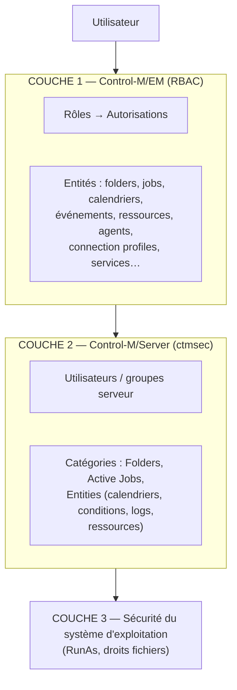

| Couche | Outil | Portée | Ce qu'elle contrôle |
|---|---|---|---|
| **1 — EM** | Control-M Web / CCM, `ctm config authorization:*` | Globale, tous Servers | Qui peut voir, créer, modifier, supprimer quoi dans l'IHM et l'API |
| **2 — Server** | `ctmsec`, `ctm_menu` | Un Control-M/Server | Couche applicative additionnelle sur les opérations serveur |
| **3 — OS** | Système | Machine d'exécution | Ce que l'utilisateur `RunAs` a réellement le droit de faire |

> **✅ Bonne pratique**
> Concentrez votre modèle sur la **couche 1 (RBAC EM)** : c'est là que se joue l'essentiel et
> c'est la seule couche pilotable par API donc automatisable. Utilisez `ctmsec` uniquement si
> vous avez un besoin de cloisonnement serveur que le RBAC EM ne couvre pas.

---

### 3.2 Utilisateurs, rôles et RBAC (couche EM)

#### 3.2.1 Le modèle

Control-M/EM applique un **RBAC** classique : on n'attribue **jamais** de droit à un utilisateur
directement, on lui attribue **des rôles**, et les rôles portent les permissions.

**Rôles prédéfinis** :

| Rôle (9.0.22 / SaaS) | Rôle (9.0.21) | Description officielle |
|---|---|---|
| **Admin** | *Administrator* | Accès complet à toutes les fonctionnalités |
| **TeamLeader** | *Team Leader* | Accès partiel avec possibilité de gérer les permissions de chaque membre |
| **Viewer** | *Viewer* | Accès en consultation uniquement |

> **⚠️ Version — l'orthographe change**
> En **9.0.21**, ces rôles s'écrivent *Administrator* et *Team Leader* (en deux mots).
> En **9.0.22 et en Control-M SaaS**, ils s'écrivent **`Admin`** et **`TeamLeader`**.
> Un script qui référence un rôle par son nom exact doit donc être adapté à votre version.

#### 3.2.2 Les niveaux d'autorisation

Quatre niveaux, **hiérarchiques** :

| Niveau | Signification |
|---|---|
| **None** | Accès refusé |
| **Browse** | Consultation seule |
| **Update** | Ajouter, consulter, modifier |
| **Full** | Contrôle complet, **y compris la suppression** |

> **Note**
> Sur les entités **Folders** et **Jobs**, une option **`Run`** s'ajoute, **indépendamment**
> de ces quatre niveaux : elle autorise l'exécution sans impliquer un droit de modification.
> C'est exactement ce qu'il faut pour un rôle d'exploitant N1.

#### 3.2.3 Les types d'entités protégeables

| Entité | Remarque |
|---|---|
| **Folders et Jobs** | **Les expressions régulières sont supportées** sur les noms de folders |
| Calendars | |
| Events et Global Events | |
| Resource Pools | |
| Lock Resources | |
| Connection Profiles | Locaux **et** centralisés |
| Run as Users / Definitions | |
| Plug-ins | |
| Agents | |
| Services | Services SLA |
| Workload Policies | |
| Site Standards | |
| User Views | |

> **Le point à retenir**
> Le support des **expressions régulières sur les noms de folders** est la clé d'un modèle RBAC
> propre. Avec une convention de nommage préfixée par l'environnement, tout devient simple :
>
> | Rôle | Regex folders | Niveau |
> |---|---|---|
> | `DEV_DEVELOPPEUR` | `^DEV-.*` | Full |
> | `DEV_DEVELOPPEUR` | `^(TEST\|PPR\|PRD)-.*` | Browse |
> | `EXPLOITANT_PROD` | `^PRD-.*` | Update |
> | `EXPLOITANT_PROD` | `^(DEV\|TEST)-.*` | Browse |
> | `ORDONNANCEUR` | `.*` | Full |

#### 3.2.4 Gestion par l'Automation API

```bash
# --- Rôles ---
ctm config authorization:role::add    -f role.json
ctm config authorization:role::get    <role>
ctm config authorization:role::update <role> -f role.json
ctm config authorization:role::delete <role>
ctm config authorization:roles::get
ctm config authorization:role:associates <role>     # qui porte ce rôle

# --- Utilisateurs ---
ctm config authorization:user::add    -f user.json
ctm config authorization:user::get    <user>
ctm config authorization:user::update <user> -f user.json
ctm config authorization:user::delete <user>
ctm config authorization:users::get

# --- Association utilisateur ↔ rôle ---
ctm config authorization:user:role::add    <user> <role>
ctm config authorization:user:role::delete <user> <role>

# --- Mot de passe (par un administrateur) ---
ctm config user:password::adminUpdate <user>
```

Endpoints REST correspondants :

| CLI | REST |
|---|---|
| `authorization:role::add` | `POST /config/authorization/role` |
| `authorization:roles::get` | `GET /config/authorization/roles` |
| `authorization:user::add` | `POST /config/authorization/user` |
| `authorization:user:role::add` | `POST /config/authorization/user/{user}/role/{role}` |

> **✅ Bonne pratique — le RBAC as Code**
> Les rôles et leurs autorisations sont du JSON manipulable par API : **versionnez-les dans Git**
> et déployez-les par pipeline, exactement comme vos jobs. Une revue de droits devient alors une
> *pull request*, avec un historique, un auteur et un approbateur.

---

### 3.3 Authentification

#### 3.3.1 Les modes disponibles

| Mode | Usage |
|---|---|
| **Interne Control-M/EM** | Comptes locaux, mot de passe géré par Control-M |
| **LDAP / Active Directory** | Les utilisateurs appartiennent à des groupes annuaire mappés sur des rôles |
| **IdP / SAML 2.0** | Une fois un fournisseur d'identité activé, **tous** les utilisateurs sont authentifiés en SAML 2.0 |

#### 3.3.2 Paramètres LDAP

| Paramètre | Défaut | Rôle |
|---|---|---|
| `DirectoryServiceAuth` | `Off` | Active l'authentification annuaire |
| `DirectoryServiceType` | `Active Directory` | Type d'annuaire |
| `DirectoryServerHostPort` | `<null>` | `<FQDN>:<port>` — **plusieurs valeurs possibles pour la bascule** |
| `DirectoryUsersSearchRoot` | `NULL` | Racine de recherche des utilisateurs |
| `DirectorySearchUserDN` | anonyme | DN du compte de service de recherche |
| `DirectoryServerConnAttempts` | `3` | Tentatives de connexion |
| `DirectoryServiceTimeout` | `10` s | Plage 1–60 |
| `DirectoryServerConnNetworkTimeout` | `20` s | Plage 5–120 |

**Mappage groupe LDAP → rôle Control-M** :

```bash
ctm config authorization:ldap:role::add    <groupeLDAP> <role>
ctm config authorization:ldap:role::delete <groupeLDAP> <role>
ctm config authorization:ldap:roles::get   <groupeLDAP>
```

> **⚠️ Attention**
> BMC documente LDAP/AD et SAML comme mécanismes d'**authentification de l'IHM**.
> Pour l'**Automation API**, la documentation officielle ne décrit **pas** de flux LDAP/AD/SAML :
> l'API s'authentifie par **login/mot de passe Control-M** (session token) ou par **jeton d'API**.
> Ne promettez pas un SSO SAML sur l'API sans l'avoir validé sur votre version.

#### 3.3.3 Politique de mots de passe

| Paramètre | Défaut | Recommandation production |
|---|---|---|
| `PasswordExpirationOnOff` | `0` (désactivé) | **`1`** |
| `PasswordLifetimeDays` | `60` (1–365) | 90 |
| `MinPasswordLength` | `6` | **12 minimum** |
| `MaxPasswordLength` | `32` | 32 |
| `NumberOfFailedLogins` | `5` (0–100) | 5 |
| `LockAccountForMinutes` | `0` (déverrouillage manuel) | 15 |
| `PasswordHistoryOnOff` | `0` (désactivé) | **`1`** |
| `PasswordComplexityOnOff` | `0` (désactivé) | **`1`** |
| `WarningPasswordExpirationDays` | `10` | 14 |
| `KeepAliveTimeout` | `600` s | 900 |
| `UserAuditOn` | `1` (activé) | **`1` — ne jamais désactiver** |

> **⚠️ Attention**
> Les valeurs par défaut de Control-M sont **permissives** : expiration désactivée, complexité
> désactivée, historique désactivé, longueur minimale de 6 caractères. Aucune n'est acceptable
> en production. Traitez le durcissement de la politique de mots de passe comme une **tâche de
> mise en service obligatoire**, pas comme une amélioration ultérieure.

---

### 3.4 Sécurité Control-M/Server : `ctmsec`

`ctmsec` est décrit par BMC comme *« une couche de sécurité applicative additionnelle »*
au-dessus de la sécurité du système d'exploitation. Elle fonctionne en mode interactif (menu)
ou en mode batch.

**Catégories protégées** :

| Catégorie | Portée |
|---|---|
| **Users** | Utilisateurs de sécurité serveur |
| **Groups** | Groupes de sécurité serveur |
| **Folders** | Droits `read` / `update` / `order` / `delete` sur les folders |
| **Active Jobs** | Droits par **propriétaire de job** et par **host group** |
| **Entities** | Calendriers, conditions, logs, ressources de file d'attente, contrôles |

**Valeurs d'autorisation** : `Y` (autorisé), `N` (refusé), `D` (valeur par défaut du groupe).

```bash
ctmsec -USER_UPDATE   <user> <description> <group>
ctmsec -SCHED_UPDATE  {<user>|<group>} <folder> [-DELETE {Y|N|D}]
ctmsec -ACT_UPDATE    {<user>|<group>} <owner> <host> [-HOLD {Y|N|D}]
ctmsec -ENTITY_UPDATE {<user>|<group>} {LOG|CALENDAR|CONDITION} [-ADD {Y|N|D}]
```

**Le paramètre `SECURE` (« Full Security »)** — défaut `N` :

| Valeur | Comportement |
|---|---|
| `N` | Un utilisateur **non défini** dans la base de sécurité a un accès **sans restriction** |
| `Y` | Un utilisateur non défini n'a **aucune permission** |

> **⚠️ Attention — ceci est une faille par défaut**
> Avec `SECURE=N` (valeur d'usine), **tout utilisateur inconnu de la base de sécurité serveur
> obtient un accès total**. Sur un Control-M/Server de production, positionnez `SECURE=Y`
> et déclarez explicitement vos utilisateurs et groupes. Prise en compte : automatique.

L'accès à ces fonctions est aussi disponible par `ctm_menu` → *Security Authorization*
(ajout/suppression d'utilisateurs et de groupes, sauvegarde et restauration des tables de
définitions de sécurité).

---

### 3.5 Gestion des Agents

#### 3.5.1 Cycle de vie

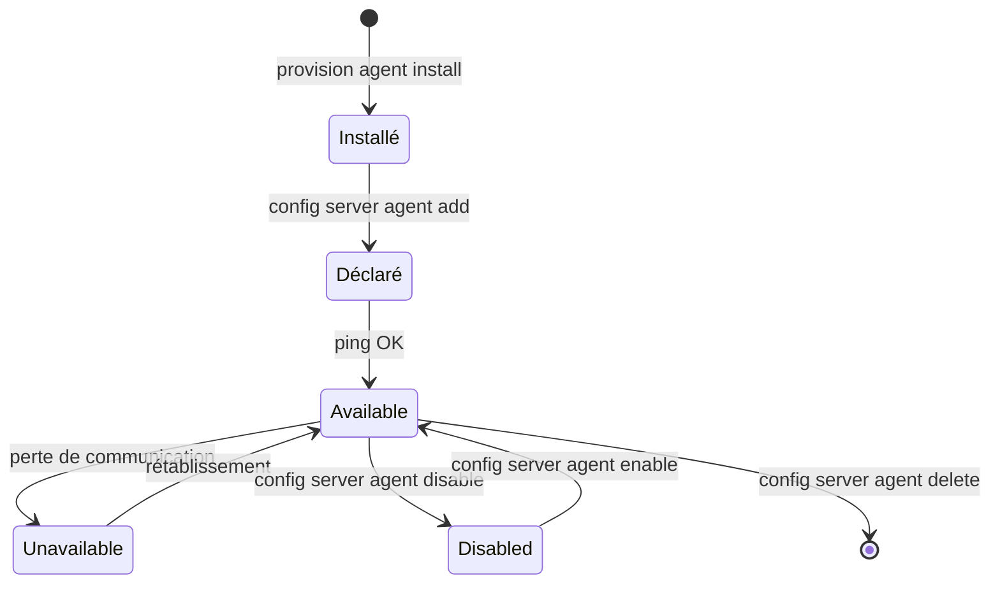

| État | Signification | Comportement du Server |
|---|---|---|
| **Available** | Le Server communique avec l'Agent | Soumet les jobs normalement |
| **Unavailable** | Le Server **n'arrive pas** à joindre l'Agent | Les jobs restent en `Wait Host` — **état constaté, pas choisi** |
| **Disabled** | Le Server **n'essaie plus** de communiquer | Les jobs ne sont pas soumis — **état volontaire** |

#### 3.5.2 Commandes de gestion

```bash
# Déclaration et suppression
ctm config server:agent::add    <server> <host> <port> [tag] [-f config.json]
ctm config server:agent::delete <server> <agent>

# Consultation
ctm config server:agents::get   <server> "agent=<motif>"

# Vérification
ctm config server:agent::ping     <server> <agent>
ctm config server:agent::test     <server> <agent>
ctm config server:agent::analysis <server> <agent>

# Mise hors/en service (maintenance)
ctm config server:agent::disable <server> <agent>
ctm config server:agent::enable  <server> <agent>

# Modification de paramètres
ctm config server:agent::update      <server> <agent> <nom> <valeur>
ctm config server:agent:params::get  <server> <agent>
ctm config server:agent:param::set   <server> <agent> <nom>
```

> **✅ Bonne pratique — la fenêtre de maintenance**
> Avant de patcher un serveur applicatif : `ctm config server:agent::disable`.
> Les jobs visant cet hôte restent alors **en attente propre** au lieu de partir en échec en
> masse. Après le patch : `enable`, puis `ping`, puis `free` sur les jobs concernés.
> Encadrez le tout dans un job Control-M déclenché manuellement — la maintenance devient
> reproductible et tracée.

#### 3.5.3 Host Groups (répartition de charge)

Un **host group** est un ensemble d'Agents entre lesquels Control-M répartit les soumissions.
On désigne le groupe dans le champ `Host` du job, et Control-M choisit l'Agent.

```bash
ctm config server:hostgroups::get      <server>
ctm config server:hostgroup::update    <server> <hostgroup>
ctm config server:hostgroup::delete    <server> <hostgroup>
ctm config server:hostgroup:agents::get <server> <hostgroup>
ctm config server:hostgroup:agent::add    <server> <hostgroup> <agent>
ctm config server:hostgroup:agent::delete <server> <hostgroup> <agent>
```

La propriété de job `RunOnAllAgentsInGroup` (booléen, défaut `false`) inverse la logique :
au lieu de choisir **un** Agent, le job s'exécute **sur tous** les Agents du groupe. Utile pour
des tâches de maintenance (purge de logs, collecte d'inventaire) sur un parc entier.

#### 3.5.4 Remote hosts (agentless)

```bash
ctm config server:remotehost::add       <server> <remotehost>
ctm config server:remotehost::authorize <server> <remotehost>
ctm config server:remotehost::get       <server> <remotehost>
ctm config server:remotehosts::get      <server>
ctm config server:remotehost::delete    <server> <remotehost>
```

---

### 3.6 Gestion des Control-M/Servers

```bash
ctm config server::add           -f server.json
ctm config servers::get
ctm config server::delete        <server>
ctm config server:params::get    <server>
ctm config server::failover      <server>      # bascule vers le secondaire (HA)
ctm config server::setasprimary  <server>      # retour au primaire
```

**Utilitaires locaux essentiels** (à exécuter sur la machine du Server) :

| Catégorie | Utilitaires |
|---|---|
| **Cycle de vie** | `start_ctm`, `shut_ctm`, `shctm`, `start_ca`, `shut_ca`, `show_ca`, `startdb`, `shutdb`, `ctm_pause` |
| **Configuration** | `ctm_menu`, `ctmsys`, `ctmsec`, `ctmsetown`, `ctmpasswd`, `ctmkeygen`, `ctmkeystore_mng`, `ctmhostmap`, `ctmhostgrp`, `ctmgetcm`, `ctmldnrs`, `restore_host_config`, `ctmchangeshdir` |
| **Exploitation / diagnostic** | `ctmipc`, `ctmjsa`, `ctmloadset`, `ctm_agstat`, `ctm_diag_comm`, `ctmping`, `ctmruninf`, `ctmshout`, `ctmshtb`, `ctmspdiag`, `ctmsca`, `ctmstats`, `ctmsuspend`, `init_prflag`, `ctmagcln`, `ctmdiskspace`, `ctmlog`, `ctmwhy` |
| **Base de données** | `ctm_backup_bcp`, `ctm_restore_bcp`, `ctmdbbck`, `ctmdbcheck`, `ctmdbopt`, `ctmdbrst`, `ctmdbspace`, `ctmdbtrans`, `ctmdbused`, `dbversion`, `dbu_menu` |
| **Gestion de jobs** | `ctmcreate`, `ctmorder`, `ctmpsm`, `ctmkilljob`, `ctmudly`, `ctmudchk` |

Quelques descriptions officielles utiles :

| Utilitaire | Description BMC |
|---|---|
| `ctmsys` | « Gère les listes de destinations de notification et les paramètres système Control-M » |
| `ctmlog` | « Crée un rapport des entrées du journal Control-M, ou supprime des entrées » |
| `ctmsec` | « Gère les utilisateurs, groupes et autorisations dans la base de sécurité Control-M » |
| `ctmdiskspace` | « Vérifie l'espace disque libre sur un périphérique et affiche le résultat » |
| `ctmchangeshdir` | « Modifie le chemin du répertoire partagé utilisé pour la réplication PostgreSQL en HA » |
| `ctmagcln` | « Demande à un Agent (ou à tous) de supprimer tous les fichiers de sortie et de statut » |
| `ctmwhy` | « Génère un rapport expliquant pourquoi un SMART folder, sous-folder ou job de la base des jobs actifs est bloqué » |
| `init_prflag` | « Réinitialise les temps de pause et niveaux de trace des processus Control-M/Server » |

**Options de `ctm_menu`** : Control-M Manager, Database Menu, Security Authorization,
Parameter Customization, Host Group, View HostID Details, Agent Status, Troubleshooting.

> **⚠️ Attention**
> `ctmstart`, `ctmstop`, `ctmcleanup`, `ctmfailover`, `root_menu`, `em_start` **n'existent pas**
> dans les documentations 9.0.21/9.0.22. Vous les trouverez dans de vieux articles de blog :
> ne les tapez pas en production en espérant qu'ils fonctionnent.
> La bascule HA se fait **depuis le CCM**, pas par un utilitaire en ligne de commande.

---

### 3.7 Run as Users et Connection Profiles

#### 3.7.1 Run as Users

L'utilisateur `RunAs` est le compte système sous lequel l'Agent exécute le traitement.
Ses identifiants sont stockés côté Control-M.

```bash
ctm config server:runasuser::add    <server> ...
ctm config server:runasuser::get    <server> <agent> <user>
ctm config server:runasuser::update <server> <agent> <user>
ctm config server:runasuser::delete <server> <agent> <user>
ctm config server:runasuser::test   <server> <agent> <user>     # valide les identifiants
ctm config server:runasusers::get   <server>
```

> **✅ Bonne pratique**
> Un compte technique **par application**, jamais un compte nominatif ni un compte partagé
> global. `ctm config server:runasuser::test` doit faire partie de votre checklist de mise en
> production : un mot de passe expiré côté OS met **toute** une chaîne en échec, avec un message
> d'erreur souvent peu explicite.

> **⚠️ Attention**
> Pour qu'un Agent puisse **changer d'utilisateur** (`RunAs` différent du compte de l'Agent),
> l'Agent doit tourner en root — ou en mode `sudo` configuré via `set_agent_mode`.
> Un Agent lancé en compte non privilégié ne peut exécuter que sous son propre compte.

#### 3.7.2 Connection Profiles

Un **connection profile** encapsule les paramètres de connexion vers un système externe
(base de données, serveur SFTP, compte cloud, SAP…). Le job ne référence qu'un **nom** :
les identifiants ne se trouvent jamais dans la définition du job.

Deux portées :

| Type | Portée | Stockage | Usage |
|---|---|---|---|
| **Centralisé** | Tous les Agents du Server | Base Control-M | Recommandé — un seul point de vérité |
| **Local** | Un Agent précis | Sur l'Agent | Cas particuliers, isolation forte |

```bash
# Déploiement (le même que pour les jobs)
ctm deploy connection-profiles.json

# Centralisés
ctm deploy connectionprofiles:centralized::get       -s "type=<type>&name=<nom>"
ctm deploy connectionprofiles:centralized:status::get <limite> -s "type=<type>&name=<nom>"
ctm deploy connectionprofile:centralized::deploymentstatus <type> <nom>
ctm deploy connectionprofile:centralized::test  <type> <nom> <server> <agent>
ctm deploy connectionprofile:centralized::delete <type> <nom>

# Locaux
ctm deploy connectionprofiles:local::get      -s "server=<srv>&agent=<ag>&type=<type>"
ctm deploy connectionprofile:local::delete    <server> <agent> <type> <nom>

# Test générique à partir d'un fichier de définition
ctm deploy connectionprofile::test <definitionsFile> [ctm] [agent]
```

> **✅ Bonne pratique**
> Les connection profiles sont du **code déployable comme les jobs** — mais ils contiennent des
> secrets. Versionnez leur **structure** dans Git avec les mots de passe remplacés par des
> références `Secret:<clé>` (voir §3.11 et §15.4), jamais les valeurs en clair.

---

### 3.8 Ressources

#### 3.8.1 Resource Pool (ex-Quantitative Resource)

Un **pool** est un compteur global : il représente une capacité finie partagée.

```bash
ctm run resource::add    <server> <nom> <max>     # créer
ctm run resource::update <server> <nom> <max>     # modifier la capacité
ctm run resource::delete <server> <nom>           # supprimer
ctm run resources::get   -s "<critère>"           # consulter
```

Exemple : autoriser au maximum 20 connexions concurrentes à la base financière.

```bash
ctm run resource::add ctmsrv-prod PRD-ORACLE_FIN-SESSIONS 20
```

Un job qui en consomme 5 :

```json
{
  "PRD-FIN-EXTRACT-GL": {
    "Type": "Job:Command",
    "Command": "/opt/fin/bin/extract_gl.sh %%ODATE",
    "Host": "srv-fin-01",
    "RunAs": "svc_fin",
    "PoolSessionsFIN": {
      "Type": "Resource:Pool",
      "Quantity": "5"
    }
  }
}
```

Tant que moins de 5 unités sont disponibles, le job reste en `Wait Resource`.

#### 3.8.2 Resource Lock (ex-Control Resource)

Un **verrou** implémente l'exclusion mutuelle avec deux modes :

| `LockType` | Sémantique |
|---|---|
| `Exclusive` | Un seul job à la fois — **bloque tout le monde** |
| `Shared` | Plusieurs jobs `Shared` simultanés, mais aucun `Exclusive` en parallèle |

```json
{
  "PRD-FIN-REORG-TABLE": {
    "Type": "Job:Command",
    "Command": "/opt/fin/bin/reorg.sh",
    "Host": "srv-fin-01",
    "RunAs": "svc_fin",
    "VerrouTableCompta": {
      "Type": "Resource:Lock",
      "LockType": "Exclusive"
    }
  }
}
```

> **✅ Le motif classique lecteur/écrivain**
> Tous les jobs de **lecture** posent un verrou `Shared` sur `PRD-TABLE_COMPTA` ;
> le job de **réorganisation** pose un verrou `Exclusive` sur le même nom.
> Résultat : les lectures se parallélisent librement, mais la réorganisation attend que la
> dernière lecture se termine, et aucune lecture ne démarre pendant la réorganisation.
> **Zéro ligne de code de synchronisation à écrire.**

#### 3.8.3 Dimensionner les pools

| Ressource protégée | Métrique de dimensionnement |
|---|---|
| Sessions base de données | `sessions` moins la marge réservée aux applications interactives |
| Bande passante réseau | Nombre de transferts simultanés supportables sans saturer le lien |
| CPU d'un serveur applicatif | Nombre de cœurs, moins ceux réservés à l'OS |
| Licence applicative concurrente | Nombre exact de licences achetées |
| Verrous applicatifs métier | 1 (utiliser plutôt un `Resource:Lock`) |

---

### 3.9 Variables

#### 3.9.1 Les portées

| Portée | Référence | Déclaration JSON | Visible par |
|---|---|---|---|
| **Locale** (job) | `%%NOM` | `{"NOM": "valeur"}` | Le job seul |
| **SMART folder** | `%%NOM` | `{"\\\\NOM": "valeur"}` | Tous les jobs du folder |
| **Pool nommé** | `%%\POOL\NOM` | `{"\\\\pool1\\date": "%%$DATE"}` | Tous les jobs référençant ce pool |
| **Globale** | `%%\NOM` | Définie hors de la définition de job | Tout l'environnement |

```json
"Variables": [
  {"TodayDate":  "%%$DATE"},
  {"ScriptsPath": "/opt/traitements/bin"},
  {"\\\\CompanyName": "MonEntreprise"}
]
```

> **⚠️ Attention — l'échappement**
> Les préfixes de portée utilisent des antislashs, qui doivent être **échappés en JSON**.
> `\\\\NOM` en JSON représente `\\NOM` littéral, qui désigne la portée SMART folder.
> C'est une source d'erreur constante. Sous Windows, la syntaxe `<Préfixe>%#%<Nom_Variable>`
> permet d'échapper le préfixe de portée lui-même.

#### 3.9.2 Variables système (AutoEdit)

Le préfixe `%%$` désigne généralement la variante **année sur 4 chiffres**.

**Identification du job** :

| Variable | Contenu |
|---|---|
| `%%JOBNAME` | Nom du job |
| `%%ORDERID` | Identifiant d'ordre de l'instance |
| `%%APPLIC` | Application |
| `%%APPLGROUP` | Sous-application |
| `%%OWNER` | Propriétaire / RunAs |
| `%%SCHEDTAB` | **Nom du folder parent** |
| `%%MEMLIB` | Bibliothèque du membre |
| `%%RUNCOUNT` | Numéro d'exécution |
| `%%CYCLIC` | `Y` / `N` |
| `%%$FOLDER_ID`, `%%SMART_ORDERID`, `%%$SMART_ORDERID`, `%%GROUP_ORDID`, `%%$GROUP_ORDID`, `%%$TABLE_ID` | Identifiants de folder / SMART folder |

**Dates d'ordonnancement** :

| Variable | Format |
|---|---|
| `%%ODATE` | Date de traitement `AAMMJJ` |
| `%%$ODATE` | Date de traitement `AAAAMMJJ` |
| `%%NEXT` / `%%$NEXT` | Date de traitement suivante |
| `%%PREV` / `%%$PREV` | Date de traitement précédente |
| `%%ODAY`, `%%OMONTH`, `%%OYEAR`, `%%$OYEAR` | Jour / mois / année de l'ODATE |
| `%%OJULDAY` | Jour julien de l'ODATE |
| `%%OWDAY` | Jour de la semaine de l'ODATE |

**Date et heure système** :

| Variable | Format |
|---|---|
| `%%DATE` / `%%$DATE` | Date système |
| `%%$RDATE` | Date système (variante) |
| `%%TIME` | Heure `HHMMSS` |
| `%%DAY`, `%%MONTH`, `%%YEAR`, `%%CENT` | Composants de date |
| `%%RDAY`, `%%RMONTH`, `%%RYEAR`, `%%$RYEAR` | Variantes « réelles » |
| `%%MONNAM` / `%%RMONNAM` | Nom du mois |
| `%%JULDAY` / `%%RJULDAY` | Jour julien |
| `%%WDAY` / `%%RWDAY` | Jour de la semaine |
| `%%DATACENTER` | Nom du datacenter (Control-M/Server) |

**Post-traitement (utilisables dans les actions)** :

| Variable | Contenu |
|---|---|
| `%%COMPSTAT` | Code de complétion |
| `%%JOBID` | Identifiant système du job |
| `%%NODEID` | Hôte d'exécution |
| `%%AVG_TIME` / `%%SD_TIME` | Durée moyenne / écart-type |
| `%%AVG_CPU` / `%%SD_CPU` | CPU moyen / écart-type |

> **⚠️ Attention**
> `%%PARENT_FOLDER` **n'existe pas** dans la documentation BMC. Le nom du folder parent est
> donné par **`%%SCHEDTAB`**.

#### 3.9.3 Positionner une variable à l'exécution

```json
"CapterLeNombreDeLignes": {
  "Type": "If",
  "CompletionStatus": "OK",
  "Capture": {
    "Type": "Action:CaptureOutput",
    "Search": "Lignes traitées :",
    "Capture": "UpToEndOfLine",
    "VariableName": "NB_LIGNES",
    "ForwardBy": {
      "Columns": "1",
      "Delimiter": "WhiteSpace",
      "ColumnsOption": "words"
    }
  }
}
```

Ou directement :

```json
"PositionnerStatut": {
  "Type": "If",
  "CompletionStatus": "NOTOK",
  "Set": {
    "Type": "Action:Set",
    "Variable": "%%\\STATUT_CHAINE",
    "Value": "ECHEC"
  }
}
```

---

### 3.10 Calendriers (administration)

Trois types d'objets calendrier, avec leurs noms de types **actuels** :

| Type JSON | Nature |
|---|---|
| `Calendar:Regular` | Calendrier standard : liste explicite de jours, année par année |
| `Calendar:Periodic` | Calendrier périodique : périodes nommées `A`–`Z` (sauf `N` et `Y`) |
| `Calendar:RuleBasedCalendar` | Calendrier à base de règles : porte toute la grammaire `When` |

```bash
ctm deploy calendars::get [limite] -s "type=Periodic&name=S*"
ctm deploy calendar::delete <nomCalendrier> [serveur] [type]
```

> **⚠️ Attention — format**
> Les définitions de calendriers doivent être en **JSON uniquement**. `ctm build` accepte
> `.zip` et `.tar.gz` pour les jobs, mais **pas** pour les calendriers.

Le détail des calendriers (syntaxe, modificateurs, exemples de planification) est traité au
chapitre 8.

---

### 3.11 Gestion des secrets

L'Automation API dispose d'un coffre intégré. Les secrets y sont référencés par la syntaxe
`Secret:<clé>` dans les définitions JSON — jamais en clair.

```bash
ctm config secret::add    <nom> <valeur>
ctm config secret::update <nom> <valeur>
ctm config secret::delete <nom>
ctm config secrets::get                     # liste les NOMS, pas les valeurs
```

Endpoints REST et charges utiles :

| CLI | REST | Corps |
|---|---|---|
| `secret::add` | `POST /config/secret` | `{"name":"$name","value":"$value"}` |
| `secret::update` | `POST /config/secret/$name` | `{"value":"$value"}` |
| `secret::delete` | `DELETE /config/secret/$name` | — |
| `secrets::get` | `GET /config/secrets` | — |

Utilisation dans un connection profile :

```json
{
  "sftp-partenaire-A": {
    "Type": "ConnectionProfile:FileTransfer:SFTP",
    "Centralized": true,
    "HostName": "sftp.partenaire-a.com",
    "Port": "22",
    "User": "svc_echanges",
    "Password": "Secret:sftp_partenaire_a_pwd"
  }
}
```

Le changement de mot de passe Control-M lui-même accepte aussi cette syntaxe :

```json
{"user": "user1", "currentPassword": "********", "newPassword": "Secret:secretKey"}
```

> **✅ Bonne pratique — rotation**
> La rotation devient un appel d'API : votre coffre d'entreprise (Vault, CyberArk, Azure
> Key Vault) génère le nouveau secret, un job appelle `ctm config secret::update`, puis
> `ctm deploy connectionprofile:centralized::test` valide immédiatement que la nouvelle valeur
> fonctionne. **Aucune intervention humaine, aucun mot de passe dans un ticket.**

---

### 3.12 New Day Procedure et rétention

#### 3.12.1 Ce que fait la New Day

Quatre tâches, exécutées à **07:00 par défaut** (paramètre **`DAYTIME`**, valeur `+0700`,
format `+hhmm` après minuit ou `-hhmm` avant minuit ; prise en compte automatique) :

1. **Nettoyer** les logs, statistiques, informations de jobs du Control-M/Server et les sorties
   d'Agents ;
2. **Supprimer** les jobs obsolètes ;
3. **Charger** (ordonnancer) les nouveaux jobs de la journée à venir ;
4. **Télécharger** l'environnement vers la base Control-M/EM.

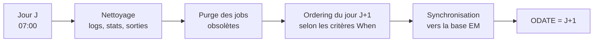

#### 3.12.2 User Daily

Le **User Daily** permet à des jobs de suivre leur **propre calendrier d'ordering**, plutôt que
d'attendre la New Day globale. Deux bénéfices : lissage de la charge (tout n'est pas ordonnancé
en une fois) et souplesse (une chaîne peut être ordonnancée à 14 h).

```bash
ctmudly  <nomUserDaily>     # ordonnance les jobs/folders associés à ce User Daily
ctmudchk                    # valide les définitions de User Daily
```

Via l'API :

```bash
ctm run userDaily:missing::list <userDaily> <server>   # User Dailies non exécutés
ctm run userDaily:missing::run  <userDaily>            # rattrapage
ctm run userDaily:missing::poll <pollId>               # suivi de l'opération
```

Dans le JSON, `OrderMethod` porte le nom du User Daily :

```json
{
  "PRD-FIN-CLOTURE": {
    "Type": "Folder",
    "OrderMethod": "UD_FINANCE_APRESMIDI"
  }
}
```

#### 3.12.3 Paramètres de rétention

**Côté Agent (nettoyage pendant la New Day)** :

| Paramètre | Défaut |
|---|---|
| `LOGKEEPDAYS` | 1 jour |
| `MEASURE_USAGE_DAYS` | 7 jours |
| `RH_KEEPDAYS` | 7 jours |
| `GENERAL_CLEANUP_INTERVAL` | 30 jours |
| `SYSKEEPDAYS` | valeur du site |

**Côté Server** :

| Libellé IHM | Paramètre | Défaut |
|---|---|---|
| Max Days to Retain Output Files | `OUTPUTRETN` | **1 jour** |
| Maximum Days Retained by Control-M Log | `IOALOGLM` | **2 jours** |
| Rétention des jobs cycliques | `CYCLIC_MAXWAIT` | `KEEP` / `NOT_KEEP` |

**Au niveau du job** : `DaysKeepActive` (`0`–`98` ou `"Forever"`, défaut `0`) — c'est le
« Keep Active for » de l'interface, l'héritier du MAXWAIT historique.
**Au niveau du folder** : `DaysKeepActiveIfNotOk` (`0`–`99`, `99` = indéfiniment, défaut `0`),
utile uniquement quand `ActiveRetentionPolicy` vaut `KeepAll`.

**Nettoyage des événements** : par défaut, les événements vieux d'un an (`ODAT+1`) sont
supprimés automatiquement. Le paramètre **« Ignore New Day Conditions »** (défaut `N`) passé à
`Y` préserve indéfiniment les événements anciens.

> **⚠️ Attention**
> `OUTPUTRETN` à **1 jour** signifie que la sortie d'un job en échec le vendredi soir **n'existe
> plus** le lundi matin. Pour toute production sérieuse, remontez cette valeur (7 à 30 jours
> selon votre volumétrie) ou activez **Control-M Workload Archiving**. C'est l'un des réglages
> les plus regrettés après un incident.

> **✅ Bonne pratique — positionner `DAYTIME`**
> Placez la bascule de journée **en creux d'activité**, jamais pendant un pic. La New Day fait
> un ménage lourd en base et un ordering massif ; si elle tombe pendant votre fenêtre batch
> critique, vous allongez toute la chaîne. Et documentez cette heure : c'est elle qui définit
> ce que signifie « le traitement du 15 » dans votre entreprise.

---

### 3.13 Workload Policies

Les **workload policies** permettent de plafonner dynamiquement la charge selon des critères
(nombre de jobs simultanés par application, par hôte, par plage horaire).

```bash
ctm run workloadpolicies::add       <fichier.json>
ctm run workloadpolicies::get       [Active|Inactive]
ctm run workloadpolicies:detailed::get -s "name=<nom>"
ctm run workloadpolicy::activate    <nom> [<server>]
ctm run workloadpolicy::deactivate  <nom> [<server>]
ctm run workloadpolicy::delete      <nom>
```

> **✅ Cas d'usage**
> Une politique « fin de mois » activée automatiquement le dernier jour ouvré, qui bride les
> traitements non critiques pour laisser toute la capacité à la clôture comptable.
> Activation et désactivation sont pilotables par un job Control-M lui-même.

---

### 3.14 Suivi de consommation

```bash
ctm usage jobs::get        # GET /usage/jobs
```

Compte les jobs éligibles (« loaded tasks ») de la journée active en cours, depuis la New Day,
par serveur et au total. Utile pour le suivi de licence et la détection d'une dérive de volume.

---

# Partie IV — Concepts d'ordonnancement

## 4. Les objets d'ordonnancement

### 4.1 Le job

#### 4.1.1 Anatomie

Un job Control-M est un objet à cinq facettes :

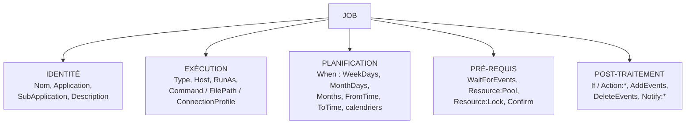

#### 4.1.2 Les propriétés universelles

Ces propriétés sont valables pour **tous** les types de jobs.

| Propriété | Valeurs | Rôle |
|---|---|---|
| `Type` | `Job:Command`, `Job:Script`, … | Type de traitement |
| `Application` / `SubApplication` | Texte libre | Regroupement fonctionnel — sert aux filtres et aux viewpoints |
| `Description` | Texte libre | Documentation |
| `Documentation` | `{"Path":"…","FileName":"…"}` ou `{"Url":"…"}` | Lien vers la doc d'exploitation |
| `Comment` | Texte libre | **Non remonté dans Control-M** — commentaire réservé au code |
| `Host` | Nom d'Agent ou de host group | Où exécuter. **Vide ⇒ sur le Control-M/Server lui-même** |
| `RunAs` | Compte système | Sous quelle identité exécuter |
| `CreatedBy` | Utilisateur Control-M/EM | Auteur — soumis au paramètre `AuthorSecurity` |
| `Confirm` | `true` / `false` | Le job attend une **confirmation manuelle** avant de démarrer |
| `Critical` | `true` / `false` (défaut `false`) | Le job **réserve** ses ressources au lieu de les attendre |
| `Priority` | `Very High`, `High`, `Medium`, `Low`, `Very Low`, ou code alphanumérique `AA` (plus bas) … `99` (plus haut). Défaut `AA` | Ordre de soumission en cas de contention |
| `DaysKeepActive` | `0`–`98` ou `"Forever"` (défaut `0`) | Combien de jours l'instance reste dans l'environnement actif |
| `EndFolder` | `true` / `false` | La fin de ce job termine le folder |
| `TimeZone` | Code 3 lettres : `PST`, `EST`, `GMT`, `CET`, `HKG`, `MST`… | Fuseau de référence. **À définir au moins 48 h avant l'exécution** |
| `RunAsDummy` | `true` / `false` | Exécute n'importe quel type de job **à vide** — précieux en test |
| `RunOnAllAgentsInGroup` | `true` / `false` | S'exécute sur **tous** les Agents du host group |
| `RetroactiveJob` | `true` / `false` | Ordonnancement rétroactif |
| `OverridePath` | Chemin | Répertoire alternatif du script (le nom de fichier doit correspondre) |
| `PathElement` | `{"Folder":"…","Server":"…","Library":"…"}` | Référence de chemin (`Library` = z/OS uniquement) |
| `ReferencePath` | Chemin | Référence de sous-folder modèle. **Requiert EM 9.0.21+** |
| `Variables` | Tableau d'objets | Variables du job |

**Correspondance des priorités** :

| Libellé | Code | Rang |
|---|---|---|
| Very High | `99` | Le plus haut |
| High | `0A` | |
| Medium | `SA` | |
| Low | `JA` | |
| Very Low | `AA` | Le plus bas (défaut) |

> **⚠️ Attention — `Critical`**
> `Critical: true` change fondamentalement le comportement face aux ressources : au lieu
> d'attendre que **toutes** ses ressources soient libres avant d'en prendre une, le job
> **réserve** au fur et à mesure. Cela garantit qu'un job critique ne sera pas indéfiniment
> doublé par des jobs plus petits — mais **augmente le risque d'interblocage**. À réserver
> aux vrais jobs critiques, et à tester.

> **✅ Bonne pratique — `RunAsDummy`**
> `RunAsDummy: true` permet de **valider toute la topologie d'un workflow** (dépendances,
> calendriers, ressources, SLA) **sans exécuter une seule ligne de traitement réel**.
> C'est le meilleur outil de recette d'une chaîne complexe. On le retire ensuite via un
> deploy descriptor lors de la promotion en production.

---

### 4.2 Folders, SMART Folders, SubFolders

#### 4.2.1 Les trois types

| Type JSON | Nature | Propriétés au niveau folder ? |
|---|---|---|
| `Folder` | **SMART Folder** | **Oui** — planification, événements, ressources, notifications, actions héritées par les jobs |
| `SimpleFolder` | Folder simple | **Non** — pur conteneur |
| `SubFolder` | Sous-folder | Partiellement (voir plus bas) |

> **Le point clé souvent mal compris**
> Dans le modèle JSON de l'Automation API, **`Folder` EST le SMART Folder**.
> Il n'existe pas de type `SmartFolder`. La citation officielle BMC : *« Un Simple Folder ne
> permet pas la configuration de définitions de job au niveau du folder. »*

#### 4.2.2 Propriétés du `Folder` (SMART)

| Clé | Valeurs / rôle |
|---|---|
| `ControlmServer` | Le Control-M/Server auquel appartient le folder. **Obligatoire si plusieurs Servers sont configurés** |
| `OrderMethod` | `Automatic` (défaut, ordonnancé selon `When`) ; `Manual` (`When` **ignoré**, ordering via `ctm run order` ou `Action:Run`) ; **toute autre valeur** = nom d'un User Daily |
| `RunAs` | Compte d'exécution hérité |
| `When` | Critères de planification appliqués à **tous** les jobs du folder |
| `SiteStandard` | Impose un site standard au folder et à tous ses jobs. **Non supporté comme `Defaults` global** |
| `BusinessFields` | Valeurs des champs métier du site standard : `[{"Champ1":"valeur"}, {"Champ2":"valeur"}]` |
| `ActiveRetentionPolicy` | `KeepAll` (défaut — tous les jobs attendent la fin du folder et sont supprimés ensemble) ; `CleanEndedOK` (les jobs terminés OK sont retirés au fil de l'eau) |
| `DaysKeepActiveIfNotOk` | `0`–`99` (`99` = indéfiniment), défaut `0`. Pertinent uniquement avec `KeepAll` |
| `AdjustEvents` | Permet à un job de démarrer sans attendre l'événement d'un prédécesseur **qui n'a pas été ordonnancé** |
| `Events` | `WaitForEvents` / `AddEvents` / `DeleteEvents` au niveau folder |
| `If` | Logique conditionnelle et actions au niveau folder |
| `Flow` | Objet `Type: "Flow"` décrivant la séquence |
| `Variables` | Variables de portée folder |

Sont également supportées au niveau folder, avec la même sémantique qu'au niveau job :
`Application`, `SubApplication`, `Confirm`, `CreatedBy`, `DaysKeepActive`, `Description`,
`Documentation`, `EndFolder`, `Priority`, `Rerun`, `RerunLimit`, `TimeZone`, `Comment`.

> **✅ `AdjustEvents` — le paramètre qui sauve les week-ends**
> Scénario classique : `JOB-A` tourne du lundi au vendredi, `JOB-B` tous les jours et attend
> l'événement de `JOB-A`. Le samedi, `JOB-A` **n'est pas ordonnancé** — donc son événement
> n'arrivera jamais, et `JOB-B` reste bloqué éternellement.
> `AdjustEvents` sur le folder résout exactement ce cas : Control-M constate que le prédécesseur
> n'est pas dans l'environnement du jour et **neutralise l'attente**.
> C'est la cause n°1 des « jobs bloqués le week-end ». Voir §16.9.

#### 4.2.3 SubFolder

```json
{
  "PRD-FIN-CLOTURE": {
    "Type": "Folder",
    "ControlmServer": "ctmsrv-prod",
    "SF-EXTRACTIONS": {
      "Type": "SubFolder",
      "job1": {
        "Type": "Job:Script",
        "FileName": "extract_gl.sh",
        "FilePath": "/opt/fin/bin",
        "RunAs": "svc_fin"
      }
    }
  }
}
```

Propriétés supportées sur un `SubFolder` : `Application`, `SubApplication`,
`When` (**uniquement** `FromTime`/`ToTime` et calendriers à base de règles), `Events`, `If`,
`AdjustEvents`, `Confirm`, `DaysKeepActive`, `Description`, `Documentation`, `Resource:Lock`,
notifications, `PathElement`, `Priority`, `RunAs`, `TimeZone`, `Variables`, `ReferencePath`.

#### 4.2.4 Quand utiliser quoi

| Situation | Choix |
|---|---|
| Chaîne applicative avec planification commune | `Folder` (SMART) |
| Simple regroupement, chaque job a sa propre planification | `SimpleFolder` |
| Chaîne longue à découper en phases logiques | `Folder` + `SubFolder` |
| Modèle réutilisable de sous-chaîne | `SubFolder` + `ReferencePath` (EM 9.0.21+) |

---

### 4.3 Workflows et objet `Flow`

L'objet `Flow` est le **raccourci syntaxique** pour exprimer une séquence linéaire.
Règle : *« Un job doit se terminer avec succès pour que le job suivant du flux démarre. »*

```json
{
  "MonFolder": {
    "Type": "Folder",
    "job1": { "Type": "Job:Command", "Command": "echo 1" },
    "job2": { "Type": "Job:Command", "Command": "echo 2" },
    "job3": { "Type": "Job:Command", "Command": "echo 3" },
    "Flow": {
      "Type": "Flow",
      "Sequence": ["job1", "job2", "job3"]
    }
  }
}
```

**Un job peut appartenir à plusieurs flux** — c'est ainsi qu'on exprime un OU logique :

```json
"FluxA": { "Type": "Flow", "Sequence": ["job1", "job3"] },
"FluxB": { "Type": "Flow", "Sequence": ["job2", "job3"] }
```

`job3` démarre si `job1` **ou** `job2` se termine OK.

**Flux inter-folders** — les chemins utilisent le deux-points comme séparateur :

```json
"FluxTransverse": {
  "Type": "Flow",
  "Sequence": ["FolderA:Job1", "FolderB:Job1", "FolderB:SousFolderB1:Job2"]
}
```

> **Comment ça marche réellement**
> `Flow` n'est pas un mécanisme distinct : à la compilation, Control-M **génère un `AddEvents`
> sur le prédécesseur et un `WaitForEvents` correspondant sur le successeur**.
> C'est du sucre syntaxique au-dessus des événements. Comprendre cela évite bien des confusions
> lorsqu'on mélange `Flow` et événements explicites dans le même folder.

---

### 4.4 Dépendances : les événements

#### 4.4.1 Le modèle

| Terme historique | Objet JSON | Sémantique |
|---|---|---|
| IN condition | `WaitForEvents` | J'attends ces événements pour démarrer |
| OUT condition, signe `+` | `AddEvents` | Je publie ces événements en fin de traitement |
| OUT condition, signe `-` | `DeleteEvents` | Je consomme (supprime) ces événements |

> **⚠️ Attention — erreur de documentation fréquente**
> `"Type": "InCondition"` et `"Type": "OutCondition"` **n'existent pas** dans le DSL Jobs-as-Code.
> Vous les trouverez dans beaucoup de tutoriels sur internet : ils sont faux (ils viennent de
> l'API de *conversion*, une surface produit différente). Les types corrects sont
> `WaitForEvents`, `AddEvents` et `DeleteEvents`.
> Il n'existe pas non plus de type `"Event"` isolé : un événement est un simple membre
> `{"Event": "nom", "Date": "..."}` d'un tableau `Events`.

#### 4.4.2 Syntaxe

```json
"Attente": {
  "Type": "WaitForEvents",
  "Events": [
    {"Event": "EXTRACT-GL-OK"},
    {"Event": "EXTRACT-CLIENTS-OK"},
    {"Event": "FICHIER-BANQUE-RECU", "Date": "AnyDate"}
  ]
}
```

```json
"Publication": {
  "Type": "AddEvents",
  "Events": [
    {"Event": "TRANSFORM-OK"},
    {"Event": "REPORTING-PEUT-DEMARRER", "Date": "NextOrderDate"}
  ]
}
```

```json
"Consommation": {
  "Type": "DeleteEvents",
  "Events": [
    {"Event": "EXTRACT-GL-OK"},
    {"Event": "FICHIER-BANQUE-RECU", "Date": "AnyDate"}
  ]
}
```

#### 4.4.3 Le qualificatif de date

| Valeur | Signification |
|---|---|
| `OrderDate` | Date de traitement courante — **valeur par défaut** |
| `PreviousOrderDate` | Date de traitement précédente |
| `NextOrderDate` | Date de traitement suivante |
| `AnyDate` | N'importe quelle date. **Valide uniquement pour `WaitForEvents` et `DeleteEvents`** |
| `NoDate` | Sans qualificatif de date (valide à l'ajout) |
| `MMDD` | Date fixe, ex. `"0511"` |
| `+nnn` / `-nnn` | Décalage en jours, ex. `"+001"`, `"-002"` |

> **✅ Le cas `AnyDate`**
> Utilisez `AnyDate` pour les événements produits par un système **externe** dont vous ne
> maîtrisez pas la date de traitement — typiquement l'arrivée d'un fichier partenaire.
> Sans `AnyDate`, un fichier arrivé « la veille au soir » porterait la date de la veille et ne
> déclencherait jamais le job du jour.

#### 4.4.4 Opérateurs logiques

La relation par défaut est **ET**. Les parenthèses et les opérateurs sont des **chaînes
littérales** dans le tableau :

```json
"Attente": {
  "Type": "WaitForEvents",
  "Events": [
    "(",
      {"Event": "SOURCE-A-OK"},
      "OR",
      {"Event": "SOURCE-B-OK"},
    ")",
    "OR",
    "(",
      {"Event": "SOURCE-C-OK"},
      {"Event": "SOURCE-D-OK"},
    ")"
  ]
}
```

> **⚠️ Limitation**
> **L'imbrication de parenthèses dans des parenthèses n'est pas supportée.**
> Pour une logique plus complexe, décomposez en jobs `Job:Dummy` intermédiaires qui matérialisent
> les résultats partiels — c'est aussi bien plus lisible en exploitation.

#### 4.4.5 Gestion à l'exécution

```bash
ctm run events::get                                # lister
ctm run event::add    <server> <nom> <date>        # créer manuellement
ctm run event::delete <server> <nom> <date>        # supprimer
```

> **✅ Le geste d'exploitation qui débloque tout**
> `ctm run event::add` est **l'outil de déblocage n°1** : quand un job amont a été annulé
> volontairement mais que ses successeurs attendent son événement, on publie l'événement à la
> main et la chaîne repart.
> Corollaire : c'est aussi un geste **à tracer et à encadrer par le RBAC**, puisqu'il court-circuite
> une dépendance métier.

---

### 4.5 Ressources

Traitées en §3.8 côté administration. Rappel de la syntaxe JSON :

```json
"MonJob": {
  "Type": "Job:Command",
  "Command": "traitement.sh",
  "Critical": true,
  "VerrouBase": {
    "Type": "Resource:Lock",
    "LockType": "Exclusive"
  },
  "PoolConnexions": {
    "Type": "Resource:Pool",
    "Quantity": "3"
  }
}
```

> **⚠️ Attention — clé du discriminant**
> Pour un `Resource:Lock`, la clé est **`LockType`**, pas `Type`.
> `"Type": "Exclusive"` est faux : c'est `"LockType": "Exclusive"`.

> **Version**
> En 9.0.19 et 9.0.20, ces objets s'appelaient `Resource:Semaphore` (avec `Quantity`) et
> `Resource:Mutex` (avec **`MutexType`**). Si vous reprenez du code d'une ancienne plateforme,
> c'est le premier renommage à effectuer.

**Forme tableau** (nécessite le paramètre système `allowDuplicateResourceNames`) :

```json
"Resources": [
  {"Type": "Resource:Pool", "Quantity": "1",       "Name": "resjob"},
  {"Type": "Resource:Lock", "LockType": "Shared",  "Name": "resJob"}
]
```

---

### 4.6 Calendriers — vue d'ensemble

Trois familles, détaillées au chapitre 8 :

| Type | Usage |
|---|---|
| `Calendar:Regular` | Liste explicite de jours par année et par mois — les jours fériés, par exemple |
| `Calendar:Periodic` | Périodes nommées `A`–`Z` (sauf `N` et `Y`) — cycles de paie, périodes comptables |
| `Calendar:RuleBasedCalendar` | Règle réutilisable exprimée avec la grammaire `When` complète |

Un job les référence via `When` :

```json
"When": {
  "MonthDaysCalendar": "FR-OUVRES-2026",
  "MonthDays": ["D1", "L1"],
  "RuleBasedCalendars": {
    "Included": ["JOURS-OUVRES"],
    "Excluded": ["FERIES-FR"],
    "Relationship": "AND"
  }
}
```

---

### 4.7 Cyclic, rerun, retry

Quatre mécanismes différents, souvent confondus. Le tableau de décision :

| Besoin | Objet | Sémantique |
|---|---|---|
| « Toutes les 15 minutes » | `Rerun` | **Cyclique par intervalle** |
| « À 9 h, 11 h, 12 h 30, 17 h 10 » | `RerunSpecificTimes` | **Cyclique à horaires fixes** |
| « Après 12 min, puis 11 h, puis 12 j » | `RerunIntervals` | **Cyclique à intervalles variables** |
| « Réessaie 3 fois si ça échoue » | `RerunLimit` | **Relance sur échec** (non cyclique) |
| « Relance conditionnelle » | `Action:Rerun` dans un `If` | Relance déclenchée par une condition |

> **⚠️ Attention**
> Il **n'existe pas d'objet `Cyclic`** dans l'Automation API, ni de clés `RunAgainEvery`,
> `Sequence` ou `Type: Interval`. Les trois modes cycliques sont **trois objets frères distincts**.

#### 4.7.1 `Rerun` — cyclique par intervalle

```json
"Rerun": {
  "Every": "15",
  "Units": "Minutes",
  "From":  "End",
  "Times": "0"
}
```

| Clé | Valeurs |
|---|---|
| `Every` | Nombre entier — **obligatoire** |
| `Units` | `Minutes` (défaut), `Hours`, `Days` |
| `From` | `Start` (défaut), `End`, `Target` |
| `Times` | Nombre de cycles ; **`0` = indéfiniment** (défaut) |

> **La différence `Start` vs `End`**
> `From: "Start"` → l'intervalle court depuis le **début** de l'exécution précédente.
> Un job de 20 min avec `Every: 15` en mode `Start` se relance **immédiatement**.
> `From: "End"` → l'intervalle court depuis la **fin**. C'est presque toujours ce qu'on veut.

#### 4.7.2 `RerunIntervals` — intervalles variables

```json
"RerunIntervals": {
  "Intervals": ["12m", "11h", "12d", "1m"],
  "From": "End"
}
```

Suffixes : `m` (minutes ou mois selon le contexte), `h` (heures), `d` (jours).

#### 4.7.3 `RerunSpecificTimes` — horaires fixes

```json
"RerunSpecificTimes": {
  "At": ["0900", "1100", "1230", "1710"],
  "Tolerance": "20"
}
```

`Tolerance` : nombre maximal de minutes de retard tolérées pour qu'une soumission ait quand même
lieu. Au-delà, le cycle est sauté.

#### 4.7.4 `RerunLimit` — relance sur échec

```json
"JobAvecRelance": {
  "Type": "Job:Command",
  "Command": "/opt/bin/appel_api_externe.sh",
  "RunAs": "svc_app",
  "RerunLimit": {
    "Times": "3",
    "Every": "5",
    "Units": "Minutes"
  }
}
```

#### 4.7.5 Relance conditionnelle

```json
"SiEchecTransitoire": {
  "Type": "If:Output",
  "Code": "*Connection timed out*",
  "Relancer": { "Type": "Action:Rerun" }
}
```

```json
"ArreterApres5Cycles": {
  "Type": "If:NumberOfExecutions",
  "NumberOfExecutions": ">5",
  "Stop": { "Type": "Action:StopCyclicRun" }
}
```

> **✅ Bonne pratique — distinguer les échecs**
> Ne relancez pas aveuglément. Un `RerunLimit` global masque les vraies pannes.
> Le motif recommandé : un `If:Output` qui reconnaît les **erreurs transitoires**
> (timeout réseau, verrou base, service temporairement indisponible) et déclenche `Action:Rerun`,
> **plus** un `If` sur `NOTOK` qui notifie sans relancer pour tout le reste.
> On relance ce qui a une chance de marcher au coup suivant, on alerte sur le reste.

---

### 4.8 Fenêtres de traitement

```json
"When": {
  "FromTime": "0200",
  "ToTime":   "0600"
}
```

| Clé | Sémantique |
|---|---|
| `FromTime` | Le job **ne peut pas démarrer avant** cette heure (`HHMM`) |
| `ToTime` | Le job **ne peut pas démarrer après** cette heure (`HHMM`) |
| `ToTime: ">"` | Autorise la soumission **après la date d'origine** — le job peut déborder sur le jour suivant |

> **⚠️ Attention — `ToTime` limite le DÉMARRAGE, pas la FIN**
> Un job démarré à 05:59 avec `ToTime: "0600"` peut tourner jusqu'à 09:00 sans être interrompu.
> Control-M ne tue pas un job qui dépasse. Pour être alerté d'un dépassement, utilisez
> `Notify:DoesNotEnd` ; pour le **tuer**, il faut un job de surveillance qui appelle
> `ctm run job::kill`.

**Fenêtres et fuseaux** :

```json
{
  "JOB-REPORTING-US": {
    "Type": "Job:Command",
    "Command": "/opt/bi/reporting.sh %%ODATE",
    "TimeZone": "EST",
    "When": { "FromTime": "0800", "ToTime": "1000" }
  }
}
```

> **⚠️ `TimeZone` doit être défini au moins 48 heures avant l'exécution.**
> Ce n'est pas un réglage qu'on ajoute la veille d'un traitement.

---

### 4.9 Actions conditionnelles (le modèle On/Do)

#### 4.9.1 Les blocs `If`

| Type | Clé(s) | Valeurs |
|---|---|---|
| `If` / `If:CompletionStatus` | `CompletionStatus` | `OK`, `NOTOK`, `ANY`, un nombre (`"10"`), `Even`, `Odd`, ou une comparaison `">=5"`, `"<=5"`, `"<5"`, `">5"`, `"!=5"` |
| `If:NumberOfReruns` | `NumberOfReruns` | `Even`, `Odd`, valeur, `!=v`, `>=v`, `<=v`, `>v`, `<v` |
| `If:NumberOfFailures` | `NumberOfFailures` | valeur |
| `If:NumberOfExecutions` | `NumberOfExecutions` | `Even`, `Odd`, valeur, comparaisons |
| `If:JobNotSubmitted` | — | Aucune clé supplémentaire |
| `If:JobOutputNotFound` | — | Aucune clé supplémentaire |
| `If:Output` | `Code` (obligatoire), `Statement` (optionnel) | `Code` = chaîne à chercher dans la sortie. Jokers : `*` (plusieurs caractères), `$` ou `?` (un caractère). `Statement` restreint la recherche |
| `If:VariableValue` | `VariableName`, `Operator`, `VariableValue`, `RangeVariableValue` | Entiers : `EqualTo`, `NotEqualTo`, `GreaterThan`, `LessThan`, `GreaterThanOrEqual`, `LessThanOrEqual`, `InRange`, `NotInRange`. Chaînes : `Like`, `NotLike`, `IsExactly`, `IsNotExactly`, `StartsWith`, `EndWith`, `Contains`, `DoesNotContain`, `IsEmpty`, `IsNotEmpty` |

> **⚠️ Attention**
> **`CompletionCode` n'est pas une clé documentée.** Les comparaisons de code retour passent par
> `CompletionStatus` avec une valeur numérique ou une comparaison :
> `"CompletionStatus": ">=5"`. La clé `Code` appartient exclusivement à `If:Output`.

#### 4.9.2 Les actions

| Type | Attributs |
|---|---|
| `Action:Mail` | `Message`, `To` ; optionnels : `Subject`, `CC`, `Urgency` (`Regular` / `Urgent` / `VeryUrgent`), `AttachOutput` (booléen) |
| `Action:Rerun` | — |
| `Action:Set` | `Variable`, `Value` |
| `Action:SetToOK` | — |
| `Action:SetToNotOK` | — |
| `Action:StopCyclicRun` | — |
| `Action:Run` | `Folder`, `Job` ; optionnels : `ControlmServer`, `Date`, `Variables`, `RunAsIndependentFlow` (booléen, défaut `false`) |
| `Action:Notify` | `Message`, `Destination` ; optionnel : `Urgency` |
| `Action:Remedy` | `Summary`, `Urgency`, `Message` |
| `Event:Add` | `Event` ; optionnel : `Date` |
| `Event:Delete` | `Event`, `Date` |
| `Action:Output` | `Operation` (`Copy` / `Move` / `Delete` / `Print` / `ChangeClass` [z/OS]), `Destination`, `FromClass` (z/OS) |
| `Action:CaptureOutput` | `Capture` (nombre ou `UpToEndOfLine`), `Search`, `VariableName`, `ForwardBy` |

> **⚠️ Corrections de noms fréquemment erronés**
> | Nom souvent cité (faux) | Nom réel |
> |---|---|
> | `Action:AddEvents` | **`Event:Add`** |
> | `Action:DeleteEvents` | **`Event:Delete`** |
> | `Action:Order` | **`Action:Run`** |
> | `Action:RemedyIncident` | **`Action:Remedy`** |
> | `Action:SNMP` | **N'existe pas** — passer par `Destination` d'un `Action:Notify` |
>
> Les anciens exemples BMC (y compris `AutomationAPISampleFlow.json`) utilisent
> `"Type": "Mail"` sans préfixe. `Action:Mail` est l'écriture actuelle ; les deux fonctionnent.

#### 4.9.3 Exemple complet

```json
{
  "PRD-FIN-CHARGEMENT": {
    "Type": "Job:Script",
    "FileName": "charger_ecritures.sh",
    "FilePath": "/opt/fin/bin",
    "Arguments": ["%%ODATE"],
    "Host": "srv-fin-01",
    "RunAs": "svc_fin",

    "SiSucces": {
      "Type": "If",
      "CompletionStatus": "OK",
      "PublierEvenement": {
        "Type": "Event:Add",
        "Event": "FIN-CHARGEMENT-OK"
      }
    },

    "SiRejets": {
      "Type": "If",
      "CompletionStatus": "4",
      "AlerterFonctionnel": {
        "Type": "Action:Mail",
        "To": "equipe-compta@exemple.fr",
        "Subject": "Chargement %%ODATE : rejets détectés",
        "Message": "Le job %%JOBNAME s'est terminé avec le code 4 (rejets partiels). Sortie jointe.",
        "AttachOutput": true,
        "Urgency": "Urgent"
      },
      "MarquerOK": { "Type": "Action:SetToOK" }
    },

    "SiTimeoutBase": {
      "Type": "If:Output",
      "Code": "*ORA-12170*",
      "Relancer": { "Type": "Action:Rerun" }
    },

    "SiEchecReel": {
      "Type": "If",
      "CompletionStatus": "NOTOK",
      "AlerterExploitation": {
        "Type": "Action:Notify",
        "Destination": "Alerts",
        "Urgency": "VeryUrgent",
        "Message": "ECHEC %%JOBNAME sur %%NODEID — ODATE %%$ODATE — code %%COMPSTAT"
      },
      "OuvrirIncident": {
        "Type": "Action:Remedy",
        "Summary": "Control-M : echec %%JOBNAME",
        "Urgency": "High",
        "Message": "Job %%JOBNAME (order %%ORDERID) en echec sur %%NODEID."
      }
    }
  }
}
```

---

### 4.10 Notifications

Les notifications sont des objets **frères** du job (pas imbriqués dans un `If`), valables sur
jobs, folders et sous-folders.

Attributs communs : `Message` ; `Destination` = `Alerts` (défaut), `JobLog`, `Console`, ou un nom
de destination prédéfinie ; `Urgency` = `Regular` (défaut), `Urgent`, `VeryUrgent`.

| Type | Clés supplémentaires | Déclenchement |
|---|---|---|
| `Notify:OK` | — | Le job se termine OK |
| `Notify:NotOK` | — | Le job se termine en échec |
| `Notify:DoesNotStart` | `By` (`HHMM`) | Le job **n'a pas démarré** à cette heure |
| `Notify:DoesNotEnd` | `By` (`HHMM`) | Le job **n'est pas terminé** à cette heure |
| `Notify:ExecutionTime` | `Criteria` (`LessThan`, `GreaterThan`, `LessThanAverage`, `GreaterThanAverage`), `Value` (minutes, ou pourcentage `"10%"` pour les critères *Average*) | Durée anormale |
| `Notify:ReRun` | — | Le job est relancé |
| `Notify:LateCyclicSubmit` | `By` (`MMM` minutes, `000`–`999`, défaut `0`) | Soumission cyclique en retard. **Requiert EM 9.0.21+** |

```json
"AlerteNonDemarrage": {
  "Type": "Notify:DoesNotStart",
  "By": "0330",
  "Message": "Le job %%JOBNAME n'a pas demarre a 03:30",
  "Destination": "mail",
  "Urgency": "VeryUrgent"
}
```

```json
"AlerteDureeAnormale": {
  "Type": "Notify:ExecutionTime",
  "Criteria": "GreaterThanAverage",
  "Value": "50%",
  "Message": "%%JOBNAME depasse de 50%% sa duree moyenne"
}
```

> **⚠️ Attention**
> Il **n'existe pas** de type `Job:Notify` ni de clé `NotifyWhen`.
> Les notifications sont **exclusivement** des objets `Notify:*`.

> **✅ Bonne pratique — le trio de surveillance**
> Pour tout job critique, posez systématiquement ces trois notifications :
> `Notify:DoesNotStart` (le job aurait dû démarrer), `Notify:DoesNotEnd` (il est parti mais
> ne finit pas), `Notify:NotOK` (il a échoué). C'est le filet minimal : sans le premier, un job
> jamais ordonnancé passe totalement inaperçu.

---

### 4.11 SLA — concepts

Le **SLA Management** (ex-BIM, *Batch Impact Manager*) est un job d'un type particulier,
placé **à la fin** de la chaîne à surveiller.

| Notion | Définition officielle |
|---|---|
| **Service** | Un service permettant de surveiller des flux de jobs critiques pour anticiper retards et échecs |
| **Deadline** | L'heure à laquelle le service doit être terminé pour ne pas être considéré en retard |
| **Slack Time** | L'écart entre l'heure de fin estimée (ou réelle) et l'échéance SLA. **Slack négatif = en retard** |
| **Service is late** | Le système **prédit** que le service dépassera son échéance — alerte **anticipée** |
| **Job ran too long** | Un job dépasse sa moyenne historique au-delà de la tolérance |

Traité en profondeur au chapitre 9.

---

### 4.12 Ordering et règles d'exécution

#### 4.12.1 `OrderMethod`

| Valeur | Comportement |
|---|---|
| `Automatic` (défaut) | Ordonnancé par la New Day selon les critères `When` |
| `Manual` | **`When` est ignoré** — ordering exclusivement via `ctm run order` ou `Action:Run` |
| *autre valeur* | Nom d'un **User Daily** : ordonnancé par `ctmudly <nom>` |

> **✅ Quand utiliser `Manual`**
> - Chaînes déclenchées par un événement externe (arrivée de fichier, appel d'API applicative) ;
> - Traitements exceptionnels (reprise, correction, rejeu à la demande) ;
> - **Tous les folders dans un pipeline CI/CD** : on ne veut pas qu'un déploiement en TEST
>   déclenche une exécution non prévue. Le pipeline appelle explicitement `ctm run order`
>   ou `ctm run`.

#### 4.12.2 Ordonnancement à la demande

```bash
# Ordonnancer un folder complet
ctm run order <ctm> <folder>

# Ordonnancer certains jobs seulement
ctm run order <ctm> <folder> <jobs>

# Avec un fichier de configuration (variables, hold, ignore criteria…)
ctm run order <ctm> <folder> -f order-config.json
```

Depuis un job, via une action :

```json
"DeclencherRattrapage": {
  "Type": "If",
  "CompletionStatus": "NOTOK",
  "LancerReprise": {
    "Type": "Action:Run",
    "Folder": "PRD-FIN-REPRISE",
    "Job": "PRD-FIN-REPRISE-COMPLETE",
    "ControlmServer": "ctmsrv-prod",
    "RunAsIndependentFlow": true,
    "Variables": [
      {"JOB_ORIGINE": "%%JOBNAME"},
      {"DATE_TRAITEMENT": "%%$ODATE"}
    ]
  }
}
```

#### 4.12.3 `ctm run` vs `ctm run order` vs `ctm run ondemand`

| Commande | Ce qu'elle fait |
|---|---|
| `ctm run <fichier.json>` | **Déploie ET exécute** immédiatement les définitions du fichier — sans les enregistrer durablement. Mode **développement/test** |
| `ctm run order <ctm> <folder>` | Ordonnance un folder **déjà déployé** dans Control-M |
| `ctm run ondemand <fichier.json>` | Exécute des définitions à la demande |
| `ctm deploy <fichier.json>` | **Enregistre** les définitions dans Control-M, sans les exécuter |

> **Le point à retenir pour un entretien**
> `ctm run` = « teste ça tout de suite ».
> `ctm deploy` = « mets ça en production ».
> `ctm run order` = « lance ce qui est déjà en production ».
> Confondre les trois est l'erreur la plus fréquente en début de projet Jobs-as-Code.

---

# Partie V — Création et gestion des traitements

## 5. Créer et gérer des jobs

### 5.1 Les trois voies de création

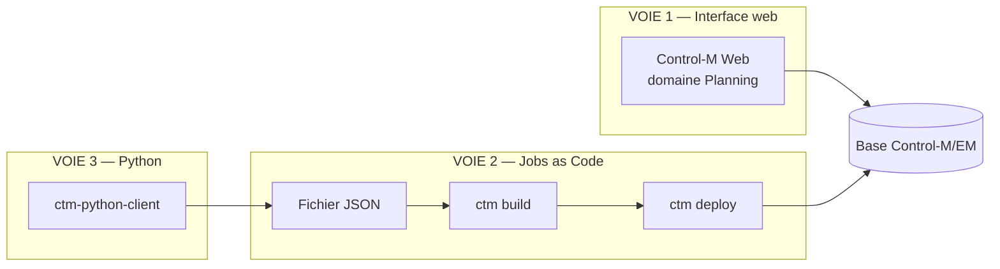

| Voie | Public | Avantages | Limites |
|---|---|---|---|
| **Control-M Web** | Ordonnanceurs, exploitants | Immédiat, visuel, validation en direct | Pas versionnable, pas reproductible, pas industrialisable |
| **JSON + Automation API** | DevOps, développeurs | Versionnable en Git, testable, déployable en CI/CD, promouvable entre environnements | Courbe d'apprentissage du DSL |
| **`ctm-python-client`** | Développeurs Python | Génération programmatique, boucles, logique conditionnelle à la construction | Couche supplémentaire, produit du JSON au final |

> **✅ Bonne pratique**
> Ces voies ne s'opposent pas. Le motif gagnant : **construire dans l'interface web** pour
> découvrir et prototyper, **exporter en JSON** (`ctm deploy jobs::get`), puis **basculer en
> Jobs-as-Code** pour tout ce qui va en production. L'interface reste l'outil de l'exploitant
> au quotidien ; le JSON est le référentiel.

---

### 5.2 Créer un job dans Control-M Web

Le parcours, domaine **Planning** :

1. **Workspace** — créer ou ouvrir un espace de travail (bac à sable non déployé) ;
2. **Folder** — créer le folder, choisir le Control-M/Server, l'application et la sous-application ;
3. **Job** — glisser un type de job dans le folder ;
4. **General** — nom, description, hôte, `RunAs`, commande/script ;
5. **Scheduling** — critères `When`, calendriers, fenêtre horaire ;
6. **Prerequisites** — événements attendus, ressources, confirmation ;
7. **Actions** — blocs `If`, actions, notifications ;
8. **Check-in** — enregistrement dans la base Control-M.

**Récupérer le JSON correspondant** — indispensable pour apprendre le DSL :

```bash
ctm deploy jobs::get -s "server=ctmsrv-dev&folder=MON-FOLDER"
```

C'est **la meilleure méthode d'apprentissage** du format : on construit visuellement, on exporte,
on lit le JSON produit.

---

### 5.3 Job de type commande — `Job:Command`

Le type le plus simple : exécute une commande système.

```json
{
  "PRD-SYS-PURGE-LOGS": {
    "Type": "Job:Command",
    "Command": "find /var/log/appli -name '*.log' -mtime +30 -delete",
    "PreCommand": "echo Debut purge $(date)",
    "PostCommand": "echo Fin purge $(date)",
    "Host": "srv-app-01",
    "RunAs": "svc_appli"
  }
}
```

| Attribut | Rôle |
|---|---|
| `Command` | La commande à exécuter |
| `PreCommand` | Commande exécutée **avant** la commande principale (optionnel) |
| `PostCommand` | Commande exécutée **après** (optionnel) |
| `Host` | Agent d'exécution. **Vide ⇒ exécution sur le Control-M/Server** |
| `RunAs` | Compte système |

> **⚠️ Attention**
> `PreCommand` et `PostCommand` s'exécutent dans le **même contexte** que la commande principale.
> Un `PostCommand` en échec fait échouer le job. Ne mettez pas de nettoyage « best effort »
> dans `PostCommand` sans le protéger par `|| true`.

---

### 5.4 Job de type script — `Job:Script`

Exécute un script existant sur la machine cible.

```json
{
  "PRD-FIN-EXTRACT-GL": {
    "Type": "Job:Script",
    "FileName": "extract_grand_livre.sh",
    "FilePath": "/opt/finance/bin",
    "Arguments": ["%%$ODATE", "GL", "--mode=complet"],
    "PreCommand": "test -f /opt/finance/conf/gl.conf",
    "Host": "srv-fin-01",
    "RunAs": "svc_finance"
  }
}
```

| Attribut | Rôle |
|---|---|
| `FileName` | Nom du fichier script |
| `FilePath` | Répertoire du script |
| `Arguments` | **Tableau de chaînes** passées en arguments |
| `OverridePath` | Répertoire alternatif (le nom de fichier doit rester identique) |

**Chemins Windows** — doubler les antislashs :

```json
{
  "PRD-WIN-SAUVEGARDE": {
    "Type": "Job:Script",
    "FileName": "sauvegarde.ps1",
    "FilePath": "C:\\Scripts\\Production",
    "Arguments": ["-Date", "%%$ODATE"],
    "Host": "srv-win-01",
    "RunAs": "DOMAINE\\svc_sauvegarde"
  }
}
```

#### 5.4.1 Anatomie d'un script bien intégré à Control-M

Le script est votre responsabilité, mais Control-M attend certaines choses de lui.

```bash
#!/usr/bin/env bash
#===============================================================================
# extract_grand_livre.sh — extraction du grand livre comptable
#
# Appelé par Control-M. Contrat d'interface :
#   $1 = date de traitement au format AAAAMMJJ (%%$ODATE)
#   $2 = périmètre (GL, AUX, IMMO)
#   $3 = mode optionnel (--mode=complet | --mode=delta)
#
# Codes retour :
#   0 = succès complet
#   4 = succès avec rejets (traité comme un avertissement par Control-M)
#   8 = échec fonctionnel (données invalides)
#  16 = échec technique (base injoignable, disque plein)
#===============================================================================

set -euo pipefail

# --- 1. Récupérer la date depuis Control-M, JAMAIS depuis l'horloge système ---
ODATE="${1:?ERREUR : date de traitement manquante}"
PERIMETRE="${2:?ERREUR : perimetre manquant}"
MODE="${3:---mode=complet}"

# --- 2. Tout écrire sur stdout/stderr : Control-M capture les deux dans l'output ---
echo "=========================================="
echo "Demarrage extraction"
echo "  Date de traitement : ${ODATE}"
echo "  Perimetre          : ${PERIMETRE}"
echo "  Mode               : ${MODE}"
echo "  Hote               : $(hostname)"
echo "  Utilisateur        : $(whoami)"
echo "=========================================="

# --- 3. Vérifier les prérequis AVANT de commencer ---
REP_SORTIE="/data/finance/extractions/${ODATE}"
mkdir -p "${REP_SORTIE}"

if ! command -v sqlplus >/dev/null 2>&1; then
    echo "ERREUR TECHNIQUE : sqlplus introuvable dans le PATH" >&2
    exit 16
fi

# --- 4. Idempotence : une relance ne doit pas produire de doublons ---
FICHIER_SORTIE="${REP_SORTIE}/gl_${PERIMETRE}_${ODATE}.csv"
if [[ -f "${FICHIER_SORTIE}" ]]; then
    echo "AVERTISSEMENT : fichier existant, suppression avant regeneration"
    rm -f "${FICHIER_SORTIE}"
fi

# --- 5. Le traitement lui-même ---
NB_REJETS=0
if ! /opt/finance/bin/extraire.py \
        --date "${ODATE}" \
        --perimetre "${PERIMETRE}" \
        "${MODE}" \
        --sortie "${FICHIER_SORTIE}"; then
    echo "ERREUR TECHNIQUE : echec de l'extraction" >&2
    exit 16
fi

NB_LIGNES=$(wc -l < "${FICHIER_SORTIE}")
NB_REJETS=$(grep -c '^REJET;' "${FICHIER_SORTIE}" || true)

# --- 6. Messages parsables : Control-M peut les capturer avec Action:CaptureOutput ---
echo "Lignes traitees : ${NB_LIGNES}"
echo "Rejets detectes : ${NB_REJETS}"
echo "Fichier produit : ${FICHIER_SORTIE}"

# --- 7. Code retour porteur de sens ---
if (( NB_REJETS > 0 )); then
    echo "Extraction terminee AVEC REJETS"
    exit 4
fi

echo "Extraction terminee avec succes"
exit 0
```

> **✅ Les sept règles d'un script « Control-M ready »**
> 1. **La date vient de Control-M** (`%%ODATE`), jamais de `date` dans le script ;
> 2. **Tout sur stdout/stderr** — c'est ce que Control-M capture dans l'output ;
> 3. **Vérifier les prérequis d'abord** — échouer vite et clairement ;
> 4. **Être idempotent** — une relance doit être sûre ;
> 5. **Des codes retour porteurs de sens** — `0`, `4` (avertissement), `8` (fonctionnel),
>    `16` (technique). Control-M peut alors réagir différemment selon le code ;
> 6. **Des messages parsables** (`Clé : valeur`) pour `Action:CaptureOutput` et `If:Output` ;
> 7. **`set -euo pipefail`** — sans cela, une commande en échec au milieu d'un pipe passe
>    inaperçue et le script retourne 0. C'est le bug silencieux classique.

---

### 5.5 Script embarqué — `Job:EmbeddedScript`

Le script est **dans la définition du job**. Il n'a pas besoin d'exister sur la machine cible.

```json
{
  "PRD-SYS-CONTROLE-ESPACE": {
    "Type": "Job:EmbeddedScript",
    "FileName": "controle_espace.sh",
    "Script": "#!/usr/bin/env bash\nset -euo pipefail\nSEUIL=85\necho \"Controle espace disque sur $(hostname)\"\ndf -P | awk -v s=$SEUIL 'NR>1 {gsub(/%/,\"\",$5); if ($5+0 > s) {print \"ALERTE: \" $6 \" a \" $5 \"%\"; ko=1}} END {exit ko+0}'\n",
    "Host": "srv-app-01",
    "RunAs": "svc_appli"
  }
}
```

| Attribut | Contrainte |
|---|---|
| `Script` | Texte complet du script — **1 Ko à 64 Ko** |
| `FileName` | L'**extension** indique à Control-M comment lire le script. Le fichier n'a pas besoin d'exister |

Variante **`Job:DetachedEmbeddedScript`** : mêmes attributs, mais le script s'exécute en
processus **détaché** (arrière-plan).

> **✅ Quand l'utiliser**
> - Traitements courts et stables (contrôles, notifications, calculs simples) ;
> - Environnements où **déployer un fichier sur l'Agent est difficile** ;
> - **Bootstrap** : le script embarqué va chercher le vrai code (git clone, téléchargement).
>
> **Quand l'éviter** : tout script de plus de ~50 lignes. Un script embarqué n'est ni testable
> unitairement, ni relisible en revue de code, ni versionnable indépendamment. Il devient
> rapidement une dette technique invisible.

---

### 5.6 Exécuter du Python

> **⚠️ Point important**
> **`Job:Python` n'existe pas.** Il n'y a pas de type de job Python natif.
> Python s'exécute via `Job:Command`, `Job:Script` ou `Job:EmbeddedScript`.
> (Le terme « Python » dans l'écosystème Control-M désigne la bibliothèque cliente
> `ctm-python-client`, qui sert à **écrire** des jobs, pas à en exécuter.)

#### 5.6.1 Le motif simple

```json
{
  "PRD-DATA-TRANSFORM": {
    "Type": "Job:Command",
    "Command": "/opt/venvs/data/bin/python3 /opt/data/jobs/transform.py --date %%$ODATE",
    "Host": "srv-data-01",
    "RunAs": "svc_data"
  }
}
```

#### 5.6.2 Le motif recommandé — un lanceur qui gère l'environnement

Appeler directement `python3` pose trois problèmes : quel interpréteur, quel environnement
virtuel, quelles variables d'environnement. Un script lanceur les résout.

```bash
#!/usr/bin/env bash
# /opt/data/bin/lancer_python.sh — lanceur standardisé pour les jobs Python
# Usage : lancer_python.sh <module.py> [arguments...]
set -euo pipefail

VENV="/opt/venvs/data"
APP_HOME="/opt/data"
MODULE="${1:?ERREUR : module Python manquant}"
shift

# Activation de l'environnement virtuel
if [[ ! -x "${VENV}/bin/python3" ]]; then
    echo "ERREUR TECHNIQUE : environnement virtuel absent : ${VENV}" >&2
    exit 16
fi
# shellcheck disable=SC1091
source "${VENV}/bin/activate"

export PYTHONPATH="${APP_HOME}/lib:${PYTHONPATH:-}"
export PYTHONUNBUFFERED=1     # CRUCIAL : sans cela, la sortie n'apparaît qu'à la fin

echo "Python  : $(python3 --version 2>&1)"
echo "Venv    : ${VENV}"
echo "Module  : ${MODULE}"
echo "Args    : $*"
echo "---------------------------------------------"

exec python3 "${APP_HOME}/jobs/${MODULE}" "$@"
```

```json
{
  "PRD-DATA-TRANSFORM": {
    "Type": "Job:Script",
    "FileName": "lancer_python.sh",
    "FilePath": "/opt/data/bin",
    "Arguments": ["transform.py", "--date", "%%$ODATE", "--source", "gl"],
    "Host": "srv-data-01",
    "RunAs": "svc_data"
  }
}
```

> **⚠️ `PYTHONUNBUFFERED=1` — le piège qui coûte des heures**
> Sans cette variable, Python tamponne sa sortie standard. Résultat : pendant qu'un job tourne
> 40 minutes, l'output Control-M reste **vide**, puis tout apparaît d'un coup à la fin.
> Et si le job est tué, **vous perdez toute la sortie**. Positionnez-la systématiquement.

#### 5.6.3 Script Python qui « parle » à Control-M

```python
#!/usr/bin/env python3
"""
transform.py — transformation des extractions comptables.

Contrat d'interface avec Control-M :
  --date AAAAMMJJ   date de traitement (%%$ODATE)
  --source <code>   périmètre

Codes retour :
  0  succès
  4  succès avec avertissements
  8  échec fonctionnel
  16 échec technique
"""
import argparse
import logging
import sys
from pathlib import Path

# Codes retour partagés avec Control-M
RC_OK, RC_WARN, RC_FONCTIONNEL, RC_TECHNIQUE = 0, 4, 8, 16


def configurer_logs() -> None:
    """Logs sur stdout, non tamponnés : Control-M les capture dans l'output."""
    logging.basicConfig(
        level=logging.INFO,
        format="%(asctime)s | %(levelname)-8s | %(message)s",
        datefmt="%Y-%m-%d %H:%M:%S",
        stream=sys.stdout,
    )


def main() -> int:
    configurer_logs()
    log = logging.getLogger("transform")

    parser = argparse.ArgumentParser()
    parser.add_argument("--date", required=True, help="Date de traitement AAAAMMJJ")
    parser.add_argument("--source", required=True)
    args = parser.parse_args()

    log.info("Demarrage — date=%s source=%s", args.date, args.source)

    entree = Path(f"/data/finance/extractions/{args.date}/gl_{args.source}_{args.date}.csv")
    if not entree.exists():
        log.error("Fichier d'entree introuvable : %s", entree)
        return RC_TECHNIQUE

    try:
        lignes, rejets = transformer(entree, args.date)
    except (OSError, PermissionError) as exc:
        log.exception("Erreur technique d'E/S : %s", exc)
        return RC_TECHNIQUE
    except ValueError as exc:
        log.error("Donnees invalides : %s", exc)
        return RC_FONCTIONNEL

    # Messages parsables par Action:CaptureOutput / If:Output
    log.info("Lignes traitees : %d", lignes)
    log.info("Rejets detectes : %d", rejets)

    if rejets:
        log.warning("Transformation terminee AVEC REJETS")
        return RC_WARN

    log.info("Transformation terminee avec succes")
    return RC_OK


def transformer(chemin: Path, odate: str) -> tuple[int, int]:
    """Traitement métier. Renvoie (nb_lignes, nb_rejets)."""
    lignes = rejets = 0
    with chemin.open(encoding="utf-8") as fh:
        for ligne in fh:
            lignes += 1
            if ligne.startswith("REJET;"):
                rejets += 1
    return lignes, rejets


if __name__ == "__main__":
    sys.exit(main())
```

Le job Control-M correspondant, avec exploitation fine des codes retour :

```json
{
  "PRD-DATA-TRANSFORM": {
    "Type": "Job:Script",
    "FileName": "lancer_python.sh",
    "FilePath": "/opt/data/bin",
    "Arguments": ["transform.py", "--date", "%%$ODATE", "--source", "gl"],
    "Host": "srv-data-01",
    "RunAs": "svc_data",
    "Description": "Transformation des extractions comptables du jour",

    "CapterVolumetrie": {
      "Type": "If",
      "CompletionStatus": "ANY",
      "Capturer": {
        "Type": "Action:CaptureOutput",
        "Search": "Lignes traitees :",
        "Capture": "UpToEndOfLine",
        "VariableName": "NB_LIGNES"
      }
    },

    "SiRejets": {
      "Type": "If",
      "CompletionStatus": "4",
      "Prevenir": {
        "Type": "Action:Mail",
        "To": "data-team@exemple.fr",
        "Subject": "[AVERTISSEMENT] %%JOBNAME — rejets le %%$ODATE",
        "Message": "Transformation terminee avec des rejets. Lignes : %%NB_LIGNES.",
        "AttachOutput": true
      },
      "ContinuerQuandMeme": { "Type": "Action:SetToOK" }
    },

    "SiEchecFonctionnel": {
      "Type": "If",
      "CompletionStatus": "8",
      "AlerterMetier": {
        "Type": "Action:Mail",
        "To": "equipe-compta@exemple.fr",
        "Subject": "[ECHEC FONCTIONNEL] %%JOBNAME — %%$ODATE",
        "Message": "Donnees invalides detectees. Intervention metier requise.",
        "Urgency": "Urgent",
        "AttachOutput": true
      }
    },

    "SiEchecTechnique": {
      "Type": "If",
      "CompletionStatus": "16",
      "AlerterExploitation": {
        "Type": "Action:Notify",
        "Destination": "Alerts",
        "Urgency": "VeryUrgent",
        "Message": "ECHEC TECHNIQUE %%JOBNAME sur %%NODEID"
      },
      "Relancer": { "Type": "Action:Rerun" }
    },

    "PublierFin": {
      "Type": "If",
      "CompletionStatus": "OK",
      "Evenement": { "Type": "Event:Add", "Event": "DATA-TRANSFORM-OK" }
    }
  }
}
```

> **Le point de qualité qui distingue une chaîne professionnelle**
> Ce job **distingue trois natures d'échec** et réagit différemment à chacune :
> un avertissement (rejets) part au métier et le job passe OK ;
> un échec fonctionnel alerte le métier sans relancer (relancer ne servirait à rien) ;
> un échec technique alerte l'exploitation **et relance** (une panne réseau peut se résoudre).
> C'est ce niveau de finesse qui fait la différence entre une production « qui sonne tout le
> temps » et une production dont les alertes sont crédibles.

---

### 5.7 Traitements batch

Un « batch » au sens classique — un programme compilé ou un traitement applicatif long — se
modélise comme un `Job:Script` ou `Job:Command`, avec quelques précautions particulières.

```json
{
  "PRD-FACT-CALCUL-MENSUEL": {
    "Type": "Job:Script",
    "FileName": "lancer_batch.sh",
    "FilePath": "/opt/facturation/bin",
    "Arguments": ["CALCUL_FACT", "%%$ODATE"],
    "Host": "srv-fact-01",
    "RunAs": "svc_facturation",
    "Application": "FACTURATION",
    "SubApplication": "MENSUEL",
    "Priority": "High",
    "Critical": true,
    "DaysKeepActive": "7",

    "VerrouBaseFact": {
      "Type": "Resource:Lock",
      "LockType": "Exclusive"
    },

    "When": {
      "MonthDaysCalendar": "FR-OUVRES-2026",
      "MonthDays": ["D1"],
      "FromTime": "0100",
      "ToTime":   "0500"
    },

    "AlerteNonDemarrage": {
      "Type": "Notify:DoesNotStart",
      "By": "0200",
      "Message": "CRITIQUE : le calcul de facturation n'a pas demarre a 02:00",
      "Destination": "mail",
      "Urgency": "VeryUrgent"
    },

    "AlerteNonFin": {
      "Type": "Notify:DoesNotEnd",
      "By": "0700",
      "Message": "CRITIQUE : le calcul de facturation tourne encore a 07:00",
      "Destination": "mail",
      "Urgency": "VeryUrgent"
    },

    "AlerteDuree": {
      "Type": "Notify:ExecutionTime",
      "Criteria": "GreaterThanAverage",
      "Value": "40%",
      "Message": "Le calcul de facturation depasse de 40%% sa duree moyenne"
    }
  }
}
```

**Points de vigilance spécifiques aux batchs longs** :

| Point | Traitement |
|---|---|
| **Durée imprévisible** | `Notify:ExecutionTime` sur la moyenne, plutôt qu'un seuil absolu |
| **Verrouillage exclusif** | `Resource:Lock` `Exclusive` sur la base ou le fichier de travail |
| **Rétention de la sortie** | `DaysKeepActive` élevé — un batch en échec s'analyse rarement le jour même |
| **Priorité** | `Priority: "High"` + `Critical: true` pour ne pas être doublé |
| **Point de reprise** | Le batch doit gérer ses propres points de reprise ; Control-M relance, il ne reprend pas |
| **Fenêtre** | `FromTime`/`ToTime` réaliste, en tenant compte des jours de forte charge |

---

### 5.8 Transferts de fichiers — `Job:FileTransfer`

Détaillé au chapitre 14. Exemple minimal :

```json
{
  "PRD-ECH-ENVOI-PARTENAIRE": {
    "Type": "Job:FileTransfer",
    "Host": "srv-mft-01",
    "ConnectionProfileSrc": "LOCAL-EXPORT",
    "ConnectionProfileDest": "SFTP-PARTENAIRE-A",
    "NumberOfRetries": "3",
    "FileTransfers": [
      {
        "Src":  "/data/export/factures_%%$ODATE.csv",
        "Dest": "/entrant/factures_%%$ODATE.csv",
        "TransferType": "Binary",
        "TransferOption": "SrcToDest",
        "AddTempFilePrefix": "tmp_",
        "DeleteFileOnDestIfFails": true
      }
    ]
  }
}
```

---

### 5.9 Surveillance de fichiers — `Job:FileWatcher`

```json
{
  "PRD-ECH-ATTENTE-BANQUE": {
    "Type": "Job:FileWatcher:Create",
    "RunAs": "svc_echanges",
    "Host": "srv-mft-01",
    "Path": "/data/entrant/releve_bancaire_*.csv",
    "WildCard": true,
    "SearchInterval": "60",
    "TimeLimit": "180",
    "MinimumSize": "1KB",
    "MinimalAge": "2Min",

    "SiFichierRecu": {
      "Type": "If",
      "CompletionStatus": "OK",
      "Publier": { "Type": "Event:Add", "Event": "FICHIER-BANQUE-RECU" }
    },

    "SiTimeout": {
      "Type": "If",
      "CompletionStatus": "NOTOK",
      "Alerter": {
        "Type": "Action:Mail",
        "To": "exploitation@exemple.fr",
        "Subject": "[SLA] Fichier bancaire non recu le %%$ODATE",
        "Message": "Aucun fichier recu apres 180 minutes d'attente."
      }
    }
  }
}
```

| Attribut | Sémantique |
|---|---|
| `Path` | Chemin complet. Jokers `*` et `?` supportés |
| `WildCard` | Booléen, défaut `false` — active l'interprétation des jokers |
| `SearchInterval` | Intervalle entre deux tentatives, en **secondes** |
| `TimeLimit` | Durée maximale d'attente, en **minutes**. **Défaut `0` = illimité** |
| `StartTime` / `StopTime` | `HHMM` ou `aaaammjjHHMM` |
| `MinimumSize` | Taille minimale avec unité : `B`, `KB`, `MB`, `GB` |
| `MinimalAge` / `MaximalAge` | Ancienneté depuis la dernière modification, ex. `2Y10M3D5H`, `2H10Min` |

**`Job:FileWatcher:Delete`** attend au contraire la **disparition** d'un fichier — utile pour
détecter qu'un autre système a consommé un fichier de verrou.

> **⚠️ Le piège du fichier en cours d'écriture**
> Sans `MinimalAge` ni `MinimumSize`, le file watcher détecte le fichier **dès sa création** —
> donc pendant que l'émetteur est encore en train de l'écrire. Le traitement lit alors un fichier
> tronqué.
> **Trois parades**, par ordre de fiabilité :
> 1. Demander à l'émetteur d'écrire un **fichier sentinelle** (`fichier.csv.done`) et surveiller
>    celui-là ;
> 2. Demander l'écriture sous nom temporaire puis renommage atomique — surveiller le nom final ;
> 3. À défaut : `MinimalAge` (le fichier n'a pas bougé depuis N minutes) **et** `MinimumSize`.
>
> `TimeLimit: "0"` (illimité) est un piège en production : le job attendra **indéfiniment**,
> masquant une panne amont. Fixez toujours une limite alignée sur votre SLA.

---

### 5.10 Jobs applicatifs

#### 5.10.1 Base de données

Attributs communs à tous les types `Job:Database:*` :

| Attribut | Valeurs | Défaut |
|---|---|---|
| `ConnectionProfile` | Nom du profil de connexion | — |
| `Host` | Agent portant le plug-in Databases | optionnel |
| `Autocommit` | `Y` / `N` | `N` |
| `OutputExecutionLog` | `Y` / `N` | `Y` |
| `OutputSQLOutput` | `Y` / `N` | `N` |
| `SQLOutputFormat` | `Text`, `XML`, `CSV`, `HTML` | `Text` |

**Requête embarquée** :

```json
{
  "PRD-DWH-CONTROLE-COHERENCE": {
    "Type": "Job:Database:EmbeddedQuery",
    "ConnectionProfile": "ORACLE-DWH-PROD",
    "Host": "srv-db-01",
    "RunAs": "svc_dwh",
    "Query": "SELECT COUNT(*) AS NB_ANOMALIES\nFROM FAITS_VENTES\nWHERE DATE_TRAITEMENT = TO_DATE('%%$ODATE','YYYYMMDD')\n  AND MONTANT IS NULL",
    "OutputSQLOutput": "Y",
    "SQLOutputFormat": "CSV"
  }
}
```

**Script SQL** :

```json
{
  "PRD-DWH-CHARGEMENT": {
    "Type": "Job:Database:SQLScript",
    "ConnectionProfile": "ORACLE-DWH-PROD",
    "SQLScript": "/opt/dwh/sql/charger_faits.sql",
    "Parameters": [
      {"DATE_TRAITEMENT": "%%$ODATE"},
      {"PERIMETRE": "VENTES"}
    ],
    "Autocommit": "N",
    "Host": "srv-db-01"
  }
}
```

**Procédure stockée** :

```json
{
  "PRD-DWH-AGREGATION": {
    "Type": "Job:Database:StoredProcedure",
    "ConnectionProfile": "ORACLE-DWH-PROD",
    "StoredProcedure": "PKG_DWH.CALCULER_AGREGATS",
    "Schema": "DWH_ADMIN",
    "Package": "PKG_DWH",
    "Parameters": [
      {"Name": "p_date",    "ParameterType": "VARCHAR2", "Direction": "In",  "Value": "%%$ODATE"},
      {"Name": "p_nb_lig",  "ParameterType": "NUMBER",   "Direction": "Out"}
    ],
    "ReturnValue": {"Name": "rc", "ValueType": "NUMBER"},
    "Host": "srv-db-01"
  }
}
```

Autres types : `Job:Database:MSSQL:AgentJob` (`JobName`, `Category`, `RunFromStep`,
`RerunFromPointOfFailure`) et `Job:Database:MSSQL:SSIS` (`PackageSource`, `PackageName`,
`CatalogEnv`, `ConfigFiles`, `Properties`).

Types de connection profiles base de données : `DB2`, `JDBC`, `MSSQL`, `Oracle`, `PostgreSQL`,
`Sybase`.

#### 5.10.2 Services web

```json
{
  "PRD-API-DECLENCHER-CALCUL": {
    "Type": "Job:WebServices",
    "ConnectionProfile": "API-MOTEUR-CALCUL",
    "Host": "srv-app-01",
    "Location": "https://api.interne.exemple.fr/v2",
    "Service": "calcul",
    "Operation": "POST",
    "RequestType": "FreeText",
    "Request": "{\"date\":\"%%$ODATE\",\"mode\":\"complet\"}",
    "OverrideContentType": "application/json",
    "HttpConnectionTimeout": "60",
    "OutputParameters": [
      {"Element": "jobId", "Destination": "ID_CALCUL", "Type": "String"}
    ]
  }
}
```

Attributs : `Location`, `Service`, `Operation`, `RequestType` (`Parameter` / `FreeText` /
`InputFile`), `SoapHeaderFile`, `OverrideUrlEndpoint`, `OverrideContentType`,
`HttpConnectionTimeout`, `PreemptiveHttpAuthentication`, `IncludeTitleInOutput`,
`ExcludeJobOutput`, `InputParameters[]`, `OutputParameters[]`, `Request`, `InputFile`.
Opérations REST : GET, POST, PUT, DELETE, HEAD, OPTIONS.

Variantes modernes construites avec Application Integrator : `Job:Web Services REST`,
`Job:Web Services SOAP`, avec des clés à espaces (`Endpoint URL`, `URL Request Path`,
`HTTP Headers`, `WsRestBody`, `OutputHandling[]`, `Connection Timeout`).

#### 5.10.3 Kubernetes

```json
{
  "PRD-K8S-TRAITEMENT": {
    "Type": "Job:Kubernetes",
    "ConnectionProfile": "K8S-PROD",
    "Job Spec Type": "Local file",
    "Job Spec Yaml": "/opt/k8s/specs/traitement.yaml",
    "Job Spec Parameters": "DATE=%%$ODATE",
    "Get Pod Logs": "Get Logs",
    "Job Cleanup": "Delete Job",
    "Job Status Polling Interval": "20",
    "Host": "srv-k8s-agent-01"
  }
}
```

> **⚠️ Attention à la casse et aux espaces**
> Les types de jobs modernes (Kubernetes, cloud, intégrations) utilisent des clés JSON **avec
> des espaces** et une casse précise : `"Job Spec Type"`, `"Status Polling Frequency"`,
> `"State Machine ARN"`. Ce n'est pas une coquille : c'est le nom d'affichage du champ,
> repris tel quel comme clé JSON. Une majuscule ou un espace en trop, et le `ctm build` échoue.

#### 5.10.4 SAP

Spellings exacts (attention aux **majuscules**) :

`Job:SAP:R3:CREATE`, `Job:SAP:R3:COPY`, `Job:SAP:BW:ProcessChain`, `Job:SAP:BW:InfoPackage`,
`Job:SAP:DataArchiving` (et `:Write`, `:Delete`, `:Store`), `Job:SAP:R3:PredefinedSapJob`,
`Job:SAP:R3:MonitorSapJob`, `Job:SAP:R3:BatchInputSession`,
`Job:SAP:R3:SapProfile:Activate` / `:Deactivate`, `Job:SAP:R3:TriggerSapEvent`,
`Job:SAP:R3:WatchSapEvent`.

```json
{
  "PRD-SAP-CLOTURE": {
    "Type": "Job:SAP:R3:CREATE",
    "ConnectionProfile": "SAP-PRD-100",
    "SapJobName": "ZCLOTURE_MENSUELLE",
    "CreatedBy": "emuser",
    "Host": "srv-sap-agent-01",
    "Steps": [
      {
        "StepType": "ABAP",
        "ProgramName": "ZFI_CLOTURE",
        "UserName": "SVCBATCH",
        "Description": "Cloture comptable mensuelle"
      }
    ]
  }
}
```

> **⚠️ Attention**
> `Job:SAP:R3:CreateJob` et `Job:SAP:R3:CopyExistingJob` sont **faux**.
> Les noms réels sont `Job:SAP:R3:CREATE` et `Job:SAP:R3:COPY`, en majuscules.

#### 5.10.5 Cloud

> **Version — dépréciation importante**
> Les anciens types **sans espaces** (`Job:AWS:Lambda`, `Job:Azure:Function`,
> `Job:AWS:StepFunction`, `Job:Azure:LogicApps`, `Job:Azure:BatchAccount`, `Job:AWS:Batch`)
> sont **dépréciés**. Les types actuels utilisent des **espaces** :
> `Job:AWS Lambda`, `Job:AWS Batch`, `Job:AWS Step Functions`, `Job:AzureFunctions`,
> `Job:Azure Logic Apps`, `Job:Azure Batch Accounts`.
> Les nouveaux types prennent tous `Status Polling Frequency` et `Failure Tolerance`.

```json
{
  "PRD-AWS-PIPELINE": {
    "Type": "Job:AWS Step Functions",
    "ConnectionProfile": "AWS-PROD-EU-WEST-1",
    "Execution Name": "pipeline-%%$ODATE",
    "State Machine ARN": "arn:aws:states:eu-west-1:123456789012:stateMachine:PipelineDonnees",
    "Parameters": "{\"dateTraitement\":\"%%$ODATE\"}",
    "Show Execution Logs": "checked",
    "Status Polling Frequency": "30",
    "Failure Tolerance": "2",
    "Host": "srv-cloud-agent-01"
  }
}
```

#### 5.10.6 Application Integrator

Les champs personnalisés créés dans Application Integrator sont préfixés **`AI-`** :

```json
{
  "PRD-CUSTOM-MONITOR": {
    "Type": "Job:ApplicationIntegrator:AI Monitor Remote Job",
    "ConnectionProfile": "AI_CONNECTION_PROFILE",
    "AI-Host": "Host1",
    "AI-Port": "5180",
    "AI-User Name": "admin",
    "AI-Password": "Secret:ai_admin_pwd",
    "AI-Remote Job to Monitor": "remoteJob5",
    "RunAs": "controlm"
  }
}
```

#### 5.10.7 Autres types utiles

| Type | Usage |
|---|---|
| `Job:Dummy` | Job vide — jalons, points de convergence, structuration de flux |
| `Job:Informatica` | Workflows PowerCenter |
| `Job:Java` | Classes Java / EJB |
| `Job:Messaging:FreeText` / `:WaitForReply` / `:PreDefined` | JMS / MQ |
| `Job:IBMDataStage`, `Job:IBMCognos`, `Job:NetBackup`, `Job:OEBS`, `Job:PeopleSoft` | Applications d'entreprise |
| `Job:Hadoop:Spark:Python` / `:ScalaJava`, `:Hive`, `:Pig`, `:Sqoop`, `:HDFSCommands`, `:HDFSFileWatcher`, `:Oozie`, `:MapReduce`, `:DistCp`, `:MapredStreaming` | Écosystème Hadoop |
| `Job:OS400:*`, `Job:Tandem:*`, `Job:VMware:*` | Plateformes spécifiques |
| `Job:zOS:Member`, `Job:zOS:InStreamJCL` | Mainframe |
| `Job:SLAManagement` | Service SLA (chapitre 9) |

> **`Job:Dummy` — bien plus utile qu'il n'y paraît**
> Trois usages professionnels :
> 1. **Jalon de convergence** — 12 jobs pointent vers un `Job:Dummy` « PHASE-1-TERMINEE » ;
>    les 8 jobs suivants n'attendent qu'un seul événement au lieu de douze. La lisibilité du
>    flux est transformée.
> 2. **Point d'ancrage SLA** — le job SLA se branche sur le dummy final.
> 3. **Réservation de structure** — placer les jalons d'une chaîne avant que les traitements
>    existent, pour valider la topologie avec les équipes.

---

### 5.11 L'objet `Defaults`

`Defaults` factorise les valeurs communes. **Une valeur au niveau job écrase toujours le
`Defaults`.**

**Niveau global** (frère des folders, au sommet du fichier) :

```json
{
  "Defaults": {
    "Application": "FINANCE",
    "SubApplication": "COMPTABILITE",
    "RunAs": "svc_finance",
    "Host": "srv-fin-01"
  }
}
```

**Portée « tous les jobs »**, via une clé `Job` imbriquée :

```json
{
  "Defaults": {
    "Job": {
      "Host": "srv-fin-01",
      "When": {
        "WeekDays": ["MON", "TUE", "WED", "THU", "FRI"],
        "FromTime": "0200",
        "ToTime": "0600"
      },
      "ActionSiEchec": {
        "Type": "If",
        "CompletionStatus": "NOTOK",
        "Mail": {
          "Type": "Action:Mail",
          "To": "exploitation@exemple.fr",
          "Subject": "[ECHEC] %%JOBNAME",
          "Message": "Le job %%JOBNAME a echoue sur %%NODEID (ODATE %%$ODATE)."
        }
      }
    }
  }
}
```

**Portée « un type de job », dans un folder** — la clé imbriquée est le nom du type :

```json
{
  "PRD-FIN-CHAINE": {
    "Type": "Folder",
    "Defaults": {
      "Job:Database:SQLScript": {
        "ConnectionProfile": "ORACLE-FIN-PROD",
        "Autocommit": "N",
        "Host": "srv-db-01"
      }
    }
  }
}
```

> **⚠️ Limitation**
> **`SiteStandard` n'est pas supporté comme `Defaults` global** : il doit être posé sur le folder.

> **✅ Bonne pratique**
> Le bloc `Defaults` est **le meilleur endroit pour la gestion d'erreur générique**.
> Un `If` sur `NOTOK` qui notifie l'exploitation, défini une seule fois dans `Defaults.Job`,
> couvre automatiquement **tous** les jobs du fichier. Chaque job n'ajoute ensuite que ses
> traitements d'erreur **spécifiques**. Vous ne pouvez plus oublier de gérer un échec.

---

### 5.12 Exemple complet commenté — une chaîne de production réaliste

Ce fichier est un exemple de bout en bout, exploitable tel quel après adaptation.
Chaque bloc est commenté en dessous.

```json
{
  "Defaults": {
    "Application": "FINANCE",
    "SubApplication": "CLOTURE_QUOTIDIENNE",
    "RunAs": "svc_finance",
    "Host": "srv-fin-01",
    "CreatedBy": "emuser",

    "Job": {
      "When": {
        "RuleBasedCalendars": {
          "Included": ["JOURS-OUVRES-FR"],
          "Excluded": ["FERIES-FR"],
          "Relationship": "AND"
        },
        "FromTime": "0200",
        "ToTime": "0800"
      },
      "GestionErreurGenerique": {
        "Type": "If",
        "CompletionStatus": "NOTOK",
        "NotifierExploitation": {
          "Type": "Action:Notify",
          "Destination": "Alerts",
          "Urgency": "Urgent",
          "Message": "ECHEC %%JOBNAME | hote %%NODEID | ODATE %%$ODATE | code %%COMPSTAT"
        }
      }
    }
  },

  "PRD-FIN-CLOTURE-QUOTIDIENNE": {
    "Type": "Folder",
    "ControlmServer": "ctmsrv-prod",
    "OrderMethod": "Automatic",
    "SiteStandard": "STD-FINANCE",
    "Description": "Chaine de cloture comptable quotidienne",
    "AdjustEvents": true,
    "ActiveRetentionPolicy": "KeepAll",
    "DaysKeepActiveIfNotOk": "7",

    "Variables": [
      {"\\\\REP_TRAVAIL": "/data/finance/cloture/%%$ODATE"},
      {"\\\\DESTINATAIRES": "compta@exemple.fr,dsi-prod@exemple.fr"}
    ],

    "010-PREPARER-ESPACE": {
      "Type": "Job:Command",
      "Command": "mkdir -p %%\\\\REP_TRAVAIL && df -P %%\\\\REP_TRAVAIL",
      "Description": "Prepare le repertoire de travail du jour",
      "PublierPret": {
        "Type": "If",
        "CompletionStatus": "OK",
        "Ev": {"Type": "Event:Add", "Event": "FIN-ESPACE-PRET"}
      }
    },

    "020-ATTENDRE-FICHIER-BANQUE": {
      "Type": "Job:FileWatcher:Create",
      "Path": "/data/entrant/releve_*.csv",
      "WildCard": true,
      "SearchInterval": "60",
      "TimeLimit": "240",
      "MinimumSize": "1KB",
      "MinimalAge": "2Min",
      "Description": "Attend le releve bancaire quotidien",
      "AttenteEspace": {
        "Type": "WaitForEvents",
        "Events": [{"Event": "FIN-ESPACE-PRET"}]
      },
      "PublierRecu": {
        "Type": "If",
        "CompletionStatus": "OK",
        "Ev": {"Type": "Event:Add", "Event": "FIN-BANQUE-RECU"}
      },
      "AlerterSiAbsent": {
        "Type": "If",
        "CompletionStatus": "NOTOK",
        "Mail": {
          "Type": "Action:Mail",
          "To": "%%\\\\DESTINATAIRES",
          "Subject": "[SLA] Releve bancaire non recu — %%$ODATE",
          "Message": "Aucun releve recu apres 240 minutes. Chaine de cloture bloquee.",
          "Urgency": "VeryUrgent"
        }
      }
    },

    "030-EXTRAIRE-GRAND-LIVRE": {
      "Type": "Job:Script",
      "FileName": "extract_grand_livre.sh",
      "FilePath": "/opt/finance/bin",
      "Arguments": ["%%$ODATE", "GL", "--mode=complet"],
      "Description": "Extraction du grand livre depuis l'ERP",
      "PoolSessionsERP": {
        "Type": "Resource:Pool",
        "Quantity": "5"
      },
      "AttenteEspace": {
        "Type": "WaitForEvents",
        "Events": [{"Event": "FIN-ESPACE-PRET"}]
      },
      "SiRejets": {
        "Type": "If",
        "CompletionStatus": "4",
        "Mail": {
          "Type": "Action:Mail",
          "To": "%%\\\\DESTINATAIRES",
          "Subject": "[AVERTISSEMENT] Rejets a l'extraction GL — %%$ODATE",
          "Message": "Des rejets ont ete detectes. Voir la sortie jointe.",
          "AttachOutput": true
        },
        "Poursuivre": {"Type": "Action:SetToOK"}
      },
      "SiTimeoutOracle": {
        "Type": "If:Output",
        "Code": "*ORA-12170*",
        "Relancer": {"Type": "Action:Rerun"}
      },
      "PublierFin": {
        "Type": "If",
        "CompletionStatus": "OK",
        "Ev": {"Type": "Event:Add", "Event": "FIN-GL-EXTRAIT"}
      },
      "RelanceLimitee": {
        "Times": "2",
        "Every": "10",
        "Units": "Minutes"
      }
    },

    "040-RAPPROCHER": {
      "Type": "Job:Script",
      "FileName": "lancer_python.sh",
      "FilePath": "/opt/data/bin",
      "Arguments": ["rapprochement.py", "--date", "%%$ODATE"],
      "Description": "Rapprochement bancaire",
      "Attente": {
        "Type": "WaitForEvents",
        "Events": [
          {"Event": "FIN-BANQUE-RECU"},
          {"Event": "FIN-GL-EXTRAIT"}
        ]
      },
      "Consommer": {
        "Type": "DeleteEvents",
        "Events": [
          {"Event": "FIN-BANQUE-RECU"},
          {"Event": "FIN-GL-EXTRAIT"}
        ]
      },
      "CapterEcarts": {
        "Type": "If",
        "CompletionStatus": "ANY",
        "Capturer": {
          "Type": "Action:CaptureOutput",
          "Search": "Ecarts detectes :",
          "Capture": "UpToEndOfLine",
          "VariableName": "NB_ECARTS"
        }
      },
      "PublierFin": {
        "Type": "If",
        "CompletionStatus": "OK",
        "Ev": {"Type": "Event:Add", "Event": "FIN-RAPPROCHEMENT-OK"}
      }
    },

    "050-PRODUIRE-RAPPORT": {
      "Type": "Job:Script",
      "FileName": "lancer_python.sh",
      "FilePath": "/opt/data/bin",
      "Arguments": ["rapport.py", "--date", "%%$ODATE", "--format", "pdf"],
      "Description": "Generation du rapport de cloture",
      "Attente": {
        "Type": "WaitForEvents",
        "Events": [{"Event": "FIN-RAPPROCHEMENT-OK"}]
      },
      "PublierFin": {
        "Type": "If",
        "CompletionStatus": "OK",
        "Ev": {"Type": "Event:Add", "Event": "FIN-RAPPORT-PRET"}
      }
    },

    "060-DIFFUSER-RAPPORT": {
      "Type": "Job:FileTransfer",
      "Host": "srv-mft-01",
      "ConnectionProfileSrc": "LOCAL-FINANCE",
      "ConnectionProfileDest": "SFTP-DIRECTION",
      "NumberOfRetries": "3",
      "Description": "Depot du rapport sur le SFTP de la direction",
      "Attente": {
        "Type": "WaitForEvents",
        "Events": [{"Event": "FIN-RAPPORT-PRET"}]
      },
      "FileTransfers": [
        {
          "Src":  "/data/finance/cloture/%%$ODATE/rapport_cloture_%%$ODATE.pdf",
          "Dest": "/rapports/rapport_cloture_%%$ODATE.pdf",
          "TransferType": "Binary",
          "TransferOption": "SrcToDest",
          "AddTempFilePrefix": "tmp_",
          "DeleteFileOnDestIfFails": true
        }
      ],
      "PublierFin": {
        "Type": "If",
        "CompletionStatus": "OK",
        "Ev": {"Type": "Event:Add", "Event": "FIN-CLOTURE-TERMINEE"}
      }
    },

    "099-SLA-CLOTURE": {
      "Type": "Job:SLAManagement",
      "ServiceName": "CLOTURE-COMPTABLE-QUOTIDIENNE",
      "ServicePriority": "1",
      "CreatedBy": "emuser",
      "RunAs": "svc_finance",
      "JobRunsDeviationsTolerance": "2",
      "CompleteBy": {"Time": "08:00", "Days": "0"},
      "Description": "Engagement : cloture terminee avant 08:00",
      "Attente": {
        "Type": "WaitForEvents",
        "Events": [{"Event": "FIN-CLOTURE-TERMINEE"}]
      },
      "Nettoyer": {
        "Type": "DeleteEvents",
        "Events": [{"Event": "FIN-CLOTURE-TERMINEE"}]
      }
    },

    "Flow": {
      "Type": "Flow",
      "Sequence": [
        "010-PREPARER-ESPACE",
        "030-EXTRAIRE-GRAND-LIVRE",
        "040-RAPPROCHER",
        "050-PRODUIRE-RAPPORT",
        "060-DIFFUSER-RAPPORT",
        "099-SLA-CLOTURE"
      ]
    }
  }
}
```

#### Décryptage bloc par bloc

| Bloc | Ce qu'il fait et pourquoi |
|---|---|
| `Defaults` | Factorise l'application, le compte, l'hôte, la fenêtre horaire, le calendrier **et la notification d'échec générique**. Chaque job n'écrit plus que sa spécificité. |
| `Defaults.Job.GestionErreurGenerique` | Filet de sécurité : **tout** job qui échoue génère une alerte, sans que personne n'ait à y penser. |
| `SiteStandard: "STD-FINANCE"` | Le `ctm build` refusera toute définition non conforme aux conventions de l'équipe finance. |
| `AdjustEvents: true` | Les jours où un prédécesseur n'est pas ordonnancé, les successeurs ne restent pas bloqués. |
| `DaysKeepActiveIfNotOk: "7"` | En cas d'échec, l'instance reste 7 jours dans l'environnement actif pour analyse. |
| `Variables` avec `\\\\` | Portée **SMART folder** : `REP_TRAVAIL` et `DESTINATAIRES` sont visibles par tous les jobs du folder. Un seul endroit à modifier. |
| Numérotation `010`, `020`… par 10 | Permet d'insérer `035-CONTROLE-QUALITE` plus tard sans renommer quoi que ce soit. |
| `020` — file watcher hors du `Flow` | Le fichier bancaire arrive de façon asynchrone : il ne fait pas partie de la séquence linéaire, il alimente `040` par événement. **C'est le motif « attente externe »**. |
| `MinimumSize` + `MinimalAge` | Évite de détecter un fichier en cours d'écriture. |
| `TimeLimit: "240"` | Aligné sur le SLA : au-delà de 4 h d'attente, on alerte plutôt que d'attendre indéfiniment. |
| `030` — `Resource:Pool` `Quantity: 5` | Bride la consommation de sessions ERP : la clôture ne peut pas asphyxier le système transactionnel. |
| `030` — `CompletionStatus: "4"` + `Action:SetToOK` | Les rejets partiels notifient le métier mais **ne bloquent pas la chaîne**. Décision d'exploitation explicite et tracée. |
| `030` — `If:Output` sur `ORA-12170` | Distingue une erreur **transitoire** (timeout réseau Oracle) d'un vrai échec : on relance la première, on alerte sur le second. |
| `030` — `RerunLimit` | Plafonne les relances à 2 : au-delà, c'est une vraie panne. |
| `040` — `WaitForEvents` sur deux événements | Point de **convergence** : le rapprochement attend le fichier bancaire **et** l'extraction. Relation `AND` par défaut. |
| `040` — `DeleteEvents` | Consomme les événements. Sans cela, ils s'accumulent et une relance partielle repartirait sur d'anciens jetons. |
| `040` — `Action:CaptureOutput` | Extrait le nombre d'écarts de la sortie vers une variable Control-M, exploitable en aval. |
| `060` — `AddTempFilePrefix` | Le fichier est déposé sous un nom temporaire puis renommé : le destinataire ne lit jamais un transfert partiel. |
| `099` — `Job:SLAManagement` | Ancre l'engagement de service : « terminé avant 08:00 ». Control-M **prédit** le retard et alerte avant l'échéance. |
| `Flow` | Décrit la séquence linéaire. Le file watcher `020` n'y figure pas : il est relié par événement, pas par séquence. |

**Le flux résultant** :

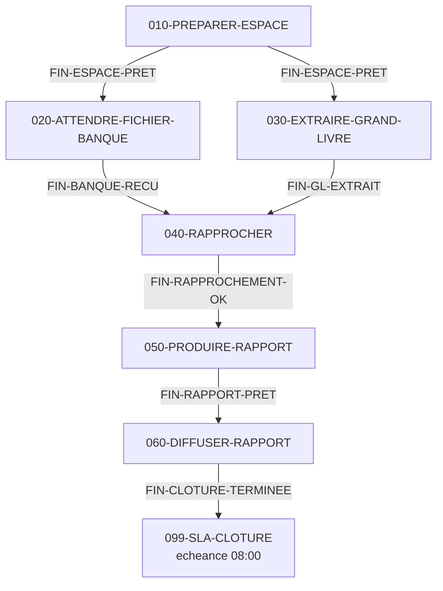

---

# Partie VI — Supervision et exploitation

## 6. Supervision et exploitation

### 6.1 Le domaine Monitoring

Le domaine **Monitoring** de Control-M Web permet *« de visualiser les jobs, superviser leur
traitement et contrôler le flux dans votre environnement actif »*.

**Onglets** : **Viewpoints**, **Services**, **All_Jobs**, **Alerts**.

**Panneau de droite sur un job sélectionné** :

| Onglet | Contenu |
|---|---|
| **Summary** | Synthèse : statut, heures, hôte, code retour |
| **Job Settings** | Definition : General / Scheduling / Prerequisites / Actions |
| **Waiting Info** | **Ce que le job attend précisément** — la fonction « Why » |
| **Log** | Journal d'activité : chaque changement de statut, horodaté |
| **Output** | La sortie réelle du traitement (ex-*sysout*) |
| **Statistics** | Durées historiques, moyenne, écart-type |
| **Script** | Le script exécuté |
| **Documentation** | Documentation d'exploitation attachée |
| **Services** | Services SLA impactés par ce job |

### 6.2 Les Viewpoints

Un **viewpoint** est *« une vue filtrée des folders et jobs de votre environnement actif,
permettant de superviser en temps réel l'exécution de vos workflows sur plusieurs
Control-M/Servers et Agents »*.

| Type | Portée |
|---|---|
| **Public Viewpoint** | Visible par tous les utilisateurs |
| **Private Viewpoint** | Visible par son créateur uniquement (créé depuis Control-M Web) |

**Trois éléments configurables** :

| Élément | Rôle | Recommandation BMC |
|---|---|---|
| **Hierarchy** | L'organisation d'affichage du viewpoint | — |
| **Collection Filter** | Limite les jobs **collectés** depuis la base des jobs actifs | *« Ne créez de nouveaux collection filters que pour résoudre des problèmes de performance »* |
| **Filter** | Filtre d'affichage sur les attributs Control-M, avec opérateurs booléens | Usage normal |

**Limite : 60 000 jobs par viewpoint.**

> **✅ Bonne pratique — la grille de viewpoints d'une équipe de production**
>
> | Viewpoint | Filtre | Public |
> |---|---|---|
> | `PROD — Vue générale` | `Server = PROD` | Tous |
> | `PROD — En échec` | `Status = Ended Not OK` | Exploitation |
> | `PROD — En attente > 30 min` | `Status IN (Wait Condition, Wait Resource)` | Exploitation |
> | `PROD — Services SLA critiques` | `Service Priority = 1` | Astreinte |
> | `PROD — Finance` | `Application = FINANCE` | Équipe finance |
> | `DEV/TEST` | `Server IN (DEV, TEST)` | Développeurs |
>
> Un viewpoint « tout voir » n'est utile à personne : c'est un mur de 40 000 lignes.
> **Un viewpoint = une question qu'on se pose plusieurs fois par jour.**

### 6.3 Les statuts de job

#### 6.3.1 Statuts renvoyés par l'Automation API

Ce sont les valeurs exactes du champ `status` de `ctm run jobs:status::get` :

| Statut API | Signification | Que faire |
|---|---|---|
| `Ended OK` | Terminé avec succès | Rien |
| `Ended Not OK` | Terminé en échec | Analyser output + log |
| `Executing` | En cours d'exécution | Attendre, surveiller la durée |
| `Wait Condition` | Attend un ou plusieurs **événements** (affiché « Wait Event » dans l'IHM) | Voir *Waiting Info* / `ctmwhy` |
| `Wait Resource` | Attend une ressource (pool ou verrou) | Vérifier la disponibilité de la ressource |
| `Wait Host` | Attend que l'hôte soit disponible | Vérifier l'état de l'Agent |
| `Wait User` | Attend une **confirmation manuelle** | `ctm run job::confirm` |
| `Wait Workload` | Bridé par une **workload policy** | Vérifier la politique active |
| `Status Unknown` | Statut indéterminé | Diagnostic approfondi |

Chaque enregistrement porte aussi deux indicateurs booléens : **`held`** et **`deleted`**.

Exemple de réponse :

```json
{
  "jobId": "ctmsrv-prod:00008",
  "folderId": "ctmsrv-prod:00007",
  "name": "030-EXTRAIRE-GRAND-LIVRE",
  "folder": "PRD-FIN-CLOTURE-QUOTIDIENNE",
  "type": "Command",
  "status": "Wait Condition",
  "held": false,
  "deleted": false,
  "startTime": "20260902020412",
  "endTime": "20260902021530",
  "orderDate": "260902",
  "ctm": "ctmsrv-prod",
  "application": "FINANCE",
  "outputURI": "Job did not run, it has no output"
}
```

#### 6.3.2 Vocabulaire de l'interface web

L'IHM utilise des libellés parfois différents : *Ended OK, Ended Not OK, Executing, Wait Event,
Wait Resource, Wait User, Wait Host (z/OS uniquement), Wait Workload, Hold / On Hold,
Pre-execution, Disappeared, Failed Reason Unknown, Unknown*.

> **⚠️ Deux pièges de vocabulaire**
> 1. **`Wait Condition` (API) = « Wait Event » (IHM)** — même chose, deux générations de
>    vocabulaire.
> 2. **« Late » n'est PAS un statut de job.** Le retard est une propriété du **service SLA**,
>    pas du job. Si quelqu'un vous parle d'un « job Late », il parle d'un service en retard.

### 6.4 Actions d'exploitation

| Action IHM | Description officielle | Commande API |
|---|---|---|
| **Hold** | *« Empêche un job de s'exécuter, ce qui permet de l'éditer et de le mettre à jour »* | `ctm run job::hold <jobId>` |
| **Free** | *« Libère un job de l'état Hold, ce qui lui permet de s'exécuter »* | `ctm run job::free <jobId>` |
| **Rerun** | *« Relance un job qui a déjà tourné »* | `ctm run job::rerun <jobId>` |
| **Run Now** | *« Ignore les critères de planification et exécute le job immédiatement »* | `ctm run job::runNow <jobId>` |
| **Confirm** | *« Accorde la confirmation utilisateur à un job en attente de confirmation »* | `ctm run job::confirm <jobId>` |
| **Kill** | *« Termine un job pendant son exécution »* | `ctm run job::kill <jobId>` |
| **Set to OK** | Force le statut à OK, ignorant critères et pré-requis | `ctm run job::setToOk <jobId>` |
| **Delete** | Supprime un job en attente (doit être en Hold) | `ctm run job::delete <jobId>` |
| **Restore / Undelete** | *« Restaure un job supprimé »* | `ctm run job::undelete <jobId>` |
| **Bypass** | Ignore critères, actions, ressources ou post-traitement | `ctm run job::bypass <jobId\|folderId> -f options.json` |
| **Modify** | Modifie la définition de l'instance active | `ctm run job::modify <fichier.json> <jobId>` |
| **Skip** | *« Renonce à exécuter le job et permet aux successeurs de démarrer »* | — |
| — | Consulter la sortie | `ctm run job:output::get <jobId> [runNo]` |
| — | Consulter le journal | `ctm run job:log::get <jobId>` |
| — | Consulter les statistiques | `ctm run job:statistics::get <jobId>` |
| — | Voir ce qu'il attend | `ctm run job::waitingInfo <jobId>` |
| — | Jobs liés (voisinage) | `ctm run job::related <jobId>` |

> **⚠️ Toutes les actions sur un job utilisent `job::` (DOUBLE deux-points)**
> `ctm run job::hold`, pas `ctm run job:hold`.
> Les **consultations** utilisent un simple deux-points pour la ressource et un double pour
> l'action : `ctm run job:output::get`, `ctm run job:log::get`, `ctm run job:status::get`.
> C'est la grammaire générale du CLI : les segments de ressource se joignent par `:`,
> l'action se sépare par `::`.

#### 6.4.1 Le geste d'exploitation type — relancer un job en échec

```bash
# 1. Identifier le job
ctm run jobs:status::get -s "status=Ended Not OK&folder=PRD-FIN-*"

# 2. Lire la sortie du traitement
ctm run job:output::get "ctmsrv-prod:00008"

# 3. Lire le journal d'activité (les changements de statut)
ctm run job:log::get "ctmsrv-prod:00008"

# 4. Comparer avec l'historique de durée
ctm run job:statistics::get "ctmsrv-prod:00008"

# 5. Après correction, relancer
ctm run job::rerun "ctmsrv-prod:00008"

# 6. Suivre
watch -n 10 'ctm run job:status::get "ctmsrv-prod:00008"'
```

#### 6.4.2 `Set to OK` — le geste à encadrer

`Set to OK` force un job en succès **sans l'exécuter**. Les successeurs partent.

> **⚠️ Attention**
> C'est le geste le plus dangereux de l'exploitation Control-M. Il est parfois **nécessaire**
> (le traitement a bien tourné mais le code retour est faux, ou l'action corrective a été faite
> manuellement), mais il **falsifie l'état réel du système**.
>
> Encadrez-le :
> - restreint par RBAC à un rôle précis (pas tous les exploitants) ;
> - **toujours accompagné d'un commentaire** dans l'outil de suivi d'incident ;
> - revu en post-mortem : un `Set to OK` récurrent sur le même job est le symptôme d'un problème
>   de conception, pas d'un incident.

### 6.5 Log, Output, Statistics : trois choses différentes

| Élément | Contenu | Question à laquelle il répond |
|---|---|---|
| **Log** | *« Le journal d'activité du job, listant chaque changement de statut, comme les heures de début et de fin d'exécution »* | **Quand** s'est-il passé quoi ? |
| **Output** | *« Les différentes sorties du job sélectionné »* — la sortie réelle du script/programme | **Que s'est-il passé** dans le traitement ? |
| **Statistics** | *« Control-M Statistics calcule les estimations d'heure de début et de fin, la durée d'exécution et l'écart-type à partir des exécutions passées »* | Ce comportement est-il **anormal** ? |

> **✅ La méthode de diagnostic en trois temps**
> 1. **Log** : le job a-t-il démarré ? quand ? combien de temps a-t-il tourné ? a-t-il été
>    relancé ?
> 2. **Output** : quelle erreur exactement ? à quelle ligne ? quel message ?
> 3. **Statistics** : ce job tourne d'habitude en 4 minutes et a mis 47 minutes — le problème
>    est peut-être ailleurs (volume, contention, infrastructure).
>
> Beaucoup d'exploitants ne consultent que l'Output. Les statistiques sont pourtant ce qui
> permet de **détecter une dérive avant l'incident**.

### 6.6 La fonction « Why »

Quand un job ne démarre pas, la question est toujours la même : **qu'attend-il ?**

**Dans l'interface** : onglet **Waiting Info** — *« permet de voir les événements et ressources
qu'un job de la file d'exécution attend actuellement »*.

**Par API** :

```bash
ctm run job::waitingInfo <jobId>
```

**En ligne de commande sur le Control-M/Server** — l'utilitaire `ctmwhy` :

```bash
ctmwhy <orderID>
ctmwhy -input_file <fichier>
```

L'identifiant d'ordre est en **base 36**. Pour passer une valeur en base 10, préfixez-la d'un
astérisque entre guillemets :

```bash
ctmwhy "*1234"
```

Exemple de sortie :

```text
QR: 'TAPE4' : needed 2. None reserved.
```

Description officielle : *« Génère un rapport expliquant pourquoi un SMART folder, sous-folder ou
job de la base des jobs actifs est bloqué. Reflète l'option "Why" du volet Tree View de
Control-M/EM. »*

### 6.7 Alertes

#### 6.7.1 Les catégories

| Catégorie | Origine |
|---|---|
| **Job-processing alerts** | Notifications de jobs/folders, terminaisons de jobs |
| **System alerts** (aussi *exception alerts* / **xAlerts**) | *« Défaillances de la base Control-M, problèmes réseau et erreurs applicatives »* |
| **Usage alerts** (CCM, self-hosted) | *« Vous préviennent quand le nombre de tâches dépasse la limite autorisée »* |

#### 6.7.2 Statuts de traitement

| Statut | Signification officielle |
|---|---|
| **Set New** | *« L'alerte n'a pas été examinée »* |
| **Set Reviewed** | *« L'alerte a été vue mais pas fermée »* |
| **Set Closed** | *« Le problème à l'origine de l'alerte est résolu »* |

**Sévérités** : `Normal`, `Urgent`, `Critical`.

> **⚠️ Attention**
> **« Handled » n'est pas un statut documenté.** Les trois statuts sont New / Reviewed / Closed.

#### 6.7.3 Gestion par API

```bash
# Modifier l'urgence et/ou ajouter un commentaire
ctm run alerts::update -f alertes-modif.json

# Changer le statut de traitement
ctm run alerts:status::update <alertIds> -f alertes-statut.json
```

```json
{ "alertIds": [30, 31], "urgency": "Normal", "comment": "Analyse en cours - ticket INC0012345" }
```

```json
{ "alertIds": [20], "status": "Reviewed" }
```

Valeurs de `status` : `New`, `Reviewed`, `Closed`, `Undefined` (obligatoire).
Valeurs de `urgency` : `Normal`, `Urgent`, `Critical` (optionnel).

```bash
curl -H "Authorization: Bearer $token" -H "Content-Type: application/json" \
     -X POST "$endpoint/run/alerts" -d @alertes-modif.json

curl -H "Authorization: Bearer $token" -H "Content-Type: application/json" \
     -X POST "$endpoint/run/alerts/status/$alertIds" -d @alertes-statut.json
```

#### 6.7.4 Destinations de notification

Types exacts utilisés par les actions `Action:Notify` et les objets `Notify:*` :

| Type | Comportement |
|---|---|
| `Mail` | Envoi vers des adresses e-mail |
| `Log` | Écriture dans le journal du job |
| `Program` | Exécute un script ou un programme |
| `Control-M/EM` | *« Envoie une notification à la fenêtre Alerts »* |
| `Terminal` | Terminal |
| `IOADEST`, `MAILDEST`, `SNMPDEST` | z/OS uniquement |

Champs d'une destination : **Destination Name**, **Address** (Agent / Server / NICK / Group),
**Destination**, **Value**.

> **⚠️ Attention — pas de connecteur ITSM natif en distribué**
> BMC **ne documente pas** de connecteur natif ServiceNow, BMC Remedy ou SNMP pour Control-M
> distribué. `SNMPDEST` est **z/OS uniquement**.
>
> Pour intégrer un outil ITSM, deux voies :
> 1. une destination de type **`Program`** qui appelle un script (celui-ci fait l'appel API vers
>    ServiceNow/Jira/PagerDuty) ;
> 2. l'**export d'alertes vers un client externe** : les alertes peuvent être *« transférées vers
>    un client externe pour supervision par des outils tiers, comme un système de gestion
>    d'événements »*, configuré via des commandes Automation API et des scripts personnalisés
>    (mécanisme de type webhook).
>
> L'action `Action:Remedy` existe pour BMC Remedy, mais vérifiez sa disponibilité et sa
> configuration sur votre plateforme.

**Script de passerelle vers un ITSM** — exemple de destination `Program` :

```bash
#!/usr/bin/env bash
# /opt/controlm/bin/alerte_vers_itsm.sh
# Destination de notification Control-M de type "Program".
# Control-M passe le message en argument.
set -euo pipefail

MESSAGE="${1:?message manquant}"
ITSM_URL="${ITSM_URL:?ITSM_URL non defini}"
ITSM_TOKEN="${ITSM_TOKEN:?ITSM_TOKEN non defini}"   # injecté par l'environnement, jamais en dur

curl --fail --silent --show-error \
     --max-time 30 \
     --retry 3 --retry-delay 5 --retry-connrefused \
     -X POST "${ITSM_URL}/api/now/table/incident" \
     -H "Authorization: Bearer ${ITSM_TOKEN}" \
     -H "Content-Type: application/json" \
     -d "$(jq -n --arg m "${MESSAGE}" \
            '{short_description:$m, category:"Ordonnancement",
              assignment_group:"Exploitation-Production", urgency:"2", impact:"2"}')"
```

### 6.8 Suivi opérationnel par API

#### 6.8.1 Interroger les statuts

```bash
# Tous les jobs en échec du jour
ctm run jobs:status::get -s "status=Ended Not OK"

# Une chaîne précise
ctm run jobs:status::get -s "folder=PRD-FIN-CLOTURE-QUOTIDIENNE"

# Avec une limite
ctm run jobs:status::get 500 -s "application=FINANCE"
```

#### 6.8.2 Suivre une exécution lancée par API

```bash
RUN_ID=$(ctm run ma-chaine.json | jq -r '.runId')
ctm run status "${RUN_ID}"
```

#### 6.8.3 Consulter les archives

Si **Control-M Workload Archiving** est installé :

```bash
ctm archive search::get [limite] -s "<critères>"
ctm archive log::get    <jobId> -s runNo=<numéro>
ctm archive output::get <jobId> -s runNo=<numéro>
```

### 6.9 Erreurs courantes et leur résolution

| Symptôme | Cause la plus probable | Vérification | Résolution |
|---|---|---|---|
| Job jamais apparu dans le Monitoring | Critères `When` non satisfaits ce jour-là | Calendrier, `WeekDays`, `MonthDays`, `RuleBasedCalendars` | Corriger les critères ou ordonnancer manuellement (`ctm run order`) |
| Job en `Wait Condition` indéfiniment | Événement attendu jamais produit | *Waiting Info* / `ctmwhy` | Publier l'événement (`ctm run event::add`) ou corriger le prédécesseur ; activer `AdjustEvents` |
| Job en `Wait Resource` | Pool épuisé ou verrou détenu | `ctm run resources::get` | Augmenter la capacité, ou identifier et débloquer le détenteur |
| Job en `Wait Host` | Agent `Unavailable` ou `Disabled` | `ctm config server:agent::ping` | Redémarrer l'Agent, vérifier le réseau, `enable` |
| Job en `Wait User` | `Confirm: true` | Définition du job | `ctm run job::confirm` |
| Job en `Wait Workload` | Workload policy active | `ctm run workloadpolicies::get Active` | Ajuster ou désactiver la politique |
| Job reste `Executing` alors qu'il est fini côté OS | Port 7005 (Agent → Server) bloqué | `ctm_diag_comm` | Ouvrir le port retour |
| `Ended Not OK` avec output vide | Sortie non tamponnée / job tué | `PYTHONUNBUFFERED`, `stdbuf` | Corriger le script |
| Output introuvable après quelques jours | `OUTPUTRETN` à 1 jour | Paramètre serveur | Augmenter la rétention ou activer l'archivage |
| Le job tourne 10× plus longtemps | Volume, contention, dégradation infra | `job:statistics::get` | Analyser la tendance, pas l'occurrence |
| Chaîne bloquée le week-end | Prédécesseur non ordonnancé le samedi | Critères `When` du prédécesseur | **`AdjustEvents: true`** sur le folder |
| Job relancé en boucle | `Rerun` avec `Times: 0` sans condition d'arrêt | Définition | Ajouter `Action:StopCyclicRun` sur `If:NumberOfExecutions` |

---

## 7. Gestion des dépendances — approfondissement

### 7.1 Les quatre façons d'exprimer une dépendance

| Mécanisme | Portée | Quand l'utiliser |
|---|---|---|
| **`Flow`** | Dans un fichier de définition | Séquences linéaires simples, lisibilité maximale |
| **Événements explicites** | Globale (même Control-M/Server) | Convergences, divergences, logique booléenne, dépendances asynchrones |
| **Événements globaux** | Entre Control-M/Servers | Dépendances inter-environnements géographiques |
| **`Resource:Lock`** | Globale | Exclusion mutuelle (ce n'est pas une dépendance d'ordre, mais de non-simultanéité) |

### 7.2 Les motifs classiques

#### 7.2.1 Séquence linéaire

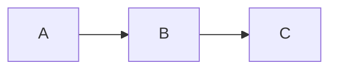

```json
"Flow": { "Type": "Flow", "Sequence": ["A", "B", "C"] }
```

#### 7.2.2 Éventail sortant (fan-out)

Un job termine, plusieurs démarrent en parallèle.

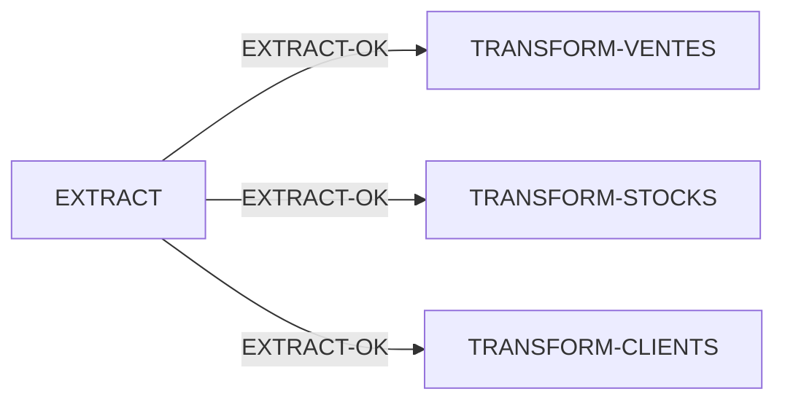

```json
{
  "EXTRACT":           { "Type": "Job:Command", "Command": "...",
                         "Pub": {"Type": "AddEvents", "Events": [{"Event": "EXTRACT-OK"}]} },
  "TRANSFORM-VENTES":  { "Type": "Job:Command", "Command": "...",
                         "Att": {"Type": "WaitForEvents", "Events": [{"Event": "EXTRACT-OK"}]} },
  "TRANSFORM-STOCKS":  { "Type": "Job:Command", "Command": "...",
                         "Att": {"Type": "WaitForEvents", "Events": [{"Event": "EXTRACT-OK"}]} },
  "TRANSFORM-CLIENTS": { "Type": "Job:Command", "Command": "...",
                         "Att": {"Type": "WaitForEvents", "Events": [{"Event": "EXTRACT-OK"}]} }
}
```

> **⚠️ Ne pas mettre de `DeleteEvents` sur `EXTRACT-OK` dans les trois consommateurs !**
> Le premier qui démarre supprimerait l'événement et les deux autres resteraient bloqués.
> Un événement consommé par plusieurs jobs est supprimé **par un seul job dédié** en fin de
> chaîne, ou pas du tout (le nettoyage de la New Day s'en charge).

#### 7.2.3 Convergence (fan-in)

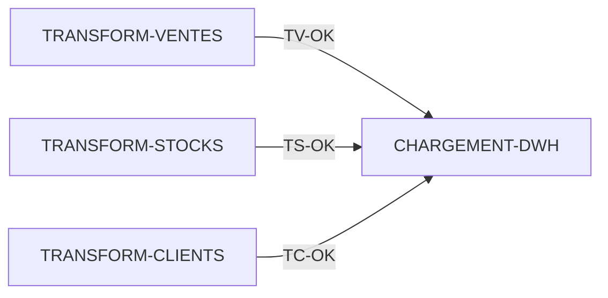

```json
"CHARGEMENT-DWH": {
  "Type": "Job:Command",
  "Command": "...",
  "Att": {
    "Type": "WaitForEvents",
    "Events": [{"Event": "TV-OK"}, {"Event": "TS-OK"}, {"Event": "TC-OK"}]
  },
  "Nettoyage": {
    "Type": "DeleteEvents",
    "Events": [{"Event": "TV-OK"}, {"Event": "TS-OK"}, {"Event": "TC-OK"}]
  }
}
```

Relation par défaut : **ET**. Les trois événements sont requis.

#### 7.2.4 Convergence avec jalon (recommandé au-delà de 5 prédécesseurs)

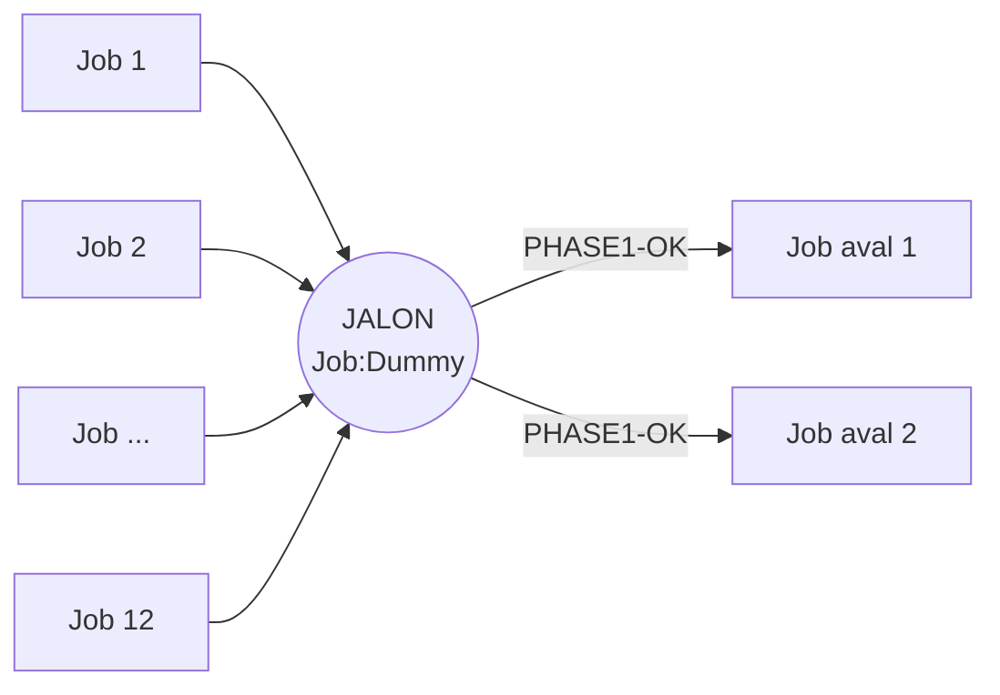

```json
"JALON-PHASE1": {
  "Type": "Job:Dummy",
  "Description": "Jalon : toutes les extractions sont terminees",
  "Att": {
    "Type": "WaitForEvents",
    "Events": [
      {"Event": "EXT-01-OK"}, {"Event": "EXT-02-OK"}, {"Event": "EXT-03-OK"},
      {"Event": "EXT-04-OK"}, {"Event": "EXT-05-OK"}, {"Event": "EXT-06-OK"}
    ]
  },
  "Nettoyage": {
    "Type": "DeleteEvents",
    "Events": [
      {"Event": "EXT-01-OK"}, {"Event": "EXT-02-OK"}, {"Event": "EXT-03-OK"},
      {"Event": "EXT-04-OK"}, {"Event": "EXT-05-OK"}, {"Event": "EXT-06-OK"}
    ]
  },
  "Pub": {"Type": "AddEvents", "Events": [{"Event": "PHASE1-OK"}]}
}
```

> **✅ Pourquoi c'est meilleur**
> Sans jalon, 6 producteurs × 8 consommateurs = **48 dépendances** à maintenir.
> Avec jalon : 6 + 8 = **14**. Et surtout, ajouter une 7ᵉ extraction ne touche qu'un seul job.
> Le diagramme de flux devient lisible pour un humain.

#### 7.2.5 Dépendance OU

```json
"Att": {
  "Type": "WaitForEvents",
  "Events": [
    {"Event": "SOURCE-PRINCIPALE-OK"},
    "OR",
    {"Event": "SOURCE-SECOURS-OK"}
  ]
}
```

#### 7.2.6 Dépendance décalée dans le temps

Un job du jour J attend un événement produit la veille :

```json
"Att": {
  "Type": "WaitForEvents",
  "Events": [{"Event": "CLOTURE-VEILLE-OK", "Date": "PreviousOrderDate"}]
}
```

Un job publie pour le lendemain :

```json
"Pub": {
  "Type": "AddEvents",
  "Events": [{"Event": "AUTORISATION-J+1", "Date": "NextOrderDate"}]
}
```

#### 7.2.7 Dépendance externe (date indifférente)

```json
"Att": {
  "Type": "WaitForEvents",
  "Events": [{"Event": "FICHIER-PARTENAIRE-RECU", "Date": "AnyDate"}]
}
```

### 7.3 Dépendances inter-applications

Deux chaînes appartenant à des applications différentes se synchronisent par événements
partagés. La discipline indispensable : **un contrat d'interface explicite**.

```mermaid
flowchart LR
    subgraph APP1["Application FINANCE"]
        F1["FIN-EXTRACT"] --> F2["FIN-VALIDER"]
    end
    subgraph CONTRAT["Contrat d'interface"]
        E(("Evenement<br/>IF-FIN-VERS-DWH-OK"))
    end
    subgraph APP2["Application DATAWAREHOUSE"]
        D1["DWH-CHARGER"] --> D2["DWH-AGREGER"]
    end
    F2 -->|"AddEvents"| E
    E -->|"WaitForEvents"| D1
```

> **✅ Bonne pratique — le contrat d'interface**
> Un événement partagé entre deux équipes est un **contrat d'API**. Formalisez-le :
>
> | Champ | Valeur |
> |---|---|
> | Nom de l'événement | `IF-FIN-VERS-DWH-OK` |
> | Producteur | Équipe Finance, job `PRD-FIN-VALIDER` |
> | Consommateur | Équipe Data, job `PRD-DWH-CHARGER` |
> | Qualificatif de date | `OrderDate` |
> | Heure de publication attendue | Avant 05:00 |
> | Qui supprime l'événement | Le consommateur (`PRD-DWH-CHARGER`) |
> | Que faire si absent à 06:00 | Alerte à l'équipe Finance, escalade à 07:00 |
> | Contact producteur | finance-prod@exemple.fr |
>
> Le préfixe `IF-` (interface) rend ces événements immédiatement identifiables : **on ne
> renomme jamais un événement `IF-` sans prévenir l'autre équipe.**

### 7.4 Dépendances inter-environnements

> **⚠️ Attention — une pratique à proscrire**
> Faire dépendre un job de **PRODUCTION** d'un événement produit en **DÉVELOPPEMENT** est une
> faute d'architecture. Cela signifie qu'une manipulation d'un développeur peut bloquer — ou pire,
> débloquer — la production.
>
> Le sens **autorisé** est l'inverse : un environnement **inférieur** peut attendre un événement
> d'un environnement **supérieur** (ex. : rafraîchissement des données de TEST après la clôture
> de PROD). Jamais le contraire.

Techniquement, la dépendance entre deux Control-M/Servers différents passe par le
**Global Conditions Server (GCS)**, qui *« identifie et distribue les événements globaux »*.

### 7.5 Événements globaux

Un **événement global** est propagé par le GCS à tous les Control-M/Servers pilotés par le même
Control-M/EM. C'est le mécanisme des dépendances multi-serveurs.

```mermaid
flowchart TB
    S1["Control-M/Server<br/>PROD-FR"] -->|"publie"| GCS["Global Conditions Server"]
    GCS -->|"distribue"| S2["Control-M/Server<br/>PROD-US"]
    GCS -->|"distribue"| S3["Control-M/Server<br/>PROD-ASIE"]
```

Les autorisations sur les **Global Events** sont une entité RBAC distincte des **Events** locaux.

> **✅ Bonne pratique**
> N'utilisez les événements globaux que pour de **vraies** dépendances inter-serveurs.
> Chaque événement global génère du trafic GCS et de la latence. Sur un environnement mal
> conçu où tout est global, le GCS devient un goulot d'étranglement.

### 7.6 Diagnostiquer une dépendance

```bash
# 1. Que le job attend-il ?
ctm run job::waitingInfo <jobId>

# 2. L'événement existe-t-il ?
ctm run events::get

# 3. Voisinage du job (prédécesseurs / successeurs)
ctm run job::related <jobId>

# 4. Sur le Control-M/Server
ctmwhy <orderID>

# 5. Débloquer si la décision est prise et tracée
ctm run event::add <server> <nomEvenement> <date>
```

---

## 8. Gestion des calendriers

### 8.1 Les trois types de calendriers

| Type JSON | Nature | Cas d'usage |
|---|---|---|
| `Calendar:Regular` | Liste explicite de jours, année par année, mois par mois | Jours fériés, jours de fermeture, dates de campagne |
| `Calendar:Periodic` | Périodes nommées `A`–`Z` (sauf `N` et `Y`) | Cycles de paie, périodes comptables non calendaires, semaines fiscales |
| `Calendar:RuleBasedCalendar` | Règle réutilisable portant toute la grammaire `When` | « Jours ouvrés », « fin de mois », « chaque 2ᵉ mardi » |

> **⚠️ Attention aux noms de types**
> Les noms actuels sont `Calendar:Regular`, `Calendar:Periodic` et
> **`Calendar:RuleBasedCalendar`** (avec le suffixe `Calendar`).
> `"Type": "Calendar"` et `"Type": "Calendar:RuleBased"` ne sont **pas** confirmés dans la
> référence de code. Vérifiez sur votre version.

### 8.2 Calendrier standard — `Calendar:Regular`

```json
{
  "FERIES-FR": {
    "Type": "Calendar:Regular",
    "Description": "Jours feries francais",
    "Server": "ctmsrv-prod",
    "When": {
      "Years": [
        {
          "Year": "2026",
          "JAN": ["1"],
          "APR": ["6"],
          "MAY": ["1", "8", "14", "25"],
          "JUL": ["14"],
          "AUG": ["15"],
          "NOV": ["1", "11"],
          "DEC": ["25"]
        },
        {
          "Year": "2027",
          "JAN": ["1"],
          "MAR": ["29"],
          "MAY": ["1", "6", "8", "17"],
          "JUL": ["14"],
          "AUG": ["15"],
          "NOV": ["1", "11"],
          "DEC": ["25"]
        }
      ]
    }
  }
}
```

Attributs : `Description`, `Server` (nom du serveur ou `Global`), `Alias` (nom du calendrier
z/OS). Les jours acceptent des **plages** : `"10-15"`.

> **✅ Bonne pratique**
> Les jours fériés changent chaque année. Créez le calendrier de l'année N+1 **en octobre de
> l'année N**, versionné dans Git, déployé par pipeline. Un calendrier de fériés vide au
> 1ᵉʳ janvier fait tourner toute la production un jour férié.

### 8.3 Calendrier périodique — `Calendar:Periodic`

Les calendriers périodiques permettent d'exprimer des cycles qui ne suivent pas le calendrier
grégorien : périodes comptables de 4 semaines, cycles de paie, semaines fiscales.

```json
{
  "PERIODES-PAIE-2026": {
    "Type": "Calendar:Periodic",
    "Description": "Periodes de paie mensuelles decalees",
    "Server": "ctmsrv-prod",
    "When": {
      "Periods": [
        {
          "Period": "A",
          "Years": [
            { "Year": "2026", "JAN": ["1-25"], "FEB": ["1-23"], "MAR": ["1-25"] }
          ]
        },
        {
          "Period": "B",
          "Years": [
            { "Year": "2026", "JAN": ["26-31"], "FEB": ["24-28"], "MAR": ["26-31"] }
          ]
        }
      ]
    }
  }
}
```

**Périodes valides : `A` à `Z`, sauf `N` et `Y`** (réservées), ou `"All"`.

### 8.4 Calendrier à base de règles — `Calendar:RuleBasedCalendar`

Le plus puissant : il porte la **grammaire `When` complète** et devient réutilisable par
n'importe quel job.

```json
{
  "JOURS-OUVRES-FR": {
    "Type": "Calendar:RuleBasedCalendar",
    "Description": "Lundi a vendredi hors jours feries francais",
    "Server": "ctmsrv-prod",
    "When": {
      "WeekDays": ["MON", "TUE", "WED", "THU", "FRI"],
      "Months": ["ALL"]
    }
  },

  "FIN-DE-MOIS-OUVRE": {
    "Type": "Calendar:RuleBasedCalendar",
    "Description": "Dernier jour ouvre de chaque mois",
    "Server": "ctmsrv-prod",
    "When": {
      "MonthDaysCalendar": "JOURS-OUVRES-FR",
      "MonthDays": ["L1"],
      "Months": ["ALL"]
    }
  }
}
```

Attributs `When` supportés : `Schedule`, `MonthDays`, `MonthDaysCalendar`, `Months`, `WeekDays`,
`WeekDaysCalendar`, `DaysRelation`, `SpecificDates`, `StartDate`, `EndDate`, `ActivePeriod`,
`DaysKeepActive` (0–99), `ConfirmationCalendars`.

### 8.5 La grammaire `When` complète

| Clé | Valeurs |
|---|---|
| `Schedule` | **`"Everyday"`** (un seul mot !) — planifie quotidiennement si les critères sont satisfaits ; **`"Never"`** — pas d'ordonnancement automatique, manuel uniquement |
| `WeekDays` | `SUN`, `MON`, `TUE`, `WED`, `THU`, `FRI`, `SAT`, `ALL`, `NONE` + modificateurs |
| `MonthDays` | `1`–`31`, `ALL` + modificateurs |
| `Months` | `JAN` … `DEC`, `ALL` (défaut : tous) |
| `DaysRelation` | `AND` (défaut) ou `OR` — relation entre `MonthDays` et `WeekDays` |
| `FromTime` | `HHMM` — ne peut pas démarrer avant |
| `ToTime` | `HHMM` — ne peut pas démarrer après ; `">"` autorise la soumission au-delà de la date d'origine |
| `StartDate` / `EndDate` | `AAAAMMJJ` |
| `ActivePeriod` | `true` (défaut) = le job **peut** tourner dans la fenêtre `StartDate`–`EndDate` ; `false` = il **ne peut pas** |
| `SpecificDates` | `"MM/JJ"`, jusqu'à **400 dates**. **Mutuellement exclusif avec WeekDays / Months / MonthDays** |
| `MonthDaysCalendar` | Nom du calendrier utilisé avec `MonthDays` |
| `WeekDaysCalendar` | Nom du calendrier utilisé avec `WeekDays` |
| `RuleBasedCalendars` | `{"Included": [...], "Excluded": [...], "Relationship": "AND"\|"OR"}` |
| `ConfirmationCalendars` | `{"Calendar": "...", "ExceptionPolicy": "...", "ShiftBy": "n"}` |

> **⚠️ Attention à l'orthographe**
> `"Schedule": "Everyday"` — **un seul mot, un seul `d` majuscule au début**.
> `"EveryDay"` avec un `D` majuscule est incorrect.

### 8.6 Les modificateurs de calendrier

Ce sont eux qui donnent toute sa puissance à Control-M. Identiques pour `MonthDays` et
`WeekDays`.

| Syntaxe | Signification |
|---|---|
| `1` | Inclus **seulement si** le jour figure dans le calendrier |
| `+2` | **Force l'inclusion**, quel que soit le calendrier |
| `-3` | **Force l'exclusion**, quel que soit le calendrier |
| `>4` | Le jour 4, **ou le jour ouvré suivant** selon le calendrier |
| `<5` | Le jour 5, **ou le jour ouvré précédent** selon le calendrier |
| `D6` | Le **6ᵉ jour ouvré** du calendrier |
| `L7` | Le **7ᵉ jour ouvré en partant de la fin** |
| `D6PA` / `D6P*` | Spécification de période pour un calendrier périodique (`P<période>` ; `*` = toutes) |
| `-D6`, `-L6P*` | Formes négatives de `D` et `L` |

**Exemples** :

```json
"When": {
  "WeekDaysCalendar": "JOURS-OUVRES-FR",
  "WeekDays": ["SUN", "+MON", "-TUE", ">WED", "<THU", "D6", "L3"]
}
```

```json
"When": {
  "Months": ["JAN", "OCT", "DEC"],
  "MonthDays": ["22", "1", "11"],
  "DaysRelation": "OR",
  "WeekDays": ["MON", "TUE"]
}
```

```json
"When": {
  "RuleBasedCalendars": {
    "Included": ["JOURS-OUVRES-FR"],
    "Excluded": ["FERIES-FR"],
    "Relationship": "AND"
  },
  "Months": ["JAN", "FEB", "MAR"],
  "WeekDays": ["TUE", "WED"]
}
```

> **⚠️ `Relationship` — la valeur par défaut est `OR`**
> Si vous voulez que le calendrier à base de règles **restreigne** les critères en ligne
> (comportement intuitif), vous devez écrire `"Relationship": "AND"` **explicitement**.
> Par défaut, le job tourne si **l'un OU l'autre** est satisfait — ce qui produit
> beaucoup plus d'exécutions que prévu.

**Héritage dans un sous-folder** : un sous-folder hérite des calendriers à base de règles de son
parent en utilisant le littéral **`"USE PARENT"`** (avec un **espace**, pas un underscore) à la
place des noms de calendriers.

### 8.7 Les calendriers de confirmation

`ConfirmationCalendars` gère les décalages quand une date planifiée tombe un jour non travaillé.

```json
"When": {
  "MonthDays": ["1"],
  "ConfirmationCalendars": {
    "Calendar": "JOURS-OUVRES-FR",
    "ExceptionPolicy": "ShiftAndRunOnNextConfirmedDay",
    "ShiftBy": "0"
  }
}
```

| `ExceptionPolicy` | Comportement quand le jour n'est pas confirmé |
|---|---|
| `DoNotOrder` | N'ordonnance pas |
| `OrderOnNextConfirmedDay` | Ordonnance le jour confirmé suivant |
| `OrderOnPreviousConfirmedDay` | Ordonnance le jour confirmé précédent |
| `OrderAnyway` | Ordonnance quand même |
| `ShiftAndDoNotRun` | Décale mais n'exécute pas |
| `ShiftAndRunOnNextConfirmedDay` | Décale et exécute le jour confirmé suivant |
| `ShiftAndRunOnPreviousConfirmedDay` | Décale et exécute le jour confirmé précédent |
| `ShiftAndRunAnyway` | Décale et exécute quand même |

`ShiftBy` : de **−62 à +62** (défaut `0`).

### 8.8 Recettes de planification

#### 8.8.1 Quotidien

```json
"When": { "Schedule": "Everyday", "FromTime": "0200", "ToTime": "0600" }
```

#### 8.8.2 Tous les jours ouvrés

```json
"When": {
  "WeekDays": ["MON", "TUE", "WED", "THU", "FRI"],
  "RuleBasedCalendars": { "Excluded": ["FERIES-FR"], "Relationship": "AND" }
}
```

#### 8.8.3 Hebdomadaire — chaque lundi

```json
"When": { "WeekDays": ["MON"], "FromTime": "0300" }
```

#### 8.8.4 Hebdomadaire — le lundi, ou le jour ouvré suivant si férié

```json
"When": {
  "WeekDaysCalendar": "JOURS-OUVRES-FR",
  "WeekDays": [">MON"]
}
```

#### 8.8.5 Mensuel — le 1ᵉʳ de chaque mois

```json
"When": { "MonthDays": ["1"] }
```

#### 8.8.6 Mensuel — 1ᵉʳ jour **ouvré** du mois

```json
"When": {
  "MonthDaysCalendar": "JOURS-OUVRES-FR",
  "MonthDays": ["D1"]
}
```

#### 8.8.7 Mensuel — dernier jour **ouvré** du mois

```json
"When": {
  "MonthDaysCalendar": "JOURS-OUVRES-FR",
  "MonthDays": ["L1"]
}
```

#### 8.8.8 Mensuel — 3ᵉ jour ouvré avant la fin du mois

```json
"When": {
  "MonthDaysCalendar": "JOURS-OUVRES-FR",
  "MonthDays": ["L3"]
}
```

#### 8.8.9 Le 15, ou le jour ouvré précédent si le 15 est chômé

```json
"When": {
  "MonthDaysCalendar": "JOURS-OUVRES-FR",
  "MonthDays": ["<15"]
}
```

#### 8.8.10 Trimestriel — 1ᵉʳ jour ouvré de janvier, avril, juillet, octobre

```json
"When": {
  "Months": ["JAN", "APR", "JUL", "OCT"],
  "MonthDaysCalendar": "JOURS-OUVRES-FR",
  "MonthDays": ["D1"]
}
```

#### 8.8.11 Annuel — dates fixes

```json
"When": { "SpecificDates": ["01/02", "07/01", "12/31"] }
```

> **⚠️ `SpecificDates` est exclusif**
> Il ne peut pas être combiné avec `WeekDays`, `Months` ou `MonthDays`.

#### 8.8.12 Le dernier vendredi du mois

```json
"When": {
  "WeekDays": ["FRI"],
  "MonthDays": ["L1", "L2", "L3", "L4", "L5", "L6", "L7"],
  "DaysRelation": "AND",
  "MonthDaysCalendar": "TOUS-LES-JOURS"
}
```

#### 8.8.13 Campagne limitée dans le temps

```json
"When": {
  "Schedule": "Everyday",
  "StartDate": "20260301",
  "EndDate": "20260430",
  "ActivePeriod": true
}
```

#### 8.8.14 Tout sauf une période de gel

```json
"When": {
  "Schedule": "Everyday",
  "StartDate": "20261220",
  "EndDate": "20270105",
  "ActivePeriod": false
}
```

> **✅ Le motif « gel de fin d'année »**
> `ActivePeriod: false` sur une plage est **exactement** l'outil pour les périodes de gel :
> le job ne tourne **pas** entre les deux dates, et reprend automatiquement ensuite.
> Aucune intervention manuelle, aucun risque d'oubli de réactivation.

#### 8.8.15 Toutes les 15 minutes en journée ouvrée

```json
{
  "SURVEILLANCE-FLUX": {
    "Type": "Job:Command",
    "Command": "/opt/monitoring/bin/controle_flux.sh",
    "When": {
      "WeekDays": ["MON", "TUE", "WED", "THU", "FRI"],
      "FromTime": "0800",
      "ToTime": "1900"
    },
    "Rerun": {
      "Every": "15",
      "Units": "Minutes",
      "From": "End",
      "Times": "0"
    }
  }
}
```

### 8.9 Tester une planification

> **✅ La règle d'or**
> **Ne mettez jamais un calendrier en production sans l'avoir simulé.**
> Une règle de planification fausse ne se voit pas : elle produit simplement un job qui ne
> tourne pas — et personne ne s'en aperçoit avant la clôture trimestrielle.

Trois méthodes, de la plus légère à la plus complète :

1. **Control-M/Forecast** (add-on) — simule les ordonnancements futurs. La méthode de référence.
2. **`ctm run forecast:timeline::get`** — récupère la chronologie prévisionnelle par API.
3. **Un job témoin `Job:Dummy`** avec les mêmes critères `When`, déployé en DEV, observé pendant
   un cycle complet (un mois pour une règle mensuelle, un trimestre pour une règle trimestrielle).

```bash
ctm run forecast:timeline::get
ctm run forecast:timeline::poll <pollId>
```

---

## 9. Gestion des SLA

### 9.1 Le principe

Control-M ne se contente pas de **constater** un retard : à partir des statistiques historiques
d'exécution de chaque job de la chaîne, il **prédit** l'heure de fin et alerte **avant**
l'échéance.

```mermaid
flowchart LR
    subgraph CHAINE["Chaine surveillee"]
        J1["Job 1<br/>moy. 12 min"] --> J2["Job 2<br/>moy. 25 min"] --> J3["Job 3<br/>moy. 8 min"]
    end
    J3 -->|"evenement de fin"| SLA["Job:SLAManagement<br/>CompleteBy 08:00"]
    SLA --> P{"Fin prevue<br/>&lt; 08:00 ?"}
    P -->|"Oui"| OK["Slack positif<br/>service OK"]
    P -->|"Non"| KO["Slack negatif<br/>ALERTE ANTICIPEE"]
```

### 9.2 Définir un service SLA

Le SLA est un **job** (`Job:SLAManagement`) placé **à la fin** de la chaîne, qui attend
l'événement du dernier traitement.

```json
{
  "099-SLA-CLOTURE": {
    "Type": "Job:SLAManagement",
    "ServiceName": "CLOTURE-COMPTABLE-QUOTIDIENNE",
    "ServicePriority": "1",
    "CreatedBy": "emuser",
    "RunAs": "svc_finance",
    "JobRunsDeviationsTolerance": "2",
    "CompleteBy": { "Time": "08:00", "Days": "0" },
    "Attente": {
      "Type": "WaitForEvents",
      "Events": [{"Event": "FIN-CLOTURE-TERMINEE"}]
    },
    "Nettoyage": {
      "Type": "DeleteEvents",
      "Events": [{"Event": "FIN-CLOTURE-TERMINEE"}]
    }
  }
}
```

### 9.3 Les attributs

| Attribut | Valeurs | Notes |
|---|---|---|
| `ServiceName` | **1 à 64 caractères alphanumériques**. Sensible à la casse. Interdits : apostrophes, espaces, `/`, `\`, `*` | Obligatoire. Variable IHM : `%%SERVICE_NAME` |
| `ServicePriority` | **`1` (plus haute) à `5` (plus basse)**. Défaut **`3`** | Variable IHM : `%%SERVICE_PRIORITY` |
| `CreatedBy` | Utilisateur Control-M/EM | |
| `RunAs` | Compte d'exécution | |
| `JobRunsDeviationsTolerance` | Écarts-types : **`2` (95,5 %), `3` (99,73 %), `4` (99,99 %)** | **Mutuellement exclusif avec `AverageRunTimeTolerance`** |
| `AverageRunTimeTolerance` | Objet : `Units` = `Percentage` ou `Minutes`, et `AverageRunTime` = la valeur | **Mutuellement exclusif avec `JobRunsDeviationsTolerance`** |
| `CompleteBy` | `{"Time": "HH:MM", "Days": "n"}`. Défauts : Time `12:00`, Days `0` | Échéance **absolue**. **Mutuellement exclusif avec `CompleteIn`** |
| `CompleteIn` | `{"Time": "HH:MM"}` | Échéance **relative** au démarrage du service |
| `ServiceActions` | Objets `If` / `Action:*` | Interventions automatiques |

> **⚠️ Attention**
> `JobRunsDeviationsToleranceUnits` **n'existe pas**. Le choix `Percentage` / `Minutes` se fait
> dans **`AverageRunTimeTolerance.Units`**.
> Il n'existe pas non plus d'objet folder `"Type": "SLAManagement"` : **uniquement**
> `"Type": "Job:SLAManagement"`.

### 9.4 `CompleteBy` ou `CompleteIn` ?

| | `CompleteBy` | `CompleteIn` |
|---|---|---|
| Sémantique | « Terminé **avant 08:00** » | « Terminé **en moins de 3 h** après le démarrage » |
| Cas d'usage | Engagement horaire contractuel (« le rapport doit être disponible à l'ouverture ») | Chaîne déclenchée par un événement à heure variable (arrivée de fichier) |
| Configuration IHM | *Regardless of Run Time* | *Relative to Run Time* |

```json
"CompleteBy": { "Time": "08:00", "Days": "0" }
```

```json
"CompleteIn": { "Time": "03:00" }
```

`Days` dans `CompleteBy` permet de franchir minuit : `{"Time": "02:00", "Days": "1"}` = « terminé
avant 02:00 **le lendemain** ».

### 9.5 Tolérances : écarts-types ou pourcentage ?

| Méthode | Quand l'utiliser |
|---|---|
| `JobRunsDeviationsTolerance` (2, 3 ou 4 σ) | Jobs à durée **stable et régulière**. Statistiquement rigoureux : 2σ = 95,5 % des exécutions normales |
| `AverageRunTimeTolerance` en `Percentage` | Jobs à durée **variable mais proportionnelle** au volume |
| `AverageRunTimeTolerance` en `Minutes` | Jobs courts où un pourcentage n'a pas de sens (un job de 30 s avec 50 % de tolérance = 15 s d'écart) |

```json
"AverageRunTimeTolerance": { "Units": "Percentage", "AverageRunTime": "40" }
```

```json
"AverageRunTimeTolerance": { "Units": "Minutes", "AverageRunTime": "10" }
```

> **⚠️ Prérequis absolu : l'historique**
> La prédiction repose sur **Control-M Statistics**. Un job **sans historique** ne peut pas être
> prédit : le service affichera `jobsWithoutStatistics > 0` et sa prédiction sera fausse.
> **Ne posez pas de SLA sur une chaîne le jour de sa mise en production** : laissez-la tourner
> deux à quatre semaines pour accumuler des statistiques représentatives.

### 9.6 Les notions clés

| Notion | Définition officielle |
|---|---|
| **Deadline** | *« L'heure à laquelle un service doit se terminer pour ne pas être considéré en retard »* |
| **Slack Time** | *« L'écart entre l'heure de fin estimée ou réelle et l'échéance SLA »*. **Négatif = en retard** |
| **Service is late** | Le système **prédit** que le service dépassera son échéance |
| **Job ran too long** | Un job dépasse sa moyenne historique au-delà de la tolérance |
| **Job finished too quickly** | Un job termine anormalement vite — souvent le signe d'un traitement qui n'a rien fait |

**Déclencheurs d'action disponibles dans l'IHM** : *Service is late*, *Job failure on service
path*, *Job ran too long*, *Job finished too quickly*, *Service ended OK / NOT OK*,
*Service late past deadline*.

**Statuts de service** (onglet Services) : `Executing`, `Wait for event`, `Wait Resource`,
`Wait User`, `Unknown`, `Ended OK`, `Ended Not OK`.

**Onglets du panneau service** : Summary, Errors, Parameters, Log, Tickets.

> **✅ « Job finished too quickly » — l'alerte qu'on oublie de poser**
> Un job qui termine en 3 secondes au lieu de 12 minutes **est un incident**, même s'il retourne 0.
> C'est typiquement le symptôme d'un fichier source vide, d'un filtre trop restrictif ou d'une
> requête qui ne ramène rien. Sans cette alerte, l'anomalie se découvre… lors de la clôture,
> trois semaines plus tard.

### 9.7 Consulter les services par API

```bash
ctm run services:sla::get
```

```bash
curl -H "Authorization: Bearer $token" "$endpoint/run/services/sla"
```

Réponse :

```json
{
  "serviceLastUpdatedTime": "2026-09-02T06:19:42+00:00",
  "activeServices": [
    {
      "serviceName": "CLOTURE-COMPTABLE-QUOTIDIENNE",
      "status": "Not Ok",
      "statusReason": "Service late,Job failure,Service actually late",
      "startTime": "2026-09-02T02:08:10+00:00",
      "endTime": "2026-09-02T09:14:20+00:00",
      "dueTime": "2026-09-02T08:00:05+00:00",
      "slackTime": "-01:14:15",
      "serviceOrderDateTime": "2026-09-02T07:00:05+00:00",
      "scheduledOrderDate": "20260902",
      "serviceJob": "ctmsrv-prod:0002c",
      "serviceControlM": "ctmsrv-prod",
      "priority": "1",
      "note": "",
      "totalJobs": "6",
      "jobsCompleted": "4",
      "jobsWithoutStatistics": "0",
      "completionPercentage": "66",
      "statusByJobs": {
        "executed": "0",
        "waitCondition": "1",
        "waitResource": "0",
        "completed": "4",
        "error": "1"
      }
    }
  ]
}
```

| Champ | Lecture |
|---|---|
| `slackTime` | **Le champ le plus important.** Négatif = retard. `-01:14:15` = 1 h 14 de retard |
| `statusReason` | Pourquoi le service est en anomalie |
| `completionPercentage` | Avancement de la chaîne |
| `jobsWithoutStatistics` | **> 0 signifie que la prédiction est peu fiable** |
| `statusByJobs` | Répartition des jobs par état — où ça coince |

### 9.8 Tableau de bord SLA — script d'exploitation

```bash
#!/usr/bin/env bash
# sla_dashboard.sh — état des services SLA, tri par slack croissant.
set -euo pipefail

ctm run services:sla::get | jq -r '
  .activeServices
  | sort_by(.slackTime)
  | .[]
  | [
      .serviceName,
      .priority,
      .status,
      .slackTime,
      (.completionPercentage + "%"),
      (if (.jobsWithoutStatistics|tonumber) > 0 then "PREDICTION-INCERTAINE" else "" end)
    ]
  | @tsv
' | column -t -s $'\t' \
  | awk 'NR==1{print; next} /^-/{print "\033[31m" $0 "\033[0m"; next} {print}'
```

### 9.9 Bonnes pratiques SLA

| Pratique | Justification |
|---|---|
| **Un SLA par service métier**, pas par job | Le métier ne comprend pas « le job 047 » ; il comprend « la clôture comptable » |
| **Nom de service = nom métier** | `CLOTURE-COMPTABLE-QUOTIDIENNE`, pas `SLA_FIN_01` |
| **Priorité 1 réservée aux vrais critiques** | Si tout est prioritaire, rien ne l'est. Maximum 5 à 10 services en priorité 1 |
| **Attendre 2 à 4 semaines** avant de poser un SLA | Sans historique, pas de prédiction fiable |
| **`CompleteBy` avec marge** | Si le contrat dit 09:00, mettez l'échéance à 08:00. La marge, c'est le temps d'intervention |
| **Poser aussi « Job finished too quickly »** | Détecte les traitements qui n'ont rien fait |
| **Revoir les SLA trimestriellement** | Les volumes croissent, les durées dérivent |
| **Ne jamais poser de SLA sur une chaîne non fiabilisée** | Un SLA sur une chaîne qui échoue une fois par semaine ne fait que du bruit |
| **Documenter la procédure d'escalade** | Un SLA sans procédure associée est un indicateur, pas un engagement |

---

# Partie VII — Control-M Automation API

## 10. L'Automation API

### 10.1 Rôle et positionnement

L'**Automation API** est la surface programmable de Control-M. Elle transforme un outil
d'ordonnancement piloté à la souris en une plateforme **pilotable par du code**, et rend possibles :

- l'approche **Jobs as Code** (définitions versionnées dans Git) ;
- l'intégration dans une chaîne **CI/CD** ;
- l'**automatisation de l'exploitation** (déblocages, relances, reporting) ;
- l'**administration as code** (agents, rôles, secrets, ressources).

### 10.2 Architecture

```mermaid
flowchart LR
    subgraph CLIENTS["Clients"]
        CLI["CLI ctm<br/>(Python)"]
        CURL["curl / requests /<br/>ctm-python-client"]
        CI["Runner CI/CD"]
    end
    subgraph EM["Control-M/EM"]
        TC["Web Server Tomcat<br/>:8443 HTTPS"]
        REST["Automation API<br/>emrestsrv<br/>:32080 / :32081"]
        GSR["GUI Server"]
        DB[("Base Control-M/EM")]
    end
    subgraph SRV["Control-M/Servers"]
        S1["Server PROD"]
        S2["Server DEV"]
    end
    CLI --> TC
    CURL --> TC
    CI --> TC
    TC -->|"reverse proxy<br/>vers localhost:32080"| REST
    REST --> GSR
    GSR --> DB
    GSR <--> S1
    GSR <--> S2
```

**Le point à retenir** : le CLI `ctm` n'est **qu'un client HTTP**. Il n'y a pas de canal privilégié :
tout ce que fait `ctm`, `curl` le fait aussi. C'est ce qui rend l'API utilisable depuis n'importe
quel langage et n'importe quel runner CI.

| Élément | Valeur |
|---|---|
| Endpoint self-hosted | `https://<hôte_EM>:8443/automation-api` |
| Endpoint Control-M SaaS | `https://<tenant>-aapi.<zone>.controlm.com/automation-api` (**sans port**) |
| Endpoint Workbench | `https://localhost:8443/automation-api` |
| Documentation Swagger locale | `https://<hôte_EM>:8443/automation-api` |
| Spécification YAML | `<endpoint>/yaml` |
| Ports internes du service | 32080, 32081 (jamais exposés) |
| Processus | `emrestsrv` |

> **⚠️ SaaS — attention au nom d'hôte**
> Le nom d'hôte SaaS porte un suffixe **`-aapi`** sur le segment du tenant :
> `tenant-123-aapi.us1.controlm.com`, **pas** `tenant-123.us1.controlm.com`.
> Et il n'y a **pas de port `:8443`**.

### 10.3 Installation du CLI

#### 10.3.1 Version actuelle (Python)

**Prérequis** :

| Élément | Version minimale |
|---|---|
| **Python** | **3.8.4** |
| **pip** | **20.1.1** |
| **Java** — installation **externe**, pour le service `provision` | **17 ou supérieur**, 64 bits |

> **⚠️ Ne pas confondre les deux Java**
> Le Java 17 externe exigé ici est celui **du poste où tourne le CLI**, utilisé par le service
> `provision`. Il est **distinct** du Java utilisé par le **serveur** Automation API sur le
> Control-M/EM. L'annonce BMC est sans ambiguïté : *« Control-M Automation API version 9.0.21.325
> … will require an external Java installation of version 17 or higher, and will no longer
> support Java 11. »*

```bash
# 1. Télécharger l'installeur depuis votre Control-M/EM
curl -k -O https://<hôte_EM>:8443/automation-api/install_ctm_cli.py

# Workbench :
# curl -k -O https://localhost:8443/automation-api/install_ctm_cli.py

# 2. Installer
python3 install_ctm_cli.py

# 3. Vérifier — affiche l'aide et la liste des services
ctm

# 4. Version du CLI
ctm -v
```

> **Version**
> - Sur **AIX**, utilisez un Python provenant de l'*IBM AIX Toolbox* officiel.
> - Si le CLI est installé derrière un **proxy**, les paramètres de proxy doivent être définis.
> - Le paramètre **`rootCertificateRequired`** à `true` impose l'acceptation des seuls
>   certificats signés par une CA (rejette les auto-signés).
> - **L'Automation API exige Java 17+ depuis 9.0.21.325 et ne supporte plus Java 11.**

#### 10.3.2 Version historique (Node.js, ≤ 9.0.20)

```bash
wget --no-check-certificate https://<hôte_EM>:8443/automation-api/ctm-cli.tgz
npm install -g ctm-cli.tgz
```

Prérequis : Node.js 4.x+, npm 3.x+, Java 8 64 bits pour le service `provision`.

> **Version**
> Lors d'une montée de version automatique, *« le CLI est également migré de Node.js vers Python
> si possible »*. L'usage de l'ancien CLI est journalisé côté serveur dans `old-cli-usage.log`.

#### 10.3.3 Installation en Control-M SaaS

Via l'IHM : **Configuration → Plug-ins → Install Plug-in → Automation API**.
Installeurs : `DR5V3_Linux-x86_64.BIN` (Linux) ou `DR5V3_windows_x86_64.exe` (Windows).
L'URL S3 de l'installeur est récupérable par `ctm provision installer:url::get`.
La voie Python (`install_ctm_cli.py`) fonctionne également.

### 10.4 La grammaire du CLI

```text
ctm <service> <commande> [arguments] [options]
```

**Règle de construction des commandes** :

- les segments de **ressource** se joignent par **un seul deux-points** `:` ;
- l'**action** se sépare par **un double deux-points** `::`.

```bash
ctm config server:hostgroups::get <server>
#   └─svc─┘ └────ressource────┘ └action┘
```

**Options globales** :

| Option | Rôle |
|---|---|
| `-h` | Aide (fonctionne à plusieurs niveaux : `ctm -h`, `ctm run -h`, `ctm run job -h`) |
| `-v` | Version du CLI |
| `-a` | Annotation (sujet / description) |
| `-f <fichier>` | Fichier de configuration ou JSON |
| `-s <requête>` | Requête de recherche |
| `-o <fichier>` | Fichier de sortie |
| `-t <token>` | Jeton de session à utiliser pour cette commande |
| `-e <environnement>` | Environnement à cibler (autre que celui par défaut) |

> **✅ `ctm <service> -h` est votre meilleure documentation**
> L'aide du CLI est générée depuis la version **exactement installée sur votre plateforme**.
> Elle est donc toujours plus juste qu'un guide générique. Prenez le réflexe :
> `ctm run -h`, `ctm run job -h`, `ctm config authorization -h`.

### 10.5 Les services

| Service | Rôle |
|---|---|
| **`session`** | Ouverture/fermeture de session, changement de mot de passe |
| **`authentication`** | Gestion des **jetons d'API** longue durée |
| **`environment`** | Définition et sélection des environnements (CLI uniquement) |
| **`build`** | Compilation et validation des définitions |
| **`deploy`** | Enregistrement des définitions dans Control-M |
| **`run`** | Exécution et suivi des jobs |
| **`config`** | Configuration de l'environnement Control-M |
| **`provision`** | Installation de composants |
| **`reporting`** | Génération de rapports |
| **`package`** | Empaquetage de fichiers de définition |
| **`archive`** | Consultation de Control-M Workload Archiving |
| **`usage`** | Comptage des tâches |
| **`documentation`** | Documentation |

### 10.6 Authentification

#### 10.6.1 Deux types de jetons

| Type | En-tête HTTP | Durée | Usage recommandé |
|---|---|---|---|
| **Jeton d'API** (9.0.21+) | `x-api-key: <token>` | **Longue** — date d'expiration fixée à la création | **CI/CD, automatisation, scripts** |
| **Jeton de session** | `Authorization: Bearer <token>` | **30 minutes** | Usage interactif, développement |

#### 10.6.2 Le service `session`

| CLI | REST |
|---|---|
| `ctm session login` | `POST /session/login` |
| `ctm session logout <token>` | `POST /session/logout` |
| `ctm session user:password::update <mdpActuel> <nouveauMdp>` | `POST /session/user/password/update` |

> **⚠️ `ctm session login` ne prend PAS d'options `-u` / `-p`**
> Il **demande les identifiants de façon interactive**. L'option `-p` n'existe que sur
> `session user:password::update`.
> Pour de l'automatisation, utilisez un **jeton d'API** (§10.6.4), pas un login scripté.

**Corps de la requête de login** :

```json
{"username": "<utilisateurControlM>", "password": "<motDePasse>"}
```

**Réponse** :

```json
{
  "username": "emuser",
  "token": "E14A4F8E45406977B31A1B091E5E04237D81C91B47AA1CE0F3FFAE252AEFE63ADE182E5702F5A9131A2DA0A8E8AE76D7C3CCBA0B7",
  "version": "9.0.21"
}
```

**En curl** :

```bash
# Login
curl -H "Content-Type: application/json" -X POST \
     -d "{\"username\":\"$user\",\"password\":\"$passwd\"}" \
     "$endpoint/session/login"

# Logout
curl -g -k -H "Authorization: Bearer $token" -X POST "$endpoint/session/logout"

# Changement de mot de passe
curl -H "Authorization: Bearer $token" -H "Content-Type: application/json" \
     -d "@data.json" -X POST "$endpoint/session/user/password/update"
```

Charge utile du changement de mot de passe (les deux champs acceptent du texte clair **ou**
`Secret:<clé>`) :

```json
{"user": "user1", "currentPassword": "********", "newPassword": "Secret:secretKey"}
```

**Utiliser un jeton de session sur une commande CLI** :

```bash
ctm config servers::get -t "<TOKEN>"
```

#### 10.6.3 Durée de vie du jeton de session

> *« Un jeton est valide 30 minutes. »*

Configurable côté EM :

```bash
automation_api_config --token_timeout <secondes>     # défaut 1800 s = 30 min
automation_api_config --allow_token_in_uri true|false
```

Le plafond est fixé par le paramètre système **`MaxUserTimeoutSec`** (défaut **10 800 s = 3 h**).
L'application redémarre le processus `emrestsrv`.

> **Note — l'expiration n'est pas à la seconde près**
> L'expiration effective d'un jeton de session peut être **différée jusqu'à 10 minutes** en
> raison du paramètre `EM_REFRESH_INTERVAL`. N'écrivez donc pas de logique métier reposant sur
> une expiration à la minute exacte : renouvelez le jeton avec une marge (25 minutes plutôt
> que 30, comme le fait le client Python du §13.3).

#### 10.6.4 Le service `authentication` — jetons d'API

> **⚠️ Ce n'est PAS `ctm config authentication:token::add`**
> Les jetons d'API relèvent d'un **service à part entière** : `ctm authentication`.

| CLI | REST |
|---|---|
| `ctm authentication token::create -f <definition.json>` | `POST /authentication/token` |
| `ctm authentication token::update -f <definition.json>` | `PUT /authentication/token` |
| `ctm authentication token::get <nomJeton>` | `GET /authentication/token/<nomJeton>` |
| `ctm authentication token::delete <nomJeton>` | `DELETE /authentication/token/<nomJeton>` |
| `ctm authentication tokens::get` | `GET /authentication/tokens` |

**Définition d'un jeton** :

```json
{
  "tokenName": "cicd-gitlab-prod",
  "expirationDate": "2027-03-31",
  "roles": ["DEPLOIEUR_PROD"]
}
```

| Champ | Contraintes |
|---|---|
| `tokenName` | Alphanumérique, underscore, tiret uniquement |
| `expirationDate` | `AAAA-MM-JJ`, en **UTC**. Optionnel : sans valeur, le jeton **n'expire jamais** |
| `roles` | **Obligatoire, au moins un rôle.** L'utilisateur qui crée le jeton **doit appartenir à tous les rôles listés** |

> **⚠️ `token::update` ne peut pas changer le nom** et exige que **tous** les paramètres soient
> présents dans le fichier.

**En curl** :

```bash
curl -k -H "Authorization: Bearer $token" -H "Content-Type: application/json" \
     -X POST -d @token-definition.json \
     "$endpoint/authentication/token"
```

**Utilisation d'un jeton d'API** :

```bash
# Via le CLI (le jeton remplace le mot de passe dans l'environnement)
ctm environment add prod "https://ctm-prod.exemple.fr:8443/automation-api" "<TOKEN_API>"
ctm environment set prod

# En REST
curl -H "x-api-key: <TOKEN_API>" "$endpoint/config/servers"
```

> **✅ Bonne pratique — un jeton par usage**
> Ne réutilisez **jamais** le même jeton pour plusieurs pipelines ou environnements.
> Un jeton = un usage = un rôle minimal = une date d'expiration.
> | Jeton | Rôle | Expiration |
> |---|---|---|
> | `cicd-gitlab-dev` | `DEPLOIEUR_DEV` | 12 mois |
> | `cicd-gitlab-prod` | `DEPLOIEUR_PROD` | 6 mois |
> | `monitoring-readonly` | `LECTEUR` | 12 mois |
> | `sauvegarde-definitions` | `LECTEUR` | 12 mois |
>
> **Ne créez jamais de jeton sans date d'expiration** en production : c'est une clé permanente
> qui survivra au départ de son créateur.

#### 10.6.5 Stockage des environnements

Les environnements (endpoint, utilisateur, jeton) sont stockés dans **`env.json`**, dans le
répertoire **`.ctm`** du répertoire personnel de l'utilisateur connecté.

```bash
ls -la ~/.ctm/
chmod 700 ~/.ctm
chmod 600 ~/.ctm/env.json
```

> **⚠️ Points non documentés**
> Un fichier `.ctmrc` et des variables d'environnement `AUTOMATION_API_TOKEN` / `CTM_TOKEN`
> **ne sont documentés nulle part** par BMC. Ne construisez pas d'automatisation dessus.
> Il n'existe pas non plus d'endpoint `GET /session` : seuls les trois POST existent.
> De même, l'authentification **LDAP / AD / SAML pour l'API** n'est pas documentée par BMC
> (LDAP n'apparaît que pour l'**autorisation**, via `ctm config authorization:ldap:role::add`).

---

### 10.7 Référence des commandes

Cette section détaille, pour chaque commande importante : **objectif, syntaxe, paramètres,
exemple, résultat attendu, erreurs possibles, bonnes pratiques**.

---

#### 10.7.1 `ctm environment configure`

**Objectif** — modifier un réglage du CLI pour l'environnement courant.

**Syntaxe**

```text
ctm environment configure <nom_du_reglage> [valeur]
```

**Paramètres**

| Paramètre | Rôle |
|---|---|
| `<nom_du_reglage>` | Nom du réglage à consulter ou modifier |
| `[valeur]` | Nouvelle valeur. **Omise, la commande affiche la valeur actuelle** |

**Exemple**

```bash
# Consulter un réglage
ctm environment configure rootCertificateRequired

# Exiger un certificat signé par une CA (rejeter les auto-signés)
ctm environment configure rootCertificateRequired true
```

**Résultat attendu** — confirmation de la valeur enregistrée. Le réglage est persisté dans
`~/.ctm/env.json`.

**Erreurs possibles**

| Erreur | Cause | Résolution |
|---|---|---|
| Nom de réglage inconnu | Faute de frappe, réglage non supporté par la version | `ctm environment -h` |
| Aucun environnement sélectionné | `ctm environment set` n'a pas été fait | Sélectionner un environnement |

**Bonnes pratiques**

- Sur un poste de développement, `rootCertificateRequired=false` est tolérable ;
  **sur un runner CI de production, positionnez-le à `true`** — sinon votre pipeline accepte
  n'importe quel certificat, y compris celui d'un intercepteur.
- Les réglages disponibles varient selon la version : `ctm environment -h` fait foi.

---

#### 10.7.2 `ctm environment` — le service complet

**Objectif** — définir, sélectionner et gérer les environnements cibles. **Service CLI
uniquement : aucune API REST.**

**Syntaxe**

```text
ctm environment show
ctm environment add <env> <endPoint> <user> [<password>]
ctm environment add <env> <endPoint> <token>
ctm environment workbench::add [<endPoint>]
ctm environment set <env>
ctm environment delete <env>
ctm environment update <env> <nom> <valeur>
ctm environment <env> <nouvelEnv>              # copie
ctm environment load <fichierEnvironnements>
ctm environment configure <réglage> [valeur]
```

> **⚠️ Il n'existe pas de `ctm environment list`.** La commande de listage est
> **`ctm environment show`**.
> La copie s'écrit littéralement `ctm environment <env> <nouvelEnv>`, sans mot-clé `copy`.

**Exemple complet**

```bash
# Déclarer quatre environnements avec des jetons d'API
ctm environment add dev     "https://ctm-dev.exemple.fr:8443/automation-api"     "$TOKEN_DEV"
ctm environment add test    "https://ctm-test.exemple.fr:8443/automation-api"    "$TOKEN_TEST"
ctm environment add preprod "https://ctm-ppr.exemple.fr:8443/automation-api"     "$TOKEN_PPR"
ctm environment add prod    "https://ctm-prod.exemple.fr:8443/automation-api"    "$TOKEN_PROD"

# Lister
ctm environment show

# Sélectionner l'environnement courant
ctm environment set dev

# Cibler ponctuellement un autre environnement sans changer le courant
ctm deploy jobs.json -e test

# Copier une configuration
ctm environment prod prod-secours

# Supprimer
ctm environment delete prod-secours
```

**Résultat attendu de `show`** — liste des environnements avec leur endpoint et l'indication de
l'environnement courant.

**Erreurs possibles**

| Erreur | Cause | Résolution |
|---|---|---|
| `ENOTFOUND` / connexion refusée | Endpoint faux, DNS, firewall | Vérifier l'URL, `curl -k <endpoint>/config/servers` |
| Certificat invalide | Certificat auto-signé et `rootCertificateRequired=true` | Installer la CA ou ajuster le réglage |
| 403 à la première commande | Jeton invalide, expiré, ou rôles insuffisants | `ctm authentication token::get <nom>` |

**Bonnes pratiques**

- **En CI/CD** : créez l'environnement **au début du pipeline** à partir d'un secret injecté,
  et supprimez-le à la fin. Ne laissez jamais `env.json` traîner sur un runner partagé.

```yaml
# Fragment de pipeline
- ctm environment add ci "$CTM_ENDPOINT" "$CTM_API_TOKEN"
- ctm environment set ci
- ctm build jobs.json
- ctm deploy jobs.json
- ctm environment delete ci      # toujours, même en cas d'échec
```

- `chmod 600 ~/.ctm/env.json` sur tout poste multi-utilisateur.
- Nommez vos environnements **exactement** comme vos environnements réels (`dev`, `test`,
  `preprod`, `prod`) : les scripts deviennent lisibles et les erreurs de cible plus visibles.

---

#### 10.7.3 `ctm session login`

**Objectif** — ouvrir une session interactive et obtenir un jeton valable 30 minutes.

**Syntaxe**

```text
ctm session login
```

La commande **demande interactivement** l'utilisateur et le mot de passe.

**Exemple**

```bash
$ ctm session login
Username: emuser
Password: ********
```

**Résultat attendu**

```json
{
  "username": "emuser",
  "token": "E14A4F8E45406977B31A1B091E5E04237D81C91B47AA1CE0F3FFAE252AEFE63A...",
  "version": "9.0.21"
}
```

**Équivalent REST**

```bash
# Récupération du jeton dans une variable shell
TOKEN=$(curl -k -s \
  -H "Content-Type: application/json" \
  -X POST \
  -d '{"username":"emuser","password":"'"${CTM_PASSWORD}"'"}' \
  "https://ctm-prod.exemple.fr:8443/automation-api/session/login" \
  | jq -r '.token')

echo "Jeton obtenu : ${TOKEN:0:12}..."
```

Ligne par ligne :

| Ligne | Rôle |
|---|---|
| `curl -k` | `-k` accepte un certificat auto-signé. **À supprimer dès que vous avez un certificat de PKI** |
| `-s` | Mode silencieux : pas de barre de progression, indispensable pour capturer la sortie |
| `-H "Content-Type: application/json"` | Sans cet en-tête, l'API refuse le corps de requête |
| `-X POST` | Le login est un POST |
| `-d '{...}'` | Corps JSON. `"'"${CTM_PASSWORD}"'"` sort des quotes simples pour interpoler la variable |
| `\| jq -r '.token'` | Extrait le champ `token` en texte brut (`-r` = *raw*, sans guillemets) |
| `${TOKEN:0:12}...` | **Ne jamais afficher un jeton en entier dans un log** |

**Erreurs possibles**

| Code | Message | Cause | Résolution |
|---|---|---|---|
| **403** | *User not authorized* | Identifiants faux, compte verrouillé, ou droits insuffisants | Vérifier le compte, le verrouillage (`NumberOfFailedLogins`) |
| **400** | *Request data contains errors* | JSON mal formé, en-tête `Content-Type` absent | Valider le JSON |
| **503** | *Service unavailable* | EM en cours de démarrage | Attendre, puis réessayer |
| Erreur TLS | — | Certificat non approuvé | `-k` (dev) ou installer la CA (prod) |

> **⚠️ L'authentification échouée renvoie 403, pas 401.**
> C'est contre-intuitif mais c'est ce que documente BMC. Si vous traitez les codes HTTP dans du
> code, ne cherchez pas 401.

**Bonnes pratiques**

- **N'utilisez pas `session login` en automatisation.** Un jeton de 30 minutes dans un pipeline
  est une bombe à retardement : le pipeline échouera le jour où une étape dure 31 minutes.
  **Utilisez un jeton d'API.**
- Ne mettez **jamais** un mot de passe en clair dans un script ou une variable d'historique shell.
- Faites toujours `ctm session logout` après un usage interactif sur une machine partagée.

---

#### 10.7.4 `ctm build`

**Objectif** — **valider** les définitions (jobs, folders, calendriers) contre les règles
Control-M et les *site standards*, **sans rien déployer**.

**Syntaxe**

```text
ctm build <definitionsFile> [deployDescriptorFile]
```

**Paramètres**

| Paramètre | Rôle |
|---|---|
| `<definitionsFile>` | Fichier ou archive contenant les définitions : **`.json`**, **`.zip`** ou **`.tar.gz`**. **Les calendriers doivent être en `.json` uniquement** |
| `[deployDescriptorFile]` | Fichier de règles de transformation (optionnel) |

**Sous-commandes associées** (espaces de travail Workload Change Manager) :

```text
ctm build workspaces::get [limite] -s "<requête>"
ctm build workspace::get     <workspaceId>
ctm build workspace::update  <workspaceId> -f <fichier.json>
ctm build workspace::delete  <workspaceId>
ctm build workspace::return  <workspaceId> [-f <fichier de notes>]
```

`workspaces::get` : limite par défaut **1000**. Jokers `*` et `?` sur `workspaceName`,
`folderName`, `server`, `folderLibrary`, `owner`, plus des filtres de plage de dates.
`workspace::return` requiert Workload Change Manager et fait passer le statut de
`ApproverWork` à `ReturnedToUser`.

**Exemple**

```bash
ctm build definitions/cloture-quotidienne.json
```

**Résultat attendu — succès**

```json
{
  "deploymentStatus": "ENDED_OK",
  "successfulFoldersCount": 1,
  "successfulJobsCount": 7,
  "successfulStandardsCount": 2,
  "isDeployDescriptorValid": true
}
```

**Résultat — échec**

```json
{
  "errors": [
    {
      "message": "MainArguments is an unknown keyword therefore it is assumed to be an object, but it has no object syntax",
      "file": "cloture-quotidienne.json",
      "line": 42,
      "col": 22
    }
  ]
}
```

**Avec avertissements de site standard**

```json
{
  "deploymentStatus": "ENDED_OK",
  "successfulJobsCount": 7,
  "successfulStandardsCount": 2,
  "isDeployDescriptorValid": false,
  "warnings": [
    {
      "message": "Le nom du job ne respecte pas la convention <ENV>-<APP>-<VERBE>-<OBJET>",
      "id": "STD-NAMING-001",
      "item": "monJobTest"
    }
  ]
}
```

**Équivalent REST**

```bash
curl -k -H "Authorization: Bearer $token" -X POST \
  -F "definitionsFile=@definitions/cloture-quotidienne.json" \
  -F "deployDescriptorFile=@descriptors/prod.json" \
  "$endpoint/build"
```

Note : c'est un envoi **multipart** (`-F`), pas un corps JSON.

**Erreurs possibles**

| Erreur | Cause | Résolution |
|---|---|---|
| `unknown keyword` | Nom d'attribut inexistant ou mal orthographié | Vérifier la référence de code de **votre version** |
| `is assumed to be an object` | Une valeur scalaire là où un objet est attendu | Corriger la structure JSON |
| Erreur de parsing JSON | Virgule en trop, guillemet manquant | `jq . fichier.json` avant tout |
| Violation de site standard | Convention non respectée | Renommer, ou faire évoluer le standard |
| Type de job inconnu | Plug-in non installé sur la plateforme cible | Installer le plug-in |

**Bonnes pratiques**

- **`ctm build` est un test unitaire.** Il doit tourner :
  1. sur le poste du développeur avant tout commit ;
  2. dans un *pre-commit hook* Git ;
  3. comme **premier job** de tout pipeline CI.
- Faites précéder `ctm build` d'une validation syntaxique pure, plus rapide et plus explicite :

```bash
# Validation JSON pure — attrape 80 % des erreurs en 0,1 s
for f in definitions/*.json; do
    jq empty "$f" || { echo "JSON invalide : $f"; exit 1; }
done

# Puis validation sémantique Control-M
ctm build definitions/
```

- **`ctm build` ne garantit pas que le job fonctionnera** : il valide la syntaxe et les règles,
  pas l'existence de l'hôte, du compte `RunAs` ou du script. Le seul test réel est un
  `ctm run` en environnement de développement.

---

#### 10.7.5 `ctm deploy`

**Objectif** — **enregistrer** les définitions dans Control-M. C'est l'équivalent d'un
« check-in » : le job existe désormais dans la base EM, mais **n'est pas exécuté**.

**Syntaxe**

```text
ctm deploy <definitionsFile> [deployDescriptorFile]
ctm deploy poll <pollId>
ctm deploy transform <definitionsFile> <deployDescriptorFile>
```

**Exemple**

```bash
# Déploiement simple
ctm deploy definitions/cloture-quotidienne.json

# Avec transformation pour l'environnement de production
ctm deploy definitions/cloture-quotidienne.json descriptors/prod.json

# Visualiser la transformation SANS déployer — indispensable avant une PROD
ctm deploy transform definitions/cloture-quotidienne.json descriptors/prod.json
```

**Résultat attendu**

```json
{
  "deploymentStatus": "ENDED_OK",
  "successfulFoldersCount": 1,
  "successfulJobsCount": 7,
  "successfulSmartFoldersCount": 1,
  "isDeployDescriptorValid": true
}
```

Pour les déploiements longs, un `pollId` est renvoyé :

```bash
ctm deploy poll <pollId>
```

**Équivalent REST**

```bash
curl -k -H "Authorization: Bearer $token" -X POST \
  -F "definitionsFile=@definitions/cloture-quotidienne.json" \
  -F "deployDescriptorFile=@descriptors/prod.json" \
  "$endpoint/deploy"
```

**Sous-commandes — jobs et folders**

```bash
ctm deploy jobs::get [format] -s "server=*&folder=PRD-*"
ctm deploy job::delete       <cheminJob> [server] [library]
ctm deploy folders::get      -s "server=*&folder=PRD-*"
ctm deploy folder::delete    <server> <nomFolder> [library]
ctm deploy subfolder::delete <cheminSousFolder> [server] [library]
```

**Sous-commandes — calendriers**

```bash
ctm deploy calendars::get [limite] -s "type=Periodic&name=S*"
ctm deploy calendar::delete <nomCalendrier> [server] [type]
```

**Sous-commandes — site standards**

```bash
ctm deploy sitestandards::get           -s "name=*"
ctm deploy sitestandards:details::get   -s "name=*"
ctm deploy sitestandard::delete         <nom>
ctm deploy sitestandard::rename         <ancien> <nouveau>
ctm deploy sitestandard:fieldRestriction::get           <standard> <champ>
ctm deploy sitestandard:fieldRestriction::replaceValues <standard> <champ> -f <valeurs.json>
```

**Sous-commandes — politiques de site standard**

```bash
ctm deploy sitestandardpolicies::add        <definitions.json>
ctm deploy sitestandardpolicies::get        -s "name=<nom>"
ctm deploy sitestandardpolicies:details::get -s "name=<nom>"
ctm deploy sitestandardpolicy::rename       <ancien> <nouveau>
ctm deploy sitestandardpolicy::delete       <nom>
```

**Sous-commandes — types de jobs Application Integrator**

```bash
ctm deploy jobtype        <definitions.json> [agent] [server] [-f <payload.json>]
ctm deploy jobtype::get   <jobTypeId> -o <fichier>
ctm deploy ai:jobtype     <server> <agent> <jobTypeId>
ctm deploy ai:jobtypes::get -s "jobTypeName=<nom>"
```

**Sous-commandes — règles de promotion et Workbench**

```bash
ctm deploy promotionrules:get       -s "rulename=<motif>"
ctm deploy promotionrules:rule::get <nom> -s "failRule=true"
ctm deploy workbench::import        <resources.zip>
```

**Erreurs possibles**

| Code / message | Cause | Résolution |
|---|---|---|
| **403** | Rôle sans droit `Update`/`Full` sur le folder ciblé | Vérifier le RBAC du compte du jeton |
| **400** | Définitions invalides | Lancer `ctm build` d'abord |
| `ControlmServer not specified` | Plusieurs Servers configurés et `ControlmServer` absent | Ajouter `ControlmServer` au folder, ou l'injecter par deploy descriptor |
| `Author is not current user` | `CreatedBy` ≠ utilisateur du jeton et `AuthorSecurity` en mode restrictif | Aligner `CreatedBy`, ou activer `allowDeployIfAuthorIsNotCurrentUser` |
| Type de job inconnu | Plug-in absent sur la plateforme cible | Installer le plug-in |
| Site standard violé | Convention non respectée | Corriger la définition |

**Bonnes pratiques**

- **Toujours `ctm build` avant `ctm deploy`.** Un `deploy` qui échoue à mi-parcours laisse un
  état partiel.
- **Toujours `ctm deploy transform` avant un déploiement en production.** Vous voyez exactement
  ce qui va être écrit, avec les valeurs substituées.
- `ctm deploy` **écrase** la définition existante du même nom : c'est un *upsert*. Le versionnement
  est **votre** responsabilité (Git), pas celle de Control-M.
- Placez `OrderMethod: "Manual"` sur les folders déployés par pipeline : un déploiement ne doit
  **jamais** déclencher une exécution non prévue.
- Sauvegardez l'état **avant** déploiement, pour pouvoir revenir en arrière :

```bash
ctm deploy folders::get -s "server=ctmsrv-prod&folder=PRD-FIN-*" > /tmp/avant-deploiement.json
ctm deploy nouvelles-definitions.json
# En cas de problème :
# ctm deploy /tmp/avant-deploiement.json
```

---

#### 10.7.6 `ctm run`

**Objectif** — **déployer et exécuter immédiatement** les définitions d'un fichier. C'est la
commande du **développeur**, pas de la production.

**Syntaxe**

```text
ctm run <jobDefinitionsFile> [deployDescriptorFile]
```

**Exemple**

```bash
ctm run definitions/test-nouveau-job.json
```

**Résultat attendu**

```json
{
  "runId": "3d18a4d8-e8f5-4a0e-a7d4-2d9d3a1e6f77",
  "statusURI": "https://ctm-dev.exemple.fr:8443/automation-api/run/status/3d18a4d8-e8f5-4a0e-a7d4-2d9d3a1e6f77"
}
```

**Équivalent REST**

```bash
curl -k -H "Authorization: Bearer $token" -X POST \
  -F "jobDefinitionsFile=@definitions/test-nouveau-job.json" \
  "$endpoint/run"
```

**Commandes de la même famille**

```bash
# Ordonnancer un folder DÉJÀ déployé
ctm run order <ctm> <folder> [jobs] [bibliothèque z/OS] [-f <config.json>]

# Exécuter à la demande
ctm run ondemand <definitions.json> [deployDescriptor.json]
```

**Erreurs possibles**

| Erreur | Cause | Résolution |
|---|---|---|
| Le job reste en `Wait Host` | `Host` inexistant ou Agent indisponible | `ctm config server:agent::ping` |
| `Ended Not OK` immédiat | Script absent, droits insuffisants, `RunAs` invalide | Vérifier le chemin et le compte |
| Rien ne se passe | `OrderMethod: "Manual"` + critères `When` non satisfaits | `ctm run` force l'exécution ; vérifier le `runId` |
| **403** | Droits insuffisants sur le folder | RBAC |

**Bonnes pratiques**

> **⚠️ `ctm run` n'est PAS une commande de production.**
> Elle déploie **et** exécute. En production, on veut ces deux actions **séparées** :
> le pipeline `deploy` (contrôlé, tracé, réversible), puis l'ordonnancement (`ctm run order`)
> ou l'ordonnancement automatique par la New Day.
>
> | Contexte | Commande |
> |---|---|
> | Développement local, Workbench | `ctm run` |
> | Pipeline CI, environnement DEV | `ctm run` acceptable pour les tests |
> | Pipeline CI, TEST / PREPROD / PROD | `ctm build` → `ctm deploy` → (`ctm run order` si nécessaire) |

---

#### 10.7.7 `ctm run status`

**Objectif** — suivre l'exécution lancée par un `ctm run`, à partir de son `runId`.

**Syntaxe**

```text
ctm run status <runId> [startIndex]
```

**Exemple**

```bash
RUN_ID=$(ctm run definitions/test.json | jq -r '.runId')
ctm run status "${RUN_ID}"
```

**Résultat attendu**

```json
{
  "statuses": [
    {
      "jobId": "ctmsrv-dev:00021",
      "folder": "TEST-CHAINE",
      "name": "job1",
      "type": "Command",
      "status": "Ended OK",
      "startTime": "20260902104512",
      "endTime": "20260902104515",
      "outputURI": "https://ctm-dev.exemple.fr:8443/automation-api/run/job/ctmsrv-dev:00021/output"
    },
    {
      "jobId": "ctmsrv-dev:00022",
      "name": "job2",
      "status": "Executing",
      "startTime": "20260902104516",
      "endTime": "",
      "outputURI": "Job is still executing"
    }
  ],
  "startIndex": 0,
  "itemsPerPage": 25,
  "total": 2
}
```

**Équivalent REST**

```bash
curl -k -H "Authorization: Bearer $token" "$endpoint/run/status/$RUN_ID"
```

**Boucle d'attente** — le motif de référence en CI :

```bash
#!/usr/bin/env bash
# attendre_fin.sh — attend la fin d'une exécution Control-M.
# Usage : attendre_fin.sh <runId> [timeout_secondes]
set -euo pipefail

RUN_ID="${1:?runId manquant}"
TIMEOUT="${2:-3600}"
INTERVALLE=15
DEBUT=$(date +%s)

while true; do
    STATUTS=$(ctm run status "${RUN_ID}")

    EN_COURS=$(echo "${STATUTS}" | jq '[.statuses[]
                 | select(.status | test("Executing|Wait"))] | length')
    EN_ECHEC=$(echo "${STATUTS}" | jq '[.statuses[]
                 | select(.status == "Ended Not OK")] | length')
    TOTAL=$(echo "${STATUTS}" | jq '.statuses | length')
    OK=$(echo "${STATUTS}" | jq '[.statuses[]
                 | select(.status == "Ended OK")] | length')

    echo "$(date +%H:%M:%S) — total=${TOTAL} ok=${OK} en_cours=${EN_COURS} echec=${EN_ECHEC}"

    if (( EN_ECHEC > 0 )); then
        echo "ECHEC : ${EN_ECHEC} job(s) en erreur"
        echo "${STATUTS}" | jq -r '.statuses[]
            | select(.status == "Ended Not OK")
            | "  - \(.name) (\(.jobId))"'
        exit 1
    fi

    if (( EN_COURS == 0 && TOTAL > 0 )); then
        echo "SUCCES : les ${TOTAL} jobs se sont termines correctement"
        exit 0
    fi

    if (( $(date +%s) - DEBUT > TIMEOUT )); then
        echo "TIMEOUT apres ${TIMEOUT}s — ${EN_COURS} job(s) encore en cours"
        exit 2
    fi

    sleep "${INTERVALLE}"
done
```

**Erreurs possibles**

| Erreur | Cause | Résolution |
|---|---|---|
| **404** | `runId` inconnu ou expiré | Vérifier l'identifiant |
| Liste vide | Interrogation trop rapide après le `ctm run` | Attendre quelques secondes |
| Statuts tronqués | Plus de 25 jobs | Utiliser `startIndex` pour paginer |

**Bonnes pratiques**

- **Espacez les interrogations** : 10 à 30 secondes. Un `sleep 1` en boucle sature le serveur EM
  et n'apporte rien.
- **Toujours un timeout global** : sans lui, un job bloqué fait tourner votre pipeline indéfiniment.
- Sortez avec un **code retour distinct** (`1` = échec, `2` = timeout) : le pipeline peut alors
  réagir différemment.

---

#### 10.7.8 `ctm run jobs:status::get`

**Objectif** — interroger le statut des jobs de l'environnement actif selon des critères de
recherche. C'est **la commande de supervision** par excellence.

> **⚠️ Orthographe exacte**
> C'est **`ctm run jobs:status::get`**, avec un simple deux-points entre `jobs` et `status`,
> et un **double** deux-points avant `get`.
> `ctm run jobs:status` seul, ou `ctm run jobs:get`, n'existent pas.

**Syntaxe**

```text
ctm run jobs:status::get [limite] -s "<requête>"
```

**Exemples**

```bash
# Tous les jobs en échec
ctm run jobs:status::get -s "status=Ended Not OK"

# Une chaîne précise
ctm run jobs:status::get -s "folder=PRD-FIN-CLOTURE-QUOTIDIENNE"

# Tous les jobs d'une application, limités à 500
ctm run jobs:status::get 500 -s "application=FINANCE"

# Un job précis avec joker
ctm run jobs:status::get -s "jobname=PRD-FIN-*"

# Combinaison de critères
ctm run jobs:status::get -s "server=ctmsrv-prod&status=Executing"
```

**Résultat attendu**

```json
{
  "statuses": [
    {
      "jobId": "ctmsrv-prod:00008",
      "folderId": "ctmsrv-prod:00007",
      "name": "030-EXTRAIRE-GRAND-LIVRE",
      "folder": "PRD-FIN-CLOTURE-QUOTIDIENNE",
      "type": "Command",
      "status": "Ended Not OK",
      "held": false,
      "deleted": false,
      "startTime": "20260902021500",
      "endTime": "20260902022130",
      "orderDate": "260902",
      "ctm": "ctmsrv-prod",
      "application": "FINANCE",
      "subApplication": "CLOTURE_QUOTIDIENNE",
      "outputURI": "https://ctm-prod.exemple.fr:8443/automation-api/run/job/ctmsrv-prod:00008/output",
      "logURI": "https://ctm-prod.exemple.fr:8443/automation-api/run/job/ctmsrv-prod:00008/log"
    }
  ],
  "returned": 1,
  "total": 1
}
```

**Équivalent REST**

```bash
curl -k -H "Authorization: Bearer $token" \
  "$endpoint/run/jobs/status?status=Ended%20Not%20OK&folder=PRD-FIN-*"
```

**Usage en supervision** — rapport quotidien :

```bash
#!/usr/bin/env bash
# rapport_production.sh — synthèse quotidienne de l'état de la production.
set -euo pipefail

ctm environment set prod

echo "======================================================"
echo " ETAT DE LA PRODUCTION — $(date '+%d/%m/%Y %H:%M')"
echo "======================================================"
echo

echo "--- Repartition par statut ---"
ctm run jobs:status::get 10000 -s "server=ctmsrv-prod" \
  | jq -r '.statuses | group_by(.status) | .[]
           | "\(.[0].status)\t\(length)"' \
  | sort -k2 -rn | column -t -s $'\t'
echo

echo "--- Jobs en echec ---"
ctm run jobs:status::get -s "status=Ended Not OK" \
  | jq -r '.statuses[] | "\(.folder)\t\(.name)\t\(.endTime)"' \
  | column -t -s $'\t'
echo

echo "--- Jobs en attente (hors execution normale) ---"
ctm run jobs:status::get -s "server=ctmsrv-prod" \
  | jq -r '.statuses[]
           | select(.status | startswith("Wait"))
           | "\(.status)\t\(.folder)\t\(.name)"' \
  | column -t -s $'\t'
```

**Erreurs possibles**

| Erreur | Cause | Résolution |
|---|---|---|
| Résultat vide | Critères trop stricts, ou espaces mal échappés dans `-s` | Encadrer la requête de guillemets, échapper les espaces en REST (`%20`) |
| Réponse tronquée | Limite atteinte | Augmenter la limite : `ctm run jobs:status::get 10000 -s "..."` |
| **403** | Le rôle n'a pas accès aux folders demandés | RBAC |
| Timeout | Requête trop large sur un environnement volumineux | Restreindre par `server=` et `folder=` |

**Bonnes pratiques**

- **Filtrez toujours** : une requête sans critère sur un environnement de 300 000 jobs est une
  attaque par déni de service contre votre propre EM.
- Utilisez `neighborhood` (avec direction et profondeur) pour récupérer les prédécesseurs et
  successeurs d'un job en une seule requête, plutôt que de multiplier les appels.
- Pour un tableau de bord, préférez **une requête large mise en cache 30 s** à cinquante petites
  requêtes.

---

#### 10.7.9 `ctm config`

**Objectif** — configurer l'environnement Control-M : serveurs, agents, host groups, run-as users,
autorisations, secrets, certificats.

**Syntaxe générale**

```text
ctm config <ressource>[:<sous-ressource>]::<action> [arguments]
```

**Groupes de commandes**

*Serveurs*

```bash
ctm config server::add             -f server.json      # POST   /config/server
ctm config servers::get                                # GET    /config/servers
ctm config server::delete          <server>            # DELETE /config/server/{server}
ctm config server::failover        <server>            # PUT    /config/server/{server}/failover
ctm config server::setasprimary    <server>            # PUT    /config/server/{server}/setasprimary
ctm config server:params::get      <server>            # GET    /config/server/{server}/params
```

*Agents*

```bash
ctm config server:agent::add       <server> <host> <port> [tag] [-f config.json]
ctm config server:agent::update    <server> <agent> <nom> <valeur> [-f config.json]
ctm config server:agent::test      <server> <agent> [-f config.json]
ctm config server:agent::delete    <server> <agent>
ctm config server:agent::ping      <server> <agent> [-f config.json]
ctm config server:agents::get      <server> "agent=<motif>"
ctm config server:agent::disable   <server> <agent>
ctm config server:agent::enable    <server> <agent>
ctm config server:agent::analysis  <server> <agent>
ctm config server:agent:params::get <server> <agent>
ctm config server:agent:param::set  <server> <agent> <nom>
```

> **⚠️ `ctm config agents::get` n'existe pas.**
> La commande est **`ctm config server:agents::get <server>`** — le serveur est obligatoire.
> Il n'existe pas non plus de `server:agent::get` au singulier : utilisez `server:agents::get`
> avec un motif `agent=`.

*Certificats d'agents*

```bash
ctm config server:agent:crt:expiration::get <server> <agent>
ctm config server:agent:csr::create         <server> <agent>
ctm config server:agent:crt::deploy         <server> <agent>
```

*Hôtes distants (agentless)*

```bash
ctm config server:remotehost::add       <server> <remotehost>
ctm config server:remotehost::authorize <server> <remotehost>
ctm config server:remotehost::get       <server> <remotehost>
ctm config server:remotehosts::get      <server>
ctm config server:remotehost::delete    <server> <remotehost>
```

*Host groups*

```bash
ctm config server:hostgroups::get       <server>
ctm config server:hostgroup::update     <server> <hostgroup>
ctm config server:hostgroup::delete     <server> <hostgroup>
ctm config server:hostgroup:agents::get <server> <hostgroup>
ctm config server:hostgroup:agent::add    <server> <hostgroup> <agent>
ctm config server:hostgroup:agent::delete <server> <hostgroup> <host>
```

*Run-as users*

```bash
ctm config server:runasuser::add|get|update|delete|test <server> [<agent> <user>]
ctm config server:runasusers::get <server>
```

*Autorisations*

```bash
ctm config authorization:role::add|get|update|delete <role>
ctm config authorization:roles::get
ctm config authorization:role:associates <role>
ctm config authorization:user::add|get|update|delete <user>
ctm config authorization:users::get
ctm config authorization:user:role::add|delete <user> <role>
ctm config authorization:ldap:role::add|delete  <groupeLDAP> <role>
ctm config authorization:ldap:roles::get        <groupeLDAP>
ctm config user:password::adminUpdate           <user>
```

*Secrets*

```bash
ctm config secret::add    <nom> <valeur>
ctm config secret::update <nom> <valeur>
ctm config secret::delete <nom>
ctm config secrets::get
```

*Divers*

```bash
ctm config em:param::set   <paramName>
ctm config item::recycle   <id>
```

D'autres sous-pages existent selon la version : configuration EM, paramètres système EM/Server,
sécurité serveur, paramètres système Agent, hôtes agentless, haute disponibilité, clés SSH,
certificats, archivage de jobs, MFT, MFT Enterprise, Workflow Insights Data Exporter,
Data Assurance.

**Exemple complet — inventaire du parc d'agents**

```bash
#!/usr/bin/env bash
# inventaire_agents.sh — état complet du parc d'agents, tous serveurs confondus.
set -euo pipefail

ctm config servers::get | jq -r '.[].name' | while read -r SRV; do
    echo "=== Serveur : ${SRV} ==="
    ctm config server:agents::get "${SRV}" "agent=*" \
      | jq -r '.[] | [.nodeid, .status, .version, .operatingSystem] | @tsv' \
      | column -t -s $'\t'
    echo
done
```

**Erreurs possibles**

| Erreur | Cause | Résolution |
|---|---|---|
| **403** | Le rôle du jeton n'a pas l'entité `Agents` en `Update`/`Full` | RBAC |
| **404** | Serveur ou agent inexistant | `ctm config servers::get`, `ctm config server:agents::get` |
| `ping` échoue | Agent arrêté, réseau, port | `ctm_diag_comm`, `ag_ping` |
| **400** sur `server:agent::add` | JSON de configuration invalide | Vérifier le schéma attendu |

**Bonnes pratiques**

- **Traitez `ctm config` comme de l'infrastructure as code** : rôles, agents, host groups et
  ressources sont du JSON versionnable et déployable par pipeline.
- Créez un **rôle dédié à l'administration** distinct des rôles de déploiement : un jeton de
  pipeline applicatif ne doit pas pouvoir supprimer un agent.
- **Sauvegardez la configuration** régulièrement :

```bash
ctm config servers::get                     > backup/servers.json
ctm config authorization:roles::get         > backup/roles.json
ctm config authorization:users::get         > backup/users.json
ctm config secrets::get                     > backup/secrets-noms.json   # noms uniquement
```

---

#### 10.7.10 Autres commandes du service `run`

**Gestion des jobs**

| CLI | REST |
|---|---|
| `ctm run job:output::get <jobId> [runNo]` | `GET /run/job/$jobId/output` |
| `ctm run job:log::get <jobId>` | `GET /run/job/$jobId/log` |
| `ctm run job:status::get <jobId>` | `GET /run/job/$jobId/status` |
| `ctm run job:statistics::get <jobId>` | `GET /run/job/$jobId/statistics` |
| `ctm run job::get <jobId>` | `GET /run/job/$jobId/get` |
| `ctm run job::related <jobId>` | `GET /run/job/$jobId/related` |
| `ctm run job::waitingInfo <jobId>` | `GET /run/job/$jobId/waitingInfo` |
| `ctm run job::hold <jobId>` | `POST /run/job/$jobId/hold` |
| `ctm run job::free <jobId>` | `POST /run/job/$jobId/free` |
| `ctm run job::rerun <jobId> [-f zosJobConfig.json]` | `POST /run/job/$jobId/rerun` |
| `ctm run job::runNow <jobId>` | `POST /run/job/$jobId/runNow` |
| `ctm run job::kill <jobId>` | `POST /run/job/$jobId/kill` |
| `ctm run job::confirm <jobId>` | `POST /run/job/$jobId/confirm` |
| `ctm run job::setToOk <jobId>` | `POST /run/job/$jobId/setToOk` |
| `ctm run job::delete <jobId>` | `POST /run/job/$jobId/delete` |
| `ctm run job::undelete <jobId>` | `POST /run/job/$jobId/undelete` |
| `ctm run job::modify <definitions.json> <jobId>` | `POST /run/job/$jobId/modify` |
| `ctm run job::bypass <jobId\|folderId> -f <options.json>` | `POST /run/job/$jobId/bypass` |

**Ordonnancement et User Daily**

| CLI | REST |
|---|---|
| `ctm run order <ctm> <folder> [jobs] [lib] [-f config.json]` | `POST /run/order` |
| `ctm run ondemand <definitions.json> [descriptor.json]` | `POST /run/ondemand` |
| `ctm run userDaily:missing::list <userDaily> <server>` | `GET /run/userDaily/$userDaily/missing/list/$server` |
| `ctm run userDaily:missing::run <userDaily>` | `POST /run/userDaily/$userDaily/missing/run` |
| `ctm run userDaily:missing::poll <pollId>` | `GET /run/userDaily/missing/poll/$pollId` |

**Prévision**

| CLI | REST |
|---|---|
| `ctm run forecast:timeline::get` | `GET /run/forecast/timeline` |
| `ctm run forecast:timeline::poll <pollId>` | `GET /run/forecast/timeline/poll/$pollId` |

**Ressources**

| CLI | REST |
|---|---|
| `ctm run resource::add <server> <nom> <max>` | `POST /run/resource/$server` |
| `ctm run resource::update <server> <nom> <max>` | `POST /run/resource/$server/$name` |
| `ctm run resource::delete <server> <nom>` | `DELETE /run/resource/$server/$name` |
| `ctm run resources::get -s "<requête>"` | `GET /run/resources` |

**Événements**

| CLI | REST |
|---|---|
| `ctm run event::add <server> <nom> <date>` | `POST /run/event` |
| `ctm run event::delete <server> <nom> <date>` | `DELETE /run/event/{server}/{name}/{date}` |
| `ctm run events::get` | `GET /run/events` |

**Workload policies**

| CLI | REST |
|---|---|
| `ctm run workloadpolicies::add <fichier.json>` | `POST /run/workloadpolicies` |
| `ctm run workloadpolicies::get [Active\|Inactive]` | `GET /run/workloadpolicies?state=Active` |
| `ctm run workloadpolicies:detailed::get -s "name=<nom>"` | `GET /run/workloadpolicies/detailed` |
| `ctm run workloadpolicy::activate <nom> [<server>]` | `POST /run/workloadpolicy/$name/activate` |
| `ctm run workloadpolicy::deactivate <nom> [<server>]` | `POST /run/workloadpolicy/$name/deactivate` |
| `ctm run workloadpolicy::delete <nom>` | `DELETE /run/workloadpolicy/<name>` |

**Services SLA**

| CLI | REST |
|---|---|
| `ctm run services:sla::get` | `GET /run/services/sla` |

**Alertes**

| CLI | REST |
|---|---|
| `ctm run alerts::update -f <config.json>` | `POST /run/alerts` |
| `ctm run alerts:status::update <alertIds> -f <config.json>` | `POST /run/alerts/status/$alertIds` |

> **⚠️ Commandes fréquemment citées qui N'EXISTENT PAS**
> | Écriture erronée | Réalité |
> |---|---|
> | `ctm run wait` | N'existe pas — écrire une boucle sur `ctm run status` |
> | `ctm run variables:*` | N'existe pas — les variables passent par un fichier de configuration |
> | `ctm run folder:order` | La commande est `ctm run order <ctm> <folder>` |
> | `ctm run restart` | L'équivalent est `ctm run job::rerun` |
> | `ctm run jobs:get` | La commande est `ctm run jobs:status::get` |
> | `ctm run alerts::get` | Seules `alerts::update` et `alerts:status::update` existent |
> | `ctm run service:*` | L'orthographe est `ctm run services:sla::get` |
> | `ctm run job:rerun` (simple `:`) | **Toutes** les actions sur job utilisent `job::` |

---

#### 10.7.11 Les services `provision`, `reporting`, `package`, `archive`, `usage`

**`provision`** — installation de composants

```bash
ctm provision images <os>                       # Linux | Windows | AIX
ctm provision image <image> -f <config.json> [-r <depot>]
ctm provision agent::setup     [server] [nom] [port] [-f config.json]
ctm provision agent::install   <image> [server] [nom] [port] [-f config.json] [-r depot]
ctm provision agent::update    [instance] [-r depot]     # -y : sans confirmation
ctm provision agent::uninstall
ctm provision image::remove
ctm provision repository::add    <nom> <emplacement> [<description>]
ctm provision repository::get    <nom>
ctm provision repositories::get
ctm provision repository::delete <nom>
ctm provision repository::set    <nom>

# Control-M/Server — CLI uniquement, pas de REST
ctm provision server::setup     -f <config.json>
ctm provision server::install   <image> -f <config.json>
ctm provision server::uninstall [server]

# Montées de version
ctm provision upgrades:versions::get
ctm provision upgrades:agents::get -s "type=Agent&version=9.0.20.200"
ctm provision upgrade::install   <server> <agent> <type> <version> [activité] [-f config.json]
ctm provision upgrade::uninstall <server> <agent> <type> <version> [activité] [-f config.json]
ctm provision upgrade::get       <upgradeID>
ctm provision upgrades::get      -s "<requête>"
ctm provision upgrade:output::get <upgradeID>
ctm provision upgrade::retry     <upgradeID>
ctm provision upgrade::cancel    <upgradeID>
ctm provision upgrade::delete    <upgradeID>
```

> **⚠️** `ctm provision install` et `ctm provision setup` **sans préfixe n'existent pas** :
> ce sont `agent::install` / `agent::setup` / `server::install` / `server::setup`.

**`reporting`** — génération de rapports

| CLI | REST |
|---|---|
| `ctm reporting report <nom> [format] [-f config.json]` | `POST /reporting/report` |
| `ctm reporting status::get <reportID>` | `GET /reporting/status/$reportID` |
| `ctm reporting download <reportID> -o <fichier>` | `GET /reporting/download?reportId=$reportID` |
| `ctm reporting reportFilters::get <nom>` | `GET /reporting/reportFilters/$report_name` |
| `ctm reporting report::get <nom> [format] -o <fichier> [-f config.json]` | *Non supporté en REST* (synchrone, déprécié) |

Formats : `csv`, `pdf`, `excel` (défaut `csv`). Les noms de rapports contenant des espaces
doivent être entre guillemets ; les rapports partagés se préfixent de `shared:`.

```bash
REPORT_ID=$(ctm reporting report "Jobs en echec" pdf | jq -r '.reportId')
ctm reporting status::get "${REPORT_ID}"
ctm reporting download "${REPORT_ID}" -o /tmp/jobs-echec.pdf
```

**`package`** — empaqueter des définitions (CLI uniquement, **pas de REST**)

```bash
ctm package <archive.zip> <repertoireDefinitions>
ctm package folderDeploy.zip /srv/controlm/definitions
```

**`archive`** — consulter Control-M Workload Archiving

| CLI | REST |
|---|---|
| `ctm archive search::get [limite] -s "<requête>"` | `GET /archive/search?...` |
| `ctm archive log::get <jobId> -s runNo=<n>` | `GET /archive/{jobId}/log?runNo={n}` |
| `ctm archive output::get <jobId> -s runNo=<n>` | `GET /archive/{jobId}/output?runNo={n}` |

**`usage`** — comptage de tâches

| CLI | REST |
|---|---|
| `ctm usage jobs::get` | `GET /usage/jobs` |

---

### 10.8 Utiliser l'API directement en `curl`

#### 10.8.1 L'exemple de référence, ligne par ligne

```bash
curl -X POST \
  -H "Content-Type: application/json" \
  -H "Authorization: Bearer <TOKEN>" \
  https://controlm.exemple.fr/automation-api/session/login
```

| Élément | Rôle |
|---|---|
| `curl` | Client HTTP en ligne de commande |
| `-X POST` | Méthode HTTP. Le login est un POST |
| `-H "Content-Type: application/json"` | Indique au serveur que le corps est du JSON. **Sans cet en-tête, l'API rejette la requête** |
| `-H "Authorization: Bearer <TOKEN>"` | En-tête d'authentification par **jeton de session**. Pour un **jeton d'API**, utiliser `-H "x-api-key: <TOKEN>"` à la place |
| `https://.../automation-api/session/login` | L'endpoint. Notez le préfixe `/automation-api` sur **tous** les chemins |

> **⚠️ Une nuance sur cet exemple**
> Un `POST /session/login` sert **précisément à obtenir** un jeton : il n'en attend donc pas
> en entrée. L'appel ci-dessus, avec un `Authorization: Bearer`, est syntaxiquement valide mais
> conceptuellement bancal — c'est le **corps** de la requête qui doit porter les identifiants :
>
> ```bash
> curl -X POST \
>   -H "Content-Type: application/json" \
>   -d '{"username":"emuser","password":"'"${CTM_PASSWORD}"'"}' \
>   "https://controlm.exemple.fr/automation-api/session/login"
> ```
>
> L'en-tête `Authorization: Bearer <TOKEN>` est en revanche requis sur **toutes les autres**
> requêtes.

#### 10.8.2 Recettes curl

```bash
# ---------- Variables communes ----------
ENDPOINT="https://ctm-prod.exemple.fr:8443/automation-api"
TOKEN="${CTM_API_TOKEN}"          # jeton d'API, injecté par le coffre
AUTH=(-H "x-api-key: ${TOKEN}")   # tableau bash : évite les problèmes de quoting

# ---------- Lecture ----------
# Liste des serveurs
curl -s "${AUTH[@]}" "${ENDPOINT}/config/servers" | jq .

# Jobs en échec
curl -s "${AUTH[@]}" \
  --get --data-urlencode "status=Ended Not OK" \
  "${ENDPOINT}/run/jobs/status" | jq '.statuses[] | {name, folder, endTime}'

# Sortie d'un job
curl -s "${AUTH[@]}" "${ENDPOINT}/run/job/ctmsrv-prod:00008/output"

# Journal d'un job
curl -s "${AUTH[@]}" "${ENDPOINT}/run/job/ctmsrv-prod:00008/log"

# Services SLA
curl -s "${AUTH[@]}" "${ENDPOINT}/run/services/sla" \
  | jq -r '.activeServices[] | "\(.serviceName)\t\(.status)\t\(.slackTime)"'

# ---------- Écriture ----------
# Relancer un job
curl -s "${AUTH[@]}" -X POST "${ENDPOINT}/run/job/ctmsrv-prod:00008/rerun"

# Mettre en attente
curl -s "${AUTH[@]}" -X POST "${ENDPOINT}/run/job/ctmsrv-prod:00008/hold"

# Libérer
curl -s "${AUTH[@]}" -X POST "${ENDPOINT}/run/job/ctmsrv-prod:00008/free"

# Publier un événement
curl -s "${AUTH[@]}" -H "Content-Type: application/json" -X POST \
  -d '{"server":"ctmsrv-prod","name":"FIN-GL-EXTRAIT","date":"ODAT"}' \
  "${ENDPOINT}/run/event"

# ---------- Build et deploy (multipart) ----------
curl -s "${AUTH[@]}" -X POST \
  -F "definitionsFile=@definitions/cloture.json" \
  "${ENDPOINT}/build" | jq .

curl -s "${AUTH[@]}" -X POST \
  -F "definitionsFile=@definitions/cloture.json" \
  -F "deployDescriptorFile=@descriptors/prod.json" \
  "${ENDPOINT}/deploy" | jq .
```

> **✅ Trois réflexes curl**
> 1. **`--data-urlencode`** plutôt que d'encoder les espaces à la main : `status=Ended Not OK`
>    devient automatiquement `status=Ended%20Not%20OK`.
> 2. **Tableau bash pour les en-têtes** (`AUTH=(-H "...")`) : évite les cauchemars de quoting.
> 3. **`--fail --show-error`** en script : sans `--fail`, curl retourne 0 même sur un HTTP 500,
>    et votre pipeline croit que tout va bien.

```bash
curl --fail --silent --show-error \
     --max-time 60 \
     --retry 3 --retry-delay 5 --retry-connrefused \
     "${AUTH[@]}" "${ENDPOINT}/config/servers"
```

---

### 10.9 Codes HTTP et gestion des erreurs

#### 10.9.1 Les codes documentés par BMC

| Code | Signification officielle |
|---|---|
| **200** | Requête réussie |
| **400** | Les données de la requête contiennent des erreurs |
| **403** | L'utilisateur n'est pas autorisé pour cette action ou cette ressource |
| **404** | Élément défini introuvable |
| **405** | Méthode REST non reconnue |
| **500** | Erreur interne du serveur |
| **503** | Service indisponible (peu après un redémarrage du serveur) |

> **⚠️ Ne présumez pas 201, 401 ou 409**
> Ces trois codes **ne figurent pas** dans la liste documentée par BMC.
> En particulier, **l'échec d'authentification renvoie 403, pas 401.**
> Si vous écrivez du code qui teste `if status == 401`, il ne se déclenchera jamais.

#### 10.9.2 Format des erreurs

Chaque erreur est un objet dont les champs sont les suivants :

| Champ | Type | Contenu |
|---|---|---|
| `message` | chaîne | Le texte de l'erreur |
| `id` | nombre | Identifiant interne (par exemple le numéro d'une règle de validation) |
| `item` | chaîne | L'élément concerné, si pertinent |
| `file` | chaîne | Le fichier où se situe l'erreur |
| `line` | nombre | Le numéro de ligne |
| `col` | nombre | Le numéro de colonne |

Les erreurs sont renvoyées dans un tableau `errors` :

```json
{
  "errors": [
    {
      "message": "MainArguments is an unknown keyword therefore it is assumed to be an object, but it has no object syntax",
      "file": "Spark.json",
      "line": 5,
      "col": 22
    }
  ]
}
```

#### 10.9.3 Stratégie de traitement des codes

| Code | Nature | Action recommandée |
|---|---|---|
| **200** | Succès | Continuer |
| **400** | Erreur du **client** | **Ne pas réessayer** — corriger la requête. Journaliser le corps de l'erreur |
| **403** | Autorisation | **Ne pas réessayer** — vérifier le jeton, ses rôles, son expiration |
| **404** | Ressource absente | **Ne pas réessayer** — vérifier l'identifiant |
| **405** | Méthode incorrecte | **Ne pas réessayer** — corriger le verbe HTTP |
| **500** | Erreur **serveur** | Réessayer avec **backoff exponentiel** (3 tentatives max) |
| **503** | Indisponibilité **temporaire** | Réessayer avec backoff — typiquement au redémarrage de l'EM |
| Timeout / erreur réseau | Transitoire | Réessayer avec backoff |

> **✅ La règle**
> On réessaie **500, 503 et les erreurs réseau**. On ne réessaie **jamais** 400, 403, 404, 405 :
> réessayer une requête malformée cinq fois ne la rendra pas valide, cela ne fait que retarder
> le diagnostic et polluer les logs.

---

### 10.10 Sécuriser l'Automation API

| Mesure | Mise en œuvre |
|---|---|
| **HTTPS obligatoire** | Certificat de PKI interne, désactiver le connecteur HTTP 18080 |
| **`rootCertificateRequired=true`** | Rejette les certificats auto-signés côté client |
| **Jetons d'API à durée limitée** | `expirationDate` **toujours** renseignée en production |
| **Un jeton par usage** | Un pipeline = un jeton = un rôle minimal |
| **Rôles au moindre privilège** | Un jeton de déploiement n'a pas besoin de `config server::delete` |
| **Jetons dans un coffre** | Vault, CyberArk, GitLab CI variables masquées, GitHub Secrets |
| **Jamais de jeton en clair dans un log** | Tronquer à l'affichage : `${TOKEN:0:8}...` |
| **Rotation planifiée** | Job Control-M qui alerte 30 jours avant expiration des jetons |
| **Révocation immédiate au départ d'un collaborateur** | `ctm authentication token::delete` |
| **Timeout de session raisonnable** | `automation_api_config --token_timeout` |
| **`allow_token_in_uri false`** | Empêche le passage du jeton dans l'URL (il finirait dans les logs d'accès) |
| **Audit activé** | `UserAuditOn = 1` |

```bash
# Surveillance des expirations de jetons — à ordonnancer dans Control-M
#!/usr/bin/env bash
set -euo pipefail
SEUIL_JOURS=30
LIMITE=$(date -d "+${SEUIL_JOURS} days" +%Y-%m-%d)

ctm authentication tokens::get \
  | jq -r --arg limite "${LIMITE}" '
      .[]
      | select(.expirationDate != null and .expirationDate <= $limite)
      | "ALERTE : le jeton \(.tokenName) expire le \(.expirationDate)"
    '
```

---

# Partie VIII — Jobs as Code

## 11. L'approche Jobs as Code

### 11.1 Le principe

**Jobs as Code** signifie : *la définition de vos traitements ordonnancés est du code source,
au même titre que votre application.*

```mermaid
flowchart LR
    DEV["Développeur"] -->|"édite"| JSON["definitions/*.json"]
    JSON -->|"git commit"| GIT[("Dépôt Git")]
    GIT -->|"merge request"| REV["Revue de code"]
    REV --> CI["Pipeline CI"]
    CI -->|"ctm build"| VAL["Validation"]
    VAL -->|"ctm deploy -e dev"| DEVENV["DEV"]
    DEVENV -->|"tests"| TESTENV["TEST"]
    TESTENV -->|"validation"| PPR["PREPROD"]
    PPR -->|"approbation"| PROD["PROD"]
```

Ce que cela change concrètement :

| Sans Jobs as Code | Avec Jobs as Code |
|---|---|
| « Qui a modifié ce job ? » → personne ne sait | `git log` |
| « Qu'y avait-il avant ? » → impossible à savoir | `git diff` |
| Reproduire la PROD en TEST → à la main, 3 jours | `ctm deploy … descriptor-test.json`, 30 secondes |
| Revue avant mise en production → un e-mail | Merge request avec approbateurs |
| Retour arrière → refaire à la main | `git revert` + redéploiement |
| Test avant PROD → « on croise les doigts » | Pipeline automatisé sur DEV puis TEST |
| Convention de nommage → un document Word | Site standard qui **refuse** le `ctm build` |

---

### 11.2 Anatomie d'un fichier — décryptage champ par champ

Reprenons l'exemple canonique et décortiquons-le entièrement.

```json
{
  "Application": {
    "Type": "Folder",
    "OrderMethod": "Manual",
    "Job-Extract": {
      "Type": "Job:Command",
      "Command": "python3 /opt/jobs/extract.py"
    }
  }
}
```

#### Structure générale

Le fichier est **un objet JSON unique**. Ses clés de premier niveau sont soit `Defaults`,
soit des **noms de folders**. Ce n'est pas un tableau : chaque objet est nommé par sa clé.

#### Champ par champ

**`"Application"`** — clé de premier niveau

C'est le **nom du folder**, pas un attribut. Le mot « Application » est ici simplement le nom
choisi ; il aurait pu s'appeler `"PRD-FIN-EXTRACTIONS"`. C'est le nom sous lequel le folder
apparaîtra dans Control-M.

> **⚠️ Piège de lecture**
> Ne confondez pas cette clé avec l'**attribut** `Application` (le champ de regroupement
> fonctionnel). Ici, `"Application"` est le **nom de l'objet** ; l'attribut de regroupement
> s'écrirait `"Application": "FINANCE"` **à l'intérieur** du folder.

**`"Type": "Folder"`**

Déclare que cet objet est un **folder**. Et pas n'importe lequel : dans le DSL de l'Automation API,
`Folder` **est le SMART Folder** — il peut porter des propriétés (planification, événements,
ressources, actions) héritées par tous les jobs qu'il contient.

Les alternatives seraient :

- `"SimpleFolder"` — pur conteneur, sans propriétés héritables ;
- `"SubFolder"` — folder imbriqué dans un autre.

**`"OrderMethod": "Manual"`**

Détermine **comment ce folder est ordonnancé** (c'est-à-dire comment des instances exécutables
sont créées).

| Valeur | Comportement |
|---|---|
| `Automatic` (défaut) | La New Day Procedure ordonnance le folder chaque jour où les critères `When` sont satisfaits |
| **`Manual`** | **Les critères `When` sont totalement ignorés.** Le folder n'est ordonnancé que sur demande explicite : `ctm run order`, `ctm run`, ou une action `Action:Run` |
| *toute autre valeur* | Nom d'un **User Daily** : ordonnancé par `ctmudly <cette valeur>` |

> **✅ Pourquoi `Manual` est le bon choix ici**
> Dans un pipeline CI/CD, on ne veut **jamais** qu'un déploiement déclenche une exécution
> non prévue. `Manual` garantit que déployer et exécuter sont deux actes distincts.
> C'est aussi le bon réglage pour toute chaîne déclenchée par un événement externe.

**`"Job-Extract"`** — clé de deuxième niveau

C'est le **nom du job**. Toute clé d'un folder qui n'est pas un attribut reconnu est interprétée
comme un objet enfant (job, sous-folder, événement, ressource, notification, bloc `If`).

Control-M distingue les attributs des objets enfants par la présence d'une clé `Type` à
l'intérieur : `"Job-Extract"` contient `"Type": "Job:Command"`, c'est donc un objet.

> **⚠️ Le tiret dans le nom**
> `Job-Extract` est valide. Évitez en revanche les **deux-points** dans un nom de job :
> ils servent de séparateur de chemin (`Folder:Job`) et doivent être échappés (`\\`).
> Évitez aussi les espaces, accents et caractères spéciaux.

**`"Type": "Job:Command"`**

Déclare le type de traitement : exécution d'une **commande système**.

Alternatives principales : `Job:Script` (script sur disque), `Job:EmbeddedScript` (script inclus),
`Job:FileTransfer`, `Job:Database:*`, `Job:Dummy`, `Job:SLAManagement`, et les dizaines de types
applicatifs.

**`"Command": "python3 /opt/jobs/extract.py"`**

La commande exécutée par l'Agent.

Points d'attention sur cette ligne précise :

| Point | Remarque |
|---|---|
| `python3` sans chemin absolu | Dépend du `PATH` de l'utilisateur `RunAs` **sur l'Agent**. Fragile. Préférez `/usr/bin/python3` ou un venv explicite |
| Pas de date en argument | Le script devra prendre sa date… quelque part. **C'est un défaut** : ajoutez `%%$ODATE` |
| Pas de `Host` | Le job s'exécutera **sur le Control-M/Server lui-même** — rarement souhaitable en production |
| Pas de `RunAs` | Hérite du `Defaults` ou du folder ; si aucun, comportement dépendant de la configuration |

#### La même définition, prête pour la production

```json
{
  "Defaults": {
    "Application": "DONNEES",
    "SubApplication": "EXTRACTIONS",
    "RunAs": "svc_data",
    "Host": "srv-data-01",
    "CreatedBy": "emuser",

    "Job": {
      "SurEchec": {
        "Type": "If",
        "CompletionStatus": "NOTOK",
        "Alerter": {
          "Type": "Action:Notify",
          "Destination": "Alerts",
          "Urgency": "Urgent",
          "Message": "ECHEC %%JOBNAME sur %%NODEID — ODATE %%$ODATE"
        }
      }
    }
  },

  "PRD-DATA-EXTRACTIONS": {
    "Type": "Folder",
    "ControlmServer": "ctmsrv-prod",
    "OrderMethod": "Manual",
    "Description": "Chaine d'extraction des donnees sources",
    "AdjustEvents": true,
    "SiteStandard": "STD-DATA",

    "010-EXTRACT": {
      "Type": "Job:Command",
      "Command": "/opt/venvs/data/bin/python3 /opt/jobs/extract.py --date %%$ODATE",
      "Description": "Extraction des donnees sources du jour",
      "DaysKeepActive": "7",
      "RerunLimit": { "Times": "2", "Every": "10", "Units": "Minutes" },

      "PoolSourceERP": { "Type": "Resource:Pool", "Quantity": "2" },

      "SurSucces": {
        "Type": "If",
        "CompletionStatus": "OK",
        "Publier": { "Type": "Event:Add", "Event": "DATA-EXTRACT-OK" }
      },

      "AlerteNonFin": {
        "Type": "Notify:DoesNotEnd",
        "By": "0600",
        "Message": "L'extraction n'est pas terminee a 06:00",
        "Destination": "mail",
        "Urgency": "Urgent"
      }
    }
  }
}
```

| Ajout | Ce qu'il apporte |
|---|---|
| `Defaults` | Compte, hôte, application, **et gestion d'erreur générique** factorisés |
| `ControlmServer` | Cible explicite — obligatoire dès qu'il y a plusieurs Control-M/Servers |
| `Description` | Documentation visible en exploitation |
| `SiteStandard` | Le `ctm build` refuse toute définition non conforme |
| `AdjustEvents` | Évite les blocages quand un prédécesseur n'est pas ordonnancé |
| Numérotation `010-` | Permet d'insérer un job plus tard |
| Chemin absolu du venv Python | Ne dépend plus du `PATH` |
| `--date %%$ODATE` | **Le job est rejouable** : une relance à J+1 retraite bien les données de J |
| `DaysKeepActive: "7"` | L'instance reste analysable une semaine |
| `RerunLimit` | Deux relances automatiques avant d'alerter |
| `Resource:Pool` | Bride la charge sur le système source |
| `Event:Add` | Rend le job utilisable comme prédécesseur |
| `Notify:DoesNotEnd` | Alerte si le job traîne, même sans échouer |

---

### 11.3 Structure d'un dépôt Jobs as Code

```text
controlm-production/
├── README.md                       # Comment contribuer, qui contacter
├── CODEOWNERS                      # Qui approuve quoi
├── .gitignore
├── .gitlab-ci.yml                  # ou .github/workflows/, ou Jenkinsfile
│
├── definitions/                    # LES DÉFINITIONS — le cœur du dépôt
│   ├── finance/
│   │   ├── cloture-quotidienne.json
│   │   ├── cloture-mensuelle.json
│   │   └── reporting.json
│   ├── data/
│   │   ├── ingestion.json
│   │   └── transformation.json
│   └── systeme/
│       ├── purges.json
│       └── surveillance.json
│
├── descriptors/                    # TRANSFORMATIONS PAR ENVIRONNEMENT
│   ├── dev.json
│   ├── test.json
│   ├── preprod.json
│   └── prod.json
│
├── calendars/                      # CALENDRIERS (JSON obligatoire)
│   ├── feries-fr-2026.json
│   ├── feries-fr-2027.json
│   └── jours-ouvres.json
│
├── connection-profiles/            # PROFILS DE CONNEXION (secrets référencés)
│   ├── databases.json
│   └── file-transfer.json
│
├── site-standards/                 # CONVENTIONS IMPOSÉES
│   └── std-finance.json
│
├── rbac/                           # RÔLES ET AUTORISATIONS AS CODE
│   ├── roles.json
│   └── ldap-mappings.json
│
├── resources/                      # POOLS ET VERROUS
│   └── pools.json
│
├── scripts/                        # OUTILLAGE
│   ├── valider.sh
│   ├── deployer.sh
│   ├── promouvoir.sh
│   ├── rollback.sh
│   └── attendre_fin.sh
│
└── tests/                          # TESTS
    ├── test_syntaxe.sh
    ├── test_conventions.sh
    └── fixtures/
```

**`.gitignore`** :

```gitignore
# Ne JAMAIS versionner
.ctm/
env.json
*.token
*secret*
*password*
*.p12
*.pem
*.key

# Artefacts de build
*.zip
*.tar.gz
/tmp/
```

**`CODEOWNERS`** :

```text
# Toute modification de la production requiert l'approbation de l'équipe ordonnancement
definitions/            @equipe-ordonnancement
descriptors/prod.json   @equipe-ordonnancement @responsable-production
rbac/                   @equipe-securite @equipe-ordonnancement
site-standards/         @equipe-ordonnancement
connection-profiles/    @equipe-securite
```

---

### 11.4 Le deploy descriptor

Le **deploy descriptor** est le mécanisme qui permet de déployer **le même fichier de définitions**
dans plusieurs environnements en réécrivant les valeurs spécifiques à chacun.

C'est le pilier de la promotion DEV → TEST → PREPROD → PROD.

```mermaid
flowchart LR
    DEF["definitions/cloture.json<br/>(unique, versionné)"]
    DD["descriptors/prod.json"]
    DEF --> T["ctm deploy transform"]
    DD --> T
    T --> RES["Définitions<br/>adaptées à la PROD"]
    RES --> CTM["Control-M PROD"]
```

**Usage** :

```bash
# Voir le résultat SANS déployer — à faire systématiquement avant une PROD
ctm deploy transform definitions/cloture.json descriptors/prod.json

# Déployer transformé
ctm deploy definitions/cloture.json descriptors/prod.json

# Le descriptor est aussi accepté par build et run
ctm build definitions/cloture.json descriptors/prod.json
ctm run   definitions/cloture.json descriptors/dev.json
```

**Ce que le descriptor réécrit typiquement** :

| Propriété | DEV | TEST | PROD |
|---|---|---|---|
| `ControlmServer` | `ctmsrv-dev` | `ctmsrv-test` | `ctmsrv-prod` |
| `Host` | `srv-dev-01` | `srv-test-01` | `srv-prod-01` |
| `RunAs` | `dev_data` | `test_data` | `svc_data` |
| Nom de folder | `DEV-FIN-CLOTURE` | `TST-FIN-CLOTURE` | `PRD-FIN-CLOTURE` |
| `ConnectionProfile` | `ORACLE-DEV` | `ORACLE-TEST` | `ORACLE-PROD` |
| Chemins | `/opt/dev/...` | `/opt/test/...` | `/opt/prod/...` |
| Destinataires de mail | `dev-team@` | `qa-team@` | `exploitation@` |
| `RunAsDummy` | `true` | `false` | `false` |

> **⚠️ La syntaxe exacte du deploy descriptor dépend de votre version.**
> BMC la documente sur la page *Deploy service* et dans un exemple
> `examples/deployDescriptor.json` du dépôt quickstart. **Consultez la référence de votre
> version** : les mécanismes de correspondance (par nom, par type, par expression) ont évolué.
>
> Testez toujours avec `ctm deploy transform` avant d'appliquer.

> **✅ L'alternative simple : le gabarit + `envsubst`**
> Si le deploy descriptor de votre version vous paraît limité, une approche pragmatique et
> parfaitement maintenable :

```bash
# definitions/cloture.json.tmpl
# {
#   "${PREFIXE_ENV}-FIN-CLOTURE": {
#     "Type": "Folder",
#     "ControlmServer": "${CTM_SERVER}",
#     ...
```

```bash
#!/usr/bin/env bash
# scripts/generer.sh <environnement>
set -euo pipefail
ENV="${1:?environnement manquant}"

# shellcheck disable=SC1090
source "descriptors/${ENV}.env"      # définit PREFIXE_ENV, CTM_SERVER, HOTE, COMPTE…

mkdir -p "build/${ENV}"
for tmpl in definitions/**/*.json.tmpl; do
    sortie="build/${ENV}/$(basename "${tmpl}" .tmpl)"
    envsubst < "${tmpl}" > "${sortie}"
    jq empty "${sortie}" || { echo "JSON invalide : ${sortie}"; exit 1; }
done
echo "Definitions generees pour ${ENV} dans build/${ENV}/"
```

```bash
# descriptors/prod.env
PREFIXE_ENV=PRD
CTM_SERVER=ctmsrv-prod
HOTE=srv-prod-01
COMPTE=svc_data
CP_ORACLE=ORACLE-PROD
DESTINATAIRES=exploitation@exemple.fr
```

> Cette approche a un avantage décisif : **le résultat est un fichier JSON lisible**, que vous
> pouvez inspecter, diffuser en revue et archiver. Elle est indépendante de la version de
> Control-M.

---

### 11.5 Les site standards

Un **site standard** est un jeu de règles que `ctm build` applique **automatiquement** :
la validation échoue si une définition ne les respecte pas.

C'est infiniment plus efficace qu'une convention documentée que personne ne lit.

```json
{
  "STD-DATA": {
    "Type": "SiteStandard",
    "Description": "Conventions de l'equipe Donnees",
    "Rules": [
      {
        "Name": "NommageJob",
        "Type": "Rule:Text",
        "Field": "JobName",
        "Pattern": "^(DEV|TST|PPR|PRD)-DATA-[A-Z]+-[A-Z0-9_]+-[0-9]{3}$",
        "Mandatory": true
      },
      {
        "Name": "DescriptionObligatoire",
        "Type": "Rule:Text",
        "Field": "Description",
        "Mandatory": true,
        "MinLength": 10
      },
      {
        "Name": "ApplicationAutorisee",
        "Type": "Rule:Enum",
        "Field": "Application",
        "Values": ["DONNEES", "REPORTING", "INGESTION"],
        "Mandatory": true
      }
    ]
  }
}
```

Attributs d'un `SiteStandard` : `Description` (≤ 512 caractères), `EventFormat`, `Rules[]`,
`InternalRules[]`, `BusinessParameters[]`.
Types de règles : `Rule:Text`, `Rule:Numeric`, `Rule:Boolean`, `Rule:Enum`, `Rule:List`,
`Rule:OperatorValue`, plus des règles conditionnelles.

Le folder s'y rattache via `SiteStandard` et, le cas échéant, `BusinessFields` :

```json
{
  "PRD-DATA-INGESTION": {
    "Type": "Folder",
    "SiteStandard": "STD-DATA",
    "BusinessFields": [
      {"CentreDeCout": "CC-4711"},
      {"Criticite": "P1"}
    ]
  }
}
```

> **⚠️ `SiteStandard` ne peut pas être posé dans un `Defaults` global** — il doit figurer sur
> le folder lui-même.

> **✅ La séquence gagnante**
> 1. Définir la convention de nommage **avant** le premier job ;
> 2. La coder en site standard ;
> 3. `ctm build` refuse tout ce qui dévie **avant** que ça n'atteigne un environnement.
>
> Rétro-appliquer une convention sur 3 000 jobs existants est un projet à part entière.
> Le faire dès le premier jour ne coûte rien.

---

### 11.6 Versionnement et promotion

#### 11.6.1 Le modèle de branches

```mermaid
gitGraph
    commit id: "init"
    branch develop
    commit id: "job A"
    commit id: "job B"
    branch feature/nouvelle-chaine
    commit id: "chaine C"
    commit id: "correction"
    checkout develop
    merge feature/nouvelle-chaine
    commit id: "deploy DEV+TEST"
    checkout main
    merge develop tag: "v1.4.0"
    commit id: "deploy PREPROD+PROD"
```

| Branche | Environnement cible | Déclenchement |
|---|---|---|
| `feature/*` | Aucun (validation seule) | À chaque push : `ctm build` |
| `develop` | DEV puis TEST | Automatique après merge |
| `main` | PREPROD puis PROD | **Manuel, sur approbation** |
| `tag v*` | PROD | Déploiement d'une version figée |

#### 11.6.2 La promotion pas à pas

```bash
#!/usr/bin/env bash
# scripts/promouvoir.sh — promotion d'un environnement vers le suivant.
# Usage : promouvoir.sh <source> <cible> <chemin_definitions>
set -euo pipefail

SOURCE="${1:?environnement source manquant}"
CIBLE="${2:?environnement cible manquant}"
DEFS="${3:?chemin des definitions manquant}"
HORODATAGE="$(date +%Y%m%d-%H%M%S)"
SAUVEGARDE="backups/${CIBLE}-${HORODATAGE}.json"

echo "=== Promotion ${SOURCE} -> ${CIBLE} ==="

# --- 1. Le source doit être sain ---
echo "[1/6] Verification de l'etat de ${SOURCE}"
ctm environment set "${SOURCE}"
ECHECS=$(ctm run jobs:status::get -s "status=Ended Not OK" | jq '.statuses | length')
if (( ECHECS > 0 )); then
    echo "REFUS : ${ECHECS} job(s) en echec sur ${SOURCE}. Corriger avant de promouvoir."
    exit 1
fi

# --- 2. Validation contre la cible ---
echo "[2/6] Validation des definitions contre ${CIBLE}"
ctm environment set "${CIBLE}"
ctm build "${DEFS}" "descriptors/${CIBLE}.json"

# --- 3. Aperçu de la transformation ---
echo "[3/6] Apercu de la transformation"
ctm deploy transform "${DEFS}" "descriptors/${CIBLE}.json" > "/tmp/apercu-${CIBLE}.json"
echo "  Apercu ecrit dans /tmp/apercu-${CIBLE}.json"

# --- 4. Sauvegarde de l'état actuel de la cible ---
echo "[4/6] Sauvegarde de l'etat actuel de ${CIBLE}"
mkdir -p backups
ctm deploy folders::get -s "server=*&folder=*" > "${SAUVEGARDE}"
echo "  Sauvegarde : ${SAUVEGARDE}"

# --- 5. Déploiement ---
echo "[5/6] Deploiement vers ${CIBLE}"
ctm deploy "${DEFS}" "descriptors/${CIBLE}.json"

# --- 6. Vérification post-déploiement ---
echo "[6/6] Verification"
ctm deploy folders::get -s "server=*&folder=*" | jq -r '.[].name' | sort > "/tmp/apres-${CIBLE}.txt"
echo "  Folders presents sur ${CIBLE} :"
cat "/tmp/apres-${CIBLE}.txt"

echo
echo "=== Promotion terminee ==="
echo "En cas de probleme : ctm deploy ${SAUVEGARDE}"
```

#### 11.6.3 Le retour arrière (rollback)

**Trois niveaux**, du plus rapide au plus complet :

**Niveau 1 — redéployer la sauvegarde** (le plus rapide, quelques secondes) :

```bash
ctm environment set prod
ctm deploy backups/prod-20260902-021500.json
```

**Niveau 2 — redéployer un tag Git** (traçable, recommandé) :

```bash
git checkout v1.3.0
ctm environment set prod
ctm build  definitions/ descriptors/prod.json
ctm deploy definitions/ descriptors/prod.json
git checkout main
```

**Niveau 3 — `git revert` puis pipeline normal** (le plus propre, laisse une trace dans l'historique) :

```bash
git revert <sha_du_commit_fautif>
git push
# Le pipeline normal se charge du redéploiement
```

```bash
#!/usr/bin/env bash
# scripts/rollback.sh — retour arriere vers un tag Git.
set -euo pipefail

ENV="${1:?environnement manquant}"
TAG="${2:?tag Git manquant}"

echo "ATTENTION : retour arriere de ${ENV} vers ${TAG}"
read -rp "Confirmer (taper OUI) : " REPONSE
[[ "${REPONSE}" == "OUI" ]] || { echo "Annule."; exit 1; }

BRANCHE_ACTUELLE=$(git rev-parse --abbrev-ref HEAD)
trap 'git checkout "${BRANCHE_ACTUELLE}"' EXIT

git fetch --tags
git checkout "${TAG}"

ctm environment set "${ENV}"
ctm build  definitions/ "descriptors/${ENV}.json"
ctm deploy definitions/ "descriptors/${ENV}.json"

echo "Retour arriere vers ${TAG} termine sur ${ENV}."
```

> **⚠️ Ce que le rollback ne restaure PAS**
> `ctm deploy` restaure les **définitions**. Il ne restaure **pas** :
> - les **instances actives** déjà ordonnancées (elles gardent l'ancienne définition) ;
> - l'état des **événements** et des **ressources** ;
> - les données modifiées par les traitements déjà exécutés.
>
> Un rollback de définitions n'annule pas un traitement qui a tourné. Prévoyez toujours,
> **à côté**, une procédure de reprise fonctionnelle.

#### 11.6.4 Étiquetage des versions

```bash
# Après validation en PREPROD
git tag -a v1.4.0 -m "Chaine de cloture quotidienne — ajout du controle de coherence"
git push origin v1.4.0
```

Documentez dans le message de tag : ce qui change, l'impact sur la production, la procédure de
retour arrière.

---

### 11.7 Tester ses définitions

```mermaid
flowchart LR
    A["1. Syntaxe JSON<br/>jq empty"] --> B["2. Conventions<br/>tests maison"]
    B --> C["3. Sémantique Control-M<br/>ctm build"]
    C --> D["4. Exécution DEV<br/>ctm run + RunAsDummy"]
    D --> E["5. Exécution réelle TEST<br/>ctm deploy + ctm run order"]
    E --> F["6. Recette PREPROD<br/>cycle complet"]
```

**Niveau 1 — syntaxe** (instantané) :

```bash
#!/usr/bin/env bash
# tests/test_syntaxe.sh
set -euo pipefail
ERREURS=0
while IFS= read -r -d '' f; do
    if ! jq empty "$f" 2>/dev/null; then
        echo "JSON INVALIDE : $f"
        jq empty "$f" 2>&1 | sed 's/^/    /'
        ERREURS=$((ERREURS + 1))
    fi
done < <(find definitions calendars descriptors -name '*.json' -print0)

(( ERREURS == 0 )) || { echo "${ERREURS} fichier(s) invalide(s)"; exit 1; }
echo "Syntaxe JSON : OK"
```

**Niveau 2 — conventions** (rapide, avant même `ctm build`) :

```bash
#!/usr/bin/env bash
# tests/test_conventions.sh
set -euo pipefail
ERREURS=0

verifier() {
    local fichier="$1" filtre="$2" message="$3"
    local resultat
    resultat=$(jq -r "${filtre}" "${fichier}")
    if [[ -n "${resultat}" ]]; then
        echo "ECHEC [${fichier}] ${message}"
        echo "${resultat}" | sed 's/^/    /'
        ERREURS=$((ERREURS + 1))
    fi
}

for f in definitions/**/*.json; do
    # Tout job doit avoir une Description
    verifier "$f" '
      to_entries[] | select(.value.Type == "Folder") | .value
      | to_entries[]
      | select(.value.Type? | tostring | startswith("Job:"))
      | select((.value.Description // "") == "")
      | .key
    ' "job(s) sans Description"

    # Aucun mot de passe en clair
    verifier "$f" '
      .. | objects | to_entries[]
      | select(.key | test("(?i)password|passwd|secret"))
      | select(.value | tostring | startswith("Secret:") | not)
      | .key
    ' "secret(s) en clair detecte(s)"

    # Tout folder doit cibler un ControlmServer
    verifier "$f" '
      to_entries[]
      | select(.value.Type == "Folder")
      | select(.value.ControlmServer == null)
      | .key
    ' "folder(s) sans ControlmServer"
done

(( ERREURS == 0 )) || { echo "${ERREURS} violation(s) de convention"; exit 1; }
echo "Conventions : OK"
```

**Niveau 3 — sémantique Control-M** :

```bash
ctm build definitions/ descriptors/dev.json
```

**Niveau 4 — exécution à blanc** : déployer en DEV avec `RunAsDummy: true` injecté par le
descriptor. **Toute la topologie est validée** (dépendances, calendriers, ressources, SLA)
sans qu'aucun traitement réel ne s'exécute.

**Niveau 5 — exécution réelle en TEST** sur des données de test.

**Niveau 6 — recette en PREPROD** sur un cycle complet représentatif (une clôture mensuelle
se teste sur un mois, pas sur une journée).

---

# Partie IX — Intégration CI/CD

## 12. Control-M dans une chaîne CI/CD

### 12.1 Le workflow de référence

```text
Git
  ↓
Validation JSON
  ↓
ctm build
  ↓
Tests
  ↓
ctm deploy TEST
  ↓
Validation
  ↓
ctm deploy PROD
```

Détaillé, avec les points de contrôle :

```mermaid
flowchart TB
    A["git push"] --> B["Lint : jq empty<br/>+ conventions maison"]
    B -->|"KO"| X1["Echec — rien n'est deploye"]
    B -->|"OK"| C["ctm build<br/>(validation Control-M + site standards)"]
    C -->|"KO"| X2["Echec — rapport d'erreurs"]
    C -->|"OK"| D["ctm deploy DEV<br/>+ ctm run (RunAsDummy)"]
    D -->|"KO"| X3["Echec"]
    D -->|"OK"| E["ctm deploy TEST<br/>+ execution reelle"]
    E -->|"KO"| X4["Echec"]
    E -->|"OK"| F{"Approbation<br/>manuelle"}
    F -->|"Refusee"| X5["Arret"]
    F -->|"Accordee"| G["Sauvegarde PREPROD"]
    G --> H["ctm deploy PREPROD"]
    H --> I["Recette"]
    I --> J{"Approbation<br/>mise en production"}
    J -->|"Accordee"| K["Sauvegarde PROD"]
    K --> L["ctm deploy PROD"]
    L --> M["Verification post-deploiement"]
    M --> N["Tag Git"]
```

### 12.2 Principes transverses

| Principe | Mise en œuvre |
|---|---|
| **Jamais de secret dans le dépôt** | Jetons d'API dans le coffre du CI, injectés en variables masquées |
| **Un jeton par environnement** | `CTM_TOKEN_DEV`, `CTM_TOKEN_TEST`, `CTM_TOKEN_PROD`, avec des rôles distincts |
| **Environnement CLI éphémère** | `ctm environment add` en début de job, `delete` en fin — même en cas d'échec |
| **Sauvegarde avant déploiement** | `ctm deploy folders::get > backup.json`, conservé comme artefact du pipeline |
| **Approbation humaine avant PROD** | *Manual job* GitLab, *environment protection rule* GitHub, *input* Jenkins, *approval* Azure |
| **Fenêtre de déploiement** | Refuser un déploiement PROD pendant la fenêtre batch critique |
| **Traçabilité** | Chaque déploiement référence un commit, un tag et un approbateur |
| **Rollback préparé** | Le script de retour arrière existe **avant** le premier déploiement, pas après le premier incident |

---

### 12.3 Git et GitHub

#### 12.3.1 Hook pre-commit

```bash
#!/usr/bin/env bash
# .git/hooks/pre-commit  (ou via pre-commit framework)
# Bloque le commit si la syntaxe JSON est invalide ou si un secret est en clair.
set -euo pipefail

FICHIERS=$(git diff --cached --name-only --diff-filter=ACM | grep '\.json$' || true)
[[ -z "${FICHIERS}" ]] && exit 0

ERREURS=0

for f in ${FICHIERS}; do
    # Syntaxe
    if ! jq empty "$f" 2>/dev/null; then
        echo "JSON invalide : $f"
        ERREURS=$((ERREURS + 1))
        continue
    fi

    # Secrets en clair
    FUITES=$(jq -r '
      .. | objects | to_entries[]
      | select(.key | test("(?i)password|passwd|secret|token|apikey"))
      | select(.value | tostring | startswith("Secret:") | not)
      | select(.value | tostring | length > 0)
      | .key
    ' "$f")
    if [[ -n "${FUITES}" ]]; then
        echo "SECRET EN CLAIR dans $f :"
        echo "${FUITES}" | sed 's/^/    /'
        ERREURS=$((ERREURS + 1))
    fi
done

if (( ERREURS > 0 )); then
    echo
    echo "Commit refuse : ${ERREURS} probleme(s). Corrigez avant de committer."
    exit 1
fi

echo "Pre-commit : OK"
```

#### 12.3.2 GitHub Actions

```yaml
# .github/workflows/controlm.yml
name: Control-M — validation et déploiement

on:
  push:
    branches: [develop, main]
  pull_request:
    branches: [develop, main]

env:
  PYTHON_VERSION: '3.11'

jobs:

  # ---------------------------------------------------------------- #
  #  1. Validation syntaxique et conventions — aucun accès Control-M   #
  # ---------------------------------------------------------------- #
  lint:
    name: Validation syntaxique
    runs-on: ubuntu-latest
    steps:
      - uses: actions/checkout@v4

      - name: Installer jq
        run: sudo apt-get update && sudo apt-get install -y jq

      - name: Valider la syntaxe JSON
        run: ./tests/test_syntaxe.sh

      - name: Valider les conventions
        run: ./tests/test_conventions.sh

  # ---------------------------------------------------------------- #
  #  2. Validation Control-M (ctm build) — contre DEV                  #
  # ---------------------------------------------------------------- #
  build:
    name: ctm build
    needs: lint
    runs-on: ubuntu-latest
    steps:
      - uses: actions/checkout@v4

      - uses: actions/setup-python@v5
        with:
          python-version: ${{ env.PYTHON_VERSION }}

      - name: Installer le CLI Control-M
        run: |
          curl -sk -O "${{ secrets.CTM_ENDPOINT_DEV }}/install_ctm_cli.py"
          python3 install_ctm_cli.py
          ctm -v

      - name: Configurer l'environnement
        run: |
          ctm environment add ci "${{ secrets.CTM_ENDPOINT_DEV }}" "${{ secrets.CTM_TOKEN_DEV }}"
          ctm environment set ci

      - name: Valider les définitions
        run: ctm build definitions/ descriptors/dev.json

      - name: Nettoyer
        if: always()
        run: ctm environment delete ci || true

  # ---------------------------------------------------------------- #
  #  3. Déploiement DEV — sur develop uniquement                       #
  # ---------------------------------------------------------------- #
  deploy-dev:
    name: Déploiement DEV
    needs: build
    if: github.ref == 'refs/heads/develop'
    runs-on: ubuntu-latest
    environment: dev
    steps:
      - uses: actions/checkout@v4
      - uses: actions/setup-python@v5
        with:
          python-version: ${{ env.PYTHON_VERSION }}

      - name: Installer le CLI
        run: |
          curl -sk -O "${{ secrets.CTM_ENDPOINT_DEV }}/install_ctm_cli.py"
          python3 install_ctm_cli.py

      - name: Déployer
        run: |
          ctm environment add ci "${{ secrets.CTM_ENDPOINT_DEV }}" "${{ secrets.CTM_TOKEN_DEV }}"
          ctm environment set ci
          mkdir -p backups
          ctm deploy folders::get -s "server=*&folder=DEV-*" > backups/dev-avant.json
          ctm deploy definitions/ descriptors/dev.json

      - name: Test à blanc (RunAsDummy)
        run: |
          RUN_ID=$(ctm run definitions/ descriptors/dev-dummy.json | jq -r '.runId')
          ./scripts/attendre_fin.sh "${RUN_ID}" 900

      - name: Archiver la sauvegarde
        if: always()
        uses: actions/upload-artifact@v4
        with:
          name: backup-dev
          path: backups/
          retention-days: 30

      - name: Nettoyer
        if: always()
        run: ctm environment delete ci || true

  # ---------------------------------------------------------------- #
  #  4. Déploiement TEST                                               #
  # ---------------------------------------------------------------- #
  deploy-test:
    name: Déploiement TEST
    needs: deploy-dev
    if: github.ref == 'refs/heads/develop'
    runs-on: ubuntu-latest
    environment: test
    steps:
      - uses: actions/checkout@v4
      - uses: actions/setup-python@v5
        with:
          python-version: ${{ env.PYTHON_VERSION }}
      - name: Installer le CLI
        run: |
          curl -sk -O "${{ secrets.CTM_ENDPOINT_TEST }}/install_ctm_cli.py"
          python3 install_ctm_cli.py
      - name: Déployer et exécuter réellement
        run: |
          ctm environment add ci "${{ secrets.CTM_ENDPOINT_TEST }}" "${{ secrets.CTM_TOKEN_TEST }}"
          ctm environment set ci
          ctm deploy folders::get -s "server=*&folder=TST-*" > backups/test-avant.json
          ctm build  definitions/ descriptors/test.json
          ctm deploy definitions/ descriptors/test.json
          ctm run order ctmsrv-test TST-FIN-CLOTURE-QUOTIDIENNE
      - name: Nettoyer
        if: always()
        run: ctm environment delete ci || true

  # ---------------------------------------------------------------- #
  #  5. Déploiement PRODUCTION — main + approbation manuelle           #
  # ---------------------------------------------------------------- #
  deploy-prod:
    name: Déploiement PRODUCTION
    needs: build
    if: github.ref == 'refs/heads/main'
    runs-on: ubuntu-latest
    environment:
      name: production        # Protection rule GitHub = approbation requise
      url: https://ctm-prod.exemple.fr:8443
    steps:
      - uses: actions/checkout@v4
      - uses: actions/setup-python@v5
        with:
          python-version: ${{ env.PYTHON_VERSION }}

      - name: Installer le CLI
        run: |
          curl -sk -O "${{ secrets.CTM_ENDPOINT_PROD }}/install_ctm_cli.py"
          python3 install_ctm_cli.py

      - name: Refuser le déploiement pendant la fenêtre batch
        run: |
          HEURE=$(date -u +%H)
          if (( HEURE >= 0 && HEURE < 7 )); then
            echo "Deploiement interdit entre 00:00 et 07:00 UTC (fenetre batch critique)."
            exit 1
          fi

      - name: Sauvegarder l'état actuel
        run: |
          ctm environment add ci "${{ secrets.CTM_ENDPOINT_PROD }}" "${{ secrets.CTM_TOKEN_PROD }}"
          ctm environment set ci
          mkdir -p backups
          ctm deploy folders::get -s "server=*&folder=PRD-*" \
            > "backups/prod-$(date +%Y%m%d-%H%M%S).json"

      - name: Aperçu de la transformation
        run: ctm deploy transform definitions/ descriptors/prod.json

      - name: Valider puis déployer
        run: |
          ctm build  definitions/ descriptors/prod.json
          ctm deploy definitions/ descriptors/prod.json

      - name: Vérification post-déploiement
        run: |
          ctm deploy folders::get -s "server=ctmsrv-prod&folder=PRD-*" \
            | jq -r '.[].name' | sort

      - name: Archiver la sauvegarde
        if: always()
        uses: actions/upload-artifact@v4
        with:
          name: backup-prod
          path: backups/
          retention-days: 90

      - name: Nettoyer
        if: always()
        run: ctm environment delete ci || true
```

---

### 12.4 GitLab CI/CD

```yaml
# .gitlab-ci.yml
stages:
  - lint
  - build
  - deploy-dev
  - deploy-test
  - deploy-preprod
  - deploy-prod

variables:
  PYTHON_IMAGE: "python:3.11-slim"

# ------------------------------------------------------------------ #
#  Fragment réutilisable : installation du CLI Control-M              #
# ------------------------------------------------------------------ #
.installer_ctm: &installer_ctm
  - apt-get update -qq && apt-get install -y -qq curl jq >/dev/null
  - curl -sk -O "${CTM_ENDPOINT}/install_ctm_cli.py"
  - python3 install_ctm_cli.py
  - ctm -v

.configurer_env: &configurer_env
  - ctm environment add ci "${CTM_ENDPOINT}" "${CTM_TOKEN}"
  - ctm environment set ci

.nettoyer_env: &nettoyer_env
  - ctm environment delete ci || true

# ------------------------------------------------------------------ #
#  1. Lint — pas d'accès Control-M                                    #
# ------------------------------------------------------------------ #
lint:
  stage: lint
  image: alpine:latest
  before_script:
    - apk add --no-cache jq bash
  script:
    - ./tests/test_syntaxe.sh
    - ./tests/test_conventions.sh
  rules:
    - if: $CI_PIPELINE_SOURCE == "merge_request_event"
    - if: $CI_COMMIT_BRANCH

# ------------------------------------------------------------------ #
#  2. Build — validation Control-M                                    #
# ------------------------------------------------------------------ #
build:
  stage: build
  image: ${PYTHON_IMAGE}
  variables:
    CTM_ENDPOINT: ${CTM_ENDPOINT_DEV}
    CTM_TOKEN:    ${CTM_TOKEN_DEV}
  before_script:
    - *installer_ctm
    - *configurer_env
  script:
    - ctm build definitions/ descriptors/dev.json
  after_script:
    - *nettoyer_env
  rules:
    - if: $CI_PIPELINE_SOURCE == "merge_request_event"
    - if: $CI_COMMIT_BRANCH

# ------------------------------------------------------------------ #
#  Gabarit de déploiement                                             #
# ------------------------------------------------------------------ #
.deployer: &deployer
  image: ${PYTHON_IMAGE}
  before_script:
    - *installer_ctm
    - *configurer_env
    - mkdir -p backups
  script:
    # Sauvegarde de l'état actuel
    - ctm deploy folders::get -s "server=*&folder=${PREFIXE}-*"
        > "backups/${ENVIRONNEMENT}-$(date +%Y%m%d-%H%M%S).json"
    # Aperçu de la transformation
    - ctm deploy transform definitions/ "descriptors/${ENVIRONNEMENT}.json"
    # Validation puis déploiement
    - ctm build  definitions/ "descriptors/${ENVIRONNEMENT}.json"
    - ctm deploy definitions/ "descriptors/${ENVIRONNEMENT}.json"
    # Vérification
    - ctm deploy folders::get -s "server=*&folder=${PREFIXE}-*" | jq -r '.[].name' | sort
  after_script:
    - *nettoyer_env
  artifacts:
    when: always
    paths:
      - backups/
    expire_in: 90 days

# ------------------------------------------------------------------ #
#  3. DEV — automatique sur develop                                   #
# ------------------------------------------------------------------ #
deploy:dev:
  <<: *deployer
  stage: deploy-dev
  environment:
    name: dev
    url: https://ctm-dev.exemple.fr:8443
  variables:
    CTM_ENDPOINT:  ${CTM_ENDPOINT_DEV}
    CTM_TOKEN:     ${CTM_TOKEN_DEV}
    ENVIRONNEMENT: dev
    PREFIXE:       DEV
  rules:
    - if: $CI_COMMIT_BRANCH == "develop"

# ------------------------------------------------------------------ #
#  4. TEST — automatique après DEV                                    #
# ------------------------------------------------------------------ #
deploy:test:
  <<: *deployer
  stage: deploy-test
  environment:
    name: test
    url: https://ctm-test.exemple.fr:8443
  variables:
    CTM_ENDPOINT:  ${CTM_ENDPOINT_TEST}
    CTM_TOKEN:     ${CTM_TOKEN_TEST}
    ENVIRONNEMENT: test
    PREFIXE:       TST
  rules:
    - if: $CI_COMMIT_BRANCH == "develop"
  needs: ["deploy:dev"]

# ------------------------------------------------------------------ #
#  5. PREPROD — manuel sur main                                       #
# ------------------------------------------------------------------ #
deploy:preprod:
  <<: *deployer
  stage: deploy-preprod
  environment:
    name: preprod
    url: https://ctm-ppr.exemple.fr:8443
  variables:
    CTM_ENDPOINT:  ${CTM_ENDPOINT_PPR}
    CTM_TOKEN:     ${CTM_TOKEN_PPR}
    ENVIRONNEMENT: preprod
    PREFIXE:       PPR
  rules:
    - if: $CI_COMMIT_BRANCH == "main"
      when: manual
  allow_failure: false

# ------------------------------------------------------------------ #
#  6. PRODUCTION — manuel, protégé, hors fenêtre batch                #
# ------------------------------------------------------------------ #
deploy:prod:
  <<: *deployer
  stage: deploy-prod
  environment:
    name: production
    url: https://ctm-prod.exemple.fr:8443
  variables:
    CTM_ENDPOINT:  ${CTM_ENDPOINT_PROD}
    CTM_TOKEN:     ${CTM_TOKEN_PROD}
    ENVIRONNEMENT: prod
    PREFIXE:       PRD
  before_script:
    # Garde-fou : refus pendant la fenêtre batch
    - |
      HEURE=$(date -u +%H)
      if [ "$HEURE" -ge 0 ] && [ "$HEURE" -lt 7 ]; then
        echo "Deploiement interdit entre 00:00 et 07:00 UTC (fenetre batch critique)."
        exit 1
      fi
    - *installer_ctm
    - *configurer_env
    - mkdir -p backups
  rules:
    - if: $CI_COMMIT_BRANCH == "main"
      when: manual
  needs: ["deploy:preprod"]
  resource_group: production      # Un seul déploiement PROD à la fois
```

**Variables à définir dans GitLab** (*Settings → CI/CD → Variables*, **masquées et protégées**) :

| Variable | Protégée | Masquée |
|---|---|---|
| `CTM_ENDPOINT_DEV` | Non | Non |
| `CTM_TOKEN_DEV` | Non | **Oui** |
| `CTM_ENDPOINT_TEST` | Non | Non |
| `CTM_TOKEN_TEST` | Non | **Oui** |
| `CTM_ENDPOINT_PPR` | **Oui** | Non |
| `CTM_TOKEN_PPR` | **Oui** | **Oui** |
| `CTM_ENDPOINT_PROD` | **Oui** | Non |
| `CTM_TOKEN_PROD` | **Oui** | **Oui** |

> **✅ `resource_group: production`**
> Ce réglage GitLab garantit qu'**un seul job de déploiement PROD tourne à la fois**.
> Sans lui, deux merges rapprochés peuvent déclencher deux déploiements concurrents et laisser
> la production dans un état indéterminé.

---

### 12.5 Jenkins

```groovy
// Jenkinsfile
pipeline {
    agent {
        docker {
            image 'python:3.11-slim'
            args  '-u root:root'
        }
    }

    options {
        timestamps()
        buildDiscarder(logRotator(numToKeepStr: '50'))
        disableConcurrentBuilds()
        timeout(time: 60, unit: 'MINUTES')
    }

    parameters {
        choice(
            name: 'ENVIRONNEMENT',
            choices: ['dev', 'test', 'preprod', 'prod'],
            description: 'Environnement Control-M cible'
        )
        booleanParam(
            name: 'APERCU_SEULEMENT',
            defaultValue: false,
            description: 'Afficher la transformation sans deployer'
        )
    }

    environment {
        PREFIXE = "${params.ENVIRONNEMENT == 'dev'     ? 'DEV' :
                      params.ENVIRONNEMENT == 'test'    ? 'TST' :
                      params.ENVIRONNEMENT == 'preprod' ? 'PPR' : 'PRD'}"
    }

    stages {

        stage('Preparation') {
            steps {
                sh '''
                    apt-get update -qq
                    apt-get install -y -qq curl jq >/dev/null
                '''
            }
        }

        stage('Lint') {
            steps {
                sh './tests/test_syntaxe.sh'
                sh './tests/test_conventions.sh'
            }
        }

        stage('Installation du CLI') {
            steps {
                withCredentials([
                    string(credentialsId: "ctm-endpoint-${params.ENVIRONNEMENT}",
                           variable: 'CTM_ENDPOINT')
                ]) {
                    sh '''
                        curl -sk -O "${CTM_ENDPOINT}/install_ctm_cli.py"
                        python3 install_ctm_cli.py
                        ctm -v
                    '''
                }
            }
        }

        stage('Validation') {
            steps {
                withCredentials([
                    string(credentialsId: "ctm-endpoint-${params.ENVIRONNEMENT}",
                           variable: 'CTM_ENDPOINT'),
                    string(credentialsId: "ctm-token-${params.ENVIRONNEMENT}",
                           variable: 'CTM_TOKEN')
                ]) {
                    sh '''
                        ctm environment add ci "${CTM_ENDPOINT}" "${CTM_TOKEN}"
                        ctm environment set ci
                        ctm build definitions/ "descriptors/${ENVIRONNEMENT}.json"
                    '''
                }
            }
        }

        stage('Apercu de la transformation') {
            steps {
                withCredentials([
                    string(credentialsId: "ctm-endpoint-${params.ENVIRONNEMENT}",
                           variable: 'CTM_ENDPOINT'),
                    string(credentialsId: "ctm-token-${params.ENVIRONNEMENT}",
                           variable: 'CTM_TOKEN')
                ]) {
                    sh '''
                        ctm environment add ci "${CTM_ENDPOINT}" "${CTM_TOKEN}"
                        ctm environment set ci
                        ctm deploy transform definitions/ "descriptors/${ENVIRONNEMENT}.json" \
                            | tee apercu-${ENVIRONNEMENT}.json
                    '''
                }
                archiveArtifacts artifacts: "apercu-*.json", allowEmptyArchive: true
            }
        }

        stage('Approbation production') {
            when {
                allOf {
                    expression { params.ENVIRONNEMENT == 'prod' }
                    expression { !params.APERCU_SEULEMENT }
                }
            }
            steps {
                timeout(time: 2, unit: 'HOURS') {
                    input(
                        message: "Deployer en PRODUCTION ?",
                        ok: "Deployer",
                        submitter: "equipe-ordonnancement,responsable-production",
                        submitterParameter: "APPROBATEUR"
                    )
                }
                echo "Deploiement approuve par : ${env.APPROBATEUR}"
            }
        }

        stage('Sauvegarde') {
            when { expression { !params.APERCU_SEULEMENT } }
            steps {
                withCredentials([
                    string(credentialsId: "ctm-endpoint-${params.ENVIRONNEMENT}",
                           variable: 'CTM_ENDPOINT'),
                    string(credentialsId: "ctm-token-${params.ENVIRONNEMENT}",
                           variable: 'CTM_TOKEN')
                ]) {
                    sh '''
                        mkdir -p backups
                        ctm environment add ci "${CTM_ENDPOINT}" "${CTM_TOKEN}"
                        ctm environment set ci
                        ctm deploy folders::get -s "server=*&folder=${PREFIXE}-*" \
                            > "backups/${ENVIRONNEMENT}-$(date +%Y%m%d-%H%M%S).json"
                    '''
                }
                archiveArtifacts artifacts: "backups/*.json", allowEmptyArchive: false
            }
        }

        stage('Deploiement') {
            when { expression { !params.APERCU_SEULEMENT } }
            steps {
                withCredentials([
                    string(credentialsId: "ctm-endpoint-${params.ENVIRONNEMENT}",
                           variable: 'CTM_ENDPOINT'),
                    string(credentialsId: "ctm-token-${params.ENVIRONNEMENT}",
                           variable: 'CTM_TOKEN')
                ]) {
                    sh '''
                        ctm environment add ci "${CTM_ENDPOINT}" "${CTM_TOKEN}"
                        ctm environment set ci
                        ctm deploy definitions/ "descriptors/${ENVIRONNEMENT}.json"
                    '''
                }
            }
        }

        stage('Verification') {
            when { expression { !params.APERCU_SEULEMENT } }
            steps {
                withCredentials([
                    string(credentialsId: "ctm-endpoint-${params.ENVIRONNEMENT}",
                           variable: 'CTM_ENDPOINT'),
                    string(credentialsId: "ctm-token-${params.ENVIRONNEMENT}",
                           variable: 'CTM_TOKEN')
                ]) {
                    sh '''
                        ctm environment add ci "${CTM_ENDPOINT}" "${CTM_TOKEN}"
                        ctm environment set ci
                        echo "Folders deployes :"
                        ctm deploy folders::get -s "server=*&folder=${PREFIXE}-*" \
                            | jq -r '.[].name' | sort
                    '''
                }
            }
        }
    }

    post {
        always {
            sh 'ctm environment delete ci || true'
            cleanWs()
        }
        failure {
            emailext(
                subject: "ECHEC deploiement Control-M ${params.ENVIRONNEMENT} — build #${BUILD_NUMBER}",
                body: "Le deploiement a echoue.\n\nConsole : ${BUILD_URL}console",
                to: 'exploitation@exemple.fr'
            )
        }
        success {
            echo "Deploiement ${params.ENVIRONNEMENT} termine avec succes."
        }
    }
}
```

---

### 12.6 Azure DevOps

```yaml
# azure-pipelines.yml
trigger:
  branches:
    include: [develop, main]

pool:
  vmImage: 'ubuntu-latest'

variables:
  pythonVersion: '3.11'

stages:

# ------------------------------------------------------------------ #
#  Validation                                                         #
# ------------------------------------------------------------------ #
- stage: Validation
  displayName: 'Validation des définitions'
  jobs:
  - job: Lint
    displayName: 'Syntaxe et conventions'
    steps:
    - script: |
        sudo apt-get update -qq && sudo apt-get install -y -qq jq
        ./tests/test_syntaxe.sh
        ./tests/test_conventions.sh
      displayName: 'Lint JSON et conventions'

  - job: Build
    displayName: 'ctm build'
    dependsOn: Lint
    steps:
    - task: UsePythonVersion@0
      inputs:
        versionSpec: '$(pythonVersion)'

    - script: |
        curl -sk -O "$(CTM_ENDPOINT_DEV)/install_ctm_cli.py"
        python3 install_ctm_cli.py
        ctm -v
      displayName: 'Installer le CLI Control-M'

    - script: |
        set -e
        ctm environment add ci "$(CTM_ENDPOINT_DEV)" "$(CTM_TOKEN_DEV)"
        ctm environment set ci
        ctm build definitions/ descriptors/dev.json
      displayName: 'Valider les définitions'
      env:
        CTM_TOKEN_DEV: $(CTM_TOKEN_DEV)

    - script: ctm environment delete ci || true
      displayName: 'Nettoyer'
      condition: always()

# ------------------------------------------------------------------ #
#  DEV et TEST                                                        #
# ------------------------------------------------------------------ #
- stage: DeployDev
  displayName: 'Déploiement DEV'
  dependsOn: Validation
  condition: and(succeeded(), eq(variables['Build.SourceBranch'], 'refs/heads/develop'))
  jobs:
  - deployment: DeployDev
    environment: 'controlm-dev'
    strategy:
      runOnce:
        deploy:
          steps:
          - checkout: self
          - task: UsePythonVersion@0
            inputs:
              versionSpec: '$(pythonVersion)'
          - script: |
              set -e
              curl -sk -O "$(CTM_ENDPOINT_DEV)/install_ctm_cli.py"
              python3 install_ctm_cli.py
              ctm environment add ci "$(CTM_ENDPOINT_DEV)" "$(CTM_TOKEN_DEV)"
              ctm environment set ci
              mkdir -p $(Build.ArtifactStagingDirectory)/backups
              ctm deploy folders::get -s "server=*&folder=DEV-*" \
                > $(Build.ArtifactStagingDirectory)/backups/dev-avant.json
              ctm deploy definitions/ descriptors/dev.json
            displayName: 'Sauvegarder et déployer'
            env:
              CTM_TOKEN_DEV: $(CTM_TOKEN_DEV)
          - publish: $(Build.ArtifactStagingDirectory)/backups
            artifact: backup-dev

# ------------------------------------------------------------------ #
#  PRODUCTION — approbation via Environment check                     #
# ------------------------------------------------------------------ #
- stage: DeployProd
  displayName: 'Déploiement PRODUCTION'
  dependsOn: Validation
  condition: and(succeeded(), eq(variables['Build.SourceBranch'], 'refs/heads/main'))
  jobs:
  - deployment: DeployProd
    environment: 'controlm-production'   # Approbateurs configurés sur l'Environment
    strategy:
      runOnce:
        deploy:
          steps:
          - checkout: self
          - task: UsePythonVersion@0
            inputs:
              versionSpec: '$(pythonVersion)'

          - script: |
              HEURE=$(date -u +%H)
              if [ "$HEURE" -ge 0 ] && [ "$HEURE" -lt 7 ]; then
                echo "##vso[task.logissue type=error]Deploiement interdit pendant la fenetre batch."
                exit 1
              fi
            displayName: 'Vérifier la fenêtre de déploiement'

          - script: |
              set -e
              curl -sk -O "$(CTM_ENDPOINT_PROD)/install_ctm_cli.py"
              python3 install_ctm_cli.py
              ctm environment add ci "$(CTM_ENDPOINT_PROD)" "$(CTM_TOKEN_PROD)"
              ctm environment set ci

              mkdir -p $(Build.ArtifactStagingDirectory)/backups
              ctm deploy folders::get -s "server=*&folder=PRD-*" \
                > "$(Build.ArtifactStagingDirectory)/backups/prod-$(date +%Y%m%d-%H%M%S).json"

              ctm deploy transform definitions/ descriptors/prod.json
              ctm build  definitions/ descriptors/prod.json
              ctm deploy definitions/ descriptors/prod.json

              echo "Folders deployes :"
              ctm deploy folders::get -s "server=ctmsrv-prod&folder=PRD-*" | jq -r '.[].name' | sort
            displayName: 'Sauvegarder, valider et déployer'
            env:
              CTM_TOKEN_PROD: $(CTM_TOKEN_PROD)

          - publish: $(Build.ArtifactStagingDirectory)/backups
            artifact: backup-prod
            condition: always()

          - script: ctm environment delete ci || true
            displayName: 'Nettoyer'
            condition: always()
```

**Configuration Azure DevOps** :

- Variables sensibles dans un **Variable Group** lié à un **Azure Key Vault**, marquées *secret* ;
- **Environments** `controlm-dev`, `controlm-test`, `controlm-production` avec des
  **Approvals and checks** sur la production ;
- **Branch policies** sur `main` : revue obligatoire, build de validation obligatoire.

---

### 12.7 Gestion des secrets — synthèse

| Où | Solution | Récupération |
|---|---|---|
| **GitHub Actions** | Repository / Environment secrets | `${{ secrets.CTM_TOKEN_PROD }}` |
| **GitLab CI** | CI/CD Variables (masquées + protégées) | `${CTM_TOKEN_PROD}` |
| **Jenkins** | Credentials Store (`Secret text`) | `withCredentials([string(credentialsId:…)])` |
| **Azure DevOps** | Variable Groups + Azure Key Vault | `$(CTM_TOKEN_PROD)` |
| **HashiCorp Vault** | Vault Agent, ou plug-in CI | `vault kv get -field=token secret/controlm/prod` |
| **Control-M lui-même** | `ctm config secret::add` → `Secret:<clé>` dans le JSON | Automatique |

**Le motif Vault** :

```bash
#!/usr/bin/env bash
# Récupération du jeton depuis Vault au démarrage du pipeline
set -euo pipefail

export VAULT_ADDR="https://vault.exemple.fr:8200"
vault login -method=jwt role=controlm-cicd jwt="${CI_JOB_JWT_V2}" >/dev/null

CTM_TOKEN=$(vault kv get -field=api_token "secret/controlm/${ENVIRONNEMENT}")
CTM_ENDPOINT=$(vault kv get -field=endpoint "secret/controlm/${ENVIRONNEMENT}")

ctm environment add ci "${CTM_ENDPOINT}" "${CTM_TOKEN}"
ctm environment set ci

# Le jeton n'est jamais écrit sur disque en dehors de ~/.ctm/env.json,
# supprimé en fin de pipeline.
unset CTM_TOKEN
```

> **⚠️ Les cinq erreurs à ne jamais commettre**
> 1. Un jeton dans le dépôt Git (même dans un fichier « temporaire ») ;
> 2. `echo "${CTM_TOKEN}"` dans un script — il finit dans les logs du pipeline ;
> 3. Un jeton **sans date d'expiration** en production ;
> 4. **Le même jeton** partagé entre DEV et PROD ;
> 5. Un jeton avec le rôle `Admin` pour un pipeline qui ne fait que déployer un folder.

---

### 12.8 La promotion DEV → TEST → PREPROD → PROD

```mermaid
flowchart LR
    subgraph DEV["DEV"]
        D1["Deploiement<br/>automatique"] --> D2["Test a blanc<br/>RunAsDummy"]
    end
    subgraph TEST["TEST"]
        T1["Deploiement<br/>automatique"] --> T2["Execution reelle<br/>donnees de test"]
    end
    subgraph PPR["PREPROD"]
        P1["Deploiement<br/>manuel"] --> P2["Recette<br/>cycle complet"]
    end
    subgraph PROD["PRODUCTION"]
        R1["Approbation"] --> R2["Sauvegarde"] --> R3["Deploiement"] --> R4["Verification"]
    end
    DEV -->|"tests OK"| TEST
    TEST -->|"validation QA"| PPR
    PPR -->|"PV de recette"| PROD
```

**Les critères de passage** — ce qui doit être vrai pour promouvoir :

| De → Vers | Critères |
|---|---|
| **Local → DEV** | `jq empty` OK, conventions OK, `ctm build` OK |
| **DEV → TEST** | Test à blanc complet OK, aucune erreur de topologie |
| **TEST → PREPROD** | Exécution réelle OK sur données de test, durées cohérentes, dépendances vérifiées |
| **PREPROD → PROD** | Cycle complet représentatif OK, PV de recette signé, statistiques accumulées (pour les SLA), procédure de retour arrière testée, fenêtre de déploiement respectée, approbation formelle |

> **✅ Le critère qu'on oublie systématiquement**
> **Les statistiques d'exécution.** Une chaîne promue en production le jour même de sa recette
> n'a **aucun historique** : ses SLA ne peuvent rien prédire, ses alertes `ExecutionTime`
> n'ont pas de moyenne de référence, et `Notify:DoesNotEnd` est calé sur une estimation.
> Prévoyez deux à quatre semaines de fonctionnement avant d'activer la surveillance fine.

---

## 13. Intégration avec Python

### 13.1 Les deux approches

| Approche | Bibliothèque | Usage |
|---|---|---|
| **API REST directe** | `requests` | Supervision, exploitation, scripts d'intégration |
| **Client officiel** | `ctm-python-client` | **Construction** de workflows en Python |

### 13.2 L'exemple de départ, expliqué

```python
import requests

url = "https://controlm.exemple.fr/automation-api/run/jobs/status"

headers = {
    "Authorization": "Bearer TOKEN",
    "Content-Type": "application/json"
}

response = requests.get(url, headers=headers)

response.raise_for_status()

jobs = response.json()

print(jobs)
```

**Ligne par ligne** :

| Ligne | Ce qu'elle fait | Remarque |
|---|---|---|
| `import requests` | Charge la bibliothèque HTTP de référence en Python | `pip install requests` |
| `url = "https://.../run/jobs/status"` | L'endpoint interrogé | Notez le préfixe **`/automation-api`** sur tous les chemins |
| `"Authorization": "Bearer TOKEN"` | En-tête d'authentification par **jeton de session** | Pour un **jeton d'API**, remplacer par `{"x-api-key": "<TOKEN>"}` |
| `"Content-Type": "application/json"` | Type du corps de requête | **Inutile sur un GET** (il n'y a pas de corps) — inoffensif, mais superflu |
| `requests.get(url, headers=headers)` | Exécute la requête HTTP GET | **Aucun timeout** : le script peut se bloquer indéfiniment. **Défaut à corriger** |
| `response.raise_for_status()` | Lève une exception si le code HTTP est ≥ 400 | **Excellente pratique** — sans elle, un 403 passe inaperçu |
| `jobs = response.json()` | Décode le corps JSON en dictionnaire Python | Lève `JSONDecodeError` si la réponse n'est pas du JSON |
| `print(jobs)` | Affiche le résultat brut | En production, on traite plutôt `jobs["statuses"]` |

**Les trois défauts de cet exemple, et leur correction** :

```python
import os
import requests

# 1. Le jeton vient de l'environnement, jamais du code source
token = os.environ["CTM_API_TOKEN"]

url = "https://controlm.exemple.fr/automation-api/run/jobs/status"

# 2. Jeton d'API (durable) plutôt que jeton de session (30 min)
headers = {"x-api-key": token}

# 3. Timeout obligatoire : (connexion, lecture)
response = requests.get(url, headers=headers, timeout=(5, 30))

response.raise_for_status()

data = response.json()
for job in data.get("statuses", []):
    print(f"{job['status']:<18} {job['folder']:<40} {job['name']}")
```

### 13.3 Un client réutilisable, prêt pour la production

```python
"""
controlm_client.py — client Python pour Control-M Automation API.

Fonctionnalités :
  - authentification par jeton d'API ou par session
  - retries automatiques avec backoff exponentiel sur les erreurs transitoires
  - timeouts systématiques
  - journalisation
  - gestion typée des erreurs HTTP
"""
from __future__ import annotations

import logging
import os
import time
from dataclasses import dataclass, field
from typing import Any

import requests
from requests.adapters import HTTPAdapter
from urllib3.util.retry import Retry

logger = logging.getLogger(__name__)


# --------------------------------------------------------------------------- #
#  Exceptions typées                                                           #
# --------------------------------------------------------------------------- #
class ControlMError(Exception):
    """Erreur générique Control-M."""


class ControlMAuthError(ControlMError):
    """403 — jeton invalide, expiré, ou rôles insuffisants."""


class ControlMNotFound(ControlMError):
    """404 — ressource inexistante."""


class ControlMValidationError(ControlMError):
    """400 — requête ou définitions invalides."""

    def __init__(self, message: str, erreurs: list[dict[str, Any]] | None = None):
        super().__init__(message)
        self.erreurs = erreurs or []


class ControlMServerError(ControlMError):
    """500 / 503 — problème côté serveur."""


# --------------------------------------------------------------------------- #
#  Client                                                                      #
# --------------------------------------------------------------------------- #
@dataclass
class ControlMClient:
    """Client Control-M Automation API.

    Args:
        endpoint: URL complète, ex. https://ctm.exemple.fr:8443/automation-api
        api_token: jeton d'API (en-tête x-api-key). Prioritaire.
        username / password: identifiants pour obtenir un jeton de session.
        verify_tls: chemin d'un bundle CA, ou False pour désactiver (déconseillé).
        timeout: (timeout_connexion, timeout_lecture) en secondes.
    """

    endpoint: str
    api_token: str | None = None
    username: str | None = None
    password: str | None = None
    verify_tls: bool | str = True
    timeout: tuple[float, float] = (5.0, 60.0)

    _session: requests.Session = field(init=False, repr=False)
    _session_token: str | None = field(default=None, init=False, repr=False)
    _token_obtenu_a: float = field(default=0.0, init=False, repr=False)

    # Un jeton de session vaut 30 min ; on le renouvelle à 25 par sécurité.
    DUREE_JETON_SESSION = 25 * 60

    def __post_init__(self) -> None:
        self.endpoint = self.endpoint.rstrip("/")
        self._session = requests.Session()

        # Retries automatiques sur les erreurs TRANSITOIRES uniquement.
        # 400/403/404/405 ne sont PAS réessayés : les rejouer ne sert à rien.
        retry = Retry(
            total=3,
            backoff_factor=2,              # 0 s, 2 s, 4 s, 8 s
            status_forcelist=(500, 502, 503, 504),
            allowed_methods=frozenset(["GET", "POST", "PUT", "DELETE"]),
            raise_on_status=False,
        )
        adapter = HTTPAdapter(max_retries=retry, pool_connections=10, pool_maxsize=10)
        self._session.mount("https://", adapter)
        self._session.mount("http://", adapter)

        if not self.api_token and not (self.username and self.password):
            raise ValueError(
                "Fournir soit api_token, soit username et password."
            )

    # ----------------------------------------------------------------- #
    #  Authentification                                                  #
    # ----------------------------------------------------------------- #
    def _entetes(self) -> dict[str, str]:
        """Construit les en-têtes d'authentification."""
        if self.api_token:
            return {"x-api-key": self.api_token}
        return {"Authorization": f"Bearer {self._jeton_session()}"}

    def _jeton_session(self) -> str:
        """Retourne un jeton de session valide, en le renouvelant si nécessaire."""
        expire = (time.time() - self._token_obtenu_a) > self.DUREE_JETON_SESSION
        if self._session_token and not expire:
            return self._session_token

        logger.info("Ouverture d'une session Control-M pour %s", self.username)
        reponse = self._session.post(
            f"{self.endpoint}/session/login",
            json={"username": self.username, "password": self.password},
            timeout=self.timeout,
            verify=self.verify_tls,
        )
        self._verifier(reponse)
        self._session_token = reponse.json()["token"]
        self._token_obtenu_a = time.time()
        return self._session_token

    # ----------------------------------------------------------------- #
    #  Cœur : la requête HTTP                                            #
    # ----------------------------------------------------------------- #
    def _verifier(self, reponse: requests.Response) -> None:
        """Convertit un code HTTP d'erreur en exception typée."""
        if reponse.ok:
            return

        # Le corps d'erreur Control-M est du JSON quand c'est possible
        try:
            corps = reponse.json()
        except ValueError:
            corps = {"message": reponse.text[:500]}

        message = corps.get("message") or str(corps)
        erreurs = corps.get("errors", [])

        logger.error(
            "Control-M %s %s -> HTTP %s : %s",
            reponse.request.method, reponse.request.url, reponse.status_code, message,
        )

        # ATTENTION : Control-M renvoie 403 (pas 401) pour un échec d'authentification.
        if reponse.status_code == 403:
            raise ControlMAuthError(f"Non autorisé : {message}")
        if reponse.status_code == 404:
            raise ControlMNotFound(f"Introuvable : {message}")
        if reponse.status_code == 400:
            raise ControlMValidationError(f"Requête invalide : {message}", erreurs)
        if reponse.status_code in (500, 502, 503, 504):
            raise ControlMServerError(f"Erreur serveur {reponse.status_code} : {message}")
        raise ControlMError(f"HTTP {reponse.status_code} : {message}")

    def requete(
        self,
        methode: str,
        chemin: str,
        *,
        params: dict[str, Any] | None = None,
        json_body: Any = None,
        files: dict[str, Any] | None = None,
    ) -> Any:
        """Exécute une requête et retourne le corps décodé."""
        url = f"{self.endpoint}/{chemin.lstrip('/')}"
        logger.debug("%s %s params=%s", methode, url, params)

        reponse = self._session.request(
            methode,
            url,
            headers=self._entetes(),
            params=params,
            json=json_body,
            files=files,
            timeout=self.timeout,
            verify=self.verify_tls,
        )
        self._verifier(reponse)

        if not reponse.content:
            return None
        try:
            return reponse.json()
        except ValueError:
            return reponse.text

    # Raccourcis
    def get(self, chemin: str, **kw: Any) -> Any:
        return self.requete("GET", chemin, **kw)

    def post(self, chemin: str, **kw: Any) -> Any:
        return self.requete("POST", chemin, **kw)

    def delete(self, chemin: str, **kw: Any) -> Any:
        return self.requete("DELETE", chemin, **kw)

    # ----------------------------------------------------------------- #
    #  Méthodes métier                                                   #
    # ----------------------------------------------------------------- #

    # --- Déploiement --------------------------------------------------
    def build(self, chemin_definitions: str,
              chemin_descriptor: str | None = None) -> dict[str, Any]:
        """Valide des définitions sans les déployer."""
        fichiers = {"definitionsFile": open(chemin_definitions, "rb")}
        if chemin_descriptor:
            fichiers["deployDescriptorFile"] = open(chemin_descriptor, "rb")
        try:
            return self.post("build", files=fichiers)
        finally:
            for f in fichiers.values():
                f.close()

    def deploy(self, chemin_definitions: str,
               chemin_descriptor: str | None = None) -> dict[str, Any]:
        """Enregistre des définitions dans Control-M."""
        fichiers = {"definitionsFile": open(chemin_definitions, "rb")}
        if chemin_descriptor:
            fichiers["deployDescriptorFile"] = open(chemin_descriptor, "rb")
        try:
            return self.post("deploy", files=fichiers)
        finally:
            for f in fichiers.values():
                f.close()

    # --- Exécution ----------------------------------------------------
    def run(self, chemin_definitions: str) -> str:
        """Déploie et exécute. Retourne le runId."""
        with open(chemin_definitions, "rb") as fh:
            resultat = self.post("run", files={"jobDefinitionsFile": fh})
        run_id = resultat["runId"]
        logger.info("Execution lancee, runId=%s", run_id)
        return run_id

    def order(self, ctm: str, folder: str,
              jobs: str | None = None) -> dict[str, Any]:
        """Ordonnance un folder déjà déployé."""
        corps = {"ctm": ctm, "folder": folder}
        if jobs:
            corps["jobs"] = jobs
        return self.post("run/order", json_body=corps)

    # --- Suivi --------------------------------------------------------
    def statut_execution(self, run_id: str) -> dict[str, Any]:
        return self.get(f"run/status/{run_id}")

    def statuts_jobs(self, **criteres: Any) -> list[dict[str, Any]]:
        """Interroge les statuts. Ex. : statuts_jobs(status='Ended Not OK')."""
        resultat = self.get("run/jobs/status", params=criteres)
        return resultat.get("statuses", [])

    def statut_job(self, job_id: str) -> dict[str, Any]:
        return self.get(f"run/job/{job_id}/status")

    def sortie_job(self, job_id: str, run_no: int | None = None) -> str:
        params = {"runNo": run_no} if run_no is not None else None
        return self.get(f"run/job/{job_id}/output", params=params)

    def log_job(self, job_id: str) -> Any:
        return self.get(f"run/job/{job_id}/log")

    def statistiques_job(self, job_id: str) -> Any:
        return self.get(f"run/job/{job_id}/statistics")

    def info_attente(self, job_id: str) -> Any:
        """Pourquoi ce job attend-il ?"""
        return self.get(f"run/job/{job_id}/waitingInfo")

    # --- Actions ------------------------------------------------------
    def relancer(self, job_id: str) -> Any:
        return self.post(f"run/job/{job_id}/rerun")

    def mettre_en_attente(self, job_id: str) -> Any:
        return self.post(f"run/job/{job_id}/hold")

    def liberer(self, job_id: str) -> Any:
        return self.post(f"run/job/{job_id}/free")

    def confirmer(self, job_id: str) -> Any:
        return self.post(f"run/job/{job_id}/confirm")

    def tuer(self, job_id: str) -> Any:
        return self.post(f"run/job/{job_id}/kill")

    def forcer_ok(self, job_id: str) -> Any:
        return self.post(f"run/job/{job_id}/setToOk")

    # --- Événements et ressources -------------------------------------
    def evenements(self) -> Any:
        return self.get("run/events")

    def ajouter_evenement(self, server: str, nom: str, date: str = "ODAT") -> Any:
        return self.post("run/event",
                         json_body={"server": server, "name": nom, "date": date})

    def ressources(self, **criteres: Any) -> Any:
        return self.get("run/resources", params=criteres)

    # --- SLA ----------------------------------------------------------
    def services_sla(self) -> list[dict[str, Any]]:
        resultat = self.get("run/services/sla")
        return resultat.get("activeServices", [])

    # --- Configuration ------------------------------------------------
    def serveurs(self) -> Any:
        return self.get("config/servers")

    def agents(self, server: str, motif: str = "*") -> Any:
        return self.get(f"config/server/{server}/agents", params={"agent": motif})

    def ping_agent(self, server: str, agent: str) -> Any:
        return self.post(f"config/server/{server}/agent/{agent}/ping")

    # ----------------------------------------------------------------- #
    #  Attente active                                                    #
    # ----------------------------------------------------------------- #
    def attendre_fin(
        self,
        run_id: str,
        *,
        timeout: float = 3600,
        intervalle: float = 15,
    ) -> dict[str, Any]:
        """Attend la fin d'une exécution.

        Returns:
            Le dernier statut complet.

        Raises:
            TimeoutError: si le délai est dépassé.
            ControlMError: si un job termine en échec.
        """
        debut = time.monotonic()
        etats_actifs = ("Executing", "Wait")

        while True:
            statut = self.statut_execution(run_id)
            jobs = statut.get("statuses", [])

            en_cours = [j for j in jobs
                        if any(j["status"].startswith(e) for e in etats_actifs)]
            en_echec = [j for j in jobs if j["status"] == "Ended Not OK"]
            termines = [j for j in jobs if j["status"] == "Ended OK"]

            logger.info(
                "runId=%s total=%d ok=%d en_cours=%d echec=%d",
                run_id, len(jobs), len(termines), len(en_cours), len(en_echec),
            )

            if en_echec:
                noms = ", ".join(f"{j['name']} ({j['jobId']})" for j in en_echec)
                raise ControlMError(f"{len(en_echec)} job(s) en echec : {noms}")

            if jobs and not en_cours:
                logger.info("Execution %s terminee avec succes", run_id)
                return statut

            if time.monotonic() - debut > timeout:
                raise TimeoutError(
                    f"Timeout apres {timeout}s — {len(en_cours)} job(s) encore actifs"
                )

            time.sleep(intervalle)


# --------------------------------------------------------------------------- #
#  Fabrique depuis l'environnement                                             #
# --------------------------------------------------------------------------- #
def client_depuis_environnement() -> ControlMClient:
    """Construit un client à partir des variables d'environnement.

    Variables lues :
        CTM_ENDPOINT   (obligatoire)
        CTM_API_TOKEN  (recommandé)
        CTM_USERNAME / CTM_PASSWORD  (repli)
        CTM_CA_BUNDLE  (chemin du bundle CA ; sinon vérification TLS standard)
    """
    endpoint = os.environ["CTM_ENDPOINT"]
    verify: bool | str = os.environ.get("CTM_CA_BUNDLE", True)

    return ControlMClient(
        endpoint=endpoint,
        api_token=os.environ.get("CTM_API_TOKEN"),
        username=os.environ.get("CTM_USERNAME"),
        password=os.environ.get("CTM_PASSWORD"),
        verify_tls=verify,
    )
```

### 13.4 Cas d'usage

#### 13.4.1 Lancer un workflow et attendre sa fin

```python
import logging
from controlm_client import client_depuis_environnement, ControlMError

logging.basicConfig(level=logging.INFO,
                    format="%(asctime)s | %(levelname)-8s | %(message)s")

ctm = client_depuis_environnement()

# 1. Valider avant de lancer — toujours
resultat = ctm.build("definitions/cloture.json", "descriptors/dev.json")
if resultat.get("errors"):
    for err in resultat["errors"]:
        print(f"  {err.get('file')}:{err.get('line')} — {err['message']}")
    raise SystemExit(1)

# 2. Lancer
run_id = ctm.run("definitions/cloture.json")
print(f"Execution lancee : {run_id}")

# 3. Attendre
try:
    final = ctm.attendre_fin(run_id, timeout=3600, intervalle=20)
    print(f"Succes — {len(final['statuses'])} job(s) termines")
except ControlMError as exc:
    print(f"ECHEC : {exc}")
    # Récupérer la sortie des jobs en échec pour diagnostic
    for job in ctm.statut_execution(run_id)["statuses"]:
        if job["status"] == "Ended Not OK":
            print(f"\n--- Sortie de {job['name']} ---")
            print(ctm.sortie_job(job["jobId"]))
    raise SystemExit(1)
except TimeoutError as exc:
    print(f"TIMEOUT : {exc}")
    raise SystemExit(2)
```

#### 13.4.2 Rechercher des jobs

```python
ctm = client_depuis_environnement()

# Tous les jobs en échec
for job in ctm.statuts_jobs(status="Ended Not OK"):
    print(f"{job['folder']:<45} {job['name']:<35} {job['endTime']}")

# Une chaîne précise
for job in ctm.statuts_jobs(folder="PRD-FIN-CLOTURE-QUOTIDIENNE"):
    print(f"{job['status']:<18} {job['name']}")

# Combinaison
jobs = ctm.statuts_jobs(server="ctmsrv-prod", application="FINANCE")
print(f"{len(jobs)} job(s) FINANCE sur ctmsrv-prod")
```

#### 13.4.3 Récupérer les logs et la sortie

```python
ctm = client_depuis_environnement()

job_id = "ctmsrv-prod:00008"

print("=== JOURNAL D'ACTIVITE ===")
print(ctm.log_job(job_id))

print("\n=== SORTIE DU TRAITEMENT ===")
print(ctm.sortie_job(job_id))

print("\n=== SORTIE DE L'EXECUTION PRECEDENTE ===")
print(ctm.sortie_job(job_id, run_no=1))

print("\n=== STATISTIQUES ===")
print(ctm.statistiques_job(job_id))

print("\n=== POURQUOI CE JOB ATTEND-IL ? ===")
print(ctm.info_attente(job_id))
```

#### 13.4.4 Surveiller un workflow — daemon de supervision

```python
"""
surveiller.py — surveillance continue d'une chaîne critique.
Alerte dès qu'un job échoue ou qu'un service SLA passe en slack négatif.
"""
import logging
import time
from datetime import datetime

from controlm_client import client_depuis_environnement, ControlMError

logging.basicConfig(level=logging.INFO,
                    format="%(asctime)s | %(levelname)-8s | %(message)s")
log = logging.getLogger("surveillance")

INTERVALLE = 60
FOLDER_SURVEILLE = "PRD-FIN-CLOTURE-QUOTIDIENNE"


def alerter(sujet: str, corps: str) -> None:
    """Point d'intégration vers votre outil d'alerte (mail, Slack, PagerDuty…)."""
    log.error("ALERTE — %s\n%s", sujet, corps)


def main() -> None:
    ctm = client_depuis_environnement()
    deja_alertes: set[str] = set()

    while True:
        try:
            # --- 1. Jobs en échec ---
            for job in ctm.statuts_jobs(folder=FOLDER_SURVEILLE,
                                        status="Ended Not OK"):
                cle = f"{job['jobId']}:{job['endTime']}"
                if cle in deja_alertes:
                    continue
                deja_alertes.add(cle)

                sortie = ctm.sortie_job(job["jobId"])
                extrait = "\n".join(str(sortie).splitlines()[-30:])
                alerter(
                    f"ECHEC {job['name']}",
                    f"Folder : {job['folder']}\n"
                    f"Job    : {job['name']} ({job['jobId']})\n"
                    f"Fin    : {job['endTime']}\n\n"
                    f"Dernieres lignes de la sortie :\n{extrait}",
                )

            # --- 2. Services SLA en risque ---
            for svc in ctm.services_sla():
                slack = svc.get("slackTime", "")
                if not slack.startswith("-"):
                    continue
                cle = f"sla:{svc['serviceName']}:{svc.get('scheduledOrderDate')}"
                if cle in deja_alertes:
                    continue
                deja_alertes.add(cle)

                alerter(
                    f"SLA EN RETARD : {svc['serviceName']}",
                    f"Priorite    : {svc.get('priority')}\n"
                    f"Slack       : {slack}\n"
                    f"Echeance    : {svc.get('dueTime')}\n"
                    f"Avancement  : {svc.get('completionPercentage')}%\n"
                    f"Raison      : {svc.get('statusReason')}",
                )

            # --- 3. Jobs bloqués en attente depuis trop longtemps ---
            maintenant = datetime.now()
            for job in ctm.statuts_jobs(folder=FOLDER_SURVEILLE):
                if not job["status"].startswith("Wait"):
                    continue
                debut = job.get("startTime", "")
                if not debut:
                    continue
                try:
                    t0 = datetime.strptime(debut, "%Y%m%d%H%M%S")
                except ValueError:
                    continue
                minutes = (maintenant - t0).total_seconds() / 60
                if minutes < 60:
                    continue

                cle = f"attente:{job['jobId']}"
                if cle in deja_alertes:
                    continue
                deja_alertes.add(cle)

                alerter(
                    f"JOB BLOQUE : {job['name']}",
                    f"Statut  : {job['status']} depuis {minutes:.0f} minutes\n"
                    f"Attend  : {ctm.info_attente(job['jobId'])}",
                )

        except ControlMError as exc:
            log.error("Erreur Control-M : %s", exc)
        except Exception:                              # noqa: BLE001
            log.exception("Erreur inattendue dans la boucle de surveillance")

        time.sleep(INTERVALLE)


if __name__ == "__main__":
    main()
```

#### 13.4.5 Gestion des erreurs HTTP et retries

```python
"""
Démonstration de la stratégie de retry : on ne rejoue QUE le transitoire.
"""
import logging
import random
import time
from typing import Callable, TypeVar

from controlm_client import (
    ControlMAuthError, ControlMError, ControlMNotFound,
    ControlMServerError, ControlMValidationError,
    client_depuis_environnement,
)

log = logging.getLogger(__name__)
T = TypeVar("T")

# Erreurs qu'il est PERTINENT de rejouer
ERREURS_TRANSITOIRES = (ControlMServerError, ConnectionError, TimeoutError)

# Erreurs qu'il est INUTILE de rejouer : la requête restera fausse
ERREURS_DEFINITIVES = (ControlMAuthError, ControlMNotFound, ControlMValidationError)


def avec_retry(
    operation: Callable[[], T],
    *,
    tentatives: int = 4,
    delai_initial: float = 2.0,
    facteur: float = 2.0,
    delai_max: float = 60.0,
) -> T:
    """Exécute `operation` avec backoff exponentiel et jitter.

    Ne réessaie que les erreurs transitoires. Les erreurs 400/403/404
    sont propagées immédiatement.
    """
    delai = delai_initial

    for essai in range(1, tentatives + 1):
        try:
            return operation()

        except ERREURS_DEFINITIVES:
            # Rejouer une requête invalide ne la rendra pas valide.
            log.error("Erreur definitive — abandon immediat")
            raise

        except ERREURS_TRANSITOIRES as exc:
            if essai == tentatives:
                log.error("Echec apres %d tentatives : %s", tentatives, exc)
                raise

            # Jitter : évite que N clients réessaient exactement en même temps
            attente = min(delai, delai_max) * (0.5 + random.random())
            log.warning(
                "Tentative %d/%d echouee (%s) — nouvelle tentative dans %.1fs",
                essai, tentatives, exc, attente,
            )
            time.sleep(attente)
            delai *= facteur

    raise ControlMError("Chemin inatteignable")


# --- Utilisation ---
if __name__ == "__main__":
    logging.basicConfig(level=logging.INFO)
    ctm = client_depuis_environnement()

    # Rejoué en cas de 500/503/timeout, échoue immédiatement sur 403
    serveurs = avec_retry(lambda: ctm.serveurs())
    print(serveurs)

    # Le build ne sera PAS rejoué sur une erreur de validation (400)
    try:
        avec_retry(lambda: ctm.build("definitions/cloture.json"))
    except ControlMValidationError as exc:
        print("Definitions invalides :")
        for err in exc.erreurs:
            print(f"  {err.get('file')}:{err.get('line')}:{err.get('col')} — {err['message']}")
```

#### 13.4.6 Protéger les secrets

```python
"""
Trois façons de fournir le jeton, de la plus mauvaise à la meilleure.
"""
import os
import subprocess

# ---------------------------------------------------------------- #
#  À NE JAMAIS FAIRE                                                #
# ---------------------------------------------------------------- #
# token = "E14A4F8E45406977B31A1B091E5E0423..."   # ← dans le code source
# → committé dans Git, visible par tous, impossible à révoquer proprement.


# ---------------------------------------------------------------- #
#  ACCEPTABLE — variable d'environnement                            #
# ---------------------------------------------------------------- #
token = os.environ["CTM_API_TOKEN"]     # KeyError explicite si absente

# Variante tolérante avec message clair
token = os.environ.get("CTM_API_TOKEN")
if not token:
    raise SystemExit(
        "CTM_API_TOKEN n'est pas defini.\n"
        "  export CTM_API_TOKEN=$(vault kv get -field=api_token secret/controlm/prod)"
    )


# ---------------------------------------------------------------- #
#  RECOMMANDÉ — récupération depuis un coffre                       #
# ---------------------------------------------------------------- #
def jeton_depuis_vault(chemin: str, champ: str = "api_token") -> str:
    """Récupère un secret depuis HashiCorp Vault.

    Le jeton ne transite jamais par un fichier ni par l'historique shell.
    """
    resultat = subprocess.run(
        ["vault", "kv", "get", "-field", champ, chemin],
        capture_output=True,
        text=True,
        check=True,
    )
    return resultat.stdout.strip()


token = jeton_depuis_vault("secret/controlm/prod")


# ---------------------------------------------------------------- #
#  Dans tous les cas : ne jamais journaliser un jeton entier        #
# ---------------------------------------------------------------- #
def masquer(secret: str, visible: int = 6) -> str:
    """Masque un secret pour l'affichage : 'E14A4F...' """
    if len(secret) <= visible:
        return "*" * len(secret)
    return f"{secret[:visible]}{'*' * 8}"


print(f"Jeton charge : {masquer(token)}")
```

> **⚠️ Attention aux traces involontaires**
> Un jeton peut fuiter par des chemins inattendus :
> - `logging.debug` d'un objet `requests.Request` (les en-têtes en font partie) ;
> - une exception `requests` non filtrée qui inclut l'URL complète ;
> - `set -x` dans un script bash appelant ;
> - l'historique shell (`~/.bash_history`) ;
> - une capture d'écran de terminal dans un ticket.
>
> Positionnez `allow_token_in_uri=false` côté serveur pour que le jeton ne puisse jamais
> se retrouver dans une URL — donc jamais dans les logs d'accès du serveur web.

### 13.5 Le client officiel `ctm-python-client`

BMC publie une bibliothèque dédiée à la **construction** de workflows en Python.

| Élément | Valeur |
|---|---|
| Package PyPI | **`ctm-python-client`** |
| Dépôt | `https://github.com/controlm/ctm-python-client` |
| Documentation | `https://controlm.github.io/ctm-python-client/` |
| Python requis | **3.10 ou supérieur** |

Description officielle : *« Control-M Python Client est une bibliothèque Python permettant de
concevoir, planifier et exécuter vos workflows Control-M par programmation. »*

**Installation** :

```bash
python -m venv venv
source venv/bin/activate          # Windows : venv\Scripts\activate.bat
pip install ctm-python-client
```

Depuis les sources :

```bash
git clone https://github.com/controlm/ctm-python-client.git
pip install ctm-python-client
```

**Usage de base** :

```python
from ctm_python_client.core.workflow import Workflow, WorkflowDefaults
from ctm_python_client.core.comm import Environment
from aapi.job import *

workflow = Workflow(
    Environment.create_workbench(host='workbench'),
    WorkflowDefaults(run_as='workbench')
)

myJob = JobCommand('MyFirstJob', command='echo "Hello world!"')
workflow.add(myJob, inpath='MyFirstFolder')

if workflow.build().is_ok():
    print('The workflow is valid!')

if workflow.deploy().is_ok():
    print('The workflow was deployed to Control-M!')

run = workflow.run()
run.print_output('MyFirstJob')
```

**Chaînage** :

```python
workflow.chain(
    [
        JobCommand('MyFirstJob',  'echo "First!"'),
        JobCommand('MySecondJob', 'echo "Second!"'),
        JobCommand('MyThirdJob',  'echo "Third!"', run_as_dummy=True),
    ],
    inpath='ChainedJobs'
)

workflow.connect(firstjob, secondjob)
```

> **⚠️ Constructeurs d'environnement**
> Seul **`Environment.create_workbench(host='workbench')`** est confirmé dans le matériel
> *Getting Started* officiel. D'autres constructeurs (on-premise, SaaS) existent probablement
> mais n'ont pas pu être vérifiés dans la documentation publique — **consultez la documentation
> de votre version** avant de vous appuyer dessus.

> **✅ Quand utiliser `ctm-python-client` plutôt que du JSON**
> Sa force est la **génération**. Il devient pertinent quand la définition est **calculée**
> plutôt qu'écrite :
> - « Créer un job d'extraction **par table** listée dans un fichier de configuration » ;
> - « Générer la chaîne de N pays, chacun avec ses horaires locaux » ;
> - « Construire le workflow à partir du graphe de dépendances d'un DAG existant ».
>
> Pour une chaîne écrite à la main et relue en revue de code, **le JSON reste plus lisible** —
> et il est le format de vérité que Control-M consomme de toute façon.

**Générer du JSON avec Python — l'approche pragmatique** :

```python
"""
generer_extractions.py — génère les définitions Control-M d'extraction
pour toutes les tables listées dans un fichier de configuration.
"""
import json
from pathlib import Path

TABLES = [
    {"nom": "CLIENTS",   "criticite": "P1", "duree_max_min": 30},
    {"nom": "PRODUITS",  "criticite": "P2", "duree_max_min": 15},
    {"nom": "COMMANDES", "criticite": "P1", "duree_max_min": 60},
    {"nom": "FACTURES",  "criticite": "P1", "duree_max_min": 45},
]


def construire_job(index: int, table: dict) -> tuple[str, dict]:
    """Construit la définition d'un job d'extraction pour une table."""
    nom = f"{(index + 1) * 10:03d}-EXTRACT-{table['nom']}"
    job = {
        "Type": "Job:Command",
        "Command": f"/opt/venvs/data/bin/python3 /opt/jobs/extract.py "
                   f"--table {table['nom']} --date %%$ODATE",
        "Description": f"Extraction de la table {table['nom']} ({table['criticite']})",
        "PoolSourceERP": {"Type": "Resource:Pool", "Quantity": "1"},
        "PublierFin": {
            "Type": "If",
            "CompletionStatus": "OK",
            "Ev": {"Type": "Event:Add", "Event": f"EXTRACT-{table['nom']}-OK"},
        },
    }
    # Les tables critiques sont relancées automatiquement et surveillées finement
    if table["criticite"] == "P1":
        job["RerunLimit"] = {"Times": "2", "Every": "5", "Units": "Minutes"}
        job["AlerteDuree"] = {
            "Type": "Notify:ExecutionTime",
            "Criteria": "GreaterThan",
            "Value": str(table["duree_max_min"]),
            "Message": f"L'extraction {table['nom']} depasse "
                       f"{table['duree_max_min']} minutes",
            "Urgency": "Urgent",
        }
    return nom, job


def main() -> None:
    folder = {
        "Type": "Folder",
        "ControlmServer": "ctmsrv-prod",
        "OrderMethod": "Manual",
        "Description": "Extractions quotidiennes generees automatiquement",
        "AdjustEvents": True,
    }

    noms = []
    for i, table in enumerate(TABLES):
        nom, job = construire_job(i, table)
        folder[nom] = job
        noms.append(nom)

    # Jalon de convergence : un seul événement en sortie
    folder["999-JALON-EXTRACTIONS"] = {
        "Type": "Job:Dummy",
        "Description": "Toutes les extractions sont terminees",
        "Attente": {
            "Type": "WaitForEvents",
            "Events": [{"Event": f"EXTRACT-{t['nom']}-OK"} for t in TABLES],
        },
        "Nettoyage": {
            "Type": "DeleteEvents",
            "Events": [{"Event": f"EXTRACT-{t['nom']}-OK"} for t in TABLES],
        },
        "Publier": {"Type": "AddEvents",
                    "Events": [{"Event": "EXTRACTIONS-TERMINEES"}]},
    }

    definitions = {
        "Defaults": {
            "Application": "DONNEES",
            "SubApplication": "EXTRACTIONS",
            "RunAs": "svc_data",
            "Host": "srv-data-01",
            "CreatedBy": "emuser",
        },
        "PRD-DATA-EXTRACTIONS": folder,
    }

    sortie = Path("definitions/data/extractions.json")
    sortie.parent.mkdir(parents=True, exist_ok=True)
    sortie.write_text(json.dumps(definitions, indent=2, ensure_ascii=False),
                      encoding="utf-8")
    print(f"{len(TABLES)} job(s) generes dans {sortie}")


if __name__ == "__main__":
    main()
```

> **✅ Le point fort de cette approche**
> Le fichier généré est **versionné dans Git au même titre que le générateur**.
> On peut donc relire le diff du JSON en revue de code, tout en gardant la logique de
> génération maintenable. Ajouter une table = une ligne dans `TABLES` + `python generer.py`
> + `git commit`.

---

# Partie X — Gestion des fichiers et MFT

## 14. Control-M Managed File Transfer

### 14.1 Pourquoi MFT plutôt qu'un script `scp`

| Aspect | Script maison | MFT |
|---|---|---|
| Ordonnancement | À coder | Natif |
| Dépendances avec d'autres traitements | À coder | Natif (événements) |
| Reprise sur erreur | À coder | `NumberOfRetries`, reprise au point d'échec |
| Supervision | Aucune | Statut, sortie, statistiques comme tout job |
| Gestion des identifiants | En dur ou dans un fichier | Connection profiles + coffre de secrets |
| Surveillance de fichier | `while [ ! -f ]` | `TransferOption` file watcher, critères de taille/âge |
| Transfert partiel visible | Oui | `AddTempFilePrefix` + renommage |
| Chiffrement PGP | À coder | Natif |
| Transfert incrémental | À coder | Natif |
| Audit / traçabilité | Logs épars | Centralisé |
| Multi-protocole | Un script par protocole | Un seul type de job |

### 14.2 Architecture

**MFT** s'installe comme **plug-in sur un Control-M/Agent**. Définition officielle :

> *« Control-M Managed File Transfer (MFT) est une solution client et serveur qui permet de
> surveiller et transférer des fichiers depuis un hôte local vers un hôte agentless, d'un hôte
> agentless vers un hôte local, ou d'un hôte agentless vers un autre hôte agentless. »*

Un job de transfert porte **jusqu'à cinq définitions de transfert séquentielles**.
Le File Transfer Server supporte l'authentification **Windows, PAM ou LDAP**.

```mermaid
flowchart LR
    subgraph CTM["Control-M"]
        S["Control-M/Server"]
        A["Agent + plug-in MFT"]
    end
    subgraph INT["Systèmes internes"]
        L["Système de fichiers local"]
        NAS["NAS / partage"]
    end
    subgraph EXT["Systèmes externes"]
        SFTP["Serveur SFTP partenaire"]
        S3["Amazon S3"]
        AZ["Azure Blob"]
        GCS["Google Cloud Storage"]
    end
    S --> A
    A <--> L
    A <--> NAS
    A <--> SFTP
    A <--> S3
    A <--> AZ
    A <--> GCS
```

### 14.3 MFT Enterprise (B2B)

Pour les échanges avec l'**extérieur**, MFT Enterprise ajoute trois composants.

```mermaid
flowchart LR
    subgraph EXTERNE["Internet"]
        P1["Partenaire A"]
        P2["Partenaire B"]
    end
    subgraph DMZ["DMZ"]
        GW1["MFT Enterprise<br/>Gateway 1"]
        GW2["MFT Enterprise<br/>Gateway 2"]
    end
    subgraph LAN["Réseau interne"]
        H1["MFT Enterprise<br/>Hub 1"]
        H2["MFT Enterprise<br/>Hub 2"]
        H3["MFT Enterprise<br/>Hub 3"]
        FE["File Exchange<br/>(portail web)"]
        EMDB[("Base Control-M/EM")]
        AG["Control-M/Agent + MFT"]
    end
    P1 -->|"SFTP 1222 / FTPS 1221<br/>HTTPS 7443 / AS2"| GW1
    P2 --> GW2
    GW1 -->|"9443"| H1
    GW2 -->|"9443"| H2
    H1 --- H2
    H2 --- H3
    H1 --- EMDB
    FE --- H1
    AG --- H1
```

| Composant | Emplacement | Rôle | HA |
|---|---|---|---|
| **MFT Enterprise Hub** (File Transfer Server) | Serveurs Control-M/EM (Windows ou UNIX) | Serveur central. *« Autorise la connexion des utilisateurs internes ET externes, là où le File Transfer Server n'autorise que les internes. »* Nécessite la base Control-M/EM active | **≥ 3 recommandés** |
| **MFT Enterprise Gateway** (proxy) | **DMZ** (Linux ou Windows) | *« Écoute les connexions SFTP, FTPS, AS2 et HTTPS entrantes des comptes utilisateurs externes »* et dialogue avec le Hub **sans stocker les données de transfert** | **≥ 2 recommandés** |
| **MFT Enterprise File Exchange** | Application web | *« Permet aux utilisateurs externes de voir le contenu de leurs dossiers, et de téléverser et télécharger des fichiers »* | — |

**Règle d'architecture** : *« Les utilisateurs internes ne peuvent se connecter qu'au Hub, mais
les utilisateurs externes doivent se connecter via la Control-M MFT Enterprise Gateway en DMZ. »*

**Protocoles** : SFTP, FTPS, AS2, HTTPS.
**Dimensionnement** : Hub 4–8 CPU / 16–32 Go de RAM ; Gateway 4–8 CPU / 16 Go de RAM / 50 Go de disque.

Ports : voir §2.5.6.

> **✅ Le principe de sécurité fondamental**
> **La Gateway en DMZ ne stocke rien.** C'est ce qui rend l'architecture acceptable pour une
> équipe sécurité : même compromise, la Gateway ne contient aucune donnée métier — elle ne fait
> que relayer vers le Hub, situé en zone interne. Ne détournez jamais ce principe en stockant
> des fichiers sur la Gateway.

### 14.4 Les connection profiles de transfert

#### 14.4.1 Les types exacts

```text
ConnectionProfile:FileTransfer:FTP
ConnectionProfile:FileTransfer:SFTP
ConnectionProfile:FileTransfer:FTPS
ConnectionProfile:FileTransfer:AS2
ConnectionProfile:FileTransfer:Local
ConnectionProfile:FileTransfer:S3:Amazon
ConnectionProfile:FileTransfer:S3:Compatible
ConnectionProfile:FileTransfer:S3:AWSPrivateLink
ConnectionProfile:FileTransfer:Azure:SharedKey
ConnectionProfile:FileTransfer:Azure:ConnectionString
ConnectionProfile:FileTransfer:Azure:AdUserPass
ConnectionProfile:FileTransfer:Azure:AdClientSecret
ConnectionProfile:FileTransfer:Azure:AdCertificate
ConnectionProfile:FileTransfer:Azure:SharedAccessSignature
ConnectionProfile:FileTransfer:Azure:ManagedIdentity
ConnectionProfile:FileTransfer:GCS
ConnectionProfile:FileTransfer:SharePoint:AdUserPass
ConnectionProfile:FileTransfer:SharePoint:AdClientSecret
ConnectionProfile:FileTransfer:SharePoint:AdCertificate
ConnectionProfile:FileTransfer:SharePoint:ManagedIdentity
ConnectionProfile:FileTransfer:DualEndPoint
ConnectionProfile:FileTransfer:Group
```

> **⚠️ Attention à la casse et aux formes exactes**
> - C'est **`:Local`** (majuscule initiale), **pas** `:LOCAL` ;
> - il n'existe **pas** de type `:S3` seul — c'est `:S3:Amazon`, `:S3:Compatible` ou
>   `:S3:AWSPrivateLink` ;
> - il n'existe **pas** de type `:AZURE` — c'est `:Azure:<méthodeAuth>`.

#### 14.4.2 Attributs partagés

Communs à FTP / SFTP / FTPS / AS2 / Local / DualEndPoint :

| Attribut | Défaut | Rôle |
|---|---|---|
| `Centralized` | — | **Obligatoire.** `true` = profil centralisé, `false` = local à l'Agent |
| `VerifyChecksum` | `false` | Vérifie l'empreinte du fichier transféré |
| `VerifyDestination` | `true` | Vérifie la destination |
| `VerifyBytes` | `false` | Vérifie le nombre d'octets |
| `AdditionalParameters` | — | Paramètres additionnels |

#### 14.4.3 SFTP

```json
{
  "SFTP-PARTENAIRE-A": {
    "Type": "ConnectionProfile:FileTransfer:SFTP",
    "Centralized": true,
    "HostName": "sftp.partenaire-a.com",
    "Port": "22",
    "User": "svc_echanges",
    "Password": "Secret:sftp_partenaire_a_pwd",
    "HomeDirectory": "/entrant",
    "VerifyChecksum": true
  }
}
```

Avec authentification par **clé** (à privilégier) :

```json
{
  "SFTP-PARTENAIRE-B": {
    "Type": "ConnectionProfile:FileTransfer:SFTP",
    "Centralized": true,
    "HostName": "sftp.partenaire-b.com",
    "Port": "22",
    "User": "svc_echanges",
    "PrivateKeyName": "cle_partenaire_b",
    "Passphrase": "Secret:passphrase_partenaire_b",
    "HomeDirectory": "/upload",
    "SSHCompression": false
  }
}
```

| Attribut SFTP | Obligatoire | Notes |
|---|---|---|
| `HostName` | ✔ | |
| `Port` | ✔ | |
| `User` | ✔ | |
| `Password` | | Mot de passe — utiliser `Secret:` |
| **`PrivateKeyName`** | | **Nom de la clé privée** (authentification par clé) |
| **`Passphrase`** | | Phrase de passe de la clé |
| `HomeDirectory` | | Répertoire de base |
| `SSHCompression` | | Défaut `false` |

> **⚠️ Attribut fréquemment mal orthographié**
> C'est **`PrivateKeyName`**, pas `SshKey`. `SshKey` n'existe pas.

#### 14.4.4 FTP et FTPS

**FTP** : `HostName`*, `Port`*, `User`*, `Password`, `HomeDirectory`,
`OsType` (`Unix`, `Windows`, `z/OS`, `OS400`, `Tandem`, `OS2200`, `OpenVMS`),
`ConnectionMode` (`Active`, `Passive`, `PassiveSubstituteIpAddress`, `EPSV`,
`EPSVSubstituteIpAddress`).

**FTPS** : les attributs FTP, plus `SSLImplicit` (défaut `false`), `ClearDataChannel`
(défaut `true`), `ClearCommandChannel` (défaut `true`),
`SSLLevel` (`NoAuthentication`, `ServerAuthentication`, `ClientServerAuthentication`).

```json
{
  "FTPS-BANQUE": {
    "Type": "ConnectionProfile:FileTransfer:FTPS",
    "Centralized": true,
    "HostName": "ftps.banque.fr",
    "Port": "990",
    "User": "client_12345",
    "Password": "Secret:ftps_banque_pwd",
    "OsType": "Unix",
    "ConnectionMode": "Passive",
    "SSLImplicit": true,
    "SSLLevel": "ServerAuthentication",
    "ClearDataChannel": false,
    "ClearCommandChannel": false
  }
}
```

> **⚠️ FTP en clair**
> `ConnectionProfile:FileTransfer:FTP` transmet **les identifiants et les données en clair**.
> Il ne devrait plus exister en production. Si un partenaire l'impose encore, documentez-le
> comme une dérogation de sécurité datée, avec un plan de migration.

#### 14.4.5 Local

```json
{
  "LOCAL-EXPORT": {
    "Type": "ConnectionProfile:FileTransfer:Local",
    "Centralized": true,
    "User": "svc_echanges",
    "Password": "Secret:local_svc_pwd",
    "OsType": "Unix"
  }
}
```

#### 14.4.6 Amazon S3

```json
{
  "S3-ARCHIVES": {
    "Type": "ConnectionProfile:FileTransfer:S3:Amazon",
    "Centralized": true,
    "Region": "eu-west-1",
    "AccessKey": "Secret:s3_access_key",
    "SecretAccessKey": "Secret:s3_secret_key",
    "VerifyDestination": true
  }
}
```

**S3 compatible** (MinIO, Ceph, Scality…) : `RestEndPoint`*, `AccessKey`*, `SecretAccessKey`*.

#### 14.4.7 Azure

Tous les variants prennent `AzureAccountName`*,
`AzureStorageType` (`BLOB_STORAGE`, `DATA_LAKE_STORAGE_GEN2`, `FILE_STORAGE`), `AzureEndpoint`,
plus les champs propres à la méthode d'authentification :
`AzureAccountAccessKey`, `AzureAccountConnectionString`, `AzureTenantId`, `AzureClientId`,
`AzureClientSecret`, `AzureUserNameAD`, `AzureUserPasswordAD`,
`AzureClientCertificateFormat` (`PEM`/`PFX`), `AzureClientCertificatePath`,
`AzureClientCertificatePassword`, `AzureAccountSaSToken`.

```json
{
  "AZURE-DATALAKE": {
    "Type": "ConnectionProfile:FileTransfer:Azure:AdClientSecret",
    "Centralized": true,
    "AzureAccountName": "stdatalakeprod",
    "AzureStorageType": "DATA_LAKE_STORAGE_GEN2",
    "AzureTenantId": "Secret:azure_tenant_id",
    "AzureClientId": "Secret:azure_client_id",
    "AzureClientSecret": "Secret:azure_client_secret"
  }
}
```

#### 14.4.8 Google Cloud Storage

```json
{
  "GCS-EXPORT": {
    "Type": "ConnectionProfile:FileTransfer:GCS",
    "Centralized": true,
    "GCSServiceAccountKey": "Secret:gcs_service_account_key",
    "GCSServiceAccountKeyFileName": "sa-controlm.json"
  }
}
```

#### 14.4.9 AS2

```json
{
  "AS2-PARTENAIRE-EDI": {
    "Type": "ConnectionProfile:FileTransfer:AS2",
    "Centralized": true,
    "PartnerAS2Id": "PARTENAIRE_EDI_01",
    "PartnerDestinationUrl": "https://as2.partenaire-edi.com/receive",
    "PartnerCertificateAlias": "cert_partenaire_edi",
    "HostName": "as2.exemple.fr",
    "AsyncMdnTimeout": "3600",
    "SendMessageTimeout": "600",
    "CompressMessage": true,
    "SignMessageParameters": {
      "SignMessage": true,
      "SignatureAlgorithm": "SHA256"
    },
    "EncryptMessageParameters": {
      "EncryptMessage": true,
      "EncryptionAlgorithm": "AES256"
    },
    "RequestReceiptParameters": {
      "RequestReceipt": true,
      "Mode": "Async",
      "Sign": true
    }
  }
}
```

#### 14.4.10 Dual endpoint et groupes

**DualEndPoint** — un profil unique décrivant les deux extrémités (FTP, SFTP et système de
fichiers local uniquement) :

```json
{
  "DUAL-A-VERS-B": {
    "Type": "ConnectionProfile:FileTransfer:DualEndPoint",
    "Centralized": true,
    "src_endpoint": {
      "Type": "Endpoint:Src:SFTP",
      "HostName": "sftp-source.exemple.fr",
      "Port": "22",
      "User": "svc_src",
      "Password": "Secret:src_pwd"
    },
    "dest_endpoint": {
      "Type": "Endpoint:Dest:SFTP",
      "HostName": "sftp-dest.exemple.fr",
      "Port": "22",
      "User": "svc_dest",
      "Password": "Secret:dest_pwd"
    }
  }
}
```

**Group** — regroupe plusieurs profils :

```json
{
  "GROUPE-PARTENAIRES": {
    "Type": "ConnectionProfile:FileTransfer:Group",
    "Centralized": true,
    "GroupAccounts": ["SFTP-PARTENAIRE-A", "SFTP-PARTENAIRE-B", "FTPS-BANQUE"]
  }
}
```

#### 14.4.11 Déploiement et test

```bash
# Déploiement (comme n'importe quelle définition)
ctm deploy connection-profiles/file-transfer.json

# Test AVANT de déployer les jobs qui l'utilisent
ctm deploy connectionprofile:centralized::test FileTransfer:SFTP SFTP-PARTENAIRE-A ctmsrv-prod srv-mft-01

# État de déploiement
ctm deploy connectionprofile:centralized::deploymentstatus FileTransfer:SFTP SFTP-PARTENAIRE-A

# Inventaire
ctm deploy connectionprofiles:centralized::get -s "type=FileTransfer:SFTP&name=*"
```

> **✅ Bonne pratique**
> `connectionprofile:centralized::test` doit faire partie de votre **checklist de mise en
> production** et de votre **surveillance périodique**. Un mot de passe partenaire qui expire
> silencieusement est une cause d'incident classique — et le partenaire ne vous préviendra pas.

---

### 14.5 Le job de transfert — `Job:FileTransfer`

#### 14.5.1 Attributs de niveau job

| Attribut | Rôle |
|---|---|
| `Host` | Agent portant le plug-in MFT |
| `ConnectionProfileSrc` | Profil source |
| `ConnectionProfileDest` | Profil destination |
| `ConnectionProfileDualEndpoint` | Profil dual, **à la place** de Src + Dest |
| `NumberOfRetries` | Reconnexions après échec. **`0`–`99` ou `Default`. Défaut `5`** |
| `S3BucketName`, `S3BucketNameSrc`, `S3BucketNameDest` | Buckets S3 |
| `AzureContainerNameSrc` / `Dest` | Conteneurs Azure Blob |
| `OracleBucketNameSrc` / `Dest` | Buckets Oracle Cloud |
| `GCSBucketNameSrc` / `Dest` | Buckets GCS |
| `SharePointSiteNameSrc/Dest`, `SharePointSiteIdSrc/Dest`, `SharePointDocLibNameSrc/Dest`, `SharePointDocLibIdSrc/Dest` | Cibles SharePoint Online |
| `FileTransfers` | **Tableau** des transferts (jusqu'à 5) |

#### 14.5.2 Attributs d'un transfert

| Attribut | Valeurs / défaut |
|---|---|
| `Src` / `Dest` | Chemins source et destination |
| `TransferType` | `Ascii` \| `Binary` — défaut **`Binary`** |
| `TransferOption` | Voir §14.5.3 — défaut `SrcToDest` |
| `PreCommandSrc` / `PreCommandDest` / `PostCommandSrc` / `PostCommandDest` | Objets `{action, arg1, arg2}`. Actions : `chmod`, `mkdir`, `rename`, `rm`, `rmdir` |
| `DeleteFileOnDestIfFails` | Défaut `false` |
| `ContinueOnFailure` | Défaut `false` — poursuit les transferts suivants ; le job passe **Not OK** |
| `FailJobOnSourceCommandFailure` / `FailJobOnDestCommandFailure` | Défaut `false` |
| `FailJobOnSourceActionFailure` / `FailJobOnDestActionFailure` | Défaut `false` |
| `CreateEmptyFileDest` | Crée un fichier vide à destination |
| `AddTempFilePrefix` / `AddTempFileSuffix` | Nom temporaire pendant le transfert |
| `As2Subject` / `As2Message` | AS2 |
| `PgpEncryption` | `{PgpEnabled, EnforcePgpOperation, KeepEncryptedFiles, PgpTemplateName}` |
| `IncrementalTransfer` | `{IncrementalTransferEnabled, MaxModificationAgeForFirstRunEnabled, MaxModificationAgeForFirstRunInHours}` |
| `SimultaneousTransfer` | `{TransferMultipleFilesSimultaneously, MaximumConcurrentTransfers}` |
| `DestinationFilename` | `{NamePattern, FindSubString, ReplaceSubString, ModifyCase}` |
| `FileWatcherOptions` | Voir §14.5.4 |

#### 14.5.3 `TransferOption` — les 8 valeurs

| Valeur | Description officielle |
|---|---|
| **`SrcToDest`** (défaut) | *« Transfère les fichiers de la source vers la destination »* |
| `DestToSrc` | *« Transfère les fichiers de la destination vers la source »* |
| **`SrcToDestFileWatcher`** | *« Surveille le fichier sur la source et le transfère vers la destination uniquement quand tous les critères sont satisfaits »* |
| `DestToSrcFileWatcher` | Idem en sens inverse |
| `FileWatcher` | *« Surveille un fichier ; en cas de succès, le job suivant s'exécute »* |
| `DirectoryListing` | *« Liste les fichiers source et destination »* |
| `SyncSrcToDest` | Transfère uniquement les fichiers nouveaux ou modifiés source → destination, **et supprime à destination les fichiers absents de la source** |
| `SyncDestToSrc` | Idem en sens inverse |

> **⚠️ Valeurs souvent citées à tort**
> `FileWatcherSrcToDest` et `ListenSrcToDest` **n'existent pas**.
> La bonne orthographe est **`SrcToDestFileWatcher`**.

> **⚠️ `SyncSrcToDest` SUPPRIME à destination**
> Cette option supprime les fichiers de la destination qui ne sont pas présents à la source.
> Sur un répertoire mal ciblé, elle efface des données. **Testez-la toujours d'abord avec
> `DirectoryListing`** pour visualiser ce qui serait affecté.

#### 14.5.4 `FileWatcherOptions`

| Attribut | Valeurs |
|---|---|
| `TimeLimitPolicy` | `WaitUntil` \| `MinutesToWait` |
| **`TimeLimitValue`** | La valeur associée |
| `UnitsOfTimeLimit` | `Seconds` \| `Minutes` \| `Hours` |
| `MinDetectedSizeInBytes` | Taille minimale détectée |
| `MinFileAge` / `MaxFileAge` | Ancienneté (ex. `3Min`, `10Min`) |
| `TransferAllMatchingFiles` | Transférer tous les fichiers correspondants |
| `TransferFilesMatchingSizeAndAgeCriteria` | Filtrer sur taille et âge |
| `SkipToNextFileIfCriteriaNotMatch` | Passer au fichier suivant si critères non satisfaits |
| `AssignFileNameToVariable` | **Affecte le nom du fichier détecté à une variable Control-M** |
| `VariableType` | Type de variable (ex. `Named Pool`) |
| `VariablePoolName` | Nom du pool de variables |

> **⚠️ Ne pas confondre**
> - `FileWatcherOptions` (dans `Job:FileTransfer`) utilise `MinDetectedSizeInBytes`,
>   `MinFileAge`, `MaxFileAge`, `TimeLimitValue` ;
> - `Job:FileWatcher:Create` / `:Delete` utilise `MinimumSize`, `MinimalAge`, `MaximalAge`,
>   `TimeLimit`.
>
> Ce sont **deux jeux d'attributs différents**. `TimeLimitToWait` n'existe dans aucun des deux.

### 14.6 Exemples complets

#### 14.6.1 Envoi simple vers un partenaire

```json
{
  "PRD-ECH-ENVOI-FACTURES": {
    "Type": "Job:FileTransfer",
    "Host": "srv-mft-01",
    "ConnectionProfileSrc": "LOCAL-EXPORT",
    "ConnectionProfileDest": "SFTP-PARTENAIRE-A",
    "NumberOfRetries": "3",
    "Description": "Depot quotidien des factures chez le partenaire A",
    "Application": "ECHANGES",
    "SubApplication": "PARTENAIRE_A",

    "FileTransfers": [
      {
        "Src":  "/data/export/factures_%%$ODATE.csv",
        "Dest": "/entrant/factures_%%$ODATE.csv",
        "TransferType": "Binary",
        "TransferOption": "SrcToDest",
        "AddTempFilePrefix": "tmp_",
        "DeleteFileOnDestIfFails": true,
        "PostCommandDest": {
          "action": "chmod",
          "arg1": "640",
          "arg2": "/entrant/factures_%%$ODATE.csv"
        }
      }
    ],

    "SurSucces": {
      "Type": "If",
      "CompletionStatus": "OK",
      "Ev": { "Type": "Event:Add", "Event": "ECH-FACTURES-ENVOYEES" }
    },

    "SurEchec": {
      "Type": "If",
      "CompletionStatus": "NOTOK",
      "Alerter": {
        "Type": "Action:Mail",
        "To": "echanges@exemple.fr,exploitation@exemple.fr",
        "Subject": "[ECHEC] Envoi factures partenaire A — %%$ODATE",
        "Message": "Le transfert a echoue apres 3 tentatives. Sortie jointe.",
        "Urgency": "Urgent",
        "AttachOutput": true
      }
    }
  }
}
```

> **✅ `AddTempFilePrefix` — indispensable**
> Le fichier est déposé sous `tmp_factures_20260902.csv` puis **renommé** en fin de transfert.
> Sans cela, le partenaire peut lire un fichier **partiellement transféré** et traiter des
> données tronquées. C'est l'un des incidents d'échange les plus fréquents et les plus
> difficiles à diagnostiquer *a posteriori*.

#### 14.6.2 Réception déclenchée par arrivée de fichier

```json
{
  "PRD-ECH-RECEPTION-BANQUE": {
    "Type": "Job:FileTransfer",
    "Host": "srv-mft-01",
    "ConnectionProfileSrc": "FTPS-BANQUE",
    "ConnectionProfileDest": "LOCAL-EXPORT",
    "NumberOfRetries": "5",
    "Description": "Recuperation du releve bancaire des l'arrivee",

    "FileTransfers": [
      {
        "Src":  "/sortant/releve_*.csv",
        "Dest": "/data/entrant/",
        "TransferType": "Binary",
        "TransferOption": "SrcToDestFileWatcher",

        "FileWatcherOptions": {
          "TimeLimitPolicy": "MinutesToWait",
          "TimeLimitValue": "240",
          "UnitsOfTimeLimit": "Minutes",
          "MinDetectedSizeInBytes": "1024",
          "MinFileAge": "2Min",
          "TransferAllMatchingFiles": true,
          "TransferFilesMatchingSizeAndAgeCriteria": true,
          "SkipToNextFileIfCriteriaNotMatch": true,
          "AssignFileNameToVariable": "FICHIER_RECU"
        },

        "PostCommandSrc": {
          "action": "rename",
          "arg1": "/sortant/releve_*.csv",
          "arg2": "/traite/releve_*.csv"
        }
      }
    ],

    "SurSucces": {
      "Type": "If",
      "CompletionStatus": "OK",
      "Ev": { "Type": "Event:Add", "Event": "ECH-RELEVE-RECU" }
    },

    "SurTimeout": {
      "Type": "If",
      "CompletionStatus": "NOTOK",
      "Alerter": {
        "Type": "Action:Mail",
        "To": "echanges@exemple.fr",
        "Subject": "[SLA] Releve bancaire non recu — %%$ODATE",
        "Message": "Aucun fichier detecte apres 240 minutes d'attente.",
        "Urgency": "VeryUrgent"
      }
    }
  }
}
```

> **✅ `AssignFileNameToVariable`**
> Le nom du fichier réellement détecté est affecté à la variable `FICHIER_RECU`, exploitable
> par les jobs suivants. Indispensable quand le nom contient un horodatage ou un numéro de
> séquence imprévisible.

#### 14.6.3 Transfert chiffré PGP avec transfert incrémental

```json
{
  "PRD-ECH-ARCHIVAGE-CHIFFRE": {
    "Type": "Job:FileTransfer",
    "Host": "srv-mft-01",
    "ConnectionProfileSrc": "LOCAL-EXPORT",
    "ConnectionProfileDest": "S3-ARCHIVES",
    "S3BucketName": "archives-comptables-prod",
    "NumberOfRetries": "5",

    "FileTransfers": [
      {
        "Src":  "/data/archives/",
        "Dest": "/comptabilite/%%$OYEAR/",
        "TransferType": "Binary",
        "TransferOption": "SrcToDest",

        "PgpEncryption": {
          "PgpEnabled": true,
          "EnforcePgpOperation": "Encrypt",
          "KeepEncryptedFiles": true,
          "PgpTemplateName": "modele_archivage"
        },

        "IncrementalTransfer": {
          "IncrementalTransferEnabled": true,
          "MaxModificationAgeForFirstRunEnabled": true,
          "MaxModificationAgeForFirstRunInHours": "24"
        },

        "SimultaneousTransfer": {
          "TransferMultipleFilesSimultaneously": true,
          "MaximumConcurrentTransfers": "5"
        },

        "DestinationFilename": {
          "NamePattern": "[N]",
          "ModifyCase": "No"
        }
      }
    ]
  }
}
```

| Bloc | Ce qu'il apporte |
|---|---|
| `PgpEncryption` | Chiffrement à la volée : le fichier n'est jamais en clair sur S3 |
| `IncrementalTransfer` | Ne transfère que les fichiers **nouveaux ou modifiés** — indispensable sur un répertoire d'archives |
| `MaxModificationAgeForFirstRunInHours: "24"` | À la **première** exécution, ne remonte pas 10 ans d'historique |
| `SimultaneousTransfer` | 5 transferts en parallèle — accélère sensiblement sur de nombreux petits fichiers |

#### 14.6.4 Transferts multiples séquentiels

```json
{
  "PRD-ECH-ECHANGE-COMPLET": {
    "Type": "Job:FileTransfer",
    "Host": "srv-mft-01",
    "ConnectionProfileSrc": "LOCAL-EXPORT",
    "ConnectionProfileDest": "SFTP-PARTENAIRE-A",
    "NumberOfRetries": "3",

    "FileTransfers": [
      {
        "Src":  "/data/export/entete_%%$ODATE.csv",
        "Dest": "/entrant/entete_%%$ODATE.csv",
        "TransferOption": "SrcToDest",
        "AddTempFilePrefix": "tmp_"
      },
      {
        "Src":  "/data/export/lignes_%%$ODATE.csv",
        "Dest": "/entrant/lignes_%%$ODATE.csv",
        "TransferOption": "SrcToDest",
        "AddTempFilePrefix": "tmp_"
      },
      {
        "Src":  "/data/export/pied_%%$ODATE.csv",
        "Dest": "/entrant/pied_%%$ODATE.csv",
        "TransferOption": "SrcToDest",
        "AddTempFilePrefix": "tmp_"
      },
      {
        "Src":  "/data/export/vide.flag",
        "Dest": "/entrant/lot_%%$ODATE.done",
        "TransferOption": "SrcToDest",
        "CreateEmptyFileDest": "lot_%%$ODATE.done"
      }
    ]
  }
}
```

> **✅ Le fichier sentinelle**
> Le 4ᵉ transfert dépose un fichier `.done` **vide**. Le partenaire surveille **ce fichier**,
> et non les trois fichiers de données. Il a ainsi la garantie que les trois fichiers sont
> complets et cohérents avant de commencer son traitement.
> **C'est le protocole d'échange le plus fiable, et le plus simple à mettre en œuvre.**
>
> `ContinueOnFailure` reste à `false` (défaut) : si l'un des trois transferts échoue,
> le fichier sentinelle **n'est pas déposé**, et le partenaire ne traite rien.

---

### 14.7 Surveillance de fichiers hors MFT — `Job:FileWatcher`

Quand il ne s'agit pas de transférer mais seulement de **détecter**, le type
`Job:FileWatcher:Create` (ou `:Delete`) suffit. Voir §5.9 pour la référence complète des
attributs (`Path`, `WildCard`, `SearchInterval`, `TimeLimit`, `MinimumSize`, `MinimalAge`,
`MaximalAge`, `StartTime`, `StopTime`).

L'utilitaire correspondant sur l'Agent est **`ctmfw`** : *« Détecte la création ou la
suppression réussie d'un fichier, ou une activité de transfert de fichier. »*

### 14.8 Reprise sur erreur

#### 14.8.1 Les mécanismes disponibles

| Mécanisme | Ce qu'il fait |
|---|---|
| **`NumberOfRetries`** (0–99, défaut 5) | *« Utilise le nombre de tentatives par défaut ou personnalisé pour rétablir une **connexion** en échec. »* **Désactivé pour Control-M for z/OS** |
| **Rerun from Point of Failure** (option IHM) | Reprend *« au point où le transfert a échoué »* |
| **`ContinueOnFailure`** | Les transferts suivants s'exécutent malgré l'échec d'un précédent ; le job passe **Not OK** |
| **`DeleteFileOnDestIfFails`** | Supprime le fichier partiel à destination |
| **`RerunLimit` / `Action:Rerun`** | Relance du **job** entier (mécanisme Control-M générique) |

#### 14.8.2 Contraintes de la reprise au point d'échec

> **⚠️ Trois limites documentées**
> 1. Pour **FTP**, la reprise à la position exacte en octets exige que le serveur FTP supporte
>    la commande **`REST`**. Beaucoup de serveurs ne l'implémentent pas.
> 2. *« Si vous mettez un job en HOLD puis le relancez, il **redémarre depuis le début**. »*
> 3. La reprise est **indisponible** quand l'option **Append** est sélectionnée, ou lors d'un
>    transfert vers **plusieurs hôtes**.

#### 14.8.3 Stratégie de reprise recommandée

```json
{
  "PRD-ECH-TRANSFERT-ROBUSTE": {
    "Type": "Job:FileTransfer",
    "Host": "srv-mft-01",
    "ConnectionProfileSrc": "LOCAL-EXPORT",
    "ConnectionProfileDest": "SFTP-PARTENAIRE-A",

    "NumberOfRetries": "5",

    "FileTransfers": [
      {
        "Src":  "/data/export/gros_fichier_%%$ODATE.dat",
        "Dest": "/entrant/gros_fichier_%%$ODATE.dat",
        "TransferOption": "SrcToDest",
        "AddTempFilePrefix": "tmp_",
        "DeleteFileOnDestIfFails": true,
        "ContinueOnFailure": false
      }
    ],

    "RerunLimit": { "Times": "3", "Every": "15", "Units": "Minutes" },

    "SiIndisponibiliteTemporaire": {
      "Type": "If:Output",
      "Code": "*Connection refused*",
      "Relancer": { "Type": "Action:Rerun" }
    },

    "SiEchecDefinitif": {
      "Type": "If:NumberOfReruns",
      "NumberOfReruns": ">3",
      "Escalader": {
        "Type": "Action:Notify",
        "Destination": "Alerts",
        "Urgency": "VeryUrgent",
        "Message": "Transfert %%JOBNAME en echec apres 3 relances — escalade requise"
      }
    }
  }
}
```

**Les trois niveaux, du plus fin au plus grossier** :

| Niveau | Mécanisme | Périmètre |
|---|---|---|
| 1 | `NumberOfRetries: 5` | Reconnexion **dans le transfert** — micro-coupures réseau |
| 2 | `RerunLimit: 3 fois toutes les 15 min` | Relance du **job** — indisponibilité passagère du partenaire |
| 3 | `If:NumberOfReruns > 3` → notification | **Escalade humaine** — panne durable |

---

### 14.9 Bonnes pratiques de transfert

| Pratique | Pourquoi |
|---|---|
| **Toujours `AddTempFilePrefix`** | Le destinataire ne lit jamais un fichier partiel |
| **Fichier sentinelle pour les lots multi-fichiers** | Cohérence garantie de l'ensemble |
| **`MinFileAge` + `MinDetectedSizeInBytes` en réception** | Ne pas détecter un fichier en cours d'écriture |
| **`TimeLimitValue` toujours renseigné** | Une attente infinie masque une panne amont |
| **Authentification par clé plutôt que par mot de passe (SFTP)** | Pas de rotation de mot de passe, pas d'expiration surprise |
| **Secrets via `Secret:<clé>`** | Aucun identifiant dans les définitions versionnées |
| **`connectionprofile::test` en surveillance périodique** | Détecte une expiration avant l'incident |
| **`VerifyChecksum` sur les fichiers critiques** | Détecte une corruption en transit |
| **PGP pour les données sensibles** | Chiffrement de bout en bout, indépendant du transport |
| **`IncrementalTransfer` sur les répertoires volumineux** | Évite de retransférer l'existant |
| **`DirectoryListing` avant tout `Sync*`** | Voir ce qui serait supprimé **avant** de le supprimer |
| **Un connection profile par partenaire** | Révocation ciblée, audit clair |
| **Documenter le contrat d'échange** | Nom de fichier, format, horaire, protocole, contact, procédure d'incident |
| **Ne jamais utiliser FTP en clair** | Identifiants et données exposés |

**Le contrat d'échange type** — à formaliser pour chaque flux partenaire :

| Rubrique | Exemple |
|---|---|
| Identifiant du flux | `ECH-PARTA-FACT-001` |
| Sens | Sortant (nous → partenaire A) |
| Protocole | SFTP, port 22, authentification par clé |
| Serveur | `sftp.partenaire-a.com` |
| Répertoire | `/entrant` |
| Nom de fichier | `factures_AAAAMMJJ.csv` |
| Fichier sentinelle | `factures_AAAAMMJJ.done` |
| Format | CSV, UTF-8, séparateur `;`, en-tête sur la 1ʳᵉ ligne |
| Fréquence | Quotidienne, jours ouvrés |
| Fenêtre de dépôt | 06:00 – 08:00 |
| Volumétrie moyenne | 15 Mo, 45 000 lignes |
| Chiffrement | PGP, clé publique du partenaire, empreinte `A1B2...` |
| Rétention côté partenaire | 30 jours |
| Contact technique partenaire | `edi@partenaire-a.com` — +33 1 23 45 67 89 |
| Procédure en cas d'échec | 3 relances automatiques, puis alerte à `echanges@exemple.fr`, escalade à H+2 |
| Job Control-M | `PRD-ECH-ENVOI-FACTURES` |
| Connection profile | `SFTP-PARTENAIRE-A` |

---

# Partie XI — Sécurité

## 15. Sécurité et DevSecOps

### 15.1 Le modèle de sécurité complet

```mermaid
flowchart TB
    subgraph P["PÉRIMÈTRE RÉSEAU"]
        FW["Firewall — flux minimaux<br/>DMZ pour les échanges externes"]
    end
    subgraph T["TRANSPORT"]
        TLS["TLS 1.2 — zones 1, 2, 3<br/>PEM, CA unique"]
    end
    subgraph A["AUTHENTIFICATION"]
        AU["Comptes EM / LDAP / SAML<br/>Jetons d'API / de session"]
    end
    subgraph Z["AUTORISATION"]
        RB["RBAC EM — rôles et entités<br/>ctmsec — sécurité serveur"]
    end
    subgraph S["SECRETS"]
        SE["Coffre Control-M<br/>Coffre d'entreprise<br/>Secret:cle dans le code"]
    end
    subgraph E["EXÉCUTION"]
        EX["RunAs — comptes techniques<br/>Droits OS minimaux"]
    end
    subgraph AUD["AUDIT"]
        AD["UserAuditOn<br/>Journal Control-M<br/>Historique Git"]
    end
    P --> T --> A --> Z --> S --> E --> AUD
```

### 15.2 Authentification

Voir §3.3 pour le détail. Synthèse des décisions de sécurité :

| Décision | Recommandation |
|---|---|
| Mode d'authentification IHM | **SAML 2.0** si vous avez un IdP ; sinon **LDAP/AD** ; comptes locaux en dernier recours |
| Authentification API | **Jetons d'API** (`x-api-key`) pour l'automatisation ; session (30 min) pour l'interactif |
| Comptes locaux résiduels | Uniquement les comptes de rupture (*break-glass*), en coffre, avec alerte à l'usage |
| Politique de mots de passe | Toutes les options d'usine sont **désactivées** — activez-les (§3.3.3) |
| Verrouillage | `NumberOfFailedLogins = 5`, `LockAccountForMinutes = 15` |
| Timeout d'inactivité | `KeepAliveTimeout = 900` |
| Audit | `UserAuditOn = 1` — **jamais** désactivé |

### 15.3 Autorisation et RBAC

#### 15.3.1 Concevoir un modèle de rôles

Partez des **métiers**, pas des fonctionnalités.

| Rôle | Qui | Ce qu'il doit pouvoir faire | Ce qu'il ne doit PAS pouvoir faire |
|---|---|---|---|
| `LECTEUR` | Support N1, métier | Consulter tous les environnements | Toute modification |
| `DEV_DEVELOPPEUR` | Développeurs | Full sur `^DEV-.*`, Browse ailleurs | Toucher à TEST/PPR/PROD |
| `TEST_TESTEUR` | QA | Update sur `^TST-.*`, Browse ailleurs | Toucher à la PROD |
| `EXPLOITANT_N1` | Exploitation | Hold, Free, Rerun, Confirm sur `^PRD-.*` | Set to OK, Delete, modifier des définitions |
| `EXPLOITANT_N2` | Exploitation confirmée | + Set to OK, Delete, gestion des événements et ressources | Modifier des définitions, gérer les agents |
| `ORDONNANCEUR` | Équipe ordonnancement | Full sur tout ; site standards | Administration système (agents, TLS) |
| `ADMIN_CTM` | Administrateurs | Agents, serveurs, HA, certificats, rôles | — |
| `DEPLOIEUR_DEV` | Jeton CI | `deploy` sur `^DEV-.*` | Tout le reste |
| `DEPLOIEUR_PROD` | Jeton CI | `deploy` sur `^PRD-.*` | `config server::delete`, gestion d'utilisateurs |
| `SUPERVISION` | Jeton monitoring | Lecture des statuts, services, alertes | Toute écriture |

> **✅ La séparation N1 / N2 est le point clé**
> Un exploitant de niveau 1 doit pouvoir **débloquer** (Hold, Free, Rerun, Confirm) sans pouvoir
> **falsifier** (Set to OK) ni **détruire** (Delete). `Set to OK` réécrit l'histoire : il doit
> être un geste conscient, tracé, réservé à un profil identifié.

#### 15.3.2 Le RBAC as code

```json
{
  "DEPLOIEUR_PROD": {
    "Type": "Role",
    "Description": "Jeton CI/CD — deploiement en production uniquement",
    "Authorizations": {
      "Folders": [
        {"Pattern": "^PRD-.*", "Level": "Update"}
      ],
      "Calendars": {"Level": "Browse"},
      "Events":    {"Level": "Browse"},
      "Agents":    {"Level": "None"},
      "Users":     {"Level": "None"},
      "Roles":     {"Level": "None"}
    }
  }
}
```

> **⚠️ Le schéma exact d'un objet rôle dépend de votre version.**
> Récupérez le format réel de votre plateforme avec :
> ```bash
> ctm config authorization:role::get Admin > exemple-role.json
> ```
> puis adaptez. **Ne recopiez pas un schéma trouvé en ligne sans vérifier.**

```bash
# Déploiement du RBAC par pipeline
ctm config authorization:role::add -f rbac/roles/deployeur-prod.json
ctm config authorization:user:role::add svc_cicd DEPLOIEUR_PROD

# Revue périodique — qui a quel rôle ?
ctm config authorization:roles::get | jq -r '.[].name' | while read -r ROLE; do
    echo "=== ${ROLE} ==="
    ctm config authorization:role:associates "${ROLE}" | jq -r '.[]'
done
```

#### 15.3.3 Le principe du moindre privilège

| Question à se poser | Application concrète |
|---|---|
| Ce rôle a-t-il besoin de **supprimer** ? | `Full` seulement si la suppression est nécessaire ; `Update` sinon |
| Ce jeton CI a-t-il besoin de **toute** la production ? | Restreindre par expression régulière au périmètre applicatif |
| Cet utilisateur a-t-il besoin des **connection profiles** ? | Ils contiennent des accès à des systèmes tiers — `None` par défaut |
| Ce rôle a-t-il besoin des **agents** ? | Un développeur n'a aucune raison de supprimer un agent |
| Ce compte est-il encore **utilisé** ? | Revue trimestrielle des comptes et jetons |

---

### 15.4 Gestion des secrets

#### 15.4.1 Les quatre niveaux

```mermaid
flowchart LR
    V["Coffre d'entreprise<br/>Vault / CyberArk / Key Vault"] -->|"rotation"| C["Coffre Control-M<br/>ctm config secret"]
    C -->|"reference Secret:cle"| D["Definitions JSON<br/>versionnees dans Git"]
    V -->|"injection au runtime"| P["Pipeline CI/CD<br/>variables masquees"]
    P -->|"x-api-key"| API["Automation API"]
```

| Niveau | Contenu | Outil |
|---|---|---|
| **1 — Coffre d'entreprise** | Source de vérité de tous les secrets | Vault, CyberArk, Azure Key Vault |
| **2 — Coffre Control-M** | Secrets utilisés par les jobs et connection profiles | `ctm config secret::*` |
| **3 — Définitions** | **Références uniquement** : `Secret:<clé>` | Git |
| **4 — Pipeline** | Jetons d'API injectés au runtime | Variables masquées du CI |

#### 15.4.2 Le coffre Control-M

```bash
ctm config secret::add    sftp_partenaire_a_pwd "<valeur>"
ctm config secret::update sftp_partenaire_a_pwd "<nouvelle_valeur>"
ctm config secret::delete sftp_partenaire_a_pwd
ctm config secrets::get                              # les NOMS, jamais les valeurs
```

Référencement dans les définitions :

```json
{
  "SFTP-PARTENAIRE-A": {
    "Type": "ConnectionProfile:FileTransfer:SFTP",
    "Centralized": true,
    "HostName": "sftp.partenaire-a.com",
    "Port": "22",
    "User": "svc_echanges",
    "Password": "Secret:sftp_partenaire_a_pwd"
  }
}
```

#### 15.4.3 Rotation automatisée

```bash
#!/usr/bin/env bash
# rotation_secrets.sh — rotation d'un mot de passe partenaire de bout en bout.
# À ordonnancer dans Control-M, ou à déclencher par le coffre.
set -euo pipefail

CLE_SECRET="${1:?cle du secret manquante}"       # ex. sftp_partenaire_a_pwd
CHEMIN_VAULT="${2:?chemin Vault manquant}"       # ex. secret/controlm/sftp-partenaire-a
PROFIL="${3:?nom du connection profile manquant}"
TYPE_PROFIL="${4:-FileTransfer:SFTP}"
SERVER="${5:-ctmsrv-prod}"
AGENT="${6:-srv-mft-01}"

echo "[1/5] Recuperation de la nouvelle valeur depuis le coffre"
NOUVELLE=$(vault kv get -field=password "${CHEMIN_VAULT}")
[[ -n "${NOUVELLE}" ]] || { echo "Valeur vide — abandon"; exit 1; }

echo "[2/5] Mise a jour du secret Control-M"
ctm config secret::update "${CLE_SECRET}" "${NOUVELLE}"

echo "[3/5] Test de la connexion avec la nouvelle valeur"
if ! ctm deploy connectionprofile:centralized::test \
        "${TYPE_PROFIL}" "${PROFIL}" "${SERVER}" "${AGENT}"; then
    echo "ECHEC du test — le secret a ete mis a jour mais ne fonctionne pas."
    echo "Intervention manuelle requise."
    exit 1
fi

echo "[4/5] Test reussi"

echo "[5/5] Nettoyage"
unset NOUVELLE

echo "Rotation de ${CLE_SECRET} terminee avec succes."
```

#### 15.4.4 Détecter les fuites

```bash
#!/usr/bin/env bash
# detecter_secrets.sh — recherche de secrets en clair dans les définitions.
# À exécuter en hook pre-commit ET dans le pipeline CI.
set -euo pipefail

ERREURS=0

# --- 1. Secrets en clair dans les JSON ---
while IFS= read -r -d '' f; do
    FUITES=$(jq -r '
      .. | objects | to_entries[]
      | select(.key | test("(?i)password|passwd|pwd|secret|token|apikey|accesskey|passphrase"))
      | select(.value | type == "string")
      | select(.value | startswith("Secret:") | not)
      | select(.value | length > 0)
      | "\(.key) = \(.value[0:6])..."
    ' "$f" 2>/dev/null || true)

    if [[ -n "${FUITES}" ]]; then
        echo "SECRET EN CLAIR — ${f}"
        echo "${FUITES}" | sed 's/^/    /'
        ERREURS=$((ERREURS + 1))
    fi
done < <(find definitions connection-profiles -name '*.json' -print0 2>/dev/null)

# --- 2. Motifs suspects dans tout le dépôt ---
MOTIFS='(-----BEGIN [A-Z ]*PRIVATE KEY-----|AKIA[0-9A-Z]{16}|xox[baprs]-)'
if git grep -nIE "${MOTIFS}" -- . 2>/dev/null; then
    echo "MOTIF DE SECRET DETECTE dans le depot"
    ERREURS=$((ERREURS + 1))
fi

# --- 3. Fichiers qui ne devraient jamais être versionnés ---
INTERDITS=$(git ls-files | grep -E '(^|/)(env\.json|\.ctm/|.*\.(p12|pem|key|pfx))$' || true)
if [[ -n "${INTERDITS}" ]]; then
    echo "FICHIERS SENSIBLES VERSIONNES :"
    echo "${INTERDITS}" | sed 's/^/    /'
    ERREURS=$((ERREURS + 1))
fi

if (( ERREURS > 0 )); then
    echo
    echo "${ERREURS} probleme(s) de securite detecte(s)."
    exit 1
fi
echo "Aucun secret en clair detecte."
```

> **⚠️ Si un secret a été committé, le changer est OBLIGATOIRE**
> Retirer le fichier d'un commit ultérieur ne suffit pas : la valeur reste dans l'historique
> Git, et l'historique est distribué sur tous les clones. La seule réponse correcte est de
> **révoquer et régénérer le secret**, puis (éventuellement) de réécrire l'historique.

---

### 15.5 Certificats TLS

Voir §2.6 pour la procédure. Points de sécurité :

| Point | Recommandation |
|---|---|
| Autorité | **PKI interne** ou CA publique. Jamais d'auto-signé en production |
| Format | PEM (X.509 ASCII) — seul format supporté |
| Protocole | TLS 1.2 |
| Suites de chiffrement | Restreindre explicitement dans le fichier `.plc` ou `ssl_tomcat_ciphers.xml` |
| CA unique | **Tous les composants doivent partager la même racine** |
| Zones | Activer les **trois** : 1 (web), 2 (EM↔Server), 3 (Server↔Agents) |
| `CmsCommMode` | `AUTO` pendant la migration, **`SSL`** en cible |
| Surveillance d'expiration | Job Control-M hebdomadaire, alerte à J-30 |
| HTTP 18080 | **Désactivé** en production |
| `rootCertificateRequired` | `true` sur les clients CI |
| Rotation | Planifiée, testée en préproduction d'abord |

```bash
#!/usr/bin/env bash
# surveiller_certificats.sh — alerte sur les certificats d'agents proches de l'expiration.
set -euo pipefail
SEUIL_JOURS=30

ctm config servers::get | jq -r '.[].name' | while read -r SRV; do
    ctm config server:agents::get "${SRV}" "agent=*" | jq -r '.[].nodeid' | while read -r AG; do
        EXPIRATION=$(ctm config server:agent:crt:expiration::get "${SRV}" "${AG}" 2>/dev/null \
                       | jq -r '.expirationDate // empty')
        [[ -z "${EXPIRATION}" ]] && continue

        JOURS=$(( ( $(date -d "${EXPIRATION}" +%s) - $(date +%s) ) / 86400 ))
        if (( JOURS <= SEUIL_JOURS )); then
            echo "ALERTE : ${SRV}/${AG} — certificat expire dans ${JOURS} jour(s) (${EXPIRATION})"
        fi
    done
done
```

---

### 15.6 Comptes techniques

| Règle | Justification |
|---|---|
| **Un compte par application**, jamais un compte global | Cloisonnement : une compromission ne donne pas accès à tout |
| **Jamais de compte nominatif** pour l'exécution | Le job survit au départ de la personne |
| **Jamais `root`** comme `RunAs` | Un script qui déraille détruit la machine |
| **Agent non-root** quand c'est possible (`set_agent_mode`) | Réduction de la surface d'attaque |
| **Mot de passe en coffre**, jamais dans un ticket ou un e-mail | Traçabilité |
| **Rotation planifiée** + `runasuser::test` après rotation | Détection immédiate d'un problème |
| **Droits OS minimaux** : lecture sur les sources, écriture sur les cibles, rien d'autre | Moindre privilège |
| **Shell désactivé** (`/sbin/nologin`) si l'interactif n'est pas nécessaire | Empêche l'usage détourné |
| **Revue trimestrielle** des comptes actifs | Suppression des comptes orphelins |

```bash
# Validation systématique après toute rotation de mot de passe
ctm config server:runasuser::test ctmsrv-prod srv-fin-01 svc_finance
```

---

### 15.7 Audit et traçabilité

#### 15.7.1 Les sources de traces

| Source | Contenu | Rétention |
|---|---|---|
| **Audit utilisateur EM** (`UserAuditOn = 1`) | Qui a fait quoi dans l'IHM et l'API | Base EM |
| **Journal Control-M (IOALOG)** | Événements d'ordonnancement, changements de statut | `IOALOGLM`, défaut **2 jours** |
| **Log de job** | Chaque changement de statut, horodaté | Base active |
| **Output de job** | Sortie du traitement | `OUTPUTRETN`, défaut **1 jour** |
| **Workload Archiving** | Logs et sorties long terme | Configurable |
| **Historique Git** | Qui a modifié quelle définition, quand, approuvée par qui | Permanent |
| **Logs du pipeline CI** | Qui a déployé quoi, quand, sur approbation de qui | Selon le CI |
| **Logs d'accès Tomcat** | Appels à l'API | Selon la configuration |

#### 15.7.2 Le point aveugle à corriger

> **⚠️ Les valeurs de rétention par défaut ne permettent pas un audit sérieux**
> `OUTPUTRETN = 1 jour` et `IOALOGLM = 2 jours` signifient qu'une analyse post-incident
> demandée le mardi sur un incident du vendredi précédent est **impossible** : les données
> n'existent plus.
>
> Trois actions :
> 1. Remonter `OUTPUTRETN` et `IOALOGLM` à une valeur compatible avec votre besoin d'audit
>    (7 à 30 jours selon la volumétrie) ;
> 2. Activer **Control-M Workload Archiving** pour la conservation longue ;
> 3. Exporter quotidiennement les définitions vers Git (§2.8) — c'est votre trace des
>    **changements**, indépendante des logs d'exécution.

#### 15.7.3 Traçabilité de bout en bout

Avec Jobs-as-Code, la chaîne de traçabilité devient complète :

```mermaid
flowchart LR
    Q1["Qui a demande<br/>ce changement ?"] --> T["Ticket"]
    T --> MR["Merge request"]
    MR --> Q2["Qui a ecrit<br/>le code ?"] 
    MR --> Q3["Qui a approuve ?"]
    MR --> PIPE["Pipeline"]
    PIPE --> Q4["Qui a autorise<br/>le deploiement ?"]
    PIPE --> DEP["Deploiement"]
    DEP --> Q5["Quelle version<br/>exacte ?"]
    DEP --> EXEC["Executions"]
    EXEC --> Q6["Qu'a fait le job ?"]
```

| Question | Où trouver la réponse |
|---|---|
| Qui a demandé le changement ? | Ticket référencé dans le message de commit |
| Qui a écrit le code ? | `git log --format='%an %ae'` |
| Qui a approuvé ? | Approbateurs de la merge request |
| Qu'est-ce qui a changé exactement ? | `git diff <avant>..<après>` |
| Qui a autorisé le déploiement en PROD ? | Journal d'approbation du pipeline |
| Quelle version est en production ? | Tag Git référencé par le dernier déploiement |
| Qu'a fait le job le 15 mars ? | Log + Output (ou archives) |
| Qui a fait ce `Set to OK` ? | Audit utilisateur EM |

---

### 15.8 Sécuriser l'Automation API

Récapitulatif de §10.10, avec les mesures de durcissement :

```bash
# --- Côté serveur ---
# Empêcher le jeton dans l'URL (sinon il finit dans les logs d'accès)
automation_api_config --allow_token_in_uri false

# Timeout de session raisonnable
automation_api_config --token_timeout 1800

# --- Côté client CI ---
ctm environment configure rootCertificateRequired true
```

| Mesure | Contrôle |
|---|---|
| HTTPS uniquement | Connecteur 18080 désactivé |
| Jetons d'API avec expiration | Aucun jeton sans `expirationDate` en PROD |
| Un jeton par usage | Inventaire des jetons revu trimestriellement |
| Rôles minimaux | Un jeton de déploiement ne peut pas administrer |
| Jetons en coffre | Aucun jeton dans un fichier ou une variable non masquée |
| Surveillance des expirations | Job d'alerte à J-30 |
| Révocation au départ | Procédure RH → révocation des jetons |
| `allow_token_in_uri = false` | Vérifié |
| Journalisation des appels | Logs Tomcat conservés |

---

### 15.9 Checklist DevSecOps

```text
CONCEPTION
[ ] Modèle de rôles défini AVANT le premier utilisateur
[ ] Convention de nommage codée en site standard
[ ] Séparation des environnements décidée (niveau 1, 2 ou 3)
[ ] Matrice de flux réseau validée par l'équipe sécurité
[ ] Stratégie de secrets définie (coffre d'entreprise + coffre Control-M)

DÉVELOPPEMENT
[ ] Dépôt Git avec CODEOWNERS
[ ] Hook pre-commit : validation JSON + détection de secrets
[ ] Aucun secret dans les définitions — que des références Secret:<clé>
[ ] .gitignore couvrant env.json, *.p12, *.pem, *.key
[ ] Revue de code obligatoire avant merge

INTÉGRATION
[ ] Pipeline avec étape de détection de secrets
[ ] ctm build bloquant
[ ] Jeton CI dédié, rôle minimal, expiration définie
[ ] Variables de pipeline masquées et protégées
[ ] Aucun echo de secret dans les logs de pipeline

DÉPLOIEMENT
[ ] Approbation humaine obligatoire avant la production
[ ] Sauvegarde automatique avant chaque déploiement
[ ] Fenêtre de déploiement respectée (hors batch critique)
[ ] Procédure de retour arrière testée
[ ] Un seul déploiement production à la fois (resource_group / disableConcurrentBuilds)

EXPLOITATION
[ ] TLS actif sur les zones 1, 2 et 3
[ ] HTTP 18080 désactivé
[ ] Politique de mots de passe durcie (les défauts sont permissifs)
[ ] SECURE=Y sur le Control-M/Server
[ ] UserAuditOn = 1
[ ] OUTPUTRETN et IOALOGLM alignés sur le besoin d'audit
[ ] Surveillance des expirations de certificats (J-30)
[ ] Surveillance des expirations de jetons d'API (J-30)
[ ] Agents en mode non-root quand c'est possible
[ ] Aucun RunAs = root

REVUE PÉRIODIQUE (trimestrielle)
[ ] Inventaire des utilisateurs et de leurs rôles
[ ] Inventaire des jetons d'API actifs
[ ] Inventaire des comptes techniques et de leur usage réel
[ ] Revue des Set to OK récurrents (symptôme de conception défaillante)
[ ] Revue des dérogations de sécurité (FTP en clair, auto-signés…)
[ ] Test de restauration d'une sauvegarde de définitions
```

---

# Partie XII — Observabilité et troubleshooting

## 16. Diagnostiquer et résoudre

### 16.1 La méthode

Chaque incident suit la même trame :

```text
Symptôme
↓
Cause probable
↓
Commandes de diagnostic
↓
Solution
↓
Vérification
```

Les runbooks de ce chapitre sont directement utilisables en astreinte.

### 16.2 Où sont les logs

#### 16.2.1 Chemins confirmés

**Control-M/EM**

| Élément | Chemin |
|---|---|
| Répertoire de logs (UNIX) | `<Control-M/EM_Home>/log/` |
| Répertoire de logs (Windows) | `<Control-M/EM_Home>\Default\Log\` |
| Ports et scopes de communication | `$EM_HOME/etc/domains/communication.xml` |
| Configuration Tomcat | `<EM_HOME>/etc/emweb/tomcat/conf/server.xml` |
| Filtre CORS | `<EM_HOME>/etc/emweb/tomcat/conf/web.xml` |
| Configuration mail | `<EM_HOME>/etc/` (`mail.properties`, `mail.smtps.properties`, `mail_auth.properties`) |
| Certificats et keystore web | `<EM_HOME>/ini/ssl/` (`tomcat.p12`, `tomcat.ini`) |
| Utilitaires | `<EM_HOME>/bin/` |
| Automation API | `$HOME/ctm_em/etc/emweb/automation-api/bin/automation_api_config` |

**Control-M/Server**

| Élément | Chemin |
|---|---|
| Données, configuration mail | `<Control-M/Server home>/ctm_server/data/` |
| Utilitaires (dont `ctmkeytool`) | `<Control-M/Server home>/ctm_server/scripts/` |
| Clé de chiffrement des mots de passe | `<CTM Home>/data/SSL/cert/ess_key.txt` |
| Health check | `<Control-M/Server_Home>/health_check/` |

**Control-M/Agent**

| Élément | Chemin |
|---|---|
| Configuration principale (UNIX) | `<Agent Home>/ctm/data/CONFIG.dat` |
| Configuration (Windows) | `HKEY_LOCAL_MACHINE\SOFTWARE\BMC Software\Control-M/Agent\CONFIG` |
| Configuration (IBM i) | `<Agent Home>/data/CONFIG` |
| Binaires (`ctmkeytool`, `openssl`) | `<Agent Home>/exe/` |

**NginX / répartiteur de charge** : `/etc/pki/nginx/private/` (clés), `/etc/pki/nginx/` (certificats).

> **⚠️ Chemins fréquemment cités mais non confirmés**
> `$CONTROLM/ctm_server/proclog`, les répertoires `proclog` et `sysout` de l'Agent, et
> `$HOME/ctm_em/log` **n'apparaissent pas** dans les documentations 9.0.21/9.0.22. BMC oriente
> désormais la collecte de logs vers les utilitaires de **Health Check** plutôt que de publier
> l'arborescence brute. **Vérifiez ces chemins sur votre installation avant de vous y fier.**

#### 16.2.2 La collecte de diagnostic — la méthode fiable

C'est l'outil à utiliser quand vous ouvrez un ticket chez BMC, et le plus sûr pour tout
diagnostic approfondi.

**Control-M/Server**

```bash
ctms_data_collector -U <utilisateur> -P <motdepasse>
```

| Élément | Chemin |
|---|---|
| Log (UNIX) | `<Control-M/Server_Home>/health_check/log/ctm_data_collector_<Horodatage>_<OS>_<Hostname>_display.log` |
| Log (Windows) | `<Control-M/Server_Home>\ctm_server\health_check\log\...` |
| Paquet (UNIX) | `<Control-M/Server_Home>/health_check/hcu_package/ctms_data_<Horodatage>_<OS>_<Hostname>.tar.gz` |
| Paquet (Windows) | même chemin, en `.zip` |

Options : `-threads` (1–4), `-days` (défaut **2**), `-trace`, `-verbose`, `-no_pack`.

**Control-M/EM**

```bash
em_data_collector -U <utilisateur> -P <motdepasse> [-no_pass -batch] [-include|-exclude ...]
```

| Élément | Chemin |
|---|---|
| Log (UNIX) | `<Control-M/EM_Home>/log/ctm_data_collector_<Horodatage>_<OS>_<Hostname>_display.log` |
| Log (Windows) | `<Control-M/EM_Home>\Default\Log\...` |
| Paquet (UNIX) | `<Control-M/EM_Home>/health_check/hcu_package/em_data_<Horodatage>_<OS>_<Hostname>.tar.gz` |
| Paquet (Windows) | `<Control-M/EM_Home>\Default\hcu_package\em_data_...zip` |

Options : `-days` (défaut 2), `-max_size` (défaut **1 000 Mo**), `-threads` 1–4 (défaut 4).

**Control-M/Agent** : **Health Check** (collecte des données d'environnement et des logs) et
**Agent Toolbox** (*« analyse le bon fonctionnement et diagnostique les problèmes sur l'Agent »*).

#### 16.2.3 Augmenter le niveau de trace

| Composant | Méthode |
|---|---|
| **Agent — IHM** | Advanced Tools → *Agent Diagnostics > Debug Settings*, niveaux **0–6**. Également *Diagnostic data collection* et *Communication Analysis* |
| **Agent — CLI** | `agdbglvl` |
| **Utilitaires Server** | Option `-DEBUG <0-5>` (`ctm_agstat`, `ctmping`…) |
| **Processus Server** | `init_prflag` — *« réinitialise les temps de pause et niveaux de trace des processus Control-M/Server »* ; `ctm_menu` → **Troubleshooting** |
| **Journal Control-M** | `ctmlog` (lecture et purge) ; rétention via `IOALOGLM` |

**Rotation des logs Server** :

| Paramètre | Défaut produit | Valeur livrée en configuration |
|---|---|---|
| `OS_DIAG_LIMIT_LOG_VERSIONS` | 20 | **10** |
| `OS_DIAG_LIMIT_LOG_FILE_SIZE` | 15 Mo | **10 Mo** |

Plage : `-1` (illimité) ou 1 à 2³¹. Prise en compte : redémarrage.

> **⚠️ Ne laissez jamais un niveau de trace élevé en production**
> Un niveau 5 ou 6 sur un Agent produit des volumes de logs considérables et dégrade les
> performances. **Remettez le niveau à 0 dès le diagnostic terminé** — et notez-le dans votre
> procédure d'incident, c'est l'oubli le plus fréquent.

---

### 16.3 Runbook — l'Agent est indisponible

```text
SYMPTÔME
  Les jobs restent en "Wait Host".
  Le CCM affiche l'Agent en "Unavailable".
  ctm config server:agent::ping échoue.
```

**Causes probables**, par ordre de fréquence :

1. L'Agent n'est pas démarré ;
2. Le port 7006 (Server → Agent) est bloqué ;
3. Le port 7005 (Agent → Server) est bloqué ;
4. L'Agent a été passé en `DISABLED` volontairement et l'oubli persiste ;
5. La machine hôte est éteinte, en surcharge ou son disque est plein ;
6. Le certificat TLS de l'Agent a expiré ;
7. Résolution DNS cassée (directe ou inverse).

**Commandes de diagnostic**

```bash
# --- Depuis le Control-M/Server ---
ctm_agstat -LIST <agent>                       # statut connu du Server
ctmping -HOSTID <agent> -FULLDETAILS           # test complet
ctm_diag_comm <agent>                          # diagnostic de communication détaillé

# --- Par l'Automation API ---
ctm config server:agent::ping     <server> <agent>
ctm config server:agents::get     <server> "agent=<agent>"
ctm config server:agent::analysis <server> <agent>

# --- Depuis la machine de l'Agent ---
ps -ef | grep -i ctm                           # les processus tournent-ils ?
ag_ping                                         # le Server est-il joignable ?
ag_diag_comm                                    # diagnostic complet côté Agent
df -h                                           # disque plein ?

# --- Réseau, dans les deux sens ---
# Depuis le Server vers l'Agent :
nc -zv <hote_agent> 7006
# Depuis l'Agent vers le Server :
nc -zv <hote_server> 7005

# --- DNS dans les deux sens ---
nslookup <hote_agent>
nslookup <ip_agent>

# --- Certificat ---
ctm config server:agent:crt:expiration::get <server> <agent>
```

**Solutions**, selon la cause identifiée :

```bash
# 1. Agent arrêté
start-ag -u <utilisateur> -p ALL

# 2/3. Port bloqué — faire ouvrir le flux manquant (les DEUX sens sont nécessaires)

# 4. Agent désactivé
ctm_agstat -UPDATE <agent> AVAILABLE
# ou
ctm config server:agent::enable <server> <agent>

# 5. Disque plein — libérer, puis nettoyer les sorties anciennes
ctmagcln

# 6. Certificat expiré — voir §2.6.4
ctm config server:agent:csr::create <server> <agent>
# ... signature par la CA ...
ctm config server:agent:crt::deploy <server> <agent>

# 7. DNS — corriger la résolution, puis
ctmping -HOSTID <agent> -FULLDETAILS
```

**Vérification**

```bash
ctm config server:agent::ping <server> <agent>          # doit répondre OK
ctm_agstat -LIST <agent>                                 # doit afficher AVAILABLE
# Dans le CCM : statut "Connected" (ou "Connected (SSL)")
# Puis libérer les jobs en attente :
ctm run jobs:status::get -s "status=Wait Host" | jq -r '.statuses[].jobId' \
  | while read -r J; do ctm run job::free "$J"; done
```

---

### 16.4 Runbook — le job n'a jamais été ordonnancé

```text
SYMPTÔME
  Le job n'apparaît nulle part dans le Monitoring.
  Ce n'est PAS un job en attente : il n'existe tout simplement pas aujourd'hui.
```

> **Le diagnostic à faire en premier**
> Distinguez **« pas ordonnancé »** de **« ordonnancé et en attente »** :
> ```bash
> ctm run jobs:status::get -s "jobname=<nom_du_job>"
> ```
> - **Résultat vide** → le job n'a pas été ordonnancé. C'est ce runbook.
> - **Résultat avec un statut `Wait *`** → le job existe mais attend. Voir §16.5.

**Causes probables**

1. Les critères `When` ne sont pas satisfaits pour cette date ;
2. `OrderMethod: "Manual"` — le folder n'est jamais ordonnancé automatiquement ;
3. `OrderMethod` pointe vers un **User Daily** qui n'a pas tourné ;
4. `StartDate` / `EndDate` avec `ActivePeriod: false` — période d'exclusion active ;
5. Un calendrier référencé est vide ou n'existe pas pour l'année en cours ;
6. Le job a été supprimé de la définition sans que personne ne s'en aperçoive ;
7. La New Day Procedure a échoué.

**Commandes de diagnostic**

```bash
# La définition existe-t-elle encore ?
ctm deploy jobs::get -s "server=<server>&folder=<folder>" | jq '.[] | select(.name=="<job>")'

# Le folder est-il déployé ?
ctm deploy folders::get -s "server=<server>&folder=<folder>"

# Quels sont ses critères de planification ?
ctm deploy jobs::get -s "server=<server>&folder=<folder>" \
  | jq '.[] | {name, When, OrderMethod}'

# Le calendrier existe-t-il pour l'année en cours ?
ctm deploy calendars::get -s "name=<calendrier>"

# Des User Dailies ont-ils été manqués ?
ctm run userDaily:missing::list <userDaily> <server>

# Simulation : que va-t-il être ordonnancé ?
ctm run forecast:timeline::get
```

**Solutions**

```bash
# 1. Critères incorrects — corriger la définition et redéployer
ctm build  definitions/ descriptors/prod.json
ctm deploy definitions/ descriptors/prod.json

# 2/3. Ordonnancer manuellement pour débloquer aujourd'hui
ctm run order <server> <folder>
ctm run order <server> <folder> <job>        # un seul job

# 3. Rattraper un User Daily manqué
ctm run userDaily:missing::run <userDaily>

# 5. Créer ou compléter le calendrier de l'année
ctm deploy calendars/feries-fr-2026.json

# 7. New Day en échec — analyser côté Server
ctmlog
```

**Vérification**

```bash
ctm run jobs:status::get -s "jobname=<job>"      # le job doit maintenant apparaître
```

**Prévention**

> **✅ Poser un `Notify:DoesNotStart` sur les jobs critiques**
> C'est **la seule** alerte qui détecte un job **jamais ordonnancé**. Sans elle, l'absence
> d'un traitement est parfaitement silencieuse — on ne s'en aperçoit qu'au moment où le
> résultat manque, souvent des jours plus tard.

---

### 16.5 Runbook — le job est bloqué en attente

```text
SYMPTÔME
  Statut Wait Condition / Wait Resource / Wait User / Wait Workload
  depuis anormalement longtemps.
```

**Étape 1 — identifier précisément ce qui bloque**

```bash
ctm run job::waitingInfo <jobId>

# Ou sur le Control-M/Server (l'orderID est en base 36 ;
# préfixer d'un astérisque pour une valeur en base 10)
ctmwhy <orderID>
ctmwhy "*1234"
```

**Étape 2 — traiter selon le statut**

#### `Wait Condition` (« Wait Event » dans l'IHM)

| Cause | Diagnostic | Solution |
|---|---|---|
| Le prédécesseur n'a pas encore fini | `ctm run job::related <jobId>` | Attendre, ou traiter le prédécesseur |
| Le prédécesseur a échoué | `ctm run jobs:status::get -s "status=Ended Not OK"` | Corriger et relancer le prédécesseur |
| **Le prédécesseur n'était pas ordonnancé ce jour-là** | Comparer les critères `When` des deux jobs | **`AdjustEvents: true`** sur le folder |
| Mauvais qualificatif de date | `ctm run events::get` — l'événement existe mais avec une autre date | Corriger la définition (`AnyDate`, `PreviousOrderDate`…) |
| Faute de frappe dans le nom de l'événement | `ctm run events::get` | Corriger la définition |
| L'événement a été consommé par un autre job | `ctm run events::get` | Revoir qui doit faire le `DeleteEvents` |

```bash
# Voir les événements présents
ctm run events::get

# Débloquer en publiant l'événement manquant — geste à TRACER
ctm run event::add <server> <nomEvenement> ODAT
```

#### `Wait Resource`

```bash
# État des ressources
ctm run resources::get

# Qui détient le verrou ou consomme le pool ?
ctm run jobs:status::get -s "status=Executing"
```

| Cause | Solution |
|---|---|
| Pool épuisé légitimement | Attendre, ou augmenter temporairement : `ctm run resource::update <server> <nom> <max>` |
| Verrou détenu par un job planté | Tuer ou terminer le job détenteur : `ctm run job::kill <jobId>` |
| Verrou orphelin (job disparu) | Vérifier l'état, puis `ctm run resource::update` ou supprimer/recréer la ressource |
| Pool sous-dimensionné | Revoir la capacité en fonction de la charge réelle |

#### `Wait User`

```bash
ctm run job::confirm <jobId>
```

Le job a `Confirm: true` : il attend une validation humaine. Vérifiez que la procédure de
confirmation est bien connue de l'équipe d'astreinte — un job en attente de confirmation
la nuit bloque toute la chaîne.

#### `Wait Workload`

```bash
ctm run workloadpolicies::get Active
ctm run workloadpolicies:detailed::get -s "name=<nom>"
ctm run workloadpolicy::deactivate <nom> <server>     # si justifié
```

#### `Wait Host`

Voir §16.3.

**Vérification**

```bash
ctm run job:status::get <jobId>      # doit être passé en Executing ou Ended OK
```

---

### 16.6 Runbook — le job est en échec

```text
SYMPTÔME
  Statut Ended Not OK.
```

**Diagnostic en quatre temps**

```bash
# 1. Le journal — quand, combien de temps, relancé ?
ctm run job:log::get <jobId>

# 2. La sortie — quelle erreur exactement ?
ctm run job:output::get <jobId>

# 3. Les statistiques — ce comportement est-il anormal ?
ctm run job:statistics::get <jobId>

# 4. La définition — le job pointe-t-il au bon endroit ?
ctm run job::get <jobId>
```

**Grille de lecture de la sortie**

| Indice dans la sortie | Cause probable | Solution |
|---|---|---|
| `Permission denied` | Droits OS insuffisants pour `RunAs` | Corriger les droits ou changer de compte |
| `No such file or directory` | Chemin faux, ou script non déployé sur cet Agent | Vérifier `FilePath`/`FileName`, déployer le script |
| `command not found` | Binaire absent du `PATH` de `RunAs` | Chemin absolu, ou script lanceur qui positionne l'environnement |
| `ORA-`, `SQL`, `ERROR 1045` | Erreur base de données | Vérifier le connection profile, les identifiants, la disponibilité |
| `Connection refused`, `timed out` | Réseau ou service tiers indisponible | Vérifier le service cible ; envisager `If:Output` + `Action:Rerun` |
| `No space left on device` | Disque plein sur l'Agent | Libérer, `ctmagcln`, revoir la rétention |
| Sortie **vide** | Job tué, ou sortie tamponnée | `PYTHONUNBUFFERED=1`, `stdbuf -oL` ; vérifier si le job a été tué |
| `Killed` / signal 9 | OOM killer, ou `ctm run job::kill` | Analyser la mémoire, revoir le dimensionnement |
| Erreur métier applicative | Données invalides | Traitement fonctionnel avec le métier |

**Après correction**

```bash
ctm run job::rerun <jobId>
ctm run job:status::get <jobId>
```

> **✅ Le réflexe qui distingue un bon diagnostic**
> **Regardez les statistiques avant de conclure.** Un job qui échoue après 47 minutes alors
> qu'il tourne d'habitude en 4 minutes n'a probablement pas un problème de code : il a un
> problème de **volume** ou de **contention**. Corriger le script ne servira à rien.

---

### 16.7 Runbook — le job reste indéfiniment en `Executing`

```text
SYMPTÔME
  Statut Executing alors que le processus est terminé côté système d'exploitation.
```

**La cause la plus fréquente** : le port **Agent → Server (7005)** est bloqué. L'Agent a bien
exécuté le traitement mais **ne peut pas remonter le statut**.

**Diagnostic**

```bash
# Sur la machine de l'Agent — le processus tourne-t-il encore ?
ps -ef | grep <nom_du_script>

# L'Agent peut-il joindre le Server ?
ag_ping
ag_diag_comm

# Test du port retour depuis l'Agent
nc -zv <hote_server> 7005

# Depuis le Server
ctm_diag_comm <agent>
```

**Autres causes**

| Cause | Diagnostic | Solution |
|---|---|---|
| Le traitement tourne réellement encore | `ps -ef` sur l'Agent | Attendre, ou `ctm run job::kill` |
| Agent redémarré pendant l'exécution | Log de l'Agent | Le statut est perdu — `setToOk` ou `rerun` selon le cas |
| Port 7005 bloqué | `nc -zv` | Ouvrir le flux |
| Mode transitoire derrière un firewall | Configuration | Activer le **mode persistant** (§2.4.2) |
| Job détaché (`DetachedEmbeddedScript`) | Par conception | Comportement normal |

**Solution de déblocage**

```bash
# Si le traitement est réellement terminé et correct
ctm run job::setToOk <jobId>       # geste à tracer

# Si le traitement doit être arrêté
ctm run job::kill <jobId>
```

---

### 16.8 Runbook — problème de certificat

```text
SYMPTÔME
  Erreur TLS, "Connected" au lieu de "Connected (SSL)",
  échec d'appel API avec erreur de certificat.
```

**Diagnostic**

```bash
# Test de l'état SSL Server ↔ Agent
<chemin>/ctmkeytool -status -host <Server_Name> \
    -keystore_pass <mdp_keystore> -key_pass <mdp_cle_privee>

# Diagnostics de communication
ag_diag_comm            # sur l'Agent
ctm_diag_comm <agent>   # sur le Server

# Expiration du certificat d'un Agent
ctm config server:agent:crt:expiration::get <server> <agent>

# Inspecter un certificat serveur depuis un client
openssl s_client -connect <hote_em>:8443 -showcerts </dev/null 2>/dev/null \
  | openssl x509 -noout -subject -issuer -dates
```

**Causes et solutions**

| Cause | Solution |
|---|---|
| Certificat expiré | Renouveler : `csr::create` → signature CA → `crt::deploy` |
| CA différente entre composants | **Tous** les composants doivent partager la même racine — regénérer |
| Format non PEM | Convertir : `openssl x509 -inform DER -in cert.der -out cert.pem` |
| Suite de chiffrement incompatible | Vérifier `provider_options` dans le `.plc` ; lister avec `openssl ciphers -V TLSv1.2` |
| `CmsCommMode` en `SSL` mais un Agent non configuré | Basculer temporairement en `AUTO`, corriger l'Agent, revenir en `SSL` |
| Client refusant l'auto-signé | Installer la CA, ou `rootCertificateRequired=false` (dev uniquement) |
| Chaîne de certification incomplète | Reconstruire le PKCS#12 avec `-CAfile <chaine.pem> -chain` |

**Vérification**

```bash
ctm_diag_comm <agent>       # doit indiquer une connexion sécurisée
# CCM : statut Gateway "Connected (SSL)"
```

---

### 16.9 Runbook — la chaîne est bloquée le week-end

```text
SYMPTÔME
  Tout fonctionne du lundi au vendredi.
  Le samedi, un ou plusieurs jobs restent en Wait Condition indéfiniment.
```

**La cause, dans 90 % des cas**

Un job aval tourne **tous les jours** ; son prédécesseur ne tourne **que les jours ouvrés**.
Le samedi, le prédécesseur n'est **pas ordonnancé** — son événement n'existera donc jamais,
et le successeur attend éternellement.

```mermaid
flowchart LR
    subgraph SEM["Lundi - vendredi"]
        A1["JOB-A<br/>ordonnance"] -->|"A-OK"| B1["JOB-B<br/>demarre"]
    end
    subgraph WE["Samedi"]
        A2["JOB-A<br/>NON ordonnance"] -.->|"aucun evenement"| B2["JOB-B<br/>BLOQUE"]
    end
```

**Diagnostic**

```bash
# Comparer les critères de planification des deux jobs
ctm deploy jobs::get -s "server=<server>&folder=<folder>" \
  | jq '.[] | {name, When: .When, OrderMethod}'

# Le prédécesseur existe-t-il aujourd'hui ?
ctm run jobs:status::get -s "jobname=<job_predecesseur>"

# Que le successeur attend-il ?
ctm run job::waitingInfo <jobId>
```

**Solutions**

**Solution 1 — `AdjustEvents` (recommandée)**

```json
{
  "PRD-FIN-CHAINE": {
    "Type": "Folder",
    "AdjustEvents": true
  }
}
```

*« Détermine si un job doit démarrer sans attendre l'événement d'un prédécesseur qui n'a pas
été planifié. »* C'est **exactement** le mécanisme prévu pour ce cas.

**Solution 2 — aligner les calendriers**

Faire tourner le successeur uniquement les jours où le prédécesseur tourne :

```json
"When": {
  "RuleBasedCalendars": {
    "Included": ["JOURS-OUVRES-FR"],
    "Relationship": "AND"
  }
}
```

**Solution 3 — un job `Job:Dummy` de substitution le week-end**

```json
{
  "PRD-FIN-A-SUBSTITUT-WE": {
    "Type": "Job:Dummy",
    "Description": "Publie l'evenement de JOB-A les jours ou JOB-A ne tourne pas",
    "When": { "WeekDays": ["SAT", "SUN"] },
    "Publier": { "Type": "AddEvents", "Events": [{"Event": "FIN-A-OK"}] }
  }
}
```

**Déblocage immédiat**

```bash
ctm run event::add <server> FIN-A-OK ODAT
```

**Vérification** : observer le week-end suivant, ou simuler avec `ctm run forecast:timeline::get`.

---

### 16.10 Runbook — erreur d'API

```text
SYMPTÔME
  Une commande ctm ou un appel curl retourne un code HTTP d'erreur.
```

| Code | Message type | Cause | Solution |
|---|---|---|---|
| **400** | *Request data contains errors* | JSON invalide, paramètre manquant, définitions incorrectes | `jq empty`, puis `ctm build`. **Ne pas réessayer** |
| **403** | *User not authorized* | Jeton invalide/expiré, rôles insuffisants, mot de passe faux, compte verrouillé | `ctm authentication token::get <nom>`, vérifier les rôles. **Ne pas réessayer** |
| **404** | *Defined item not found* | Identifiant faux, ressource supprimée | Vérifier l'identifiant. **Ne pas réessayer** |
| **405** | *Unrecognized REST method* | Mauvais verbe HTTP | Consulter la référence. **Ne pas réessayer** |
| **500** | *Internal server error* | Problème côté EM | Consulter les logs EM, réessayer avec backoff |
| **503** | *Service unavailable* | EM en cours de démarrage | Attendre, réessayer avec backoff |

**Diagnostic**

```bash
# Le service répond-il ?
curl -k -s -o /dev/null -w "%{http_code}\n" "https://<em>:8443/automation-api/config/servers"

# Le jeton est-il valide ?
ctm authentication token::get <nomJeton>

# Détail de l'erreur (le corps JSON contient message, file, line, col)
curl -k -H "x-api-key: $TOKEN" "$ENDPOINT/config/servers" | jq .

# Le processus API tourne-t-il ?
ps -ef | grep emrestsrv

# État du serveur web
emweb_status
```

**Solutions**

```bash
# Service arrêté
start_web_server

# Configuration de l'API
$HOME/ctm_em/etc/emweb/automation-api/bin/automation_api_config --help

# Jeton expiré — en régénérer un
ctm authentication token::create -f nouveau-jeton.json
```

> **⚠️ Rappel important**
> Un échec d'authentification renvoie **403**, pas 401. Si votre code teste `401`,
> il ne détectera jamais le cas.

---

### 16.11 Runbook — échec de `ctm deploy`

```text
SYMPTÔME
  ctm deploy retourne des erreurs ou un statut d'échec.
```

| Message / symptôme | Cause | Solution |
|---|---|---|
| `unknown keyword` | Attribut inexistant ou mal orthographié | Vérifier la référence de code de **votre** version |
| `is assumed to be an object, but it has no object syntax` | Valeur scalaire là où un objet est attendu | Corriger la structure |
| Erreur de parsing JSON | Virgule en trop, guillemet manquant | `jq empty fichier.json` |
| `ControlmServer not specified` | Plusieurs Servers et `ControlmServer` absent | Ajouter l'attribut, ou l'injecter par descriptor |
| `Author is not current user` | `CreatedBy` ≠ utilisateur du jeton, `AuthorSecurity` restrictif | Aligner `CreatedBy`, ou activer `allowDeployIfAuthorIsNotCurrentUser` |
| **403** | Le rôle n'a pas `Update`/`Full` sur le folder | Vérifier le RBAC du jeton |
| Violation de site standard | Convention non respectée | Corriger, ou faire évoluer le standard |
| Type de job inconnu | Plug-in absent de la plateforme cible | Installer le plug-in sur les Agents |
| Déploiement partiel | Erreur en cours de traitement | Redéployer la sauvegarde, corriger, redéployer |
| Timeout | Fichier volumineux | Utiliser `ctm deploy poll <pollId>` |

**Diagnostic**

```bash
# 1. Syntaxe pure
jq empty definitions/cloture.json

# 2. Validation Control-M — l'erreur indique fichier, ligne, colonne
ctm build definitions/cloture.json descriptors/prod.json

# 3. Résultat de la transformation
ctm deploy transform definitions/cloture.json descriptors/prod.json

# 4. Droits du jeton
ctm authentication token::get <nomJeton>

# 5. Le folder existe-t-il déjà ?
ctm deploy folders::get -s "server=<server>&folder=<folder>"
```

**Retour arrière**

```bash
ctm deploy backups/prod-20260902-021500.json
```

---

### 16.12 Runbook — dépendances et conditions

```text
SYMPTÔME
  Un job démarre trop tôt, ou ne démarre jamais, alors que les dépendances
  semblent correctes.
```

**Les six causes classiques**

| Cause | Diagnostic | Solution |
|---|---|---|
| **Qualificatif de date incohérent** | Le producteur publie en `OrderDate`, le consommateur attend en `PreviousOrderDate` | Aligner les qualificatifs |
| **Événement consommé trop tôt** | Plusieurs consommateurs, chacun avec un `DeleteEvents` | **Un seul** job supprime l'événement, ou aucun |
| **Faute de frappe** | `ctm run events::get` montre `FIN-GL-EXTRAIT` alors que le job attend `FIN-GL-EXTRAIT ` (espace final) | Corriger |
| **Prédécesseur non ordonnancé** | §16.9 | `AdjustEvents` |
| **`Flow` et événements mélangés** | Le `Flow` génère ses propres événements en plus des vôtres | Choisir **un seul** mécanisme par chaîne |
| **Parenthèses imbriquées** | La logique booléenne complexe n'est pas supportée | Décomposer avec des `Job:Dummy` intermédiaires |

**Diagnostic**

```bash
# Tous les événements présents
ctm run events::get

# Filtrer sur un préfixe
ctm run events::get | jq -r '.[] | select(.name | startswith("FIN-"))'

# Ce que le job attend
ctm run job::waitingInfo <jobId>

# Prédécesseurs et successeurs
ctm run job::related <jobId>

# Sur le Control-M/Server
ctmwhy <orderID>
```

**Solution de déblocage**

```bash
ctm run event::add    <server> <nomEvenement> ODAT     # publier
ctm run event::delete <server> <nomEvenement> ODAT     # supprimer un événement parasite
```

> **✅ Prévention — le motif à adopter**
> Fixez une règle d'équipe : **c'est le CONSOMMATEUR qui supprime l'événement**, et lui seul.
> Quand plusieurs jobs consomment le même événement, personne ne le supprime — le nettoyage
> de la New Day s'en charge. Cette règle simple élimine la moitié des incidents de dépendance.

---

### 16.13 Runbook — problème réseau

```text
SYMPTÔME
  Erreurs de communication intermittentes, timeouts, jobs qui échouent
  aléatoirement sur certains agents seulement.
```

**Diagnostic**

```bash
# Diagnostic Control-M complet
ctm_diag_comm <agent>
ctmping -HOSTID <agent> -FULLDETAILS

# Connectivité brute, dans les deux sens
nc -zv <hote_agent>  7006      # depuis le Server
nc -zv <hote_server> 7005      # depuis l'Agent

# Latence et perte de paquets
ping -c 100 <hote_agent> | tail -3

# MTU (les fragmentations causent des erreurs intermittentes typiques)
ping -M do -s 1472 -c 3 <hote_agent>

# DNS dans les deux sens
nslookup <hote_agent>
nslookup <ip_agent>

# Connexions établies
netstat -an | grep -E '7005|7006'
```

| Symptôme réseau | Cause | Solution |
|---|---|---|
| Échecs intermittents | Firewall qui coupe les connexions inactives | **Activer le mode persistant** |
| Timeouts aléatoires | Perte de paquets, MTU incorrect | Corriger le réseau ; ajuster le timeout `ATCMNDATA` (`7005/30`) |
| Fonctionne un sens seulement | Un seul port ouvert | Ouvrir les **deux** |
| Résolution incohérente | DNS inverse absent | Corriger le DNS ou renseigner `/etc/hosts` |
| NAT entre Server et Agent | Adresse vue différente | `AUTHORIZED_CTM_IP`, mode persistant |

---

### 16.14 Runbook — le service SLA est en retard

```text
SYMPTÔME
  slackTime négatif, statut "Not Ok" avec "Service late".
```

**Diagnostic**

```bash
# Vue d'ensemble des services, du plus en retard au moins
ctm run services:sla::get | jq -r '
  .activeServices | sort_by(.slackTime) | .[]
  | "\(.serviceName)\t\(.priority)\t\(.status)\t\(.slackTime)\t\(.completionPercentage)%\t\(.statusReason)"
' | column -t -s $'\t'

# Détail d'un service
ctm run services:sla::get | jq '.activeServices[] | select(.serviceName=="<nom>")'

# Où ça coince — répartition des jobs par état
ctm run services:sla::get \
  | jq '.activeServices[] | select(.serviceName=="<nom>") | .statusByJobs'

# Les jobs de la chaîne
ctm run jobs:status::get -s "folder=<folder_du_service>"
```

**Lecture du diagnostic**

| Champ | Ce qu'il révèle |
|---|---|
| `statusByJobs.error > 0` | Un job a échoué — c'est la cause principale |
| `statusByJobs.waitCondition > 0` | La chaîne est bloquée en amont — voir §16.5 |
| `statusByJobs.waitResource > 0` | Contention de ressources |
| `jobsWithoutStatistics > 0` | **La prédiction n'est pas fiable** — pas assez d'historique |
| `completionPercentage` faible + peu de temps restant | Retard réel, escalade nécessaire |
| `completionPercentage` élevé + slack légèrement négatif | Retard mineur, souvent rattrapable |

**Solutions**

| Situation | Action |
|---|---|
| Job en échec sur le chemin critique | Corriger et relancer en priorité |
| Chaîne bloquée en attente | §16.5 |
| Contention de ressources | Augmenter temporairement le pool, ou repositionner les jobs concurrents |
| Volume exceptionnel | Informer le métier ; renégocier l'échéance ponctuellement |
| Retard **récurrent** | **Le SLA est mal calibré ou la chaîne est sous-dimensionnée** — problème de conception, pas d'exploitation |
| `jobsWithoutStatistics > 0` | Laisser accumuler de l'historique avant de faire confiance à la prédiction |

> **⚠️ Un SLA en retard toutes les semaines n'est pas un incident, c'est un défaut de conception**
> Soit l'échéance est irréaliste, soit la chaîne n'est pas dimensionnée pour la tenir.
> Traiter cela comme un incident récurrent épuise l'équipe d'astreinte et décrédibilise
> l'ensemble des alertes. Portez-le en revue de production.

---

### 16.15 Tableau de synthèse

| Symptôme | Première commande à taper |
|---|---|
| Job invisible | `ctm run jobs:status::get -s "jobname=<job>"` |
| Job en attente | `ctm run job::waitingInfo <jobId>` |
| Job en échec | `ctm run job:output::get <jobId>` |
| Job bloqué en `Executing` | `ctm_diag_comm <agent>` |
| Agent indisponible | `ctm config server:agent::ping <server> <agent>` |
| Erreur de certificat | `ctmkeytool -status -host <server> ...` |
| Erreur d'API | `curl -k -s -o /dev/null -w "%{http_code}" "$ENDPOINT/config/servers"` |
| Échec de déploiement | `ctm build <fichier> <descriptor>` |
| Dépendance douteuse | `ctm run events::get` |
| SLA en retard | `ctm run services:sla::get` |
| Problème réseau | `ctmping -HOSTID <agent> -FULLDETAILS` |
| Diagnostic complet à envoyer à BMC | `ctms_data_collector` / `em_data_collector` |

---

# Partie XIII — Architectures professionnelles

## 17. Choisir et dimensionner son architecture

### 17.1 La grille de décision

| Critère | Petite infra | Entreprise | Haute disponibilité | Multi-environnements | Cloud / hybride |
|---|---|---|---|---|---|
| Jobs actifs | < 5 000 | 5 000 – 300 000 | Toute taille | Toute taille | Toute taille |
| Engagement de disponibilité | Aucun | Heures ouvrées | 24/7 | Variable | Variable |
| Nombre d'environnements | 1 – 2 | 3 – 4 | 3 – 4 | 4+ | 4+ |
| Machines | 1 – 3 | 5 – 20 | 10 – 30 | 15 – 40 | Variable |
| Équipe dédiée | Non | Oui | Oui | Oui | Oui |
| Coût | € | €€ | €€€ | €€€ | €€ – €€€ |

---

### 17.2 Petite infrastructure

```mermaid
flowchart TB
    subgraph H["Serveur unique"]
        EM["Control-M/EM"]
        SRV["Control-M/Server"]
        PG[("PostgreSQL<br/>fourni par BMC")]
    end
    subgraph EXEC["Machines d'exécution"]
        A1["Agent — applicatif 1"]
        A2["Agent — applicatif 2"]
        A3["Agent — base de données"]
    end
    U["Utilisateurs<br/>navigateur"] -->|"8443"| EM
    EM --> SRV
    SRV --> PG
    SRV -->|"7005/7006"| A1
    SRV --> A2
    SRV --> A3
```

**Caractéristiques**

| Aspect | Valeur |
|---|---|
| Machines | 1 serveur Control-M + N machines d'exécution |
| Dimensionnement | 4 vCPU, 20 Go de RAM, 100 Go de disque (profil *Small*) |
| Base | PostgreSQL fourni par BMC (installation « Default ») |
| Environnements | Séparation **logique** (préfixes de folders + RBAC) |
| Disponibilité | Aucune redondance : une panne = arrêt de l'ordonnancement |
| Sauvegarde | Sauvegarde SGBD quotidienne + export Git des définitions |

**Convient pour** : maquette, formation, PME, environnement de développement d'une grande
entreprise.

**Ne convient pas** : dès qu'il existe un engagement de service sur la production.

**Points de vigilance**

- La perte de la machine unique **arrête tout** : prévoyez une procédure de restauration
  testée, pas seulement documentée ;
- La séparation logique DEV/PROD sur le même Server est fragile : une manipulation d'un
  développeur peut atteindre la production. Le RBAC par expression régulière est **obligatoire**,
  pas optionnel ;
- Prévoyez d'emblée l'export Git quotidien des définitions (§2.8) : c'est votre seul filet
  si la sauvegarde SGBD est défaillante.

---

### 17.3 Environnement d'entreprise

```mermaid
flowchart TB
    subgraph CLIENTS["Postes"]
        U1["Ordonnanceurs"]
        U2["Exploitation"]
        U3["Développeurs"]
        CI["Runners CI/CD"]
    end
    subgraph EMLAYER["Niveau Control-M/EM"]
        EM["Control-M/EM<br/>4 vCPU / 32 Go"]
        EMDB[("Base EM<br/>Oracle 19c ou MSSQL<br/>cluster DBA")]
    end
    subgraph SRVLAYER["Niveau Control-M/Server"]
        SP["Server PROD<br/>4 vCPU / 12 Go"]
        SN["Server HORS-PROD<br/>4 vCPU / 8 Go"]
        SDB[("Bases Server")]
    end
    subgraph EXECP["Parc PRODUCTION"]
        AP1["Agents applicatifs"]
        AP2["Agent + plug-in MFT"]
        AP3["Agent + plug-in Databases"]
        RHP["Remote hosts SSH"]
    end
    subgraph EXECN["Parc HORS-PRODUCTION"]
        AN1["Agents DEV"]
        AN2["Agents TEST"]
    end

    U1 & U2 & U3 -->|"HTTPS 8443"| EM
    CI -->|"Automation API 8443"| EM
    EM --- EMDB
    EM <-->|"2370 / 2369"| SP
    EM <--> SN
    SP --- SDB
    SN --- SDB
    SP -->|"7005/7006 + TLS"| AP1 & AP2 & AP3
    SP -->|"SSH 22"| RHP
    SN --> AN1 & AN2
```

**Principes structurants**

| Principe | Justification |
|---|---|
| **EM séparé des Servers** | Une saturation de l'ordonnancement n'empêche pas la supervision |
| **Base externalisée chez les DBA** | Sauvegarde, réplication, supervision intégrées au SI |
| **Un Server PROD, un Server hors-PROD** | Bases actives et parcs d'Agents réellement séparés, une seule console |
| **TLS sur les trois zones** | Chiffrement de bout en bout |
| **Agents dédiés pour MFT et bases** | Les plug-ins ont leurs prérequis ; isolez-les |
| **Host groups pour la répartition** | Résilience et équilibrage sans intervention |

**Dimensionnement de référence** (profil *Medium* : 35 000 à 300 000 jobs actifs, 40 à 200
utilisateurs) :

| Composant | vCPU | RAM | Disque |
|---|---|---|---|
| Control-M/EM | 4 | 32 Go | 100 Go |
| Control-M/Server PROD | 4 | 12 Go | 60 Go |
| Control-M/Server hors-PROD | 4 | 8 Go | 60 Go |
| Base EM | Selon standards DBA | — | Selon volumétrie |
| Agent standard | 2 | 4 Go | 10 Go |

---

### 17.4 Haute disponibilité

BMC documente **deux configurations HA supportées**.

#### 17.4.1 Configuration 1 — Oracle / MSSQL / PostgreSQL externe

*« Permet de mettre en place un hôte secondaire avec un Control-M/EM ou un Control-M/Server
auto-hébergé. »*

```mermaid
flowchart TB
    subgraph SITE1["Site principal"]
        EM1["Control-M/EM primaire"]
        SRV1["Control-M/Server primaire"]
        CA1["Configuration Agent"]
    end
    subgraph SITE2["Site secondaire"]
        EM2["Control-M/EM secondaire"]
        SRV2["Control-M/Server secondaire"]
        CA2["Configuration Agent"]
    end
    subgraph DB["Base de données"]
        DBC[("Cluster Oracle RAC<br/>ou MSSQL AlwaysOn<br/>ou PostgreSQL HA")]
    end
    subgraph AGENTS["Parc d'Agents"]
        AG["Agents<br/>CTMSHOST = srv1|srv2"]
    end
    EM1 --- DBC
    EM2 --- DBC
    SRV1 --- DBC
    SRV2 --- DBC
    CA1 <-->|"2368"| CA2
    SRV1 --> AG
    SRV2 -.->|"apres bascule"| AG
```

La haute disponibilité de la base est assurée par le **SGBD lui-même** (RAC, AlwaysOn,
réplication PostgreSQL) — c'est le cas le plus simple à exploiter, car il s'appuie sur des
mécanismes que vos DBA maîtrisent déjà.

#### 17.4.2 Configuration 2 — PostgreSQL dédié BMC

Control-M/Server secondaire **et** serveur PostgreSQL secondaire, avec **bascule manuelle**.

| Caractéristique | Détail |
|---|---|
| Communication CA primaire ↔ secondaire | **Port 2368**, configurable via les *High Availability Parameters* |
| Réplication | **Synchrone par défaut**. En cas de problème réseau, **bascule automatiquement en asynchrone** ; le retour en synchrone est **manuel** |
| Filet de sécurité | Réplication des données vers un **disque partagé** |
| Chemin du disque partagé | Modifié par **`ctmchangeshdir`** |
| Bascule | **Manuelle**, depuis le CCM |

#### 17.4.3 Le rôle du Configuration Agent

> *« Si un composant Control-M/EM ou Control-M/Server tombe, le Configuration Agent tente de
> le redémarrer si l'état désiré est "Set to Up". »*

Le Configuration Agent surveille : Control-M/Server, GUI Server, Gateway, Global Conditions
Server, SLA Manager et le serveur PostgreSQL.

**C'est le premier niveau de haute disponibilité** — celui qui traite les pannes de processus,
de loin les plus fréquentes.

#### 17.4.4 Opérations de bascule

Toutes depuis le **CCM** : *Configuration → Control-M/Servers → sélectionner le serveur →
menu déroulant High Availability*.

| Opération | Effet |
|---|---|
| **Run Database Replication** | Réplique la base. Confirme par *« Database is replicated »*, puis **redémarrer le Control-M/Server** |
| **Failover to Secondary** | Bascule sur le secondaire, avec une fenêtre de progression par étape. Au terme, *« le Control-M/Server et le serveur de base tournent sur l'hôte secondaire »* |
| **Fallback to Primary** | Retour au primaire : **d'abord** démarrer le Configuration Agent sur le primaire, **puis** répliquer secondaire → primaire, **puis** sélectionner *Fallback to Primary* |

Par l'Automation API :

```bash
ctm config server::failover     <server>
ctm config server::setasprimary <server>
```

> **⚠️ Il n'existe pas d'utilitaire `ctmfailover`.**
> La bascule est une **action du CCM** (ou de l'API), pas une commande shell. Et `ctm_menu`
> **n'a pas d'option HA** en 9.0.21 : ses options sont Control-M Manager, Database Menu,
> Security Authorization, Parameter Customization, Host Group, View HostID Details,
> Agent Status, Troubleshooting.

#### 17.4.5 Résilience côté Agent

L'Agent porte sa **propre liste de bascule** dans le paramètre `CTMSHOST` :

```text
CTMSHOST=srv-ctm-prod-01|srv-ctm-prod-02|192.168.10.21
```

L'Agent essaie les Control-M/Servers dans l'ordre. C'est ce qui permet à un Agent de retrouver
le service après une bascule, **sans reconfiguration**.

#### 17.4.6 Haute disponibilité de l'EM

Les ports des instances multiples de composants EM proviennent du paramètre **`HostPort`** :

| Catégorie | Plage minimale |
|---|---|
| Composants EM généraux | 20 ports |
| Gateways | 10 ports (ou 2 × le nombre de Servers si plus de cinq) |

#### 17.4.7 Checklist HA

```text
[ ] Configuration HA choisie (SGBD externe, ou PostgreSQL dédié BMC)
[ ] Port 2368 ouvert entre les Configuration Agents primaire et secondaire
[ ] Réplication testée (Run Database Replication)
[ ] CTMSHOST renseigné sur TOUS les Agents avec le serveur de secours
[ ] Bascule testée en conditions réelles — pas seulement documentée
[ ] Retour au primaire (fallback) testé également
[ ] Procédure écrite, connue de l'astreinte, avec les captures d'écran du CCM
[ ] RTO et RPO mesurés lors du test, pas estimés
[ ] Supervision du mode de réplication (une bascule silencieuse en asynchrone est un risque)
[ ] Certificats TLS valides sur le secondaire aussi
[ ] Sauvegarde des définitions indépendante de la HA (export Git)
```

> **⚠️ Le piège de la réplication asynchrone silencieuse**
> La réplication passe **automatiquement** en asynchrone en cas de problème réseau, et le
> retour en synchrone est **manuel**. Si personne ne surveille ce mode, vous pouvez fonctionner
> des mois en asynchrone sans le savoir — et découvrir la perte de données au moment de la
> bascule. **Supervisez le mode de réplication.**

---

### 17.5 Architecture multi-environnements

```mermaid
flowchart TB
    subgraph GIT["Référentiel Git"]
        REPO["definitions/<br/>descriptors/<br/>calendars/"]
    end
    subgraph CICD["Pipeline CI/CD"]
        P1["Lint + ctm build"]
        P2["Deploy DEV"]
        P3["Deploy TEST"]
        P4["Deploy PREPROD"]
        P5["Deploy PROD"]
    end
    subgraph EM["Control-M/EM (unique)"]
        EMC["Console, RBAC,<br/>Automation API"]
    end
    subgraph SERVERS["Control-M/Servers"]
        SD["ctmsrv-dev"]
        ST["ctmsrv-test"]
        SPP["ctmsrv-preprod"]
        SP["ctmsrv-prod"]
    end
    subgraph PARCS["Parcs d'Agents"]
        AD["Agents DEV"]
        AT["Agents TEST"]
        APP["Agents PREPROD"]
        AP["Agents PROD"]
    end

    REPO --> P1 --> P2 --> P3 --> P4 -->|"approbation"| P5
    P2 & P3 & P4 & P5 --> EMC
    EMC <--> SD & ST & SPP & SP
    SD --> AD
    ST --> AT
    SPP --> APP
    SP --> AP
```

**Les décisions structurantes**

| Décision | Recommandation | Justification |
|---|---|---|
| Un EM ou plusieurs ? | **Un seul** dans la majorité des cas | Une console unique, un RBAC unique, une API unique. Un EM par environnement ne se justifie que pour tester les montées de version de Control-M lui-même |
| Un Server par environnement | **Oui** | Bases actives séparées, parcs d'Agents séparés, aucun risque de collision |
| Agents partagés entre environnements | **Non** | Un job DEV ne doit jamais pouvoir s'exécuter sur une machine de production |
| Convention de nommage préfixée | **Obligatoire** | Rend le RBAC par regex trivial et les erreurs de cible visibles |
| Site standards | **Un par environnement** ou un commun avec le préfixe en variable | Empêche le déploiement croisé |
| Calendriers | **Partagés** (jours fériés) ou dupliqués (calendriers métier) | Les fériés sont les mêmes partout |
| Connection profiles | **Un jeu par environnement** | Un job TEST ne doit jamais atteindre la base de production |

> **⚠️ Le risque n°1 en multi-environnements**
> Un connection profile de **production** accessible depuis un job de **test**.
> Le job de test écrase alors des données réelles. Deux parades cumulatives :
> 1. des connection profiles **nommés par environnement** (`ORACLE-PROD`, `ORACLE-TEST`),
>    substitués par le deploy descriptor ;
> 2. un **RBAC** qui interdit aux rôles hors-production l'accès aux connection profiles
>    de production.

---

### 17.6 Intégration Kubernetes

Deux relations distinctes entre Control-M et Kubernetes, souvent confondues :

#### 17.6.1 Control-M **orchestre** des charges Kubernetes

C'est le cas le plus courant. Un Agent (hors du cluster ou dans le cluster) porte le
connection profile Kubernetes et soumet des Jobs K8s.

```mermaid
flowchart LR
    subgraph CTM["Control-M"]
        S["Control-M/Server"]
        A["Agent + plug-in Kubernetes"]
    end
    subgraph K8S["Cluster Kubernetes"]
        API["kube-apiserver"]
        J1["Job / Pod 1"]
        J2["Job / Pod 2"]
    end
    S --> A
    A -->|"API Kubernetes"| API
    API --> J1 & J2
    J1 -.->|"logs"| A
    J2 -.->|"logs"| A
```

```json
{
  "PRD-K8S-TRAITEMENT-LOURD": {
    "Type": "Job:Kubernetes",
    "ConnectionProfile": "K8S-PROD",
    "Host": "srv-k8s-agent-01",
    "Job Spec Type": "Local file",
    "Job Spec Yaml": "/opt/k8s/specs/traitement.yaml",
    "Job Spec Parameters": "DATE=%%$ODATE;PERIMETRE=VENTES",
    "Get Pod Logs": "Get Logs",
    "OS Exit Code": "Print code of single pod",
    "Job Cleanup": "Delete Job",
    "Job Status Polling Interval": "20"
  }
}
```

| Attribut | Valeurs |
|---|---|
| `Job Spec Type` | `Local file` \| `Remote web service` \| `Remote template` |
| `Get Pod Logs` | `Get Logs` (défaut) \| `Do Not Get` |
| `OS Exit Code` | `No print` \| `Print code of single pod` |
| `Job Cleanup` | `Delete Job` \| `Keep` |
| `Job Status Polling Interval` | Défaut **20 s** |

> **✅ `Get Pod Logs: "Get Logs"`**
> Sans cela, l'output Control-M est vide et vous devez aller chercher les logs dans le cluster —
> qui les aura peut-être déjà purgés si `Job Cleanup: Delete Job`. **Activez la récupération
> des logs**, sinon vous perdez toute capacité de diagnostic.

#### 17.6.2 Agents Control-M **dans** Kubernetes

Un Agent peut tourner en conteneur pour exécuter des traitements dans le cluster. Points de
vigilance :

| Point | Traitement |
|---|---|
| Nom d'Agent | Doit être **unique et stable** — utilisez un StatefulSet, pas un Deployment |
| Persistance | Les fichiers de travail doivent aller sur un PVC, pas dans le conteneur |
| Connectivité | En self-hosted, le Server doit joindre l'Agent sur 7006 — service + règles réseau. **En SaaS, la connexion est sortante uniquement : bien plus simple** |
| Mise à l'échelle | Un Agent n'est pas conçu pour être autoscalé — dimensionnez fixement |
| Certificats | Montés en secrets |

> **✅ Control-M SaaS simplifie radicalement ce cas**
> Un Agent en conteneur qui se connecte **en sortant** vers `*.controlm.com:443` n'a besoin
> d'aucune règle réseau entrante, d'aucun service exposé, d'aucun NodePort. C'est l'un des
> arguments les plus forts du SaaS pour les environnements conteneurisés.

---

### 17.7 Environnements cloud

#### 17.7.1 Control-M sur IaaS

Control-M s'installe sur des VM cloud comme sur des serveurs physiques.

| Point | Recommandation |
|---|---|
| Type d'instance | Respecter les prérequis SPEC/rPerf, pas seulement le nombre de vCPU |
| Disque | SSD pour les bases ; attention aux IOPS provisionnées |
| Base | Service managé (RDS Oracle/PostgreSQL/SQL Server, Azure SQL) si la version est supportée |
| Réseau | VPC privé, pas d'IP publique sur l'EM ni sur les Servers |
| Sauvegarde | Snapshots **et** export Git des définitions |
| Haute disponibilité | Zones de disponibilité distinctes pour primaire et secondaire |
| Coût | Attention aux frais de sortie de données pour les transferts MFT |

#### 17.7.2 Control-M SaaS

```mermaid
flowchart LR
    subgraph BMC["Plateforme BMC (SaaS)"]
        EMS["Control-M/EM"]
        SRVS["Control-M/Servers"]
        DBS[("Bases")]
    end
    subgraph CLIENT["Infrastructure client"]
        subgraph ONPREM["Sur site"]
            A1["Agent"]
            A2["Agent + MFT"]
        end
        subgraph CLOUD["Cloud client"]
            A3["Agent (VM)"]
            A4["Agent (conteneur)"]
        end
    end
    A1 & A2 & A3 & A4 -->|"HTTPS 443 SORTANT UNIQUEMENT"| BMC
    U["Utilisateurs"] -->|"HTTPS"| EMS
```

**Ce qui change concrètement** :

| Aspect | Impact |
|---|---|
| **Flux réseau** | **Sortant uniquement** vers `*.controlm.com:443` et `*.amazonaws.com:443`. **Aucune règle entrante.** URL restreintes par tenant : `ctm config systemsettings:tenanturls::get` |
| **Rien à installer côté serveur** | Ni EM, ni Server, ni base |
| **Agents inchangés** | Sur votre infrastructure. Version 9.0.21.100+ requise, Java externe |
| **Enregistrement** | Jeton d'Agent généré dans l'IHM, puis `ctm provision saas:agent::setup` |
| **Authentification API** | **Jetons d'API uniquement** |
| **Endpoint** | `https://<tenant>-aapi.<zone>.controlm.com/automation-api` (**sans port**) |
| **Pas de CCM, pas de Control-M Client, pas de Self Service** | Tout passe par Control-M Web |
| **Montées de version** | Assurées par BMC |
| **Proxy** | Si vous sortez par un proxy, ses paramètres doivent être définis |

#### 17.7.3 Architecture hybride

Le cas le plus courant en pratique : Control-M SaaS pilotant des Agents répartis entre le
site et plusieurs clouds.

```mermaid
flowchart TB
    subgraph SAAS["Control-M SaaS"]
        CTMS["Control-M/Servers BMC"]
    end
    subgraph DC["Datacenter historique"]
        AGD["Agents<br/>ERP, mainframe, bases"]
    end
    subgraph AWS["AWS"]
        AGA["Agent<br/>+ plug-ins AWS"]
        LAM["Lambda, Glue,<br/>Step Functions"]
    end
    subgraph AZ["Azure"]
        AGZ["Agent<br/>+ plug-ins Azure"]
        ADF["Data Factory,<br/>Databricks"]
    end
    subgraph PART["Partenaires externes"]
        SFTP["SFTP / AS2"]
    end
    subgraph MFT["Zone d'échange"]
        AGM["Agent + MFT"]
    end

    AGD & AGA & AGZ & AGM -->|"HTTPS 443 sortant"| CTMS
    AGA --> LAM
    AGZ --> ADF
    AGM <--> SFTP
```

**Les points d'attention de l'hybride**

| Point | Traitement |
|---|---|
| **Fuseaux horaires** | Un `TimeZone` explicite sur les jobs multi-régions, défini ≥ 48 h avant |
| **Latence** | Un job qui pilote un service cloud éloigné a une latence de *polling* — ajustez `Status Polling Frequency` |
| **Coûts de sortie de données** | Un MFT qui transfère massivement depuis le cloud coûte cher — placez l'Agent MFT du bon côté |
| **Dépendances inter-clouds** | Passent par des événements — vérifiez la latence de propagation |
| **Résilience** | Un Agent isolé par une coupure réseau ne remonte plus de statut : `Notify:DoesNotEnd` est indispensable |
| **Cohérence des versions** | Un parc d'Agents hétérogène complique les diagnostics — planifiez les montées de version par API |

---

### 17.8 Tableau récapitulatif

| Architecture | Quand la choisir | Points de vigilance |
|---|---|---|
| **Petite infra** | Formation, PME, DEV | Pas de redondance ; séparation logique fragile |
| **Entreprise** | Production avec engagement horaires ouvrées | Base externalisée obligatoire ; TLS sur 3 zones |
| **Haute disponibilité** | Production 24/7 | Bascule **manuelle** ; tester le fallback ; surveiller le mode de réplication |
| **Multi-environnements** | Dès qu'il y a une chaîne CI/CD | Connection profiles par environnement ; RBAC par regex |
| **Kubernetes** | Charges conteneurisées | `Get Pod Logs` ; StatefulSet pour les Agents |
| **Cloud IaaS** | Migration lift-and-shift | Prérequis SPEC ; coûts de sortie |
| **SaaS** | Réduction de l'exploitation | Flux sortant seul ; pas de CCM ni Self Service |
| **Hybride** | Réalité de la plupart des SI | Fuseaux, latence, coûts de transfert |

---

## 18. Bonnes pratiques — synthèse

### 18.1 Sécurité

| Pratique | Détail |
|---|---|
| Moindre privilège | Un rôle par métier, des permissions minimales, des regex sur les folders |
| Séparation N1 / N2 | Débloquer ≠ falsifier ; `Set to OK` réservé et tracé |
| Jetons d'API | Un par usage, avec expiration, en coffre, surveillés |
| Aucun secret dans le code | `Secret:<clé>` uniquement ; détection automatique en pre-commit et en CI |
| TLS sur les trois zones | PEM, TLS 1.2, CA unique, `AUTO` puis `SSL` |
| `SECURE=Y` sur le Server | Les inconnus n'ont aucun droit (le défaut `N` leur donne tout) |
| Politique de mots de passe durcie | **Toutes** les options d'usine sont désactivées |
| Comptes techniques par application | Jamais `root`, jamais de compte nominatif |
| Audit permanent | `UserAuditOn = 1`, rétention alignée sur le besoin réel |
| Revue trimestrielle | Utilisateurs, rôles, jetons, comptes, dérogations |

### 18.2 Disponibilité et résilience

| Pratique | Détail |
|---|---|
| Configuration Agent actif | Premier niveau de HA : il relance les processus tombés |
| `CTMSHOST` avec serveur de secours | Sur **tous** les Agents |
| Bascule testée | Failover **et** fallback, en conditions réelles |
| Mode persistant derrière firewall | Évite les erreurs de connexion aléatoires |
| Host groups | Répartition et résilience sans intervention |
| Sauvegarde des définitions indépendante | Export Git quotidien, testé en restauration |
| Rétention adaptée | `OUTPUTRETN`, `IOALOGLM`, `DaysKeepActive` alignés sur le besoin d'analyse |
| Surveillance des expirations | Certificats et jetons, alerte à J-30 |

### 18.3 Performance

| Pratique | Détail |
|---|---|
| `DAYTIME` en creux d'activité | La New Day est lourde ; ne la placez pas dans la fenêtre batch |
| User Dailies pour lisser | Tout ordonnancer d'un coup crée un pic |
| Viewpoints filtrés | Un viewpoint = une question ; limite de 60 000 jobs |
| Requêtes API filtrées | Jamais de `jobs:status::get` sans critère sur un gros environnement |
| Pools dimensionnés sur la réalité | Sessions base, bande passante, licences |
| Jalons `Job:Dummy` | 6+8 dépendances au lieu de 48 |
| Événements globaux avec parcimonie | Le GCS devient un goulot si tout est global |
| `SimultaneousTransfer` sur les gros lots MFT | Parallélisation des transferts |
| Niveau de trace remis à 0 | Après chaque diagnostic |

### 18.4 Maintenabilité

| Pratique | Détail |
|---|---|
| Convention de nommage dès le jour 1 | Codée en site standard, pas dans un document |
| Numérotation par pas de 10 | Insérer un job sans tout renommer |
| `Description` obligatoire | Imposée par le site standard |
| `Defaults` pour tout ce qui est commun | Y compris la gestion d'erreur générique |
| Un mécanisme de dépendance par chaîne | `Flow` **ou** événements, pas les deux mélangés |
| Contrats d'interface formalisés | Pour tout événement partagé entre équipes |
| Documentation d'exploitation attachée | Attribut `Documentation` sur les jobs critiques |
| Scripts idempotents | Une relance doit toujours être sûre |
| Date depuis Control-M | `%%ODATE`, jamais `date` dans le script |

### 18.5 Industrialisation

| Pratique | Détail |
|---|---|
| Jobs as Code par défaut | L'IHM pour prototyper, le JSON pour la production |
| Tout dans Git | Définitions, calendriers, site standards, RBAC, ressources |
| `ctm build` bloquant | En pre-commit **et** en CI |
| Deploy descriptors | Un seul code, N environnements |
| `OrderMethod: "Manual"` en CI/CD | Déployer ≠ exécuter |
| Sauvegarde avant chaque déploiement | Artefact du pipeline, conservé |
| Approbation humaine avant la PROD | Pas de déploiement automatique en production |
| Fenêtre de déploiement | Refus automatique pendant le batch critique |
| Rollback préparé et testé | Avant le premier déploiement, pas après le premier incident |
| Provisioning des Agents par API | Parc reproductible et auditable |

### 18.6 Supervision et gestion des erreurs

| Pratique | Détail |
|---|---|
| Le trio de notifications | `DoesNotStart` + `DoesNotEnd` + `NotOK` sur tout job critique |
| `DoesNotStart` est le plus important | C'est la seule alerte qui détecte un job **jamais ordonnancé** |
| Distinguer les natures d'échec | Transitoire → relance ; fonctionnel → métier ; technique → exploitation |
| Ne pas relancer aveuglément | `If:Output` ciblé plutôt que `RerunLimit` global |
| « Job finished too quickly » | Détecte les traitements qui n'ont rien fait |
| SLA sur les services métier | Pas sur les jobs ; nom métier ; priorité 1 rare |
| Attendre l'historique | 2 à 4 semaines avant de poser un SLA |
| Alertes crédibles | Une alerte qui sonne tous les jours n'est plus une alerte |
| Revue des `Set to OK` récurrents | Symptôme d'un défaut de conception |

### 18.7 Les dix erreurs les plus coûteuses

| # | Erreur | Conséquence | Parade |
|---|---|---|---|
| 1 | Un seul port ouvert entre Server et Agent | Jobs bloqués en `Executing` | Ouvrir **7005 et 7006** |
| 2 | Date prise dans le script au lieu de `%%ODATE` | Rejeu sur le mauvais jour | `%%$ODATE` en argument |
| 3 | Pas d'`AdjustEvents` | Chaînes bloquées le week-end | `AdjustEvents: true` |
| 4 | `OUTPUTRETN` à 1 jour | Impossible d'analyser un incident du vendredi | Remonter à 7–30 jours |
| 5 | Pas de `Notify:DoesNotStart` | Un job jamais ordonnancé passe inaperçu | Poser le trio de notifications |
| 6 | `TimeLimit: 0` sur un file watcher | Attente infinie masquant une panne amont | Toujours une limite |
| 7 | Pas de `AddTempFilePrefix` | Le partenaire lit un fichier partiel | Nom temporaire + renommage |
| 8 | Secret en clair committé | Fuite permanente dans l'historique Git | Détection en pre-commit ; révoquer si arrivé |
| 9 | `PYTHONUNBUFFERED` absent | Output vide pendant toute l'exécution | Le positionner dans le lanceur |
| 10 | SLA posé sans historique | Prédictions fausses, alertes non crédibles | Attendre 2 à 4 semaines |

---

# Partie XIV — Cas pratiques

## 19. Quinze travaux pratiques

### Environnement de référence des TP

Tous les TP utilisent le même environnement fictif. Adaptez les noms à votre plateforme.

| Élément | Valeur |
|---|---|
| Control-M/EM | `ctm-em.exemple.fr` |
| Endpoint API | `https://ctm-em.exemple.fr:8443/automation-api` |
| Control-M/Server DEV | `ctmsrv-dev` |
| Control-M/Server PROD | `ctmsrv-prod` |
| Agent applicatif | `srv-app-01` |
| Agent MFT | `srv-mft-01` |
| Agent base de données | `srv-db-01` |
| Compte d'exécution | `svc_formation` |
| Utilisateur Control-M | `emuser` |

**Préparation commune** :

```bash
# Installer le CLI (une seule fois)
curl -k -O https://ctm-em.exemple.fr:8443/automation-api/install_ctm_cli.py
python3 install_ctm_cli.py
ctm -v

# Déclarer l'environnement de travail
ctm environment add tp "https://ctm-em.exemple.fr:8443/automation-api" "$CTM_API_TOKEN"
ctm environment set tp

# Vérifier
ctm config servers::get
```

**Arborescence de travail** :

```bash
mkdir -p ~/controlm-tp/{definitions,descriptors,calendars,scripts,connection-profiles}
cd ~/controlm-tp
git init
```

---

## TP 1 — Créer son premier job

### Objectif

Créer, valider, déployer et exécuter un job simple. Comprendre la différence entre
`ctm build`, `ctm deploy` et `ctm run`.

### Architecture

```mermaid
flowchart LR
    D["Poste de travail<br/>fichier JSON"] -->|"ctm run"| EM["Control-M/EM"]
    EM --> S["ctmsrv-dev"]
    S --> A["Agent srv-app-01"]
    A --> C["echo 'Bonjour Control-M'"]
```

### Prérequis

- CLI `ctm` installé et environnement configuré ;
- un Agent `srv-app-01` en état `Available` ;
- le compte `svc_formation` déclaré comme *run as user*.

```bash
ctm config server:agent::ping ctmsrv-dev srv-app-01
ctm config server:runasuser::test ctmsrv-dev srv-app-01 svc_formation
```

### Configuration

`definitions/tp01-premier-job.json` :

```json
{
  "TP01-PREMIER-FOLDER": {
    "Type": "Folder",
    "ControlmServer": "ctmsrv-dev",
    "OrderMethod": "Manual",
    "Application": "FORMATION",
    "SubApplication": "TP01",
    "Description": "TP 1 — premier job Control-M",

    "010-BONJOUR": {
      "Type": "Job:Command",
      "Command": "echo 'Bonjour Control-M — date de traitement %%$ODATE — hote' $(hostname)",
      "Host": "srv-app-01",
      "RunAs": "svc_formation",
      "Description": "Premier job : affiche un message et la date de traitement",
      "CreatedBy": "emuser"
    }
  }
}
```

### Commandes

```bash
# 1. Valider la syntaxe JSON pure (réflexe systématique)
jq empty definitions/tp01-premier-job.json && echo "JSON valide"

# 2. Valider contre Control-M — SANS rien déployer
ctm build definitions/tp01-premier-job.json

# 3. Déployer ET exécuter immédiatement (mode développement)
ctm run definitions/tp01-premier-job.json
```

### Explications

| Élément | Rôle |
|---|---|
| `"TP01-PREMIER-FOLDER"` | Le **nom** du folder, pas un attribut |
| `"Type": "Folder"` | SMART folder — peut porter des propriétés héritées |
| `ControlmServer` | Obligatoire dès qu'il y a plusieurs Control-M/Servers |
| `OrderMethod: "Manual"` | Les critères `When` sont ignorés ; l'ordonnancement est explicite |
| `"010-BONJOUR"` | Le nom du job. La numérotation par 10 permet d'insérer plus tard |
| `Command` | La commande exécutée par l'Agent |
| `%%$ODATE` | Variable système : date de traitement au format `AAAAMMJJ` |
| `Host` | L'Agent qui exécute. **Vide, le job tournerait sur le Control-M/Server** |
| `RunAs` | Le compte système d'exécution |

### Résultat attendu

`ctm build` :

```json
{
  "deploymentStatus": "ENDED_OK",
  "successfulFoldersCount": 1,
  "successfulJobsCount": 1,
  "isDeployDescriptorValid": true
}
```

`ctm run` :

```json
{
  "runId": "3d18a4d8-e8f5-4a0e-a7d4-2d9d3a1e6f77",
  "statusURI": "https://ctm-em.exemple.fr:8443/automation-api/run/status/3d18a4d8-..."
}
```

### Tests

```bash
# Suivre l'exécution
RUN_ID="3d18a4d8-e8f5-4a0e-a7d4-2d9d3a1e6f77"
ctm run status "${RUN_ID}"

# Récupérer l'identifiant du job
JOB_ID=$(ctm run status "${RUN_ID}" | jq -r '.statuses[0].jobId')

# Consulter la sortie — le message doit y figurer
ctm run job:output::get "${JOB_ID}"

# Consulter le journal d'activité
ctm run job:log::get "${JOB_ID}"
```

Sortie attendue :

```text
Bonjour Control-M — date de traitement 20260902 — hote srv-app-01
```

### Troubleshooting

| Symptôme | Cause | Solution |
|---|---|---|
| `ctm build` : `unknown keyword` | Attribut mal orthographié | Vérifier la casse ; consulter la référence de votre version |
| `Wait Host` | Agent indisponible | `ctm config server:agent::ping ctmsrv-dev srv-app-01` |
| `Ended Not OK` immédiat | `RunAs` invalide | `ctm config server:runasuser::test ctmsrv-dev srv-app-01 svc_formation` |
| **403** | Le jeton n'a pas les droits sur ce folder | Vérifier les rôles du jeton |
| `ControlmServer not specified` | Attribut absent | L'ajouter au folder |
| Sortie vide | Le job n'a pas encore tourné | Attendre, puis relire |

---

## TP 2 — Une chaîne de jobs dépendants

### Objectif

Construire une chaîne de trois jobs enchaînés, d'abord avec `Flow`, puis avec des **événements
explicites**. Comprendre ce que `Flow` fait réellement.

### Architecture

```mermaid
flowchart LR
    A["010-EXTRAIRE"] -->|"TP02-EXTRACT-OK"| B["020-TRANSFORMER"]
    B -->|"TP02-TRANSFORM-OK"| C["030-CHARGER"]
```

### Prérequis

TP 1 réalisé.

### Configuration — version 1, avec `Flow`

`definitions/tp02-chaine-flow.json` :

```json
{
  "Defaults": {
    "Application": "FORMATION",
    "SubApplication": "TP02",
    "RunAs": "svc_formation",
    "Host": "srv-app-01",
    "CreatedBy": "emuser"
  },

  "TP02-CHAINE-FLOW": {
    "Type": "Folder",
    "ControlmServer": "ctmsrv-dev",
    "OrderMethod": "Manual",
    "Description": "TP 2 — chaine simple avec l'objet Flow",

    "010-EXTRAIRE": {
      "Type": "Job:Command",
      "Command": "echo 'Extraction des donnees du %%$ODATE' && sleep 5",
      "Description": "Simule une extraction"
    },

    "020-TRANSFORMER": {
      "Type": "Job:Command",
      "Command": "echo 'Transformation en cours' && sleep 5",
      "Description": "Simule une transformation"
    },

    "030-CHARGER": {
      "Type": "Job:Command",
      "Command": "echo 'Chargement termine' && sleep 3",
      "Description": "Simule un chargement"
    },

    "Flow": {
      "Type": "Flow",
      "Sequence": ["010-EXTRAIRE", "020-TRANSFORMER", "030-CHARGER"]
    }
  }
}
```

### Configuration — version 2, avec événements explicites

`definitions/tp02-chaine-evenements.json` :

```json
{
  "Defaults": {
    "Application": "FORMATION",
    "SubApplication": "TP02",
    "RunAs": "svc_formation",
    "Host": "srv-app-01",
    "CreatedBy": "emuser"
  },

  "TP02-CHAINE-EVENEMENTS": {
    "Type": "Folder",
    "ControlmServer": "ctmsrv-dev",
    "OrderMethod": "Manual",
    "Description": "TP 2 — chaine avec evenements explicites",
    "AdjustEvents": true,

    "010-EXTRAIRE": {
      "Type": "Job:Command",
      "Command": "echo 'Extraction des donnees du %%$ODATE' && sleep 5",
      "Description": "Publie TP02-EXTRACT-OK en fin de traitement",
      "Publier": {
        "Type": "AddEvents",
        "Events": [{"Event": "TP02-EXTRACT-OK"}]
      }
    },

    "020-TRANSFORMER": {
      "Type": "Job:Command",
      "Command": "echo 'Transformation en cours' && sleep 5",
      "Description": "Attend TP02-EXTRACT-OK, publie TP02-TRANSFORM-OK",
      "Attendre": {
        "Type": "WaitForEvents",
        "Events": [{"Event": "TP02-EXTRACT-OK"}]
      },
      "Consommer": {
        "Type": "DeleteEvents",
        "Events": [{"Event": "TP02-EXTRACT-OK"}]
      },
      "Publier": {
        "Type": "AddEvents",
        "Events": [{"Event": "TP02-TRANSFORM-OK"}]
      }
    },

    "030-CHARGER": {
      "Type": "Job:Command",
      "Command": "echo 'Chargement termine' && sleep 3",
      "Description": "Attend TP02-TRANSFORM-OK",
      "Attendre": {
        "Type": "WaitForEvents",
        "Events": [{"Event": "TP02-TRANSFORM-OK"}]
      },
      "Consommer": {
        "Type": "DeleteEvents",
        "Events": [{"Event": "TP02-TRANSFORM-OK"}]
      }
    }
  }
}
```

### Commandes

```bash
# Version Flow
ctm build definitions/tp02-chaine-flow.json
RUN1=$(ctm run definitions/tp02-chaine-flow.json | jq -r '.runId')

# Version événements
ctm build definitions/tp02-chaine-evenements.json
RUN2=$(ctm run definitions/tp02-chaine-evenements.json | jq -r '.runId')

# Observer les événements pendant l'exécution
watch -n 3 'ctm run events::get | jq -r ".[] | select(.name | startswith(\"TP02\"))"'
```

### Explications

| Point | Version `Flow` | Version événements |
|---|---|---|
| Lisibilité | Excellente pour une séquence linéaire | Plus verbeuse |
| Convergence (fan-in) | Impossible directement | Naturelle |
| Divergence (fan-out) | Nécessite plusieurs `Flow` | Naturelle |
| Dépendance inter-folders | Possible (chemins `Folder:Job`) | Naturelle |
| Logique OU | Plusieurs `Flow` | `"OR"` dans le tableau |
| Dépendance décalée dans le temps | Impossible | `Date: "PreviousOrderDate"` |
| Contrôle du nettoyage | Automatique | Explicite (`DeleteEvents`) |

> **Ce qu'il faut retenir**
> `Flow` **génère** les événements. Les deux versions produisent le même comportement.
> `Flow` est du sucre syntaxique.
> **Ne mélangez pas les deux dans la même chaîne** : vous obtiendriez des événements
> supplémentaires invisibles dans votre code, et des blocages incompréhensibles.

### Résultat attendu

Les trois jobs s'exécutent **en séquence**. Le second ne démarre qu'après la fin OK du premier.

```bash
ctm run status "${RUN2}" | jq -r '.statuses[] | "\(.status)\t\(.name)"'
```

```text
Ended OK        010-EXTRAIRE
Ended OK        020-TRANSFORMER
Ended OK        030-CHARGER
```

### Tests

**Test 1 — la dépendance fonctionne-t-elle vraiment ?**

Mettez `020-TRANSFORMER` en attente avant de lancer :

```bash
JOB2=$(ctm run status "${RUN2}" | jq -r '.statuses[] | select(.name=="020-TRANSFORMER") | .jobId')
ctm run job::hold "${JOB2}"
# 030-CHARGER doit rester en Wait Condition
ctm run jobs:status::get -s "folder=TP02-CHAINE-EVENEMENTS"
ctm run job::free "${JOB2}"
```

**Test 2 — que se passe-t-il si le premier échoue ?**

Modifiez `010-EXTRAIRE` pour qu'il retourne un code d'erreur :

```json
"Command": "echo 'Extraction' && exit 8"
```

Redéployez et exécutez : `020` et `030` doivent rester en `Wait Condition`, sans jamais démarrer.

### Troubleshooting

| Symptôme | Cause | Solution |
|---|---|---|
| `020` reste en `Wait Condition` | L'événement n'a pas été publié | `ctm run events::get` ; vérifier que `010` est bien `Ended OK` |
| `030` démarre trop tôt | `Flow` et événements mélangés | Choisir un seul mécanisme |
| Événements accumulés d'un jour à l'autre | Pas de `DeleteEvents` | Ajouter le nettoyage, ou laisser la New Day s'en charger |
| Tout démarre en parallèle | `Flow` absent et pas d'événements | Vérifier la présence de l'un des deux |

---

## TP 3 — Exécution quotidienne d'un batch

### Objectif

Planifier un batch quotidien, en jours ouvrés, avec fenêtre horaire, calendrier de jours fériés
et alertes de surveillance.

### Architecture

```mermaid
flowchart LR
    CAL["Calendrier<br/>FERIES-FR-2026"] --> J["TP03-BATCH-QUOTIDIEN"]
    J --> A["Agent srv-app-01"]
    J -.->|"DoesNotStart 03:30"| N1["Alerte"]
    J -.->|"DoesNotEnd 06:00"| N2["Alerte"]
    J -.->|"NotOK"| N3["Alerte"]
```

### Prérequis

TP 1 réalisé.

### Configuration

**Étape 1 — le calendrier des jours fériés**, `calendars/feries-fr-2026.json` :

```json
{
  "FERIES-FR-2026": {
    "Type": "Calendar:Regular",
    "Description": "Jours feries francais 2026",
    "Server": "ctmsrv-dev",
    "When": {
      "Years": [
        {
          "Year": "2026",
          "JAN": ["1"],
          "APR": ["6"],
          "MAY": ["1", "8", "14", "25"],
          "JUL": ["14"],
          "AUG": ["15"],
          "NOV": ["1", "11"],
          "DEC": ["25"]
        }
      ]
    }
  }
}
```

**Étape 2 — le calendrier des jours ouvrés**, `calendars/jours-ouvres.json` :

```json
{
  "JOURS-OUVRES-FR": {
    "Type": "Calendar:RuleBasedCalendar",
    "Description": "Lundi a vendredi",
    "Server": "ctmsrv-dev",
    "When": {
      "WeekDays": ["MON", "TUE", "WED", "THU", "FRI"],
      "Months": ["ALL"]
    }
  }
}
```

**Étape 3 — le script**, `scripts/batch_quotidien.sh` :

```bash
#!/usr/bin/env bash
#===============================================================================
# batch_quotidien.sh — traitement batch quotidien de démonstration.
#   $1 = date de traitement AAAAMMJJ (%%$ODATE)
# Codes retour : 0 OK | 4 avertissement | 8 fonctionnel | 16 technique
#===============================================================================
set -euo pipefail

ODATE="${1:?ERREUR : date de traitement manquante}"
REP_TRAVAIL="/tmp/tp03/${ODATE}"

echo "=========================================="
echo " Batch quotidien"
echo "   Date de traitement : ${ODATE}"
echo "   Hote               : $(hostname)"
echo "   Utilisateur        : $(whoami)"
echo "   Demarrage          : $(date '+%Y-%m-%d %H:%M:%S')"
echo "=========================================="

mkdir -p "${REP_TRAVAIL}"

# Simulation du traitement
NB_LIGNES=0
for i in $(seq 1 10); do
    echo "Traitement du lot ${i}/10"
    NB_LIGNES=$((NB_LIGNES + 1000))
    sleep 1
done

# Messages parsables par Control-M
echo "Lignes traitees : ${NB_LIGNES}"
echo "Rejets detectes : 0"
echo "Fin              : $(date '+%Y-%m-%d %H:%M:%S')"

exit 0
```

```bash
chmod +x scripts/batch_quotidien.sh
# Déployer le script sur l'Agent (ou utiliser Job:EmbeddedScript)
```

**Étape 4 — le job**, `definitions/tp03-batch-quotidien.json` :

```json
{
  "TP03-BATCH-QUOTIDIEN": {
    "Type": "Folder",
    "ControlmServer": "ctmsrv-dev",
    "OrderMethod": "Automatic",
    "Application": "FORMATION",
    "SubApplication": "TP03",
    "Description": "TP 3 — batch quotidien en jours ouvres",

    "When": {
      "RuleBasedCalendars": {
        "Included": ["JOURS-OUVRES-FR"],
        "Excluded": ["FERIES-FR-2026"],
        "Relationship": "AND"
      },
      "FromTime": "0300",
      "ToTime": "0600"
    },

    "010-BATCH": {
      "Type": "Job:Script",
      "FileName": "batch_quotidien.sh",
      "FilePath": "/opt/formation/bin",
      "Arguments": ["%%$ODATE"],
      "Host": "srv-app-01",
      "RunAs": "svc_formation",
      "CreatedBy": "emuser",
      "Description": "Traitement batch quotidien",
      "DaysKeepActive": "7",

      "AlerteNonDemarrage": {
        "Type": "Notify:DoesNotStart",
        "By": "0330",
        "Message": "Le batch quotidien n'a pas demarre a 03:30",
        "Destination": "Alerts",
        "Urgency": "Urgent"
      },

      "AlerteNonFin": {
        "Type": "Notify:DoesNotEnd",
        "By": "0600",
        "Message": "Le batch quotidien tourne encore a 06:00",
        "Destination": "Alerts",
        "Urgency": "Urgent"
      },

      "AlerteEchec": {
        "Type": "Notify:NotOK",
        "Message": "ECHEC du batch quotidien — code %%COMPSTAT",
        "Destination": "Alerts",
        "Urgency": "VeryUrgent"
      },

      "CapterVolumetrie": {
        "Type": "If",
        "CompletionStatus": "ANY",
        "Capturer": {
          "Type": "Action:CaptureOutput",
          "Search": "Lignes traitees :",
          "Capture": "UpToEndOfLine",
          "VariableName": "NB_LIGNES"
        }
      }
    }
  }
}
```

### Commandes

```bash
# 1. Déployer les calendriers (JSON obligatoire pour les calendriers)
ctm deploy calendars/feries-fr-2026.json
ctm deploy calendars/jours-ouvres.json
ctm deploy calendars::get -s "name=*"

# 2. Valider et déployer le job
ctm build  definitions/tp03-batch-quotidien.json
ctm deploy definitions/tp03-batch-quotidien.json

# 3. Ordonnancer manuellement pour tester tout de suite
ctm run order ctmsrv-dev TP03-BATCH-QUOTIDIEN
```

### Explications

| Élément | Rôle |
|---|---|
| `OrderMethod: "Automatic"` | Le folder sera ordonnancé chaque jour par la New Day, si les critères sont satisfaits |
| `RuleBasedCalendars` avec `Included` + `Excluded` | Jours ouvrés **moins** les fériés |
| **`"Relationship": "AND"`** | **Indispensable** : sans lui, la valeur par défaut est `OR` et le job tournerait bien plus souvent que prévu |
| `FromTime` / `ToTime` | Le job ne peut **démarrer** qu'entre 03:00 et 06:00. Il peut finir après |
| `Notify:DoesNotStart` | **La seule alerte qui détecte un job jamais ordonnancé** |
| `Notify:DoesNotEnd` | Détecte un job qui traîne sans échouer |
| `Action:CaptureOutput` | Extrait la volumétrie de la sortie vers une variable Control-M |
| `DaysKeepActive: "7"` | L'instance reste analysable une semaine |

### Résultat attendu

Le job apparaît dans le Monitoring et s'exécute. À partir du lendemain, il est ordonnancé
automatiquement chaque jour ouvré non férié.

```bash
ctm run jobs:status::get -s "folder=TP03-BATCH-QUOTIDIEN"
```

### Tests

**Test 1 — la fenêtre horaire est-elle respectée ?**

Ordonnancez en dehors de 03:00–06:00 : le job doit apparaître mais rester en attente jusqu'à
03:00 le lendemain (ou ne pas être soumis si `ToTime` est dépassé).

**Test 2 — le calendrier fonctionne-t-il ?**

```bash
# Simulation des prochains ordonnancements
ctm run forecast:timeline::get
```

Vérifiez que le 25 décembre 2026 (férié) n'apparaît pas.

**Test 3 — la variable est-elle capturée ?**

Consultez la sortie et vérifiez que `NB_LIGNES` a bien été valorisée.

### Troubleshooting

| Symptôme | Cause | Solution |
|---|---|---|
| Le job tourne le week-end | `Relationship` par défaut à `OR` | Ajouter `"Relationship": "AND"` |
| Le job tourne les jours fériés | Calendrier `FERIES-FR-2026` absent ou vide | `ctm deploy calendars::get -s "name=FERIES-FR-2026"` |
| Le job n'apparaît jamais | Critères non satisfaits, ou `OrderMethod: Manual` | `ctm run order` pour tester ; vérifier `When` |
| Alerte `DoesNotStart` déclenchée à tort | `By` trop proche de `FromTime` | Laisser une marge réaliste |
| Le job démarre mais échoue immédiatement | Script absent sur l'Agent | Déployer le script, ou utiliser `Job:EmbeddedScript` |

---

## TP 4 — Déclencher un traitement après réception d'un fichier

### Objectif

Détecter l'arrivée d'un fichier, éviter le piège du fichier en cours d'écriture, et déclencher
la chaîne aval.

### Architecture

```mermaid
flowchart LR
    EXT["Systeme externe"] -->|"depose"| F["/data/entrant/donnees_*.csv"]
    F --> FW["010-ATTENDRE-FICHIER<br/>Job:FileWatcher:Create"]
    FW -->|"TP04-FICHIER-RECU"| T["020-TRAITER"]
    T -->|"TP04-TRAITEMENT-OK"| AR["030-ARCHIVER"]
```

### Prérequis

- TP 1 réalisé ;
- répertoire `/data/entrant` accessible en lecture par `svc_formation` sur `srv-app-01`.

### Configuration

`definitions/tp04-arrivee-fichier.json` :

```json
{
  "Defaults": {
    "Application": "FORMATION",
    "SubApplication": "TP04",
    "RunAs": "svc_formation",
    "Host": "srv-app-01",
    "CreatedBy": "emuser"
  },

  "TP04-ARRIVEE-FICHIER": {
    "Type": "Folder",
    "ControlmServer": "ctmsrv-dev",
    "OrderMethod": "Automatic",
    "Description": "TP 4 — traitement declenche par arrivee de fichier",
    "AdjustEvents": true,

    "When": {
      "Schedule": "Everyday",
      "FromTime": "0000",
      "ToTime": "2359"
    },

    "010-ATTENDRE-FICHIER": {
      "Type": "Job:FileWatcher:Create",
      "Path": "/data/entrant/donnees_*.csv",
      "WildCard": true,
      "SearchInterval": "30",
      "TimeLimit": "240",
      "MinimumSize": "100B",
      "MinimalAge": "1Min",
      "Description": "Detecte l'arrivee du fichier source",

      "SiFichierRecu": {
        "Type": "If",
        "CompletionStatus": "OK",
        "Publier": {"Type": "Event:Add", "Event": "TP04-FICHIER-RECU"}
      },

      "SiTimeout": {
        "Type": "If",
        "CompletionStatus": "NOTOK",
        "Alerter": {
          "Type": "Action:Notify",
          "Destination": "Alerts",
          "Urgency": "VeryUrgent",
          "Message": "Aucun fichier recu apres 240 minutes — ODATE %%$ODATE"
        }
      }
    },

    "020-TRAITER": {
      "Type": "Job:EmbeddedScript",
      "FileName": "traiter.sh",
      "Script": "#!/usr/bin/env bash\nset -euo pipefail\nODATE=\"$1\"\nFICHIER=$(ls -1t /data/entrant/donnees_*.csv 2>/dev/null | head -1)\nif [[ -z \"${FICHIER}\" ]]; then\n  echo \"ERREUR TECHNIQUE : aucun fichier trouve\" >&2\n  exit 16\nfi\necho \"Fichier traite : ${FICHIER}\"\nNB=$(wc -l < \"${FICHIER}\")\necho \"Lignes traitees : ${NB}\"\nexit 0\n",
      "Arguments": ["%%$ODATE"],
      "Description": "Traite le fichier detecte",

      "Attendre": {
        "Type": "WaitForEvents",
        "Events": [{"Event": "TP04-FICHIER-RECU"}]
      },
      "Consommer": {
        "Type": "DeleteEvents",
        "Events": [{"Event": "TP04-FICHIER-RECU"}]
      },
      "Publier": {
        "Type": "AddEvents",
        "Events": [{"Event": "TP04-TRAITEMENT-OK"}]
      }
    },

    "030-ARCHIVER": {
      "Type": "Job:Command",
      "Command": "mkdir -p /data/archives/%%$ODATE && mv /data/entrant/donnees_*.csv /data/archives/%%$ODATE/ && echo 'Archivage termine'",
      "Description": "Archive le fichier traite",

      "Attendre": {
        "Type": "WaitForEvents",
        "Events": [{"Event": "TP04-TRAITEMENT-OK"}]
      },
      "Consommer": {
        "Type": "DeleteEvents",
        "Events": [{"Event": "TP04-TRAITEMENT-OK"}]
      }
    }
  }
}
```

### Commandes

```bash
ctm build  definitions/tp04-arrivee-fichier.json
ctm deploy definitions/tp04-arrivee-fichier.json
ctm run order ctmsrv-dev TP04-ARRIVEE-FICHIER

# Dans une autre session : simuler l'arrivée du fichier
ssh svc_formation@srv-app-01 'printf "id;valeur\n1;100\n2;200\n" > /data/entrant/donnees_20260902.csv'
```

### Explications

| Élément | Rôle | Sans lui |
|---|---|---|
| `WildCard: true` | Active l'interprétation de `*` dans `Path` | Le motif est pris littéralement |
| `SearchInterval: "30"` | Vérifie toutes les **30 secondes** | — |
| `TimeLimit: "240"` | Abandonne après **240 minutes** | `0` = attente **infinie**, masquant une panne amont |
| **`MinimumSize: "100B"`** | Ignore un fichier trop petit | Un fichier vide en cours de création déclencherait le traitement |
| **`MinimalAge: "1Min"`** | Le fichier doit être stable depuis 1 minute | **Le traitement lirait un fichier partiellement écrit** |
| `AdjustEvents: true` | Évite les blocages si un prédécesseur n'est pas ordonnancé | — |

> **⚠️ Le piège du fichier en cours d'écriture**
> Sans `MinimalAge` et `MinimumSize`, le file watcher détecte le fichier **dès sa création**,
> alors que l'émetteur écrit encore. Le traitement lit alors des données tronquées — et le
> résultat est faux **sans aucune erreur**.
>
> **La parade la plus fiable reste le fichier sentinelle** : demandez à l'émetteur d'écrire
> `donnees_20260902.csv` puis `donnees_20260902.done`, et surveillez `*.done`.
> `MinimalAge` est le repli quand vous ne maîtrisez pas l'émetteur.

### Résultat attendu

```text
010-ATTENDRE-FICHIER   Executing  →  Ended OK   (dès la détection)
020-TRAITER            Wait Condition → Executing → Ended OK
030-ARCHIVER           Wait Condition → Executing → Ended OK
```

### Tests

**Test 1 — la détection fonctionne-t-elle ?**

```bash
ctm run jobs:status::get -s "folder=TP04-ARRIVEE-FICHIER"
# 010 doit être en Executing en attente du fichier
```

**Test 2 — `MinimalAge` protège-t-il ?**

Créez un fichier **progressivement** :

```bash
ssh svc_formation@srv-app-01 'for i in $(seq 1 100); do echo "$i;valeur" >> /data/entrant/donnees_test.csv; sleep 2; done'
```

Le file watcher ne doit **pas** déclencher tant que le fichier grossit.

**Test 3 — le timeout fonctionne-t-il ?**

Ne déposez aucun fichier. Après 240 minutes, `010` doit passer `Ended Not OK` et générer
l'alerte. Pour tester plus vite, réduisez temporairement `TimeLimit` à `2`.

### Troubleshooting

| Symptôme | Cause | Solution |
|---|---|---|
| Le file watcher ne détecte rien | `WildCard: false` avec un motif | Passer à `true` |
| Détection immédiate d'un fichier vide | `MinimumSize` absent | L'ajouter |
| Traitement de données tronquées | `MinimalAge` absent | L'ajouter, ou passer au fichier sentinelle |
| Attente infinie | `TimeLimit: 0` | Fixer une limite alignée sur le SLA |
| `020` ne démarre jamais | L'événement n'a pas été publié | `ctm run events::get` ; vérifier le statut de `010` |
| `Permission denied` | Droits sur `/data/entrant` | Vérifier les droits pour `svc_formation` |

---

## TP 5 — Gérer un traitement avec SLA

### Objectif

Poser un engagement de service sur une chaîne, comprendre le *slack time* et la prédiction de
retard.

### Architecture

```mermaid
flowchart LR
    J1["010-ETAPE-1<br/>~5 min"] --> J2["020-ETAPE-2<br/>~8 min"]
    J2 --> J3["030-ETAPE-3<br/>~3 min"]
    J3 -->|"TP05-CHAINE-TERMINEE"| SLA["099-SLA<br/>CompleteBy 08:00"]
```

### Prérequis

TP 2 réalisé. **Le module SLA Management doit être disponible sur votre plateforme.**

### Configuration

`definitions/tp05-sla.json` :

```json
{
  "Defaults": {
    "Application": "FORMATION",
    "SubApplication": "TP05",
    "RunAs": "svc_formation",
    "Host": "srv-app-01",
    "CreatedBy": "emuser"
  },

  "TP05-CHAINE-SLA": {
    "Type": "Folder",
    "ControlmServer": "ctmsrv-dev",
    "OrderMethod": "Automatic",
    "Description": "TP 5 — chaine avec engagement de service",
    "AdjustEvents": true,

    "When": {
      "Schedule": "Everyday",
      "FromTime": "0600",
      "ToTime": "0730"
    },

    "010-ETAPE-1": {
      "Type": "Job:Command",
      "Command": "echo 'Etape 1 — %%$ODATE' && sleep 300",
      "Description": "Premiere etape, environ 5 minutes",
      "Publier": {"Type": "AddEvents", "Events": [{"Event": "TP05-E1-OK"}]}
    },

    "020-ETAPE-2": {
      "Type": "Job:Command",
      "Command": "echo 'Etape 2' && sleep 480",
      "Description": "Deuxieme etape, environ 8 minutes",
      "Attendre": {"Type": "WaitForEvents", "Events": [{"Event": "TP05-E1-OK"}]},
      "Consommer": {"Type": "DeleteEvents", "Events": [{"Event": "TP05-E1-OK"}]},
      "Publier": {"Type": "AddEvents", "Events": [{"Event": "TP05-E2-OK"}]}
    },

    "030-ETAPE-3": {
      "Type": "Job:Command",
      "Command": "echo 'Etape 3' && sleep 180",
      "Description": "Troisieme etape, environ 3 minutes",
      "Attendre": {"Type": "WaitForEvents", "Events": [{"Event": "TP05-E2-OK"}]},
      "Consommer": {"Type": "DeleteEvents", "Events": [{"Event": "TP05-E2-OK"}]},
      "Publier": {"Type": "AddEvents", "Events": [{"Event": "TP05-CHAINE-TERMINEE"}]}
    },

    "099-SLA-CHAINE": {
      "Type": "Job:SLAManagement",
      "ServiceName": "TP05-CHAINE-FORMATION",
      "ServicePriority": "2",
      "CreatedBy": "emuser",
      "RunAs": "svc_formation",
      "JobRunsDeviationsTolerance": "2",
      "CompleteBy": {"Time": "08:00", "Days": "0"},
      "Description": "Engagement : chaine terminee avant 08:00",

      "Attendre": {
        "Type": "WaitForEvents",
        "Events": [{"Event": "TP05-CHAINE-TERMINEE"}]
      },
      "Nettoyer": {
        "Type": "DeleteEvents",
        "Events": [{"Event": "TP05-CHAINE-TERMINEE"}]
      }
    }
  }
}
```

### Commandes

```bash
ctm build  definitions/tp05-sla.json
ctm deploy definitions/tp05-sla.json
ctm run order ctmsrv-dev TP05-CHAINE-SLA

# Suivre le service pendant l'exécution
watch -n 30 'ctm run services:sla::get | jq -r ".activeServices[] | select(.serviceName==\"TP05-CHAINE-FORMATION\")"'
```

### Explications

| Attribut | Rôle |
|---|---|
| `Type: "Job:SLAManagement"` | Le SLA **est un job**, placé en fin de chaîne |
| `ServiceName` | **1 à 64 caractères alphanumériques**, sensible à la casse. Pas d'espace, pas d'apostrophe, pas de `/ \ *` |
| `ServicePriority: "2"` | 1 (plus haute) à 5 (plus basse), défaut 3 |
| `JobRunsDeviationsTolerance: "2"` | 2 écarts-types = 95,5 % des exécutions considérées normales. **Mutuellement exclusif avec `AverageRunTimeTolerance`** |
| `CompleteBy` | Échéance **absolue**. **Mutuellement exclusif avec `CompleteIn`** |
| `WaitForEvents` | Le SLA attend l'événement du **dernier** job de la chaîne |

**Le mécanisme de prédiction** :

```mermaid
flowchart LR
    H["Statistiques historiques<br/>de chaque job"] --> P["Estimation de<br/>l'heure de fin"]
    E["CompleteBy 08:00"] --> S{"Slack =<br/>echeance - fin prevue"}
    P --> S
    S -->|"positif"| OK["Service OK"]
    S -->|"negatif"| KO["ALERTE ANTICIPEE<br/>'Service is late'"]
```

### Résultat attendu

```json
{
  "serviceName": "TP05-CHAINE-FORMATION",
  "status": "Executing",
  "startTime": "2026-09-02T06:00:12+00:00",
  "dueTime": "2026-09-02T08:00:00+00:00",
  "slackTime": "01:44:20",
  "priority": "2",
  "totalJobs": "4",
  "jobsCompleted": "1",
  "jobsWithoutStatistics": "3",
  "completionPercentage": "25",
  "statusByJobs": {
    "executed": "1",
    "waitCondition": "2",
    "waitResource": "0",
    "completed": "1",
    "error": "0"
  }
}
```

> **⚠️ Notez `jobsWithoutStatistics: "3"`**
> Au premier passage, les jobs n'ont **aucun historique**. La prédiction est donc peu fiable.
> **C'est normal, et c'est exactement pourquoi il ne faut pas poser un SLA le jour de la mise
> en production d'une chaîne.**

### Tests

**Test 1 — le service apparaît-il ?**

```bash
ctm run services:sla::get | jq -r '.activeServices[].serviceName'
```

**Test 2 — provoquer un retard.**

Modifiez `020-ETAPE-2` pour qu'il dure beaucoup plus longtemps :

```json
"Command": "echo 'Etape 2 lente' && sleep 7200"
```

Le `slackTime` doit devenir **négatif** et `statusReason` mentionner *« Service late »*.

**Test 3 — accumuler de l'historique.**

Laissez la chaîne tourner plusieurs jours, puis observez comment
`jobsWithoutStatistics` passe à `0` et la prédiction devient précise.

### Troubleshooting

| Symptôme | Cause | Solution |
|---|---|---|
| Le service n'apparaît pas | Le job SLA n'a pas été ordonnancé, ou le module n'est pas installé | `ctm run jobs:status::get -s "folder=TP05-CHAINE-SLA"` |
| `ServiceName` refusé au build | Espace, apostrophe, `/`, `\` ou `*` | Nom alphanumérique uniquement |
| Prédiction absurde | `jobsWithoutStatistics > 0` | Laisser accumuler 2 à 4 semaines |
| Erreur : tolérances incompatibles | `JobRunsDeviationsTolerance` **et** `AverageRunTimeTolerance` présents | N'en garder qu'une |
| Erreur : échéances incompatibles | `CompleteBy` **et** `CompleteIn` présents | N'en garder qu'une |
| Le SLA est toujours en retard | Échéance irréaliste | **Problème de conception** — renégocier ou dimensionner |

---

## TP 6 — Un workflow avec plusieurs dépendances

### Objectif

Construire un workflow réaliste : divergence, convergence, jalon, ressources, logique OU.

### Architecture

```mermaid
flowchart TB
    INIT["010-INITIALISER"] -->|"TP06-INIT-OK"| E1["020-EXTRACT-VENTES"]
    INIT -->|"TP06-INIT-OK"| E2["021-EXTRACT-STOCKS"]
    INIT -->|"TP06-INIT-OK"| E3["022-EXTRACT-CLIENTS"]
    E1 -->|"TP06-EXT-VENTES-OK"| JAL(("030-JALON<br/>Job:Dummy"))
    E2 -->|"TP06-EXT-STOCKS-OK"| JAL
    E3 -->|"TP06-EXT-CLIENTS-OK"| JAL
    JAL -->|"TP06-EXTRACTIONS-OK"| T1["040-TRANSFORMER"]
    T1 -->|"TP06-TRANSFORM-OK"| C1["050-CHARGER"]
    C1 -->|"TP06-CHARGE-OK"| R1["060-RAPPORT-A"]
    C1 --> R2["061-RAPPORT-B"]
```

### Prérequis

TP 2 réalisé.

### Configuration

**Étape 1 — créer le pool de ressources** :

```bash
ctm run resource::add ctmsrv-dev TP06-SOURCE-SESSIONS 2
ctm run resources::get -s "name=TP06-*"
```

**Étape 2 — le workflow**, `definitions/tp06-workflow.json` :

```json
{
  "Defaults": {
    "Application": "FORMATION",
    "SubApplication": "TP06",
    "RunAs": "svc_formation",
    "Host": "srv-app-01",
    "CreatedBy": "emuser",

    "Job": {
      "GestionErreurGenerique": {
        "Type": "If",
        "CompletionStatus": "NOTOK",
        "Alerter": {
          "Type": "Action:Notify",
          "Destination": "Alerts",
          "Urgency": "Urgent",
          "Message": "ECHEC %%JOBNAME sur %%NODEID — ODATE %%$ODATE"
        }
      }
    }
  },

  "TP06-WORKFLOW": {
    "Type": "Folder",
    "ControlmServer": "ctmsrv-dev",
    "OrderMethod": "Manual",
    "Description": "TP 6 — workflow avec divergence, convergence et jalon",
    "AdjustEvents": true,
    "ActiveRetentionPolicy": "KeepAll",
    "DaysKeepActiveIfNotOk": "3",

    "Variables": [
      {"\\\\REP_TRAVAIL": "/tmp/tp06/%%$ODATE"}
    ],

    "010-INITIALISER": {
      "Type": "Job:Command",
      "Command": "mkdir -p %%\\\\REP_TRAVAIL && echo 'Espace de travail pret : %%\\\\REP_TRAVAIL'",
      "Description": "Prepare l'espace de travail",
      "Publier": {"Type": "AddEvents", "Events": [{"Event": "TP06-INIT-OK"}]}
    },

    "020-EXTRACT-VENTES": {
      "Type": "Job:Command",
      "Command": "echo 'Extraction VENTES' && sleep 20 && echo 'Lignes traitees : 15000'",
      "Description": "Extraction du domaine ventes",
      "Attendre": {"Type": "WaitForEvents", "Events": [{"Event": "TP06-INIT-OK"}]},
      "PoolSource": {"Type": "Resource:Pool", "Quantity": "1"},
      "Publier": {"Type": "AddEvents", "Events": [{"Event": "TP06-EXT-VENTES-OK"}]}
    },

    "021-EXTRACT-STOCKS": {
      "Type": "Job:Command",
      "Command": "echo 'Extraction STOCKS' && sleep 30 && echo 'Lignes traitees : 8000'",
      "Description": "Extraction du domaine stocks",
      "Attendre": {"Type": "WaitForEvents", "Events": [{"Event": "TP06-INIT-OK"}]},
      "PoolSource": {"Type": "Resource:Pool", "Quantity": "1"},
      "Publier": {"Type": "AddEvents", "Events": [{"Event": "TP06-EXT-STOCKS-OK"}]}
    },

    "022-EXTRACT-CLIENTS": {
      "Type": "Job:Command",
      "Command": "echo 'Extraction CLIENTS' && sleep 15 && echo 'Lignes traitees : 3000'",
      "Description": "Extraction du domaine clients",
      "Attendre": {"Type": "WaitForEvents", "Events": [{"Event": "TP06-INIT-OK"}]},
      "PoolSource": {"Type": "Resource:Pool", "Quantity": "1"},
      "Publier": {"Type": "AddEvents", "Events": [{"Event": "TP06-EXT-CLIENTS-OK"}]}
    },

    "030-JALON-EXTRACTIONS": {
      "Type": "Job:Dummy",
      "Description": "Jalon : toutes les extractions sont terminees",
      "Attendre": {
        "Type": "WaitForEvents",
        "Events": [
          {"Event": "TP06-EXT-VENTES-OK"},
          {"Event": "TP06-EXT-STOCKS-OK"},
          {"Event": "TP06-EXT-CLIENTS-OK"}
        ]
      },
      "Consommer": {
        "Type": "DeleteEvents",
        "Events": [
          {"Event": "TP06-INIT-OK"},
          {"Event": "TP06-EXT-VENTES-OK"},
          {"Event": "TP06-EXT-STOCKS-OK"},
          {"Event": "TP06-EXT-CLIENTS-OK"}
        ]
      },
      "Publier": {"Type": "AddEvents", "Events": [{"Event": "TP06-EXTRACTIONS-OK"}]}
    },

    "040-TRANSFORMER": {
      "Type": "Job:Command",
      "Command": "echo 'Transformation des 3 sources' && sleep 25",
      "Description": "Transformation consolidee",
      "Attendre": {"Type": "WaitForEvents", "Events": [{"Event": "TP06-EXTRACTIONS-OK"}]},
      "Consommer": {"Type": "DeleteEvents", "Events": [{"Event": "TP06-EXTRACTIONS-OK"}]},
      "Publier": {"Type": "AddEvents", "Events": [{"Event": "TP06-TRANSFORM-OK"}]}
    },

    "050-CHARGER": {
      "Type": "Job:Command",
      "Command": "echo 'Chargement du datawarehouse' && sleep 20",
      "Description": "Chargement final",
      "Attendre": {"Type": "WaitForEvents", "Events": [{"Event": "TP06-TRANSFORM-OK"}]},
      "Consommer": {"Type": "DeleteEvents", "Events": [{"Event": "TP06-TRANSFORM-OK"}]},
      "VerrouDWH": {"Type": "Resource:Lock", "LockType": "Exclusive"},
      "Publier": {"Type": "AddEvents", "Events": [{"Event": "TP06-CHARGE-OK"}]}
    },

    "060-RAPPORT-A": {
      "Type": "Job:Command",
      "Command": "echo 'Generation du rapport A' && sleep 10",
      "Description": "Rapport A — en parallele du rapport B",
      "Attendre": {"Type": "WaitForEvents", "Events": [{"Event": "TP06-CHARGE-OK"}]}
    },

    "061-RAPPORT-B": {
      "Type": "Job:Command",
      "Command": "echo 'Generation du rapport B' && sleep 12",
      "Description": "Rapport B — en parallele du rapport A",
      "Attendre": {"Type": "WaitForEvents", "Events": [{"Event": "TP06-CHARGE-OK"}]},
      "Nettoyer": {"Type": "DeleteEvents", "Events": [{"Event": "TP06-CHARGE-OK"}]}
    }
  }
}
```

### Commandes

```bash
ctm build definitions/tp06-workflow.json
RUN=$(ctm run definitions/tp06-workflow.json | jq -r '.runId')

# Observer la progression
watch -n 5 "ctm run status ${RUN} | jq -r '.statuses[] | \"\(.status)\t\(.name)\"' | column -t"

# Observer les événements en temps réel
watch -n 5 'ctm run events::get | jq -r ".[] | select(.name | startswith(\"TP06\")) | .name"'

# Observer la consommation du pool
watch -n 5 'ctm run resources::get -s "name=TP06-*"'
```

### Explications

| Motif | Mise en œuvre | Bénéfice |
|---|---|---|
| **Divergence** (fan-out) | Trois jobs attendent le même `TP06-INIT-OK` | Parallélisation |
| **Aucun `DeleteEvents` sur `TP06-INIT-OK` dans les 3 extractions** | Le jalon le supprime | **Si chacun le supprimait, le premier bloquerait les deux autres** |
| **Bride de concurrence** | `Resource:Pool` `Quantity: 1`, capacité 2 | Deux extractions maximum en parallèle |
| **Convergence** (fan-in) | Le jalon attend les trois événements | Relation `AND` par défaut |
| **Jalon `Job:Dummy`** | Un seul événement en sortie | 3+2 dépendances au lieu de 3×2 ; ajouter une 4ᵉ extraction ne touche qu'un job |
| **Verrou exclusif** | `Resource:Lock` `Exclusive` sur le chargement | Aucun autre chargement concurrent |
| **Parallélisation finale** | Deux rapports attendent le même événement | — |
| **Un seul nettoyage final** | `061-RAPPORT-B` supprime `TP06-CHARGE-OK` | Évite l'accumulation |

> **⚠️ La règle d'or de la divergence**
> **Un événement consommé par plusieurs jobs ne doit être supprimé que par UN SEUL d'entre eux**
> — ou par aucun, en laissant la New Day faire le ménage.
> C'est l'erreur la plus fréquente dans les workflows en éventail : le premier consommateur
> supprime l'événement et tous les autres restent bloqués.

### Résultat attendu

```text
Ended OK   010-INITIALISER
Ended OK   020-EXTRACT-VENTES
Ended OK   021-EXTRACT-STOCKS
Ended OK   022-EXTRACT-CLIENTS
Ended OK   030-JALON-EXTRACTIONS
Ended OK   040-TRANSFORMER
Ended OK   050-CHARGER
Ended OK   060-RAPPORT-A
Ended OK   061-RAPPORT-B
```

### Tests

**Test 1 — le pool bride-t-il bien la concurrence ?**

Pendant l'exécution, une seule des trois extractions doit être en `Wait Resource` (capacité 2,
trois demandeurs).

```bash
ctm run jobs:status::get -s "folder=TP06-WORKFLOW&status=Wait Resource"
```

**Test 2 — la convergence est-elle stricte ?**

Mettez `021-EXTRACT-STOCKS` en attente :

```bash
JOB=$(ctm run status "${RUN}" | jq -r '.statuses[] | select(.name=="021-EXTRACT-STOCKS") | .jobId')
ctm run job::hold "${JOB}"
```

`030-JALON-EXTRACTIONS` doit rester en `Wait Condition` même si les deux autres sont terminées.

**Test 3 — que voit-on avec `waitingInfo` ?**

```bash
JALON=$(ctm run status "${RUN}" | jq -r '.statuses[] | select(.name=="030-JALON-EXTRACTIONS") | .jobId')
ctm run job::waitingInfo "${JALON}"
```

### Troubleshooting

| Symptôme | Cause | Solution |
|---|---|---|
| Une extraction reste bloquée | Une autre a supprimé `TP06-INIT-OK` | **Un seul job** supprime un événement partagé |
| Le jalon ne démarre jamais | Un des trois événements manque | `ctm run events::get` |
| Les trois extractions démarrent ensemble | Pool absent ou capacité trop élevée | `ctm run resource::update ctmsrv-dev TP06-SOURCE-SESSIONS 2` |
| Événements accumulés le lendemain | Nettoyage incomplet | Vérifier les `DeleteEvents` |
| `050-CHARGER` en `Wait Resource` | Verrou détenu par une exécution précédente | `ctm run resources::get` ; libérer le détenteur |

---

## TP 7 — Déployer un workflow via l'Automation API

### Objectif

Automatiser le cycle complet : valider, sauvegarder, déployer, vérifier, avec possibilité de
retour arrière.

### Architecture

```mermaid
flowchart LR
    F["definitions/*.json"] --> V["1. jq empty"]
    V --> B["2. ctm build"]
    B --> S["3. Sauvegarde<br/>ctm deploy folders::get"]
    S --> T["4. ctm deploy transform<br/>(apercu)"]
    T --> D["5. ctm deploy"]
    D --> C["6. Verification"]
    C -->|"KO"| R["Rollback"]
```

### Prérequis

TP 6 réalisé. Un jeton d'API avec les droits de déploiement.

### Configuration

`scripts/deployer.sh` :

```bash
#!/usr/bin/env bash
#===============================================================================
# deployer.sh — déploiement contrôlé d'un workflow Control-M.
#
# Usage : deployer.sh <environnement> <fichier_definitions> [prefixe_folder]
#
# Étapes : validation syntaxique → validation Control-M → sauvegarde →
#          aperçu de la transformation → déploiement → vérification
#===============================================================================
set -euo pipefail

ENVIRONNEMENT="${1:?ERREUR : environnement manquant (dev|test|preprod|prod)}"
DEFINITIONS="${2:?ERREUR : fichier de definitions manquant}"
PREFIXE="${3:-}"

DESCRIPTOR="descriptors/${ENVIRONNEMENT}.json"
HORODATAGE="$(date +%Y%m%d-%H%M%S)"
SAUVEGARDE="backups/${ENVIRONNEMENT}-${HORODATAGE}.json"

# Couleurs
ROUGE=$'\033[31m'; VERT=$'\033[32m'; JAUNE=$'\033[33m'; RAZ=$'\033[0m'

etape()  { echo; echo "${JAUNE}=== $* ===${RAZ}"; }
ok()     { echo "${VERT}[OK]${RAZ} $*"; }
erreur() { echo "${ROUGE}[ERREUR]${RAZ} $*" >&2; }

mkdir -p backups

# ---------------------------------------------------------------- #
etape "1/6 — Validation syntaxique JSON"
if ! jq empty "${DEFINITIONS}"; then
    erreur "JSON invalide dans ${DEFINITIONS}"
    exit 1
fi
ok "Syntaxe JSON valide"

# ---------------------------------------------------------------- #
etape "2/6 — Selection de l'environnement ${ENVIRONNEMENT}"
ctm environment set "${ENVIRONNEMENT}"
ctm config servers::get >/dev/null
ok "Connexion a ${ENVIRONNEMENT} etablie"

# ---------------------------------------------------------------- #
etape "3/6 — Validation Control-M (ctm build)"
ARGS_BUILD=("${DEFINITIONS}")
[[ -f "${DESCRIPTOR}" ]] && ARGS_BUILD+=("${DESCRIPTOR}")

RESULTAT_BUILD=$(ctm build "${ARGS_BUILD[@]}")
echo "${RESULTAT_BUILD}" | jq .

if echo "${RESULTAT_BUILD}" | jq -e '.errors // empty | length > 0' >/dev/null 2>&1; then
    erreur "La validation a echoue :"
    echo "${RESULTAT_BUILD}" | jq -r '.errors[] | "  \(.file // "?"):\(.line // "?") — \(.message)"'
    exit 1
fi
ok "Definitions valides"

# ---------------------------------------------------------------- #
etape "4/6 — Sauvegarde de l'etat actuel"
if [[ -n "${PREFIXE}" ]]; then
    ctm deploy folders::get -s "server=*&folder=${PREFIXE}-*" > "${SAUVEGARDE}"
else
    ctm deploy folders::get -s "server=*&folder=*" > "${SAUVEGARDE}"
fi
NB_SAUVES=$(jq 'length' "${SAUVEGARDE}" 2>/dev/null || echo 0)
ok "Sauvegarde de ${NB_SAUVES} folder(s) : ${SAUVEGARDE}"

# ---------------------------------------------------------------- #
if [[ -f "${DESCRIPTOR}" ]]; then
    etape "5a/6 — Apercu de la transformation"
    ctm deploy transform "${DEFINITIONS}" "${DESCRIPTOR}" \
        | tee "/tmp/apercu-${ENVIRONNEMENT}-${HORODATAGE}.json" | head -60
    echo "  (apercu complet : /tmp/apercu-${ENVIRONNEMENT}-${HORODATAGE}.json)"

    if [[ "${ENVIRONNEMENT}" == "prod" ]]; then
        echo
        read -rp "Deployer en PRODUCTION ? (taper OUI) : " CONFIRMATION
        [[ "${CONFIRMATION}" == "OUI" ]] || { erreur "Deploiement annule"; exit 1; }
    fi
fi

# ---------------------------------------------------------------- #
etape "5/6 — Deploiement"
RESULTAT_DEPLOY=$(ctm deploy "${ARGS_BUILD[@]}")
echo "${RESULTAT_DEPLOY}" | jq .

if echo "${RESULTAT_DEPLOY}" | jq -e '.errors // empty | length > 0' >/dev/null 2>&1; then
    erreur "Le deploiement a echoue"
    echo "Pour revenir en arriere : ctm deploy ${SAUVEGARDE}"
    exit 1
fi
ok "Deploiement termine"

# ---------------------------------------------------------------- #
etape "6/6 — Verification"
if [[ -n "${PREFIXE}" ]]; then
    ctm deploy folders::get -s "server=*&folder=${PREFIXE}-*" | jq -r '.[].name' | sort
else
    ctm deploy folders::get -s "server=*&folder=*" | jq -r '.[].name' | sort
fi

echo
ok "Deploiement de ${DEFINITIONS} vers ${ENVIRONNEMENT} termine"
echo "  Sauvegarde disponible : ${SAUVEGARDE}"
echo "  Retour arriere        : ctm deploy ${SAUVEGARDE}"
```

### Commandes

```bash
chmod +x scripts/deployer.sh

# Déploiement en développement
./scripts/deployer.sh dev definitions/tp06-workflow.json TP06

# Déploiement en production (avec confirmation interactive)
./scripts/deployer.sh prod definitions/tp06-workflow.json PRD
```

### Explications

| Étape | Pourquoi elle est là |
|---|---|
| **1 — `jq empty`** | Attrape 80 % des erreurs en 0,1 seconde, sans solliciter le serveur |
| **2 — connexion** | Échoue tôt si le jeton est invalide, avant toute action |
| **3 — `ctm build`** | Validation sémantique + site standards. **Bloquant** |
| **4 — sauvegarde** | Le filet de sécurité. **À faire AVANT, jamais après** |
| **5a — `deploy transform`** | On voit exactement ce qui sera écrit, avec les valeurs substituées |
| **Confirmation en PROD** | Le garde-fou humain |
| **5 — `ctm deploy`** | L'écriture réelle |
| **6 — vérification** | Confirme que ce qui devait arriver est bien arrivé |

### Résultat attendu

```text
=== 1/6 — Validation syntaxique JSON ===
[OK] Syntaxe JSON valide

=== 2/6 — Selection de l'environnement dev ===
[OK] Connexion a dev etablie

=== 3/6 — Validation Control-M (ctm build) ===
{
  "deploymentStatus": "ENDED_OK",
  "successfulFoldersCount": 1,
  "successfulJobsCount": 9
}
[OK] Definitions valides

=== 4/6 — Sauvegarde de l'etat actuel ===
[OK] Sauvegarde de 1 folder(s) : backups/dev-20260902-143012.json

=== 5/6 — Deploiement ===
{
  "deploymentStatus": "ENDED_OK",
  "successfulFoldersCount": 1,
  "successfulJobsCount": 9
}
[OK] Deploiement termine

=== 6/6 — Verification ===
TP06-WORKFLOW

[OK] Deploiement de definitions/tp06-workflow.json vers dev termine
```

### Tests

**Test 1 — le script bloque-t-il sur une erreur ?**

Introduisez volontairement une faute (virgule en trop) et relancez : le script doit s'arrêter
à l'étape 1.

**Test 2 — le rollback fonctionne-t-il ?**

```bash
# Déployer une version, la casser, revenir en arrière
./scripts/deployer.sh dev definitions/tp06-workflow.json TP06
# ... modification ...
./scripts/deployer.sh dev definitions/tp06-workflow-v2.json TP06
# Retour arrière
ctm deploy backups/dev-20260902-143012.json
```

**Test 3 — que se passe-t-il avec un jeton sans droits ?**

Utilisez un jeton en lecture seule : le script doit échouer proprement à l'étape 5 avec un
**403**.

### Troubleshooting

| Symptôme | Cause | Solution |
|---|---|---|
| Échec à l'étape 2 | Jeton expiré ou endpoint faux | `ctm environment show` ; `ctm authentication token::get` |
| Échec à l'étape 3 | Définitions invalides | Lire fichier, ligne, colonne dans l'erreur |
| **403** à l'étape 5 | Rôle sans droit `Update` sur le folder | Vérifier le RBAC du jeton |
| Sauvegarde vide | Le préfixe ne correspond à rien | Vérifier le motif ou l'omettre |
| Déploiement partiel | Erreur en cours de traitement | Redéployer la sauvegarde, corriger, recommencer |

---

## TP 8 — Versionner les jobs dans Git

### Objectif

Mettre en place un dépôt Jobs-as-Code complet : structure, hooks, tests, protection contre les
fuites de secrets.

### Architecture

```mermaid
flowchart LR
    DEV["Poste developpeur"] -->|"git commit"| HOOK["Hook pre-commit<br/>jq + detection secrets"]
    HOOK -->|"OK"| REPO[("Depot Git")]
    HOOK -->|"KO"| REJ["Commit refuse"]
    REPO -->|"merge request"| REV["Revue de code<br/>CODEOWNERS"]
    REV --> CI["Pipeline CI"]
```

### Prérequis

Git installé, `jq` installé.

### Configuration

**Étape 1 — la structure** :

```bash
mkdir -p controlm-production/{definitions/{finance,data,systeme},descriptors,calendars,connection-profiles,site-standards,rbac,resources,scripts,tests}
cd controlm-production
git init
```

**Étape 2 — `.gitignore`** :

```gitignore
# Secrets et configuration locale — NE JAMAIS VERSIONNER
.ctm/
env.json
*.token
*secret*
*password*
*.p12
*.pem
*.key
*.pfx

# Artefacts
build/
backups/
*.zip
*.tar.gz
/tmp/

# Éditeurs
.vscode/
.idea/
*.swp
```

**Étape 3 — `CODEOWNERS`** :

```text
# Approbateurs obligatoires par périmètre
definitions/finance/     @equipe-finance @equipe-ordonnancement
definitions/data/        @equipe-data    @equipe-ordonnancement
definitions/systeme/     @equipe-ordonnancement
descriptors/prod.json    @equipe-ordonnancement @responsable-production
rbac/                    @equipe-securite
site-standards/          @equipe-ordonnancement
connection-profiles/     @equipe-securite
```

**Étape 4 — le hook pre-commit**, `.githooks/pre-commit` :

```bash
#!/usr/bin/env bash
#===============================================================================
# Hook pre-commit — refuse le commit si :
#   1. un fichier JSON est syntaxiquement invalide
#   2. un secret apparaît en clair
#   3. un fichier sensible est ajouté
#===============================================================================
set -euo pipefail

ROUGE=$'\033[31m'; VERT=$'\033[32m'; RAZ=$'\033[0m'
ERREURS=0

FICHIERS=$(git diff --cached --name-only --diff-filter=ACM || true)
[[ -z "${FICHIERS}" ]] && exit 0

JSON_MODIFIES=$(echo "${FICHIERS}" | grep '\.json$' || true)

# --- 1. Syntaxe JSON ---
for f in ${JSON_MODIFIES}; do
    [[ -f "$f" ]] || continue
    if ! jq empty "$f" 2>/dev/null; then
        echo "${ROUGE}[JSON INVALIDE]${RAZ} $f"
        jq empty "$f" 2>&1 | sed 's/^/    /'
        ERREURS=$((ERREURS + 1))
    fi
done

# --- 2. Secrets en clair dans les JSON ---
for f in ${JSON_MODIFIES}; do
    [[ -f "$f" ]] || continue
    FUITES=$(jq -r '
      .. | objects | to_entries[]
      | select(.key | test("(?i)password|passwd|pwd|secret|token|apikey|accesskey|passphrase"))
      | select(.value | type == "string")
      | select(.value | startswith("Secret:") | not)
      | select(.value | length > 0)
      | .key
    ' "$f" 2>/dev/null || true)

    if [[ -n "${FUITES}" ]]; then
        echo "${ROUGE}[SECRET EN CLAIR]${RAZ} $f"
        echo "${FUITES}" | sed 's/^/    /'
        echo "    -> Utilisez la syntaxe \"Secret:<cle>\" et ctm config secret::add"
        ERREURS=$((ERREURS + 1))
    fi
done

# --- 3. Motifs de secrets dans tout le diff ---
MOTIFS='(-----BEGIN [A-Z ]*PRIVATE KEY-----|AKIA[0-9A-Z]{16}|xox[baprs]-)'
if git diff --cached | grep -qE "${MOTIFS}"; then
    echo "${ROUGE}[MOTIF DE SECRET DETECTE]${RAZ} dans le diff"
    ERREURS=$((ERREURS + 1))
fi

# --- 4. Fichiers sensibles ---
SENSIBLES=$(echo "${FICHIERS}" | grep -E '(^|/)(env\.json|.*\.(p12|pem|key|pfx))$' || true)
if [[ -n "${SENSIBLES}" ]]; then
    echo "${ROUGE}[FICHIER SENSIBLE]${RAZ}"
    echo "${SENSIBLES}" | sed 's/^/    /'
    ERREURS=$((ERREURS + 1))
fi

if (( ERREURS > 0 )); then
    echo
    echo "${ROUGE}Commit refuse : ${ERREURS} probleme(s).${RAZ}"
    echo "Pour forcer (a eviter) : git commit --no-verify"
    exit 1
fi

echo "${VERT}Pre-commit : OK${RAZ}"
```

```bash
chmod +x .githooks/pre-commit
git config core.hooksPath .githooks
```

**Étape 5 — `README.md`** :

````markdown
# Définitions Control-M — Production

## Comment contribuer

1. Créer une branche : `git checkout -b feature/ma-chaine`
2. Modifier ou créer les définitions dans `definitions/`
3. Valider localement :
   ```bash
   ./tests/test_syntaxe.sh
   ./tests/test_conventions.sh
   ctm environment set dev
   ctm build definitions/ descriptors/dev.json
   ```
4. Committer (le hook pre-commit valide automatiquement)
5. Ouvrir une merge request vers `develop`
6. Après revue et merge, le pipeline déploie en DEV puis TEST
7. Pour la production : merge vers `main`, puis déploiement **manuel** avec approbation

## Règles

- **Aucun secret dans le dépôt.** Utiliser `Secret:<clé>` et `ctm config secret::add`
- **Toute définition doit passer `ctm build`** avant merge
- **Convention de nommage** imposée par le site standard `STD-<DOMAINE>`
- **Numérotation des jobs par pas de 10** pour permettre les insertions
- **`Description` obligatoire** sur chaque job

## Contacts

- Équipe ordonnancement : ordonnancement@exemple.fr
- Astreinte production : +33 1 23 45 67 89
````

### Commandes

```bash
# Premier commit
git add .
git commit -m "Initialisation du depot Jobs-as-Code"

# Tester le hook : tenter de committer un secret
cat > definitions/test-fuite.json <<'EOF'
{
  "TEST": {
    "Type": "ConnectionProfile:FileTransfer:SFTP",
    "HostName": "sftp.test.fr",
    "User": "test",
    "Password": "MonMotDePasseEnClair123"
  }
}
EOF

git add definitions/test-fuite.json
git commit -m "Test de detection"     # doit être REFUSÉ
```

### Explications

| Élément | Rôle |
|---|---|
| `.gitignore` | Empêche l'ajout accidentel de `env.json`, certificats, clés |
| `CODEOWNERS` | Un changement en finance requiert l'approbation de l'équipe finance **et** de l'ordonnancement |
| Hook pre-commit | **Dernière barrière avant le dépôt** — ce qui est committé est committé pour toujours |
| Détection de secrets | Trois mécanismes cumulés : clés JSON suspectes, motifs connus, fichiers sensibles |
| `README.md` | La procédure de contribution est dans le dépôt, pas dans un wiki oublié |

> **⚠️ Un secret committé doit être changé, pas seulement retiré**
> Retirer le fichier dans un commit ultérieur **ne suffit pas** : la valeur reste dans
> l'historique Git, distribué sur tous les clones. La seule réponse correcte est de
> **révoquer et régénérer le secret**.

### Résultat attendu

```text
$ git commit -m "Test de detection"
[SECRET EN CLAIR] definitions/test-fuite.json
    Password
    -> Utilisez la syntaxe "Secret:<cle>" et ctm config secret::add

Commit refuse : 1 probleme(s).
Pour forcer (a eviter) : git commit --no-verify
```

### Tests

```bash
# Test 1 — JSON invalide
echo '{"invalide":}' > definitions/casse.json
git add definitions/casse.json && git commit -m "test"    # doit échouer

# Test 2 — fichier sensible
touch certificat.pem
git add -f certificat.pem && git commit -m "test"          # doit échouer

# Test 3 — définition correcte
git add definitions/tp06-workflow.json
git commit -m "Ajout du workflow TP06"                     # doit réussir

# Nettoyage
git reset HEAD~1 2>/dev/null || true
rm -f definitions/test-fuite.json definitions/casse.json certificat.pem
```

### Troubleshooting

| Symptôme | Cause | Solution |
|---|---|---|
| Le hook ne s'exécute pas | `core.hooksPath` non configuré | `git config core.hooksPath .githooks` |
| Le hook n'est pas exécutable | Droits | `chmod +x .githooks/pre-commit` |
| Faux positif sur un nom de champ | La regex est large | Affiner le motif, ou utiliser `Secret:` même pour les valeurs de test |
| `jq: command not found` | `jq` absent | `apt install jq` / `yum install jq` / `brew install jq` |
| Un secret est déjà dans l'historique | Trop tard pour le hook | **Révoquer le secret**, puis éventuellement `git filter-repo` |

---

## TP 9 — Déployer depuis GitLab CI/CD ou Jenkins

### Objectif

Automatiser complètement la chaîne : commit → validation → déploiement DEV → TEST →
approbation → PRODUCTION.

### Architecture

```mermaid
flowchart LR
    G["git push"] --> L["lint"]
    L --> B["build"]
    B --> D1["deploy DEV"]
    D1 --> D2["deploy TEST"]
    D2 --> A{"Approbation"}
    A -->|"OUI"| D3["deploy PROD"]
    A -->|"NON"| S["Arret"]
```

### Prérequis

TP 8 réalisé. Un jeton d'API **par environnement**, avec des rôles distincts.

**Créer les jetons** :

```bash
cat > /tmp/jeton-dev.json <<'EOF'
{
  "tokenName": "cicd-gitlab-dev",
  "expirationDate": "2027-09-02",
  "roles": ["DEPLOIEUR_DEV"]
}
EOF

ctm authentication token::create -f /tmp/jeton-dev.json
# Répéter pour test, preprod, prod avec les rôles correspondants
ctm authentication tokens::get
```

### Configuration — GitLab CI

`.gitlab-ci.yml` (version pédagogique, resserrée) :

```yaml
stages: [lint, build, dev, test, prod]

variables:
  IMAGE_PY: "python:3.11-slim"

.installer: &installer
  - apt-get update -qq && apt-get install -y -qq curl jq >/dev/null
  - curl -sk -O "${CTM_ENDPOINT}/install_ctm_cli.py"
  - python3 install_ctm_cli.py
  - ctm environment add ci "${CTM_ENDPOINT}" "${CTM_TOKEN}"
  - ctm environment set ci

.nettoyer: &nettoyer
  - ctm environment delete ci || true

lint:
  stage: lint
  image: alpine:latest
  before_script: [apk add --no-cache jq bash]
  script:
    - ./tests/test_syntaxe.sh
    - ./tests/test_conventions.sh

build:
  stage: build
  image: ${IMAGE_PY}
  variables:
    CTM_ENDPOINT: ${CTM_ENDPOINT_DEV}
    CTM_TOKEN:    ${CTM_TOKEN_DEV}
  before_script: *installer
  script:
    - ctm build definitions/ descriptors/dev.json
  after_script: *nettoyer

deploy:dev:
  stage: dev
  image: ${IMAGE_PY}
  environment: {name: dev}
  variables:
    CTM_ENDPOINT: ${CTM_ENDPOINT_DEV}
    CTM_TOKEN:    ${CTM_TOKEN_DEV}
  before_script:
    - *installer
    - mkdir -p backups
  script:
    - ctm deploy folders::get -s "server=*&folder=DEV-*" > backups/dev-avant.json
    - ctm deploy definitions/ descriptors/dev.json
    - ctm deploy folders::get -s "server=*&folder=DEV-*" | jq -r '.[].name' | sort
  after_script: *nettoyer
  artifacts:
    when: always
    paths: [backups/]
    expire_in: 30 days
  rules:
    - if: $CI_COMMIT_BRANCH == "develop"

deploy:test:
  stage: test
  image: ${IMAGE_PY}
  environment: {name: test}
  variables:
    CTM_ENDPOINT: ${CTM_ENDPOINT_TEST}
    CTM_TOKEN:    ${CTM_TOKEN_TEST}
  before_script:
    - *installer
    - mkdir -p backups
  script:
    - ctm deploy folders::get -s "server=*&folder=TST-*" > backups/test-avant.json
    - ctm build  definitions/ descriptors/test.json
    - ctm deploy definitions/ descriptors/test.json
    # Exécution réelle de validation
    - ctm run order ctmsrv-test TST-FORMATION-WORKFLOW
  after_script: *nettoyer
  artifacts:
    when: always
    paths: [backups/]
  rules:
    - if: $CI_COMMIT_BRANCH == "develop"
  needs: ["deploy:dev"]

deploy:prod:
  stage: prod
  image: ${IMAGE_PY}
  environment: {name: production, url: "https://ctm-prod.exemple.fr:8443"}
  resource_group: production        # un seul deploiement PROD a la fois
  variables:
    CTM_ENDPOINT: ${CTM_ENDPOINT_PROD}
    CTM_TOKEN:    ${CTM_TOKEN_PROD}
  before_script:
    # Garde-fou : pas de deploiement pendant la fenetre batch
    - |
      H=$(date -u +%H)
      if [ "$H" -ge 0 ] && [ "$H" -lt 7 ]; then
        echo "Deploiement interdit entre 00:00 et 07:00 UTC."
        exit 1
      fi
    - *installer
    - mkdir -p backups
  script:
    - ctm deploy folders::get -s "server=*&folder=PRD-*"
        > "backups/prod-$(date +%Y%m%d-%H%M%S).json"
    - ctm deploy transform definitions/ descriptors/prod.json
    - ctm build  definitions/ descriptors/prod.json
    - ctm deploy definitions/ descriptors/prod.json
    - ctm deploy folders::get -s "server=*&folder=PRD-*" | jq -r '.[].name' | sort
  after_script: *nettoyer
  artifacts:
    when: always
    paths: [backups/]
    expire_in: 90 days
  rules:
    - if: $CI_COMMIT_BRANCH == "main"
      when: manual                  # approbation humaine
```

**Variables à créer dans GitLab** (*Settings → CI/CD → Variables*) :

| Variable | Protégée | Masquée |
|---|---|---|
| `CTM_ENDPOINT_DEV` / `_TEST` | Non | Non |
| `CTM_TOKEN_DEV` / `_TEST` | Non | **Oui** |
| `CTM_ENDPOINT_PROD` | **Oui** | Non |
| `CTM_TOKEN_PROD` | **Oui** | **Oui** |

### Configuration — Jenkins (équivalent)

Voir §12.5 pour le `Jenkinsfile` complet. Points clés :

```groovy
stage('Approbation production') {
    when { expression { params.ENVIRONNEMENT == 'prod' } }
    steps {
        timeout(time: 2, unit: 'HOURS') {
            input(
                message: "Deployer en PRODUCTION ?",
                ok: "Deployer",
                submitter: "equipe-ordonnancement,responsable-production",
                submitterParameter: "APPROBATEUR"
            )
        }
        echo "Approuve par : ${env.APPROBATEUR}"
    }
}
```

### Commandes

```bash
git checkout -b develop
git add . && git commit -m "Mise en place du pipeline CI/CD"
git push origin develop
# → lint, build, deploy DEV, deploy TEST s'exécutent automatiquement

git checkout main && git merge develop && git push origin main
# → le job deploy:prod apparaît en attente d'approbation manuelle
```

### Explications

| Élément | Rôle |
|---|---|
| `lint` sans accès Control-M | Feedback en 10 secondes, sans solliciter le serveur |
| Environnement CLI **éphémère** | `add` en début, `delete` en `after_script` — même en cas d'échec |
| `when: always` sur les artefacts | La sauvegarde est conservée **même si le déploiement échoue** |
| `resource_group: production` | Empêche deux déploiements PROD concurrents |
| Garde-fou horaire | Refus automatique pendant la fenêtre batch |
| `when: manual` sur la PROD | L'approbation humaine est obligatoire |
| Variables **protégées** | Le jeton PROD n'est accessible que depuis les branches protégées |
| `ctm deploy transform` avant `deploy` | On voit ce qui va être écrit |

### Résultat attendu

Pipeline GitLab :

```text
lint       ✓ 12s
build      ✓ 48s
deploy:dev ✓ 1m 02s
deploy:test ✓ 1m 34s
deploy:prod ⏸ (en attente d'approbation manuelle)
```

### Tests

**Test 1 — le lint bloque-t-il ?** Committez un JSON invalide : le pipeline doit échouer
à la première étape, sans jamais toucher Control-M.

**Test 2 — le jeton DEV peut-il déployer en PROD ?** Remplacez temporairement
`CTM_TOKEN_PROD` par `CTM_TOKEN_DEV` : le job doit échouer en **403**. C'est la preuve que
la séparation des rôles fonctionne.

**Test 3 — le garde-fou horaire.** Lancez `deploy:prod` à 03:00 UTC : le job doit refuser.

**Test 4 — les artefacts.** Vérifiez que `backups/` est téléchargeable depuis l'interface,
même après un échec.

### Troubleshooting

| Symptôme | Cause | Solution |
|---|---|---|
| `curl: (60) SSL certificate problem` | Certificat auto-signé | `-k` (déjà présent), ou installer la CA dans l'image |
| **403** au déploiement | Rôle du jeton insuffisant | Vérifier les rôles : `ctm authentication token::get` |
| Variable vide | Variable protégée sur une branche non protégée | Protéger la branche, ou déprotéger la variable |
| `ctm: command not found` | Installation échouée | Vérifier Python 3.8.4+ dans l'image |
| Le jeton apparaît dans les logs | Variable non masquée, ou `echo` explicite | Masquer la variable ; ne jamais `echo` un secret |
| Deux déploiements PROD simultanés | `resource_group` absent | L'ajouter |

---

## TP 10 — Appeler Control-M depuis Python

### Objectif

Écrire un outil Python de production : authentification, retries, gestion typée des erreurs,
attente active.

### Architecture

```mermaid
flowchart LR
    P["Script Python"] -->|"x-api-key"| API["Automation API :8443"]
    API --> EM["Control-M/EM"]
    P -.->|"retries + backoff"| API
```

### Prérequis

Python 3.10+, `requests` installé, un jeton d'API en lecture/écriture.

```bash
python3 -m venv venv && source venv/bin/activate
pip install requests
export CTM_ENDPOINT="https://ctm-em.exemple.fr:8443/automation-api"
export CTM_API_TOKEN="<votre-jeton>"
```

### Configuration

Réutilisez le module `controlm_client.py` du §13.3. Voici l'outil qui l'exploite.

`scripts/ctm_outil.py` :

```python
#!/usr/bin/env python3
"""
ctm_outil.py — outil en ligne de commande pour Control-M.

Sous-commandes :
    statut      Affiche l'état des jobs selon des critères
    lancer      Lance un workflow et attend sa fin
    diagnostic  Diagnostique un job en échec
    sla         Tableau de bord des services SLA
    relancer    Relance les jobs en échec d'un folder
"""
from __future__ import annotations

import argparse
import logging
import sys

from controlm_client import (
    ControlMError, ControlMValidationError, client_depuis_environnement,
)

log = logging.getLogger("ctm_outil")


# --------------------------------------------------------------------- #
def cmd_statut(ctm, args) -> int:
    """Affiche l'état des jobs."""
    criteres = {}
    if args.folder:
        criteres["folder"] = args.folder
    if args.status:
        criteres["status"] = args.status
    if args.application:
        criteres["application"] = args.application

    jobs = ctm.statuts_jobs(**criteres)
    if not jobs:
        print("Aucun job ne correspond aux criteres.")
        return 0

    largeur = max(len(j["name"]) for j in jobs)
    print(f"{'STATUT':<18} {'FOLDER':<40} {'JOB':<{largeur}} FIN")
    print("-" * (18 + 40 + largeur + 20))
    for j in sorted(jobs, key=lambda x: (x["status"], x["name"])):
        print(f"{j['status']:<18} {j['folder']:<40} "
              f"{j['name']:<{largeur}} {j.get('endTime', '')}")

    print()
    repartition: dict[str, int] = {}
    for j in jobs:
        repartition[j["status"]] = repartition.get(j["status"], 0) + 1
    for statut, nb in sorted(repartition.items(), key=lambda kv: -kv[1]):
        print(f"  {statut:<20} {nb}")

    return 1 if any(j["status"] == "Ended Not OK" for j in jobs) else 0


# --------------------------------------------------------------------- #
def cmd_lancer(ctm, args) -> int:
    """Valide, lance et attend la fin d'un workflow."""
    print(f"[1/3] Validation de {args.fichier}")
    try:
        resultat = ctm.build(args.fichier, args.descriptor)
    except ControlMValidationError as exc:
        print("Definitions invalides :")
        for err in exc.erreurs:
            print(f"  {err.get('file', '?')}:{err.get('line', '?')}"
                  f":{err.get('col', '?')} — {err['message']}")
        return 1
    print(f"      OK — {resultat.get('successfulJobsCount', '?')} job(s)")

    print(f"[2/3] Lancement")
    run_id = ctm.run(args.fichier)
    print(f"      runId = {run_id}")

    print(f"[3/3] Attente (timeout {args.timeout}s)")
    try:
        final = ctm.attendre_fin(run_id, timeout=args.timeout, intervalle=args.intervalle)
    except TimeoutError as exc:
        print(f"TIMEOUT : {exc}")
        return 2
    except ControlMError as exc:
        print(f"ECHEC : {exc}")
        # Récupérer la sortie des jobs en échec pour diagnostic immédiat
        for job in ctm.statut_execution(run_id).get("statuses", []):
            if job["status"] == "Ended Not OK":
                print(f"\n{'=' * 70}")
                print(f"SORTIE DE {job['name']} ({job['jobId']})")
                print("=" * 70)
                print(ctm.sortie_job(job["jobId"]))
        return 1

    print(f"      SUCCES — {len(final['statuses'])} job(s) termines")
    return 0


# --------------------------------------------------------------------- #
def cmd_diagnostic(ctm, args) -> int:
    """Diagnostic complet d'un job."""
    job_id = args.job_id

    print("=" * 70)
    print(f"DIAGNOSTIC DU JOB {job_id}")
    print("=" * 70)

    sections = [
        ("STATUT",             lambda: ctm.statut_job(job_id)),
        ("JOURNAL D'ACTIVITE", lambda: ctm.log_job(job_id)),
        ("SORTIE",             lambda: ctm.sortie_job(job_id)),
        ("STATISTIQUES",       lambda: ctm.statistiques_job(job_id)),
        ("EN ATTENTE DE",      lambda: ctm.info_attente(job_id)),
        ("JOBS LIES",          lambda: ctm.get(f"run/job/{job_id}/related")),
    ]

    for titre, recuperer in sections:
        print(f"\n--- {titre} ---")
        try:
            print(recuperer())
        except ControlMError as exc:
            print(f"  (indisponible : {exc})")

    return 0


# --------------------------------------------------------------------- #
def cmd_sla(ctm, args) -> int:
    """Tableau de bord des services SLA, tries par slack croissant."""
    services = ctm.services_sla()
    if not services:
        print("Aucun service SLA actif.")
        return 0

    def cle_tri(s: dict) -> tuple[int, str]:
        slack = s.get("slackTime", "")
        return (0 if slack.startswith("-") else 1, slack)

    print(f"{'SERVICE':<40} {'PRIO':<5} {'STATUT':<14} "
          f"{'SLACK':<12} {'AVANC.':<8} INCERTITUDE")
    print("-" * 100)

    en_retard = 0
    for s in sorted(services, key=cle_tri):
        slack = s.get("slackTime", "")
        if slack.startswith("-"):
            en_retard += 1
        incertain = ("PREDICTION INCERTAINE"
                     if int(s.get("jobsWithoutStatistics", 0)) > 0 else "")
        print(f"{s['serviceName']:<40} {s.get('priority', ''):<5} "
              f"{s.get('status', ''):<14} {slack:<12} "
              f"{s.get('completionPercentage', '')}%{'':<5} {incertain}")

    print(f"\n{len(services)} service(s), dont {en_retard} en retard.")
    return 1 if en_retard else 0


# --------------------------------------------------------------------- #
def cmd_relancer(ctm, args) -> int:
    """Relance tous les jobs en échec d'un folder."""
    jobs = ctm.statuts_jobs(folder=args.folder, status="Ended Not OK")
    if not jobs:
        print(f"Aucun job en echec dans {args.folder}.")
        return 0

    print(f"{len(jobs)} job(s) en echec :")
    for j in jobs:
        print(f"  - {j['name']} ({j['jobId']})")

    if not args.oui:
        reponse = input("\nRelancer ces jobs ? (taper OUI) : ")
        if reponse != "OUI":
            print("Annule.")
            return 1

    erreurs = 0
    for j in jobs:
        try:
            ctm.relancer(j["jobId"])
            print(f"  Relance : {j['name']}")
        except ControlMError as exc:
            print(f"  ECHEC de relance de {j['name']} : {exc}")
            erreurs += 1

    return 1 if erreurs else 0


# --------------------------------------------------------------------- #
def main() -> int:
    parser = argparse.ArgumentParser(description="Outil Control-M")
    parser.add_argument("-v", "--verbose", action="store_true")
    sous = parser.add_subparsers(dest="commande", required=True)

    p = sous.add_parser("statut", help="Etat des jobs")
    p.add_argument("--folder")
    p.add_argument("--status")
    p.add_argument("--application")
    p.set_defaults(fonction=cmd_statut)

    p = sous.add_parser("lancer", help="Lance un workflow et attend sa fin")
    p.add_argument("fichier")
    p.add_argument("--descriptor")
    p.add_argument("--timeout", type=float, default=3600)
    p.add_argument("--intervalle", type=float, default=15)
    p.set_defaults(fonction=cmd_lancer)

    p = sous.add_parser("diagnostic", help="Diagnostic complet d'un job")
    p.add_argument("job_id")
    p.set_defaults(fonction=cmd_diagnostic)

    p = sous.add_parser("sla", help="Tableau de bord SLA")
    p.set_defaults(fonction=cmd_sla)

    p = sous.add_parser("relancer", help="Relance les jobs en echec d'un folder")
    p.add_argument("folder")
    p.add_argument("--oui", action="store_true", help="Sans confirmation")
    p.set_defaults(fonction=cmd_relancer)

    args = parser.parse_args()

    logging.basicConfig(
        level=logging.DEBUG if args.verbose else logging.WARNING,
        format="%(asctime)s | %(levelname)-8s | %(message)s",
    )

    try:
        ctm = client_depuis_environnement()
        return args.fonction(ctm, args)
    except KeyError as exc:
        print(f"Variable d'environnement manquante : {exc}", file=sys.stderr)
        return 3
    except ControlMError as exc:
        print(f"Erreur Control-M : {exc}", file=sys.stderr)
        return 4


if __name__ == "__main__":
    sys.exit(main())
```

### Commandes

```bash
chmod +x scripts/ctm_outil.py

# État de la production
./scripts/ctm_outil.py statut --application FORMATION

# Uniquement les échecs
./scripts/ctm_outil.py statut --status "Ended Not OK"

# Lancer un workflow et attendre
./scripts/ctm_outil.py lancer definitions/tp06-workflow.json --timeout 1800

# Diagnostic complet d'un job
./scripts/ctm_outil.py diagnostic "ctmsrv-dev:00042"

# Tableau de bord SLA
./scripts/ctm_outil.py sla

# Relancer tous les échecs d'un folder
./scripts/ctm_outil.py relancer TP06-WORKFLOW
```

### Explications

| Point du code | Pourquoi |
|---|---|
| Jeton lu depuis l'**environnement** | Jamais dans le code source |
| **Timeout systématique** `(5, 60)` | Sans lui, un script peut se bloquer indéfiniment |
| `HTTPAdapter` + `Retry` | Rejoue automatiquement 500/502/503/504, **pas** 400/403/404 |
| Exceptions **typées** | `ControlMAuthError` ≠ `ControlMValidationError` — traitements différents |
| Commentaire sur le **403** | Control-M renvoie 403 pour un échec d'authentification, **pas 401** |
| `attendre_fin` avec timeout | Sortie garantie, jamais de boucle infinie |
| **Codes retour distincts** (0/1/2/3/4) | Le pipeline peut réagir différemment selon la nature de l'échec |
| Sortie des jobs en échec affichée automatiquement | Diagnostic immédiat, sans commande supplémentaire |

### Résultat attendu

```text
$ ./scripts/ctm_outil.py statut --application FORMATION
STATUT             FOLDER                                   JOB                    FIN
--------------------------------------------------------------------------------------
Ended OK           TP06-WORKFLOW                            010-INITIALISER        20260902143512
Ended OK           TP06-WORKFLOW                            020-EXTRACT-VENTES     20260902143547
Executing          TP06-WORKFLOW                            021-EXTRACT-STOCKS
Wait Condition     TP06-WORKFLOW                            030-JALON-EXTRACTIONS

  Ended OK             2
  Executing            1
  Wait Condition       1
```

```text
$ ./scripts/ctm_outil.py sla
SERVICE                                  PRIO  STATUT         SLACK        AVANC.   INCERTITUDE
----------------------------------------------------------------------------------------------
TP05-CHAINE-FORMATION                    2     Executing      -00:12:30    75%      PREDICTION INCERTAINE

1 service(s), dont 1 en retard.
```

### Tests

```bash
# Test 1 — le code retour est-il exploitable ?
./scripts/ctm_outil.py statut --status "Ended Not OK"; echo "Code retour : $?"
# 1 si des échecs, 0 sinon

# Test 2 — les retries fonctionnent-ils ?
./scripts/ctm_outil.py -v statut --folder TP06-WORKFLOW
# En mode verbose, observer les éventuelles tentatives

# Test 3 — jeton invalide
CTM_API_TOKEN="invalide" ./scripts/ctm_outil.py statut
# Doit échouer proprement en 403, SANS retry
```

### Troubleshooting

| Symptôme | Cause | Solution |
|---|---|---|
| `KeyError: 'CTM_ENDPOINT'` | Variable non exportée | `export CTM_ENDPOINT=...` |
| `SSLError` | Certificat auto-signé | `export CTM_CA_BUNDLE=/chemin/ca.pem`, ou `verify_tls=False` (dev) |
| `ControlMAuthError` | Jeton invalide ou expiré | `ctm authentication token::get <nom>` |
| Le script se bloque | Timeout absent | Vérifier `timeout=(5, 60)` |
| Retry sur une erreur 400 | Mauvaise configuration de `Retry` | Vérifier `status_forcelist` |
| `JSONDecodeError` | La réponse n'est pas du JSON (page d'erreur HTML) | Vérifier l'endpoint |

---

## TP 11 — Surveiller un workflow via l'API

### Objectif

Écrire un démon de surveillance qui alerte sur les échecs, les SLA en risque et les jobs bloqués.

### Architecture

```mermaid
flowchart LR
    D["Demon de surveillance<br/>boucle 60s"] -->|"jobs:status::get"| API["Automation API"]
    D -->|"services/sla"| API
    D -->|"waitingInfo"| API
    D -->|"alerte"| N["Notification<br/>mail / Slack / PagerDuty"]
    D --> S[("Etat des alertes<br/>deja emises")]
```

### Prérequis

TP 10 réalisé.

### Configuration

`scripts/surveiller.py` — version complète et exploitable :

```python
#!/usr/bin/env python3
"""
surveiller.py — surveillance continue d'un périmètre Control-M.

Détecte et alerte sur :
  1. les jobs en échec
  2. les services SLA en slack négatif
  3. les jobs bloqués en attente au-delà d'un seuil
  4. les agents indisponibles

Anti-doublon : chaque alerte n'est émise qu'une fois par occurrence.
L'état est persisté sur disque pour survivre à un redémarrage.
"""
from __future__ import annotations

import json
import logging
import os
import signal
import sys
import time
from datetime import datetime
from pathlib import Path

from controlm_client import ControlMError, client_depuis_environnement

# --------------------------------------------------------------------- #
#  Configuration                                                         #
# --------------------------------------------------------------------- #
INTERVALLE_S = int(os.environ.get("SURVEILLANCE_INTERVALLE", "60"))
SEUIL_ATTENTE_MIN = int(os.environ.get("SURVEILLANCE_SEUIL_ATTENTE", "60"))
PERIMETRE = os.environ.get("SURVEILLANCE_PERIMETRE", "")   # motif de folder, vide = tout
FICHIER_ETAT = Path(os.environ.get("SURVEILLANCE_ETAT", "/var/tmp/ctm_surveillance.json"))
LIGNES_SORTIE = 30

logging.basicConfig(
    level=logging.INFO,
    format="%(asctime)s | %(levelname)-8s | %(message)s",
)
log = logging.getLogger("surveillance")

_arret_demande = False


def _gerer_signal(signum, _frame) -> None:
    global _arret_demande
    log.info("Signal %s recu — arret propre demande", signum)
    _arret_demande = True


signal.signal(signal.SIGTERM, _gerer_signal)
signal.signal(signal.SIGINT, _gerer_signal)


# --------------------------------------------------------------------- #
#  Persistance de l'état                                                 #
# --------------------------------------------------------------------- #
def charger_etat() -> set[str]:
    if not FICHIER_ETAT.exists():
        return set()
    try:
        return set(json.loads(FICHIER_ETAT.read_text(encoding="utf-8")))
    except (OSError, ValueError):
        log.warning("Etat illisible — repart de zero")
        return set()


def sauver_etat(etat: set[str]) -> None:
    try:
        FICHIER_ETAT.parent.mkdir(parents=True, exist_ok=True)
        FICHIER_ETAT.write_text(json.dumps(sorted(etat)), encoding="utf-8")
    except OSError as exc:
        log.warning("Impossible de sauver l'etat : %s", exc)


# --------------------------------------------------------------------- #
#  Notification — POINT D'INTÉGRATION à adapter                          #
# --------------------------------------------------------------------- #
def alerter(niveau: str, sujet: str, corps: str) -> None:
    """Émet une alerte.

    Remplacez le corps de cette fonction par votre canal réel :
    SMTP, webhook Slack/Teams, API PagerDuty, ServiceNow…
    """
    log.error("[%s] %s\n%s\n%s", niveau, sujet, "-" * 60, corps)

    # Exemple d'intégration webhook :
    # import requests
    # requests.post(
    #     os.environ["WEBHOOK_URL"],
    #     json={"text": f"*[{niveau}] {sujet}*\n```{corps}```"},
    #     timeout=10,
    # )


# --------------------------------------------------------------------- #
#  Contrôles                                                             #
# --------------------------------------------------------------------- #
def controler_echecs(ctm, deja: set[str]) -> None:
    criteres = {"status": "Ended Not OK"}
    if PERIMETRE:
        criteres["folder"] = PERIMETRE

    for job in ctm.statuts_jobs(**criteres):
        cle = f"echec:{job['jobId']}:{job.get('endTime', '')}"
        if cle in deja:
            continue
        deja.add(cle)

        try:
            sortie = str(ctm.sortie_job(job["jobId"]))
            extrait = "\n".join(sortie.splitlines()[-LIGNES_SORTIE:])
        except ControlMError:
            extrait = "(sortie indisponible)"

        alerter(
            "CRITIQUE",
            f"Job en echec : {job['name']}",
            f"Folder     : {job['folder']}\n"
            f"Job        : {job['name']}\n"
            f"Identifiant: {job['jobId']}\n"
            f"Serveur    : {job.get('ctm', '')}\n"
            f"Fin        : {job.get('endTime', '')}\n\n"
            f"Dernieres lignes de la sortie :\n{extrait}",
        )


def controler_sla(ctm, deja: set[str]) -> None:
    for svc in ctm.services_sla():
        slack = svc.get("slackTime", "")
        if not slack.startswith("-"):
            continue

        cle = f"sla:{svc['serviceName']}:{svc.get('scheduledOrderDate', '')}"
        if cle in deja:
            continue
        deja.add(cle)

        incertain = ""
        if int(svc.get("jobsWithoutStatistics", 0)) > 0:
            incertain = ("\nATTENTION : certains jobs n'ont pas d'historique — "
                         "la prediction est peu fiable.")

        alerter(
            "CRITIQUE" if svc.get("priority") in ("1", "2") else "AVERTISSEMENT",
            f"SLA en retard : {svc['serviceName']}",
            f"Priorite    : {svc.get('priority')}\n"
            f"Statut      : {svc.get('status')}\n"
            f"Raison      : {svc.get('statusReason')}\n"
            f"Slack       : {slack}\n"
            f"Echeance    : {svc.get('dueTime')}\n"
            f"Avancement  : {svc.get('completionPercentage')}%\n"
            f"Repartition : {svc.get('statusByJobs')}"
            f"{incertain}",
        )


def controler_blocages(ctm, deja: set[str]) -> None:
    criteres = {}
    if PERIMETRE:
        criteres["folder"] = PERIMETRE

    maintenant = datetime.now()
    for job in ctm.statuts_jobs(**criteres):
        if not job["status"].startswith("Wait"):
            continue

        debut = job.get("startTime") or ""
        if not debut:
            continue
        try:
            t0 = datetime.strptime(debut, "%Y%m%d%H%M%S")
        except ValueError:
            continue

        minutes = (maintenant - t0).total_seconds() / 60
        if minutes < SEUIL_ATTENTE_MIN:
            continue

        cle = f"blocage:{job['jobId']}"
        if cle in deja:
            continue
        deja.add(cle)

        try:
            attente = str(ctm.info_attente(job["jobId"]))
        except ControlMError:
            attente = "(information indisponible)"

        alerter(
            "AVERTISSEMENT",
            f"Job bloque : {job['name']}",
            f"Folder  : {job['folder']}\n"
            f"Statut  : {job['status']} depuis {minutes:.0f} minutes\n"
            f"Attend  :\n{attente}",
        )


def controler_agents(ctm, deja: set[str]) -> None:
    try:
        serveurs = ctm.serveurs()
    except ControlMError as exc:
        log.warning("Impossible de lister les serveurs : %s", exc)
        return

    for srv in serveurs if isinstance(serveurs, list) else []:
        nom_srv = srv.get("name") if isinstance(srv, dict) else str(srv)
        if not nom_srv:
            continue
        try:
            agents = ctm.agents(nom_srv, "*")
        except ControlMError:
            continue

        for ag in agents if isinstance(agents, list) else []:
            statut = str(ag.get("status", "")).lower()
            if statut in ("available", "connected"):
                continue

            nodeid = ag.get("nodeid", "?")
            cle = f"agent:{nom_srv}:{nodeid}:{statut}"
            if cle in deja:
                continue
            deja.add(cle)

            alerter(
                "CRITIQUE",
                f"Agent indisponible : {nodeid}",
                f"Serveur : {nom_srv}\n"
                f"Agent   : {nodeid}\n"
                f"Statut  : {ag.get('status')}\n\n"
                f"Diagnostic : ctm config server:agent::ping {nom_srv} {nodeid}",
            )


# --------------------------------------------------------------------- #
#  Boucle principale                                                     #
# --------------------------------------------------------------------- #
def main() -> int:
    log.info(
        "Demarrage de la surveillance — intervalle=%ds perimetre=%s seuil_attente=%dmin",
        INTERVALLE_S, PERIMETRE or "(tout)", SEUIL_ATTENTE_MIN,
    )

    try:
        ctm = client_depuis_environnement()
    except KeyError as exc:
        log.error("Variable d'environnement manquante : %s", exc)
        return 3

    deja = charger_etat()
    log.info("%d alerte(s) deja emise(s) chargee(s) depuis l'etat", len(deja))

    cycle = 0
    while not _arret_demande:
        cycle += 1
        debut = time.monotonic()

        for nom, controle in (
            ("echecs",   controler_echecs),
            ("sla",      controler_sla),
            ("blocages", controler_blocages),
            ("agents",   controler_agents),
        ):
            try:
                controle(ctm, deja)
            except ControlMError as exc:
                log.error("Controle '%s' en erreur : %s", nom, exc)
            except Exception:                          # noqa: BLE001
                log.exception("Erreur inattendue dans le controle '%s'", nom)

        sauver_etat(deja)

        duree = time.monotonic() - debut
        log.info("Cycle %d termine en %.1fs — %d alerte(s) connue(s)",
                 cycle, duree, len(deja))

        # Attente interruptible
        for _ in range(int(INTERVALLE_S)):
            if _arret_demande:
                break
            time.sleep(1)

    log.info("Arret propre de la surveillance.")
    return 0


if __name__ == "__main__":
    sys.exit(main())
```

### Commandes

```bash
export CTM_ENDPOINT="https://ctm-em.exemple.fr:8443/automation-api"
export CTM_API_TOKEN="<jeton-lecture-seule>"
export SURVEILLANCE_PERIMETRE="TP06-*"
export SURVEILLANCE_INTERVALLE=60
export SURVEILLANCE_SEUIL_ATTENTE=30

python3 scripts/surveiller.py
```

**Service systemd**, `/etc/systemd/system/ctm-surveillance.service` :

```ini
[Unit]
Description=Surveillance Control-M
After=network-online.target
Wants=network-online.target

[Service]
Type=simple
User=svc_surveillance
WorkingDirectory=/opt/controlm-surveillance
Environment="CTM_ENDPOINT=https://ctm-em.exemple.fr:8443/automation-api"
EnvironmentFile=/etc/controlm-surveillance/secrets.env
Environment="SURVEILLANCE_INTERVALLE=60"
Environment="SURVEILLANCE_SEUIL_ATTENTE=30"
ExecStart=/opt/controlm-surveillance/venv/bin/python scripts/surveiller.py
Restart=always
RestartSec=30
StandardOutput=journal
StandardError=journal

# Durcissement
NoNewPrivileges=true
PrivateTmp=true
ProtectSystem=strict
ReadWritePaths=/var/tmp

[Install]
WantedBy=multi-user.target
```

```bash
sudo systemctl daemon-reload
sudo systemctl enable --now ctm-surveillance
sudo journalctl -u ctm-surveillance -f
```

### Explications

| Mécanisme | Rôle |
|---|---|
| **Anti-doublon avec clé unique** | `echec:<jobId>:<endTime>` — une nouvelle exécution en échec génère une nouvelle clé, donc une nouvelle alerte |
| **État persisté sur disque** | Un redémarrage du démon ne provoque pas une rafale de ré-alertes |
| **Gestion des signaux** | `SIGTERM`/`SIGINT` → arrêt propre, l'état est sauvé |
| **Attente interruptible** | `sleep 1` en boucle : le démon s'arrête en 1 seconde, pas en 60 |
| **Chaque contrôle isolé** | Une erreur dans le contrôle SLA n'empêche pas le contrôle des échecs |
| **Alerte incluant le diagnostic** | Les 30 dernières lignes de sortie sont dans l'alerte — l'astreinte n'a pas à se connecter |
| **Mention `PREDICTION INCERTAINE`** | Évite de mobiliser l'astreinte sur une fausse alerte SLA |
| **Sévérité selon la priorité du service** | Priorité 1–2 = critique, 3–5 = avertissement |

> **⚠️ La croissance de l'ensemble `deja`**
> En production, purgez périodiquement les clés anciennes (par exemple celles dont l'ODATE
> a plus de 7 jours), sinon le fichier d'état grossit indéfiniment.

### Résultat attendu

```text
2026-09-02 14:35:12 | INFO     | Demarrage de la surveillance — intervalle=60s perimetre=TP06-* seuil_attente=30min
2026-09-02 14:35:12 | INFO     | 0 alerte(s) deja emise(s) chargee(s) depuis l'etat
2026-09-02 14:35:14 | INFO     | Cycle 1 termine en 1.8s — 0 alerte(s) connue(s)
2026-09-02 14:36:16 | ERROR    | [CRITIQUE] Job en echec : 021-EXTRACT-STOCKS
------------------------------------------------------------
Folder     : TP06-WORKFLOW
Job        : 021-EXTRACT-STOCKS
Identifiant: ctmsrv-dev:00042
Fin        : 20260902143605

Dernieres lignes de la sortie :
Extraction STOCKS
ERREUR TECHNIQUE : connexion a la source impossible
2026-09-02 14:36:17 | INFO     | Cycle 2 termine en 2.1s — 1 alerte(s) connue(s)
```

### Tests

```bash
# Test 1 — provoquer un échec
# Modifier un job pour qu'il retourne exit 8, le lancer, observer l'alerte

# Test 2 — vérifier l'anti-doublon
# Laisser tourner plusieurs cycles : l'alerte ne doit apparaître qu'UNE fois

# Test 3 — arrêt propre
kill -TERM <pid>
# Doit afficher "Arret propre de la surveillance."

# Test 4 — redémarrage sans rafale
python3 scripts/surveiller.py
# Ne doit PAS ré-alerter sur les échecs déjà signalés
```

### Troubleshooting

| Symptôme | Cause | Solution |
|---|---|---|
| Alertes en rafale | État non persisté (droits sur `FICHIER_ETAT`) | Vérifier les droits d'écriture |
| Aucune alerte | Périmètre trop restrictif | Vérifier `SURVEILLANCE_PERIMETRE` |
| Charge élevée sur l'EM | Intervalle trop court, requêtes non filtrées | Augmenter l'intervalle, filtrer par folder |
| Le démon ne s'arrête pas | `sleep` long non interruptible | La boucle `sleep 1` corrige ce cas |
| Fichier d'état volumineux | Pas de purge | Ajouter une purge des clés de plus de 7 jours |

---

## TP 12 — Gérer automatiquement une erreur

### Objectif

Construire un job qui distingue **trois natures d'échec** et réagit différemment à chacune.

### Architecture

```mermaid
flowchart TB
    J["JOB"] --> RC{"Code retour"}
    RC -->|"0"| OK["Ended OK<br/>publie l'evenement"]
    RC -->|"4 — avertissement"| W["Mail au metier<br/>+ Action:SetToOK<br/>la chaine continue"]
    RC -->|"8 — fonctionnel"| F["Mail au metier<br/>PAS de relance<br/>la chaine s'arrete"]
    RC -->|"16 — technique"| T["Alerte exploitation<br/>+ Action:Rerun"]
    J --> OUT{"Contenu de la sortie"}
    OUT -->|"timeout reseau"| R["Action:Rerun"]
    OUT -->|"apres 3 relances"| E["Escalade"]
```

### Prérequis

TP 1 réalisé.

### Configuration

**Le script qui produit différents codes retour**, `scripts/traitement_variable.sh` :

```bash
#!/usr/bin/env bash
#===============================================================================
# traitement_variable.sh — simule différents scénarios d'échec.
#   $1 = date de traitement
#   $2 = scenario : ok | rejets | fonctionnel | technique | timeout
#===============================================================================
set -uo pipefail

ODATE="${1:?date manquante}"
SCENARIO="${2:-ok}"

echo "Traitement du ${ODATE} — scenario : ${SCENARIO}"
echo "Hote : $(hostname)"

case "${SCENARIO}" in
  ok)
      echo "Lignes traitees : 15000"
      echo "Rejets detectes : 0"
      echo "Traitement termine avec succes"
      exit 0
      ;;
  rejets)
      echo "Lignes traitees : 15000"
      echo "Rejets detectes : 42"
      echo "AVERTISSEMENT : des rejets ont ete detectes"
      exit 4
      ;;
  fonctionnel)
      echo "ERREUR FONCTIONNELLE : le fichier source contient des donnees invalides" >&2
      echo "Ligne 1234 : montant negatif interdit" >&2
      exit 8
      ;;
  technique)
      echo "ERREUR TECHNIQUE : impossible de joindre la base de donnees" >&2
      echo "ORA-12170: TNS:Connect timeout occurred" >&2
      exit 16
      ;;
  timeout)
      echo "Connection timed out apres 30 secondes" >&2
      exit 16
      ;;
  *)
      echo "Scenario inconnu : ${SCENARIO}" >&2
      exit 1
      ;;
esac
```

**Le job**, `definitions/tp12-gestion-erreur.json` :

```json
{
  "Defaults": {
    "Application": "FORMATION",
    "SubApplication": "TP12",
    "RunAs": "svc_formation",
    "Host": "srv-app-01",
    "CreatedBy": "emuser"
  },

  "TP12-GESTION-ERREUR": {
    "Type": "Folder",
    "ControlmServer": "ctmsrv-dev",
    "OrderMethod": "Manual",
    "Description": "TP 12 — gestion differenciee des erreurs",
    "AdjustEvents": true,

    "Variables": [
      {"\\\\DEST_METIER": "metier@exemple.fr"},
      {"\\\\DEST_EXPLOIT": "exploitation@exemple.fr"}
    ],

    "010-TRAITEMENT": {
      "Type": "Job:Script",
      "FileName": "traitement_variable.sh",
      "FilePath": "/opt/formation/bin",
      "Arguments": ["%%$ODATE", "%%SCENARIO"],
      "Description": "Traitement avec gestion differenciee des erreurs",
      "DaysKeepActive": "7",

      "Variables": [
        {"SCENARIO": "ok"}
      ],

      "_1_CapterVolumetrie": {
        "Type": "If",
        "CompletionStatus": "ANY",
        "Capturer": {
          "Type": "Action:CaptureOutput",
          "Search": "Lignes traitees :",
          "Capture": "UpToEndOfLine",
          "VariableName": "NB_LIGNES"
        }
      },

      "_2_Succes": {
        "Type": "If",
        "CompletionStatus": "OK",
        "Publier": {"Type": "Event:Add", "Event": "TP12-TRAITEMENT-OK"}
      },

      "_3_Avertissement": {
        "Type": "If",
        "CompletionStatus": "4",
        "PrevenirMetier": {
          "Type": "Action:Mail",
          "To": "%%\\\\DEST_METIER",
          "Subject": "[AVERTISSEMENT] %%JOBNAME — rejets le %%$ODATE",
          "Message": "Le traitement s'est termine avec des rejets. Lignes : %%NB_LIGNES. Voir la sortie jointe.",
          "AttachOutput": true,
          "Urgency": "Regular"
        },
        "PoursuivreQuandMeme": {"Type": "Action:SetToOK"}
      },

      "_4_EchecFonctionnel": {
        "Type": "If",
        "CompletionStatus": "8",
        "AlerterMetier": {
          "Type": "Action:Mail",
          "To": "%%\\\\DEST_METIER",
          "Subject": "[ECHEC FONCTIONNEL] %%JOBNAME — %%$ODATE",
          "Message": "Donnees invalides detectees. Une intervention metier est requise. Une relance automatique serait inutile.",
          "AttachOutput": true,
          "Urgency": "Urgent"
        }
      },

      "_5_TimeoutReseau": {
        "Type": "If:Output",
        "Code": "*Connect timeout*",
        "Relancer": {"Type": "Action:Rerun"}
      },

      "_6_EchecTechnique": {
        "Type": "If",
        "CompletionStatus": "16",
        "AlerterExploitation": {
          "Type": "Action:Notify",
          "Destination": "Alerts",
          "Urgency": "VeryUrgent",
          "Message": "ECHEC TECHNIQUE %%JOBNAME sur %%NODEID — ODATE %%$ODATE — code %%COMPSTAT"
        }
      },

      "_7_EscaladeApresRelances": {
        "Type": "If:NumberOfReruns",
        "NumberOfReruns": ">3",
        "Escalader": {
          "Type": "Action:Mail",
          "To": "%%\\\\DEST_EXPLOIT",
          "Subject": "[ESCALADE] %%JOBNAME en echec apres 3 relances",
          "Message": "Le job a ete relance 3 fois sans succes. Intervention humaine requise.",
          "Urgency": "VeryUrgent",
          "AttachOutput": true
        },
        "ArreterCyclique": {"Type": "Action:StopCyclicRun"}
      },

      "RerunLimit": {
        "Times": "3",
        "Every": "5",
        "Units": "Minutes"
      },

      "AlerteDureeAnormale": {
        "Type": "Notify:ExecutionTime",
        "Criteria": "GreaterThanAverage",
        "Value": "50%",
        "Message": "%%JOBNAME depasse de 50%% sa duree moyenne",
        "Destination": "Alerts",
        "Urgency": "Urgent"
      }
    },

    "020-SUITE": {
      "Type": "Job:Command",
      "Command": "echo 'La chaine se poursuit — %%NB_LIGNES lignes traitees en amont'",
      "Description": "Job aval — ne demarre que si 010 est OK",
      "Attendre": {
        "Type": "WaitForEvents",
        "Events": [{"Event": "TP12-TRAITEMENT-OK"}]
      },
      "Consommer": {
        "Type": "DeleteEvents",
        "Events": [{"Event": "TP12-TRAITEMENT-OK"}]
      }
    }
  }
}
```

### Commandes

```bash
ctm build definitions/tp12-gestion-erreur.json

# Scénario 1 — succès
ctm run definitions/tp12-gestion-erreur.json

# Pour tester les autres scénarios, modifier la variable SCENARIO
# puis relancer. Ou passer par un fichier de configuration :
cat > /tmp/config-run.json <<'EOF'
{
  "variables": [ {"SCENARIO": "rejets"} ]
}
EOF
ctm run order ctmsrv-dev TP12-GESTION-ERREUR -f /tmp/config-run.json
```

### Explications

| Bloc | Nature d'échec | Réaction | Pourquoi |
|---|---|---|---|
| `_2_Succes` | Aucune | Publie l'événement | La chaîne continue |
| `_3_Avertissement` (code 4) | **Métier, non bloquante** | Mail au métier **+ `SetToOK`** | Les rejets partiels sont normaux ; la chaîne ne doit pas s'arrêter |
| `_4_EchecFonctionnel` (code 8) | **Métier, bloquante** | Mail au métier, **pas de relance** | Relancer sur des données invalides ne servirait à rien |
| `_5_TimeoutReseau` (`If:Output`) | **Technique transitoire** | **Relance immédiate** | Un timeout réseau peut se résoudre |
| `_6_EchecTechnique` (code 16) | **Technique** | Alerte exploitation | Ce n'est pas au métier d'intervenir |
| `_7_Escalade` | **Persistante** | Mail + arrêt des relances | Après 3 échecs, c'est une vraie panne |
| `RerunLimit` | — | Plafonne à 3 relances | Évite la boucle infinie |
| `Notify:ExecutionTime` | **Dérive** | Alerte si +50 % vs moyenne | Détecte un problème **avant** l'échec |

> **✅ Pourquoi les noms de blocs commencent par `_1_`, `_2_`…**
> L'ordre des clés dans un objet JSON n'est pas garanti, mais un préfixe numérique rend
> **l'intention de lecture** évidente pour l'humain qui reprend le code. C'est une convention
> de lisibilité, pas une contrainte technique.

> **⚠️ `Action:SetToOK` dans le bloc « avertissement »**
> C'est une décision d'exploitation **explicite et tracée dans le code** : « des rejets ne
> doivent pas bloquer la chaîne ». C'est infiniment mieux qu'un exploitant qui fait un
> `Set to OK` manuel à 3 h du matin sans que personne ne sache pourquoi.

### Résultat attendu

| Scénario | Statut final de `010` | `020` démarre ? | Notifications |
|---|---|---|---|
| `ok` | Ended OK | Oui | Aucune |
| `rejets` | **Ended OK** (via `SetToOK`) | **Oui** | Mail au métier |
| `fonctionnel` | Ended Not OK | Non | Mail au métier, urgent |
| `technique` | Ended Not OK, relancé 3× | Non | Alerte exploitation + escalade |
| `timeout` | Relancé immédiatement | Selon le résultat | Escalade si persistant |

### Tests

```bash
# Test 1 — les rejets ne bloquent pas la chaîne
# Scénario "rejets" → 010 doit finir Ended OK et 020 doit démarrer

# Test 2 — l'échec fonctionnel bloque
# Scénario "fonctionnel" → 010 Ended Not OK, 020 reste en Wait Condition

# Test 3 — la relance automatique
# Scénario "timeout" → observer les relances dans le journal
JOB=$(ctm run jobs:status::get -s "folder=TP12-GESTION-ERREUR" | jq -r '.statuses[0].jobId')
ctm run job:log::get "${JOB}"     # doit montrer les relances

# Test 4 — la variable capturée
ctm run job:output::get "${JOB}"  # 020 doit afficher le nombre de lignes
```

### Troubleshooting

| Symptôme | Cause | Solution |
|---|---|---|
| `Action:SetToOK` sans effet | Le bloc `If` ne matche pas | Vérifier que le script retourne bien 4 |
| Relance en boucle infinie | `RerunLimit` absent | L'ajouter |
| `If:Output` ne matche pas | Motif incorrect | Jokers : `*` = plusieurs caractères, `$` ou `?` = un seul |
| `CompletionCode` refusé au build | **Cette clé n'existe pas** | Utiliser `CompletionStatus` avec une valeur numérique |
| Le mail n'est pas envoyé | Destination mail non configurée | Vérifier `<EM_HOME>/etc/mail.properties` |
| Variable `%%NB_LIGNES` vide | `Action:CaptureOutput` n'a rien trouvé | Vérifier que le motif `Search` correspond exactement |

---

## TP 13 — Promouvoir un traitement de DEV vers PROD

### Objectif

Réaliser une promotion complète, avec deploy descriptor, sauvegarde, validation à chaque étape
et retour arrière préparé.

### Architecture

```mermaid
flowchart LR
    subgraph GIT["Git"]
        D["definitions/chaine.json<br/>(unique)"]
    end
    subgraph DESC["Descriptors"]
        DD["dev.json"]
        DT["test.json"]
        DP["prod.json"]
    end
    D --> T1["ctm deploy transform"]
    DD --> T1 --> DEV["DEV : DEV-FORMATION-CHAINE"]
    D --> T2["ctm deploy transform"]
    DT --> T2 --> TST["TEST : TST-FORMATION-CHAINE"]
    D --> T3["ctm deploy transform"]
    DP --> T3 --> PRD["PROD : PRD-FORMATION-CHAINE"]
```

### Prérequis

TP 7 et TP 8 réalisés. Trois environnements déclarés dans `ctm environment`.

### Configuration

**Étape 1 — les gabarits de définitions**, `definitions/chaine.json.tmpl` :

```json
{
  "Defaults": {
    "Application": "FORMATION",
    "SubApplication": "PROMOTION",
    "RunAs": "${COMPTE}",
    "Host": "${HOTE}",
    "CreatedBy": "emuser"
  },

  "${PREFIXE}-FORMATION-CHAINE": {
    "Type": "Folder",
    "ControlmServer": "${CTM_SERVER}",
    "OrderMethod": "${ORDER_METHOD}",
    "Description": "Chaine de demonstration — environnement ${ENV_NOM}",
    "AdjustEvents": true,

    "010-EXTRAIRE": {
      "Type": "Job:Command",
      "Command": "echo 'Extraction ${ENV_NOM} — %%$ODATE' && sleep 5",
      "RunAsDummy": ${RUN_AS_DUMMY},
      "Publier": {"Type": "AddEvents", "Events": [{"Event": "${PREFIXE}-EXTRACT-OK"}]}
    },

    "020-CHARGER": {
      "Type": "Job:Command",
      "Command": "echo 'Chargement ${ENV_NOM}' && sleep 5",
      "RunAsDummy": ${RUN_AS_DUMMY},
      "Attendre": {"Type": "WaitForEvents",
                   "Events": [{"Event": "${PREFIXE}-EXTRACT-OK"}]},
      "Consommer": {"Type": "DeleteEvents",
                    "Events": [{"Event": "${PREFIXE}-EXTRACT-OK"}]},
      "SurEchec": {
        "Type": "If",
        "CompletionStatus": "NOTOK",
        "Alerter": {
          "Type": "Action:Mail",
          "To": "${DESTINATAIRES}",
          "Subject": "[${ENV_NOM}] Echec de %%JOBNAME",
          "Message": "Le job %%JOBNAME a echoue sur %%NODEID."
        }
      }
    }
  }
}
```

**Étape 2 — les fichiers d'environnement** :

`descriptors/dev.env` :

```bash
ENV_NOM=DEV
PREFIXE=DEV
CTM_SERVER=ctmsrv-dev
HOTE=srv-app-dev-01
COMPTE=dev_formation
ORDER_METHOD=Manual
RUN_AS_DUMMY=true
DESTINATAIRES=dev-team@exemple.fr
```

`descriptors/test.env` :

```bash
ENV_NOM=TEST
PREFIXE=TST
CTM_SERVER=ctmsrv-test
HOTE=srv-app-test-01
COMPTE=test_formation
ORDER_METHOD=Manual
RUN_AS_DUMMY=false
DESTINATAIRES=qa-team@exemple.fr
```

`descriptors/prod.env` :

```bash
ENV_NOM=PROD
PREFIXE=PRD
CTM_SERVER=ctmsrv-prod
HOTE=srv-app-01
COMPTE=svc_formation
ORDER_METHOD=Automatic
RUN_AS_DUMMY=false
DESTINATAIRES=exploitation@exemple.fr
```

**Étape 3 — le générateur**, `scripts/generer.sh` :

```bash
#!/usr/bin/env bash
#===============================================================================
# generer.sh — génère les définitions Control-M pour un environnement donné.
# Usage : generer.sh <environnement>
#===============================================================================
set -euo pipefail

ENV="${1:?ERREUR : environnement manquant (dev|test|preprod|prod)}"
FICHIER_ENV="descriptors/${ENV}.env"

[[ -f "${FICHIER_ENV}" ]] || { echo "Fichier introuvable : ${FICHIER_ENV}"; exit 1; }

# shellcheck disable=SC1090
set -a; source "${FICHIER_ENV}"; set +a

SORTIE="build/${ENV}"
mkdir -p "${SORTIE}"

NB=0
for tmpl in definitions/*.json.tmpl; do
    [[ -f "${tmpl}" ]] || continue
    cible="${SORTIE}/$(basename "${tmpl}" .tmpl)"
    envsubst < "${tmpl}" > "${cible}"

    if ! jq empty "${cible}"; then
        echo "ERREUR : JSON invalide genere : ${cible}"
        exit 1
    fi
    echo "  ${cible}"
    NB=$((NB + 1))
done

echo "${NB} fichier(s) genere(s) pour ${ENV} dans ${SORTIE}/"
```

**Étape 4 — le script de promotion**, `scripts/promouvoir.sh` :

```bash
#!/usr/bin/env bash
#===============================================================================
# promouvoir.sh — promotion contrôlée d'un environnement vers le suivant.
# Usage : promouvoir.sh <source> <cible>
#===============================================================================
set -euo pipefail

SOURCE="${1:?environnement source manquant}"
CIBLE="${2:?environnement cible manquant}"
HORODATAGE="$(date +%Y%m%d-%H%M%S)"

ROUGE=$'\033[31m'; VERT=$'\033[32m'; JAUNE=$'\033[33m'; RAZ=$'\033[0m'
etape() { echo; echo "${JAUNE}=== $* ===${RAZ}"; }
ok()    { echo "${VERT}[OK]${RAZ} $*"; }
ko()    { echo "${ROUGE}[ERREUR]${RAZ} $*" >&2; }

# shellcheck disable=SC1090
source "descriptors/${CIBLE}.env"
SAUVEGARDE="backups/${CIBLE}-${HORODATAGE}.json"
mkdir -p backups

# ---------------------------------------------------------------- #
etape "1/7 — L'environnement source est-il sain ?"
ctm environment set "${SOURCE}"
# shellcheck disable=SC1090
PREFIXE_SRC=$(source "descriptors/${SOURCE}.env"; echo "${PREFIXE}")
ECHECS=$(ctm run jobs:status::get -s "folder=${PREFIXE_SRC}-*&status=Ended Not OK" \
           | jq '.statuses | length')
if (( ECHECS > 0 )); then
    ko "${ECHECS} job(s) en echec sur ${SOURCE} — corriger avant de promouvoir"
    exit 1
fi
ok "Aucun echec sur ${SOURCE}"

# ---------------------------------------------------------------- #
etape "2/7 — Generation des definitions pour ${CIBLE}"
./scripts/generer.sh "${CIBLE}"
ok "Definitions generees"

# ---------------------------------------------------------------- #
etape "3/7 — Validation contre ${CIBLE}"
ctm environment set "${CIBLE}"
ctm build "build/${CIBLE}/"
ok "Definitions valides pour ${CIBLE}"

# ---------------------------------------------------------------- #
etape "4/7 — Sauvegarde de l'etat actuel de ${CIBLE}"
ctm deploy folders::get -s "server=*&folder=${PREFIXE}-*" > "${SAUVEGARDE}"
ok "Sauvegarde : ${SAUVEGARDE}"

# ---------------------------------------------------------------- #
etape "5/7 — Apercu des differences"
echo "  Definitions qui seront deployees :"
jq -r 'keys[]' "build/${CIBLE}"/*.json | sed 's/^/    /'
if [[ "${CIBLE}" == "prod" ]]; then
    echo
    read -rp "${ROUGE}Deployer en PRODUCTION ?${RAZ} (taper OUI) : " REP
    [[ "${REP}" == "OUI" ]] || { ko "Promotion annulee"; exit 1; }
fi

# ---------------------------------------------------------------- #
etape "6/7 — Deploiement"
ctm deploy "build/${CIBLE}/"
ok "Deploiement termine"

# ---------------------------------------------------------------- #
etape "7/7 — Verification"
ctm deploy folders::get -s "server=*&folder=${PREFIXE}-*" | jq -r '.[].name' | sort

echo
ok "Promotion ${SOURCE} -> ${CIBLE} terminee"
echo "  Retour arriere : ctm deploy ${SAUVEGARDE}"
```

### Commandes

```bash
chmod +x scripts/generer.sh scripts/promouvoir.sh

# 1. Générer et déployer en DEV
./scripts/generer.sh dev
ctm environment set dev
ctm build  build/dev/
ctm deploy build/dev/
ctm run order ctmsrv-dev DEV-FORMATION-CHAINE

# 2. Promouvoir DEV → TEST
./scripts/promouvoir.sh dev test

# 3. Valider en TEST (exécution réelle)
ctm environment set test
ctm run order ctmsrv-test TST-FORMATION-CHAINE

# 4. Promouvoir TEST → PROD (avec confirmation)
./scripts/promouvoir.sh test prod
```

### Explications

| Élément | Rôle |
|---|---|
| **Un seul gabarit** | La logique métier n'existe qu'à un seul endroit |
| **Un fichier `.env` par environnement** | Toutes les différences sont visibles d'un coup d'œil |
| `envsubst` | Substitution simple, sans dépendance à la version de Control-M |
| **`RUN_AS_DUMMY=true` en DEV** | La topologie est validée **sans exécuter** de traitement réel |
| **`ORDER_METHOD=Manual` hors PROD** | Un déploiement en TEST ne déclenche pas d'exécution non prévue |
| **`ORDER_METHOD=Automatic` en PROD** | La production est ordonnancée par la New Day |
| **Vérification du source à l'étape 1** | On ne promeut pas depuis un environnement en échec |
| **Confirmation explicite pour la PROD** | Le garde-fou humain |
| **Sauvegarde avant déploiement** | Le retour arrière est immédiat |

### Résultat attendu

| Environnement | Folder | Serveur | Hôte | Compte | Dummy | Ordering |
|---|---|---|---|---|---|---|
| DEV | `DEV-FORMATION-CHAINE` | `ctmsrv-dev` | `srv-app-dev-01` | `dev_formation` | **Oui** | Manual |
| TEST | `TST-FORMATION-CHAINE` | `ctmsrv-test` | `srv-app-test-01` | `test_formation` | Non | Manual |
| PROD | `PRD-FORMATION-CHAINE` | `ctmsrv-prod` | `srv-app-01` | `svc_formation` | Non | **Automatic** |

### Tests

```bash
# Test 1 — les substitutions sont-elles correctes ?
./scripts/generer.sh prod
diff <(jq -S . build/dev/chaine.json) <(jq -S . build/prod/chaine.json)
# Seules les valeurs d'environnement doivent différer

# Test 2 — la promotion refuse-t-elle une source en échec ?
# Provoquer un échec en DEV, puis :
./scripts/promouvoir.sh dev test    # doit refuser

# Test 3 — le retour arrière fonctionne-t-il ?
./scripts/promouvoir.sh test prod
# ... constater un problème ...
ctm deploy backups/prod-20260902-160000.json
```

### Troubleshooting

| Symptôme | Cause | Solution |
|---|---|---|
| `envsubst: command not found` | Paquet absent | `apt install gettext-base` |
| Variable non substituée (`${XXX}` reste) | Variable absente du `.env` | L'ajouter |
| JSON invalide après génération | Guillemets autour d'un booléen | `"RunAsDummy": ${RUN_AS_DUMMY}` **sans guillemets** |
| **403** en PROD | Rôle du jeton insuffisant | Vérifier le RBAC |
| Le folder PROD n'existe pas après déploiement | Mauvais préfixe dans la vérification | Vérifier `PREFIXE` dans le `.env` |
| Les jobs DEV s'exécutent réellement | `RUN_AS_DUMMY` non appliqué | Vérifier la substitution dans `build/dev/` |

---

## TP 14 — Sécuriser les accès API

### Objectif

Mettre en place un modèle de jetons et de rôles au moindre privilège, avec surveillance des
expirations.

### Architecture

```mermaid
flowchart TB
    subgraph ROLES["Rôles Control-M"]
        R1["LECTEUR<br/>Browse partout"]
        R2["DEPLOIEUR_DEV<br/>Update sur ^DEV-.*"]
        R3["DEPLOIEUR_PROD<br/>Update sur ^PRD-.*"]
        R4["SUPERVISION<br/>Browse + statuts"]
    end
    subgraph JETONS["Jetons d'API"]
        T1["cicd-dev<br/>exp. 12 mois"]
        T2["cicd-prod<br/>exp. 6 mois"]
        T3["monitoring<br/>exp. 12 mois"]
        T4["sauvegarde<br/>exp. 12 mois"]
    end
    R2 --> T1
    R3 --> T2
    R4 --> T3
    R1 --> T4
    T1 --> P1["Pipeline DEV"]
    T2 --> P2["Pipeline PROD"]
    T3 --> P3["Demon de surveillance"]
    T4 --> P4["Sauvegarde quotidienne"]
```

### Prérequis

Droits d'administration Control-M.

### Configuration

**Étape 1 — définir les rôles**

```bash
# Récupérer le schéma exact de VOTRE version
ctm config authorization:role::get Admin > /tmp/schema-role.json
cat /tmp/schema-role.json
```

Puis créer les rôles selon ce schéma. Exemple de structure attendue (**adaptez au schéma
réel de votre plateforme**) :

`rbac/roles/deployeur-prod.json` :

```json
{
  "DEPLOIEUR_PROD": {
    "Type": "Role",
    "Description": "Jeton CI/CD — deploiement en production uniquement",
    "Authorizations": {
      "Folders": [
        {"Pattern": "^PRD-.*", "Level": "Update"}
      ],
      "Calendars":          {"Level": "Browse"},
      "Events":             {"Level": "Browse"},
      "ResourcePools":      {"Level": "Browse"},
      "LockResources":      {"Level": "Browse"},
      "ConnectionProfiles": {"Level": "None"},
      "Agents":             {"Level": "None"},
      "Users":              {"Level": "None"},
      "Roles":              {"Level": "None"},
      "SiteStandards":      {"Level": "Browse"}
    }
  }
}
```

```bash
ctm config authorization:role::add -f rbac/roles/deployeur-prod.json
ctm config authorization:roles::get
```

**Étape 2 — créer les jetons**

`rbac/tokens/cicd-prod.json` :

```json
{
  "tokenName": "cicd-gitlab-prod",
  "expirationDate": "2027-03-02",
  "roles": ["DEPLOIEUR_PROD"]
}
```

```bash
ctm authentication token::create -f rbac/tokens/cicd-prod.json
# Le jeton n'est affiché QU'UNE FOIS — copiez-le immédiatement dans le coffre
```

**Étape 3 — script de surveillance des expirations**,
`scripts/surveiller_jetons.sh` :

```bash
#!/usr/bin/env bash
#===============================================================================
# surveiller_jetons.sh — alerte sur les jetons d'API proches de l'expiration
# ou sans date d'expiration.
# À ordonnancer dans Control-M (hebdomadaire).
#===============================================================================
set -euo pipefail

SEUIL_JOURS="${1:-30}"
LIMITE=$(date -d "+${SEUIL_JOURS} days" +%Y-%m-%d)
AUJOURD_HUI=$(date +%Y-%m-%d)
PROBLEMES=0

echo "Controle des jetons d'API — seuil : ${SEUIL_JOURS} jours (limite ${LIMITE})"
echo

JETONS=$(ctm authentication tokens::get)

# --- 1. Jetons SANS date d'expiration ---
SANS_EXPIRATION=$(echo "${JETONS}" | jq -r '
  .[] | select(.expirationDate == null or .expirationDate == "")
      | .tokenName')
if [[ -n "${SANS_EXPIRATION}" ]]; then
    echo "ALERTE — jetons SANS date d'expiration (interdit en production) :"
    echo "${SANS_EXPIRATION}" | sed 's/^/    /'
    PROBLEMES=$((PROBLEMES + 1))
    echo
fi

# --- 2. Jetons DÉJÀ expirés ---
EXPIRES=$(echo "${JETONS}" | jq -r --arg d "${AUJOURD_HUI}" '
  .[] | select(.expirationDate != null and .expirationDate < $d)
      | "\(.tokenName) (expire le \(.expirationDate))"')
if [[ -n "${EXPIRES}" ]]; then
    echo "ALERTE — jetons DEJA EXPIRES (a supprimer) :"
    echo "${EXPIRES}" | sed 's/^/    /'
    PROBLEMES=$((PROBLEMES + 1))
    echo
fi

# --- 3. Jetons proches de l'expiration ---
PROCHES=$(echo "${JETONS}" | jq -r --arg d "${AUJOURD_HUI}" --arg l "${LIMITE}" '
  .[] | select(.expirationDate != null
               and .expirationDate >= $d
               and .expirationDate <= $l)
      | "\(.tokenName) (expire le \(.expirationDate))"')
if [[ -n "${PROCHES}" ]]; then
    echo "AVERTISSEMENT — jetons expirant bientot :"
    echo "${PROCHES}" | sed 's/^/    /'
    PROBLEMES=$((PROBLEMES + 1))
    echo
fi

# --- 4. Jetons avec des rôles trop larges ---
TROP_LARGES=$(echo "${JETONS}" | jq -r '
  .[] | select(.roles // [] | any(. == "Admin"))
      | .tokenName')
if [[ -n "${TROP_LARGES}" ]]; then
    echo "ALERTE — jetons portant le role Admin (moindre privilege non respecte) :"
    echo "${TROP_LARGES}" | sed 's/^/    /'
    PROBLEMES=$((PROBLEMES + 1))
    echo
fi

if (( PROBLEMES == 0 )); then
    echo "Aucun probleme detecte sur les jetons d'API."
    exit 0
fi

echo "${PROBLEMES} categorie(s) de probleme detectee(s)."
exit 1
```

**Étape 4 — ordonnancer cette surveillance dans Control-M**,
`definitions/tp14-surveillance-jetons.json` :

```json
{
  "PRD-SEC-SURVEILLANCE": {
    "Type": "Folder",
    "ControlmServer": "ctmsrv-prod",
    "OrderMethod": "Automatic",
    "Application": "SECURITE",
    "SubApplication": "SURVEILLANCE",
    "Description": "Surveillance hebdomadaire des jetons et certificats",

    "When": {
      "WeekDays": ["MON"],
      "FromTime": "0800",
      "ToTime": "1000"
    },

    "010-JETONS-API": {
      "Type": "Job:Script",
      "FileName": "surveiller_jetons.sh",
      "FilePath": "/opt/controlm/bin",
      "Arguments": ["30"],
      "Host": "srv-app-01",
      "RunAs": "svc_controlm",
      "Description": "Alerte sur les jetons d'API proches de l'expiration",

      "SiProbleme": {
        "Type": "If",
        "CompletionStatus": "NOTOK",
        "Alerter": {
          "Type": "Action:Mail",
          "To": "securite@exemple.fr,ordonnancement@exemple.fr",
          "Subject": "[SECURITE] Jetons d'API a renouveler",
          "Message": "Des jetons d'API necessitent une action. Voir la sortie jointe.",
          "AttachOutput": true,
          "Urgency": "Urgent"
        },
        "NePasBloquer": {"Type": "Action:SetToOK"}
      }
    },

    "020-CERTIFICATS-AGENTS": {
      "Type": "Job:Script",
      "FileName": "surveiller_certificats.sh",
      "FilePath": "/opt/controlm/bin",
      "Arguments": ["30"],
      "Host": "srv-app-01",
      "RunAs": "svc_controlm",
      "Description": "Alerte sur les certificats d'agents proches de l'expiration",

      "SiProbleme": {
        "Type": "If",
        "CompletionStatus": "NOTOK",
        "Alerter": {
          "Type": "Action:Mail",
          "To": "securite@exemple.fr,ordonnancement@exemple.fr",
          "Subject": "[SECURITE] Certificats d'agents a renouveler",
          "Message": "Des certificats expirent bientot. Voir la sortie jointe.",
          "AttachOutput": true,
          "Urgency": "Urgent"
        },
        "NePasBloquer": {"Type": "Action:SetToOK"}
      }
    }
  }
}
```

### Commandes

```bash
# Inventaire des jetons
ctm authentication tokens::get | jq -r '.[] | "\(.tokenName)\t\(.expirationDate // "JAMAIS")\t\(.roles | join(","))"' | column -t

# Détail d'un jeton
ctm authentication token::get cicd-gitlab-prod

# Révoquer un jeton (départ d'un collaborateur, compromission)
ctm authentication token::delete cicd-gitlab-prod

# Contrôle immédiat
./scripts/surveiller_jetons.sh 30

# Déployer la surveillance
ctm deploy definitions/tp14-surveillance-jetons.json
```

### Explications

| Mesure | Ce qu'elle évite |
|---|---|
| **Un rôle par usage** | Un pipeline DEV ne peut pas toucher la PROD |
| **`ConnectionProfiles: None`** sur les déployeurs | Un pipeline ne peut pas lire les accès aux systèmes tiers |
| **`Agents: None`** sur les déployeurs | Un pipeline applicatif ne peut pas supprimer un agent |
| **Expression régulière sur les folders** | Cloisonnement automatique par environnement |
| **`expirationDate` obligatoire** | Un jeton oublié finit par expirer |
| **Surveillance hebdomadaire** | Le renouvellement est anticipé, pas subi |
| **Détection du rôle `Admin`** | Le moindre privilège est vérifié, pas seulement documenté |
| **`Action:SetToOK` sur le job de surveillance** | Le job alerte sans bloquer la chaîne de surveillance |

> **⚠️ Le jeton n'est affiché qu'une seule fois**
> À la création, copiez-le immédiatement dans votre coffre. Il n'existe **aucun moyen de le
> relire** ensuite : `token::get` renvoie les métadonnées (nom, expiration, rôles), pas la valeur.

### Résultat attendu

```text
$ ./scripts/surveiller_jetons.sh 30
Controle des jetons d'API — seuil : 30 jours (limite 2026-10-02)

ALERTE — jetons SANS date d'expiration (interdit en production) :
    ancien-jeton-test

AVERTISSEMENT — jetons expirant bientot :
    cicd-gitlab-prod (expire le 2026-09-20)

2 categorie(s) de probleme detectee(s).
```

### Tests

```bash
# Test 1 — un jeton DEV peut-il déployer en PROD ?
CTM_API_TOKEN="${TOKEN_DEV}" ctm environment add test-secu "${ENDPOINT}" "${TOKEN_DEV}"
ctm environment set test-secu
ctm deploy build/prod/    # doit échouer en 403

# Test 2 — un jeton de supervision peut-il modifier ?
ctm environment set supervision
ctm run job::rerun "ctmsrv-prod:00001"    # doit échouer en 403
ctm run jobs:status::get                   # doit réussir

# Test 3 — la révocation est-elle immédiate ?
ctm authentication token::delete test-jeton
# Puis utiliser ce jeton → 403 immédiat
```

### Troubleshooting

| Symptôme | Cause | Solution |
|---|---|---|
| Le rôle est refusé à la création | Schéma incorrect pour votre version | `ctm config authorization:role::get Admin` pour le format exact |
| `token::create` échoue | L'utilisateur créateur n'appartient pas à tous les rôles listés | Ajouter le rôle à l'utilisateur d'abord |
| Le jeton fonctionne encore après suppression | Cache côté client (`~/.ctm/env.json`) | Recréer l'environnement |
| **403** avec un jeton apparemment correct | Le rôle n'a pas l'entité nécessaire | Vérifier chaque entité, pas seulement `Folders` |
| Impossible de relire un jeton | Comportement normal | Le jeton n'est affiché qu'à la création |

---

## TP 15 — Diagnostiquer un job en échec

### Objectif

Appliquer la méthode complète de diagnostic sur un cas réel, jusqu'à la résolution et la
prévention.

### Architecture

```mermaid
flowchart TB
    S["SYMPTOME<br/>Ended Not OK"] --> D1["1. LOG<br/>quand, combien de temps,<br/>combien de relances"]
    D1 --> D2["2. OUTPUT<br/>quelle erreur exactement"]
    D2 --> D3["3. STATISTIQUES<br/>comportement anormal ?"]
    D3 --> D4["4. DEFINITION<br/>bon hote, bon compte,<br/>bons arguments"]
    D4 --> D5["5. CONTEXTE<br/>agent, ressources,<br/>evenements"]
    D5 --> C["CAUSE"]
    C --> R["RESOLUTION"]
    R --> V["VERIFICATION"]
    V --> P["PREVENTION"]
```

### Prérequis

TP 10 réalisé.

### Configuration — le script de diagnostic complet

`scripts/diagnostiquer.sh` :

```bash
#!/usr/bin/env bash
#===============================================================================
# diagnostiquer.sh — diagnostic complet d'un job Control-M en échec.
# Usage : diagnostiquer.sh <jobId>
#         diagnostiquer.sh --folder <folder>    (tous les échecs du folder)
#===============================================================================
set -euo pipefail

BLEU=$'\033[34m'; JAUNE=$'\033[33m'; ROUGE=$'\033[31m'; RAZ=$'\033[0m'
titre() { echo; echo "${BLEU}$(printf '=%.0s' {1..78})${RAZ}"; \
          echo "${BLEU} $*${RAZ}"; \
          echo "${BLEU}$(printf '=%.0s' {1..78})${RAZ}"; }
section() { echo; echo "${JAUNE}--- $* ---${RAZ}"; }

diagnostiquer_un_job() {
    local JOB_ID="$1"

    titre "DIAGNOSTIC DU JOB ${JOB_ID}"

    # ---------------------------------------------------------------- #
    section "0. IDENTITE"
    local INFOS
    INFOS=$(ctm run job::get "${JOB_ID}" 2>/dev/null || echo '{}')
    echo "${INFOS}" | jq -r '
      "  Nom          : \(.name // "?")",
      "  Folder       : \(.folder // "?")",
      "  Serveur      : \(.ctm // "?")",
      "  Type         : \(.type // "?")",
      "  Hote         : \(.host // .nodeId // "?")",
      "  Compte       : \(.runAs // "?")",
      "  Application  : \(.application // "?")"
    ' 2>/dev/null || echo "  (informations indisponibles)"

    # ---------------------------------------------------------------- #
    section "1. STATUT"
    ctm run job:status::get "${JOB_ID}" 2>/dev/null || echo "  (indisponible)"

    # ---------------------------------------------------------------- #
    section "2. JOURNAL D'ACTIVITE — quand, combien de temps, combien de relances"
    ctm run job:log::get "${JOB_ID}" 2>/dev/null || echo "  (indisponible)"

    # ---------------------------------------------------------------- #
    section "3. SORTIE — quelle erreur exactement"
    local SORTIE
    SORTIE=$(ctm run job:output::get "${JOB_ID}" 2>/dev/null || echo "(sortie indisponible)")
    echo "${SORTIE}"

    section "3b. MOTIFS D'ERREUR DETECTES DANS LA SORTIE"
    local MOTIFS=(
        "Permission denied|Droits OS insuffisants pour le compte RunAs"
        "No such file or directory|Chemin inexistant ou script non deploye sur cet agent"
        "command not found|Binaire absent du PATH de l'utilisateur RunAs"
        "No space left on device|Disque plein sur l'agent"
        "Connection refused|Service cible indisponible"
        "Connection timed out|Timeout reseau — potentiellement transitoire"
        "ORA-|Erreur Oracle"
        "SQLSTATE|Erreur SQL"
        "Killed|Processus tue (OOM killer, ou kill manuel)"
        "OutOfMemory|Memoire insuffisante"
        "Access denied|Droits applicatifs insuffisants"
        "authentication failed|Identifiants invalides"
    )
    local TROUVE=0
    for entree in "${MOTIFS[@]}"; do
        local motif="${entree%%|*}"
        local explication="${entree#*|}"
        if echo "${SORTIE}" | grep -qiE "${motif}"; then
            echo "  ${ROUGE}[${motif}]${RAZ} ${explication}"
            echo "${SORTIE}" | grep -iE "${motif}" | head -3 | sed 's/^/      /'
            TROUVE=1
        fi
    done
    (( TROUVE == 0 )) && echo "  Aucun motif connu detecte — analyse manuelle necessaire."

    # ---------------------------------------------------------------- #
    section "4. STATISTIQUES — le comportement est-il anormal ?"
    ctm run job:statistics::get "${JOB_ID}" 2>/dev/null || echo "  (indisponible)"

    # ---------------------------------------------------------------- #
    section "5. EN ATTENTE DE"
    ctm run job::waitingInfo "${JOB_ID}" 2>/dev/null || echo "  (non applicable)"

    # ---------------------------------------------------------------- #
    section "6. JOBS LIES (predecesseurs / successeurs)"
    ctm run job::related "${JOB_ID}" 2>/dev/null || echo "  (indisponible)"

    # ---------------------------------------------------------------- #
    section "7. ETAT DE L'AGENT"
    local SERVEUR AGENT
    SERVEUR=$(echo "${INFOS}" | jq -r '.ctm // empty')
    AGENT=$(echo "${INFOS}" | jq -r '.host // .nodeId // empty')
    if [[ -n "${SERVEUR}" && -n "${AGENT}" ]]; then
        ctm config server:agent::ping "${SERVEUR}" "${AGENT}" 2>/dev/null \
          || echo "  ${ROUGE}L'agent ${AGENT} ne repond pas au ping${RAZ}"
    else
        echo "  (serveur ou agent indetermine)"
    fi

    # ---------------------------------------------------------------- #
    section "8. RESSOURCES"
    ctm run resources::get 2>/dev/null | head -20 || echo "  (indisponible)"

    # ---------------------------------------------------------------- #
    section "9. ACTIONS POSSIBLES"
    cat <<EOF
  Relancer                : ctm run job::rerun ${JOB_ID}
  Mettre en attente       : ctm run job::hold ${JOB_ID}
  Liberer                 : ctm run job::free ${JOB_ID}
  Forcer le statut OK     : ctm run job::setToOk ${JOB_ID}   (A TRACER)
  Sortie d'une exec. anterieure : ctm run job:output::get ${JOB_ID} 1
EOF
}

# ------------------------------------------------------------------ #
if [[ "${1:-}" == "--folder" ]]; then
    FOLDER="${2:?folder manquant}"
    echo "Recherche des jobs en echec dans ${FOLDER}..."
    JOBS=$(ctm run jobs:status::get -s "folder=${FOLDER}&status=Ended Not OK" \
             | jq -r '.statuses[].jobId')
    if [[ -z "${JOBS}" ]]; then
        echo "Aucun job en echec dans ${FOLDER}."
        exit 0
    fi
    for J in ${JOBS}; do
        diagnostiquer_un_job "${J}"
    done
else
    diagnostiquer_un_job "${1:?ERREUR : jobId manquant}"
fi
```

### Commandes

```bash
chmod +x scripts/diagnostiquer.sh

# Diagnostic d'un job précis
./scripts/diagnostiquer.sh "ctmsrv-dev:00042"

# Tous les échecs d'un folder
./scripts/diagnostiquer.sh --folder TP12-GESTION-ERREUR

# Redirection vers un fichier pour un ticket
./scripts/diagnostiquer.sh "ctmsrv-dev:00042" > /tmp/diagnostic-INC0012345.txt
```

### Explications — la méthode en sept temps

| Temps | Question | Commande | Ce que ça révèle |
|---|---|---|---|
| **1. Identité** | Quel job, où, sous quel compte ? | `ctm run job::get` | Une erreur de ciblage se voit immédiatement |
| **2. Journal** | Quand ? Combien de temps ? Relancé ? | `ctm run job:log::get` | Un job relancé 5 fois n'a pas le même problème qu'un job qui échoue une fois |
| **3. Sortie** | Quelle erreur exactement ? | `ctm run job:output::get` | La cause immédiate |
| **4. Statistiques** | Est-ce anormal ? | `ctm run job:statistics::get` | **47 min au lieu de 4 min = problème de volume, pas de code** |
| **5. Attente** | Attend-il quelque chose ? | `ctm run job::waitingInfo` | Distingue « échec » de « bloqué » |
| **6. Voisinage** | Le problème vient-il d'amont ? | `ctm run job::related` | Un prédécesseur a peut-être produit un fichier vide |
| **7. Contexte** | L'agent va bien ? Les ressources ? | `ctm config server:agent::ping`, `ctm run resources::get` | Un problème d'infrastructure ne se corrige pas dans le script |

> **✅ L'erreur de diagnostic la plus fréquente**
> Regarder **uniquement l'output**. C'est là qu'on voit l'erreur, mais pas toujours la
> **cause**. Un `ORA-01652: unable to extend temp segment` dans l'output vient d'un tablespace
> plein — mais **pourquoi** est-il plein ? Les statistiques montreront que le job traite
> 10 fois plus de données que d'habitude, ce qui pointe vers le vrai problème, en amont.

### Résultat attendu

```text
==============================================================================
 DIAGNOSTIC DU JOB ctmsrv-dev:00042
==============================================================================

--- 0. IDENTITE ---
  Nom          : 021-EXTRACT-STOCKS
  Folder       : TP06-WORKFLOW
  Serveur      : ctmsrv-dev
  Type         : Command
  Hote         : srv-app-01
  Compte       : svc_formation
  Application  : FORMATION

--- 1. STATUT ---
{"status": "Ended Not OK", "startTime": "20260902143512", "endTime": "20260902143605"}

--- 2. JOURNAL D'ACTIVITE ---
20260902143512  Job submitted to agent srv-app-01
20260902143513  Job started
20260902143605  Job ended NOTOK, completion code 16
20260902144105  Rerun requested (attempt 1 of 3)
...

--- 3. SORTIE ---
Extraction STOCKS
ERREUR TECHNIQUE : impossible de joindre la base de donnees
ORA-12170: TNS:Connect timeout occurred

--- 3b. MOTIFS D'ERREUR DETECTES DANS LA SORTIE ---
  [Connection timed out] Timeout reseau — potentiellement transitoire
  [ORA-] Erreur Oracle
      ORA-12170: TNS:Connect timeout occurred

--- 4. STATISTIQUES ---
Moyenne : 00:00:32   Ecart-type : 00:00:04   Cette execution : 00:00:53

--- 7. ETAT DE L'AGENT ---
Agent: srv-app-01 is alive
```

**Lecture du diagnostic** : erreur Oracle transitoire (`ORA-12170`), l'agent va bien,
la durée n'est pas anormale. **Cause : indisponibilité passagère de la base.**
**Résolution : relancer.** **Prévention : ajouter un `If:Output` sur `ORA-12170` avec
`Action:Rerun`** — exactement ce que fait le TP 12.

### Tests

```bash
# Test 1 — sur un job en succès
./scripts/diagnostiquer.sh "<jobId d'un job OK>"
# Aucun motif d'erreur ne doit être détecté

# Test 2 — sur un job bloqué en attente
./scripts/diagnostiquer.sh "<jobId en Wait Condition>"
# La section 5 doit indiquer ce qu'il attend

# Test 3 — avec un agent indisponible
ctm config server:agent::disable ctmsrv-dev srv-app-01
./scripts/diagnostiquer.sh "<jobId>"
# La section 7 doit signaler l'agent
ctm config server:agent::enable ctmsrv-dev srv-app-01
```

### Troubleshooting du diagnostic lui-même

| Symptôme | Cause | Solution |
|---|---|---|
| Sortie vide | `OUTPUTRETN` à 1 jour, ou job tué | Augmenter la rétention ; vérifier le tamponnage |
| `(indisponible)` sur plusieurs sections | Droits insuffisants du jeton | Le jeton de diagnostic a besoin de `Browse` sur les jobs |
| Statistiques absentes | Job neuf, sans historique | Normal les premiers jours |
| L'agent n'est pas identifié | `host` absent de la réponse | Le job tourne peut-être sur le Control-M/Server |
| `job::get` renvoie une erreur | Job purgé de l'environnement actif | Chercher dans les archives : `ctm archive search::get` |

### Prévention — la boucle d'amélioration

Après chaque incident, posez-vous les quatre questions :

| Question | Action possible |
|---|---|
| **Aurait-on pu le détecter plus tôt ?** | Ajouter `Notify:DoesNotEnd`, `Notify:ExecutionTime` |
| **Aurait-on pu l'éviter ?** | `If:Output` + `Action:Rerun` pour les erreurs transitoires ; `Resource:Pool` pour la contention |
| **Le diagnostic a-t-il été rapide ?** | Améliorer les messages du script ; augmenter `OUTPUTRETN` |
| **Cela peut-il se reproduire ailleurs ?** | Porter la correction dans le `Defaults` du folder, ou dans le site standard |

> **✅ La règle du post-mortem**
> Un incident qui se reproduit à l'identique signifie que le post-mortem n'a produit
> **aucune action concrète**. Chaque incident doit se terminer par au moins **une ligne de
> code ajoutée** — une notification, un `If`, une ressource, une correction de script — pas
> seulement par un compte rendu.

---

# Partie XV — Annexes

## 20. Glossaire Control-M

| Terme | Définition |
|---|---|
| **Active Jobs Database** | Base des jobs actifs du Control-M/Server : les **instances** ordonnancées du jour, par opposition aux définitions stockées dans l'EM. Historiquement *AJF* (Active Jobs File) sur z/OS |
| **AdjustEvents** | Propriété de folder qui permet à un job de démarrer sans attendre l'événement d'un prédécesseur **non ordonnancé** ce jour-là |
| **AFT** | *Advanced File Transfer* — génération précédente de MFT, en fin de support depuis le 31/12/2023 |
| **Agent** | Voir *Control-M/Agent* |
| **Agentless** | Exécution sur un hôte distant sans Agent installé, via SSH ou WMI. Voir *Remote Host* |
| **Alerte** | Notification générée par Control-M. Trois catégories : traitement de jobs, système (*xAlerts*), usage. Statuts : New / Reviewed / Closed |
| **Application / SubApplication** | Champs de regroupement fonctionnel des jobs, utilisés pour les filtres et viewpoints |
| **Automation API** | Interface REST et CLI (`ctm`) de Control-M, socle de l'approche Jobs-as-Code |
| **AutoEdit** | Nom historique du mécanisme de variables Control-M (syntaxe `%%`) |
| **BIM** | *Batch Impact Manager* — nom historique du module **SLA Management** |
| **CCM** | *Control-M Configuration Manager* — application Windows d'administration technique (composants, agents, SSL, HA) |
| **Condition** | Terme historique pour **Event** (événement) |
| **Configuration Agent** | Processus « chien de garde » qui surveille et relance les composants Control-M tombés |
| **Connection Profile** | Objet encapsulant les paramètres de connexion à un système externe (base, SFTP, cloud, SAP). Centralisé ou local |
| **Control Resource** | Terme historique pour **Resource Lock** |
| **Control-M/Agent** | Composant installé sur les machines d'exécution : reçoit les ordres, exécute, remonte les statuts. Héberge les plug-ins |
| **Control-M/EM** | *Enterprise Manager* — point de contrôle central : IHM, base des définitions, sécurité, API |
| **Control-M/Server** | Moteur d'ordonnancement : ordonnancement, résolution des dépendances, soumission, équilibrage |
| **Control-M SaaS** | Offre hébergée par BMC (anciennement *Helix Control-M*). Seuls les Agents restent chez le client |
| **Control-M Web** | Interface web principale : domaines Planning, Monitoring, Administration, Automation API |
| **`ctm`** | CLI de l'Automation API, écrit en Python depuis 9.0.21 (Node.js auparavant) |
| **`ctmsec`** | Utilitaire de sécurité applicative du Control-M/Server (couche additionnelle au RBAC EM) |
| **`ctmwhy`** | Utilitaire expliquant pourquoi un job est bloqué. Équivalent de l'onglet *Waiting Info* |
| **Cyclic** | Job qui se relance périodiquement. Exprimé par `Rerun`, `RerunIntervals` ou `RerunSpecificTimes` |
| **DAYTIME** | Paramètre serveur définissant l'heure de bascule de journée (New Day). Défaut `+0700` |
| **Deadline** | Heure à laquelle un service SLA doit être terminé pour ne pas être en retard |
| **Deploy Descriptor** | Fichier de règles transformant les propriétés JSON au déploiement — pilier de la promotion multi-environnements |
| **Event** | Jeton nommé et daté servant de mécanisme de dépendance. Remplace *condition* |
| **Flow** | Objet JSON exprimant une séquence linéaire. Génère des événements sous-jacents |
| **Folder** | Conteneur de jobs. Dans le DSL de l'API, `Folder` **est** le SMART Folder |
| **Gateway** | Composant EM assurant la communication avec un Control-M/Server (une Gateway par Server) |
| **GCS** | *Global Conditions Server* — distribue les événements globaux entre Control-M/Servers |
| **GUI Server** | Composant EM gérant la communication entre les clients et les Servers |
| **Helix Control-M** | Ancien nom de **Control-M SaaS** |
| **Host Group** | Ensemble d'Agents entre lesquels Control-M répartit les soumissions |
| **IOALOG** | Journal Control-M du Server. Lu et purgé par `ctmlog`, rétention via `IOALOGLM` |
| **Jobs as Code** | Approche consistant à définir les traitements en JSON versionné et à les déployer par pipeline |
| **MFT** | *Managed File Transfer* — plug-in de transfert de fichiers industrialisé |
| **MFT Enterprise** | Extension B2B de MFT : Hub, Gateway (DMZ), File Exchange |
| **New Day Procedure** | Traitement quotidien du Control-M/Server : nettoyage, purge, ordonnancement du jour, synchronisation vers l'EM |
| **ODATE** | *Order Date* — date de traitement. `%%ODATE` (AAMMJJ), `%%$ODATE` (AAAAMMJJ) |
| **Ordering** | Acte de créer une **instance exécutable** d'une définition pour une date donnée |
| **OrderMethod** | Mode d'ordonnancement d'un folder : `Automatic`, `Manual`, ou nom d'un User Daily |
| **Output** | Sortie du traitement (ex-*sysout*). Rétention via `OUTPUTRETN` |
| **Quantitative Resource** | Terme historique pour **Resource Pool** |
| **RBAC** | *Role-Based Access Control* — modèle de sécurité de Control-M/EM |
| **Remote Host** | Machine pilotée sans Agent, via SSH ou WMI |
| **Resource Lock** | Verrou d'exclusion mutuelle. `LockType` : `Exclusive` ou `Shared` |
| **Resource Pool** | Compteur de capacité partagée. Attribut `Quantity` |
| **RunAs** | Compte système sous lequel l'Agent exécute le traitement |
| **Self Service** | Application web de consultation des services. **Self-hosted uniquement** |
| **Site Standard** | Jeu de règles imposées, validées automatiquement par `ctm build` |
| **Slack Time** | Écart entre l'heure de fin estimée et l'échéance SLA. **Négatif = retard** |
| **SLA Management** | Module de surveillance et de prédiction des engagements de service (ex-BIM) |
| **SMART Folder** | Folder portant des propriétés héritées par ses jobs |
| **Sysout** | Terme historique pour **Output** |
| **User Daily** | Mécanisme d'ordonnancement décorrélé de la New Day, déclenché par `ctmudly` |
| **Viewpoint** | Vue filtrée de l'environnement actif. Limite : 60 000 jobs |
| **WCM** | *Workload Change Manager* — circuit de demande/validation, site standards, promotion |
| **Workbench** | Environnement de développement Control-M autonome et gratuit, en conteneur Docker |
| **Workload Archiving** | Add-on d'archivage long terme des logs et sorties |
| **Workload Policy** | Politique de plafonnement dynamique de la charge |
| **xAlerts** | Alertes système (exceptions) : défaillances base, réseau, applicatives |
| **Zone 1 / 2 / 3** | Découpage TLS : web ↔ clients / EM ↔ Server / Server ↔ Agents |

---

## 21. Aide-mémoire des commandes

### 21.1 Automation API — CLI `ctm`

**Grammaire** : `ctm <service> <ressource>[:<sous-ressource>]::<action> [args]`
Ressources jointes par `:`, action séparée par `::`.

#### Environnement et session

```bash
ctm environment show                                   # lister (PAS "list")
ctm environment add <env> <endpoint> <user> [<pwd>]
ctm environment add <env> <endpoint> <token>
ctm environment set <env>
ctm environment delete <env>
ctm environment update <env> <nom> <valeur>
ctm environment <env> <nouvelEnv>                      # copier
ctm environment load <fichier>
ctm environment workbench::add [<endpoint>]
ctm environment configure <reglage> [valeur]

ctm session login                                      # interactif, 30 min
ctm session logout <token>
ctm session user:password::update <ancien> <nouveau>
```

#### Jetons d'API

```bash
ctm authentication token::create -f <definition.json>
ctm authentication token::update -f <definition.json>
ctm authentication token::get    <nom>
ctm authentication token::delete <nom>
ctm authentication tokens::get
```

#### Build et deploy

```bash
ctm build  <definitions> [descriptor]
ctm deploy <definitions> [descriptor]
ctm deploy transform <definitions> <descriptor>        # apercu sans deployer
ctm deploy poll <pollId>

ctm deploy jobs::get       [format] -s "server=*&folder=*"
ctm deploy job::delete     <cheminJob> [server] [library]
ctm deploy folders::get    -s "server=*&folder=*"
ctm deploy folder::delete  <server> <folder> [library]
ctm deploy subfolder::delete <chemin> [server] [library]

ctm deploy calendars::get  [limite] -s "type=Periodic&name=S*"
ctm deploy calendar::delete <nom> [server] [type]

ctm deploy sitestandards::get -s "name=*"
ctm deploy sitestandard::delete <nom>
ctm deploy sitestandard::rename <ancien> <nouveau>

ctm deploy connectionprofiles:centralized::get -s "type=<t>&name=<n>"
ctm deploy connectionprofile:centralized::test <type> <nom> <server> <agent>
ctm deploy connectionprofile:centralized::delete <type> <nom>
ctm deploy connectionprofiles:local::get -s "server=<s>&agent=<a>"
ctm deploy connectionprofile::test <definitions> [ctm] [agent]

ctm deploy jobtype <definitions> [agent] [server]
ctm deploy ai:jobtypes::get
ctm deploy workbench::import <resources.zip>
```

#### Exécution et suivi

```bash
ctm run <definitions> [descriptor]                     # deploie ET execute
ctm run order <ctm> <folder> [jobs] [lib] [-f config]
ctm run ondemand <definitions> [descriptor]
ctm run status <runId> [startIndex]

ctm run jobs:status::get [limite] -s "<criteres>"
ctm run job:status::get     <jobId>
ctm run job:output::get     <jobId> [runNo]
ctm run job:log::get        <jobId>
ctm run job:statistics::get <jobId>
ctm run job::get            <jobId>
ctm run job::related        <jobId>
ctm run job::waitingInfo    <jobId>

ctm run job::hold     <jobId>
ctm run job::free     <jobId>
ctm run job::rerun    <jobId>
ctm run job::runNow   <jobId>
ctm run job::kill     <jobId>
ctm run job::confirm  <jobId>
ctm run job::setToOk  <jobId>
ctm run job::delete   <jobId>
ctm run job::undelete <jobId>
ctm run job::modify   <definitions> <jobId>
ctm run job::bypass   <jobId|folderId> -f <options.json>

ctm run userDaily:missing::list <userDaily> <server>
ctm run userDaily:missing::run  <userDaily>
ctm run userDaily:missing::poll <pollId>

ctm run forecast:timeline::get
ctm run forecast:timeline::poll <pollId>

ctm run resource::add    <server> <nom> <max>
ctm run resource::update <server> <nom> <max>
ctm run resource::delete <server> <nom>
ctm run resources::get   -s "<criteres>"

ctm run event::add    <server> <nom> <date>
ctm run event::delete <server> <nom> <date>
ctm run events::get

ctm run workloadpolicies::add <fichier>
ctm run workloadpolicies::get [Active|Inactive]
ctm run workloadpolicy::activate   <nom> [<server>]
ctm run workloadpolicy::deactivate <nom> [<server>]
ctm run workloadpolicy::delete     <nom>

ctm run services:sla::get

ctm run alerts::update -f <config.json>
ctm run alerts:status::update <alertIds> -f <config.json>
```

#### Configuration

```bash
ctm config servers::get
ctm config server::add -f <server.json>
ctm config server::delete       <server>
ctm config server::failover     <server>
ctm config server::setasprimary <server>
ctm config server:params::get   <server>

ctm config server:agents::get     <server> "agent=<motif>"
ctm config server:agent::add      <server> <host> <port> [tag]
ctm config server:agent::update   <server> <agent> <nom> <valeur>
ctm config server:agent::delete   <server> <agent>
ctm config server:agent::ping     <server> <agent>
ctm config server:agent::test     <server> <agent>
ctm config server:agent::analysis <server> <agent>
ctm config server:agent::disable  <server> <agent>
ctm config server:agent::enable   <server> <agent>

ctm config server:agent:crt:expiration::get <server> <agent>
ctm config server:agent:csr::create         <server> <agent>
ctm config server:agent:crt::deploy         <server> <agent>

ctm config server:hostgroups::get       <server>
ctm config server:hostgroup:agent::add    <server> <hostgroup> <agent>
ctm config server:hostgroup:agent::delete <server> <hostgroup> <host>

ctm config server:remotehost::add       <server> <host>
ctm config server:remotehost::authorize <server> <host>
ctm config server:remotehosts::get      <server>

ctm config server:runasuser::add|get|update|delete|test <server> ...
ctm config server:runasusers::get <server>

ctm config authorization:roles::get
ctm config authorization:role::add|get|update|delete <role>
ctm config authorization:role:associates <role>
ctm config authorization:users::get
ctm config authorization:user::add|get|update|delete <user>
ctm config authorization:user:role::add|delete <user> <role>
ctm config authorization:ldap:role::add|delete <groupeLDAP> <role>
ctm config user:password::adminUpdate <user>

ctm config secret::add    <nom> <valeur>
ctm config secret::update <nom> <valeur>
ctm config secret::delete <nom>
ctm config secrets::get

ctm config em:param::set <param>
ctm config item::recycle <id>
```

#### Provisioning, rapports, archives, usage

```bash
ctm provision images <os>                              # Linux | Windows | AIX
ctm provision agent::setup|install|update|uninstall
ctm provision server::setup|install|uninstall
ctm provision repository::add|get|delete|set <nom>
ctm provision repositories::get
ctm provision upgrades:versions::get
ctm provision upgrades:agents::get -s "type=Agent&version=<v>"
ctm provision upgrade::install|uninstall|get|retry|cancel|delete
ctm provision upgrade:output::get <upgradeID>

ctm reporting report <nom> [csv|pdf|excel] [-f config]
ctm reporting status::get <reportID>
ctm reporting download    <reportID> -o <fichier>
ctm reporting reportFilters::get <nom>

ctm package <archive.zip> <repertoire>

ctm archive search::get [limite] -s "<criteres>"
ctm archive log::get    <jobId> -s runNo=<n>
ctm archive output::get <jobId> -s runNo=<n>

ctm usage jobs::get
```

### 21.2 Utilitaires Control-M/Server

```bash
# Cycle de vie
start_ctm | shut_ctm | shctm | ctm_pause
start_ca  | shut_ca  | show_ca
startdb   | shutdb

# Configuration
ctm_menu ctmsys ctmsec ctmsetown ctmpasswd ctmkeygen ctmkeystore_mng
ctmhostmap ctmhostgrp ctmgetcm ctmldnrs restore_host_config ctmchangeshdir

# Exploitation et diagnostic
ctmipc ctmjsa ctmloadset ctm_agstat ctm_diag_comm ctmping ctmruninf
ctmshout ctmshtb ctmspdiag ctmsca ctmstats ctmsuspend init_prflag
ctmagcln ctmdiskspace ctmlog ctmwhy

# Base de données
ctm_backup_bcp ctm_restore_bcp ctmdbbck ctmdbcheck ctmdbopt ctmdbrst
ctmdbspace ctmdbtrans ctmdbused dbversion dbu_menu

# Gestion de jobs
ctmcreate ctmorder ctmpsm ctmkilljob ctmudly ctmudchk

# Collecte de diagnostic
ctms_data_collector -U <user> -P <pwd> [-days N] [-threads 1-4]
```

**Syntaxes fréquentes** :

```bash
ctm_agstat -LIST   <agent>
ctm_agstat -UPDATE <agent> {AVAILABLE|DISABLED}
ctmping -HOSTID <host> [-HOSTTYPE REGULAR|REMOTE] [-FULLDETAILS] [-DEBUG 0-5]
ctm_diag_comm [<agent>]
ctmwhy <orderID>            # base 36 ; "*1234" pour une valeur base 10
ctmudly <nomUserDaily>
```

### 21.3 Utilitaires Control-M/Agent

```bash
start-ag -u <user> -p ALL      # demarrage
shut-ag  -u <user> -p ALL      # arret
ctmag                           # maintenir/voir/modifier les parametres
ctmagcfg                        # configurer l'agent (ports, SSL, persistant)
ctmunixcfg | ctmwincfg          # configuration des plug-ins
ctmagcpk                        # changer la cle et l'appliquer aux credentials
set_agent_mode                  # root / non-root / sudo (Linux)
ag_ping                         # le Server est-il joignable ?
ag_diag_comm                    # diagnostic complet
agdbglvl                        # niveau de trace
ctmfw                           # file watcher
_exit | _sleep                  # Windows
```

### 21.4 Utilitaires Control-M/EM

```bash
em_data_collector -U <user> -P <pwd> [-days N] [-max_size N] [-threads 1-4]
emweb_status                    # etat du serveur web
manage_webserver                # appliquer la configuration web
emcryptocli <mdp> <fichier.ini> # chiffrer un mot de passe de keystore
em -no_wrap cha -get_kafka_inf  # disponibilite de Kafka
em -no_wrap cha -set_field_val KAFKA_PORT <port>     # UNIX
emcha -set_field_val KAFKA_PORT <port>               # Windows
start_web_server | stop_web_server
automation_api_config --token_timeout <s>
automation_api_config --change_port <port>
automation_api_config --allow_token_in_uri true|false
ctmkeytool -create_csr -password <mdp>
ctmkeytool -keystore <p12> -password <mdp> -passwkey <fichier>
ctmkeytool -status -host <server> -keystore_pass <p> -key_pass <p>
```

---

## 22. Endpoints REST principaux

Base : `https://<hôte>:8443/automation-api` (self-hosted) ou
`https://<tenant>-aapi.<zone>.controlm.com/automation-api` (SaaS).

En-tête : `x-api-key: <jeton>` (jeton d'API) ou `Authorization: Bearer <jeton>` (session).

### Session et authentification

| Méthode | Chemin |
|---|---|
| POST | `/session/login` |
| POST | `/session/logout` |
| POST | `/session/user/password/update` |
| POST | `/authentication/token` |
| PUT | `/authentication/token` |
| GET | `/authentication/token/{nom}` |
| DELETE | `/authentication/token/{nom}` |
| GET | `/authentication/tokens` |

### Build et deploy

| Méthode | Chemin |
|---|---|
| POST | `/build` *(multipart)* |
| GET | `/build/workspaces` |
| GET | `/build/workspace/{id}` |
| PUT | `/build/workspace/{id}` |
| DELETE | `/build/workspace/{id}` |
| POST | `/build/workspace/{id}/return` |
| POST | `/deploy` *(multipart)* |
| GET | `/deploy/poll?pollId={id}` |
| POST | `/deploy/transform` |
| GET | `/deploy/jobs?server=*&folder=*` |
| DELETE | `/deploy/job/{cheminJob}?server={s}` |
| GET | `/deploy/folders?server=*&folder=*` |
| DELETE | `/deploy/folder/{nom}?server={s}` |
| DELETE | `/deploy/subfolder/{chemin}?server={s}` |
| GET | `/deploy/calendars?type={t}&name={n}` |
| DELETE | `/deploy/calendar/{nom}?server={s}` |
| GET | `/deploy/sitestandards?name=*` |
| DELETE | `/deploy/sitestandard?siteStandardName={n}` |
| POST | `/deploy/sitestandard/rename` |
| GET | `/deploy/connectionprofiles/centralized` |
| GET | `/deploy/connectionprofiles/centralized/status` |
| GET | `/deploy/connectionprofile/centralized/deploymentstatus/{type}/{nom}` |
| POST | `/deploy/connectionprofile/centralized/test/{type}/{nom}/{server}/{agent}` |
| DELETE | `/deploy/connectionprofile/centralized/{type}/{nom}` |
| GET | `/deploy/connectionprofiles/local` |
| DELETE | `/deploy/connectionprofile/local/{s}/{a}/{type}/{nom}` |
| POST | `/deploy/connectionprofile/test` |
| POST | `/deploy/jobtype` |
| GET | `/deploy/jobtype?jobTypeId={id}` |
| POST | `/deploy/ai/jobtype` |
| GET | `/deploy/ai/jobtypes` |
| GET | `/deploy/promotionrules` |
| POST | `/deploy/workbench/import` |

### Run

| Méthode | Chemin |
|---|---|
| POST | `/run` *(multipart)* |
| POST | `/run/order` |
| POST | `/run/ondemand` |
| GET | `/run/status/{runId}` |
| GET | `/run/jobs/status` |
| GET | `/run/job/{jobId}/status` |
| GET | `/run/job/{jobId}/output` |
| GET | `/run/job/{jobId}/log` |
| GET | `/run/job/{jobId}/statistics` |
| GET | `/run/job/{jobId}/get` |
| GET | `/run/job/{jobId}/related` |
| GET | `/run/job/{jobId}/waitingInfo` |
| POST | `/run/job/{jobId}/hold` |
| POST | `/run/job/{jobId}/free` |
| POST | `/run/job/{jobId}/rerun` |
| POST | `/run/job/{jobId}/runNow` |
| POST | `/run/job/{jobId}/kill` |
| POST | `/run/job/{jobId}/confirm` |
| POST | `/run/job/{jobId}/setToOk` |
| POST | `/run/job/{jobId}/delete` |
| POST | `/run/job/{jobId}/undelete` |
| POST | `/run/job/{jobId}/modify` |
| POST | `/run/job/{jobId}/bypass` |
| GET | `/run/userDaily/{ud}/missing/list/{server}` |
| POST | `/run/userDaily/{ud}/missing/run` |
| GET | `/run/userDaily/missing/poll/{pollId}` |
| GET | `/run/forecast/timeline` |
| GET | `/run/forecast/timeline/poll/{pollId}` |
| POST | `/run/resource/{server}` |
| POST | `/run/resource/{server}/{nom}` |
| DELETE | `/run/resource/{server}/{nom}` |
| GET | `/run/resources` |
| POST | `/run/event` |
| DELETE | `/run/event/{server}/{nom}/{date}` |
| GET | `/run/events` |
| GET | `/run/workloadpolicies` |
| GET | `/run/workloadpolicies/detailed` |
| POST | `/run/workloadpolicies` |
| POST | `/run/workloadpolicy/{nom}/activate` |
| POST | `/run/workloadpolicy/{nom}/deactivate` |
| DELETE | `/run/workloadpolicy/{nom}` |
| GET | `/run/services/sla` |
| POST | `/run/alerts` |
| POST | `/run/alerts/status/{alertIds}` |

### Config

| Méthode | Chemin |
|---|---|
| GET | `/config/servers` |
| POST | `/config/server` |
| DELETE | `/config/server/{server}` |
| PUT | `/config/server/{server}/failover` |
| PUT | `/config/server/{server}/setasprimary` |
| GET | `/config/server/{server}/params` |
| GET | `/config/server/{server}/agents?agent={motif}` |
| POST | `/config/server/{server}/agent` |
| POST | `/config/server/{server}/agent/{agent}/update` |
| DELETE | `/config/server/{server}/agent/{agent}` |
| POST | `/config/server/{server}/agent/{agent}/ping` |
| POST | `/config/server/{server}/agent/{agent}/test` |
| POST | `/config/server/{server}/agent/{agent}/enable` |
| POST | `/config/server/{server}/agent/{agent}/disable` |
| POST | `/config/server/{server}/agent/{agent}/analysis` |
| GET | `/config/server/{server}/agent/{agent}/params` |
| POST | `/config/server/{server}/agent/{agent}/param/{nom}` |
| GET | `/config/server/{server}/agent/{agent}/crt/expiration` |
| POST | `/config/server/{server}/agent/{agent}/csr` |
| POST | `/config/server/{server}/agent/{agent}/crt` |
| GET | `/config/server/{server}/hostgroups` |
| POST | `/config/server/{server}/hostgroup/{hg}` |
| DELETE | `/config/server/{server}/hostgroup/{hg}` |
| GET | `/config/server/{server}/hostgroup/{hg}/agents` |
| POST | `/config/server/{server}/hostgroup/{hg}/agent` |
| DELETE | `/config/server/{server}/hostgroup/{hg}/agent/{host}` |
| POST | `/config/server/{server}/remotehost/{rh}` |
| POST | `/config/server/{server}/remotehost/{rh}/authorize` |
| GET | `/config/server/{server}/remotehosts` |
| DELETE | `/config/server/{server}/remotehost/{rh}` |
| POST | `/config/server/{server}/runasuser` |
| GET | `/config/server/{server}/runasusers` |
| POST | `/config/server/{server}/runasuser/{agent}/{user}/test` |
| GET | `/config/authorization/roles` |
| POST | `/config/authorization/role` |
| GET | `/config/authorization/role/{role}` |
| POST | `/config/authorization/role/{role}` |
| DELETE | `/config/authorization/role/{role}` |
| GET | `/config/authorization/role/{role}/associates` |
| GET | `/config/authorization/users` |
| POST | `/config/authorization/user` |
| POST | `/config/authorization/user/{user}/role/{role}` |
| DELETE | `/config/authorization/user/{user}/role/{role}` |
| POST | `/config/authorization/ldap/{groupe}/role/{role}` |
| GET | `/config/authorization/ldap/{groupe}/roles` |
| POST | `/config/user/{user}/password/adminUpdate` |
| POST | `/config/secret` |
| POST | `/config/secret/{nom}` |
| DELETE | `/config/secret/{nom}` |
| GET | `/config/secrets` |
| POST | `/config/em/param/{nom}` |
| POST | `/config/item/{id}/recycle` |

### Provision, reporting, archive, usage

| Méthode | Chemin |
|---|---|
| GET | `/provision/images/{os}` |
| POST | `/provision/repository` |
| GET | `/provision/repositories` |
| GET | `/provision/upgrades/versions` |
| GET | `/provision/upgrades/agents` |
| POST | `/provision/upgrade/install` |
| GET | `/provision/upgrade/{id}` |
| GET | `/provision/upgrade/{id}/output` |
| POST | `/provision/upgrade/{id}/retry` |
| POST | `/reporting/report` |
| GET | `/reporting/status/{reportID}` |
| GET | `/reporting/download?reportId={id}` |
| GET | `/reporting/reportFilters/{nom}` |
| GET | `/archive/search` |
| GET | `/archive/{jobId}/log?runNo={n}` |
| GET | `/archive/{jobId}/output?runNo={n}` |
| GET | `/usage/jobs` |

> **Sans REST** : le service `environment` et le service `package` sont **CLI uniquement**.
> `ctm provision server::*` est également CLI uniquement.

---

## 23. Codes HTTP

### 23.1 Codes documentés par BMC

| Code | Signification | Réessayer ? |
|---|---|---|
| **200** | Requête réussie | — |
| **400** | Les données de la requête contiennent des erreurs | **Non** |
| **403** | Utilisateur non autorisé pour cette action ou ressource | **Non** |
| **404** | Élément défini introuvable | **Non** |
| **405** | Méthode REST non reconnue | **Non** |
| **500** | Erreur interne du serveur | **Oui**, avec backoff |
| **503** | Service indisponible (peu après un redémarrage) | **Oui**, avec backoff |

> **⚠️ 201, 401 et 409 ne figurent PAS dans la liste documentée.**
> **L'échec d'authentification renvoie 403, pas 401.**

### 23.2 Format d'erreur

```json
{
  "errors": [
    {
      "message": "texte de l'erreur",
      "id":      "identifiant interne",
      "item":    "element concerne",
      "file":    "fichier",
      "line":    "numero de ligne",
      "col":     "colonne"
    }
  ]
}
```

### 23.3 Stratégie de traitement

```python
TRANSITOIRES = (500, 502, 503, 504)     # rejouer avec backoff exponentiel
DEFINITIVES  = (400, 403, 404, 405)     # ne JAMAIS rejouer
```

---

## 24. Fichiers de configuration importants

### Control-M/EM

| Fichier | Rôle |
|---|---|
| `$EM_HOME/etc/domains/communication.xml` | Ports d'écoute et scopes des composants |
| `<EM_HOME>/etc/emweb/tomcat/conf/server.xml` | Connecteurs web (8443, 18080), keystore |
| `<EM_HOME>/etc/emweb/tomcat/conf/web.xml` | Filtre CORS |
| `<EM_HOME>/ini/ssl/tomcat.p12` | Keystore du serveur web |
| `<EM_HOME>/ini/ssl/tomcat.ini` | Configuration SSL du serveur web |
| `<EM_HOME>/ini/ssl_tomcat_ciphers.xml` | Suites de chiffrement |
| `<EM_HOME>/etc/mail.properties` | Configuration mail |
| `<EM_HOME>/etc/mail.smtps.properties` | Mail SMTPS |
| `<EM_HOME>/etc/mail_auth.properties` | Authentification mail |
| `<EM_HOME>/etc/site/resource/ssl/cert/ess_key.txt` | Clé de chiffrement des mots de passe |
| `<EM_HOME>/data/SSL/config/csr_params.cfg` | Paramètres de génération de CSR |
| `$HOME/ctm_em/etc/emweb/automation-api/bin/automation_api_config` | Configuration de l'API |

### Control-M/Server

| Fichier / répertoire | Rôle |
|---|---|
| `<Server home>/ctm_server/data/` | Données, configuration mail |
| `<Server home>/ctm_server/scripts/` | Utilitaires, dont `ctmkeytool` |
| `<CTM Home>/data/SSL/cert/ess_key.txt` | Clé de chiffrement des mots de passe |
| `<Server home>/data/SSL/config/csr_params.cfg` | Paramètres de CSR |
| `<Server home>/health_check/` | Collecteur de diagnostic |

### Control-M/Agent

| Fichier | Rôle |
|---|---|
| `<Agent Home>/ctm/data/CONFIG.dat` | **Configuration principale** (UNIX) |
| `HKLM\SOFTWARE\BMC Software\Control-M/Agent\CONFIG` | Configuration (Windows) |
| `<Agent Home>/data/CONFIG` | Configuration (IBM i) |
| `<Agent Home>/exe/` | Binaires : `ctmkeytool`, `openssl` |

### Poste client / CI

| Fichier | Rôle |
|---|---|
| `~/.ctm/env.json` | **Environnements de l'Automation API — contient les jetons.** `chmod 600` |

### Paramètres système à connaître

| Paramètre | Composant | Défaut | Rôle |
|---|---|---|---|
| `DAYTIME` | Server | `+0700` | Heure de bascule de journée |
| `OUTPUTRETN` | Server | 1 jour | Rétention des sorties |
| `IOALOGLM` | Server | 2 jours | Rétention du journal Control-M |
| `SECURE` | Server | `N` | Sécurité stricte (`Y` recommandé) |
| `CTMS_PORT_NUM` | Server | 7005 | Port Agent → Server |
| `PORTNUM` | Server | 7006 | Port Server → Agent |
| `CTM_CONFIG_AGENT_PORT_NUMBER` | Server | 2369 | Configuration Agent |
| `GATEWAY_TO_SERVER_PORT` | Server | 2370 | Gateway EM |
| `OS_DIAG_LIMIT_LOG_VERSIONS` | Server | 20 (livré 10) | Rotation des logs |
| `OS_DIAG_LIMIT_LOG_FILE_SIZE` | Server | 15 Mo (livré 10) | Taille des logs |
| `ATCMNDATA` | Agent | `7005/30` | Port Server + timeout |
| `CTMSHOST` | Agent | — | **Liste de bascule des Servers** |
| `ALLOW_COMM_INIT` | Agent | `Y` | Connexion sortante autorisée |
| `PROTOCOL_VERSION` | Agent | 13 | Version de protocole |
| `COMMOPT` | Agent | — | `SSL=Y` / `SSL=N` |
| `LOGKEEPDAYS` | Agent | 1 jour | Rétention des logs |
| `HostPort` | EM | — | Plages de ports des composants |
| `CmsCommMode` | EM | — | `TCP` / `AUTO` / `SSL` |
| `MaxUserTimeoutSec` | EM | 10 800 s | Plafond du timeout de jeton |
| `UserAuditOn` | EM | 1 | Audit des actions utilisateur |
| `DirectoryServiceAuth` | EM | `Off` | Authentification LDAP |
| `PasswordComplexityOnOff` | EM | 0 | **Complexité des mots de passe (à activer)** |
| `NumberOfFailedLogins` | EM | 5 | Seuil de verrouillage |

---

## 25. Checklists

### 25.1 Checklist d'exploitation quotidienne

```text
DÉBUT DE JOURNÉE
[ ] La New Day Procedure s'est-elle exécutée correctement ?
[ ] Combien de jobs en Ended Not OK ?
      ctm run jobs:status::get -s "status=Ended Not OK"
[ ] Combien de jobs bloqués en attente depuis plus d'une heure ?
[ ] Tous les agents sont-ils Available ?
      ctm config server:agents::get <server> "agent=*"
[ ] Les services SLA sont-ils dans les temps ?
      ctm run services:sla::get
[ ] Y a-t-il des alertes système (xAlerts) non traitées ?
[ ] Espace disque des serveurs Control-M et des agents ?

EN CONTINU
[ ] Traiter les jobs en échec (diagnostic → correction → relance)
[ ] Surveiller les services SLA à slack décroissant
[ ] Traiter les alertes : New → Reviewed → Closed
[ ] Tracer tout Set to OK dans l'outil de suivi d'incident

FIN DE JOURNÉE
[ ] Aucun job en échec non traité ou non documenté
[ ] Aucun service SLA en retard non escaladé
[ ] Passation d'astreinte : incidents en cours, actions attendues
[ ] Jobs mis en Hold volontairement : sont-ils documentés ?

HEBDOMADAIRE
[ ] Revue des jobs en échec récurrents (même job, plusieurs fois)
[ ] Revue des Set to OK récurrents (symptôme de conception défaillante)
[ ] Contrôle des expirations de jetons d'API et de certificats
[ ] Contrôle de la volumétrie (ctm usage jobs::get)
[ ] Vérification de la sauvegarde des définitions
```

### 25.2 Checklist de mise en production

```text
AVANT — CONCEPTION
[ ] Convention de nommage respectée (validée par le site standard)
[ ] Description renseignée sur chaque job
[ ] Documentation d'exploitation attachée (attribut Documentation)
[ ] Application / SubApplication cohérentes
[ ] Compte RunAs technique dédié, testé
      ctm config server:runasuser::test <server> <agent> <user>
[ ] Hôte cible validé et disponible
[ ] Connection profiles de PRODUCTION référencés (pas ceux de test)
[ ] Secrets référencés en Secret:<clé>, jamais en clair
[ ] Ressources (pools, verrous) créées et dimensionnées

AVANT — ORDONNANCEMENT
[ ] Critères When validés (simulation forecast ou job témoin)
[ ] Calendriers déployés pour l'année en cours ET la suivante
[ ] Relationship "AND" explicite si des RuleBasedCalendars sont utilisés
[ ] Fenêtre horaire réaliste (FromTime / ToTime)
[ ] TimeZone défini si multi-région (≥ 48 h avant l'exécution)
[ ] AdjustEvents activé si des prédécesseurs ont des calendriers différents
[ ] OrderMethod cohérent (Automatic en PROD, Manual ailleurs)

AVANT — ROBUSTESSE
[ ] Notify:DoesNotStart posé (détecte un job jamais ordonnancé)
[ ] Notify:DoesNotEnd posé
[ ] Notify:NotOK posé, ou gestion d'erreur dans Defaults
[ ] Gestion différenciée des codes retour (transitoire / fonctionnel / technique)
[ ] RerunLimit plafonné (pas de relance infinie)
[ ] Script idempotent (une relance est sûre)
[ ] Date passée par %%ODATE, jamais lue dans le script
[ ] DaysKeepActive suffisant pour l'analyse post-incident

AVANT — VALIDATION
[ ] jq empty OK sur tous les fichiers
[ ] ctm build OK contre l'environnement cible
[ ] ctm deploy transform relu et validé
[ ] Test à blanc en DEV (RunAsDummy) : topologie validée
[ ] Exécution réelle en TEST : OK
[ ] Recette en PREPROD sur un cycle complet représentatif
[ ] Statistiques accumulées (2 à 4 semaines) si un SLA est prévu
[ ] Procédure de retour arrière écrite et testée

PENDANT
[ ] Fenêtre de déploiement respectée (hors batch critique)
[ ] Sauvegarde de l'état actuel réalisée et archivée
[ ] Approbation formelle obtenue et tracée
[ ] Un seul déploiement PROD à la fois

APRÈS
[ ] Vérification : les folders et jobs attendus sont présents
[ ] Première exécution surveillée de bout en bout
[ ] Durée cohérente avec les tests
[ ] Événements produits et consommés comme prévu
[ ] Aucune alerte inattendue
[ ] Tag Git posé
[ ] Documentation d'exploitation à jour
[ ] Équipe d'astreinte informée du nouveau traitement
```

### 25.3 Checklist de sécurité

```text
AUTHENTIFICATION
[ ] SAML 2.0 ou LDAP/AD configuré (comptes locaux en dernier recours)
[ ] PasswordExpirationOnOff = 1
[ ] PasswordComplexityOnOff = 1
[ ] PasswordHistoryOnOff = 1
[ ] MinPasswordLength ≥ 12
[ ] NumberOfFailedLogins = 5, LockAccountForMinutes > 0
[ ] KeepAliveTimeout raisonnable
[ ] UserAuditOn = 1

AUTORISATION
[ ] Modèle de rôles documenté et déployé as code
[ ] Aucun utilisateur avec le rôle Admin sans justification
[ ] Séparation exploitant N1 / N2 (Set to OK réservé)
[ ] Expressions régulières sur les folders par environnement
[ ] ConnectionProfiles inaccessibles aux rôles non habilités
[ ] SECURE = Y sur le Control-M/Server
[ ] Revue trimestrielle des utilisateurs et rôles

API
[ ] Un jeton par usage, avec rôle minimal
[ ] Aucun jeton sans expirationDate en production
[ ] Jetons en coffre, jamais en clair
[ ] allow_token_in_uri = false
[ ] rootCertificateRequired = true sur les clients CI
[ ] Surveillance des expirations (J-30) automatisée
[ ] Procédure de révocation au départ d'un collaborateur

TRANSPORT
[ ] TLS actif sur les zones 1, 2 et 3
[ ] Certificats signés par la PKI interne (pas d'auto-signé)
[ ] Tous les composants sous la même CA racine
[ ] TLS 1.2, suites de chiffrement restreintes
[ ] CmsCommMode = SSL (après migration via AUTO)
[ ] Connecteur HTTP 18080 désactivé
[ ] Surveillance des expirations de certificats (J-30)

SECRETS
[ ] Coffre d'entreprise en source de vérité
[ ] Coffre Control-M utilisé (ctm config secret)
[ ] Références Secret:<clé> dans toutes les définitions
[ ] Détection de secrets en hook pre-commit
[ ] Détection de secrets dans le pipeline CI
[ ] .gitignore couvrant env.json, *.p12, *.pem, *.key
[ ] Rotation planifiée et testée

EXÉCUTION
[ ] Un compte technique par application
[ ] Aucun RunAs = root
[ ] Agents en mode non-root quand c'est possible
[ ] Droits OS minimaux sur les comptes techniques
[ ] Shell désactivé sur les comptes non interactifs

AUDIT
[ ] OUTPUTRETN aligné sur le besoin d'audit (pas 1 jour)
[ ] IOALOGLM aligné (pas 2 jours)
[ ] Workload Archiving activé si conservation longue requise
[ ] Export Git quotidien des définitions
[ ] Logs de pipeline conservés
[ ] Traçabilité complète : ticket → MR → approbation → déploiement → tag
```

---

## 26. Control-M Cheat Sheet

### Les 20 commandes du quotidien

```bash
# --- ÉTAT DE LA PRODUCTION ---
ctm run jobs:status::get -s "status=Ended Not OK"      # les échecs
ctm run jobs:status::get -s "folder=PRD-FIN-*"         # une chaîne
ctm run services:sla::get                              # les SLA
ctm config server:agents::get <server> "agent=*"       # les agents

# --- DIAGNOSTIC ---
ctm run job:output::get     <jobId>                    # QUOI (l'erreur)
ctm run job:log::get        <jobId>                    # QUAND (le déroulé)
ctm run job:statistics::get <jobId>                    # ANORMAL ? (l'historique)
ctm run job::waitingInfo    <jobId>                    # POURQUOI (le blocage)

# --- ACTIONS ---
ctm run job::rerun   <jobId>                           # relancer
ctm run job::hold    <jobId>                           # mettre en attente
ctm run job::free    <jobId>                           # libérer
ctm run job::confirm <jobId>                           # confirmer
ctm run job::setToOk <jobId>                           # forcer OK (À TRACER)

# --- DÉBLOCAGE ---
ctm run events::get                                    # les événements
ctm run event::add <server> <nom> ODAT                 # publier (À TRACER)
ctm run resources::get                                 # les ressources

# --- DÉPLOIEMENT ---
ctm build  <fichier> [descriptor]                      # valider
ctm deploy <fichier> [descriptor]                      # enregistrer
ctm run order <server> <folder>                        # ordonnancer
```

### Les distinctions à ne pas confondre

| A | B | Différence |
|---|---|---|
| `ctm build` | `ctm deploy` | Valide / **enregistre** |
| `ctm deploy` | `ctm run` | Enregistre / **enregistre ET exécute** |
| `ctm run` | `ctm run order` | Exécute un **fichier** / ordonnance un folder **déjà déployé** |
| **Définition** | **Instance** | Base EM / base du Server (Active Jobs) |
| `Wait Condition` (API) | « Wait Event » (IHM) | Même chose, deux vocabulaires |
| `Unavailable` | `Disabled` | État **constaté** / état **choisi** |
| **Log** | **Output** | Journal des statuts / sortie du traitement |
| `Resource:Pool` | `Resource:Lock` | Compteur de capacité / verrou d'exclusion |
| `Rerun` | `RerunLimit` | **Cyclique** / relance sur **échec** |
| `CompleteBy` | `CompleteIn` | Échéance **absolue** / **relative** |
| `%%ODATE` | `%%DATE` | Date de **traitement** / date **système** |
| Port **7005** | Port **7006** | Agent → **Server** / Server → **Agent** |

### Les pièges à mémoriser

| Piège | La vérité |
|---|---|
| Un seul port entre Server et Agent | **Deux ports**, 7005 **et** 7006, dans les deux sens |
| `ctm run job:rerun` | **`job::`** — double deux-points sur toutes les actions |
| `ctm run jobs:status` | **`ctm run jobs:status::get`** |
| `ctm environment list` | **`ctm environment show`** |
| `ctm config agents::get` | **`ctm config server:agents::get <server>`** |
| `ctmstart` / `ctmstop` | **`start_ctm`** / **`shut_ctm`** |
| `ctmfailover` | N'existe pas — bascule **depuis le CCM** |
| `"Type": "InCondition"` | **`WaitForEvents`** / **`AddEvents`** / **`DeleteEvents`** |
| `Resource:Lock` avec `"Type": "Exclusive"` | La clé est **`LockType`** |
| `Action:AddEvents` | **`Event:Add`** |
| `Action:Order` | **`Action:Run`** |
| `"Schedule": "EveryDay"` | **`"Everyday"`** — un seul mot |
| `Job:Python` | **N'existe pas** — utiliser `Job:Command` ou `Job:Script` |
| `CompletionCode` | **N'existe pas** — `CompletionStatus` avec une valeur numérique |
| `MaxWait` | **N'existe pas** dans l'API — `DaysKeepActive` |
| Authentification échouée → 401 | **403** |
| `RuleBasedCalendars` sans `Relationship` | Par défaut **`OR`**, pas `AND` |
| `USE_PARENT` | **`"USE PARENT"`** — avec un espace |
| `Job:SAP:R3:CreateJob` | **`Job:SAP:R3:CREATE`** — en majuscules |
| `ConnectionProfile:FileTransfer:LOCAL` | **`:Local`** — casse mixte |
| `TransferOption: FileWatcherSrcToDest` | **`SrcToDestFileWatcher`** |
| `SshKey` dans un profil SFTP | **`PrivateKeyName`** + **`Passphrase`** |
| « Late » est un statut de job | Non — le retard est une propriété du **service SLA** |

### Squelette de job — à copier

```json
{
  "Defaults": {
    "Application": "MON_APP",
    "SubApplication": "MA_CHAINE",
    "RunAs": "svc_app",
    "Host": "srv-app-01",
    "CreatedBy": "emuser",
    "Job": {
      "SurEchec": {
        "Type": "If",
        "CompletionStatus": "NOTOK",
        "Alerter": {
          "Type": "Action:Notify",
          "Destination": "Alerts",
          "Urgency": "Urgent",
          "Message": "ECHEC %%JOBNAME sur %%NODEID — ODATE %%$ODATE"
        }
      }
    }
  },

  "PRD-APP-CHAINE": {
    "Type": "Folder",
    "ControlmServer": "ctmsrv-prod",
    "OrderMethod": "Automatic",
    "SiteStandard": "STD-APP",
    "Description": "Description de la chaine",
    "AdjustEvents": true,
    "DaysKeepActiveIfNotOk": "7",

    "When": {
      "RuleBasedCalendars": {
        "Included": ["JOURS-OUVRES-FR"],
        "Excluded": ["FERIES-FR"],
        "Relationship": "AND"
      },
      "FromTime": "0200",
      "ToTime": "0600"
    },

    "010-PREMIER-JOB": {
      "Type": "Job:Script",
      "FileName": "traitement.sh",
      "FilePath": "/opt/app/bin",
      "Arguments": ["%%$ODATE"],
      "Description": "Ce que fait ce job",
      "DaysKeepActive": "7",

      "RerunLimit": {"Times": "2", "Every": "5", "Units": "Minutes"},

      "Pool": {"Type": "Resource:Pool", "Quantity": "1"},

      "AlerteNonDemarrage": {
        "Type": "Notify:DoesNotStart",
        "By": "0300",
        "Message": "%%JOBNAME n'a pas demarre",
        "Destination": "Alerts",
        "Urgency": "Urgent"
      },

      "AlerteNonFin": {
        "Type": "Notify:DoesNotEnd",
        "By": "0600",
        "Message": "%%JOBNAME tourne encore",
        "Destination": "Alerts",
        "Urgency": "Urgent"
      },

      "SiTransitoire": {
        "Type": "If:Output",
        "Code": "*timed out*",
        "Relancer": {"Type": "Action:Rerun"}
      },

      "SiSucces": {
        "Type": "If",
        "CompletionStatus": "OK",
        "Publier": {"Type": "Event:Add", "Event": "APP-ETAPE1-OK"}
      }
    },

    "020-SECOND-JOB": {
      "Type": "Job:Command",
      "Command": "/opt/app/bin/suite.sh %%$ODATE",
      "Description": "Ce que fait ce job",
      "Attendre": {"Type": "WaitForEvents",
                   "Events": [{"Event": "APP-ETAPE1-OK"}]},
      "Consommer": {"Type": "DeleteEvents",
                    "Events": [{"Event": "APP-ETAPE1-OK"}]}
    }
  }
}
```

### Variables système les plus utilisées

```text
%%$ODATE     Date de traitement AAAAMMJJ    ← LA plus importante
%%ODATE      Date de traitement AAMMJJ
%%JOBNAME    Nom du job
%%ORDERID    Identifiant de l'instance
%%NODEID     Hôte d'exécution
%%COMPSTAT   Code de complétion
%%SCHEDTAB   Nom du folder parent
%%RUNCOUNT   Numéro d'exécution
%%TIME       Heure HHMMSS
%%APPLIC     Application
%%AVG_TIME   Durée moyenne historique
```

### Recettes de planification

```text
Quotidien              "Schedule": "Everyday"
Jours ouvrés           "WeekDays": ["MON","TUE","WED","THU","FRI"]
1er du mois            "MonthDays": ["1"]
1er jour ouvré         "MonthDays": ["D1"]  + MonthDaysCalendar
Dernier jour ouvré     "MonthDays": ["L1"]  + MonthDaysCalendar
3e avant la fin        "MonthDays": ["L3"]  + MonthDaysCalendar
Le 15 ou avant         "MonthDays": ["<15"] + MonthDaysCalendar
Le 15 ou après         "MonthDays": [">15"] + MonthDaysCalendar
Trimestriel            "Months": ["JAN","APR","JUL","OCT"]
Dates fixes            "SpecificDates": ["01/02","07/01","12/31"]
Période limitée        "StartDate"/"EndDate" + "ActivePeriod": true
Gel (exclusion)        "StartDate"/"EndDate" + "ActivePeriod": false
Toutes les 15 min      "Rerun": {"Every":"15","Units":"Minutes","From":"End"}
Horaires fixes         "RerunSpecificTimes": {"At":["0900","1200","1700"]}
```

---

## 27. Sources

Ce guide s'appuie sur la documentation officielle BMC. Les pages consultées, par thème :

### Architecture et composants

- [Control-M Architecture](https://documents.bmc.com/supportu/9.0.21/en-US/Documentation/Architecture.htm)
- [Control-M Documentation (accueil)](https://documents.bmc.com/supportu/9.0.22/en-US/Documentation/home.htm)
- [Control-M Documentation — BMC Docs](https://docs.bmc.com/docs/controlm/)
- [Control-M/EM Management](https://documents.bmc.com/supportu/9.0.22/en-US/Documentation/Control-M_EM_Management.htm)
- [System Configuration](https://documents.bmc.com/supportu/9.0.21.000/en-US/Documentation/System_Configuration.htm)
- [Add-ons](https://documents.bmc.com/supportu/9.0.22/en-US/Documentation/Add-ons.htm)

### Installation et prérequis

- [Introduction to Control-M Installation](https://documents.bmc.com/supportu/9.0.22/en-US/Documentation/Introduction_to_Control-M_Installation.htm)
- [Control-M Full Installation System Requirements](https://documents.bmc.com/supportu/9.0.21.300/en-US/Documentation/Control-M_full_installation_system_requirements.htm)
- [Control-M/Enterprise Manager Installation](https://documents.bmc.com/supportu/9.0.21.300/en-US/Documentation/Control-M_Enterprise_Manager_installation.htm)
- [Control-M/Server Installation](https://documents.bmc.com/supportu/9.0.21.300/en-US/Documentation/Control-M_Server_Installation.htm)
- [Agent Installation](https://documents.bmc.com/supportu/9.0.21.300/en-US/Documentation/Agent_Installation.htm)
- [Control-M Upgrade](https://documents.bmc.com/supportu/9.0.22/en-US/Documentation/Control-M_upgrade.htm)
- [Control-M Compatibility 9.0.22](https://docs.bmc.com/xwiki/bin/view/Control-M-Orchestration/Control-M/ctm9022/Control-M-9-0-22-Release-Notes/Control-M-Compatibility/)
- [Control-M Compatibility 9.0.21.300](https://docs.bmc.com/docs/controlm/90201/control-m-compatibility-for-version-9-0-21-300-1313884441.html)

### Réseau, communication et sécurité

- [Default Connection Ports (9.0.21)](https://documents.bmc.com/supportu/9.0.21/en-US/Documentation/Default_connection_ports.htm)
- [Default Connection Ports (9.0.22)](https://documents.bmc.com/supportu/9.0.22/en-US/Documentation/Default_connection_ports.htm)
- [Control-M Communication Behind a Firewall](https://documents.bmc.com/supportu/9.0.21.300/en-US/Documentation/Firewall.htm)
- [Control-M/Server-Agent Communication](https://documents.bmc.com/supportu/9.0.21.200/en-US/Documentation/Control-M_Server-Agent_Communication.htm)
- [Configuring Agent System Parameters](https://documents.bmc.com/supportu/controlm-saas/en-US/Documentation/Configuring_Agent_System_Parameters.htm)
- [Configuring Control-M/Server System Parameters](https://documents.bmc.com/supportu/9.0.21.300/en-US/Documentation/Configuring_Control-M_Server_System_Parameters.htm)
- [Configuring Control-M/EM System Parameters](https://documents.bmc.com/supportu/9.0.21.200/en-US/Documentation/Configuring_Control-M_EM_System_Parameters.htm)
- [Introduction to SSL](https://documents.bmc.com/supportu/9.0.22/en-US/Documentation/Introduction_to_SSL.htm)
- [Zone 1 SSL Configuration](https://documents.bmc.com/supportu/9.0.21.300/en-US/Documentation/Zone_1_SSL_configuration.htm)
- [Zone 2 and 3 SSL Configuration](https://documents.bmc.com/supportu/9.0.22/en-US/Documentation/Zone_2_and_3_SSL_configuration.htm)
- [SSL Communication Parameters](https://documents.bmc.com/supportu/9.0.21.200/en-US/Documentation/SSL_communication_parameters.htm)
- [User and Role Authorizations](https://documents.bmc.com/supportu/9.0.22/en-US/Documentation/Users_and_Roles.htm)
- [Agentless Hosts](https://documents.bmc.com/supportu/9.0.21.200/en-US/Documentation/Agentless_Hosts.htm)

### Haute disponibilité et exploitation

- [High Availability](https://documents.bmc.com/supportu/9.0.21.300/en-US/Documentation/High_Availability.htm)
- [HA with a Dedicated BMC PostgreSQL](https://documents.bmc.com/supportu/9.0.21.300/en-US/Documentation/HA_Dedicated_PG.htm)
- [HA with Oracle/MSSQL/External PostgreSQL](https://documents.bmc.com/supportu/9.0.21.300/en-US/Documentation/HA_Oracle_MSSQL_PG_External.htm)
- [New Day Procedure](https://documents.bmc.com/supportu/9.0.21/en-US/Documentation/New_Day_Procedure.htm)
- [Monitoring](https://documents.bmc.com/supportu/9.0.21.200/en-US/Documentation/Monitoring.htm)
- [Viewpoints](https://documents.bmc.com/supportu/controlm-saas/en-US/Documentation/Viewpoints.htm)
- [Monitoring Navigation](https://documents.bmc.com/supportu/controlm-saas/en-US/Documentation/Monitoring_Navigation.htm)
- [Job Management](https://documents.bmc.com/supportu/controlm-saas/en-US/Documentation/Job_management.htm)
- [Job Actions](https://documents.bmc.com/supportu/controlm-saas/en-US/Documentation/Job_actions.htm)
- [Alerts (SaaS)](https://documents.bmc.com/supportu/controlm-saas/en-US/Documentation/Alerts.htm)
- [Alert Management](https://documents.bmc.com/supportu/9.0.22/en-US/Documentation/AlertMng.htm)
- [Notification Destinations](https://documents.bmc.com/supportu/controlm-saas/en-US/Documentation/Notification_Destinations.htm)
- [Service Management](https://documents.bmc.com/supportu/controlm-saas/en-US/Documentation/Service_Management.htm)
- [SLA Management Job Parameters](https://documents.bmc.com/supportu/controlm-saas/en-US/Documentation/SLA_Management_Job_parameters.htm)
- [Workload Change Manager](https://documents.bmc.com/supportu/9.0.20/help/Main_help/en-US/34229.htm)

### Utilitaires et diagnostic

- [Control-M/Server Utilities](https://documents.bmc.com/supportu/9.0.21/en-US/Documentation/Server_Utils.htm)
- [Control-M/Agent Utilities](https://documents.bmc.com/supportu/9.0.21/en-US/Documentation/Agent_Utilities.htm)
- [`ctm_menu`](https://documents.bmc.com/supportu/9.0.21.200/en-US/Documentation/Utilities/ctm_menu.htm)
- [`ctmsec`](https://documents.bmc.com/supportu/9.0.21/en-US/Documentation/Utilities/ctmsec.htm)
- [`ctm_agstat`](https://documents.bmc.com/supportu/9.0.21/en-US/Documentation/Utilities/ctm_agstat.htm)
- [`ctm_diag_comm`](https://documents.bmc.com/supportu/9.0.21.000/en-US/Documentation/Utilities/ctm_diag_comm.htm)
- [`ctmping`](https://documents.bmc.com/supportu/9.0.21.000/en-US/Documentation/Utilities/ctmping.htm)
- [`ctmwhy`](https://documents.bmc.com/supportu/9.0.21/en-US/Documentation/Utilities/ctmwhy.htm)
- [`ctmcreate`](https://documents.bmc.com/supportu/9.0.21.000/en-US/Documentation/Utilities/ctmcreate.htm)
- [`ctmorder`](https://documents.bmc.com/supportu/controlm-saas/en-US/Documentation/Utilities/ctmorder.htm)
- [`ctmpsm`](https://documents.bmc.com/supportu/controlm-saas/en-US/Documentation/Utilities/ctmpsm.htm)
- [`ctmkilljob`](https://documents.bmc.com/supportu/controlm-saas/en-US/Documentation/Utilities/ctmkilljob.htm)
- [`ctmudly`](https://documents.bmc.com/supportu/controlm-saas/en-US/Documentation/Utilities/ctmudly.htm)
- [`ctmudchk`](https://documents.bmc.com/supportu/9.0.21/en-US/Documentation/Utilities/ctmudchk.htm)
- [Control-M/Server Health Check](https://documents.bmc.com/supportu/9.0.22/en-US/Documentation/HCU_Control-M_Server.htm)
- [Control-M/EM Health Check](https://documents.bmc.com/supportu/9.0.22/en-US/Documentation/HCU_EM.htm)
- [Agent Diagnostics](https://documents.bmc.com/supportu/9.0.21.300/en-US/Documentation/Diagnostics.htm)

### Automation API — services

- [Automation API Homepage](https://controlm.github.io/)
- [Automation API Guidelines](https://documents.bmc.com/supportu/API/Monthly/en-US/Documentation/Automation_API_Guidelines.htm)
- [Services (index)](https://docs.bmc.com/docs/automation-api/monthly/services-1116950323.html)
- [Services (Monthly)](https://documents.bmc.com/supportu/API/Monthly/en-US/Documentation/API_Services_Main.htm)
- [Services (xwiki monthly)](https://docs.bmc.com/xwiki/bin/view/Control-M-Orchestration/Control-M/workloadautomation/Control-M-Automation-API/ctmapimonthly/Services/)
- [Session Service](https://documents.bmc.com/supportu/API/Monthly/en-US/Documentation/API_Services_SessionService.htm)
- [Authentication Service](https://documents.bmc.com/supportu/API/Monthly/en-US/Documentation/API_Services_AuthenticationService.htm)
- [Environment Service](https://documents.bmc.com/supportu/API/Monthly/en-US/Documentation/API_Services_EnvironmentService.htm)
- [Build Service](https://documents.bmc.com/supportu/API/Monthly/en-US/Documentation/API_Services_BuildService.htm)
- [Build Service (9.0.21.125)](https://docs.bmc.com/docs/automation-api/monthly/build-service-1116950325.html)
- [Deploy Service](https://documents.bmc.com/supportu/API/Monthly/en-US/Documentation/API_Services_DeployService.htm)
- [Run Service](https://documents.bmc.com/supportu/API/Monthly/en-US/Documentation/API_Services_RunService.htm)
- [Run Service (xwiki 9.0.20.2)](https://docs.bmc.com/xwiki/bin/view/Control-M-Orchestration/Control-M/workloadautomation/Control-M-Automation-API/ctmapi9202/Services/Run-service/)
- [Config Service (main)](https://documents.bmc.com/supportu/API/Monthly/en-US/Documentation/API_Services_ConfigService_Main.htm)
- [Config Service — Agent](https://documents.bmc.com/supportu/API/9.0.22/9.0.22.000/en-US/Documentation/API_Services_ConfigService_Agent.htm)
- [Config Service — Secrets](https://documents.bmc.com/supportu/API/Monthly/en-US/Documentation/API_Services_ConfigService_Secrets.htm)
- [Provision Service](https://documents.bmc.com/supportu/API/Monthly/en-US/Documentation/API_Services_ProvisionService.htm)
- [Provision — Agent & Plug-ins](https://documents.bmc.com/supportu/API/Monthly/en-US/Documentation/API_Services_ProvisionService_agentPlugin.htm)
- [Provision — Server](https://documents.bmc.com/supportu/API/Monthly/en-US/Documentation/API_Services_ProvisionService_ServerProvisioningConfiguration.htm)
- [Provision — Upgrades](https://documents.bmc.com/supportu/API/Monthly/en-US/Documentation/API_Services_ProvisionService_upgradeAgent_deployPlugin.htm)
- [Reporting Service](https://documents.bmc.com/supportu/API/Monthly/en-US/Documentation/API_Services_ReportingService.htm)
- [Package Service](https://documents.bmc.com/supportu/API/Monthly/en-US/Documentation/API_Services_PackageService.htm)
- [Archive Service](https://documents.bmc.com/supportu/API/Monthly/en-US/Documentation/API_Services_ArchiveService.htm)
- [Usage Service](https://documents.bmc.com/supportu/API/Monthly/en-US/Documentation/API_Services_UsageService.htm)
- [API Installation](https://documents.bmc.com/supportu/API/Monthly/en-US/Documentation/API_Installation.htm)
- [API Installation (9.0.20, Node.js)](https://docs.bmc.com/docs/automation-api/920/installation-887941091.html)
- [Automation API Administration](https://documents.bmc.com/supportu/9.0.22/en-US/Documentation/Automation_API_Administration.htm)

### Automation API — référence de code (Jobs as Code)

- [Code Reference (index)](https://documents.bmc.com/supportu/API/Monthly/en-US/Documentation/API_CodeRef_Main.htm)
- [Folders and Flows](https://documents.bmc.com/supportu/API/Monthly/en-US/Documentation/API_CodeRef_Folder.htm)
- [Job Properties](https://documents.bmc.com/supportu/API/Monthly/en-US/Documentation/API_CodeRef_JobProperties.htm)
- [Job Types (index)](https://documents.bmc.com/supportu/API/Monthly/en-US/Documentation/API_CodeRef_JobTypes.htm)
- [OS and Command Script Jobs](https://documents.bmc.com/supportu/API/Monthly/en-US/Documentation/API_CodeRef_JobTypes_commandScript.htm)
- [File Transfer Job](https://documents.bmc.com/supportu/API/Monthly/en-US/Documentation/API_CodeRef_JobTypes_FileTransfer.htm)
- [File Watcher Job](https://documents.bmc.com/supportu/API/Monthly/en-US/Documentation/API_CodeRef_JobTypes_FileWatcher.htm)
- [Database Jobs](https://documents.bmc.com/supportu/API/Monthly/en-US/Documentation/API_CodeRef_JobTypes_Databases.htm)
- [ERP Jobs](https://documents.bmc.com/supportu/API/Monthly/en-US/Documentation/API_CodeRef_JobTypes_ERP.htm)
- [Data Integration Jobs](https://documents.bmc.com/supportu/API/Monthly/en-US/Documentation/API_CodeRef_JobTypes_DataIntegration.htm)
- [Container Orchestration Jobs](https://documents.bmc.com/supportu/API/Monthly/en-US/Documentation/API_CodeRef_JobTypes_Container.htm)
- [Cloud Computing Jobs](https://documents.bmc.com/supportu/API/Monthly/en-US/Documentation/API_CodeRef_JobTypes_CloudCompute.htm)
- [Application Workflow Jobs](https://documents.bmc.com/supportu/API/Monthly/en-US/Documentation/API_CodeRef_JobTypes_AppWorkflows.htm)
- [Application Integrator Jobs](https://documents.bmc.com/supportu/API/Monthly/en-US/Documentation/API_CodeRef_JobTypes_AI.htm)
- [Web Services Jobs](https://documents.bmc.com/supportu/API/Monthly/en-US/Documentation/API_CodeRef_JobTypes_WebSrvc.htm)
- [z/OS Jobs](https://documents.bmc.com/supportu/API/Monthly/en-US/Documentation/API_CodeRef_JobTypes_zOS.htm)
- [Other Job Types](https://documents.bmc.com/supportu/API/Monthly/en-US/Documentation/API_CodeRef_JobTypes_other.htm)
- [SLA Management Job](https://documents.bmc.com/supportu/API/Monthly/en-US/Documentation/API_CodeRef_JobTypes_sla.htm)
- [Calendars](https://documents.bmc.com/supportu/API/Monthly/en-US/Documentation/API_CodeRef_Calendars.htm)
- [Defaults](https://documents.bmc.com/supportu/API/Monthly/en-US/Documentation/API_CodeRef_Defaults.htm)
- [Site Standards](https://documents.bmc.com/supportu/API/Monthly/en-US/Documentation/API_CodeRef_SiteStandards.htm)
- [Connection Profiles](https://documents.bmc.com/supportu/API/Monthly/en-US/Documentation/API_CodeRef_ConnectionProfiles.htm)
- [Connection Profiles — File Transfer](https://documents.bmc.com/supportu/controlm-saas/en-US/Documentation/API_CodeRef_ConnectionProfiles_FileTransfer.htm)
- [Variables (Control-M SaaS)](https://documents.bmc.com/supportu/controlm-saas/en-US/Documentation/Variables.htm)
- [Automating Code Deployment (tutoriel)](https://documents.bmc.com/supportu/controlm-saas/en-US/Documentation/API_Tutorials_Automating_Code_Deployment.htm)
- [`AutomationAPISampleFlow.json` (quickstart GitHub)](https://raw.githubusercontent.com/controlm/automation-api-quickstart/master/control-m/101-create-first-job-flow/AutomationAPISampleFlow.json)

### MFT et intégrations

- [Managed File Transfer](https://documents.bmc.com/supportu/controlm-saas/en-US/Documentation/Managed_File_Transfer.htm)
- [Control-M MFT Enterprise B2B](https://documents.bmc.com/supportu/9.0.21/en-US/Documentation/Control-M_MFT_Enterprise_B2B.htm)
- [MFT Enterprise B2B Installation](https://documents.bmc.com/supportu/9.0.21.300/en-US/Documentation/MFT_Enterprise_B2B_Installation.htm)
- [Setting up the MFT Enterprise B2B environment](https://documents.bmc.com/supportu/9.0.21/en-US/Documentation/Setting_up_the_Control-M_MFT_Enterprise_B2B_environment.htm)
- [File Transfer Job](https://documents.bmc.com/supportu/controlm-saas/en-US/Documentation/File_Transfer_Job.htm)
- [AFT End of Support](https://docs.bmc.com/docs/controlm/90201/control-m-for-advanced-file-transfer-end-of-support-1226744101.html)
- [Application Plug-ins](https://documents.bmc.com/supportu/controlm-saas/en-US/Documentation/Application_Plug-ins.htm)
- [Control-M Integrations](https://documents.bmc.com/supportu/controlm-saas/en-US/Documentation/Integrations_Main.htm)
- [Control-M Integrations (BMC Docs)](https://docs.bmc.com/docs/ctm_integrations/control-m-integrations-home-994589883.html)
- [Application Integrator](https://documents.bmc.com/supportu/controlm-saas/en-US/Documentation/Application_Integrator.htm)
- [Download Links for Control-M Plug-ins](https://docs.bmc.com/docs/controlm/90201/download-links-for-control-m-plug-ins-1044383572.html)
- [Control-M for Web Services, Java and Messaging](https://documents.bmc.com/supportu/9.0.21/en-US/Documentation/WJM.htm)

### Control-M SaaS

- [Introduction to Control-M SaaS](https://documents.bmc.com/supportu/controlm-saas/en-US/Documentation/Introduction_to.htm)
- [Control-M Agents (SaaS)](https://documents.bmc.com/supportu/controlm-saas/en-US/Documentation/Control-M_Agents.htm)
- [Agent Installation (SaaS)](https://documents.bmc.com/supportu/controlm-saas/en-US/Documentation/Agent_Installation.htm)
- [Installing an Agent (SaaS)](https://documents.bmc.com/supportu/controlm-saas/en-US/Documentation/Installing_an_Agent.htm)
- [Setting up the Automation API (SaaS)](https://documents.bmc.com/supportu/controlm-saas/en-US/Documentation/API_H_SettingUp.htm)
- [Creating an API Token](https://documents.bmc.com/supportu/controlm-saas/en-US/Documentation/Creating_an_API_Token.htm)
- [Automation API Authorizations (SaaS)](https://documents.bmc.com/supportu/controlm-saas/en-US/Documentation/Automation_API_Authorizations.htm)
- [Automation API Provisioning (SaaS)](https://documents.bmc.com/supportu/controlm-saas/en-US/Documentation/Automation_API_Provisioning.htm)

### Python et dépôts publics

- [`ctm-python-client` (PyPI)](https://pypi.org/project/ctm-python-client/)
- [`ctm-python-client` (GitHub)](https://github.com/controlm/ctm-python-client)
- [`ctm-python-client` (documentation)](https://controlm.github.io/ctm-python-client/)
- [Job and Folder Properties (Python client)](https://controlm.github.io/ctm-python-client/notebooks/jobproperties.html)
- [`automation-api-quickstart` (GitHub)](https://github.com/controlm/automation-api-quickstart)
- [`automation-api-community-solutions` (GitHub)](https://github.com/controlm/automation-api-community-solutions)
- [Control-M Workbench (GitHub)](https://github.com/controlm/workbench)

---

## Mot de la fin

Ce guide couvre Control-M de la première commande `echo` jusqu'à une chaîne CI/CD complète.
Trois principes le traversent :

1. **Comprendre le modèle avant les commandes.** La distinction définition / instance,
   ordering / exécution, et le mécanisme des événements expliquent 90 % des incidents.
2. **Traiter l'ordonnancement comme du code.** Versionné, testé, revu, déployé par pipeline,
   réversible. C'est ce qui transforme une production artisanale en production industrielle.
3. **Vérifier contre votre version.** Control-M évolue chaque mois. Ce guide indique ce qui est
   version-dépendant, mais l'aide en ligne de **votre** plateforme (`ctm <service> -h`, le
   Swagger local sur `https://<votre-EM>:8443/automation-api`) reste toujours la référence.

